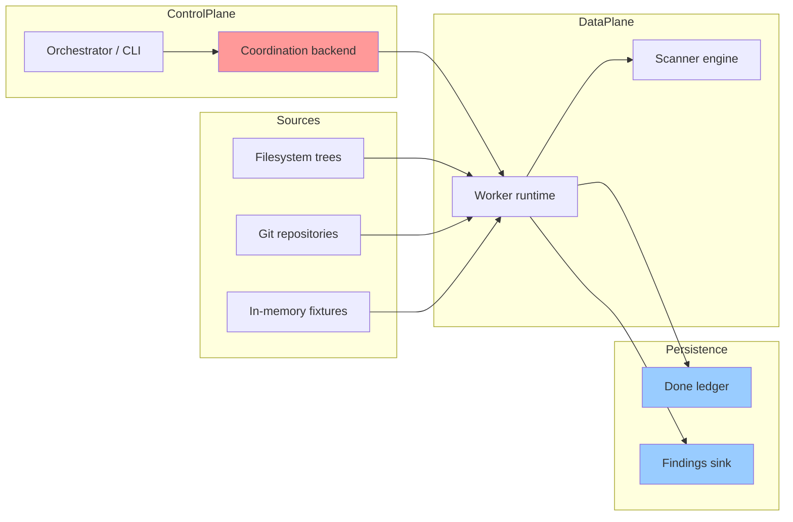

# What Problem Are We Solving?

## The Secret Sprawl Problem

Modern software development involves hundreds of third-party services: cloud providers, CI/CD systems, package registries, analytics vendors, monitoring stacks, and internal platforms. Each service requires authentication credentials: API keys, access tokens, service account keys, database passwords.

These secrets inevitably leak:

- **Hardcoded in source code**: Developers commit `.env` files, config files with hardcoded credentials, or directly embed API keys in code
- **Stored in internal documentation**: setup guides and runbooks can accidentally contain live credentials
- **Copied into local archives or exports**: tarballs, zip files, and backups preserve credentials long after the original file changes
- **Scattered across repository history and mirrors**: forks, bare mirrors, and archived repositories retain stale but still-valid credentials

Once a secret leaks, attackers find it quickly. Automated bots scan public GitHub repositories within minutes of a commit. The impact ranges from unauthorized API usage to complete infrastructure takeover.

## The Scale Challenge

A single scan target is often manageable. The hard part is the aggregate volume:

- **Many Git repositories**: each with years of history, branches, and tags
- **Large filesystem trees**: build outputs, vendored dependencies, extracted archives, and developer workspaces
- **Continuous updates**: new commits, new files, and repeated rescans under changing policies

Scanning this volume requires distributed processing. A single machine cannot:

- Enumerate all sources fast enough (API rate limits, network bandwidth)
- Store all intermediate state (memory constraints)
- Process findings in real-time (CPU limitations)

**We need to distribute the work across multiple machines.**

## The Deduplication Challenge

The same secret often appears in multiple locations:

```text
Git repo:         /srv/mirrors/acme/backend.git
Developer clone:  /home/alice/src/backend
Fork clone:       /home/bob/src/backend
Archive extract:  /tmp/backend-2023-snapshot
```

A naive scanner finds the same AWS access key 5 times and generates 5 alerts. This creates alert fatigue—security teams ignore duplicate findings.

**We need content-addressed deduplication**: the same secret gets the same identity regardless of where it's found.

This is the core insight behind **Boundary 1 (Identity & Hashing Spine)**: use cryptographic hashing to derive stable, collision-resistant identifiers for scan items, policy versions, findings, and related coordination records.

## The Tenant Isolation Requirement

The current codebase is built around **tenant-scoped identity**: `TenantId` and `TenantSecretKey` flow into identity derivation, coordination APIs, and persistence records so that work and findings stay tenant-local.

**Isolation requirements:**

1. **No cross-tenant enumeration**: Tenant A cannot discover what repositories Tenant B has scanned
2. **No cross-tenant correlation**: Tenant A cannot infer whether Tenant B found a specific secret
3. **No identifier reuse at the finding layer**: The same secret scanned by two tenants must not produce linkable tenant-scoped finding identities

This is enforced through **tenant-derived keying**: tenant-specific secret material enters secret hashing and downstream finding derivation, making cross-tenant correlation cryptographically difficult.

```text
Tenant A: SecretHash = BLAKE3-keyed(TenantSecretKey_A, normalized_secret)
Tenant B: SecretHash = BLAKE3-keyed(TenantSecretKey_B, normalized_secret)

Even if scanning the same secret, SecretHash_A != SecretHash_B
```

(This is a simplified view. BLAKE3 keyed mode incorporates the key directly into the compression IV—it is not HMAC. The actual derivation chain feeds SecretHash into FindingId via BLAKE3 derive-key mode with additional inputs like tenant, item, and rule.)

## The Exactly-Once Problem

In a distributed system, workers crash, networks partition, and requests timeout. Yet every scan item must be processed **exactly once**:

- **Not zero times**: Missing a file means missing leaked secrets (data loss)
- **Not twice**: Scanning the same item twice wastes resources and creates duplicate alerts

This is the classic **exactly-once semantics** problem in distributed systems.

The standard solution [Akidau et al., 2015]:

```
at-least-once delivery + idempotent processing = exactly-once semantics
```

Gossip-rs implements this through:

- **Bounded idempotency in coordination** (B2): shard mutations carry `OpId` values that are replay-checked against a per-shard op-log
- **Done ledger** (B5): persistent record of completed items; prevents reprocessing after crashes

## System Architecture



### Component Roles

**Orchestrator / CLI**:
- Normalizes scan requests and plans initial shard geometry
- Starts runs through the coordination layer
- Can also dispatch local direct-mode scans through the runtime

**Coordination backend**:
- Registers runs and shards
- Assigns shard leases to workers with fencing
- Tracks checkpoints, renewals, parking, and split operations

**Worker runtime**:
- Hydrates shard state from coordination
- Enumerates items from filesystem or Git sources
- Scans content for secrets using the scanner engine
- Commits findings and authoritative completion state

**Done ledger**:
- Durable record of completed work
- Prevents reprocessing after retries or crashes
- Participates in the exactly-once story

**Findings sink**:
- Durable persistence for findings, occurrences, and observations
- Supports in-memory testing backends and PostgreSQL production backends

## Why This Is Hard

The combination of requirements makes this a challenging distributed systems problem:

1. **Scale**: Millions of sources, billions of items
2. **Deduplication**: Content-addressed identity across sources
3. **Isolation**: Cryptographic tenant separation
4. **Exactly-once**: No data loss, no duplication, despite failures
5. **Performance**: enough throughput to keep up with large trees and repository history

Off-the-shelf solutions (message queues, batch processing frameworks) don't provide all these properties simultaneously. Gossip-rs is purpose-built for this problem space.

## What's Next

Now that we understand the problem, let's explore why distribution is necessary:

**[→ Next: 02-why-distributed.md](02-why-distributed.md)**

---

## References

- Akidau, Tyler et al. (2015). "The Dataflow Model: A Practical Approach to Balancing Correctness, Latency, and Cost in Massive-Scale, Unbounded, Out-of-Order Data Processing." *VLDB 2015*.
