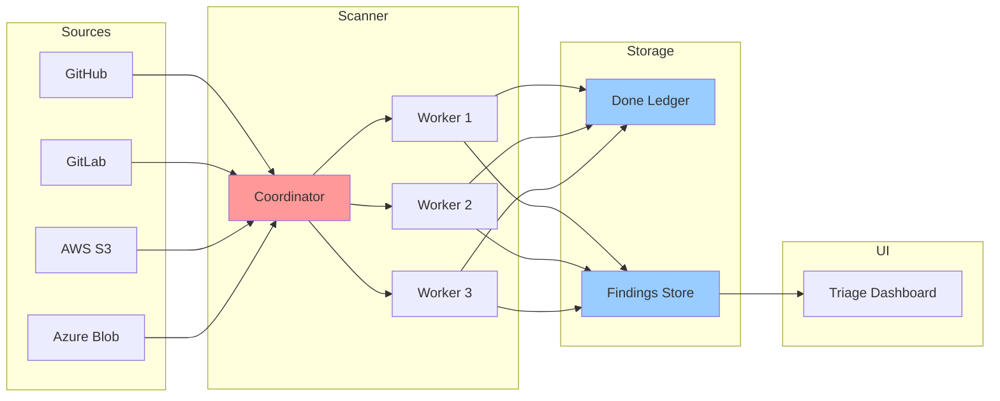

# What Problem Are We Solving?

## The Secret Sprawl Problem

Modern software development involves hundreds of third-party services: cloud providers, payment processors, analytics platforms, CI/CD systems, monitoring tools. Each service requires authentication credentials—API keys, access tokens, service account keys, database passwords.

These secrets inevitably leak:

- **Hardcoded in source code**: Developers commit `.env` files, config files with hardcoded credentials, or directly embed API keys in code
- **Stored in wikis and documentation**: Setup guides contain example credentials that are actually production keys
- **Copied to cloud storage**: S3 buckets, Azure Blob containers, Google Cloud Storage buckets often contain credential backups
- **Scattered across repositories**: Forks, mirrors, and archived repositories contain stale but still-valid credentials

Once a secret leaks, attackers find it quickly. Automated bots scan public GitHub repositories within minutes of a commit. The impact ranges from unauthorized API usage to complete infrastructure takeover.

## The Scale Challenge

A modern enterprise might have:

- **Millions of repositories**: across GitHub, GitLab, Bitbucket, Azure DevOps
- **Billions of files**: across cloud storage providers
- **Continuous updates**: thousands of commits per day, continuous S3 uploads

Scanning this volume requires distributed processing. A single machine cannot:

- Enumerate all sources fast enough (API rate limits, network bandwidth)
- Store all intermediate state (memory constraints)
- Process findings in real-time (CPU limitations)

**We need to distribute the work across multiple machines.**

## The Deduplication Challenge

The same secret often appears in multiple locations:

```
Original repo:     github.com/acme/backend
Fork 1:           github.com/alice/backend
Fork 2:           github.com/bob/backend
Archive:          github.com/acme/backend-2023-archive
Cloud backup:     s3://acme-backups/code/backend.zip
```

A naive scanner finds the same AWS access key 5 times and generates 5 alerts. This creates alert fatigue—security teams ignore duplicate findings.

**We need content-addressed deduplication**: the same secret gets the same identity regardless of where it's found.

This is the core insight behind **Boundary 1 (Identity & Hashing Spine)**: use cryptographic hashing to derive stable, collision-free identifiers for every entity (repositories, policies, scan items, findings).

## The Tenant Isolation Requirement

Gossip-rs is designed as a **multi-tenant SaaS**: multiple organizations share the same infrastructure, but each organization's data must be cryptographically isolated.

**Isolation requirements:**

1. **No cross-tenant enumeration**: Tenant A cannot discover what repositories Tenant B has scanned
2. **No cross-tenant correlation**: Tenant A cannot infer whether Tenant B found a specific secret
3. **No identifier reuse**: The same repository scanned by two tenants gets different ItemIDs

This is enforced through **tenant-derived keys** (TDK): every hash includes a secret key unique to the tenant, making identifiers cryptographically unlinkable across tenants.

```
Tenant A: SecretHash = BLAKE3-keyed(TDK_A, normalized_secret)
Tenant B: SecretHash = BLAKE3-keyed(TDK_B, normalized_secret)

Even if scanning the same secret, SecretHash_A ≠ SecretHash_B
```

(This is a simplified view. BLAKE3 keyed mode incorporates the key directly into the compression IV—it is not HMAC. The actual derivation chain feeds SecretHash into FindingId via BLAKE3 derive-key mode with additional inputs like tenant, item, and rule.)

## The Exactly-Once Problem

In a distributed system, workers crash, networks partition, and requests timeout. Yet every scan item must be processed **exactly once**:

- **Not zero times**: Missing a file means missing leaked secrets (data loss)
- **Not twice**: Scanning the same item twice wastes resources and creates duplicate alerts

This is the classic **exactly-once semantics** problem in distributed systems.

The standard solution [Akidau et al., 2015]:

```
at-least-once delivery + idempotent processing = exactly-once semantics
```

Gossip-rs implements this through:

- **Idempotency keys** (B2): every work submission includes a unique key; resubmissions are deduplicated
- **Done ledger** (B5): persistent record of completed items; prevents reprocessing after crashes

## System Architecture



### Component Roles

**Coordinator**:
- Enumerates sources (repos, buckets, wikis)
- Divides keyspace into shards
- Assigns shards to workers via time-bounded leases
- Tracks shard coverage and rebalances load

**Workers**:
- Acquire shard leases from coordinator
- Enumerate items in assigned shard (files, commits, objects)
- Scan content for secrets using detection policies
- Write findings to findings store
- Record completed items in done ledger

**Done Ledger**:
- Persistent log of processed items (one entry per ItemID)
- Prevents reprocessing after worker crashes
- Enables exactly-once semantics

**Findings Store**:
- Deduplicated findings (one record per unique secret)
- Indexed by finding hash for fast lookups
- Enriched with metadata (first seen, last seen, locations)

**Triage Dashboard**:
- Human-facing UI for reviewing findings
- Allows marking findings as false-positive, resolved, or escalated
- Tracks remediation status

## Why This Is Hard

The combination of requirements makes this a challenging distributed systems problem:

1. **Scale**: Millions of sources, billions of items
2. **Deduplication**: Content-addressed identity across sources
3. **Isolation**: Cryptographic tenant separation
4. **Exactly-once**: No data loss, no duplication, despite failures
5. **Performance**: Real-time scanning, sub-second latency for new commits

Off-the-shelf solutions (message queues, batch processing frameworks) don't provide all these properties simultaneously. Gossip-rs is purpose-built for this problem space.

## What's Next

Now that we understand the problem, let's explore why distribution is necessary:

**[→ Next: 02-why-distributed.md](02-why-distributed.md)**

---

## References

- Akidau, Tyler et al. (2015). "The Dataflow Model: A Practical Approach to Balancing Correctness, Latency, and Cost in Massive-Scale, Unbounded, Out-of-Order Data Processing." *VLDB 2015*.
