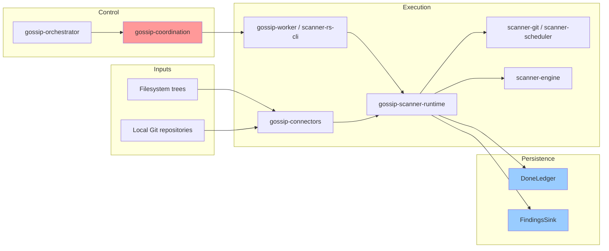

# What Problem Are We Solving?

## The Secret Sprawl Problem

Modern software development involves source trees, local mirrors, build artifacts, archives, and Git history. All of those places can carry authentication credentials—API keys, access tokens, service account keys, database passwords.

These secrets inevitably leak:

- **Hardcoded in source code**: Developers commit `.env` files, config files with hardcoded credentials, or directly embed API keys in code
- **Stored in wikis and documentation**: Setup guides contain example credentials that are actually production keys
- **Copied into archives and backups**: ZIP files, mirrored worktrees, and exported snapshots often preserve credentials long after the original secret should have been rotated
- **Scattered across repositories**: local clones, mirrors, forks, and archived repositories contain stale but still-valid credentials

Once a secret leaks, attackers find it quickly. Automated bots scan public GitHub repositories within minutes of a commit. The impact ranges from unauthorized API usage to complete infrastructure takeover.

## The Scale Challenge

A modern enterprise might have:

- **Thousands of local Git repositories**: mirrored from internal or hosted source-control systems
- **Large filesystem trees**: monorepos, home directories, build outputs, mounted volumes
- **Continuous updates**: frequent commits, generated artifacts, and repeated archive extraction

Scanning this volume requires distributed processing. A single machine cannot:

- Enumerate all sources fast enough (API rate limits, network bandwidth)
- Store all intermediate state (memory constraints)
- Process findings in real-time (CPU limitations)

**We need to distribute the work across multiple machines.**

## The Deduplication Challenge

The same secret often appears in multiple locations:

```text
Canonical repo:    /srv/mirrors/acme/backend.git
Working clone:     /home/dev/backend
Archive copy:      /backups/backend-2023.zip
Extracted tree:    /tmp/recovery/backend/
Second mirror:     /srv/mirrors/acme/backend-archive.git
```

A naive scanner finds the same AWS access key 5 times and generates 5 alerts. This creates alert fatigue—security teams ignore duplicate findings.

**We need content-addressed deduplication**: the same secret gets the same identity regardless of where it's found.

This is the core insight behind **Boundary 1 (Identity & Hashing Spine)**: use cryptographic hashing to derive stable, collision-free identifiers for every entity (repositories, policies, scan items, findings).

## The Tenant Isolation Requirement

Gossip-rs is designed as a **multi-tenant SaaS**: multiple organizations share the same infrastructure, but each organization's data must be cryptographically isolated.

**Isolation requirements:**

1. **No cross-tenant enumeration**: Tenant A cannot discover what repositories Tenant B has scanned
2. **No cross-tenant correlation**: Tenant A cannot infer whether Tenant B found a specific secret
3. **No identifier reuse**: The same repository scanned by two tenants gets different `StableItemId` values

This is enforced through a per-tenant `TenantSecretKey`: secret-derived identities are keyed per tenant, making them cryptographically unlinkable across tenants.

```
Tenant A: SecretHash = BLAKE3-keyed(TenantSecretKey_A, normalized_secret)
Tenant B: SecretHash = BLAKE3-keyed(TenantSecretKey_B, normalized_secret)

Even if scanning the same secret, SecretHash_A ≠ SecretHash_B
```

(This is a simplified view. BLAKE3 keyed mode incorporates the key directly into the compression IV—it is not HMAC. The actual derivation chain feeds SecretHash into FindingId via BLAKE3 derive-key mode with additional inputs like tenant, item, and rule.)

## The Exactly-Once Problem

In a distributed system, workers crash, networks partition, and requests timeout. Yet every scan item must be processed **exactly once**:

- **Not zero times**: Missing a file means missing leaked secrets (data loss)
- **Not twice**: Scanning the same item twice wastes resources and creates duplicate alerts

This is the classic **exactly-once semantics** problem in distributed systems.

The standard solution [Akidau et al., 2015]:

```
at-least-once delivery + idempotent processing = exactly-once semantics
```

Gossip-rs implements this through:

- **`OpId` replay detection** (B2): coordination operations carry an `OpId` and are deduplicated against a bounded per-shard op-log
- **Done ledger + receipt ordering** (B5): persistence records completed work durably and uses `PageCommit` ordering to keep findings, completion, and checkpoints in sync

## System Architecture



### Component Roles

**Orchestrator + Coordination**:
- Normalize scan requests and initial shard geometry
- Assign shard work via leases and fencing
- Track progress and coordinate retries or splits

**Worker + Runtime**:
- Acquire work from coordination (distributed mode) or run scans directly (CLI mode)
- Dispatch filesystem scans through the ordered-content runtime and Git scans through the repo runtime
- Build the engine, execute scans, and translate results into durable receipts

**Connectors and Scanner Crates**:
- `gossip-connectors` enumerates filesystem pages and exposes git-family connector contracts
- `scanner-scheduler` and `scanner-git` perform the source-specific heavy lifting
- `scanner-engine` performs rule matching and normalization

**Persistence**:
- `DoneLedger` records durable completion state
- `FindingsSink` stores stable finding, occurrence, and observation records
- `PageCommit` preserves the ordering between findings durability, completion, and checkpoints

## Why This Is Hard

The combination of requirements makes this a challenging distributed systems problem:

1. **Scale**: Millions of sources, billions of items
2. **Deduplication**: Content-addressed identity across sources
3. **Isolation**: Cryptographic tenant separation
4. **Exactly-once**: No data loss, no duplication, despite failures
5. **Performance**: High-throughput scanning without losing determinism or durability

Off-the-shelf solutions (message queues, batch processing frameworks) don't provide all these properties simultaneously. Gossip-rs is purpose-built for this problem space.

## What's Next

Now that we understand the problem, let's explore why distribution is necessary:

**[→ Next: 02-why-distributed.md](02-why-distributed.md)**

---

## References

- Akidau, Tyler et al. (2015). "The Dataflow Model: A Practical Approach to Balancing Correctness, Latency, and Cost in Massive-Scale, Unbounded, Out-of-Order Data Processing." *VLDB 2015*.
