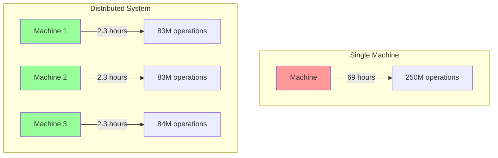
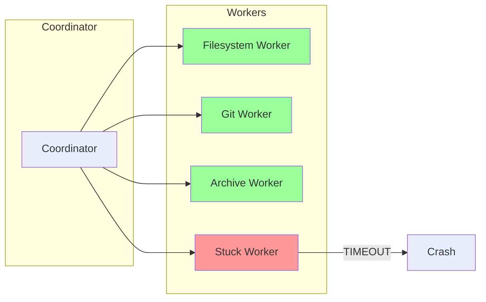

# Why Distributed?

## The Central Question

Could we build Gossip-rs as a single-process system? Why introduce the complexity of distributed coordination, failure handling, and network partitions?

The answer lies in four fundamental constraints that push us toward distribution.

## Constraint 1: Scale Drives Distribution

A single machine cannot scan all sources fast enough.

### The Numbers

Consider a medium-sized deployment:

- 10,000 Git repositories mirrored onto worker-accessible storage
- 50 commits per repository per day
- Average 100 files changed per commit
- 5 detection policies per file (API keys, AWS, GCP, database credentials, etc.)

**Total daily work**: 10,000 × 50 × 100 × 5 = **250 million detection operations per day**

If each detection takes 1ms (optimistic), that's:

```
250,000,000 ms = 250,000 seconds = 69 hours
```

A single machine would fall 3 days behind every day.

### Horizontal Scaling

The solution is horizontal scaling: add more machines to process work in parallel.



With 30 machines, we complete the same work in 2.3 hours—well within the 24-hour window.

**Distribution is not optional; it's required by the problem scale.**

## Constraint 2: Failure Isolation

In a monolithic system, one component failure brings down the entire system.

### Blast Radius

Suppose we're scanning multiple source families:

- Git repository mirrors
- Large filesystem trees
- Archive extraction jobs
- A flaky mirror-refresh or repository-open path

In a single-process system, if one repo-open or archive-expansion path hangs, the entire scanner stalls. Healthy filesystem and Git work stops even though only one source path is misbehaving.

### Isolation Through Distribution

By running separate workers or worker threads for independent shards and source families, we isolate failures:



When one worker crashes or wedges on a bad source path, the remaining workers continue processing. The blast radius is contained.

**Distribution provides fault isolation: one component failure doesn't cascade.**

## Constraint 3: Work Partitioning

We need to divide the frontier keyspace into shards and assign shards to workers.

### The Keyspace

In the current codebase, shard ownership is tracked over **ordered frontier keys**, not over a generic `ItemID` alias. Ordered-content connectors enumerate `ItemKey` values, and the Git discovery family enumerates `RepoKey` values. Coordination stores those keys as opaque byte ranges inside `ShardSpec`.

### Sharding

We partition that ordered byte keyspace into contiguous ranges called **shards**:

```
Shard 1: 0x0000...0000 to 0x3fff...ffff
Shard 2: 0x4000...0000 to 0x7fff...ffff
Shard 3: 0x8000...0000 to 0xbfff...ffff
Shard 4: 0xc000...0000 to 0xffff...ffff
```

Each worker is assigned one or more shards. When a connector emits a frontier key, the runtime checks whether that key falls inside the shard's half-open range `[start, end)`.

```rust
pub fn contains_key(&self, key: &[u8]) -> bool {
    let above_start = self.is_start_unbounded() || key >= self.key_range_start.as_ref();
    let below_end = self.is_end_unbounded() || key < self.key_range_end.as_ref();
    above_start && below_end
}
```

That is the actual `ShardSpec::contains_key` membership check from `gossip-contracts`.

**Distribution requires partitioning the global keyspace into worker-assigned shards.**

### Why Range-Based Sharding?

We could use hash-based sharding (e.g., consistent hashing), but range-based sharding has key advantages:

1. **Ordered enumeration**: Workers can enumerate frontier keys in canonical order, which keeps paging, checkpointing, and split validation simple
2. **Range splitting**: Shards can be split when they become too large, without rehashing
3. **Coverage verification**: Easy to verify that every key in the keyspace is covered by exactly one shard

This is the design used by Spanner [Corbett et al., 2012] and CockroachDB—battle-tested at Google and Cockroach Labs scale.

## Constraint 4: Exactly-Once Processing

Workers crash, networks partition, and requests timeout. Yet every item must be scanned **exactly once**.

### The Challenge

Consider this scenario:

1. Worker 1 acquires shard `[start, split)`
2. Worker 1 scans a page or repository and emits findings
3. Worker 1 crashes before the durable completion path finishes
4. Coordinator reassigns shard to Worker 2
5. Worker 2 retries the same work

Did we scan the work unit once or twice? If the first attempt committed, we've duplicated work. If it did not commit durably, the finding is lost.

### The Solution: Idempotency + Done Ledger

Gossip-rs uses two mechanisms:

**1. `OpId` replay detection (Boundary 2)**:

Lease-gated coordination operations carry an `OpId`. The coordination backend stores a bounded FIFO op-log per shard and replays the previous result if the same `(OpId, payload)` arrives again.

**2. Done ledger + ordered persistence receipts (Boundary 5)**:

A durable done ledger prevents already-committed work from being reprocessed, and `PageCommit<S>` enforces the order "findings durable -> item complete -> checkpoint durable" so retries never advance progress ahead of durable results.

```
Check done ledger → Not found → Process item → Append to done ledger
                     Found → Skip (already processed)
```

The combination guarantees exactly-once semantics even with failures:

```
at-least-once delivery + idempotent processing = exactly-once semantics
```

This is the same general strategy as the **Dataflow Model** [Akidau et al., 2015], specialized to gossip-rs's shard, receipt, and persistence contracts.

**Distribution requires mechanisms for exactly-once processing despite failures.**

## Putting It Together

Distribution is not a choice—it's forced by the problem:

| Constraint | Why Distribution | Gossip-rs Solution |
|------------|------------------|-------------------|
| **Scale** | Single machine too slow | Horizontal scaling across workers and shards |
| **Failure Isolation** | One failure shouldn't stop everything | Isolated workers and source-family runtimes |
| **Work Partitioning** | Need to divide ordered work fairly | Range-based `ShardSpec` sharding over frontier keys |
| **Exactly-Once** | Crashes and retries are inevitable | `OpId` replay detection + done ledger + `PageCommit` ordering |

The rest of this guide explains how Gossip-rs implements these solutions correctly.

## The Coordination Layer

To make distribution work, we need a coordination layer that:

1. **Assigns shards to workers** via time-bounded leases
2. **Detects worker failures** and reassigns shards
3. **Prevents split-brain** where two workers think they own the same shard
4. **Ensures exactly-once semantics** through idempotency

This is **Boundary 2 (Coordination)**, the subject of Chapters 3 and 4.

## What's Next

Now that we understand why distribution is necessary, let's look at the overall architecture:

**[→ Next: 03-architecture-at-a-glance.md](03-architecture-at-a-glance.md)**

---

## References

- Corbett, James C. et al. (2012). "Spanner: Google's Globally-Distributed Database." *OSDI 2012*.
- Akidau, Tyler et al. (2015). "The Dataflow Model: A Practical Approach to Balancing Correctness, Latency, and Cost in Massive-Scale, Unbounded, Out-of-Order Data Processing." *VLDB 2015*.
