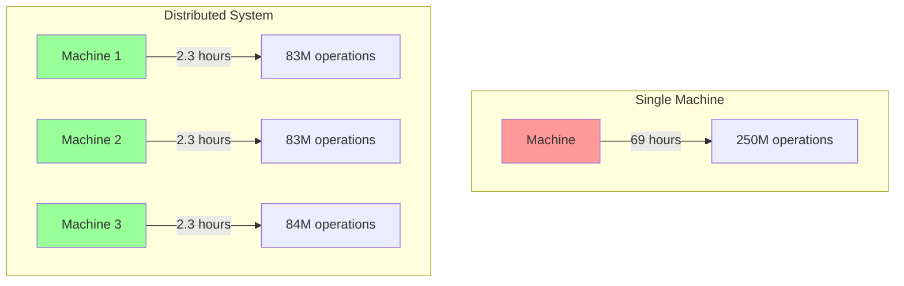
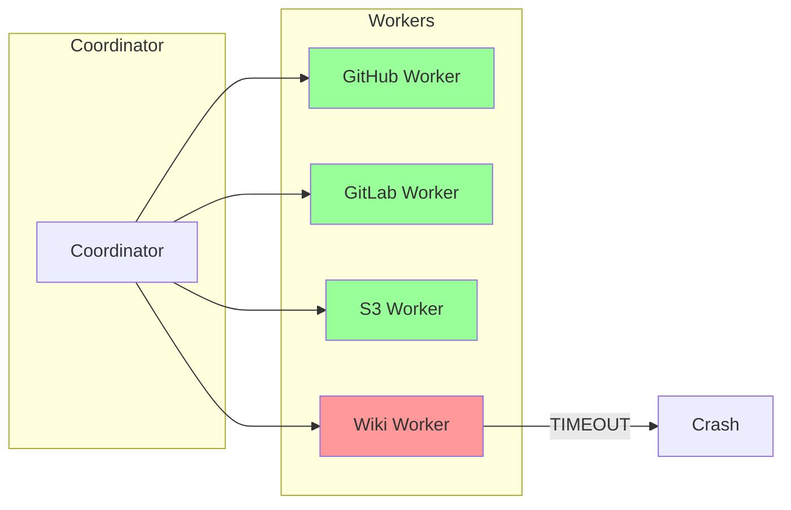

# Why Distributed?

## The Central Question

Could we build Gossip-rs as a single-process system? Why introduce the complexity of distributed coordination, failure handling, and network partitions?

The answer lies in four fundamental constraints that push us toward distribution.

## Constraint 1: Scale Drives Distribution

A single machine cannot scan all sources fast enough.

### The Numbers

Consider a medium-sized enterprise:

- 10,000 GitHub repositories
- 50 commits per repository per day
- Average 100 files changed per commit
- 5 detection policies per file (API keys, AWS, GCP, database credentials, etc.)

**Total daily work**: 10,000 × 50 × 100 × 5 = **250 million detection operations per day**

If each detection takes 1ms (optimistic), that's:

```
250,000,000 ms = 250,000 seconds = 69 hours
```

A single machine would fall 3 days behind every day.

### Horizontal Scaling

The solution is horizontal scaling: add more machines to process work in parallel.



With 30 machines, we complete the same work in 2.3 hours—well within the 24-hour window.

**Distribution is not optional; it's required by the problem scale.**

## Constraint 2: Failure Isolation

In a monolithic system, one component failure brings down the entire system.

### Blast Radius

Suppose we're scanning multiple sources:

- GitHub repositories (stable API)
- GitLab repositories (stable API)
- AWS S3 buckets (stable API)
- Internal wiki (flaky API, frequent timeouts)

In a single-process system, if the wiki API hangs, the entire scanner blocks. GitHub, GitLab, and S3 scanning stop, even though their APIs are healthy.

### Isolation Through Distribution

By running separate workers for each source type, we isolate failures:



When the wiki worker crashes due to API timeouts, GitHub, GitLab, and S3 workers continue processing. The blast radius is contained.

**Distribution provides fault isolation: one component failure doesn't cascade.**

## Constraint 3: Work Partitioning

We need to divide the global keyspace into shards and assign shards to workers.

### The Keyspace

Every scan item (file in a repo, object in S3) has a stable identifier derived from its content and location. This is the **ItemID** from Boundary 1.

The set of all ItemIDs forms a keyspace. For BLAKE3 hashes (256 bits), the keyspace is:

```
2^256 ≈ 10^77 possible ItemIDs
```

This is astronomically large—far more than the number of atoms in the observable universe.

### Sharding

We partition this keyspace into contiguous ranges called **shards**:

```
Shard 1: 0x0000...0000 to 0x3fff...ffff
Shard 2: 0x4000...0000 to 0x7fff...ffff
Shard 3: 0x8000...0000 to 0xbfff...ffff
Shard 4: 0xc000...0000 to 0xffff...ffff
```

Each worker is assigned one or more shards. When a worker computes an ItemID, it checks whether the ID falls in its assigned range. If yes, it processes the item; otherwise, it ignores it.

```rust
fn should_process(item_id: &ItemID, shard_range: &Range) -> bool {
    shard_range.contains(item_id.as_bytes())
}
```

**Distribution requires partitioning the global keyspace into worker-assigned shards.**

### Why Range-Based Sharding?

We could use hash-based sharding (e.g., consistent hashing), but range-based sharding has key advantages:

1. **Ordered enumeration**: Workers can enumerate items in key order, enabling efficient done ledger lookups
2. **Range splitting**: Shards can be split when they become too large, without rehashing
3. **Coverage verification**: Easy to verify that every key in the keyspace is covered by exactly one shard

This is the design used by Spanner [Corbett et al., 2012] and CockroachDB—battle-tested at Google and Cockroach Labs scale.

## Constraint 4: Exactly-Once Processing

Workers crash, networks partition, and requests timeout. Yet every item must be scanned **exactly once**.

### The Challenge

Consider this scenario:

1. Worker 1 acquires shard [0x0000...0000, 0x3fff...ffff]
2. Worker 1 scans item `0x1234...5678` and finds a secret
3. Worker 1 crashes before writing to done ledger
4. Coordinator reassigns shard to Worker 2
5. Worker 2 scans item `0x1234...5678` again

Did we scan the item once or twice? If the first scan completed, we've duplicated work. If it didn't complete, the finding is lost.

### The Solution: Idempotency + Done Ledger

Gossip-rs uses two mechanisms:

**1. Idempotency Keys (Boundary 2)**:

Every work submission includes a unique idempotency key derived from the ItemID and operation. Resubmissions with the same key are deduplicated.

```rust
// Conceptual pseudocode -- the actual implementation uses OpId with a
// BLAKE3 payload hash and a 16-entry FIFO ring buffer op-log per shard,
// not a standalone IdempotencyKey struct.
struct WorkSubmission {
    item_id: ItemID,
    operation: Operation,
    op_id: OpId, // BLAKE3 payload hash for replay detection
}
```

**2. Done Ledger (Boundary 5)**:

A persistent, append-only log of completed items. Before processing an item, workers check the done ledger. After processing, they append an entry.

```
Check done ledger → Not found → Process item → Append to done ledger
                     Found → Skip (already processed)
```

The combination guarantees exactly-once semantics even with failures:

```
at-least-once delivery + idempotent processing = exactly-once semantics
```

This is the **Dataflow Model** [Akidau et al., 2015], used by Google Cloud Dataflow, Apache Beam, and Flink.

**Distribution requires mechanisms for exactly-once processing despite failures.**

## Putting It Together

Distribution is not a choice—it's forced by the problem:

| Constraint | Why Distribution | Gossip-rs Solution |
|------------|------------------|-------------------|
| **Scale** | Single machine too slow | Horizontal scaling with 30+ workers |
| **Failure Isolation** | One failure shouldn't stop everything | Separate workers per source type |
| **Work Partitioning** | Need to divide keyspace | Range-based sharding (Boundary 3) |
| **Exactly-Once** | Crashes and retries are inevitable | Idempotency keys + done ledger |

The rest of this guide explains how Gossip-rs implements these solutions correctly.

## The Coordination Layer

To make distribution work, we need a coordination layer that:

1. **Assigns shards to workers** via time-bounded leases
2. **Detects worker failures** and reassigns shards
3. **Prevents split-brain** where two workers think they own the same shard
4. **Ensures exactly-once semantics** through idempotency

This is **Boundary 2 (Coordination)**, the subject of Chapters 3 and 4.

## What's Next

Now that we understand why distribution is necessary, let's look at the overall architecture:

**[→ Next: 03-architecture-at-a-glance.md](03-architecture-at-a-glance.md)**

---

## References

- Corbett, James C. et al. (2012). "Spanner: Google's Globally-Distributed Database." *OSDI 2012*.
- Akidau, Tyler et al. (2015). "The Dataflow Model: A Practical Approach to Balancing Correctness, Latency, and Cost in Massive-Scale, Unbounded, Out-of-Order Data Processing." *VLDB 2015*.
