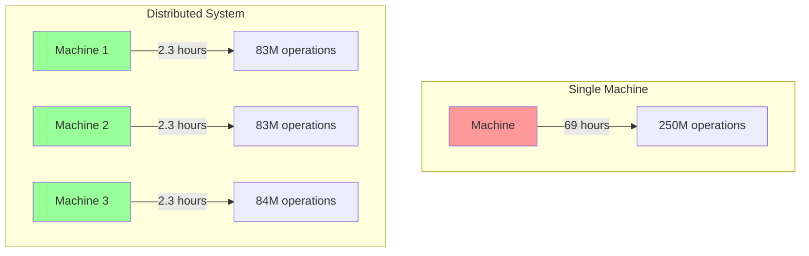
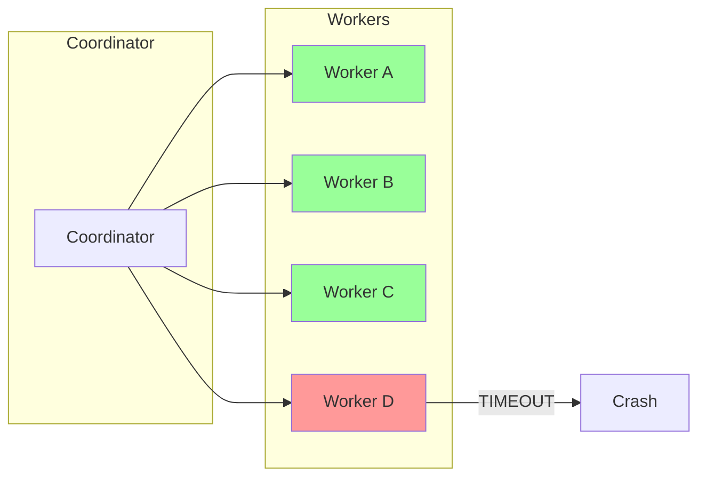

# Why Distributed?

## The Central Question

Could we build Gossip-rs as a single-process system? Why introduce the complexity of distributed coordination, failure handling, and network partitions?

The answer lies in four constraints that push the current codebase toward distribution whenever scans become large enough or need durable coordination.

## Constraint 1: Scale Drives Distribution

A single machine cannot scan all sources fast enough.

### The Numbers

Consider a fleet scanning local Git mirrors and filesystem trees:

- 10,000 Git repositories
- 50 new commits per repository per day
- Average 100 files changed per commit
- 5 detection policies per file

**Total daily work**: 10,000 × 50 × 100 × 5 = **250 million detection operations per day**

If each detection takes 1ms (optimistic), that's:

```
250,000,000 ms = 250,000 seconds = 69 hours
```

A single machine would fall 3 days behind every day.

### Horizontal Scaling

The solution is horizontal scaling: add more machines to process work in parallel.



With 30 machines, we complete the same work in 2.3 hours—well within the 24-hour window.

**Distribution is not optional; it's required by the problem scale.**

## Constraint 2: Failure Isolation

In a monolithic system, one component failure brings down the entire system.

### Blast Radius

Suppose we're scanning multiple runs:

- Git repository history walks
- Large filesystem trees
- Archive expansion and nested content decoding
- A pathological repository that triggers repeated retries

In a single-process system, one slow or wedged scan can stall unrelated work. A huge Git repository, a slow filesystem walk, or repeated retryable errors in one shard all consume the same process budget.

### Isolation Through Distribution

By running separate workers and shard leases, we isolate failures:



When one worker crashes or parks a shard due to repeated failures, other workers continue processing other shards. The blast radius is contained.

**Distribution provides fault isolation: one component failure doesn't cascade.**

## Constraint 3: Work Partitioning

We need to divide the scan frontier into shards and assign shards to workers.

### The Keyspace

The current code does **not** shard over `StableItemId` values. `StableItemId` is an identity primitive used for deduplication and finding derivation after enumeration.

Work partitioning happens over connector-native, lexicographically ordered byte ranges described by `ShardSpec` and `ShardSpecRef`. Examples include:

- filesystem path ranges encoded as `PathKey`
- manifest row ranges encoded as `ManifestRowKey`
- connector-specific metadata carried alongside the byte range

### Sharding

We partition these byte-ordered keyspaces into half-open ranges called **shards**:

```
Shard 1: [b\"\", b\"m\")
Shard 2: [b\"m\", b\"t\")
Shard 3: [b\"t\", b\"\")
```

Each worker is assigned one or more shards. Connectors enumerate keys in order, workers compare those keys against shard boundaries, and cursor checkpoints record how far through the range the worker has made authoritative progress.

```rust
use gossip_contracts::coordination::ShardSpecRef;

let shard = ShardSpecRef::with_range(b"src/", b"target/");
```

**Distribution requires partitioning the scan frontier into worker-assigned shards.**

### Why Range-Based Sharding?

The current code uses range-based sharding because it matches connector enumeration and coordinator cursor tracking:

1. **Ordered enumeration**: connectors and cursors advance in key order
2. **Range splitting**: `split_replace` and `split_residual` operate on contiguous child ranges
3. **Coverage verification**: manifest validation can check for gaps and overlaps in shard ranges

This is the same family of design used by systems such as Bigtable, Spanner, and CockroachDB: ordered keys, half-open ranges, and explicit split points.

## Constraint 4: Exactly-Once Processing

Workers crash, networks partition, and requests timeout. Yet every item must be scanned **exactly once**.

### The Challenge

Consider this scenario:

1. Worker 1 acquires shard `[b"src/", b"target/")`
2. Worker 1 scans an item inside that range and finds a secret
3. Worker 1 crashes before writing to done ledger
4. Coordinator reassigns shard to Worker 2
5. Worker 2 scans the same item again

Did we scan the item once or twice? If the first scan completed, we've duplicated work. If it didn't complete, the finding is lost.

### The Solution: Idempotency + Done Ledger

Gossip-rs uses two mechanisms:

**1. Bounded idempotency in coordination (Boundary 2)**:

Shard mutations such as checkpoint, complete, park, and split carry an `OpId`. The coordination layer keeps a bounded per-shard op-log so exact replays can be detected without introducing an unbounded dedup structure.

**2. Done Ledger (Boundary 5)**:

A persistent, append-only log of completed items. Before processing an item, workers check the done ledger. After processing, they append an entry.

```
Check done ledger → Not found → Process item → Append to done ledger
                     Found → Skip (already processed)
```

The combination guarantees exactly-once semantics even with failures:

```
at-least-once delivery + idempotent processing = exactly-once semantics
```

This is the **Dataflow Model** [Akidau et al., 2015], used by Google Cloud Dataflow, Apache Beam, and Flink.

**Distribution requires mechanisms for exactly-once processing despite failures.**

## Putting It Together

Distribution is not a choice—it's forced by the problem:

| Constraint | Why Distribution | Gossip-rs Solution |
|------------|------------------|-------------------|
| **Scale** | Single machine too slow | Horizontal scaling with 30+ workers |
| **Failure Isolation** | One failure shouldn't stop everything | Separate workers and shard leases |
| **Work Partitioning** | Need to divide ordered scan space | `ShardSpec` byte ranges + Boundary 3 key encoding |
| **Exactly-Once** | Crashes and retries are inevitable | `OpId` replay detection + done ledger |

The rest of this guide explains how Gossip-rs implements these solutions correctly.

## The Coordination Layer

To make distribution work, we need a coordination layer that:

1. **Assigns shards to workers** via time-bounded leases
2. **Detects worker failures** and reassigns shards
3. **Prevents split-brain** where two workers think they own the same shard
4. **Ensures exactly-once semantics** through idempotency

This is **Boundary 2 (Coordination)**, which the guide covers in the section on coordination and leases.

## What's Next

Now that we understand why distribution is necessary, let's look at the overall architecture:

**[→ Next: 03-architecture-at-a-glance.md](03-architecture-at-a-glance.md)**

---

## References

- Corbett, James C. et al. (2012). "Spanner: Google's Globally-Distributed Database." *OSDI 2012*.
- Akidau, Tyler et al. (2015). "The Dataflow Model: A Practical Approach to Balancing Correctness, Latency, and Cost in Massive-Scale, Unbounded, Out-of-Order Data Processing." *VLDB 2015*.
