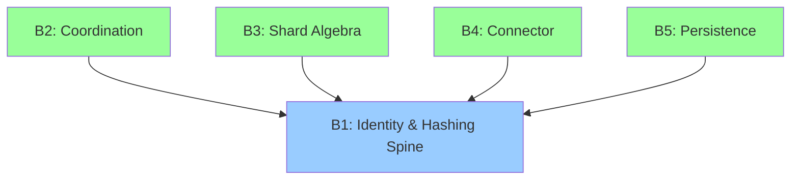
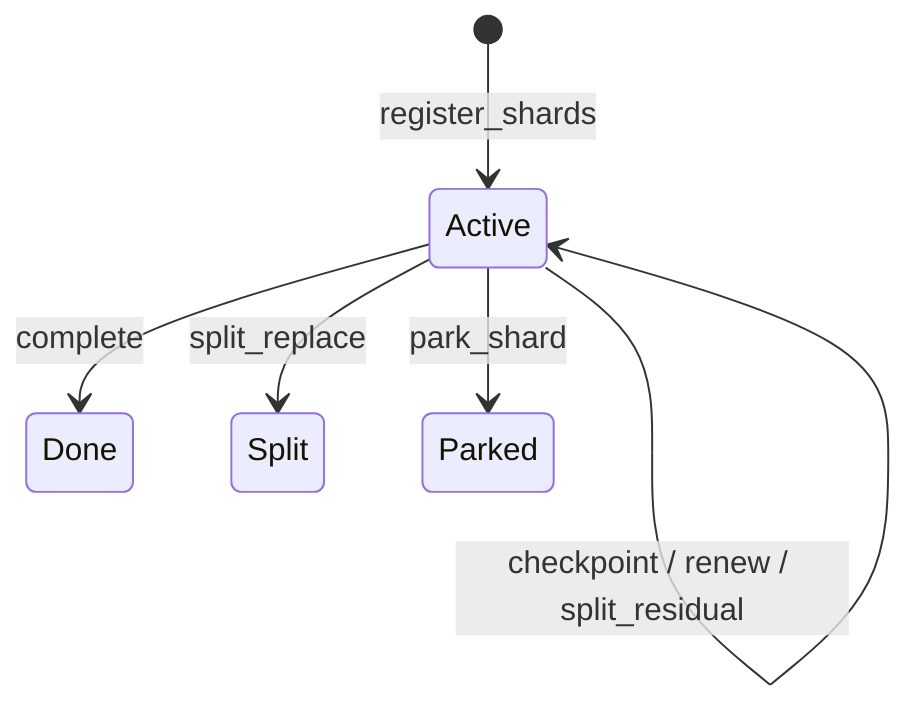
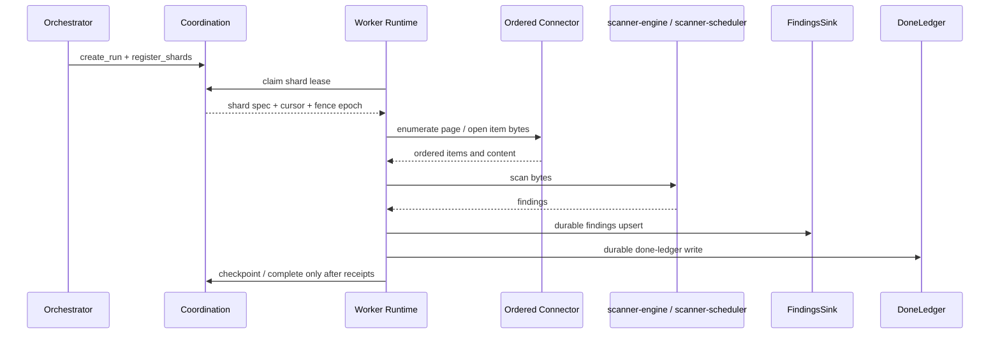

# Architecture at a Glance

## The Five-Boundary Model

Gossip-rs is still organized around five major boundaries, but the current implementation spreads those boundaries across several crates rather than collapsing everything into one module tree.



### The Dependency Rule

At the boundary-contract level, **B1 is the leaf**:

- `identity` in `gossip-contracts` depends on no sibling boundary module
- coordination, connector, shard-algebra, and persistence types all consume B1 identifiers
- runtime crates compose those boundaries into executable worker flows

That keeps the identity model pure and reusable while letting higher layers add lease semantics, shard math, connector behavior, and durable persistence.

## Boundary 1: Identity & Hashing Spine

**Purpose**: Provide deterministic, domain-separated identities for items, secrets, findings, versions, runs, shards, and policies.

**Key Types**:

- `TenantId`: stable tenant identity
- `PolicyHash`: digest of policy configuration
- `StableItemId`: logical item identity derived from connector scope plus locator
- `SecretHash`: tenant-scoped secret identity
- `FindingId`: stable finding identity `(tenant, item, rule, secret)`
- `OccurrenceId` / `ObservationId`: version- and policy-scoped follow-on identities

**Invariants**:

- Deterministic derivation: same inputs produce the same IDs
- Canonical encoding: logically equal inputs hash the same way
- Tenant isolation for tenant-scoped identities: `SecretHash`, `FindingId`, and `ObservationId` remain unlinkable across tenants

**Status**: ✅ **Fully implemented** (11 source files in `crates/gossip-contracts/src/identity/`, golden vectors, unit tests, property tests)

**Code**: `crates/gossip-contracts/src/identity/`

See **[→ Boundary 1](../02-boundary-1-identity-spine/01-identity-problem-space.md)** for the full walkthrough.

## Boundary 2: Coordination

**Purpose**: Manage shard lifecycle through leases, fence epochs, bounded replay detection, run management, and shard claiming.

**Key Protocols**:

1. **Lease acquisition** via `acquire_and_restore_into`
2. **Lease renewal** via `renew`
3. **Fencing** via monotonic `FenceEpoch`
4. **Bounded idempotency** via a 16-entry FIFO per-shard op-log
5. **Run and claim management** via `RunManagement`, `ShardClaiming`, and `CoordinationFacade`

**State Machine**:



`Done`, `Split`, and `Parked` are terminal inside the coordination protocol. `unpark_shard` lives on the run-management surface, not the shard-lifecycle trait.

**Status**: ✅ **Fully implemented**

- `gossip-contracts/src/coordination/`: shared data model and split planning core
- `gossip-coordination/`: protocol traits, in-memory reference backend, session wrapper, simulation harness
- `gossip-coordination-etcd/`: durable etcd-backed backend

See **[→ Boundary 2](../04-boundary-2-coordination/01-the-coordination-problem.md)** for the full protocol.

## Boundary 3: Shard Algebra

**Purpose**: Translate typed connector keys into the ordered byte ranges used by coordination, and provide the arithmetic needed to split those ranges safely.

**Key Components**:

- `KeyEncoding`
- `PathKey`
- `ManifestRowKey`
- `prefix_successor`, `key_successor`, `byte_midpoint`
- `ShardHint`, `ShardMetadata`
- `PreallocShardBuilder`

**Invariants**:

- Encoded keys preserve logical ordering
- Encodings are canonical and deterministic
- Range arithmetic stays allocation-free on the hot path

**Status**: ✅ **Fully implemented** (7 source files in `gossip-frontier/src/`, plus dedicated tests)

**Code**: `crates/gossip-frontier/src/`

See **[→ Boundary 3](../05-boundary-3-shard-algebra/01-the-translation-layer.md)** for the shard-algebra section.

## Boundary 4: Connector

**Purpose**: Expose family-specific source contracts for ordered enumeration and repository-native execution, while keeping source-owned bytes and retry posture explicit.

**Current Surface**:

1. **Shared connector vocabulary** in `gossip-contracts/src/connector/`
2. **Ordered-content contract** for page-based enumerators with resumable cursors
3. **Git repo-frontier contracts** for discovery, mirroring, and execution
4. **Error classification** through `ErrorClass`
5. **Ordered-content implementations** in `gossip-connectors`: in-memory and filesystem connectors
6. **Git contract implementations** in `gossip-scanner-runtime`: `StaticGitRepoDiscoverySource`, `LocalMirrorManager`, and `ScannerGitExecutor`
7. **Conformance harness** through `run_ordered_content_conformance`
8. **Git shard payload plumbing** in `gossip-orchestrator`, rather than a concrete Git connector in `gossip-connectors`

**Status**: ✅ **Fully implemented for the ordered-content surface** (10 contract files in `gossip-contracts/src/connector/`, 8 source files in `gossip-connectors/src/`, with repo-native Git execution living in `gossip-scanner-runtime`, `scanner-git`, and Git shard payload handling in `gossip-orchestrator`)

**Code**: `crates/gossip-contracts/src/connector/`, `crates/gossip-connectors/`, the Git runtime bridge in `crates/gossip-scanner-runtime/`, and Git shard payload handling in `crates/gossip-orchestrator/`

See **[→ Boundary 4](../06-boundary-4-connector/01-connector-problem-space.md)** for the connector section.

## Boundary 5: Persistence

**Purpose**: Make scan progress and findings durable without cross-store transactions.

**Key Components**:

1. `DoneLedger`: idempotent durable record of processed object versions
2. `FindingsSink`: durable upsert surface for findings, occurrences, and observations
3. `PageCommit<S>`: typestate machine enforcing findings → done-ledger → checkpoint ordering
4. In-memory reference backends in `gossip-persistence-inmemory`
5. PostgreSQL backends in `gossip-done-ledger-postgres` and `gossip-findings-postgres`

**Important distinction**:

`CommitSink` and `CliNoOpCommitSink` live in `gossip-scanner-runtime` as runtime bridge types, while the distributed path uses the receipt-driven `distributed` module plus `commit_pipeline` and `checkpoint_aggregator` to turn scan results into durable findings, done-ledger writes, and checkpoint advancement.

**Status**: ✅ **Fully implemented** across contracts, in-memory backends, PostgreSQL backends, and receipt-driven runtime adapters

See **[→ Boundary 5](../07-boundary-5-persistence/01-persistence-problem-space.md)** for the persistence section.

## Project Status Summary

| Boundary | Current implementation |
|----------|------------------------|
| **B1: Identity** | Complete in `gossip-contracts/src/identity/` |
| **B2: Coordination** | Complete in-memory and etcd-backed protocol surface |
| **B3: Shard Algebra** | Complete in `gossip-frontier` |
| **B4: Connector** | Complete ordered-content contract plus in-memory/filesystem implementations; repo-native Git execution uses connector contracts and runtime code rather than a concrete `gossip-connectors` adapter |
| **B5: Persistence** | Complete contract, in-memory, PostgreSQL, and receipt-driven runtime composition |

## Mapping to Crate Structure

The crate layout today is easiest to read as layers rather than as one giant dependency graph:

```text
Foundation
  gossip-contracts
  gossip-stdx

Boundary implementations
  gossip-frontier
  gossip-coordination
  gossip-coordination-etcd
  gossip-connectors
  gossip-persistence-inmemory
  gossip-done-ledger-postgres
  gossip-findings-postgres
  gossip-pg-common

Scanner and orchestration
  scanner-engine
  scanner-scheduler
  scanner-git
  gossip-orchestrator
  gossip-scanner-runtime

Binaries
  gossip-worker
  scanner-rs-cli

Integration and tooling
  scanner-engine-integration-tests
  dev-seed
```

### Crate Responsibilities

- **`gossip-contracts`**: shared identity types, coordination data model, connector contracts, persistence contracts, and pure validation logic
- **`gossip-stdx`**: low-level utility types such as `RingBuffer`, `InlineVec`, and `ByteSlab`
- **`gossip-frontier`**: ordered-key encoding, shard hints, split arithmetic, and preallocated shard builders
- **`gossip-coordination`**: coordination traits, state machine, in-memory reference backend, `WorkerSession`, and deterministic simulation harness
- **`gossip-coordination-etcd`**: durable etcd-backed coordination backend
- **`gossip-connectors`**: in-memory and filesystem ordered-content connectors plus shared support utilities such as the streaming split estimator
- **`gossip-persistence-inmemory`**: reference in-memory done-ledger and findings-sink backends
- **`gossip-pg-common`**: shared PostgreSQL helpers, migrations, and test-support utilities
- **`gossip-done-ledger-postgres`**: PostgreSQL done-ledger backend
- **`gossip-findings-postgres`**: PostgreSQL findings backend and read-side helpers
- **`scanner-engine`**: detection engine, rule compilation, transforms, and scan-loop data structures
- **`scanner-scheduler`**: filesystem scan scheduling, archive handling, and execution primitives
- **`scanner-git`**: Git repository scanning pipeline
- **`gossip-orchestrator`**: request normalization, initial shard planning, shard payload encoding, and run setup
- **`gossip-scanner-runtime`**: direct and distributed runtime composition across filesystem connectors, Git repo-frontier execution, coordination, orchestration, and scanner crates, including the concrete Git discovery, mirror, and executor adapters
- **`gossip-worker`**: worker binary that can launch local scans or the production distributed path
- **`scanner-rs-cli`**: standalone CLI binary for direct scanning
- **`dev-seed`**: local developer tool for seeding filesystem runs, applying PostgreSQL migrations, and inspecting persistence row counts

## Cross-Boundary Data Flow

A distributed filesystem shard now looks roughly like this:



Two details matter:

- identity and persistence are deterministic, so retries converge instead of multiplying state
- coordination only advances progress after the durable path confirms what was actually committed

Git distributed runs use the separate repo-frontier worker loop in `gossip-scanner-runtime::distributed`: the worker hydrates a Git shard payload from `gossip-orchestrator`, executes the repository path through `scanner-git`, and only then finalizes shard progress through the durable receipt path.

## What's Next

Now that you have the architectural map, the next chapter explains how to read the rest of this guide efficiently:

**[→ Next: 04-how-to-read-this-guide.md](04-how-to-read-this-guide.md)**

---

## References

- Corbett, James C. et al. (2012). "Spanner: Google's Globally-Distributed Database." *OSDI 2012*.
- Kleppmann, Martin (2016). "How to do distributed locking." *Blog post*.
- Gray, Cary & David Cheriton (1989). "Leases: An Efficient Fault-Tolerant Mechanism for Distributed File Cache Consistency." *SOSP 1989*.
