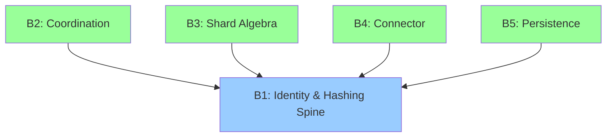
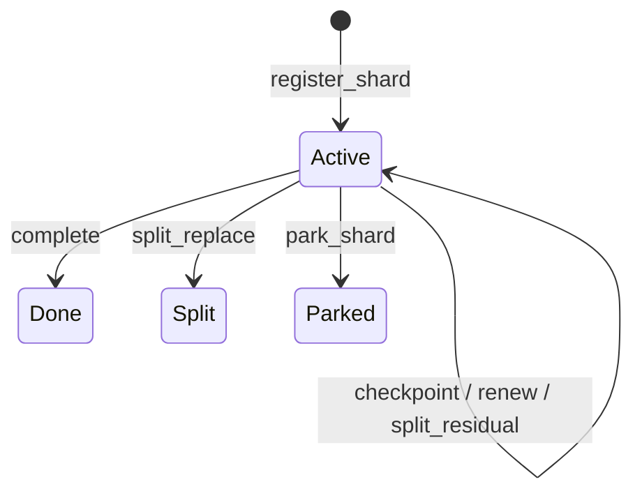
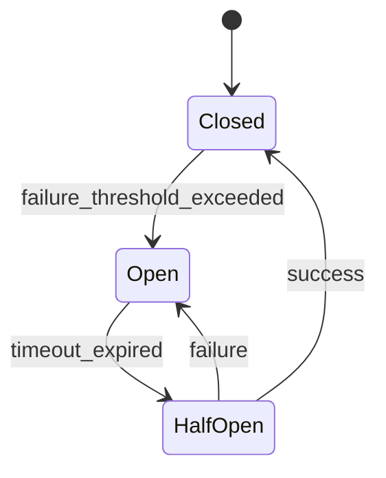
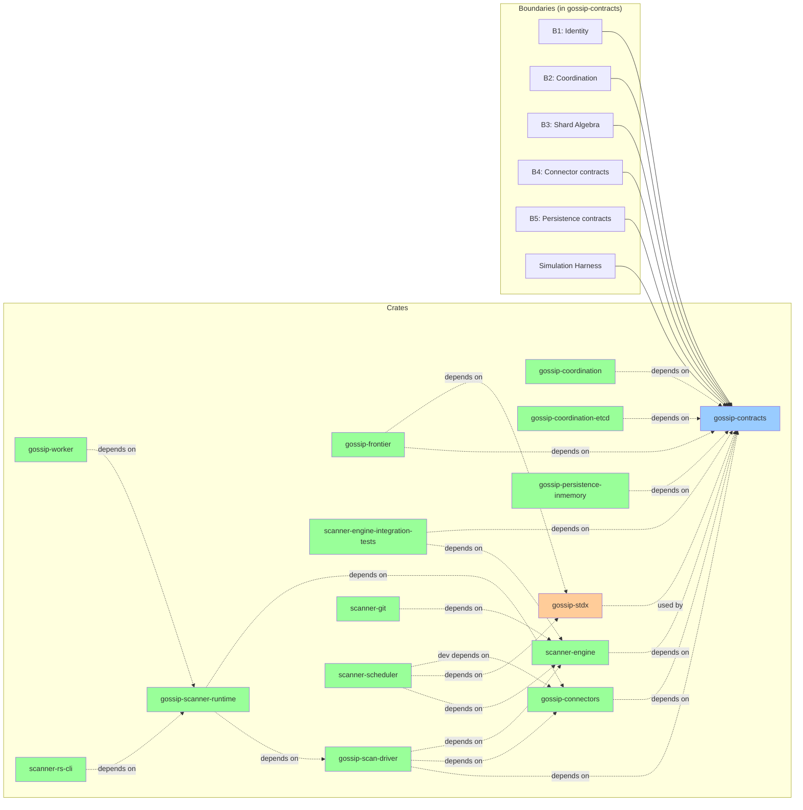
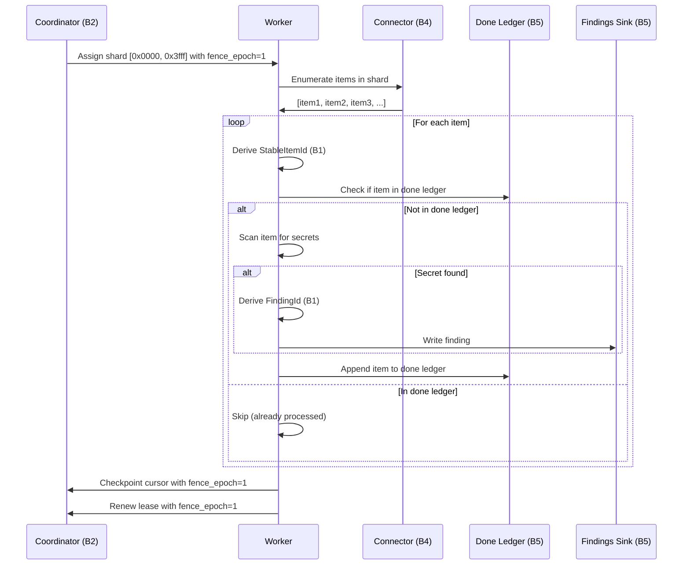

# Architecture at a Glance

## The Five-Boundary Model

Gossip-rs is organized into five major boundaries, each with a clear contract and responsibility. This modular design ensures that concerns are separated and dependencies flow in one direction.



### The Acyclic Dependency Rule

**B1 depends on nothing. All other boundaries depend on B1.**

This is the foundational principle of Gossip-rs architecture:

- **B1 (Identity)** provides stable, content-addressed identifiers for all entities
- **B2 (Coordination)** uses B1 identifiers to track shard ownership
- **B3 (Shard Algebra)** uses B1 identifiers as shard boundaries
- **B4 (Connector)** uses B1 identifiers for scan items
- **B5 (Persistence)** uses B1 identifiers to index the done ledger

No boundary depends on boundaries at the same level or higher. This prevents circular dependencies and makes testing straightforward—we can test B1 in isolation, then test B2-B5 with a mock B1.

## Boundary 1: Identity & Hashing Spine

**Purpose**: Provide collision-free, content-addressed identifiers for all entities in the system.

**Key Types**:

- `TenantId`: 32-byte stable tenant identity (multi-tenant isolation root)
- `PolicyHash`: Cryptographic digest of detection rules and configuration
- `StableItemId`: 32-byte stable identifier for a scan item
- `FindingId`: Version-stable finding identity (tenant + item + rule + secret)

**Invariants**: 37 safety and liveness invariants, including:

- **INV-S01**: Deterministic derivation—same input always produces same ID
- **INV-S02**: Collision resistance—probability of collision is negligible (< 2^-128)
- **INV-S03**: Tenant isolation—IDs from different tenants are cryptographically unlinkable

**Status**: ✅ **Fully implemented** (11 files, zero unsafe code, exhaustive property tests)

**Code**: `crates/gossip-contracts/src/identity/`

See **[→ Chapter 02: Boundary 1](../02-boundary-1-identity-spine/)** for complete specification.

## Boundary 2: Coordination

**Purpose**: Assign shards to workers via time-bounded leases with fencing tokens to prevent split-brain. Manage run lifecycle, shard claiming, and bounded idempotency.

**Key Protocols**:

1. **Lease Acquisition**: Worker requests shard lease via `acquire_and_restore_into`
2. **Lease Renewal**: Worker extends lease before expiry via `renew`
3. **Fencing Tokens**: Monotonically increasing `FenceEpoch` values prevent stale writes
4. **Bounded Idempotency**: 16-entry FIFO op-log per shard for replay detection
5. **Shard Claiming**: `claim_next_available` scans candidates and acquires the first available

**State Machine**:



All transitions originate from `Active`. `Done`, `Split`, and `Parked` are terminal within the coordination protocol. Unparking (`Parked → Active`) is an out-of-band admin operation.

**Trait Hierarchy**:

```text
CoordinationFacade
  ├── CoordinationBackend  (shard lifecycle: acquire, checkpoint, complete, park, split, renew)
  ├── RunManagement        (run lifecycle: create, register, complete, fail, cancel)
  └── ShardClaiming        (shard assignment: claim_next_available)
```

**Invariants** (verified by deterministic simulation at every step):

- **S1 (MutualExclusion)**: At most one worker holds a non-expired lease per shard
- **S2 (FenceMonotonicity)**: `fence_epoch` never decreases per shard
- **S3 (TerminalIrreversibility)**: Terminal states never revert to non-terminal
- **S4 (RecordInvariant)**: `ShardRecord::validate_invariants()` returns `Ok`
- **S5 (CursorMonotonicity)**: `cursor.last_key()` never decreases per shard
- **S6 (CursorBounds)**: Cursors remain within shard spec key range
- **S7 (SplitCoverage)**: Split children exactly partition parent's range
- **S8 (RunTerminalIrreversibility)**: Terminal run states (`Done`, `Failed`, `Cancelled`) never revert
- **S9 (CooldownViolation)**: A worker must not claim twice within `cooldown_interval` ticks

**Status**: ✅ **Fully implemented** (25 source files in gossip-coordination — 17 core + 8 sim modules, 8 contract files in gossip-contracts/coordination, ~35K lines, reference in-memory backend, deterministic simulation harness, TLA+ formal specification)

**Code**: `crates/gossip-contracts/src/coordination/` and `crates/gossip-coordination/`

See **[→ Chapter 04: Boundary 2](../04-boundary-2-coordination/)** for complete specification.

## Boundary 3: Shard Algebra

**Purpose**: Provide key-encoding, range arithmetic, and shard-hint wire framing for partitioning the global keyspace into contiguous ranges.

**Key Components** (in the `gossip-frontier` crate):

- **`KeyEncoding` trait**: Defines how keys serialize to and compare as byte sequences
- **`PathKey` / `ManifestRowKey`**: Concrete key types for filesystem paths and manifest rows
- **`prefix_successor` / `byte_midpoint`**: Range arithmetic for computing split points and successor keys
- **`ShardHint` / `ShardMetadata`**: Wire-level framing for shard boundary hints and metadata
- **`PreallocShardBuilder`**: Startup-time builder for constructing shard specifications

**Invariants**:

- **Ordering contract**: `KeyEncoding::encode` preserves total order--byte comparison of encoded forms matches logical comparison of keys
- **Canonicality**: Each logical key has exactly one encoded representation
- **Zero-allocation design**: Range arithmetic operates on borrowed byte slices; no heap allocation on the hot path

**Status**: ✅ **Fully implemented** (7 source files, 1,842 lines of tests, `#![forbid(unsafe_code)]`)

**Code**: `crates/gossip-frontier/src/`

See **[→ Chapter 04: Boundary 2, Chapters 7-9](../04-boundary-2-coordination/07-why-splits-exist.md)** for shard algebra coverage within the coordination protocol.

## Boundary 4: Connector

**Purpose**: Enumerate scan items from external sources (GitHub, GitLab, S3, etc.) and handle API failures gracefully. Provide type-safe value wrappers for toxic byte content and monotonic cursor advancement for deterministic enumeration.

**Key Components**:

1. **Toxic Byte Value Wrappers**: Type-safe wrappers (`ToxicBlob`, `ToxicStr`) that prevent raw byte content from leaking into safe code paths
2. **Source Enumeration**: Plan and split work via connector capabilities (`caps`, `choose_split_point`)
3. **Read Connectors**: Fetch content for individual items (`open`, `read_range`)
4. **Circuit Breakers**: Detect and isolate failing APIs to prevent cascade failures (Closed → Open → HalfOpen state machine)
6. **In-Memory Connector**: Deterministic connector for testing with configurable fault injection
7. **Filesystem Connector**: Production connector for local directory tree enumeration
8. **Git Connector**: Production connector for git repository scanning
9. **Conformance Harness**: Reusable test suite that validates any connector implementation against the contract

**Circuit Breaker State Machine**:



**Invariants**:

- **INV-S30**: Every enumerated item has a valid ItemID
- **INV-S31**: Enumeration is deterministic (same items in same order)
- **INV-L30**: If source API is healthy, enumeration eventually completes

**Status**: ✅ **Fully implemented** (5 contract files in `gossip-contracts`, 11 implementation files in `gossip-connectors` — in-memory, filesystem, git connectors plus common, scan-driver adapter, split estimator, and lib, conformance harness, 8 guide chapters covering ~34,440 words)

**Code**: `crates/gossip-contracts/src/connector/` and `crates/gossip-connectors/`

See **[→ Chapter 06: Boundary 4](../06-boundary-4-connector/)** for complete specification.

## Boundary 5: Persistence

**Purpose**: Durably record completed work (done ledger) and detected findings (findings sink) with exactly-once semantics.

**Key Components**:

1. **CommitSink**: Per-item commit lifecycle trait (`begin_item` → `upsert_findings` → `finish_item`)
2. **FindingRecord**: Compact 5-field finding struct (`rule_id`, `start`, `end`, `norm_hash`, `confidence_score`)
3. **NoOpCommitSink**: Zero-cost test double for CLI and direct-mode scans
4. **Domain tags**: `OVID_V1`, `DONE_LEDGER_KEY_V1`, `TRIAGE_GROUP_KEY_V1` registered for future persistence types

**Invariants**:

- **INV-S40**: Done ledger entries are immutable once written
- **INV-S41**: Idempotency key appears at most once in done ledger
- **INV-L40**: If item is processed, done ledger eventually contains entry

**Status**: 🔧 **Contracts defined, reference in-memory backend implemented** (`gossip-persistence-inmemory` crate provides `InMemoryDoneLedger` and `InMemoryFindingsSink` with lattice merge semantics, idempotent writes, delayed-completion mode for simulation, and fault injection)

See **[→ Chapter 07: Boundary 5](../07-boundary-5-persistence/)** for complete specification.

## Project Status Summary

| Boundary | Status | Files | Invariants | Tests |
|----------|--------|-------|------------|-------|
| **B1: Identity** | ✅ Fully Implemented | 11 | 37 | Property tests, golden vectors, unit tests |
| **B2: Coordination** | ✅ Fully Implemented | 25 source + 8 contract + 16 test | S1-S9 | Unit, conformance, scenario, simulation, TLA+ |
| **B3: Shard Algebra** | ✅ Fully Implemented | 7 + 3 test | 3 | Unit tests, property tests (1,842 test lines) |
| **B4: Connector** | ✅ Fully Implemented | 5 contracts + 11 impl + 4 contract tests | 3 | Conformance harness, unit tests |
| **B5: Persistence** | 🔧 Contracts + In-Memory Backend | 7 impl files | 3 | Reference in-memory backend |

### Implementation Progress

**Phase 1 (Complete)**: B1 Identity & Hashing Spine

- All types implemented (`TenantId`, `PolicyHash`, `StableItemId`, `FindingId`, `OccurrenceId`)
- Tenant-derived keys with BLAKE3 keyed mode
- Collision-free encoding with length prefixes via `CanonicalBytes`
- Zero unsafe code, exhaustive property tests

**Phase 2 (Complete)**: B2 Coordination

- Full `CoordinationBackend` trait with 7 lease-gated operations
- `RunManagement` trait for run lifecycle (create, register, complete, fail, cancel)
- `ShardClaiming` trait with default list-then-acquire algorithm
- `CoordinationFacade` super-trait composing all three
- `InMemoryCoordinator` reference backend with Tiger-style invariant enforcement
- Deterministic simulation harness (SimContext, SimWorker, InvariantChecker, CoordinationSim)
- Per-worker claim cooldown for RPC flood prevention
- Event system for observability (StateTransitionEvent, EventCollector)
- TLA+ formal specification (ShardFencing.tla) with mutation testing

**Phase 2.5 (Complete)**: B3 Shard Algebra

- `gossip-frontier` crate with `KeyEncoding` trait, `PathKey`, `ManifestRowKey`
- Range arithmetic: `prefix_successor`, `byte_midpoint`
- Wire framing: `ShardHint`, `ShardMetadata`, `PreallocShardBuilder`
- 7 source files, 1,842 lines of tests, `#![forbid(unsafe_code)]`

**Phase 3 (Complete)**: B4 Connector

- Full contract surface in `gossip-contracts/src/connector/` (9 files)
- Three concrete implementations: `InMemoryConnector`, `FilesystemConnector`, and `GitConnector` in `gossip-connectors`
- Split estimator for dynamic shard splitting hints
- Scan-driver adapter for source-specific execution backends
- Conformance harness
- Deterministic enumeration with split hints
- 8 guide chapters (~34,440 words) covering problem space, toxic byte wrappers, traits, cursor advancement, circuit breakers, all connectors, and conformance

**Phase 4 (Complete)**: Scanner Pipeline

- `scanner-engine`: Detection engine extracted from scanner-rs (rule loading, content policy, scan engine, scratch memory)
- `scanner-engine-integration-tests`: Integration tests for scanner-engine cross-crate API contracts
- `scanner-git`: Git scanning pipeline (repo open, commit walk, tree diff, pack decode, blob spill, seen store)
- `gossip-scan-driver`: Unified scan-driver boundary for source-specific execution backends
- `scanner-scheduler`: Parallel execution runtime (executor, local FS scanning, archive expansion)
- `gossip-scanner-runtime`: Unified CLI and distributed entrypoints backed by ScanDriver
- `gossip-worker`: Worker binary entrypoint

**Phase 5 (In Progress)**: B5 Persistence

- Architecture decision documented in `docs/boundary-5-persistence.md`
- Contract traits define done-ledger and findings-sink interfaces
- `gossip-persistence-inmemory` crate provides reference in-memory backends with lattice merge, idempotent writes, delayed-completion mode, and fault injection
- Production persistent backends not yet implemented

## Mapping to Crate Structure



**Crate Responsibilities**:

- **gossip-contracts**: All five boundary contracts (B1-B5), coordination reference backend, simulation harness
- **gossip-frontier**: B3 Shard Algebra implementation (key encoding, range arithmetic, shard hints, builder)
- **gossip-stdx**: Unsafe utility data structures (`RingBuffer`, `InlineVec`, `ByteSlab`) behind safe APIs, Miri-tested. Embodies the "allocate at startup" philosophy: `ByteSlab` pre-allocates a contiguous arena so that coordination hot paths avoid per-operation heap allocation entirely
- **gossip-coordination**: In-memory coordinator, simulation harness (7 sim modules), trait definitions, session management, lease validation, split execution, event system
- **gossip-coordination-etcd**: etcd-backed coordination backend (production coordinator)
- **gossip-connectors**: In-memory, filesystem, and git connectors with scan-driver adapters
- **gossip-persistence-inmemory**: Reference in-memory persistence backends (`InMemoryDoneLedger`, `InMemoryFindingsSink`) with lattice merge, fault injection, and delayed-completion mode for simulation
- **scanner-engine**: Detection engine extracted from scanner-rs (rule loading, content policy, scan engine, scratch memory, pool management)
- **scanner-engine-integration-tests**: Integration test crate for scanner-engine; validates cross-crate API contracts and import canaries
- **gossip-scan-driver**: Unified scan-driver boundary: ScanSourceFactory, ScanDriver, assignment-to-driver seam
- **scanner-git**: Git scanning pipeline (repo open, commit walk, tree diff, pack decode, blob spill, seen store, engine adapter, artifact acquire)
- **scanner-scheduler**: Parallel execution runtime (executor, local FS scanning, archive expansion, scheduling primitives, event surface)
- **gossip-scanner-runtime**: Unified CLI and distributed entrypoints backed by ScanDriver; config-to-assignment mapping
- **gossip-worker**: Worker binary entrypoint routing scans through scanner-runtime
- **scanner-rs-cli**: CLI binary for standalone scanning

## Cross-Boundary Data Flow

Here's how data flows through the boundaries during a scan:



## What's Next

Now that you understand the overall architecture, let's look at how to read this guide effectively:

**[→ Next: 04-how-to-read-this-guide.md](04-how-to-read-this-guide.md)**

---

## References

- Corbett, James C. et al. (2012). "Spanner: Google's Globally-Distributed Database." *OSDI 2012*.
- Kleppmann, Martin (2016). "How to do distributed locking." *Blog post*.
- Gray, Cary & David Cheriton (1989). "Leases: An Efficient Fault-Tolerant Mechanism for Distributed File Cache Consistency." *SOSP 1989*.
