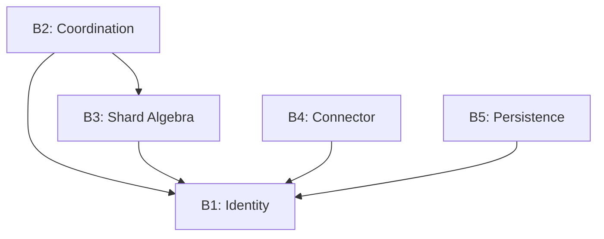
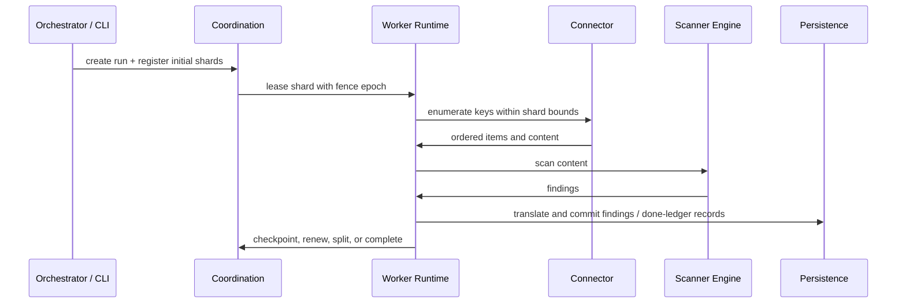

# Architecture at a Glance

## The Five-Boundary Model

The guide is organized around five architectural boundaries. The codebase does not put each boundary in exactly one crate, but the separation is real: identity stays low-level, coordination owns shard lifecycle, shard algebra owns ordered key ranges, connectors enumerate source data, and persistence owns durable results.

### The Dependency Rule

The important architectural rule is this:

- **Identity is the leaf**: `gossip-contracts::identity` depends on nothing higher-level
- **Shard algebra is shared infrastructure**: `gossip-frontier` bridges typed connector keys into byte ranges used by coordination
- **Runtime crates compose boundaries, they do not redefine them**

That is why so many crates depend on `gossip-contracts`, while implementation crates such as `gossip-coordination`, `gossip-connectors`, and the PostgreSQL backends stay focused on their own boundary.

## Boundary 1: Identity

**Purpose**: stable, content-addressed identifiers and domain-separated hashing.

**Key types**:

- `TenantId`
- `TenantSecretKey`
- `PolicyHash`
- `StableItemId`
- `FindingId`, `OccurrenceId`, `ObservationId`
- coordination IDs such as `RunId`, `ShardId`, `WorkerId`, and `OpId`

**Where it lives**:

- `crates/gossip-contracts/src/identity/`

**What matters architecturally**:

- item identity and finding identity are different layers
- tenant scoping is explicit in the identity model
- the same `ItemIdentityKey` always derives the same `StableItemId`

See **[→ Boundary 1](../02-boundary-1-identity-spine/01-identity-problem-space.md)**.

## Boundary 2: Coordination

**Purpose**: run lifecycle, shard lifecycle, leasing, fencing, replay detection, and worker claiming.

**Core surfaces**:

- `CoordinationBackend`
- `RunManagement`
- `ShardClaiming`
- `CoordinationFacade`

**Representative operations**:

- `acquire_and_restore_into`
- `checkpoint`
- `renew`
- `complete`
- `park_shard`
- `split_replace`
- `split_residual`
- `claim_next_available`

**Where it lives**:

- shard data model in `crates/gossip-contracts/src/coordination/`
- reference and simulation backends in `crates/gossip-coordination/`
- production etcd backend in `crates/gossip-coordination-etcd/`

**What matters architecturally**:

- workers hold time-bounded leases with fencing epochs
- replay protection is bounded through per-shard `OpId` tracking
- split operations mutate shard geometry without breaking coverage

See **[→ Boundary 2](../04-boundary-2-coordination/01-the-coordination-problem.md)**.

## Boundary 3: Shard Algebra

**Purpose**: turn connector-native ordered keys into shardable byte ranges.

**Key components**:

- `KeyEncoding`
- `PathKey`
- `ManifestRowKey`
- `ShardHint` and `ShardMetadata`
- `PreallocShardBuilder`

**Where it lives**:

- `crates/gossip-frontier/src/`

**What matters architecturally**:

- sharding happens over lexicographically ordered byte ranges, not over `StableItemId`
- connectors keep their own typed key models, while coordination stays generic over raw ranges
- split planning depends on range arithmetic such as `prefix_successor` and `byte_midpoint`

See **[→ Boundary 3](../05-boundary-3-shard-algebra/01-the-translation-layer.md)**.

## Boundary 4: Connector

**Purpose**: enumerate source items and read their contents through a stable contract.

**Core contracts**:

- `OrderedContentSource`
- `GitRepoExecutor`
- `ErrorClass` and the shared connector error model

**Current implementations**:

- `FilesystemConnector`
- `GitConnector`
- `InMemoryDeterministicConnector`

**Where it lives**:

- contracts in `crates/gossip-contracts/src/connector/`
- implementations in `crates/gossip-connectors/`

**What matters architecturally**:

- enumeration order is part of the contract
- connector failures carry retry posture into orchestration decisions
- source families are currently filesystem, Git, and deterministic in-memory fixtures

See **[→ Boundary 4](../06-boundary-4-connector/01-connector-problem-space.md)**.

## Boundary 5: Persistence

**Purpose**: durably record completed work and findings.

**Core pieces**:

- done-ledger contracts
- findings contracts (`FindingRecord`, `OccurrenceRecord`, `ObservationRecord`)
- durable commit handles and receipts

**Where it lives**:

- contracts in `crates/gossip-contracts/src/persistence/`
- reference in-memory backends in `crates/gossip-persistence-inmemory/`
- PostgreSQL backends in `crates/gossip-done-ledger-postgres/` and `crates/gossip-findings-postgres/`
- shared PostgreSQL support in `crates/gossip-pg-common/`

**What matters architecturally**:

- exactly-once is not just a coordination claim; durability is part of it
- the findings model is normalized into finding, occurrence, and observation layers
- the repository already contains both test backends and production PostgreSQL backends

See **[→ Boundary 5](../07-boundary-5-persistence/01-persistence-problem-space.md)**.

## Workspace Layout

The pinned workspace currently contains these major crate groups:

- **Contracts and low-level infrastructure**: `gossip-contracts`, `gossip-frontier`, `gossip-stdx`
- **Coordination**: `gossip-coordination`, `gossip-coordination-etcd`
- **Connectors and orchestration**: `gossip-connectors`, `gossip-orchestrator`
- **Persistence**: `gossip-persistence-inmemory`, `gossip-pg-common`, `gossip-done-ledger-postgres`, `gossip-findings-postgres`
- **Scanning pipeline**: `scanner-engine`, `scanner-engine-integration-tests`, `scanner-git`, `scanner-scheduler`
- **Runtime and entrypoints**: `gossip-scanner-runtime`, `gossip-worker`, `scanner-rs-cli`
- **Tooling**: `tools/dev-seed`

## How the Pieces Fit

At a high level, the repository supports two execution styles:

1. **Direct local scanning**: `scanner-rs-cli` calls into `gossip-scanner-runtime`, which validates inputs, builds the detection engine, and dispatches filesystem or Git scans locally.
2. **Distributed scanning**: `gossip-orchestrator` normalizes requests and registers runs, coordination assigns shard leases, and `gossip-worker` binds the generic distributed runtime to the real etcd and PostgreSQL backends.

That split is why the same repository contains both standalone CLI entrypoints and distributed worker composition code.

## Cross-Boundary Data Flow

The distributed path looks like this:

A crucial detail is that shard assignment and item identity are different concerns:

- coordination tracks byte-range ownership and cursor progress
- identity derives stable item and finding IDs from the content model
- persistence stores the durable result of completed work

## What's Next

Now that you understand the overall structure, the next chapter explains how to read the guide and when to switch between conceptual and code-level sections:

**[→ Next: 04-how-to-read-this-guide.md](04-how-to-read-this-guide.md)**

---

## References

- Corbett, James C. et al. (2012). "Spanner: Google's Globally-Distributed Database." *OSDI 2012*.
- Gray, Cary & David Cheriton (1989). "Leases: An Efficient Fault-Tolerant Mechanism for Distributed File Cache Consistency." *SOSP 1989*.
