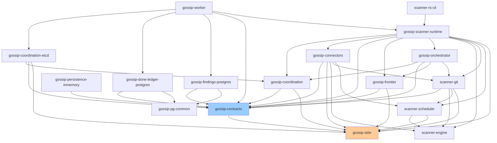
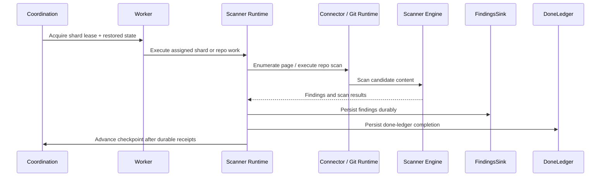

# Architecture at a Glance

## The Boundary Model in Today's Codebase

Gossip-rs still uses the five-boundary vocabulary, but the code is no longer just five abstract boxes. The workspace now splits into:

1. **Contracts and core boundary types**: `gossip-contracts`
2. **Boundary implementations**: `gossip-frontier`, `gossip-coordination`, `gossip-connectors`, and the persistence backends
3. **Scanner/runtime crates**: `scanner-engine`, `scanner-scheduler`, `scanner-git`, `gossip-orchestrator`, `gossip-scanner-runtime`, `gossip-worker`, and `scanner-rs-cli`



### The Actual Dependency Rule

The important rule is not "B1 depends on literally nothing." The actual rule in the current workspace is:

- **Identity does not depend on sibling boundaries**
- **Higher layers build on shared contracts instead of reaching around them**
- **`gossip-stdx` is the low-level utility crate beneath several boundaries**
- **Scanner and runtime crates compose multiple boundaries together**

So B1 remains the conceptual root of the boundary graph, but the crate graph includes shared infrastructure such as `gossip-stdx`, extracted scanner crates, and runtime orchestration crates.

## Boundary 1: Identity & Hashing Spine

**Purpose**: Provide deterministic, domain-separated identities for tenants, policies, items, findings, occurrences, and observations.

**Key Types**:

- `TenantId`
- `PolicyHash`
- `TenantSecretKey`
- `StableItemId`
- `FindingId`
- `OccurrenceId`
- `ObservationId`

**What lives here**:

- Canonical encoding via `CanonicalBytes`
- Domain-tag registry and BLAKE3 helpers
- Item identity derivation (`ConnectorTag`, `ConnectorInstanceIdHash`, `ItemIdentityKey`)
- Finding/occurrence/observation derivation
- Golden-vector coverage for identity stability

**Code**: `crates/gossip-contracts/src/identity/`

**Status**: ✅ Fully implemented

See **[→ Chapter 02: Boundary 1](../02-boundary-1-identity-spine/01-identity-problem-space.md)** for the detailed walkthrough.

## Boundary 2: Coordination

**Purpose**: Assign shard work safely with leases and fencing, track run lifecycle, and make retries idempotent.

**Key Protocols**:

1. **Lease acquisition** via `acquire_and_restore_into`
2. **Lease renewal** via `renew`
3. **Fencing** via monotonic `FenceEpoch`
4. **Shard claiming** via `claim_next_available`
5. **Replay detection** via `OpId` plus bounded per-shard op-log

**Trait Hierarchy**:

```text
CoordinationFacade
  ├── CoordinationBackend
  ├── RunManagement
  └── ShardClaiming
```

**Implementations and support**:

- Shared shard data model in `gossip-contracts::coordination`
- In-memory executable reference backend in `gossip-coordination`
- Deterministic simulation harness in `gossip-coordination::sim`
- Production etcd backend in `gossip-coordination-etcd`

**Code**: `crates/gossip-contracts/src/coordination/`, `crates/gossip-coordination/`, `crates/gossip-coordination-etcd/`

**Status**: ✅ Fully implemented

See **[→ Chapter 04: Boundary 2](../04-boundary-2-coordination/01-the-coordination-problem.md)** for the full protocol.

## Boundary 3: Shard Algebra

**Purpose**: Translate typed frontier keys into byte-range shards that coordination can store and split.

**Key Components**:

- `KeyEncoding`
- `PathKey`
- `ManifestRowKey`
- `prefix_successor`, `key_successor`, `byte_midpoint`
- `ShardHint` and `ShardMetadata`
- `PreallocShardBuilder`

**Important detail**: the shard algebra implementation lives in **`gossip-frontier`**, while the generic shard-range data model (`ShardSpec`, cursor checks, split validation) lives in `gossip-contracts::coordination`.

**Code**: `crates/gossip-frontier/src/`

**Status**: ✅ Fully implemented

See **[→ Chapter 05: Boundary 3](../05-boundary-3-shard-algebra/01-the-translation-layer.md)** for the dedicated shard-algebra section.

## Boundary 4: Connector

**Purpose**: Model source-family enumeration and read contracts, then implement concrete connectors for the source types the runtime supports today.

**Current source families**:

- **Ordered content**: page-oriented enumeration over filesystem items
- **Git repo execution**: repo discovery plus whole-repository Git execution

**Concrete implementations in the workspace**:

- `InMemoryDeterministicConnector`
- `FilesystemConnector`
- `GitConnector`

**Contract surface**:

- Toxic-byte wrappers such as `ItemKey`, `ItemRef`, `TokenBytes`, and `ToxicDigest`
- Ordered-content trait `OrderedContentSource`
- Git-family traits such as `GitRepoDiscoverySource`, `GitMirrorManager`, and `GitRepoExecutor`
- Reusable conformance harnesses in `gossip-contracts::connector::conformance`

**Code**: `crates/gossip-contracts/src/connector/` and `crates/gossip-connectors/`

**Status**: ✅ Fully implemented for local filesystem, local Git, and deterministic in-memory sources

See **[→ Chapter 06: Boundary 4](../06-boundary-4-connector/01-connector-problem-space.md)** for the connector contract and implementations.

## Boundary 5: Persistence

**Purpose**: Make scan completion durable without losing findings or advancing checkpoints too early.

**Key Components**:

1. **`DoneLedger`**: durable completion records
2. **`FindingsSink`**: stable finding, occurrence, and observation records
3. **`PageCommit<S>`**: typestate-enforced ordering between findings durability, item completion, and checkpoint durability
4. **`WriteContext` and OVID hashing**: shared routing and identity inputs for durable writes

**Implementations**:

- Reference in-memory backends in `gossip-persistence-inmemory`
- PostgreSQL done-ledger backend in `gossip-done-ledger-postgres`
- PostgreSQL findings backend in `gossip-findings-postgres`
- Shared PostgreSQL utilities in `gossip-pg-common`

**Code**: `crates/gossip-contracts/src/persistence/`, `crates/gossip-persistence-inmemory/`, `crates/gossip-done-ledger-postgres/`, `crates/gossip-findings-postgres/`

**Status**: 🔧 Contracts plus reference and PostgreSQL backends implemented

See **[→ Chapter 07: Boundary 5](../07-boundary-5-persistence/01-persistence-problem-space.md)** for the persistence model.

## Project Status Summary

| Area | Status | Primary Crates |
|------|--------|----------------|
| **B1 Identity** | ✅ Implemented | `gossip-contracts::identity` |
| **B2 Coordination** | ✅ Implemented | `gossip-contracts::coordination`, `gossip-coordination`, `gossip-coordination-etcd` |
| **B3 Shard Algebra** | ✅ Implemented | `gossip-frontier` |
| **B4 Connector** | ✅ Implemented | `gossip-contracts::connector`, `gossip-connectors` |
| **B5 Persistence** | 🔧 Contracts + backends implemented | `gossip-contracts::persistence`, `gossip-persistence-inmemory`, PostgreSQL crates |
| **Scanner Engine** | ✅ Extracted | `scanner-engine` |
| **Scanner Scheduler** | ✅ Extracted | `scanner-scheduler` |
| **Scanner Git** | ✅ Extracted | `scanner-git` |
| **Runtime + Entrypoints** | ✅ Implemented | `gossip-orchestrator`, `gossip-scanner-runtime`, `gossip-worker`, `scanner-rs-cli` |

## Crate Responsibilities

- **`gossip-stdx`**: low-level shared data structures and utilities, including the unsafe-backed containers other crates rely on behind safe APIs
- **`gossip-contracts`**: shared contracts and pure data models for identity, coordination, connector, and persistence boundaries
- **`gossip-frontier`**: typed-key encoding, shard hints, and shard-builder logic
- **`gossip-coordination`**: coordination protocol, in-memory reference backend, event surface, and deterministic simulation
- **`gossip-coordination-etcd`**: etcd-backed coordination implementation
- **`gossip-connectors`**: in-memory, filesystem, and git connector implementations
- **`gossip-persistence-inmemory`**: in-memory reference persistence backends and persistence simulation support
- **`gossip-done-ledger-postgres` / `gossip-findings-postgres` / `gossip-pg-common`**: PostgreSQL persistence implementations and shared DB support
- **`scanner-engine`**: rule loading, content policy, scan engine, scratch memory, and performance-sensitive matching paths
- **`scanner-scheduler`**: local filesystem scan runtime, archive handling, executor, and event surface
- **`scanner-git`**: repository discovery/open, commit walk, tree diff, pack execution, finalize, and persist seams for Git scanning
- **`gossip-orchestrator`**: request normalization plus initial shard geometry planning for filesystem and Git submission flows
- **`gossip-scanner-runtime`**: runtime glue that builds engines, dispatches scans, translates results, commits receipts, and bridges distributed mode
- **`gossip-worker`**: worker binary wiring runtime execution to etcd coordination and PostgreSQL persistence
- **`scanner-rs-cli`**: standalone CLI binary routed through `gossip-scanner-runtime`
- **`scanner-engine-integration-tests`**: cross-crate API contract coverage for the extracted scanning crates

## Cross-Boundary Data Flow

Here is the common distributed path in the current workspace:



That flow is the architectural spine of the repository: boundary contracts define the durable vocabulary, implementation crates execute the work, and the runtime ties the pieces together.

## What's Next

Now that you understand the overall architecture, let's look at how to read this guide effectively:

**[→ Next: 04-how-to-read-this-guide.md](04-how-to-read-this-guide.md)**

---

## References

- Corbett, James C. et al. (2012). "Spanner: Google's Globally-Distributed Database." *OSDI 2012*.
- Kleppmann, Martin (2016). "How to do distributed locking." *Blog post*.
- Gray, Cary & David Cheriton (1989). "Leases: An Efficient Fault-Tolerant Mechanism for Distributed File Cache Consistency." *SOSP 1989*.
