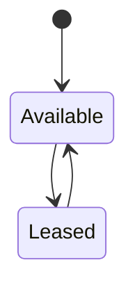
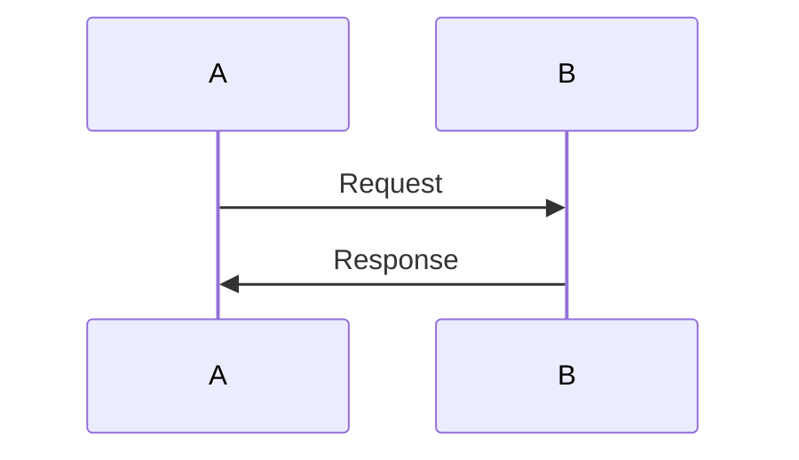
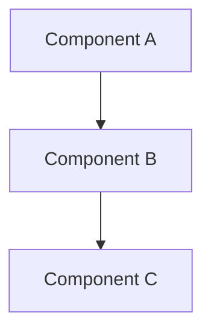

# How to Read This Guide

## Reading Strategies

This guide supports multiple reading paths depending on your goals and background.

### Sequential Reading (Recommended for Learners)

Read chapters in order from 00 through 14. Each chapter builds on concepts introduced in previous chapters:

1. **00-prologue** — Understand the problem space and architecture
2. **01-foundations** — Learn core concepts: content addressing, collision-free encoding, state machines
3. **02-boundary-1** — Study the Identity & Hashing Spine implementation
4. **03-distributed-theory** — Deep dive into coordination primitives and impossibility results
5. **04-boundary-2** — Coordination protocol and split operations (12 chapters)
6. **05-boundary-3** — Shard algebra: key encoding, hint metadata, startup builder (7 chapters)
7. **06-boundary-4** — Connector: toxic byte wrappers, enumeration/read traits, circuit breakers, in-memory and filesystem connectors, conformance harness (8 chapters)
8. **07-boundary-5** — Study persistence, done ledger, and exactly-once semantics
9. **08-cross-cutting** — Testing strategies, observability, operational concerns
10. **09-appendices** — References, glossary, TLA+ specifications
11. **10-scanner-engine** — Detection engine: rule loading, content policy, scan pipeline
12. **11-scan-driver** — Unified execution seam for source-specific backends
13. **12-scanner-git** — Git scanning pipeline: repo open, commit walk, tree diff, pack decode
14. **13-scanner-scheduler** — Parallel execution runtime: executor, archive expansion
15. **14-scanner-runtime** — Unified CLI and distributed entrypoints

### Jump-to-Boundary Reading (For Implementers)

If you're implementing a specific boundary, start with the prologue for context, then jump directly to the relevant chapter:

- **Implementing identity types** → Chapter 02 (B1: Identity)
- **Implementing coordination** → Chapter 04 (B2: Coordination, split protocol in chapters 7-9)
- **Implementing shard algebra** → Chapter 05 (B3: Shard Algebra, key encoding and hint metadata)
- **Implementing connectors** → Chapter 06 (B4: Connector)
- **Implementing persistence** → Chapter 07 (B5: Persistence)
- **Implementing detection** → Chapter 10 (Scanner Engine)
- **Implementing scan drivers** → Chapter 11 (Scan Driver)
- **Implementing git scanning** → Chapter 12 (Scanner Git)
- **Implementing scheduling** → Chapter 13 (Scanner Scheduler)
- **Implementing runtime** → Chapter 14 (Scanner Runtime)

Make sure to read **Chapter 01 (Foundations)** and **Chapter 03 (Distributed Theory)** for essential background.

### Theory-First Reading (For Researchers)

If you're interested in the theoretical foundations:

1. **03-distributed-theory** — CAP theorem, consensus, impossibility results
2. **08-cross-cutting/deterministic-simulation-testing.md** — Formal verification approach
3. **09-appendices/tla-specifications.md** — TLA+ models for protocol verification
4. **02-boundary-1** → **04-boundary-2** — Implementation case studies

Then explore REFERENCES.md for the 30+ academic papers referenced.

## Code References

Code references appear in this format:

```
crates/gossip-contracts/src/identity/item.rs:45
```

This means: file `crates/gossip-contracts/src/identity/item.rs`, line 45.

All file paths are relative to the Gossip-rs repository root. Line numbers correspond to the codebase at the time of writing (Phase 4 / March 2026).

### Following Code References

When you see a code reference, you can:

1. **Read inline**: The guide includes relevant code snippets
2. **Jump to source**: Open the file in your editor to see full context
3. **Explore neighbors**: Look at nearby functions and tests

Most code references point to:

- **Type definitions**: structs, enums, traits
- **Invariant assertions**: comments marked `// INV-Sxx` or `// INV-Lxx`
- **Property tests**: functions inside `proptest! {}` blocks
- **State machines**: enums with exhaustive match statements

## Mermaid Diagrams

This guide contains 47 Mermaid diagrams showing:

- **Data flow**: how data moves through the system
- **State machines**: how entities transition between states
- **Sequence diagrams**: how components interact over time
- **Dependency graphs**: how boundaries relate to each other

Diagrams are rendered inline. If you're reading this in a Mermaid-compatible viewer (GitHub, VS Code with extension, Obsidian), they appear as interactive diagrams. Otherwise, you'll see the raw Mermaid source.

### Example Diagram Types

**State Machine**:



**Sequence Diagram**:



**Graph**:



## Deep Dive Blocks

Throughout the guide, you'll see "Deep Dive" blocks that reference academic papers:

> **Deep Dive: Linearizability**
>
> Herlihy & Wing (1990) define linearizability as the strongest consistency model for concurrent objects. An operation is linearizable if it appears to take effect instantaneously at some point between its invocation and response.
>
> Gossip-rs coordinator provides linearizable shard assignment: if Worker A acquires a shard, no concurrent operation can observe the shard as available.
>
> **Reference**: Herlihy, Maurice P. & Wing, Jeannette M. (1990). "Linearizability: A Correctness Condition for Concurrent Objects." *TOPLAS 1990*.

These blocks are optional but recommended for readers who want to understand the theoretical foundations. If you're focused on implementation, you can skip them on first reading and return later.

## Invariants

Gossip-rs defines explicit safety and liveness invariants for every boundary. Invariants are labeled:

- **INV-Sxx**: Safety invariants (something bad never happens)
- **INV-Lxx**: Liveness invariants (something good eventually happens)

Example:

> **INV-S10**: At most one valid lease per shard at any time (safety)
>
> **INV-L10**: Every shard is eventually assigned to a worker (liveness)

Safety invariants are enforced through types, assertions, and property tests. Liveness invariants are verified through TLA+ model checking (see Chapter 08).

### Alpern & Schneider Taxonomy

This classification follows Alpern & Schneider (1985), "Defining Liveness":

- **Safety**: "Nothing bad ever happens" — can be violated in finite time
- **Liveness**: "Something good eventually happens" — cannot be violated in finite time

Example:

- **Safety**: "No two workers hold the same shard lease" (violated the moment two workers both hold the lease)
- **Liveness**: "Every shard is eventually assigned" (cannot be violated until infinite time—we can always say "it might happen next")

## Cross-References

Cross-references use this format:

- **Forward reference**: `[→ Chapter X.Y]` — points to a later chapter
- **Backward reference**: `[← Chapter X.Y]` — points to an earlier chapter
- **Sibling reference**: `[→ See also: Chapter X.Y]` — related content at the same level

Example:

> For details on ItemID derivation, see [→ Chapter 02.5: Item Identity](../02-boundary-1-identity-spine/05-item-identity.md).

You can read linearly and follow cross-references, or jump directly using the reference.

## Conventions

### Terminology

- **Boundary**: A major architectural component (B1-B5)
- **Shard**: A contiguous range of the keyspace assigned to a worker
- **Lease**: A time-bounded right to process a shard
- **Fencing Token**: A monotonically increasing token that prevents stale writes
- **Idempotency Key**: A unique identifier for an operation that enables deduplication
- **ItemID**: A content-addressed identifier for a scan item

See [09-appendices/D-glossary.md](../09-appendices/D-glossary.md) for complete definitions.

### Code Conventions

Gossip-rs follows Rust standard style:

- **Types**: `PascalCase` (e.g., `TenantId`, `PolicyHash`, `FindingId`)
- **Functions**: `snake_case` (e.g., `derive_finding_id`, `key_secret_hash`)
- **Constants**: `SCREAMING_SNAKE_CASE` (e.g., `MAX_SPLIT_CHILDREN`, `OP_LOG_CAP`, `MAX_KEY_SIZE`)
- **Modules**: `snake_case` (e.g., `identity`, `coordination`, `key_encoding`)

### Comment Conventions

- **Invariant assertions**: `// INV-S10: At most one valid lease per shard`
- **Safety proofs**: `// SAFETY: This operation is safe because...`
- **TODO markers**: `// TODO(phase3): Implement range merging`
- **References**: `// See: Corbett et al. (2012), Spanner`

## Exercises

Some chapters include exercises for readers who want hands-on practice:

> **Exercise 3.1**: Implement a function that checks whether a given ItemID falls within a shard range.
>
> ```rust
> fn in_shard(item_id: &ItemID, shard: &Shard) -> bool {
>     // Your implementation here
> }
> ```
>
> Hint: Remember that ranges are half-open: [start, end).

Exercises range from straightforward coding tasks to open-ended design challenges. Solutions are provided in the appendices.

## Notes and Warnings

The guide uses admonitions for important information:

**Note**: Background information or context.

**Warning**: Potential pitfalls or common mistakes.

**Important**: Critical information that must not be overlooked.

**Example**: Illustrative code or scenario.

## Navigation

Each chapter ends with navigation links:

```
[← Previous: Chapter X](chapter-x.md) | [Next: Chapter Y →](chapter-y.md)
```

Use these to read sequentially, or use the table of contents in [README.md](../README.md) to jump to specific topics.

## PDF and Offline Reading

This guide is plain Markdown and can be converted to PDF using tools like Pandoc:

```bash
pandoc -s README.md 00-prologue/*.md 01-foundations/*.md ... -o gossip-guide.pdf
```

Mermaid diagrams require a preprocessor like `mermaid-filter` or `md-to-pdf`.

## Contributing

Found an error? Want to improve a diagram or add an example? Contributions are welcome!

- **Typos and errors**: Open a GitHub issue or submit a PR
- **New examples**: Add to the relevant chapter with a code snippet
- **New diagrams**: Ensure Mermaid syntax is valid and renders correctly
- **New references**: Add to REFERENCES.md with full citation

## What's Next

You're now ready to dive into the foundations. Let's start with core concepts:

**[→ Next: Chapter 01: Foundations](../01-foundations/01-cryptographic-hashing-primer.md)**

---

## References

- Alpern, Bowen & Schneider, Fred B. (1985). "Defining Liveness." *Information Processing Letters*.
- Herlihy, Maurice P. & Wing, Jeannette M. (1990). "Linearizability: A Correctness Condition for Concurrent Objects." *TOPLAS 1990*.
