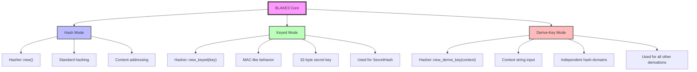

# Cryptographic Hashing Primer

## What is a Cryptographic Hash Function?

A cryptographic hash function is a mathematical operation that takes arbitrary input data and produces a fixed-size output (the "hash" or "digest") with the following properties:

1. **Deterministic**: The same input always produces the same output
2. **Fixed-width output**: Regardless of input size, output is always the same length
3. **Preimage resistant**: Given a hash, it's computationally infeasible to find the original input
4. **Collision resistant**: It's computationally infeasible to find two different inputs that produce the same hash

These properties make cryptographic hashes ideal for:
- Verifying data integrity
- Creating content-addressed identifiers
- Building Merkle trees
- Deriving keys and secrets

## Why Hashing Matters for Identity

In content-addressed systems, identity is **derived from content**, not **assigned by authority**.

Traditional systems assign identities:
```
Server generates UUID → Client receives ID → ID stored with data
```

Content-addressed systems derive identities:
```
Content exists → Hash computed → Hash IS the identity
```

This approach offers powerful guarantees:
- **Determinism**: Same content always produces the same ID, regardless of who computes it
- **Deduplication**: Identical content automatically shares the same ID
- **No coordination**: Multiple workers can independently generate IDs without conflict
- **Tamper detection**: Any change to content changes its ID

Gossip-rs uses content-addressed identity throughout its architecture to achieve these properties.

## BLAKE3 Overview

BLAKE3 is a modern cryptographic hash function that operates as a Merkle tree internally. It's the successor to BLAKE2 and offers:
- **Speed**: One of the fastest cryptographic hash functions available
- **Security**: Based on proven cryptographic primitives
- **Parallelism**: Tree structure enables parallel computation
- **Flexibility**: Three distinct operational modes

### BLAKE3's Three Modes

BLAKE3 provides three operational modes, each serving a different purpose:



#### 1. Hash Mode

```rust
let mut hasher = blake3::Hasher::new();
hasher.update(b"data");
let hash = hasher.finalize();
```

Standard hashing mode for general-purpose content hashing. This is the mode most developers are familiar with from other hash functions.

#### 2. Keyed Mode

```rust
let key: [u8; 32] = /* secret key */;
let mut hasher = blake3::Hasher::new_keyed(&key);
hasher.update(b"data");
let hash = hasher.finalize();
```

MAC-like mode where a 32-byte secret key is incorporated into the hash computation. The same input with different keys produces completely different outputs.

**Gossip-rs usage**: SecretHash (tenant-scoped secret identification)
- Each tenant has a unique secret key
- Secrets are hashed with the tenant's key
- Same secret content produces different SecretHash values for different tenants
- This prevents cross-tenant secret correlation

#### 3. Derive-Key Mode

```rust
let mut hasher = blake3::Hasher::new_derive_key("my-context");
hasher.update(b"data");
let hash = hasher.finalize();
```

Context-driven mode where a string context produces an independent hash domain. Different contexts produce different outputs even for the same input.

**Gossip-rs usage**: All other identity derivations
- `FindingId` uses context `"gossip/finding/v1"`
- `StableItemId` uses context `"gossip/item-id/v1"`
- Each context creates a cryptographically independent hash space

Note: Not all identity types use derive-key mode. `TenantId` is constructed from raw bytes via `from_bytes`, not derived via domain separation—it serves as an input to other derivations rather than being derived itself.

This mode provides **domain separation** (covered in detail in Chapter 3), ensuring that hashes computed for different purposes can never collide.

## Implementation in Gossip-rs

The core hashing logic lives in `crates/gossip-contracts/src/identity/hashing.rs`:

```rust
pub fn domain_hasher(domain: &str) -> blake3::Hasher {
    blake3::Hasher::new_derive_key(domain)
}
```

This simple wrapper enforces the use of derive-key mode for all domain-separated hashing operations. The domain constants themselves are defined in `domain.rs` and follow a strict naming convention.

Example usage:

```rust
// Create a hasher for a specific domain
let mut hasher = domain_hasher(FINDING_ID_V1);
hasher.update(tenant_id.as_bytes());
hasher.update(stable_item_id.as_bytes());
hasher.update(rule_fingerprint.as_bytes());
hasher.update(secret_hash.as_bytes());
let finding_id = FindingId::from_bytes(hasher.finalize().into());
```

> **Implementation note:** The production code uses `derive_from_cached(&FINDING_HASHER, inputs)` which clones a pre-keyed hasher from a `LazyLock<Hasher>` cache, feeding fields via the `CanonicalBytes` trait — avoiding per-call key derivation overhead.

## Key Takeaways

1. **Cryptographic hashes** provide determinism, collision resistance, and preimage resistance
2. **Content-addressed identity** derives IDs from content, eliminating coordination overhead
3. **BLAKE3 offers three modes**:
   - Hash mode for standard hashing
   - Keyed mode for tenant-scoped hashing (SecretHash)
   - Derive-key mode for domain-separated hashing (all other IDs)
4. **Domain separation** (via derive-key mode) ensures different hash purposes can never interfere

## References

- [BLAKE3 Specification](https://github.com/BLAKE3-team/BLAKE3-specs/blob/master/blake3.pdf) (Aumasson et al.)
- [BLAKE3 Official Implementation](https://github.com/BLAKE3-team/BLAKE3)
- Gossip-rs source: `crates/gossip-contracts/src/identity/hashing.rs`
- Gossip-rs source: `crates/gossip-contracts/src/identity/domain.rs`

---

**Next**: [Content-Addressed Identity](02-content-addressed-identity.md) - Deep dive into how Gossip-rs uses content hashing for deterministic identity.
