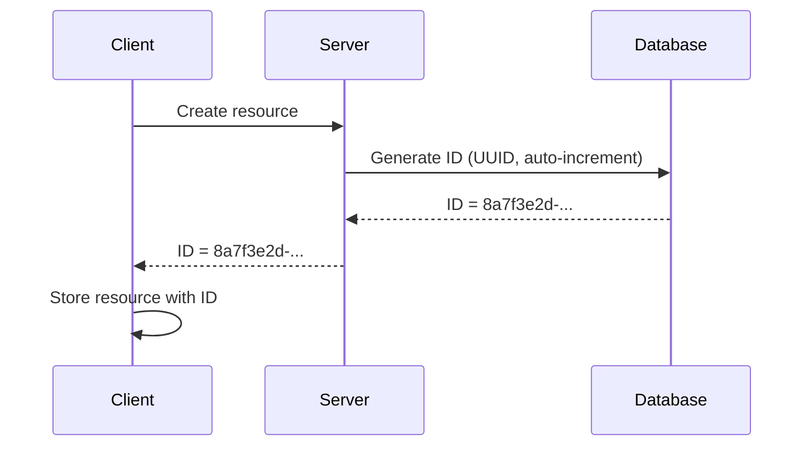
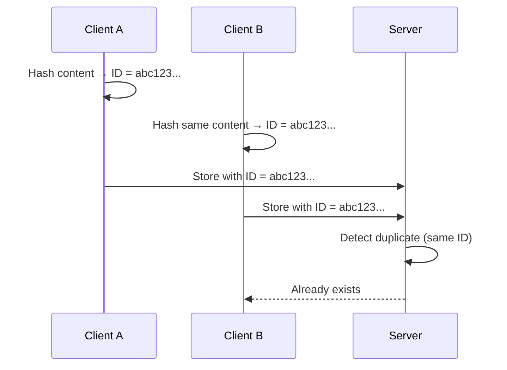

# Content-Addressed Identity

## Two Approaches to Identity

When building distributed systems, there are two fundamental approaches to generating identifiers:

### 1. Assigned Identity

An authority (typically a server or coordinator) generates and assigns identifiers:



**Characteristics**:
- Server controls ID generation
- Clients must wait for assignment
- Same content can receive different IDs
- Coordination required for uniqueness
- No inherent deduplication

**Examples**:
- Database auto-increment columns
- UUID generation (v4 random UUIDs)
- Snowflake IDs
- Twitter/Discord ID schemes

### 2. Content-Addressed Identity

The identifier is **deterministically derived from the content itself**:



**Characteristics**:
- Clients compute IDs independently
- No server coordination needed
- Same content always produces same ID
- Automatic deduplication
- Tamper detection built-in

**Examples**:
- Git (SHA-1/SHA-256 of objects)
- IPFS (Content IDentifiers)
- Merkle trees
- Gossip-rs finding IDs

## Advantages of Content-Addressed Identity

### 1. Determinism

The same content always produces the same ID, regardless of:
- Who computes it
- When it's computed
- Where it's computed
- How many times it's computed

This property is critical for distributed systems where multiple workers may independently discover the same information.

### 2. Free Deduplication

Because identical content produces identical IDs, deduplication happens automatically:

```rust
// Two workers scan the same secret independently
let finding_a = derive_finding_id(&inputs);
let finding_b = derive_finding_id(&inputs);

assert_eq!(finding_a, finding_b); // Always true!

// Storage layer sees same ID → deduplicates automatically
storage.insert(finding_a, data);  // Inserted
storage.insert(finding_b, data);  // Duplicate detected, ignored
```

No explicit deduplication logic required - the ID itself encodes uniqueness.

### 3. No Coordination Needed

In a distributed system with assigned IDs, you need:
- A coordinator to generate IDs
- Locking to prevent conflicts
- Network round-trips for assignment
- Fallback logic if coordinator fails

With content-addressed IDs:
```rust
// Worker 1 in datacenter A
let id = derive_finding_id(&inputs);

// Worker 2 in datacenter B (no communication with Worker 1)
let id = derive_finding_id(&same_inputs);

// They independently generate the same ID
```

No coordination, no network calls, no single point of failure.

### 4. Built-in Tamper Detection

If content changes, the ID changes:

```rust
let original_id = hash(b"secret=sk_123");
let modified_id = hash(b"secret=sk_124");

assert_ne!(original_id, modified_id);
```

This property makes content-addressed systems naturally tamper-evident.

## Real-World Examples

### Git

Git's core data model is entirely content-addressed:

```bash
# Create a blob (file content)
$ echo "Hello, World" | git hash-object --stdin
8ab686eafeb1f44702738c8b0f24f2567c36da6d

# Same content always produces same hash
$ echo "Hello, World" | git hash-object --stdin
8ab686eafeb1f44702738c8b0f24f2567c36da6d
```

Git uses SHA-1 (moving to SHA-256) to compute object IDs from content. This enables:
- Efficient synchronization (compare hashes, transfer only missing objects)
- Strong integrity guarantees
- Deduplication across repositories

### IPFS

The InterPlanetary File System uses Content IDentifiers (CIDs):

```
QmXgqKTbzdh83pQtKFb19SpMCpDDcKR2ujqk3pKph9aCNF
```

This CID is derived from the file's content using a cryptographic hash. Properties:
- Same file always produces same CID
- Multiple hosts can serve the same content
- Content is authenticated by its address

### Merkle Trees

Merkle trees are hierarchical content-addressed structures:

```
        Root Hash
         /    \
    Hash A    Hash B
     / \       / \
   d1  d2    d3  d4
```

Each parent hash is computed from its children's hashes. Used in:
- Git (trees and commits)
- Bitcoin/Ethereum (transaction trees)
- Certificate transparency logs
- Gossip-rs (BLAKE3 internally uses a Merkle tree)

## How Gossip-rs Uses Content-Addressed Identity

Gossip-rs extensively uses content-addressed identity for all core entities:

### FindingId

A finding represents a detected secret. Its ID is derived from:

```rust
FindingId = BLAKE3_derive_key("gossip/finding/v1").hash(
    tenant || item || rule || secret
)
```

> **Note:** Field names in code are `tenant`, `item`, `rule`, `secret` (not `tenant_id`, `stable_item_id`, `rule_fingerprint`, `secret_hash`).

**Why these components?**
- `tenant`: Scope findings to tenant (`TenantId`)
- `item`: Identify the scanned artifact (`StableItemId`)
- `rule`: Identify which detection rule fired (`RuleFingerprint`)
- `secret`: Identify the specific secret found (`SecretHash`)

**Result**: The same secret found by different workers at different times produces the **exact same FindingId**.

### Idempotency Connection

Content-addressed IDs make writes naturally idempotent:

```rust
// Worker A reports finding
storage.insert(finding_id, finding_data);

// Worker B reports same finding (maybe A's message was lost)
storage.insert(finding_id, finding_data);

// Storage layer: same ID → idempotent write
// No duplicate entries, no explicit deduplication logic
```

This is critical for distributed systems where:
- Network messages may be duplicated
- Workers may process the same data multiple times
- Exactly-once delivery is not guaranteed

### TenantId

A tenant is identified by raw bytes via `from_bytes`, not via domain-separated derivation. `TenantId` serves as an input to other derivations (such as `FindingId`) rather than being derived itself:

```rust
TenantId = TenantId::from_bytes(raw_tenant_identifier)
```

The same raw bytes always produce the same `TenantId`, giving deterministic identity without domain-key derivation.

### SecretHash

Secrets are hashed in keyed mode (not derive-key mode) to enable tenant-scoped anonymization:

```rust
SecretHash = BLAKE3_keyed(tenant_secret_key).hash(
    secret_content
)
```

Same secret in different tenants produces different SecretHash values, preventing cross-tenant correlation.

### StableItemId

Scanned items (files, commits, container images) get stable IDs derived from an `ItemIdentityKey`, which combines a `ConnectorTag` (8-byte source discriminator, e.g. `b"github\0\0"`), a `ConnectorInstanceIdHash` (32-byte hash of the connector instance identifier), and a variable-length `locator` (connector-defined bytes, length-prefixed):

```rust
StableItemId = BLAKE3_derive_key("gossip/item-id/v1").hash(
    ConnectorTag [8 bytes] || ConnectorInstanceIdHash [32 bytes] || len(locator) [4 bytes LE] || locator [variable]
)
```

The `ConnectorTag` prevents cross-source collisions (a GitHub file at `org/repo/path.txt` and a GitLab file at the same path hash to different `StableItemId` values). The `ConnectorInstanceIdHash` prevents cross-instance collisions (two GitHub installations scanning the same locator produce different `StableItemId` values). The length prefix on the locator prevents concatenation ambiguity.

## Comparison: Assigned vs Content-Addressed

| Aspect | Assigned Identity | Content-Addressed |
|--------|------------------|------------------|
| **Coordination** | Required (single authority) | Not required (decentralized) |
| **Determinism** | Non-deterministic (different IDs for same content) | Deterministic (same ID for same content) |
| **Deduplication** | Explicit logic required | Automatic and free |
| **Latency** | Network round-trip to authority | Local computation only |
| **Fault tolerance** | Single point of failure (authority) | No single point of failure |
| **Tamper detection** | External mechanism required | Built-in (content change = ID change) |
| **Privacy** | IDs leak no information | Hashes may leak information (use keyed mode) |

## Design Considerations

### When to Use Content-Addressed Identity

**Good fit**:
- Immutable data (files, commits, secrets)
- Distributed systems with multiple writers
- Systems requiring strong deduplication
- Systems requiring tamper detection
- Systems requiring deterministic replay

**Poor fit**:
- Mutable data (user profiles, configuration)
- Sequential IDs needed (for pagination, sorting by creation time)
- Privacy-sensitive data where hash correlation is a concern (use keyed mode instead)

### The Mutability Challenge

Content-addressed IDs work best with immutable data. For mutable data, either:
1. **Version the content**: Each version gets a new ID, track versions separately
2. **Use assigned IDs**: Accept coordination overhead for mutable entities

Gossip-rs handles this by:
- Using content-addressed IDs for immutable data (findings, secrets, items)
- Using configuration-derived IDs for quasi-immutable data (tenants)
- Future work: timestamped versioning for mutable policy data

## Key Takeaways

1. **Content-addressed identity** derives IDs from content via cryptographic hashing
2. **Determinism** enables multiple workers to independently generate the same IDs
3. **Free deduplication** happens automatically when same content produces same ID
4. **No coordination** required - workers compute IDs independently
5. **Gossip-rs uses content-addressed identity** for findings, tenants, secrets, and items
6. **Idempotency** falls out naturally from content-addressed design

## References

- [Git Internals - Git Objects](https://git-scm.com/book/en/v2/Git-Internals-Git-Objects)
- [IPFS - Content Addressing](https://docs.ipfs.tech/concepts/content-addressing/)
- [Content-Addressed Storage (Wikipedia)](https://en.wikipedia.org/wiki/Content-addressable_storage)
- Gossip-rs source: `crates/gossip-contracts/src/identity/finding.rs`
- Gossip-rs source: `crates/gossip-contracts/src/identity/item.rs`
- Gossip-rs source: `crates/gossip-contracts/src/identity/types.rs`

---

**Previous**: [Cryptographic Hashing Primer](01-cryptographic-hashing-primer.md)
**Next**: [Domain Separation](03-domain-separation.md) - How Gossip-rs ensures hash computations never interfere with each other.
