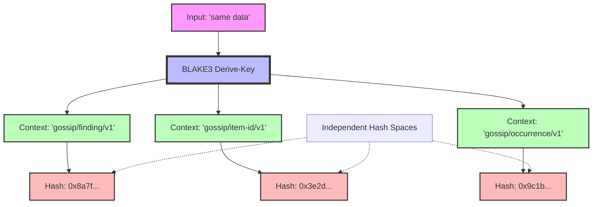

# Domain Separation

## The Collision Problem

Consider a naive content-addressed system that uses a single hash function for all purposes:

```rust
// BAD: Same hash function for everything
let tenant_id = blake3::hash(tenant_config);
let finding_id = blake3::hash(finding_data);
let secret_hash = blake3::hash(secret_content);
```

This creates a **namespace collision problem**:

1. **Accidental collisions**: If `tenant_config` happens to equal `finding_data`, they produce the same hash
2. **Intentional collisions**: An attacker could craft a tenant config that collides with a legitimate finding ID
3. **Type confusion**: A hash generated for one purpose (e.g., TenantId) could be misinterpreted as another type (e.g., FindingId)

Example attack scenario:

```rust
// Attacker crafts a malicious tenant config
let malicious_config = craft_preimage_for(target_finding_id);

// System accepts it because the hash matches
let tenant_id = hash(malicious_config);
assert_eq!(tenant_id, target_finding_id); // Type confusion!

// Now the attacker can impersonate a tenant using a finding ID
```

Even without malicious intent, accidental collisions across different hash purposes create subtle bugs and make reasoning about the system difficult.

## Domain Separation via Context Strings

**Domain separation** ensures that hashes computed for different purposes are cryptographically independent, even if the input data is identical.

BLAKE3's derive-key mode provides domain separation via context strings:

```rust
// Each derivation gets a unique context
let finding_hasher = blake3::Hasher::new_derive_key("gossip/finding/v1");
let item_hasher = blake3::Hasher::new_derive_key("gossip/item-id/v1");

// Even with identical input, outputs are completely different
finding_hasher.update(b"same data");
item_hasher.update(b"same data");

let finding_hash = finding_hasher.finalize();
let item_hash = item_hasher.finalize();

assert_ne!(finding_hash, item_hash); // Guaranteed different!
```

The context string creates an independent hash space. It's cryptographically infeasible to:
- Find a collision between domains
- Derive one domain's output from another domain's output
- Forge a hash in one domain using a hash from another domain



## The Registry Pattern in Gossip-rs

Gossip-rs maintains a **domain registry** in `crates/gossip-contracts/src/identity/domain.rs` with 17 domain constants.

### Domain Naming Convention

All domains follow a strict convention:

```
gossip/<subsystem>/v<N>[/<operation>]
```

**Components**:
- `gossip`: Global prefix (future-proofing for cross-project hashing)
- `<subsystem>`: Functional area (tenant, finding, item, etc.)
- `v<N>`: Version number (enables evolution without breaking existing hashes)
- `[/<operation>]`: Optional operation qualifier (e.g., `stable-id`, `policy-hash`)

**Examples**:
- `gossip/finding/v1` - Finding ID derivation
- `gossip/item-id/v1` - Stable item ID derivation
- `gossip/coord/v1/split-id` - Split shard ID derivation
- `gossip/policy-hash/v2` - Policy hash derivation

### Complete Domain Registry

| Constant | Domain String | Hash Mode | Purpose |
|----------|--------------|-----------|---------|
| `SPLIT_ID_V1` | `gossip/coord/v1/split-id` | Derive-key | Split shard ID derivation |
| `OP_PAYLOAD_V1` | `gossip/coord/v1/op-payload` | Derive-key | Operation payload hashing |
| `FINDING_ID_V1` | `gossip/finding/v1` | Derive-key | Finding identity |
| `OCCURRENCE_ID_V1` | `gossip/occurrence/v1` | Derive-key | Occurrence identity |
| `OBSERVATION_ID_V1` | `gossip/observation/v1` | Derive-key | Observation identity |
| `SECRET_HASH_V1` | `gossip/secret-hash/v1` | Keyed (tag only) | Secret hash domain tag |
| `ITEM_ID_V1` | `gossip/item-id/v1` | Derive-key | Stable item ID |
| `CONNECTOR_INSTANCE_ID_V1` | `gossip/connector-instance-id/v1` | Derive-key | Connector instance ID |
| `OBJECT_VERSION_V1` | `gossip/object-version/v1` | Derive-key | Object version ID |
| `RULE_FINGERPRINT_V1` | `gossip/rule/v1` | Derive-key | Rule fingerprint |
| `POLICY_HASH_V2` | `gossip/policy-hash/v2` | Derive-key | Policy hash |
| `RULES_DIGEST_V1` | `gossip/rules-digest/v1` | Derive-key | Rules digest |
| `OVID_V1` | `gossip/persistence/v1/ovid` | Derive-key | Object version ID (persistence) |
| `DONE_LEDGER_KEY_V1` | `gossip/persistence/v1/done-key` | Derive-key | Done ledger key |
| `TRIAGE_GROUP_KEY_V1` | `gossip/persistence/v1/triage-group` | Derive-key | Triage group key |
| `COORDINATION_TELEMETRY_V1` | `gossip/worker/v1/coordination-telemetry` | Derive-key | Coordination telemetry redaction digest |
| `GIT_REPO_ID_V1` | `gossip/git/v1/repo-id` | Derive-key | Stable 64-bit repository-namespace derivation for repo-native Git scans |

### The SECRET_HASH_V1 Exception

All domains use derive-key mode **except** `SECRET_HASH_V1`, which uses keyed mode:

```rust
// All other domains: derive-key mode
let hasher = blake3::Hasher::new_derive_key(FINDING_ID_V1);

// SECRET_HASH_V1: keyed mode
let hasher = blake3::Hasher::new_keyed(&tenant_secret_key);
hasher.update(SECRET_HASH_V1.as_bytes()); // Fed as data, not as context
hasher.update(norm.as_bytes());            // Pre-computed 32-byte digest (NormHash)
```

**Why the difference?**

Keyed mode requires a 32-byte secret key, which provides **tenant-scoped anonymization**:
- Same secret in Tenant A produces a different hash than in Tenant B
- Prevents cross-tenant secret correlation
- The domain string is fed as input data (not as derive-key context) to maintain the keyed mode's security properties

All other domains don't require tenant-specific keys and use derive-key mode for domain separation.

## Uniqueness Enforcement: 5 Layers

Gossip-rs enforces domain uniqueness at **compile time** and **test time** with five layers of defense:

### Layer 1: Compile-Time Array Length

```rust
pub const ALL: [&str; 17] = [
    SPLIT_ID_V1,
    OP_PAYLOAD_V1,
    FINDING_ID_V1,
    // ... (17 total)
];
```

**Property**: If you add an 18th domain but forget to update the array length, compilation fails:

```
error: mismatched types
  expected array `[&str; 17]`
  found array `[&str; 18]`
```

### Layer 2: no_duplicate_values Test

```rust
#[test]
fn no_duplicate_values() {
    let mut seen = HashSet::new();
    for domain in ALL {
        assert!(seen.insert(domain), "Duplicate domain constant: {}", domain);
    }
}
```

**Property**: If two constants have the same string value, the test fails at runtime.

### Layer 3: no_duplicate_names Test

```rust
#[test]
fn no_duplicate_names() {
    // Uses the all_domain_constants() function which returns (name, value) pairs
    let constants = all_domain_constants();
    let mut seen = HashSet::new();
    for (name, _value) in &constants {
        assert!(seen.insert(name), "Duplicate constant name: {}", name);
    }
}
```

**Property**: Even if two constants have different values, they must have different names. The `all_domain_constants()` function returns tuples of `(&str, &str)` pairing each constant's name with its value.

### Layer 4: fixture_covers_all_constants Test

```rust
#[test]
fn fixture_covers_all_constants() {
    let constants = all_domain_constants();
    assert_eq!(constants.len(), ALL.len());
    for (_name, value) in &constants {
        assert!(ALL.contains(value), "Missing from ALL array: {}", value);
    }
}
```

**Property**: The `ALL` array must include every constant returned by `all_domain_constants()`, and the counts must match. If you add a domain without adding it to `ALL`, this fails.

### Layer 5: Format Tests

```rust
// Simplified composite — the actual tests are three separate functions:
//   all_constants_are_printable_ascii()
//   all_constants_follow_naming_convention()
//   all_constants_have_reasonable_length()
#[test]
fn all_constants_are_printable_ascii() {
    for (name, value) in all_domain_constants() {
        for (i, &byte) in value.as_bytes().iter().enumerate() {
            assert!(
                byte.is_ascii_lowercase()
                    || byte.is_ascii_digit()
                    || byte == b'/'
                    || byte == b'-',
                "domain constant {name} has disallowed byte 0x{byte:02X} \
                 at position {i}: {value:?}",
            );
        }
    }
}
```

**Property**: Every byte in every domain constant must be lowercase ASCII, a digit, `/`, or `-`. This is more restrictive than generic "ASCII-only" — uppercase, spaces, underscores, and other punctuation are disallowed.

Together, these five layers make it **nearly impossible** to introduce a duplicate or malformed domain constant.

## Why Domain Separation Matters

### 1. Security: Prevents Type Confusion Attacks

Without domain separation:

```rust
// Attacker crafts a FindingId that collides with a TenantId
let malicious_finding = craft_collision(target_tenant_id);

// System can't tell the difference
if finding_id == tenant_id { // Type confusion!
    grant_admin_access();
}
```

With domain separation:

```rust
// FindingId and TenantId are in different hash spaces
let finding_id = hash_with_domain("gossip/finding/v1", data);
let item_id = hash_with_domain("gossip/item-id/v1", data);

assert_ne!(finding_id, item_id); // Guaranteed different!
```

### 2. Correctness: Prevents Accidental Collisions

Without domain separation:

```rust
// Coincidentally, a rule hash equals a finding ID
let rule_hash = hash(rule_definition);
let finding_id = hash(finding_data);

if rule_hash == finding_id { // Accidental collision!
    // Unexpected behavior
}
```

With domain separation:

```rust
// Rule hashes and finding IDs are in separate spaces
let rule_hash = hash_with_domain("gossip/rule/v1", rule_definition);
let finding_id = hash_with_domain("gossip/finding/v1", finding_data);

// Collision is cryptographically infeasible
```

### 3. Evolvability: Enables Safe Schema Changes

Version numbers in domain strings enable evolution:

```rust
// Current version
const FINDING_ID_V1: &str = "gossip/finding/v1";

// Future version (different hash space)
const FINDING_ID_V2: &str = "gossip/finding/v2";
```

When the FindingId schema changes:
- Old findings keep their V1 IDs
- New findings use V2 IDs
- No hash collision between old and new schemas
- System can support both concurrently during migration

### 4. Debuggability: Makes Hash Purposes Clear

When debugging a hash mismatch:

```rust
// Without domain separation
Hash: 0x8a7f3e2d... // What is this for?

// With domain separation
Domain: gossip/finding/v1
Hash: 0x8a7f3e2d...
// Clearly a finding ID
```

Logs and errors can include the domain string, making it immediately clear what each hash represents.

## Implementation in Gossip-rs

The domain registry lives in `crates/gossip-contracts/src/identity/domain.rs`:

```rust
/// Domain constant for finding identity
pub const FINDING_ID_V1: &str = "gossip/finding/v1";

/// Domain constant for stable item ID
pub const ITEM_ID_V1: &str = "gossip/item-id/v1";

// ... (15 more constants)

/// All domain constants for verification
pub const ALL: [&str; 17] = [
    SPLIT_ID_V1,
    OP_PAYLOAD_V1,
    FINDING_ID_V1,
    // ... (17 total)
];
```

Usage in identity derivation:

```rust
use crate::identity::domain::FINDING_ID_V1;
use crate::identity::hashing::domain_hasher;

pub fn derive_finding_id(inputs: &FindingIdInputs) -> FindingId {
    let mut hasher = domain_hasher(FINDING_ID_V1);
    inputs.tenant.write_canonical(&mut hasher);
    inputs.item.write_canonical(&mut hasher);
    inputs.rule.write_canonical(&mut hasher);
    inputs.secret.write_canonical(&mut hasher);
    FindingId::from_bytes(hasher.finalize().into())
}
```

> **Implementation note:** The production code uses `derive_from_cached(&FINDING_HASHER, inputs)` which clones a pre-keyed hasher from a `LazyLock<Hasher>` cache, feeding fields via the `CanonicalBytes` trait — avoiding per-call key derivation overhead. The manual `write_canonical` calls above are shown for pedagogical clarity.

Every identity derivation follows this pattern:
1. Clone a cached domain-separated hasher (or create one)
2. Feed input data via the `CanonicalBytes` trait
3. Finalize to produce a type-safe ID

## Key Takeaways

1. **Domain separation** prevents hash collisions across different purposes
2. **Context strings** (via BLAKE3 derive-key mode) create independent hash spaces
3. **The registry pattern** centralizes all domain constants with strict naming conventions
4. **Five-layer enforcement** ensures domain uniqueness at compile time and test time
5. **SECRET_HASH_V1 uses keyed mode** (not derive-key mode) for tenant-scoped anonymization
6. **Version numbers in domains** enable safe schema evolution
7. **All Gossip-rs identities** use domain-separated hashing for security and correctness

## References

- [BLAKE3 Specification - Section 5.3: Derive-Key Mode](https://github.com/BLAKE3-team/BLAKE3-specs/blob/master/blake3.pdf)
- [Domain Separation in Cryptography](https://en.wikipedia.org/wiki/Domain_separation)
- Gossip-rs source: `crates/gossip-contracts/src/identity/domain.rs`
- Gossip-rs source: `crates/gossip-contracts/src/identity/hashing.rs`

---

**Previous**: [Content-Addressed Identity](02-content-addressed-identity.md)
**Next**: [Type-Driven Correctness](04-type-driven-correctness.md) - How Rust's type system prevents misuse of identity primitives.
