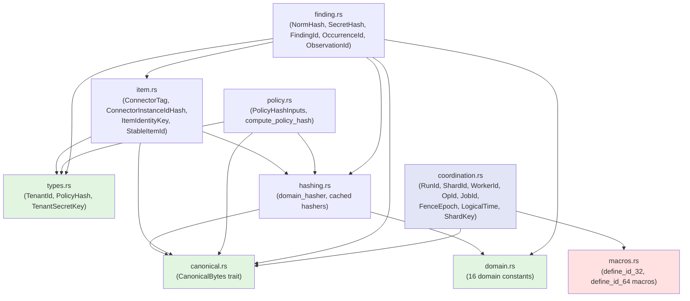
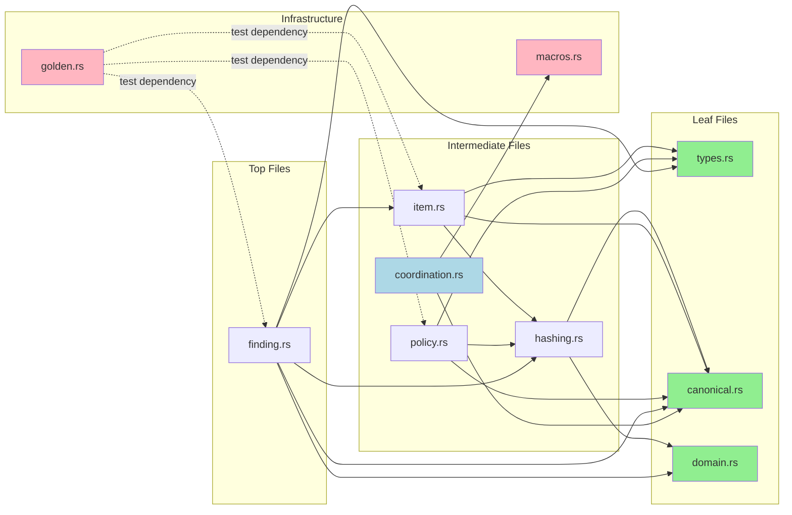

# The Identity Problem Space

## What B1 Owns

Boundary 1 (Identity Spine) is the foundation of the Gossip-rs architecture. It owns three critical responsibilities:

1. **Content-addressed identity types**: A family of 32-byte identity types (`TenantId`, `FindingId`, `OccurrenceId`, etc.) that uniquely identify entities in the system
2. **Canonical encoding**: A deterministic byte encoding scheme (`CanonicalBytes` trait) that ensures identical values always produce identical byte sequences
3. **Domain-separated hashing**: BLAKE3-based derivation functions with cryptographic domain separation to prevent cross-derivation collisions

These primitives are the leaf of the boundary dependency graph. **The identity module depends on nothing**; all four sibling boundaries (coordination, persistence, detection, policy) depend on identity.

## The 11 Source Files

| File | Role | Key Exports |
|------|------|-------------|
| `mod.rs` | Module root, public API surface | Re-exports all public types and functions |
| `types.rs` | Core identity primitives | `TenantId`, `PolicyHash`, `TenantSecretKey` |
| `canonical.rs` | Deterministic encoding | `CanonicalBytes` trait, primitive impls |
| `hashing.rs` | Domain-separated derivation | `domain_hasher`, `finalize_32`, `finalize_64`, cached hashers |
| `domain.rs` | Domain constant registry | 16 domain strings, uniqueness enforcement |
| `item.rs` | Scan-object identity | `ConnectorTag`, `ConnectorInstanceIdHash`, `ItemIdentityKey`, `StableItemId`, `ObjectVersionId` |
| `finding.rs` | Secret/finding identity | `NormHash`, `SecretHash`, `FindingId`, `OccurrenceId`, `ObservationId` |
| `policy.rs` | Policy-hash derivation | `PolicyHashInputs`, `compute_policy_hash`, `IdHashMode` |
| `coordination.rs` | Coordination identity types (64-bit) | `RunId`, `ShardId`, `WorkerId`, `OpId`, `JobId`, `FenceEpoch`, `LogicalTime`, `ShardKey` |
| `macros.rs` | Newtype generation | `define_id_32!`, `define_id_32_restricted!`, `define_id_64!` |
| `golden.rs` | Golden vector tests | 9 pinned identity derivations, 57 total test invariants |

## Module Dependency Structure

The identity module enforces a strict acyclic dependency graph internally:

**Leaves (no internal dependencies):**
- `types.rs` - Defines the three root types
- `canonical.rs` - Defines the encoding trait
- `domain.rs` - Defines domain constants

**Intermediate (depends on leaves):**
- `hashing.rs` - Depends on `domain.rs`, `canonical.rs`
- `item.rs` - Depends on `types.rs`, `canonical.rs`, `hashing.rs`
- `policy.rs` - Depends on `types.rs`, `canonical.rs`, `hashing.rs`
- `coordination.rs` - Depends on `macros.rs` (via `define_id_64!`), `canonical.rs` (via `CanonicalBytes`)

**Top (depends on leaves + intermediate):**
- `finding.rs` - Depends on `types.rs`, `canonical.rs`, `hashing.rs`, `domain.rs`, `item.rs`

**Infrastructure (no runtime dependencies):**
- `macros.rs` - Pure macro definitions
- `golden.rs` - Test-only module

## The Acyclic Dependency Rule

**Boundary-level invariant:** The identity module is a leaf in the cross-boundary dependency graph.

- **Identity depends on:** Nothing (except the standard library and `blake3`)
- **Depends on identity:** All four sibling boundaries
  - Coordination: Uses `TenantId`, `PolicyHash`, `FindingId` for state tracking
  - Persistence: Uses all ID types for storage keys
  - Detection: Uses `NormHash`, `StableItemId`, `ObjectVersionId` as inputs
  - Policy: Uses `PolicyHash`, `RuleFingerprint` for configuration identity

This rule is enforced by:
1. Cargo dependency graph (no `path` dependencies from identity to siblings)
2. Code review (identity module files may not import from other boundary modules)
3. Documentation comments at the module root (`mod.rs` line 3)

**Why this matters:** The identity module defines the cryptographic foundation. If it depended on other boundaries, a change in (for example) persistence could transitively break the derivation of `FindingId`, cascading through the entire system. By making identity a leaf, we ensure that the cryptographic contracts are stable and isolated from domain logic changes.

## File Dependency Graph

**Key observations:**

1. **No cycles**: The graph is a DAG. You can't import `finding.rs` from `item.rs` or vice versa.
2. **Three-tier structure**: Leaves → Intermediate → Top
3. **Test isolation**: `golden.rs` only exists in `#[cfg(test)]` and may import anything
4. **Macro independence**: `macros.rs` has no runtime dependencies and uses fully-qualified paths

## Next Steps

The following chapters walk through each layer of the identity module:

- **Chapter 2**: Canonical encoding (`canonical.rs`)
- **Chapter 3**: Domain separation registry (`domain.rs`)
- **Chapter 4**: ID type hierarchy (`types.rs`)
- **Chapter 5**: Item identity (`item.rs`)
- **Chapter 6**: Secret and finding identity (`finding.rs`)
- **Chapter 7**: Policy hash (`policy.rs`)
- **Chapter 8**: The macro system (`macros.rs`)
- **Chapter 9**: Golden vectors and testing (`golden.rs`)
- **Chapter 10**: Version migration

Each chapter includes:
- Full code references with line numbers
- Mermaid diagrams showing data flow
- Property-based test invariants
- Real-world examples from the codebase
