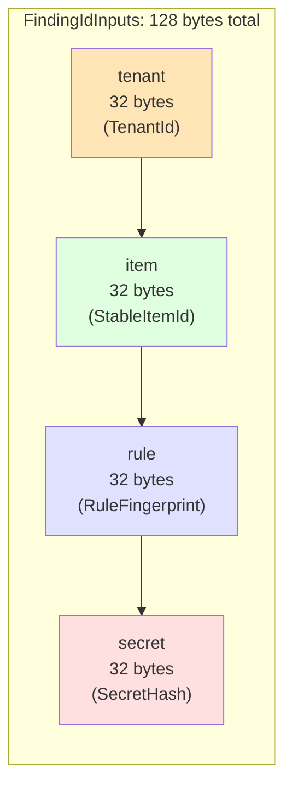

# Canonical Encoding

## The `CanonicalBytes` Trait

The `CanonicalBytes` trait is the encoding foundation for all content-addressed identity derivation. Every type that participates in a content-addressed derivation (`FindingId`, `OccurrenceId`, `StableItemId`, etc.) must implement this trait.

**Source**: `crates/gossip-contracts/src/identity/canonical.rs`

```rust
pub trait CanonicalBytes {
    /// Write this value's canonical byte representation into `hasher`.
    fn write_canonical(&self, hasher: &mut Hasher);
}
```

The trait is deliberately simple: instead of returning a `Vec<u8>` (which would require allocation), values feed their bytes directly into a BLAKE3 hasher. This zero-allocation design is critical for performance in hot paths.

## Three Core Invariants

### 1. Collision-Freedom

**Definition:** For any two distinct values `a != b` of the same type, `a.write_canonical(h)` and `b.write_canonical(h)` must produce different byte sequences.

**Enforcement:**
- Variable-length fields are length-prefixed (a 4-byte little-endian `u32` length, then data)
- Multi-field types use unambiguous framing (fixed-width fields are self-framing)

**Example violation:** Without length prefixes, `("ab", "c")` and `("a", "bc")` would both produce the byte sequence `[0x61, 0x62, 0x63]` (`"abc"`), causing a collision.

**Property test** (`canonical.rs:200-211`):
```rust
proptest! {
    #[test]
    fn slice_collision_free(
        a in proptest::collection::vec(any::<u8>(), 0..128),
        b in proptest::collection::vec(any::<u8>(), 0..128),
    ) {
        prop_assume!(a != b);
        let mut ha = Hasher::new();
        let mut hb = Hasher::new();
        a.as_slice().write_canonical(&mut ha);
        b.as_slice().write_canonical(&mut hb);
        prop_assert_ne!(ha.finalize(), hb.finalize());
    }
}
```

### 2. Determinism

**Definition:** Output must be identical across platforms, byte orders, and Rust versions.

**Enforcement:**
- All integer types use fixed-endian encoding (little-endian by convention)
- No platform-dependent types (e.g., `usize` is banned; use `u32` or `u64` explicitly)
- No uninitialized padding bytes (all `#[repr(C)]` structs are banned)

**Property test** (`canonical.rs:127-133`):
```rust
proptest! {
    #[test]
    fn u32_stable(v in any::<u32>()) {
        let mut h1 = Hasher::new();
        let mut h2 = Hasher::new();
        v.write_canonical(&mut h1);
        v.write_canonical(&mut h2);
        prop_assert_eq!(h1.finalize(), h2.finalize());
    }
}
```

### 3. No Allocation

**Definition:** Implementations must feed directly into the hasher without intermediate allocations.

**Enforcement:**
- The trait signature takes `&mut Hasher`, not `fn() -> Vec<u8>`
- All implementations use `h.update()` directly
- The trait is not `async` (which would require boxing)

## Primitive Implementations

| Type | Width | Encoding | Source Lines |
|------|-------|----------|--------------|
| `u8` | 1 byte | Single byte | `canonical.rs:55-60` |
| `u32` | 4 bytes | Little-endian | `canonical.rs:63-68` |
| `u64` | 8 bytes | Little-endian | `canonical.rs:71-76` |
| `[u8]` (slice) | Variable | `u32` LE length prefix + data | `canonical.rs:86-94` |
| `[u8; 32]` (array) | 32 bytes | Raw bytes (no prefix) | `canonical.rs:97-102` |

### Why Variable-Length Fields Need Length Prefixes

**Problem:** Concatenation ambiguity.

Without length prefixes, the byte sequence `[0x61, 0x62, 0x63]` could represent:
- A single slice: `&[0x61, 0x62, 0x63]`
- Two slices: `&[0x61, 0x62]` + `&[0x63]`
- Three slices: `&[0x61]` + `&[0x62]` + `&[0x63]`

With a 4-byte LE length prefix, these become unambiguous:
- `[3, 0, 0, 0, 0x61, 0x62, 0x63]` (single slice)
- `[2, 0, 0, 0, 0x61, 0x62, 1, 0, 0, 0, 0x63]` (two slices)
- `[1, 0, 0, 0, 0x61, 1, 0, 0, 0, 0x62, 1, 0, 0, 0, 0x63]` (three slices)

**Test** (`canonical.rs:301-313`):
```rust
#[test]
fn concatenation_unambiguous() {
    // ("ab", "c") != ("a", "bc") for variable-length fields.
    let mut h1 = Hasher::new();
    let mut h2 = Hasher::new();

    b"ab".as_slice().write_canonical(&mut h1);
    b"c".as_slice().write_canonical(&mut h1);

    b"a".as_slice().write_canonical(&mut h2);
    b"bc".as_slice().write_canonical(&mut h2);

    assert_ne!(h1.finalize(), h2.finalize());
}
```

### Why Fixed-Width Fields Don't Need Prefixes

**Reason:** Self-framing.

A `[u8; 32]` array always occupies exactly 32 bytes. There's no ambiguity about where it starts or ends. Adding a length prefix would waste 4 bytes and provide no additional information.

**Example:** `FindingIdInputs` has four 32-byte fields (128 bytes total). The encoding is:
```
[tenant: 32B][item: 32B][rule: 32B][secret: 32B]
```

No length prefixes needed because:
- The type system guarantees each field is exactly 32 bytes
- The encoding order is determined by the struct declaration order
- Changing the order changes the hash (verified by field-order swap tests)

## Composite Type Pattern

**Rule:** Fixed-width fields write sequentially; variable-length fields auto-prefix.

**Example** (from `item.rs:453-464`):
```rust
// ItemIdentityKey: ConnectorTag (8B fixed) + ConnectorInstanceIdHash (32B fixed) + locator (variable)
impl CanonicalBytes for ItemIdentityKey {
    fn write_canonical(&self, h: &mut Hasher) {
        self.connector.write_canonical(h);           // Fixed-width: no prefix
        self.connector_instance.write_canonical(h);  // Fixed-width: no prefix
        self.locator.write_canonical(h);             // Variable-length: auto-prefixed
    }
}
```

**Byte layout for `ItemIdentityKey::new(ConnectorTag::from_ascii(b"github"), instance_hash, b"org/repo\0src/main.rs")`:**

```
[github\0\0][<instance hash: 32 bytes>][20, 0, 0, 0][org/repo\0src/main.rs]
│          ││                          ││            ││
│          ││                          ││            │└─ Locator bytes (20 bytes)
│          ││                          ││            └─ Locator length (u32 LE = 20)
│          ││                          │└─ Auto-added by [u8]::write_canonical
│          ││                          └─ ConnectorInstanceIdHash (32 bytes, fixed)
│          │└─ Connector tag (8 bytes, null-padded)
└─ Fixed-width, no prefix
```

## FindingIdInputs Byte-Level Layout

`FindingIdInputs` is the canonical example of a fixed-width composite type. All four fields are 32 bytes, so the encoding is a simple sequential write with no length prefixes.



**Struct declaration** (`finding.rs:255-269`):
```rust
pub struct FindingIdInputs {
    pub tenant: TenantId,          // Byte 0..32
    pub item: StableItemId,        // Byte 32..64
    pub rule: RuleFingerprint,     // Byte 64..96
    pub secret: SecretHash,        // Byte 96..128
}
```

**CanonicalBytes impl** (auto-generated by `define_canonical_input!` macro at `finding.rs:242-265`):
```rust
impl CanonicalBytes for FindingIdInputs {
    fn write_canonical(&self, h: &mut Hasher) {
        self.tenant.write_canonical(h);   // Writes bytes 0..32
        self.item.write_canonical(h);     // Writes bytes 32..64
        self.rule.write_canonical(h);     // Writes bytes 64..96
        self.secret.write_canonical(h);   // Writes bytes 96..128
    }
}
```

**Field order invariant** (doc comment at `finding.rs:248-254`):
```
Field order must match struct declaration order — reordering fields
without updating this impl silently changes every derived `FindingId`
and breaks the golden vectors in `golden.rs`.
```

**Why order matters:** BLAKE3 is a streaming hash. The output depends on the order in which bytes are fed to the hasher. Swapping `tenant` and `item` in the `write_canonical` impl (without swapping them in the struct) would produce a different hash for the same logical value, breaking all existing `FindingId` derivations.

**Test** (`finding.rs:1008-1022`):
```rust
#[test]
fn finding_id_inputs_field_order_matters() {
    let inputs_a = FindingIdInputs {
        tenant: TenantId::from_bytes([0x11; 32]),
        item: StableItemId::from_bytes([0x22; 32]),
        rule: RuleFingerprint::from_bytes([0x33; 32]),
        secret: SecretHash::from_bytes_internal([0x44; 32]),
    };
    let inputs_b = FindingIdInputs {
        tenant: TenantId::from_bytes([0x22; 32]),   // Swapped
        item: StableItemId::from_bytes([0x11; 32]), // Swapped
        rule: RuleFingerprint::from_bytes([0x33; 32]),
        secret: SecretHash::from_bytes_internal([0x44; 32]),
    };
    assert_ne!(derive_finding_id(&inputs_a), derive_finding_id(&inputs_b));
}
```

## Summary

| Concept | Rule | Example |
|---------|------|---------|
| Fixed-width primitive | Write raw bytes | `u32` → 4 bytes LE |
| Variable-length primitive | Write `u32` LE length, then data | `&[u8]` → `[len: 4B LE][data]` |
| Fixed-width array | Write raw bytes (no prefix) | `[u8; 32]` → 32 bytes |
| Fixed-width composite | Write fields sequentially (no prefixes) | `FindingIdInputs` → 128 bytes |
| Mixed-width composite | Fixed fields first (no prefix), variable fields last (auto-prefixed) | `ItemIdentityKey` → `[tag: 8B][instance: 32B][len: 4B][locator]` |

**Next chapter:** Domain Separation Registry (`domain.rs`) — the 16 domain constants and their uniqueness enforcement.
