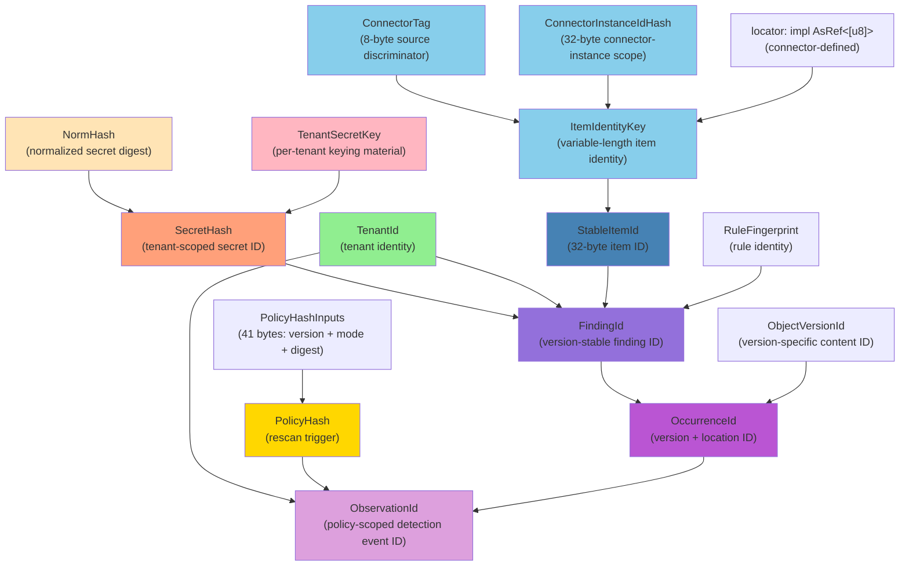
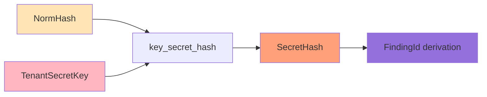
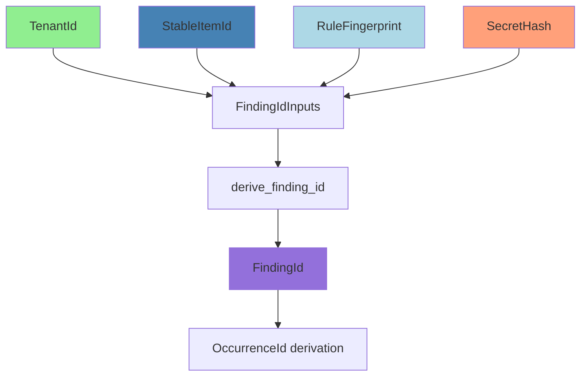
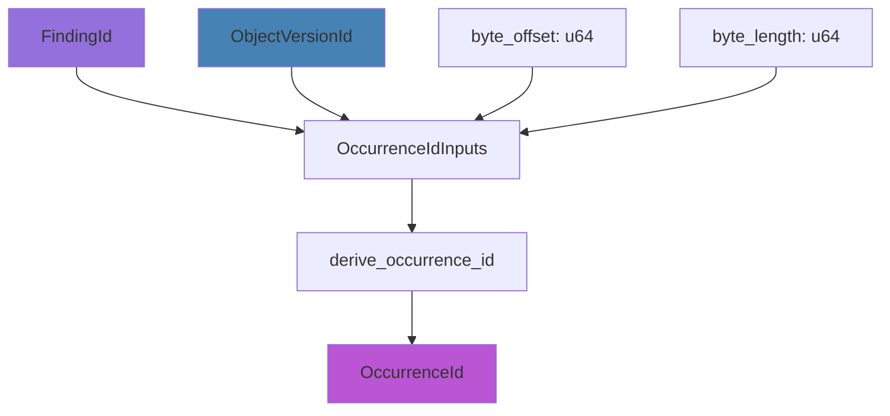
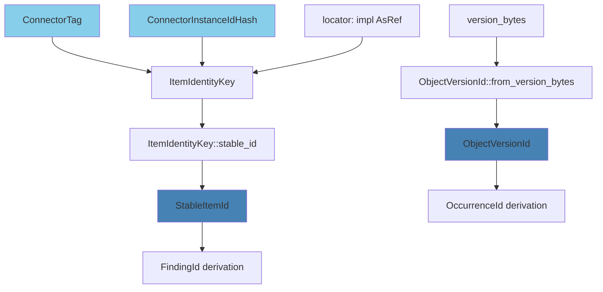
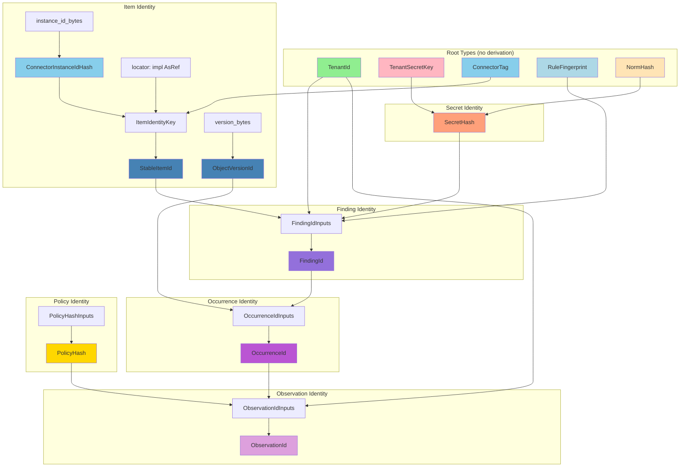

# The ID Type Hierarchy

## Full Derivation Chain

The identity module defines roughly 20 identity types organized in a directed acyclic graph (DAG). Root types stand alone; derived types are computed from inputs via BLAKE3 domain-separated hashing.



## Complete Type Reference

| Type | Width | Construction | Domain Constant | Key Traits | Restricted? |
|------|-------|-------------|-----------------|------------|-------------|
| `TenantId` | 32 B | `from_bytes` (pub) | — | `Clone`, `Copy`, `Eq`, `Ord`, `Hash`, `CanonicalBytes` | No |
| `TenantSecretKey` | 32 B | `from_bytes` (pub) | — | `Clone`, `Copy`, `Eq` (constant-time) | No (but omits `Ord`, `Hash`, `CanonicalBytes`) |
| `PolicyHash` | 32 B | `from_bytes` (pub) | `POLICY_HASH_V2` | `Clone`, `Copy`, `Eq`, `Ord`, `Hash`, `CanonicalBytes` | No |
| `ConnectorTag` | 8 B | `from_ascii` / `from_bytes` | — | `Clone`, `Copy`, `Eq`, `Ord`, `Hash`, `CanonicalBytes` | No |
| `ConnectorInstanceIdHash` | 32 B | `from_instance_id_bytes` | `CONNECTOR_INSTANCE_ID_V1` | `Clone`, `Copy`, `Eq`, `Ord`, `Hash`, `CanonicalBytes` | No |
| `ItemIdentityKey` | Variable | `new(connector, connector_instance, locator)` | — | `Clone`, `Eq`, `Hash`, `CanonicalBytes` | No |
| `StableItemId` | 32 B | via `ItemIdentityKey::stable_id()` | `ITEM_ID_V1` | `Clone`, `Copy`, `Eq`, `Ord`, `Hash`, `CanonicalBytes` | No |
| `ObjectVersionId` | 32 B | `from_version_bytes` | `OBJECT_VERSION_V1` | `Clone`, `Copy`, `Eq`, `Ord`, `Hash`, `CanonicalBytes` | No |
| `NormHash` | 32 B | `from_digest` (pub) | — | `Clone`, `Copy`, `Eq`, `Ord`, `Hash`, `CanonicalBytes` | **Yes** (redacted Debug) |
| `SecretHash` | 32 B | via `key_secret_hash` | `SECRET_HASH_V1` (keyed) | `Clone`, `Copy`, `Eq`, `Ord`, `Hash`, `CanonicalBytes` | **Yes** (redacted Debug) |
| `RuleFingerprint` | 32 B | `from_bytes` (pub) | `RULE_FINGERPRINT_V1` | `Clone`, `Copy`, `Eq`, `Ord`, `Hash`, `CanonicalBytes` | No |
| `FindingId` | 32 B | via `derive_finding_id` | `FINDING_ID_V1` | `Clone`, `Copy`, `Eq`, `Ord`, `Hash`, `CanonicalBytes` | No |
| `OccurrenceId` | 32 B | via `derive_occurrence_id` | `OCCURRENCE_ID_V1` | `Clone`, `Copy`, `Eq`, `Ord`, `Hash`, `CanonicalBytes` | No |
| `ObservationId` | 32 B | via `derive_observation_id` | `OBSERVATION_ID_V1` | `Clone`, `Copy`, `Eq`, `Ord`, `Hash`, `CanonicalBytes` | No |
| `FindingIdInputs` | 128 B | struct literal | — | `Clone`, `Copy`, `Eq`, `CanonicalBytes` | No |
| `OccurrenceIdInputs` | 80 B | struct literal | — | `Clone`, `Copy`, `Eq`, `CanonicalBytes` | No |
| `ObservationIdInputs` | 96 B | struct literal | — | `Clone`, `Copy`, `Eq`, `CanonicalBytes` | No |
| `PolicyHashInputs` | 41 B | struct literal | — | `Clone`, `Copy`, `Eq`, `CanonicalBytes` | No |

## Notable Type Methods

### TenantSecretKey::is_valid()

**Source:** `types.rs:152-154`

```rust
impl TenantSecretKey {
    pub fn is_valid(&self) -> bool {
        !self.0.iter().all(|&b| b == 0)
    }
}
```

Checks that the key has non-trivial entropy — returns `true` if the key is not all-zeros. An all-zero key provides no tenant isolation and should be rejected during provisioning.

**Why not checked in `from_bytes`?** `from_bytes` is `const fn` and cannot perform this check automatically (iteration in `const fn` is limited). Callers at the provisioning boundary should call `is_valid()` after construction.

**Important:** This is a necessary but not sufficient entropy check. Production provisioning should use cryptographically random key material.

### ShardId::is_derived()

**Source:** `coordination.rs:76-86`

```rust
impl ShardId {
    pub const fn is_derived(&self) -> bool {
        self.0 >> 63 != 0
    }
}
```

Returns `true` if bit 63 is set, marking this as a **split-derived shard**. Root shards (externally assigned by the coordination layer) have bit 63 clear. Derived shards are produced by `derive_split_shard_id` (in `gossip-coordination`), which forces bit 63 high.

**Bit 63 convention:**
- `0xxx_xxxx_xxxx_xxxx` (bit 63 = 0) → Root shard (externally assigned)
- `1xxx_xxxx_xxxx_xxxx` (bit 63 = 1) → Split-derived shard (hash-derived)

This convention allows the system to distinguish root shards from split-derived shards without an external lookup, which is useful for debugging and invariant enforcement.

### FenceEpoch: Monotonic Fencing

**Source:** `coordination.rs:92-159`

`FenceEpoch` prevents stale leaders from mutating shard state after a new leader has been elected. The epoch is incremented on every leader transition; operations bearing an outdated epoch are rejected.

**Constants:**

```rust
impl FenceEpoch {
    pub const ZERO: Self = Self(0);     // "No epoch assigned" (pre-registration state)
    pub const INITIAL: Self = Self(1);  // First valid epoch; shards start here after creation
}
```

**Key methods:**

```rust
impl FenceEpoch {
    /// Whether an epoch has been assigned (i.e., is not ZERO).
    pub const fn is_assigned(&self) -> bool {
        self.0 != 0
    }

    /// Advance the epoch by one.
    /// Panics at u64::MAX — saturating_add would silently produce duplicate
    /// epochs, breaking mutual exclusion.
    #[must_use]
    pub fn increment(&self) -> Self {
        Self(self.0.checked_add(1).expect("FenceEpoch overflow at u64::MAX"))
    }
}
```

**Design: `increment()` panics instead of saturating.** This is intentional — `saturating_add` would silently produce duplicate epochs, breaking the mutual exclusion guarantee. See Kleppmann, "How to do distributed locking" (2016); Hochstein, "Fencing Tokens" FizzBee formal model (2025).

**`#[must_use]` annotation:** `increment()` returns a **new** epoch; the original is unchanged. The `#[must_use]` attribute prevents accidentally discarding the incremented value.

### LogicalTime::checked_add()

**Source:** `coordination.rs:208-210`

```rust
impl LogicalTime {
    /// Advance time by `duration`. Returns `None` on overflow to prevent
    /// immortal leases.
    #[must_use]
    pub fn checked_add(&self, duration: u64) -> Option<Self> {
        self.0.checked_add(duration).map(Self)
    }
}
```

Returns `None` on overflow instead of wrapping or saturating. This prevents immortal leases — if a lease expiry overflows `u64::MAX`, the lease must fail rather than wrap around to a past time.

See Gray & Cheriton, "Leases: An Efficient Fault-Tolerant Mechanism for Distributed File Cache Consistency" (SOSP 1989).

## Key Derivation Relationships

### Secret Identity Chain



**Source:** `finding.rs:327-335`

```rust
pub fn key_secret_hash(key: &TenantSecretKey, norm: &NormHash) -> SecretHash {
    let mut h = Hasher::new_keyed(key.as_bytes());
    h.update(domain::SECRET_HASH_V1.as_bytes());
    h.update(norm.as_bytes());
    SecretHash::from_bytes_internal(finalize_32(&h))
}
```

**Why tenant-keyed:** Same normalized secret + different tenant keys → different `SecretHash` values. This prevents cross-tenant correlation: an attacker with tenant A's `SecretHash` values cannot determine if tenant B found the same secret.

### Finding Identity Chain



**Source:** `finding.rs:361-363`

```rust
pub fn derive_finding_id(inputs: &FindingIdInputs) -> FindingId {
    FindingId::from_bytes(derive_from_cached(&FINDING_HASHER, inputs))
}
```

**Inputs struct** (`finding.rs:230-239`):
```rust
pub struct FindingIdInputs {
    pub tenant: TenantId,          // Who owns the scan
    pub item: StableItemId,        // What was scanned
    pub rule: RuleFingerprint,     // What rule matched
    pub secret: SecretHash,        // What secret was found (tenant-keyed)
}
```

**Why version-stable:** `ObjectVersionId` is deliberately excluded from `FindingIdInputs`. The same finding persists across versions of the scanned item, enabling stable triage state. If a secret is marked "accepted" in commit A, it remains accepted in commit B (same `FindingId`), but the occurrence at a new byte offset in commit B gets a new `OccurrenceId`.

### Occurrence Identity Chain



**Source:** `finding.rs:384-386`

```rust
pub fn derive_occurrence_id(inputs: &OccurrenceIdInputs) -> OccurrenceId {
    OccurrenceId::from_bytes(derive_from_cached(&OCCURRENCE_HASHER, inputs))
}
```

**Inputs struct** (`finding.rs:260-269`):
```rust
pub struct OccurrenceIdInputs {
    pub finding: FindingId,           // Version-stable finding
    pub version: ObjectVersionId,     // Specific version
    pub byte_offset: u64,             // Where in the content
    pub byte_length: u64,             // How long
}
```

**Why version-specific:** `OccurrenceId` captures the precise location of a secret in a specific version. Moving the file (changing byte offset) or editing the secret (changing byte length) produces a new `OccurrenceId`, even if the underlying `FindingId` is unchanged.

### Item Identity Chain



**Source:** `item.rs:467-471`

```rust
impl ItemIdentityKey {
    pub fn stable_id(&self) -> StableItemId {
        let mut h = ITEM_ID_HASHER.clone();
        self.write_canonical(&mut h);
        StableItemId::from_bytes(finalize_32(&h))
    }
}
```

**Source:** `item.rs:580-585`

```rust
impl ObjectVersionId {
    pub fn from_version_bytes(version_bytes: &[u8]) -> Self {
        assert!(!version_bytes.is_empty());
        let mut h = OBJECT_VERSION_HASHER.clone();
        version_bytes.write_canonical(&mut h);
        Self::from_bytes(finalize_32(&h))
    }
}
```

**Why separate derivations:** `StableItemId` and `ObjectVersionId` are independent. The same file (`StableItemId`) can have many versions (`ObjectVersionId` values). They use different domain constants (`ITEM_ID_V1` vs `OBJECT_VERSION_V1`) to ensure domain separation.

### Policy Hash Chain

```mermaid
graph TD
    A[policy_hash_version: u32] --> B[PolicyHashInputs]
    C[id_hash_mode: IdHashMode] --> B
    D[evidence_hash_version: u32] --> B
    E[rules_digest: [u8; 32]] --> B
    B --> F[compute_policy_hash]
    F --> G[PolicyHash]
    G --> H[RunId creation]
    H --> I[Rescan decision]

    style G fill:#FFD700
```

**Source:** `policy.rs:160-162`

```rust
pub fn compute_policy_hash(inputs: &PolicyHashInputs) -> PolicyHash {
    PolicyHash::from_bytes(derive_from_cached(&POLICY_HASH_HASHER, inputs))
}
```

**Inputs struct** (`policy.rs:106-116`):
```rust
pub struct PolicyHashInputs {
    pub policy_hash_version: u32,        // Scheme version (bump to force rescan)
    pub id_hash_mode: IdHashMode,        // Keyed vs unkeyed
    pub evidence_hash_version: u32,      // Normalization version
    pub rules_digest: [u8; 32],          // Content-addressed rule set
}
```

## Why `ObjectVersionId` Is Excluded from `FindingId`

**Design goal:** Stable triage state across versions.

**Scenario:** A developer pushes commit A containing a test API key. The secret is detected, and the security team marks the finding as "accepted risk" (it's a test key, not production). The developer later refactors the code in commit B, moving the file to a different directory. The test key is still present.

**With version-stable `FindingId`:**
- Commit A: `FindingId(tenant=X, item=Y, rule=Z, secret=S)` → triage state = "accepted"
- Commit B: Same `FindingId` (file moved, but `StableItemId` is unchanged) → triage state = "accepted" (inherited)
- New `OccurrenceId` for the new byte offset, but no re-alert

**Without version-stable `FindingId` (hypothetical broken design):**
- Commit A: `FindingId(tenant=X, item=Y, rule=Z, secret=S, version=A)` → triage state = "accepted"
- Commit B: New `FindingId(tenant=X, item=Y, rule=Z, secret=S, version=B)` → triage state = **unknown** (new finding)
- Security team gets re-alerted for the same accepted test key

**Implementation detail** (`finding.rs:230-239`):
```rust
pub struct FindingIdInputs {
    pub tenant: TenantId,
    pub item: StableItemId,        // Version-stable
    pub rule: RuleFingerprint,
    pub secret: SecretHash,
    // ❌ NO ObjectVersionId field here
}
```

**Version-specific info goes in `OccurrenceId`** (`finding.rs:260-269`):
```rust
pub struct OccurrenceIdInputs {
    pub finding: FindingId,        // Inherited triage state
    pub version: ObjectVersionId,  // ✅ Version here
    pub byte_offset: u64,
    pub byte_length: u64,
}
```

## Full Derivation DAG



## Summary

| Derivation | Inputs | Domain Constant | Output |
|------------|--------|-----------------|--------|
| Connector-instance identity | `instance_id_bytes` | `CONNECTOR_INSTANCE_ID_V1` | `ConnectorInstanceIdHash` |
| Item identity | `ConnectorTag` + `ConnectorInstanceIdHash` + `locator` | `ITEM_ID_V1` | `StableItemId` |
| Version identity | `version_bytes` | `OBJECT_VERSION_V1` | `ObjectVersionId` |
| Secret keying | `TenantSecretKey` + `NormHash` | `SECRET_HASH_V1` (keyed) | `SecretHash` |
| Finding identity | `TenantId` + `StableItemId` + `RuleFingerprint` + `SecretHash` | `FINDING_ID_V1` | `FindingId` |
| Occurrence identity | `FindingId` + `ObjectVersionId` + `byte_offset` + `byte_length` | `OCCURRENCE_ID_V1` | `OccurrenceId` |
| Observation identity | `TenantId` + `PolicyHash` + `OccurrenceId` | `OBSERVATION_ID_V1` | `ObservationId` |
| Policy identity | `policy_hash_version` + `id_hash_mode` + `evidence_hash_version` + `rules_digest` | `POLICY_HASH_V2` | `PolicyHash` |

**Next chapter:** Item Identity (`item.rs`) — deep dive into `ConnectorTag`, `ItemIdentityKey`, `StableItemId`, and `ObjectVersionId`.
