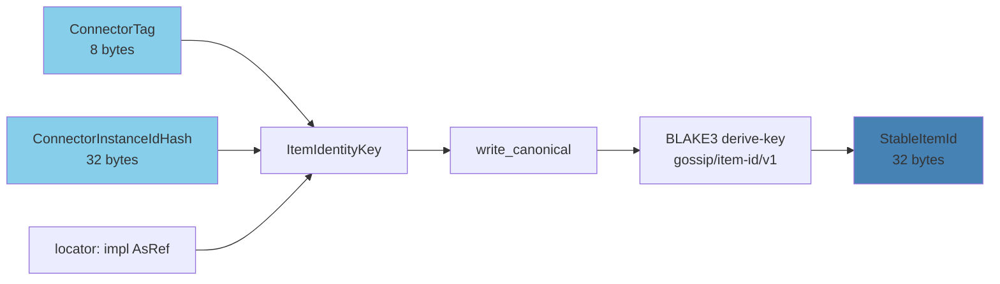
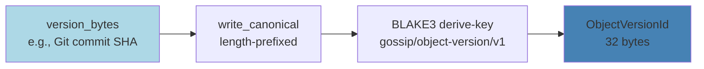
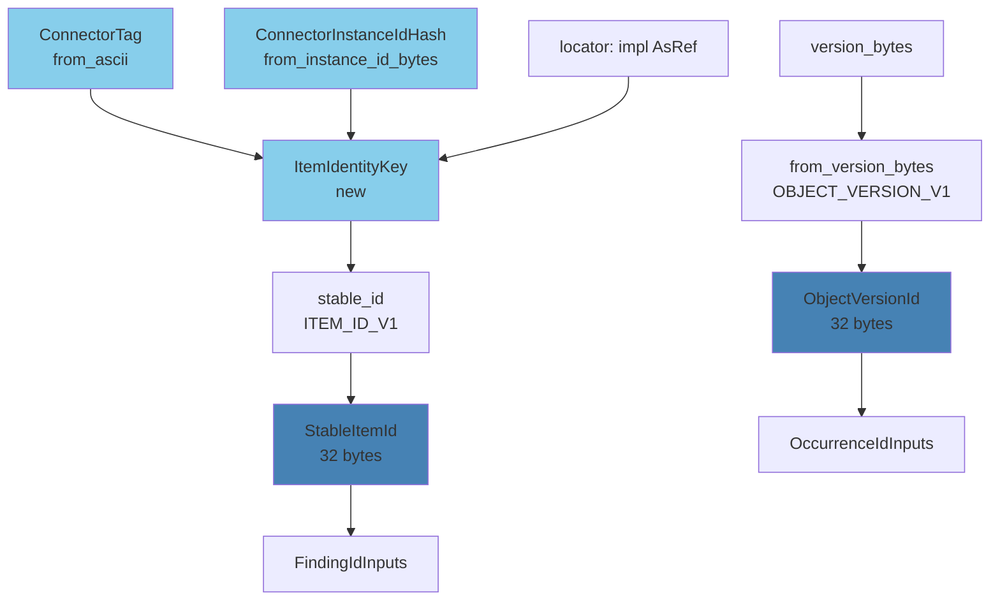

# Item Identity

## Overview

The item identity module (`item.rs`) answers two questions:
1. **What was scanned?** → `ItemIdentityKey` + `StableItemId`
2. **Which version of it?** → `ObjectVersionId`

These types form the scan-object layer of the identity spine, connecting the detection engine's outputs to the content being scanned.

## IdentityInputError: Validation Errors for Identity Constructors

**Purpose:** Rich error enum returned by the `try_*` fallible constructors on `ConnectorTag`, `ItemIdentityKey`, and `ObjectVersionId`. The panicking constructors (`from_ascii`, `new`, `from_version_bytes`) remain available for trusted internal code.

**Source:** `item.rs:46-98`

```rust
#[derive(Debug, Clone, PartialEq, Eq, thiserror::Error)]
pub enum IdentityInputError {
    /// Connector tag is empty.
    #[error("ConnectorTag must not be empty")]
    EmptyTag,
    /// Connector tag exceeds 8 bytes.
    #[error("ConnectorTag must be at most 8 bytes, got {0}")]
    TagTooLong(usize),
    /// Connector tag contains a non-ASCII-graphic byte at the given index.
    #[error("ConnectorTag byte at index {index} is not ASCII graphic: 0x{byte:02X}")]
    NonGraphicByte { index: usize, byte: u8 },
    /// Connector instance ID bytes are empty.
    #[error("connector instance ID bytes must not be empty")]
    EmptyConnectorInstanceId,
    /// Item locator is empty.
    #[error("ItemIdentityKey locator must not be empty")]
    EmptyLocator,
    /// Version bytes are empty.
    #[error("version bytes must not be empty")]
    EmptyVersionBytes,
}
```

**Six variants**, each carrying enough context to produce a useful error message without re-inspecting the original input:

| Variant | Returned By | Context Carried |
|---------|-------------|-----------------|
| `EmptyTag` | `ConnectorTag::try_from_ascii` | — |
| `TagTooLong(usize)` | `ConnectorTag::try_from_ascii` | Actual length of the tag |
| `NonGraphicByte { index, byte }` | `ConnectorTag::try_from_ascii` | Byte index and invalid byte value |
| `EmptyConnectorInstanceId` | `ConnectorInstanceIdHash::try_from_instance_id_bytes` | — |
| `EmptyLocator` | `ItemIdentityKey::try_new` | — |
| `EmptyVersionBytes` | `ObjectVersionId::try_from_version_bytes` | — |

**`Display` impl** is generated by the `thiserror::Error` derive macro via `#[error("...")]` attributes on each variant. Human-readable messages include offending values:

```rust
// Examples:
// "ConnectorTag must not be empty"
// "ConnectorTag must be at most 8 bytes, got 12"
// "ConnectorTag byte at index 3 is not ASCII graphic: 0x00"
// "connector instance ID bytes must not be empty"
// "ItemIdentityKey locator must not be empty"
// "version bytes must not be empty"
```

**`Error` impl:** Generated by `thiserror::Error` derive. All variants are self-describing leaf errors with no inner `source`.

**Design:** The panicking constructors are intended for trusted internal code (connectors are in-process). The `try_*` variants are for system boundaries where input comes from external sources.

## ConnectorTag: 8-Byte Source Discriminator

**Purpose:** Prevents cross-source collisions. A GitHub file at `org/repo/path.txt` and a GitLab file at `org/repo/path.txt` must hash to different `StableItemId` values.

**Source:** `item.rs:137-257`

### Structure

```rust
pub struct ConnectorTag([u8; 8]);  // Private inner field
```

**Width:** Always exactly 8 bytes (fixed-width)

**Conventions:**
- Short ASCII identifiers, null-padded on the right
- Examples:
  - `b"github\0\0"` — GitHub connector
  - `b"gitlab\0\0"` — GitLab connector
  - `b"s3\0\0\0\0\0\0"` — S3 connector
  - `b"azblob\0\0"` — Azure Blob connector

### Construction

**`from_ascii` (const fn):**

```rust
pub const fn from_ascii(tag: &[u8]) -> Self {
    assert!(!tag.is_empty());
    assert!(tag.len() <= 8);
    let mut buf = [0u8; 8];
    let mut i = 0;
    while i < tag.len() {
        assert!(tag[i] >= 0x21 && tag[i] <= 0x7E); // ASCII graphic only
        buf[i] = tag[i];
        i += 1;
    }
    Self(buf)
}
```

**Key features:**
- `const fn` — can define module-level constants with zero runtime cost
- Null-padded automatically (trailing bytes are `0x00`)
- Panics on: empty tag, >8 bytes, non-ASCII-graphic bytes (0x21..=0x7E)

**Example:**
```rust
const GITHUB: ConnectorTag = ConnectorTag::from_ascii(b"github");
assert_eq!(GITHUB.as_bytes(), b"github\0\0");

const S3: ConnectorTag = ConnectorTag::from_ascii(b"s3");
assert_eq!(S3.as_bytes(), b"s3\0\0\0\0\0\0");
```

**`try_from_ascii` (fallible):**

**Source:** `item.rs:223-238`

```rust
pub fn try_from_ascii(tag: &[u8]) -> Result<Self, IdentityInputError> {
    if tag.is_empty() {
        return Err(IdentityInputError::EmptyTag);
    }
    if tag.len() > 8 {
        return Err(IdentityInputError::TagTooLong(tag.len()));
    }
    let mut buf = [0u8; 8];
    for (i, &b) in tag.iter().enumerate() {
        if !(0x21..=0x7E).contains(&b) {
            return Err(IdentityInputError::NonGraphicByte { index: i, byte: b });
        }
        buf[i] = b;
    }
    Ok(Self(buf))
}
```

Returns an error instead of panicking when the input is invalid. Use this at system boundaries where the tag comes from external input (e.g., user-supplied connector configuration). Same validation rules as `from_ascii`, but returns `Result` instead of panicking.

**`from_bytes` (unvalidated escape hatch):**

```rust
pub const fn from_bytes(bytes: [u8; 8]) -> Self {
    Self(bytes)
}
```

Use this for deserialization or foreign-format tags that may not satisfy the ASCII-graphic invariant. Prefer `from_ascii` for standard connectors.

### Debug Implementation

Three branches (source: `item.rs:140-169`):

1. **Properly null-padded + all-ASCII-graphic prefix** → Quoted ASCII
   ```rust
   ConnectorTag("github")  // For b"github\0\0"
   ```

2. **No NUL (all 8 bytes filled) + all-ASCII-graphic** → Quoted ASCII
   ```rust
   ConnectorTag("githubXY")  // For b"githubXY"
   ```

3. **Everything else** → Hex
   ```rust
   ConnectorTag(676974687562007f)  // For b"github\0\x7F"
   ```

**Test** (`item.rs:644-656`):
```rust
#[test]
fn connector_tag_debug_nonzero_after_nul() {
    let tag = ConnectorTag::from_bytes(*b"github\0\x42");
    let dbg = format!("{tag:?}");
    assert!(!dbg.contains("\"github\""));  // Must not hide trailing byte
    assert!(dbg.contains("676974687562"));  // Hex output
}
```

## ConnectorInstanceIdHash: 32-Byte Connector-Instance Scope

**Purpose:** Hashes variable-length connector instance identifiers into a fixed-width 32-byte value. Keeps `ItemIdentityKey` framing simple and prevents identity collisions when two instances scan the same locator under the same connector tag.

**Source:** `item.rs:273-313`

```rust
crate::define_id_32! {
    /// Stable hash of a connector instance identifier.
    ConnectorInstanceIdHash
}
```

### Derivation

**Method:** `ConnectorInstanceIdHash::from_instance_id_bytes(instance_id: &[u8])` (source: `item.rs:290-298`)

```rust
pub fn from_instance_id_bytes(instance_id: &[u8]) -> Self {
    assert!(
        !instance_id.is_empty(),
        "connector instance ID bytes must not be empty"
    );
    let mut hasher = CONNECTOR_INSTANCE_HASHER.clone();
    instance_id.write_canonical(&mut hasher);
    Self::from_bytes(finalize_32(&hasher))
}
```

**Domain constant:** `CONNECTOR_INSTANCE_ID_V1 = "gossip/connector-instance-id/v1"` (from `domain.rs:79`)

**Flow:**
1. Validate instance ID bytes are non-empty (panic if empty)
2. Clone the cached `CONNECTOR_INSTANCE_HASHER` (pre-initialized with `CONNECTOR_INSTANCE_ID_V1` context)
3. Feed instance ID bytes via `write_canonical` (4-byte LE length prefix + data)
4. Finalize to 32 bytes
5. Wrap in `ConnectorInstanceIdHash` newtype

**Fallible variant:** `try_from_instance_id_bytes` (source: `item.rs:306-313`)

```rust
pub fn try_from_instance_id_bytes(instance_id: &[u8]) -> Result<Self, IdentityInputError> {
    if instance_id.is_empty() {
        return Err(IdentityInputError::EmptyConnectorInstanceId);
    }
    let mut hasher = CONNECTOR_INSTANCE_HASHER.clone();
    instance_id.write_canonical(&mut hasher);
    Ok(Self::from_bytes(finalize_32(&hasher)))
}
```

Returns `Err(IdentityInputError::EmptyConnectorInstanceId)` instead of panicking when `instance_id` is empty. Use this at system boundaries where the instance ID comes from external input.

**Example:**
```rust
let instance = ConnectorInstanceIdHash::from_instance_id_bytes(b"github-installation-1");
// instance is a 32-byte hash of the connector instance identifier
```

## ItemIdentityKey: Variable-Length Item Identity

**Purpose:** The full, human-meaningful identity of a scannable item. Carries enough information to uniquely locate an item across all connectors.

**Source:** `item.rs:320-413`

### Structure

```rust
pub struct ItemIdentityKey {
    connector: ConnectorTag,                    // 8 bytes, fixed
    connector_instance: ConnectorInstanceIdHash, // 32 bytes, fixed
    locator: Box<[u8]>,                         // Variable-length, connector-defined
}
```

**Examples:**
- GitHub: `connector = b"github\0\0"`, `connector_instance = hash(b"github-installation-1")`, `locator = b"owner/repo\0src/main.rs"`
- S3: `connector = b"s3\0\0\0\0\0\0"`, `connector_instance = hash(b"s3-account-1")`, `locator = b"my-bucket\0path/to/object.json"`

### Construction

**`new` (panicking):**

```rust
pub fn new(
    connector: ConnectorTag,
    connector_instance: ConnectorInstanceIdHash,
    locator: impl AsRef<[u8]>,
) -> Self {
    let locator = locator.as_ref();
    assert!(
        !locator.is_empty(),
        "ItemIdentityKey locator must not be empty"
    );
    Self {
        connector,
        connector_instance,
        locator: locator.into(),
    }
}
```

Panics if `locator` is empty. An empty locator is a programming error in the connector — every scannable item has a non-empty location.

### Accessors

**Source:** `item.rs:441-460`

```rust
impl ItemIdentityKey {
    /// The connector tag for this item (e.g., `b"github\0\0"`).
    pub fn connector(&self) -> ConnectorTag {
        self.connector
    }

    /// The connector-instance hash for this item.
    pub fn connector_instance(&self) -> ConnectorInstanceIdHash {
        self.connector_instance
    }

    /// The opaque, connector-defined locator bytes for this item.
    /// The returned slice never includes the connector tag.
    pub fn locator(&self) -> &[u8] {
        &self.locator
    }
}
```

All fields are private with public accessors (codebase convention). `connector()` returns by value (`ConnectorTag` is `Copy` — 8 bytes). `connector_instance()` returns by value (`ConnectorInstanceIdHash` is `Copy` — 32 bytes). `locator()` returns a borrowed slice.

**Example:**
```rust
let github = ConnectorTag::from_ascii(b"github");
let instance = ConnectorInstanceIdHash::from_instance_id_bytes(b"github-installation-1");
let key = ItemIdentityKey::new(github, instance, b"org/repo\0src/main.rs");

assert_eq!(key.connector(), github);
assert_eq!(key.connector_instance(), instance);
assert_eq!(key.locator(), b"org/repo\0src/main.rs");
```

**`try_new` (fallible):**

```rust
pub fn try_new(
    connector: ConnectorTag,
    connector_instance: ConnectorInstanceIdHash,
    locator: impl AsRef<[u8]>,
) -> Result<Self, IdentityInputError> {
    let locator = locator.as_ref();
    if locator.is_empty() {
        return Err(IdentityInputError::EmptyLocator);
    }
    Ok(Self { connector, connector_instance, locator: locator.into() })
}
```

Use this at system boundaries where the locator comes from external input.

### CanonicalBytes Encoding

**Source:** `item.rs:474-485`

```rust
impl CanonicalBytes for ItemIdentityKey {
    fn write_canonical(&self, h: &mut Hasher) {
        self.connector.write_canonical(h);           // Fixed-width: no prefix (8 bytes)
        self.connector_instance.write_canonical(h);  // Fixed-width: no prefix (32 bytes)
        self.locator.write_canonical(h);             // Variable-length: auto-prefixed
    }
}
```

**Byte layout for `ItemIdentityKey::new(ConnectorTag::from_ascii(b"github"), instance_hash, b"org/repo\0src/main.rs")`:**

```
┌──────────┬────────────────────────────────┬────────────┬──────────────────────────────┐
│ github\0\0│ <ConnectorInstanceIdHash>      │ 20,0,0,0   │ org/repo\0src/main.rs        │
│ (8 bytes)│ (32 bytes)                     │ (u32 LE)   │ (20 bytes)                   │
│ Fixed    │ Fixed                          │ Length     │ Locator data                 │
└──────────┴────────────────────────────────┴────────────┴──────────────────────────────┘
```

**Why this works:**
- `ConnectorTag` is fixed-width (8 bytes) → no length prefix needed
- `ConnectorInstanceIdHash` is fixed-width (32 bytes) → no length prefix needed
- `locator` is variable-length → `[u8]::write_canonical` adds a 4-byte LE length prefix automatically
- Collision-free: two different `ItemIdentityKey` values (different connector, instance, OR locator) produce different byte sequences

**Test** (`item.rs:680-700`):
```rust
#[test]
fn item_identity_key_canonical_bytes_unambiguous() {
    let a = ItemIdentityKey::new(
        ConnectorTag::from_bytes(*b"ab\0\0\0\0\0\0"),
        ConnectorInstanceIdHash::from_bytes([0x10; 32]),
        b"cd",
    );
    let b = ItemIdentityKey::new(
        ConnectorTag::from_bytes(*b"abcd\0\0\0\0"),
        ConnectorInstanceIdHash::from_bytes([0x20; 32]),
        b"ef",
    );
    let mut ha = Hasher::new();
    let mut hb = Hasher::new();
    a.write_canonical(&mut ha);
    b.write_canonical(&mut hb);
    assert_ne!(ha.finalize(), hb.finalize());
}
```

## StableItemId: 32-Byte Derived Item Identity

**Purpose:** Fixed-width item identity for use in derivation chains. Derived from `ItemIdentityKey` via BLAKE3.

**Source:** `item.rs:491-509`

```rust
crate::define_id_32! {
    /// Content-addressed identity of a scannable item.
    ///
    /// Derived as `blake3("gossip/item-id/v1", canonical_bytes(item_key))`.
    StableItemId
}
```

### Derivation

**Method:** `ItemIdentityKey::stable_id()` (source: `item.rs:467-471`)

```rust
impl ItemIdentityKey {
    pub fn stable_id(&self) -> StableItemId {
        let mut h = ITEM_ID_HASHER.clone();  // Cached hasher with ITEM_ID_V1 context
        self.write_canonical(&mut h);
        StableItemId::from_bytes(finalize_32(&h))
    }
}
```

**Domain constant:** `ITEM_ID_V1 = "gossip/item-id/v1"` (from `domain.rs:74`)

**Flow:**
1. Clone the cached `ITEM_ID_HASHER` (pre-initialized with `ITEM_ID_V1` context)
2. Feed `ItemIdentityKey` into the hasher via `write_canonical`
3. Finalize to 32 bytes
4. Wrap in `StableItemId` newtype



### Tenant-Independence

**Key property:** `StableItemId` is **tenant-independent**. The same file has the same `StableItemId` regardless of which tenant is scanning it.

**Why:** Tenant scoping is applied at `FindingId` derivation (via `TenantId` in `FindingIdInputs`). This allows:
- Deduplication across tenants at the item level (if desired)
- Shared caching of scan results (if the detection engine uses `StableItemId` as a cache key)

**Example:**
```rust
let key = ItemIdentityKey::new(
    ConnectorTag::from_ascii(b"github"),
    ConnectorInstanceIdHash::from_instance_id_bytes(b"github-installation-1"),
    b"org/repo\0main.rs",
);
let id_tenant_a = key.stable_id();  // Tenant A scans this file
let id_tenant_b = key.stable_id();  // Tenant B scans the same file
assert_eq!(id_tenant_a, id_tenant_b);  // Same StableItemId
```

### Property Tests

**Purity** (`item.rs:771-784`):
```rust
proptest! {
    #[test]
    fn item_identity_key_stable_id_is_pure(
        tag_bytes in proptest::array::uniform8(any::<u8>()),
        connector_instance in proptest::array::uniform32(any::<u8>()),
        locator in proptest::collection::vec(any::<u8>(), 1..256),
    ) {
        let key = ItemIdentityKey::new(
            ConnectorTag::from_bytes(tag_bytes),
            ConnectorInstanceIdHash::from_bytes(connector_instance),
            locator,
        );
        let id1 = key.stable_id();
        let id2 = key.stable_id();
        prop_assert_eq!(id1, id2);
    }
}
```

**Collision-freedom** (`item.rs:844-868`):
```rust
proptest! {
    #[test]
    fn item_identity_key_stable_id_collision_free(
        tag_a in uniform8(any::<u8>()), tag_b in uniform8(any::<u8>()),
        instance_a in uniform32(any::<u8>()), instance_b in uniform32(any::<u8>()),
        locator_a in vec(any::<u8>(), 1..128), locator_b in vec(any::<u8>(), 1..128),
    ) {
        prop_assume!(tag_a != tag_b || instance_a != instance_b || locator_a != locator_b);
        let a = ItemIdentityKey::new(
            ConnectorTag::from_bytes(tag_a),
            ConnectorInstanceIdHash::from_bytes(instance_a),
            locator_a,
        );
        let b = ItemIdentityKey::new(
            ConnectorTag::from_bytes(tag_b),
            ConnectorInstanceIdHash::from_bytes(instance_b),
            locator_b,
        );
        prop_assert_ne!(a.stable_id(), b.stable_id());
    }
}
```

## ObjectVersionId: Version-Specific Content Identity

**Purpose:** Identity of a specific version of a scannable item's content.

**Source:** `item.rs:515-547`

```rust
crate::define_id_32! {
    /// Identity of a specific version of a scannable item's content.
    ObjectVersionId
}
```

### Examples of Version Tokens

| Connector | Version Token | Meaning |
|-----------|---------------|---------|
| Git | `blake3(commit_sha ++ tree_sha_for_path)` | Exact content at a specific commit |
| S3 | `blake3(etag_bytes)` or `blake3(version_id_bytes)` | S3 object version |
| Content-hash | `blake3(raw_content)` | For sources without native versioning |

### Derivation

**Method:** `ObjectVersionId::from_version_bytes(version_bytes: &[u8])` (source: `item.rs:580-585`)

```rust
pub fn from_version_bytes(version_bytes: &[u8]) -> Self {
    assert!(!version_bytes.is_empty());
    let mut h = OBJECT_VERSION_HASHER.clone();
    version_bytes.write_canonical(&mut h);
    Self::from_bytes(finalize_32(&h))
}
```

**Domain constant:** `OBJECT_VERSION_V1 = "gossip/object-version/v1"` (from `domain.rs:84`)

**Flow:**
1. Validate version bytes are non-empty (panic if empty)
2. Clone the cached `OBJECT_VERSION_HASHER` (pre-initialized with `OBJECT_VERSION_V1` context)
3. Feed version bytes via `write_canonical` (4-byte LE length prefix + data)
4. Finalize to 32 bytes
5. Wrap in `ObjectVersionId` newtype



**Fallible variant:** `try_from_version_bytes` (source: `item.rs:597-604`)

```rust
pub fn try_from_version_bytes(version_bytes: &[u8]) -> Result<Self, IdentityInputError> {
    if version_bytes.is_empty() {
        return Err(IdentityInputError::EmptyVersionBytes);
    }
    let mut h = OBJECT_VERSION_HASHER.clone();
    version_bytes.write_canonical(&mut h);
    Ok(Self::from_bytes(finalize_32(&h)))
}
```

Returns `Err(IdentityInputError::EmptyVersionBytes)` instead of panicking when `version_bytes` is empty. Use this at system boundaries where the version token comes from external input. The happy path is identical to `from_version_bytes`.

### Role in Finding Model

**`ObjectVersionId` enters `OccurrenceId` derivation but NOT `FindingId`.**

**Why:**
- `FindingId` is version-stable: "rule R found secret S in item I" is the same finding regardless of version
- `OccurrenceId` is version-specific: ties a finding to a particular version and byte range

**Example:**
```rust
// Same secret in two versions of a file
let finding = FindingId::from_bytes([0x11; 32]);  // Version-stable
let version_a = ObjectVersionId::from_version_bytes(b"commit-a");
let version_b = ObjectVersionId::from_version_bytes(b"commit-b");

let occ_a = derive_occurrence_id(&OccurrenceIdInputs {
    finding,
    version: version_a,
    byte_offset: 100,
    byte_length: 42,
});

let occ_b = derive_occurrence_id(&OccurrenceIdInputs {
    finding,
    version: version_b,
    byte_offset: 200,  // Secret moved to a different offset
    byte_length: 42,
});

assert_eq!(finding, finding);  // Same finding
assert_ne!(occ_a, occ_b);      // Different occurrences
```

### Property Tests

**Purity** (`item.rs:656-663`):
```rust
proptest! {
    #[test]
    fn object_version_id_is_pure(bytes in vec(any::<u8>(), 1..256)) {
        let v1 = ObjectVersionId::from_version_bytes(&bytes);
        let v2 = ObjectVersionId::from_version_bytes(&bytes);
        prop_assert_eq!(v1, v2);
    }
}
```

**Collision-freedom** (`item.rs:732-743`):
```rust
proptest! {
    #[test]
    fn object_version_id_collision_free(
        a in vec(any::<u8>(), 1..128),
        b in vec(any::<u8>(), 1..128),
    ) {
        prop_assume!(a != b);
        prop_assert_ne!(
            ObjectVersionId::from_version_bytes(&a),
            ObjectVersionId::from_version_bytes(&b),
        );
    }
}
```

## Item Identity Flow



## Summary

| Type | Width | Purpose | Tenant-Scoped? | Version-Specific? |
|------|-------|---------|----------------|-------------------|
| `ConnectorTag` | 8 B | Source discriminator | No | No |
| `ConnectorInstanceIdHash` | 32 B | Connector-instance scope | No | No |
| `ItemIdentityKey` | Variable | Human-meaningful item identity | No | No |
| `StableItemId` | 32 B | Fixed-width item ID for derivation | No | No |
| `ObjectVersionId` | 32 B | Version-specific content ID | No | Yes |

**Key takeaway:** `StableItemId` and `ObjectVersionId` are independent derivations with distinct purposes. `StableItemId` enables version-stable findings; `ObjectVersionId` enables version-specific occurrences.

**Next chapter:** Secret and Finding Identity (`finding.rs`) — `NormHash`, `SecretHash`, `FindingId`, and `OccurrenceId`.
