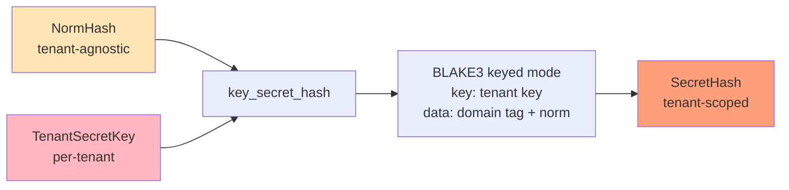
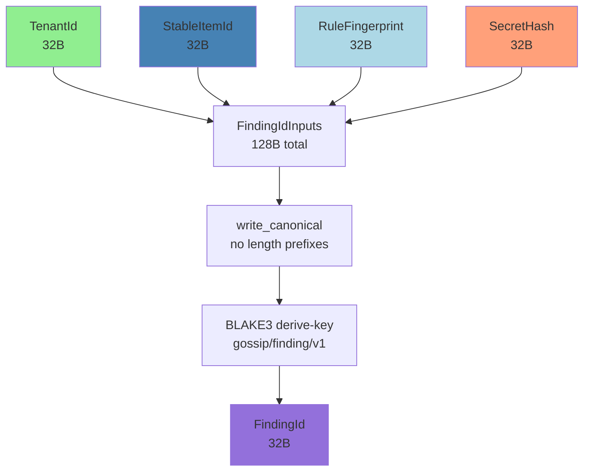
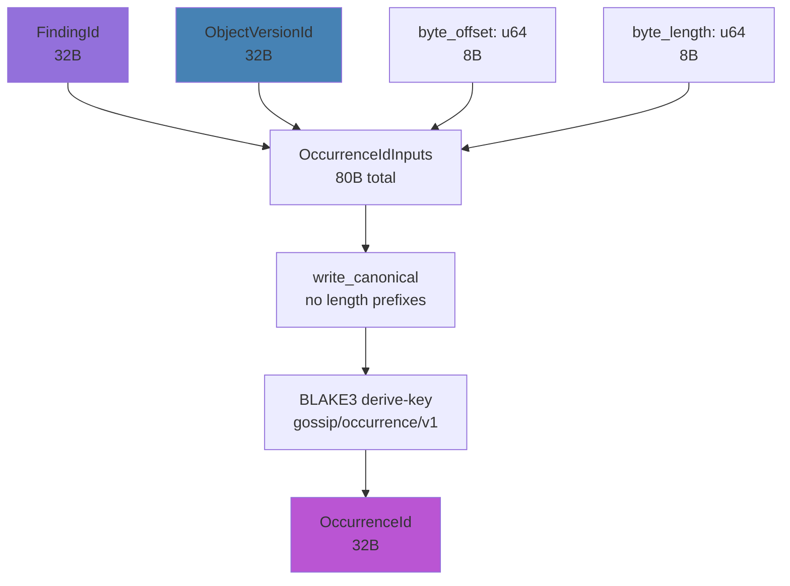
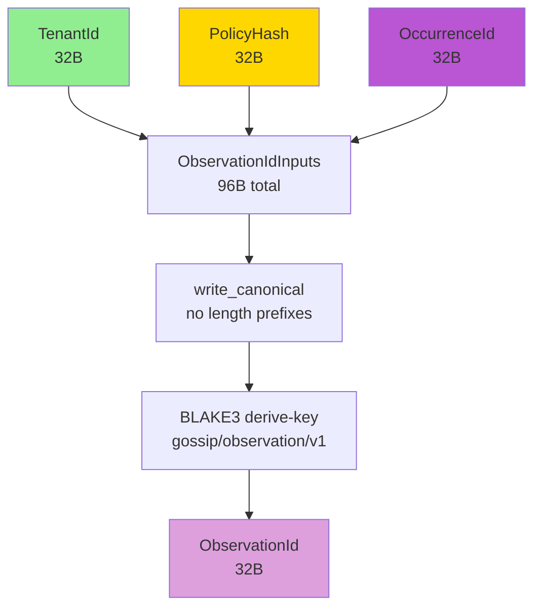
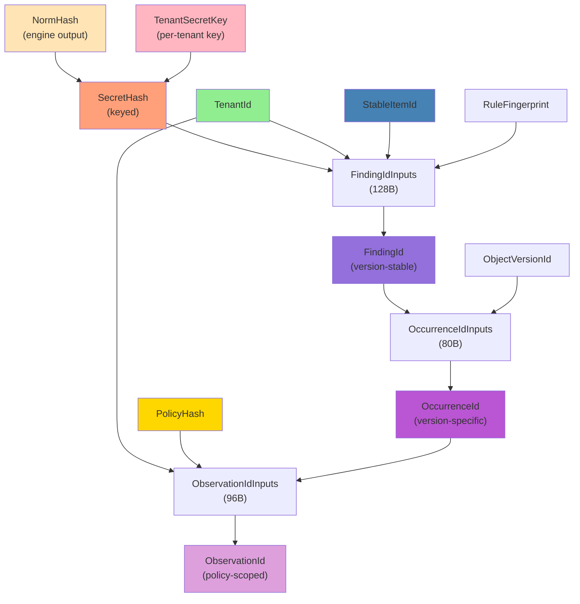

# Secret and Finding Identity

## Overview

The finding identity module (`finding.rs`) defines the core secret-detection identity types:

1. **NormHash** — Normalized secret digest from the detection engine
2. **SecretHash** — Tenant-scoped secret identity (keyed with `TenantSecretKey`)
3. **FindingId** — Version-stable finding identity
4. **OccurrenceId** — Version-specific occurrence location
5. **ObservationId** — Policy-scoped detection event identity

These types form the upper layers of the identity spine, connecting secrets to findings to occurrences to observations.

## NormHash: Normalized Secret Digest

**Purpose:** The detection engine's output. Captures *what* was found before tenant-scoped keying is applied.

**Source:** `finding.rs:67-104`

```rust
crate::define_id_32_restricted! {
    /// Digest of the normalized (whitespace-stripped, case-folded) secret value.
    NormHash,
    debug_display = "NormHash([redacted])"
}
```

### Construction

**`from_digest` is `pub`** despite the restricted macro hiding the default constructor:

**Source:** `finding.rs:88-103`

```rust
/// `from_digest` is intentionally `pub` despite `define_id_32_restricted!`
/// hiding the default constructor. The restricted macro's primary value is
/// the redacted `Debug` impl — it prevents accidental logging of
/// security-sensitive material.
impl NormHash {
    pub fn from_digest(bytes: [u8; 32]) -> Self {
        Self::from_bytes_internal(bytes)
    }
}
```

**Why public?** The detection engine is the sole legitimate producer of `NormHash` values. It must be able to construct them from raw digests. The engine crate lives outside `gossip-contracts`, so the constructor must be `pub`.

**Why restricted macro then?** The `define_id_32_restricted!` macro's primary value here is the **redacted `Debug` impl**, not the private constructor. It prevents accidental logging of security-sensitive material. `from_digest` is an intentional escape hatch that bypasses the `pub(crate)` `from_bytes_internal` restriction — documented and deliberate.

**Note:** This pattern — restricted macro for `Debug` safety, public escape hatch for legitimate cross-crate construction — is unique to `NormHash`. `SecretHash` has no public constructor because only the in-crate `key_secret_hash` function should produce it.

**Redacted Debug output:**

```rust
format!("{:?}", NormHash::from_digest([0xFF; 32]))
// Output: "NormHash([redacted])"  (NOT "NormHash(ff..)" — no hex bytes leaked)
```

### Tenant-Agnostic

`NormHash` is **tenant-agnostic**. Two tenants scanning the same secret produce the same `NormHash` value. Tenant isolation is applied at the next layer (via `key_secret_hash`).

**Example:**
```rust
let norm = NormHash::from_digest([0xAB; 32]);
// Tenant A and Tenant B both see this same NormHash for the same normalized secret
```

## SecretHash: Tenant-Scoped Secret Identity

**Purpose:** Tenant-scoped secret identity. Derived by keying a `NormHash` with a `TenantSecretKey`.

**Source:** `finding.rs:111-133`

```rust
crate::define_id_32_restricted! {
    /// Tenant-scoped secret identity, derived by keying a NormHash.
    SecretHash,
    debug_display = "SecretHash([redacted])"
}
```

### Derivation: `key_secret_hash`

**Source:** `finding.rs:352`

```rust
pub fn key_secret_hash(key: &TenantSecretKey, norm: &NormHash) -> SecretHash {
    let mut h = Hasher::new_keyed(key.as_bytes());
    // Domain tag is fed as *data* (not a derive-key context) because the
    // hasher is already in keyed mode.
    h.update(domain::SECRET_HASH_V1.as_bytes());
    h.update(norm.as_bytes());
    SecretHash::from_bytes_internal(finalize_32(&h))
}
```

**Key features:**
- **BLAKE3 keyed mode** (`Hasher::new_keyed`) — the only derivation using keyed mode
- Domain tag (`SECRET_HASH_V1 = "gossip/secret-hash/v1"`) is fed as **data**, not as a derive-key context
- The tenant key provides cryptographic isolation between tenants



### Cross-Tenant Isolation

**Property:** Same `NormHash` + different keys → different `SecretHash` values.

**Proof test** (`finding.rs:528-544`):
```rust
proptest! {
    #[test]
    fn secret_hash_collision_free(
        key1 in uniform32(any::<u8>()),
        norm1 in uniform32(any::<u8>()),
        key2 in uniform32(any::<u8>()),
        norm2 in uniform32(any::<u8>()),
    ) {
        prop_assume!(key1 != key2 || norm1 != norm2);
        let a = key_secret_hash(&TenantSecretKey::from_bytes(key1), &NormHash::from_digest(norm1));
        let b = key_secret_hash(&TenantSecretKey::from_bytes(key2), &NormHash::from_digest(norm2));
        prop_assert_ne!(a, b);
    }
}
```

**Security implications:**
- **Attacker with tenant A's SecretHash values cannot determine if tenant B found the same secret**
- Rainbow tables are useless without the tenant key
- Cross-tenant correlation requires breaking BLAKE3's keyed-mode security (computationally infeasible)

**Example:**
```rust
let norm = NormHash::from_digest([0xCC; 32]);  // Same secret
let key_a = TenantSecretKey::from_bytes([0xAA; 32]);
let key_b = TenantSecretKey::from_bytes([0xBB; 32]);

let secret_a = key_secret_hash(&key_a, &norm);
let secret_b = key_secret_hash(&key_b, &norm);

assert_ne!(secret_a, secret_b);  // Different SecretHash despite same NormHash
```

## RuleFingerprint: Detection Rule Identity

**Purpose:** Identity of a detection rule. The engine/policy layer computes rule fingerprints externally; the contracts crate treats them as opaque.

**Source:** `finding.rs:135-166`

```rust
crate::define_id_32! {
    /// Identity of a detection rule.
    RuleFingerprint
}
```

**Construction:** Public `from_bytes` constructor (not restricted, not derived).

**Invariant:** The same rule definition MUST always produce the same `RuleFingerprint`. If a rule's detection semantics change, its fingerprint MUST change.

## FindingId: Version-Stable Finding Identity

**Purpose:** Captures "rule R found secret S in item I for tenant T" — true regardless of version.

**Source:** `finding.rs:178-197`

```rust
crate::define_id_32! {
    /// Version-stable finding identity.
    FindingId
}
```

### Inputs

**Source:** `finding.rs:255-269`

```rust
pub struct FindingIdInputs {
    pub tenant: TenantId,          // Who owns the scan
    pub item: StableItemId,        // What was scanned (version-stable)
    pub rule: RuleFingerprint,     // What rule matched
    pub secret: SecretHash,        // What secret was found (tenant-keyed)
}
```

**Width:** 4 × 32 = **128 bytes** (all fixed-width fields)

**Field order:** Struct declaration order = `CanonicalBytes` order (verified by field-order swap tests)

### Derivation

**Source:** `finding.rs:386-388`

```rust
pub fn derive_finding_id(inputs: &FindingIdInputs) -> FindingId {
    FindingId::from_bytes(derive_from_cached(&FINDING_HASHER, inputs))
}
```

**Domain constant:** `FINDING_ID_V1 = "gossip/finding/v1"` (from `domain.rs:53`)

**Flow:**
1. Clone the cached `FINDING_HASHER` (pre-initialized with `FINDING_ID_V1` context)
2. Feed `FindingIdInputs` via `write_canonical` (128 bytes: 4 × 32-byte fields)
3. Finalize to 32 bytes
4. Wrap in `FindingId` newtype



### Why Version-Stable

**ObjectVersionId is NOT an input to FindingId.**

**Scenario:** A developer pushes commit A containing a test API key. The secret is detected, and the security team marks the finding as "accepted risk." The developer later refactors in commit B, moving the file to a different directory.

**With version-stable FindingId:**
- Commit A: `FindingId(tenant=X, item=Y, rule=Z, secret=S)` → triage state = "accepted"
- Commit B: Same `FindingId` (file moved, but `StableItemId` unchanged) → triage state = "accepted" (inherited)

**Without version-stable FindingId (hypothetical broken design):**
- Commit A: `FindingId(tenant=X, item=Y, rule=Z, secret=S, version=A)` → triage state = "accepted"
- Commit B: New `FindingId(..version=B)` → triage state = unknown → **re-alert**

### Property Tests

**Purity** (`finding.rs:530-546`):
```rust
proptest! {
    #[test]
    fn finding_id_is_pure(
        t in uniform32(any::<u8>()), i in uniform32(any::<u8>()),
        r in uniform32(any::<u8>()), s in uniform32(any::<u8>()),
    ) {
        let inputs = FindingIdInputs {
            tenant: TenantId::from_bytes(t),
            item: StableItemId::from_bytes(i),
            rule: RuleFingerprint::from_bytes(r),
            secret: SecretHash::from_bytes_internal(s),
        };
        let a = derive_finding_id(&inputs);
        let b = derive_finding_id(&inputs);
        prop_assert_eq!(a, b);
    }
}
```

**Collision-freedom** (`finding.rs:603-630`):
```rust
proptest! {
    #[test]
    fn finding_id_collision_free(
        t1 in uniform32(any::<u8>()), i1 in uniform32(any::<u8>()),
        r1 in uniform32(any::<u8>()), s1 in uniform32(any::<u8>()),
        t2 in uniform32(any::<u8>()), i2 in uniform32(any::<u8>()),
        r2 in uniform32(any::<u8>()), s2 in uniform32(any::<u8>()),
    ) {
        prop_assume!(t1 != t2 || i1 != i2 || r1 != r2 || s1 != s2);
        let a = derive_finding_id(&FindingIdInputs { ... });
        let b = derive_finding_id(&FindingIdInputs { ... });
        prop_assert_ne!(a, b);
    }
}
```

**Field sensitivity** (`finding.rs:698+`): Four tests (one per field) verify that changing any single field changes the `FindingId`.

**Field order** (`finding.rs:1008-1022`): Verifies swapping two fields produces a different hash.

## OccurrenceId: Version-Specific Occurrence Location

**Purpose:** Ties a `FindingId` to a specific version and byte range within the scanned content.

**Source:** `finding.rs:199-218`

```rust
crate::define_id_32! {
    /// Version-specific occurrence of a finding at a particular location.
    OccurrenceId
}
```

### Inputs

**Source:** `finding.rs:285-312`

```rust
pub struct OccurrenceIdInputs {
    pub finding: FindingId,        // Version-stable finding
    pub version: ObjectVersionId,  // Specific version
    pub byte_offset: u64,          // Where in the content
    pub byte_length: u64,          // How long
}
```

**Width:** 2 × 32 + 2 × 8 = **80 bytes** (mixed-width, all fixed)

### Derivation

**Source:** `finding.rs:409-411`

```rust
pub fn derive_occurrence_id(inputs: &OccurrenceIdInputs) -> OccurrenceId {
    OccurrenceId::from_bytes(derive_from_cached(&OCCURRENCE_HASHER, inputs))
}
```

**Domain constant:** `OCCURRENCE_ID_V1 = "gossip/occurrence/v1"` (from `domain.rs:58`)

**Flow:**
1. Clone the cached `OCCURRENCE_HASHER` (pre-initialized with `OCCURRENCE_ID_V1` context)
2. Feed `OccurrenceIdInputs` via `write_canonical` (80 bytes)
3. Finalize to 32 bytes
4. Wrap in `OccurrenceId` newtype



### Why Version-Specific

**ObjectVersionId IS an input to OccurrenceId.**

**Use case:** The same secret may appear at different byte offsets in different versions. Each occurrence gets a unique `OccurrenceId`, but they all share the same `FindingId` (version-stable triage state).

**Example:**
```rust
let finding = FindingId::from_bytes([0x11; 32]);
let version_a = ObjectVersionId::from_bytes([0xAA; 32]);
let version_b = ObjectVersionId::from_bytes([0xBB; 32]);

let occ_a = derive_occurrence_id(&OccurrenceIdInputs {
    finding,
    version: version_a,
    byte_offset: 100,
    byte_length: 42,
});

let occ_b = derive_occurrence_id(&OccurrenceIdInputs {
    finding,
    version: version_b,
    byte_offset: 200,  // Secret moved
    byte_length: 42,
});

assert_ne!(occ_a, occ_b);  // Different occurrences, same finding
```

### Property Tests

**Purity** (`finding.rs:548-565`):
```rust
proptest! {
    #[test]
    fn occurrence_id_is_pure(
        f in uniform32(any::<u8>()), v in uniform32(any::<u8>()),
        offset in any::<u64>(), length in any::<u64>(),
    ) {
        let inputs = OccurrenceIdInputs {
            finding: FindingId::from_bytes(f),
            version: ObjectVersionId::from_bytes(v),
            byte_offset: offset,
            byte_length: length,
        };
        let a = derive_occurrence_id(&inputs);
        let b = derive_occurrence_id(&inputs);
        prop_assert_eq!(a, b);
    }
}
```

**Collision-freedom** (`finding.rs:630-657`): Verifies distinct inputs produce distinct `OccurrenceId` values.

**Field sensitivity** (`finding.rs:830+`): Four tests verify that changing any single field changes the `OccurrenceId`.

**Boundary values** (`golden.rs:400-435`): Tests `u64::MIN`, `u64::MAX`, and mixed boundary cases.

## ObservationId: Policy-Scoped Detection Event Identity

**Purpose:** Distinguishes "policy A detected occurrence O" from "policy B detected the same occurrence O" without changing the underlying `FindingId` or `OccurrenceId` derivations.

**Source:** `finding.rs:220-240`

```rust
crate::define_id_32! {
    /// Policy-scoped detection event identity.
    ObservationId
}
```

### Inputs

**Source:** `finding.rs:314-348`

```rust
pub struct ObservationIdInputs {
    pub tenant: TenantId,        // Tenant that owns the scan
    pub policy: PolicyHash,      // Hash of the active policy
    pub occurrence: OccurrenceId, // Policy-independent occurrence identity
}
```

**Width:** 3 × 32 = **96 bytes** (all fixed-width fields)

**Field order:** Struct declaration order = `CanonicalBytes` order (verified by field-order swap tests)

### Derivation

**Source:** `finding.rs:431-433`

```rust
pub fn derive_observation_id(inputs: &ObservationIdInputs) -> ObservationId {
    ObservationId::from_bytes(derive_from_cached(&OBSERVATION_HASHER, inputs))
}
```

**Domain constant:** `OBSERVATION_ID_V1 = "gossip/observation/v1"` (from `domain.rs:63`)

**Flow:**
1. Clone the cached `OBSERVATION_HASHER` (pre-initialized with `OBSERVATION_ID_V1` context)
2. Feed `ObservationIdInputs` via `write_canonical` (96 bytes: 3 × 32-byte fields)
3. Finalize to 32 bytes
4. Wrap in `ObservationId` newtype



### Why Policy-Scoped

**Use case:** Multiple policies may evaluate the same occurrence. Each policy's detection is tracked independently. Changing a policy should produce new `ObservationId` values without affecting the underlying `FindingId` or `OccurrenceId`.

**Example:**
```rust
let occurrence = OccurrenceId::from_bytes([0x11; 32]);
let tenant = TenantId::from_bytes([0x22; 32]);
let policy_a = PolicyHash::from_bytes([0xAA; 32]);
let policy_b = PolicyHash::from_bytes([0xBB; 32]);

let obs_a = derive_observation_id(&ObservationIdInputs {
    tenant,
    policy: policy_a,
    occurrence,
});

let obs_b = derive_observation_id(&ObservationIdInputs {
    tenant,
    policy: policy_b,
    occurrence,
});

assert_ne!(obs_a, obs_b);  // Different observations, same occurrence
```

### Property Tests

**Purity** (`finding.rs:566-583`): Verifies identical inputs produce identical `ObservationId` values.

**Collision-freedom** (`finding.rs:657-682`): Verifies distinct inputs produce distinct `ObservationId` values.

**Field sensitivity** (`finding.rs:937+`): Three tests verify that changing any single field (tenant, policy, occurrence) changes the `ObservationId`.

**Field order** (`finding.rs:1045+`): Verifies swapping two fields produces a different hash.

## Derivation Chain Summary



## Summary Table

| Type | Purpose | Tenant-Scoped? | Version-Stable? | Restricted? |
|------|---------|----------------|-----------------|-------------|
| `NormHash` | Normalized secret digest | No | N/A | Yes |
| `SecretHash` | Tenant-scoped secret ID | Yes | N/A | Yes |
| `RuleFingerprint` | Rule identity | No | N/A | No |
| `FindingId` | Finding identity | Yes | Yes | No |
| `OccurrenceId` | Occurrence location | Yes | No | No |
| `ObservationId` | Policy-scoped detection event | Yes | No | No |

**Key takeaway:** `FindingId` is version-stable (enables stable triage), `OccurrenceId` is version-specific (tracks exact locations across versions), `ObservationId` is policy-scoped (distinguishes detections by different policies).

**Next chapter:** Policy Hash (`policy.rs`) — `PolicyHashInputs`, `compute_policy_hash`, and rescan cascade.
