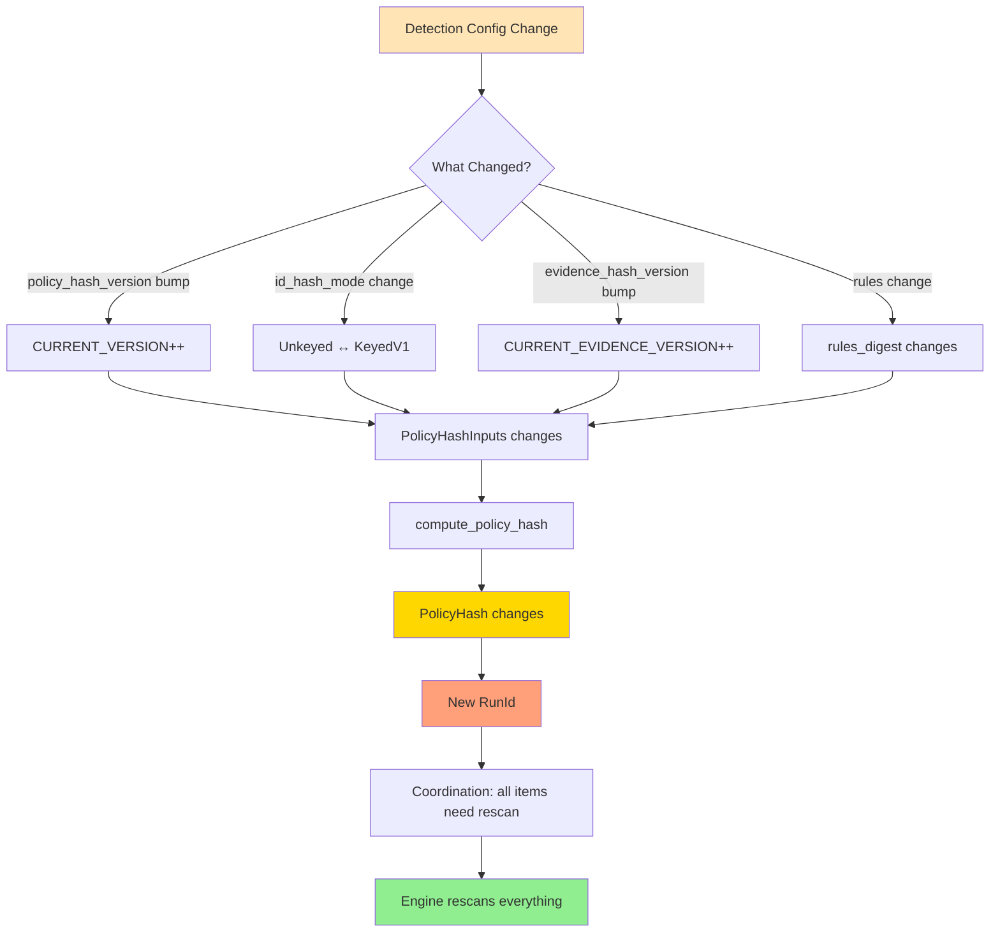

# Policy Hash

## Purpose

`PolicyHash` answers the question: **"Do I need to rescan this item?"**

If any detection-affecting input changes, `PolicyHash` changes → new `RunId` → forced rescan. This ensures that findings remain valid: if the detection semantics change, all items must be re-evaluated.

**Source:** `crates/gossip-contracts/src/identity/policy.rs`

## PolicyHashInputs: 41 Bytes

**Source:** `policy.rs:106-116`

```rust
pub struct PolicyHashInputs {
    pub policy_hash_version: u32,        // Scheme version (4 bytes)
    pub id_hash_mode: IdHashMode,        // Keyed vs unkeyed (1 byte)
    pub evidence_hash_version: u32,      // Normalization version (4 bytes)
    pub rules_digest: [u8; 32],          // Rule set digest (32 bytes)
}
```

**Total width:** 4 + 1 + 4 + 32 = **41 bytes** (all fixed-width)

**CanonicalBytes encoding** (`policy.rs:118-128`):
```rust
impl CanonicalBytes for PolicyHashInputs {
    fn write_canonical(&self, h: &mut Hasher) {
        self.policy_hash_version.write_canonical(h);   // Bytes 0..4
        self.id_hash_mode.write_canonical(h);          // Bytes 4..5
        self.evidence_hash_version.write_canonical(h); // Bytes 5..9
        self.rules_digest.write_canonical(h);          // Bytes 9..41
    }
}
```

No length prefixes (all fields are fixed-width). Field order must match struct declaration order.

## IdHashMode Enum

**Purpose:** Selects the identity-hashing mode for secret derivation.

**Source:** `policy.rs:38-66`

```rust
#[derive(Clone, Copy, Debug, PartialEq, Eq, Hash)]
#[repr(u8)]
pub enum IdHashMode {
    /// No tenant-scoped keying. All tenants share one hash domain.
    Unkeyed = 0,
    /// Per-tenant keyed hashing (BLAKE3 keyed mode with TenantSecretKey).
    KeyedV1 = 1,
}
```

**Key features:**
- `#[repr(u8)]` — Stable wire encoding (discriminant = byte value)
- Explicit discriminants prevent accidental value changes
- `from_u8` / `as_u8` methods for serialization

**CanonicalBytes** (`policy.rs:68-75`):
```rust
impl CanonicalBytes for IdHashMode {
    fn write_canonical(&self, h: &mut Hasher) {
        self.as_u8().write_canonical(h);  // Single byte
    }
}
```

**Why this matters:** If the detection system switches from unkeyed to keyed hashing (or vice versa), the `PolicyHash` changes, forcing a rescan. Old findings are no longer valid because the identity semantics changed.

## Version Constants

**Source:** `policy.rs:77-92`

```rust
/// Current schema version for PolicyHashInputs.
/// Bump this to force a rescan when the derivation scheme changes.
pub const CURRENT_VERSION: u32 = 1;

/// Current evidence-hash version.
/// Bump this when normalization or input pipeline changes.
pub const CURRENT_EVIDENCE_VERSION: u32 = 1;
```

**Usage:**
```rust
let inputs = PolicyHashInputs {
    policy_hash_version: CURRENT_VERSION,
    id_hash_mode: IdHashMode::KeyedV1,
    evidence_hash_version: CURRENT_EVIDENCE_VERSION,
    rules_digest: compute_rules_digest(&rules),
};
```

**When to bump:**

| Constant | Bump When | Effect |
|----------|-----------|--------|
| `CURRENT_VERSION` | Derivation scheme changes (e.g., field added to `PolicyHashInputs`) | Forces rescan |
| `CURRENT_EVIDENCE_VERSION` | Normalization changes (e.g., whitespace handling updated) | Forces rescan |

## compute_policy_hash

**Source:** `policy.rs:160-162`

```rust
pub fn compute_policy_hash(inputs: &PolicyHashInputs) -> PolicyHash {
    PolicyHash::from_bytes(derive_from_cached(&POLICY_HASH_HASHER, inputs))
}
```

**Domain constant:** `POLICY_HASH_V2 = "gossip/policy-hash/v2"` (from `domain.rs:92`)

**Why v2?** The derivation scheme was redesigned after the initial spec (v1 was never shipped).

**Flow:**
1. Clone the cached `POLICY_HASH_HASHER` (pre-initialized with `POLICY_HASH_V2` context)
2. Feed `PolicyHashInputs` via `write_canonical` (41 bytes)
3. Finalize to 32 bytes
4. Wrap in `PolicyHash` newtype

```mermaid
graph TD
    A[policy_hash_version: u32] --> B[PolicyHashInputs<br/>41 bytes]
    C[id_hash_mode: IdHashMode] --> B
    D[evidence_hash_version: u32] --> B
    E[rules_digest: [u8; 32]] --> B
    B --> F[write_canonical<br/>no length prefixes]
    F --> G[BLAKE3 derive-key<br/>gossip/policy-hash/v2]
    G --> H[PolicyHash<br/>32 bytes]

    style H fill:#FFD700
```

## Rescan Cascade

**PolicyHash changes → new RunId → coordination marks all items for rescan**



**Example scenario:**

1. **Initial state:** Detection running with `policy_hash_version=1`, `KeyedV1`, `evidence_hash_version=1`, `rules_digest=[0xAA; 32]`
   ```rust
   let old_hash = compute_policy_hash(&PolicyHashInputs {
       policy_hash_version: 1,
       id_hash_mode: IdHashMode::KeyedV1,
       evidence_hash_version: 1,
       rules_digest: [0xAA; 32],
   });
   // old_hash = PolicyHash([0x29, 0xF1, ...])
   ```

2. **Rule added:** Coordination adds a new rule. `rules_digest` changes to `[0xBB; 32]`.
   ```rust
   let new_hash = compute_policy_hash(&PolicyHashInputs {
       policy_hash_version: 1,
       id_hash_mode: IdHashMode::KeyedV1,
       evidence_hash_version: 1,
       rules_digest: [0xBB; 32],  // ← Changed
   });
   // new_hash = PolicyHash([0x7A, 0x2C, ...])
   assert_ne!(old_hash, new_hash);
   ```

3. **Rescan triggered:** Coordination creates a new `RunId` with `policy_hash=new_hash`. All items are marked as needing rescan (their `last_scanned_run_id` does not match the current `RunId`).

4. **Engine rescans:** Even if the file content is unchanged, the engine re-evaluates it against the new rule set.

## Field Sensitivity

**Property:** Changing any single field changes the `PolicyHash`.

**Tests** (`policy.rs:219-305`):

```rust
// Field sensitivity: policy_hash_version
proptest! {
    #[test]
    fn policy_hash_version_field_sensitivity(
        version_a in any::<u32>(),
        version_b in any::<u32>(),
        digest in uniform32(any::<u8>()),
    ) {
        prop_assume!(version_a != version_b);
        let base = PolicyHashInputs {
            policy_hash_version: version_a,
            id_hash_mode: IdHashMode::KeyedV1,
            evidence_hash_version: 1,
            rules_digest: digest,
        };
        let varied = PolicyHashInputs {
            policy_hash_version: version_b,  // ← Changed
            ..base
        };
        prop_assert_ne!(compute_policy_hash(&base), compute_policy_hash(&varied));
    }
}
```

Four field-sensitivity tests (one per field) verify that the hash is sensitive to every input.

## Collision-Freedom

**Property:** Distinct inputs produce distinct hashes (with cryptographic collision resistance from BLAKE3).

**Test** (`policy.rs:310-336`):
```rust
proptest! {
    #[test]
    fn policy_hash_collision_free(
        ver_a in any::<u32>(), mode_a in 0u8..=1u8, ev_a in any::<u32>(),
        dig_a in uniform32(any::<u8>()),
        ver_b in any::<u32>(), mode_b in 0u8..=1u8, ev_b in any::<u32>(),
        dig_b in uniform32(any::<u8>()),
    ) {
        prop_assume!(ver_a != ver_b || mode_a != mode_b || ev_a != ev_b || dig_a != dig_b);
        let a = compute_policy_hash(&PolicyHashInputs {
            policy_hash_version: ver_a,
            id_hash_mode: IdHashMode::from_u8(mode_a).unwrap(),
            evidence_hash_version: ev_a,
            rules_digest: dig_a,
        });
        let b = compute_policy_hash(&PolicyHashInputs {
            policy_hash_version: ver_b,
            id_hash_mode: IdHashMode::from_u8(mode_b).unwrap(),
            evidence_hash_version: ev_b,
            rules_digest: dig_b,
        });
        prop_assert_ne!(a, b);
    }
}
```

## Field-Order Invariant

**Test** (`policy.rs:340-358`):
```rust
#[test]
fn policy_hash_inputs_field_order_matters() {
    let inputs_a = PolicyHashInputs {
        policy_hash_version: 1,
        id_hash_mode: IdHashMode::KeyedV1,
        evidence_hash_version: 2,
        rules_digest: [0xAA; 32],
    };
    let inputs_b = PolicyHashInputs {
        policy_hash_version: 2,         // Swapped with evidence_hash_version
        id_hash_mode: IdHashMode::KeyedV1,
        evidence_hash_version: 1,       // Swapped with policy_hash_version
        rules_digest: [0xAA; 32],
    };
    assert_ne!(compute_policy_hash(&inputs_a), compute_policy_hash(&inputs_b));
}
```

This catches bugs where the `write_canonical` impl feeds fields in the wrong order.

## finalize_64: 64-Bit Truncated Digest

**Source:** `hashing.rs:154-161`

While `finalize_32` is used for all content-addressed identity types (256-bit collision resistance), `finalize_64` provides a truncated 64-bit digest for coordination use cases:

```rust
pub fn finalize_64(hasher: &Hasher) -> u64 {
    let bytes = hasher.finalize();
    let first8: [u8; 8] = bytes.as_bytes()[..8]
        .try_into()
        .expect("BLAKE3 output is always >= 8 bytes");
    u64::from_le_bytes(first8)
}
```

**How it works:** Takes the first 8 bytes of the BLAKE3 output and interprets them as a **little-endian** `u64`. The LE convention matches the `CanonicalBytes` encoding used throughout the identity module.

**Cardinality bounds:** A 64-bit truncated hash has a birthday collision bound of approximately 2^32 (~4.3 billion) values before a 50% collision probability. This is acceptable for coordination use cases where cardinality is bounded by system design (shard counts per run, op-log entries per epoch). For globally-unique content-addressed identifiers with unbounded cardinality, use `finalize_32` instead.

**Used by:**
- Split shard ID derivation (via `SPLIT_ID_HASHER`) — generating derived `ShardId` values when splitting shards
- Op-log payload hashing (via `OP_PAYLOAD_HASHER`) — computing content digests for idempotency checks
- Repository ID derivation (via `REPO_ID_HASHER`) — producing stable 64-bit repo identities for Git connector scans

## Public Cached Hashers

**Source:** `hashing.rs:89-107`

Most cached hashers in `hashing.rs` are `pub(crate)` (used only within `gossip-contracts`). Five are **`pub`** because they are consumed by subsystems outside the contracts crate — coordination, the scanner engine, and the Git connector:

```rust
/// Cached derive-key hasher for rule-fingerprint derivation.
pub static RULE_FINGERPRINT_HASHER: LazyLock<Hasher> =
    LazyLock::new(|| Hasher::new_derive_key(domain::RULE_FINGERPRINT_V1));

/// Cached derive-key hasher for split shard-ID derivation.
pub static SPLIT_ID_HASHER: LazyLock<Hasher> =
    LazyLock::new(|| Hasher::new_derive_key(domain::SPLIT_ID_V1));

/// Cached derive-key hasher for op-log payload hashing.
pub static OP_PAYLOAD_HASHER: LazyLock<Hasher> =
    LazyLock::new(|| Hasher::new_derive_key(domain::OP_PAYLOAD_V1));

/// Cached derive-key hasher for tenant-scoped Git repository-ID derivation.
pub static REPO_ID_HASHER: LazyLock<Hasher> =
    LazyLock::new(|| Hasher::new_derive_key(domain::GIT_REPO_ID_V1));

/// Cached derive-key hasher for deterministic Git mirror-cache path derivation.
pub static MIRROR_PATH_HASHER: LazyLock<Hasher> =
    LazyLock::new(|| Hasher::new_derive_key(domain::GIT_MIRROR_PATH_V1));
```

**Usage pattern:** Callers clone a pre-initialized hasher, feed structured input via `CanonicalBytes`, then finalize to the required width (`finalize_64` for a `u64`, `finalize_32` for a full 256-bit digest):

```rust
// Conceptual usage in gossip-coordination:
let mut h = SPLIT_ID_HASHER.clone();
parent_shard_id.write_canonical(&mut h);
split_index.write_canonical(&mut h);
let derived_id = ShardId::from_raw(finalize_64(&h) | (1u64 << 63));  // Set bit 63
```

The `| (1u64 << 63)` forces bit 63 high, marking the result as a derived shard (see `ShardId::is_derived()`).

| Hasher | Domain Constant | Finalization | Used For |
|--------|----------------|--------------|----------|
| `RULE_FINGERPRINT_HASHER` | `RULE_FINGERPRINT_V1` | `finalize_32` | Rule identity derivation for the scanner engine |
| `SPLIT_ID_HASHER` | `SPLIT_ID_V1` | `finalize_64` | Deriving child shard IDs during shard splits |
| `OP_PAYLOAD_HASHER` | `OP_PAYLOAD_V1` | `finalize_64` | Op-log payload content hashing for idempotency |
| `REPO_ID_HASHER` | `GIT_REPO_ID_V1` | `finalize_64` | Stable repository identity for Git connector scans |
| `MIRROR_PATH_HASHER` | `GIT_MIRROR_PATH_V1` | `finalize_32` | Mirror-cache path derivation for local Git clones |

## PolicyHash Interaction with Other Systems

### Coordination Layer

> **Note**: The structs and function below are **conceptual illustrations** showing how `PolicyHash` would be used in the coordination layer. The actual `RunId` type in the contracts crate is a `u64` newtype generated by `define_id_64!`.

**RunId creation (conceptual):**
```rust
// Conceptual — the actual RunId is a u64 newtype, not a struct
struct RunId {
    tenant: TenantId,
    policy_hash: PolicyHash,  // ← Part of the RunId
    timestamp: Timestamp,
}
```

**Rescan logic (conceptual):**
```rust
// Conceptual — illustrates how PolicyHash drives rescan decisions
fn should_rescan(item: &Item, current_run: &RunId) -> bool {
    item.last_scanned_run_id.policy_hash != current_run.policy_hash
}
```

### Persistence Layer

> **Note**: `DoneLedgerKey` is a **conceptual type** from the persistence layer design, not an implemented type in the contracts crate.

**Done-ledger key (conceptual):**
```rust
// Conceptual — illustrates how PolicyHash scopes done-ledger lookups
struct DoneLedgerKey {
    tenant: TenantId,
    policy_hash: PolicyHash,  // ← Scoped by PolicyHash
    item: StableItemId,
}
```

Old findings (keyed by old `PolicyHash`) become orphans when the policy changes. They remain in the done-ledger but are never queried (coordination only queries with the current `PolicyHash`).

## Summary

| Input Field | Width | Purpose | Bump When |
|-------------|-------|---------|-----------|
| `policy_hash_version` | 4 B | Derivation scheme version | Changing `PolicyHashInputs` struct |
| `id_hash_mode` | 1 B | Keyed vs unkeyed hashing | Switching tenant isolation mode |
| `evidence_hash_version` | 4 B | Normalization version | Changing secret normalization |
| `rules_digest` | 32 B | Content-addressed rule set | Adding/removing/modifying rules |

**Key takeaway:** Any change to detection inputs that affects output identity must change `PolicyHash`. This ensures coordination always knows when a rescan is required.

**Next chapter:** The Macro System (`macros.rs`) — `define_id_32!` and `define_id_32_restricted!`.
