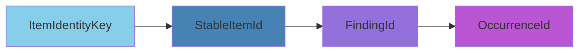
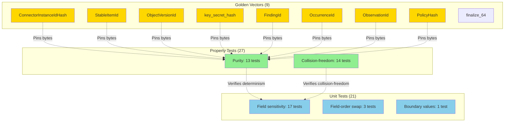

# Golden Vectors and Testing

## Overview

The identity module has **57 tested invariants** organized by test type and source file. Golden vectors pin the exact byte output of every derivation function, forming a cross-cutting compatibility contract. (Coordination golden vectors have moved to the `gossip-coordination` crate.)

**Source:** `crates/gossip-contracts/src/identity/golden.rs`

## The 57-Invariant Test Matrix

### By Test Type

| Test Type | Count | Purpose |
|-----------|-------|---------|
| **Golden vectors** | 9 (identity only) | Pin exact byte outputs |
| **Property-based (purity)** | 13 | Same inputs → same output |
| **Property-based (collision-freedom)** | 14 | Distinct inputs → distinct outputs |
| **Field sensitivity** | 17 | Each field independently affects output |
| **Field-order swap** | 3 | Detect wrong field order in `write_canonical` |
| **Boundary values** | 1 | `u64::MIN`, `u64::MAX`, mixed boundaries |

**Total:** 57 invariants

### By Source File

> **Note:** This table covers identity derivation tests only and excludes `coordination.rs` and `macros.rs` module tests.

| File | Golden | Proptest | Unit | Total |
|------|--------|----------|------|-------|
| `types.rs` | 0 | 4 | 9 | 13 |
| `canonical.rs` | 0 | 10 | 6 | 16 |
| `item.rs` | 0 | 12 | 11 | 23 |
| `finding.rs` | 0 | 24 | 7 | 31 |
| `policy.rs` | 0 | 6 | 4 | 10 |
| `golden.rs` | 9 | 2 | 2 | 13 |

**Total:** 106 tests covering 57 distinct invariants (some invariants tested multiple ways)

## Golden Vectors: The 9 Pinned Identity Derivations

### Registry

**Source:** `golden.rs:65-75`

```rust
const ALL: [&str; 9] = [
    "ConnectorInstanceIdHash",
    "StableItemId",
    "ObjectVersionId",
    "key_secret_hash",
    "FindingId",
    "OccurrenceId",
    "ObservationId",
    "PolicyHash",
    "finalize_64",
];
```

Compile-time array length enforces exhaustiveness: adding a new derivation without updating this array is a compile error. All 9 entries are identity derivation golden vectors covering the 32-byte content-addressed outputs and the `finalize_64` 64-bit truncation.

The coordination golden vectors (`derive_split_child_0`, `derive_split_child_1`, `derive_split_residual`, `hash_checkpoint`, `hash_complete`, `hash_park`, `hash_split_replace`, `hash_split_residual`) now live in `gossip-coordination::split_execution::tests`, co-located with the coordination logic they pin.

### 1. ConnectorInstanceIdHash

**Input:** `ConnectorInstanceIdHash::from_instance_id_bytes(b"github-installation-1")`

**Expected output** (`golden.rs:83-88`):
```rust
const CONNECTOR_INSTANCE_ID_HASH_EXPECTED: [u8; 32] = [
    0xAC, 0x8D, 0x5E, 0xF3, 0xD4, 0x00, 0xED, 0x9C,
    0x79, 0x43, 0xA1, 0x06, 0xE7, 0x49, 0x14, 0xFF,
    0xE1, 0x4C, 0x23, 0xDC, 0xE3, 0x7E, 0x62, 0xEE,
    0x83, 0xBB, 0x6E, 0xAA, 0x0A, 0x1D, 0x11, 0xAB,
];
```

**Test** (`golden.rs:166-177`):
```rust
#[test]
fn connector_instance_id_hash_golden_value() {
    let id = ConnectorInstanceIdHash::from_instance_id_bytes(b"github-installation-1");
    assert_eq!(
        id.as_bytes(),
        &CONNECTOR_INSTANCE_ID_HASH_EXPECTED,
        "ConnectorInstanceIdHash golden vector changed (domain::CONNECTOR_INSTANCE_ID_V1). \
         See identity::golden module docs for regeneration protocol.\n\
         Actual: {:02X?}",
        id.as_bytes(),
    );
}
```

### 2. StableItemId

**Input:** `ItemIdentityKey::new(ConnectorTag::from_ascii(b"github"), ConnectorInstanceIdHash::from_instance_id_bytes(b"github-installation-1"), b"org/repo\0src/main.rs")`

**Expected output** (`golden.rs:92-97`):
```rust
const STABLE_ITEM_ID_EXPECTED: [u8; 32] = [
    0x1C, 0x69, 0xB5, 0x50, 0x54, 0x7C, 0x36, 0xC4,
    0x98, 0x84, 0x47, 0x40, 0xEA, 0x1F, 0x1C, 0x03,
    0xD9, 0x75, 0x0B, 0x34, 0x07, 0x4C, 0xD6, 0x82,
    0x6A, 0x3E, 0x19, 0xCF, 0xC0, 0xA5, 0x7D, 0x61,
];
```

**Test** (`golden.rs:179-195`):
```rust
#[test]
fn stable_item_id_golden_value() {
    let key = ItemIdentityKey::new(
        ConnectorTag::from_ascii(b"github"),
        ConnectorInstanceIdHash::from_instance_id_bytes(b"github-installation-1"),
        b"org/repo\0src/main.rs",
    );
    let id = key.stable_id();
    assert_eq!(
        id.as_bytes(),
        &STABLE_ITEM_ID_EXPECTED,
        "StableItemId golden vector changed (domain::ITEM_ID_V1). \
         See identity::golden module docs for regeneration protocol.\n\
         Actual: {:02X?}",
        id.as_bytes(),
    );
}
```

### 3. ObjectVersionId

**Input:** `ObjectVersionId::from_version_bytes(b"abc123def456")`

**Expected output** (`golden.rs:101-106`):
```rust
const OBJECT_VERSION_ID_EXPECTED: [u8; 32] = [
    0xCF, 0xAE, 0x65, 0x13, 0x76, 0x5D, 0x94, 0x3A,
    0x56, 0x43, 0xF4, 0x54, 0x29, 0x5C, 0x81, 0xFF,
    0x83, 0xFF, 0xCA, 0x49, 0x38, 0x7F, 0x1B, 0x15,
    0x3D, 0x69, 0xD6, 0x62, 0x50, 0xF6, 0xDE, 0x2E,
];
```

### 4. key_secret_hash

**Input:** `key_secret_hash(&TenantSecretKey::from_bytes([0xBB; 32]), &NormHash::from_digest([0xCC; 32]))`

**Expected output** (`golden.rs:110-115`):
```rust
const KEY_SECRET_HASH_EXPECTED: [u8; 32] = [
    0x6B, 0xA4, 0xC7, 0x98, 0x33, 0xB0, 0x5F, 0x0E,
    0x0D, 0x20, 0x5D, 0xB8, 0x9B, 0xAB, 0xC5, 0xFB,
    0x6B, 0x7D, 0xE2, 0x27, 0xF9, 0x62, 0x68, 0x54,
    0x2D, 0x67, 0xE2, 0xF2, 0x64, 0x96, 0x3C, 0xBE,
];
```

### 5. FindingId

**Input:** `derive_finding_id(&FindingIdInputs { tenant: [0x11; 32], item: [0x22; 32], rule: [0x33; 32], secret: [0x44; 32] })`

**Expected output** (`golden.rs:120-125`):
```rust
const FINDING_ID_EXPECTED: [u8; 32] = [
    0x81, 0xCE, 0x28, 0x85, 0xDF, 0x85, 0xE9, 0x63,
    0x0D, 0x46, 0xA0, 0x29, 0x59, 0xE9, 0x3A, 0xCF,
    0x8A, 0xCE, 0x8E, 0x79, 0x01, 0x6E, 0xE9, 0xD8,
    0x73, 0xC1, 0x09, 0xBB, 0x20, 0x76, 0x1F, 0xD8,
];
```

### 6. OccurrenceId

**Input:** `derive_occurrence_id(&OccurrenceIdInputs { finding: [0x55; 32], version: [0x66; 32], byte_offset: 1024, byte_length: 42 })`

**Expected output** (`golden.rs:130-135`):
```rust
const OCCURRENCE_ID_EXPECTED: [u8; 32] = [
    0xCC, 0xEB, 0xCD, 0xED, 0xE9, 0x65, 0xAB, 0xCD,
    0x38, 0x8E, 0x68, 0xE2, 0xD6, 0x7D, 0x29, 0x8C,
    0x78, 0x2D, 0x53, 0x02, 0xF7, 0x1A, 0xDF, 0x52,
    0x24, 0x46, 0xCD, 0xE9, 0x96, 0x23, 0xDC, 0x85,
];
```

### 7. ObservationId

**Input:** `derive_observation_id(&ObservationIdInputs { tenant: [0x77; 32], policy: [0x88; 32], occurrence: [0x99; 32] })`

**Expected output** (`golden.rs:139-144`):
```rust
const OBSERVATION_ID_EXPECTED: [u8; 32] = [
    0x85, 0x45, 0x4A, 0x29, 0x8E, 0xCD, 0x3A, 0x94,
    0x9C, 0xB1, 0xB9, 0xFF, 0x04, 0x08, 0x07, 0xDA,
    0xCE, 0xF8, 0xFB, 0xCE, 0x52, 0xEC, 0x5A, 0xEB,
    0xFC, 0xF6, 0x14, 0x0A, 0x3C, 0x52, 0x28, 0x20,
];
```

**Test** (`golden.rs:263-279`):
```rust
#[test]
fn derive_observation_id_golden_value() {
    let inputs = ObservationIdInputs {
        tenant: TenantId::from_bytes([0x77; 32]),
        policy: PolicyHash::from_bytes([0x88; 32]),
        occurrence: OccurrenceId::from_bytes([0x99; 32]),
    };
    let id = derive_observation_id(&inputs);
    assert_eq!(
        id.as_bytes(),
        &OBSERVATION_ID_EXPECTED,
        "ObservationId golden vector changed (domain::OBSERVATION_ID_V1). \
         See identity::golden module docs for regeneration protocol.\n\
         Actual: {:02X?}",
        id.as_bytes(),
    );
}
```

### 8. PolicyHash

**Input:** `compute_policy_hash(&PolicyHashInputs { policy_hash_version: 1, id_hash_mode: KeyedV1, evidence_hash_version: 1, rules_digest: [0xAA; 32] })`

**Expected output** (`golden.rs:148-153`):
```rust
const POLICY_HASH_EXPECTED: [u8; 32] = [
    0x29, 0xF1, 0xE1, 0xF8, 0xF5, 0x92, 0xA9, 0xEC,
    0xCA, 0xEB, 0x83, 0xF7, 0x98, 0x7F, 0x63, 0x6A,
    0x39, 0xD5, 0x92, 0xEB, 0x71, 0x16, 0x4E, 0x73,
    0x38, 0x1E, 0x83, 0x77, 0x4C, 0xF1, 0xF8, 0x5C,
];
```

## Regeneration Protocol

**If a golden vector test fails:**

### Step 1: Confirm Intent

Determine whether the change was intentional (domain constant bump, encoding change) or an accidental regression.

### Step 2: If Regression → Revert

Golden vectors must not change without a version bump. Revert the offending change.

### Step 3: If Intentional → Bump Version

Bump the version suffix of the affected domain constant in `domain.rs`:
- `FINDING_ID_V1` → `FINDING_ID_V2`
- Update all references (grep across all crates)

### Step 4: Regenerate Vectors

1. Run the affected test with the assertion temporarily removed
2. Capture the new output (printed in the failure message)
3. Update the `const ..._EXPECTED` array

**Example:**
```rust
// Before (v1):
const FINDING_ID_EXPECTED: [u8; 32] = [0x81, 0xCE, ...];

// After breaking change → regenerate:
const FINDING_ID_EXPECTED: [u8; 32] = [0x9A, 0x3F, ...];  // New bytes
```

### Step 5: Update Downstream

1. Grep for the old domain constant name across all crates
2. Update references to the new version
3. Add a migration note if persisted IDs exist

**Example migration note:**
```
# BREAKING: FindingId derivation changed (FINDING_ID_V2)

All existing FindingId values are now invalid. Tenants must:
1. Clear the done-ledger
2. Re-scan all items
3. Re-triage all findings

Coordination will automatically trigger a rescan on the next policy sync.
```

### Step 6: Update ALL Registry

Update the `ALL` array length if adding a new derivation:

```rust
// Before (9 derivations):
const ALL: [&str; 9] = [
    "ConnectorInstanceIdHash",
    "StableItemId",
    "ObjectVersionId",
    "key_secret_hash",
    "FindingId",
    "OccurrenceId",
    "ObservationId",
    "PolicyHash",
    "finalize_64",
];

// After adding a new derivation (10 derivations):
const ALL: [&str; 10] = [
    // ... all 9 existing entries ...
    "NewDerivation",  // <- Added
];
```

## Version-Bump Expectations

| Vector | Domain Constant | Trigger Conditions |
|--------|----------------|--------------------|
| `CONNECTOR_INSTANCE_ID_HASH_EXPECTED` | `domain::CONNECTOR_INSTANCE_ID_V1` | `ConnectorInstanceIdHash` encoding or domain tag changes |
| `STABLE_ITEM_ID_EXPECTED` | `domain::ITEM_ID_V1` | `ItemIdentityKey` encoding or domain tag changes |
| `OBJECT_VERSION_ID_EXPECTED` | `domain::OBJECT_VERSION_V1` | `ObjectVersionId` encoding changes |
| `KEY_SECRET_HASH_EXPECTED` | `domain::SECRET_HASH_V1` | Secret keying scheme changes |
| `FINDING_ID_EXPECTED` | `domain::FINDING_ID_V1` | `FindingIdInputs` encoding changes |
| `OCCURRENCE_ID_EXPECTED` | `domain::OCCURRENCE_ID_V1` | `OccurrenceIdInputs` encoding changes |
| `OBSERVATION_ID_EXPECTED` | `domain::OBSERVATION_ID_V1` | `ObservationIdInputs` encoding changes |
| `POLICY_HASH_EXPECTED` | `domain::POLICY_HASH_V2` | `PolicyHashInputs` encoding changes |
| `FINALIZE_64_EXPECTED` | (test-only domain) | `finalize_64` truncation or endianness changes |

Coordination golden vectors (`DERIVE_SPLIT_CHILD_*`, `HASH_CHECKPOINT_EXPECTED`, etc.) are maintained in `gossip-coordination::split_execution::tests`.

## Property-Based Testing Strategy

### Purity: Same Inputs → Same Output

**Example** (`golden.rs:345-404`):
```rust
proptest! {
    #[test]
    fn full_chain_item_to_occurrence_is_pure(
        connector_bytes in uniform8(any::<u8>()),
        connector_instance in uniform32(any::<u8>()),
        path in vec(any::<u8>(), 1..64),
        tenant_key_bytes in uniform32(any::<u8>()),
        norm_bytes in uniform32(any::<u8>()),
        // ... more inputs
    ) {
        let key = ItemIdentityKey::new(
            ConnectorTag::from_bytes(connector_bytes),
            ConnectorInstanceIdHash::from_bytes(connector_instance),
            path,
        );
        // First pass
        let occ_1 = /* ... derive full chain ... */;
        // Second pass (identical inputs)
        let occ_2 = /* ... derive full chain ... */;
        prop_assert_eq!(occ_1, occ_2);
    }
}
```

### Collision-Freedom: Distinct Inputs → Distinct Outputs

**Example** (`golden.rs:408-467`):
```rust
proptest! {
    #[test]
    fn full_chain_collision_free(
        connector_a in uniform8(any::<u8>()),
        connector_instance_a in uniform32(any::<u8>()),
        path_a in vec(any::<u8>(), 1..64),
        connector_b in uniform8(any::<u8>()),
        connector_instance_b in uniform32(any::<u8>()),
        path_b in vec(any::<u8>(), 1..64),
    ) {
        prop_assume!(
            connector_a != connector_b
                || connector_instance_a != connector_instance_b
                || path_a != path_b
        );
        let key_a = ItemIdentityKey::new(
            ConnectorTag::from_bytes(connector_a),
            ConnectorInstanceIdHash::from_bytes(connector_instance_a),
            path_a,
        );
        let key_b = ItemIdentityKey::new(
            ConnectorTag::from_bytes(connector_b),
            ConnectorInstanceIdHash::from_bytes(connector_instance_b),
            path_b,
        );
        // Derive full chains
        let occ_a = /* ... */;
        let occ_b = /* ... */;
        prop_assert_ne!(occ_a, occ_b);
    }
}
```

### Field Sensitivity: Each Field Affects Output

**Example** (`finding.rs:528-551`):
```rust
proptest! {
    #[test]
    fn finding_id_tenant_field_sensitivity(
        tenant_a in uniform32(any::<u8>()),
        tenant_b in uniform32(any::<u8>()),
        item in uniform32(any::<u8>()),
        rule in uniform32(any::<u8>()),
        secret in uniform32(any::<u8>()),
    ) {
        prop_assume!(tenant_a != tenant_b);
        let base = FindingIdInputs { tenant: TenantId::from_bytes(tenant_a), ... };
        let varied = FindingIdInputs { tenant: TenantId::from_bytes(tenant_b), ..base };
        prop_assert_ne!(derive_finding_id(&base), derive_finding_id(&varied));
    }
}
```

Four field-sensitivity tests per composite type (one per field).

## Full-Chain Composition Tests

**Purpose:** Exercise the *composed* derivation chain rather than individual functions.



**Test** (`golden.rs:345-404`):
```rust
proptest! {
    #[test]
    fn full_chain_item_to_occurrence_is_pure(/* random inputs */) {
        // Construct ItemIdentityKey
        let key = ItemIdentityKey::new(connector, connector_instance, path);
        // Derive StableItemId
        let stable_id = key.stable_id();
        // Derive SecretHash
        let secret = key_secret_hash(&tenant_key, &norm);
        // Derive FindingId
        let finding = derive_finding_id(&FindingIdInputs { tenant, item: stable_id, rule, secret });
        // Derive OccurrenceId
        let occ_1 = derive_occurrence_id(&OccurrenceIdInputs { finding, version, byte_offset, byte_length });

        // Repeat entire chain (identical inputs)
        let occ_2 = /* ... */;

        // Both passes must produce identical output
        prop_assert_eq!(occ_1, occ_2);
    }
}
```

**Invariants verified:**
1. **Determinism** — Identical inputs always produce identical outputs (end-to-end)
2. **Collision-freedom** — Distinct inputs never collide (end-to-end)

## Boundary Value Tests

**Purpose:** Catch edge cases (overflow, underflow, off-by-one errors).

**Example** (`golden.rs:472-507`):
```rust
#[test]
fn boundary_u64_occurrence_id() {
    let finding = FindingId::from_bytes([0x55; 32]);
    let version = ObjectVersionId::from_bytes([0x66; 32]);

    let cases: [(u64, u64); 5] = [
        (0, 0),                    // Both zero
        (u64::MAX, u64::MAX),      // Both max
        (u64::MAX, 0),             // Offset max, length zero
        (0, u64::MAX),             // Offset zero, length max
        (1024, 42),                // Typical values
    ];

    let ids: Vec<OccurrenceId> = cases.iter().map(|&(offset, length)| {
        derive_occurrence_id(&OccurrenceIdInputs { finding, version, byte_offset: offset, byte_length: length })
    }).collect();

    // All must be distinct (no collisions)
    for i in 0..ids.len() {
        for j in (i + 1)..ids.len() {
            assert_ne!(ids[i], ids[j], "boundary collision: ({}, {}) and ({}, {})",
                       cases[i].0, cases[i].1, cases[j].0, cases[j].1);
        }
    }
}
```

## Test Coverage Map



## Summary

| Test Type | Count | Purpose | Example |
|-----------|-------|---------|---------|
| Golden vectors | 9 (identity only) | Pin exact byte outputs | `STABLE_ITEM_ID_EXPECTED` |
| Property (purity) | 13 | Same inputs → same output | `full_chain_item_to_occurrence_is_pure` |
| Property (collision) | 14 | Distinct inputs → distinct outputs | `full_chain_collision_free` |
| Field sensitivity | 17 | Each field affects output | `finding_id_tenant_field_sensitivity` |
| Field-order swap | 3 | Detect wrong field order | `finding_id_inputs_field_order_matters` |
| Boundary values | 1 | Edge cases (u64::MIN, u64::MAX) | `boundary_u64_occurrence_id` |

**Total:** 57 invariants, 106+ tests

**Key takeaway:** Golden vectors + property tests + unit tests = comprehensive coverage. Any breaking change fails at least one test.

**Next section:** [Chapter 03: Distributed Systems Theory](../03-distributed-systems-theory/01-impossibility-results.md) -- the theoretical foundations for coordination.
