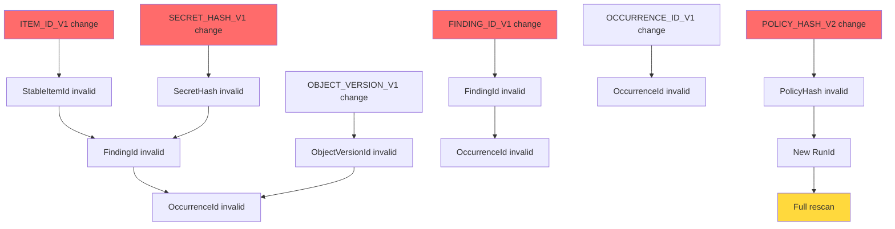
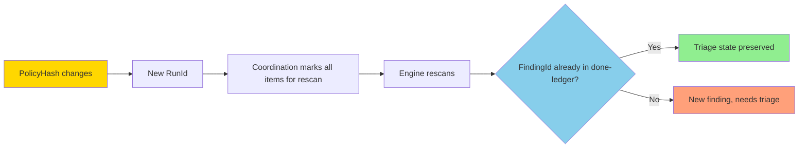
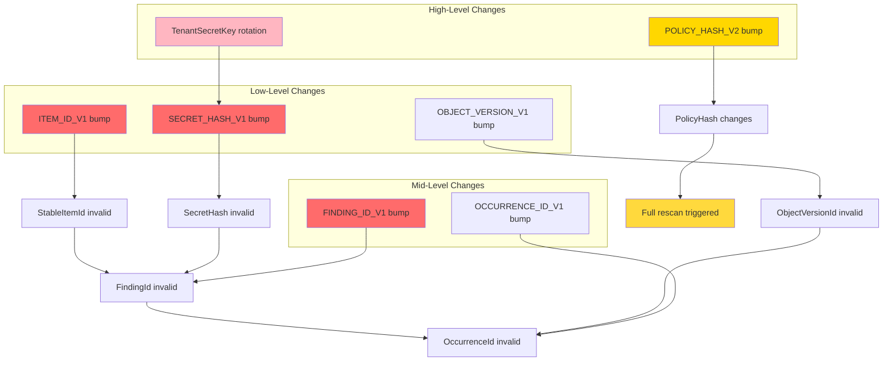

# Version Migration

## What Triggers a Version Bump

A version bump is required when any of the following changes:

1. **Domain constant string** — e.g., `"gossip/finding/v1"` → `"gossip/finding/v2"`
2. **CanonicalBytes encoding** — e.g., changing field order, adding/removing fields
3. **Field set or order** — e.g., adding a field to `FindingIdInputs`
4. **Hashing mode** — e.g., switching from derive-key to keyed mode

**Rule:** If the change produces different output bytes for the same logical input, bump the version.

## Blast Radius Table

**Cascading invalidation:** Changing a low-level constant invalidates all downstream derivations.

| Changed Constant | Directly Invalidates | Transitively Invalidates | Blast Radius |
|------------------|---------------------|--------------------------|--------------|
| `ITEM_ID_V1` | `StableItemId` | `FindingId` → `OccurrenceId` | **High** |
| `OBJECT_VERSION_V1` | `ObjectVersionId` | `OccurrenceId` | Medium |
| `SECRET_HASH_V1` | `SecretHash` | `FindingId` → `OccurrenceId` | **High** |
| `FINDING_ID_V1` | `FindingId` | `OccurrenceId` | **High** |
| `OCCURRENCE_ID_V1` | `OccurrenceId` | (none) | Low |
| `POLICY_HASH_V2` | `PolicyHash` | `RunId` (coordination) | **High** (forces rescan) |



**High blast radius constants:**
- `ITEM_ID_V1` — All findings derived from affected items become invalid
- `SECRET_HASH_V1` — All findings with affected secrets become invalid
- `FINDING_ID_V1` — All findings become invalid
- `POLICY_HASH_V2` — All items marked for rescan

**Low blast radius constants:**
- `OCCURRENCE_ID_V1` — Only occurrence records become invalid (findings unaffected)
- `OBJECT_VERSION_V1` — Only version-specific data becomes invalid

## Dual-Version Coexistence: NOT Supported

**Design decision:** Gossip-rs uses **clean-cut migration**. Old IDs become orphans; full rescan is required.

**Alternative (not used):** Support both `v1` and `v2` derivations simultaneously:
```rust
enum FindingId {
    V1([u8; 32]),
    V2([u8; 32]),
}
```

**Why rejected:**
1. **Complexity:** Every derivation function needs a version parameter
2. **Coordination burden:** Done-ledger must store version-tagged keys
3. **Ambiguity:** How long do we support `v1`? (Forever? Until all tenants migrate?)
4. **Testing:** Combinatorial explosion (test `v1` → `v1`, `v1` → `v2`, `v2` → `v2`)

**Clean-cut migration:**
- Old IDs become orphans (unreachable)
- New IDs are generated on rescan
- Done-ledger eventually purges orphans via TTL or manual cleanup

## Persistence Impact

### FindingId Orphans in Done-Ledger

> **Note**: `DoneLedgerKey` is a **conceptual type** from the persistence layer design, not an implemented type in the contracts crate. The pseudocode below illustrates how version migration affects done-ledger key lookups.

**Before migration:**
```rust
// Pseudocode — DoneLedgerKey is a conceptual type, not implemented in contracts
DoneLedgerKey {
    tenant: TenantId::from_bytes([0x11; 32]),
    policy_hash: PolicyHash::from_bytes([0xAA; 32]),
    item: StableItemId::from_bytes([0x22; 32]),  // v1 derivation
}
// Status: present in done-ledger (finding was triaged)
```

**After `ITEM_ID_V1` → `ITEM_ID_V2` migration:**
```rust
// Pseudocode — DoneLedgerKey is a conceptual type, not implemented in contracts

// Old key (orphaned):
DoneLedgerKey {
    tenant: TenantId::from_bytes([0x11; 32]),
    policy_hash: PolicyHash::from_bytes([0xAA; 32]),
    item: StableItemId::from_bytes([0x22; 32]),  // v1 derivation (old bytes)
}
// Status: still in done-ledger, but never queried (no new scans use v1)

// New key (fresh):
DoneLedgerKey {
    tenant: TenantId::from_bytes([0x11; 32]),
    policy_hash: PolicyHash::from_bytes([0xAA; 32]),
    item: StableItemId::from_bytes([0x33; 32]),  // v2 derivation (new bytes, same logical item)
}
// Status: not present (finding will be re-reported)
```

**Consequence:** The same logical finding is re-reported as new until it's triaged again.

### OccurrenceId Orphans

**Scenario:** `OCCURRENCE_ID_V1` changes, but `FINDING_ID_V1` does not.

**Before migration:**
```rust
FindingId([0x11; 32])  // Same before and after
└── OccurrenceId([0xAA; 32])  // v1 derivation
```

**After `OCCURRENCE_ID_V1` → `OCCURRENCE_ID_V2` migration:**
```rust
FindingId([0x11; 32])  // Unchanged
├── OccurrenceId([0xAA; 32])  // v1 derivation (orphan)
└── OccurrenceId([0xBB; 32])  // v2 derivation (fresh)
```

**Consequence:** Duplicate occurrence records until orphans are purged.

## PolicyHash Interaction

### PolicyHash Change Does NOT Cascade to Identity

**Key property:** Bumping `CURRENT_VERSION` or `CURRENT_EVIDENCE_VERSION` changes `PolicyHash`, but does NOT change `FindingId` or `OccurrenceId`.

**Example:**
```rust
// Policy change (new rule added):
let old_policy = compute_policy_hash(&PolicyHashInputs {
    policy_hash_version: 1,
    id_hash_mode: IdHashMode::KeyedV1,
    evidence_hash_version: 1,
    rules_digest: [0xAA; 32],  // Old rule set
});

let new_policy = compute_policy_hash(&PolicyHashInputs {
    policy_hash_version: 1,
    id_hash_mode: IdHashMode::KeyedV1,
    evidence_hash_version: 1,
    rules_digest: [0xBB; 32],  // New rule set
});

assert_ne!(old_policy, new_policy);  // PolicyHash changed

// But FindingId derivation is unchanged:
let finding = derive_finding_id(&FindingIdInputs {
    tenant: TenantId::from_bytes([0x11; 32]),
    item: StableItemId::from_bytes([0x22; 32]),
    rule: RuleFingerprint::from_bytes([0x33; 32]),
    secret: SecretHash::from_bytes_internal([0x44; 32]),
});
// FindingId is identical before and after policy change
```

**Why this matters:** Changing `PolicyHash` triggers a rescan (new `RunId`), but the findings themselves are comparable across policy versions. If a secret was "accepted" under the old policy, and it's still detected under the new policy, the `FindingId` is the same → triage state is preserved.

**Rescan cascade:**


## Key Rotation: TenantSecretKey Change

**Scenario:** A tenant rotates their secret key (e.g., due to compromise or routine rotation policy).

**Cascade:**


**Impact:**
- All `SecretHash` values for the tenant change (same `NormHash`, different key)
- All `FindingId` values change (different `SecretHash` input)
- All `OccurrenceId` values change (different `FindingId` input)
- **PolicyHash is NOT affected** (key rotation is tenant-specific, not policy-affecting)

**Rescan requirement:**
1. Coordination must trigger a full rescan for the affected tenant
2. Old findings become orphans (unreachable via new `FindingId` values)
3. New findings are reported (even if logically identical)

**Migration procedure (6 steps):**
1. **Provision new key:** Generate a fresh `TenantSecretKey` for the tenant
2. **Mark old key as deprecated:** Keep it in storage but mark as read-only
3. **Trigger rescan:** Create a new `RunId` with a sentinel `PolicyHash` change (or use a `force_rescan` flag in coordination)
4. **Wait for completion:** Coordination must complete the full rescan
5. **Archive old done-ledger:** Export old findings for audit trail
6. **Purge old key:** Delete the deprecated `TenantSecretKey` from storage

## Step-by-Step Migration Procedure

### When Bumping a Domain Constant

**Example:** Migrating from `FINDING_ID_V1` to `FINDING_ID_V2`.

#### Step 1: Update Domain Constant

**File:** `crates/gossip-contracts/src/identity/domain.rs`

```rust
// Old:
pub const FINDING_ID_V1: &str = "gossip/finding/v1";

// New:
pub const FINDING_ID_V2: &str = "gossip/finding/v2";  // ← Changed
```

#### Step 2: Update Cached Hasher

**File:** `crates/gossip-contracts/src/identity/hashing.rs`

```rust
// Old:
pub(crate) static FINDING_HASHER: LazyLock<Hasher> =
    LazyLock::new(|| Hasher::new_derive_key(domain::FINDING_ID_V1));

// New:
pub(crate) static FINDING_HASHER: LazyLock<Hasher> =
    LazyLock::new(|| Hasher::new_derive_key(domain::FINDING_ID_V2));  // ← Changed
```

#### Step 3: Regenerate Golden Vector

**File:** `crates/gossip-contracts/src/identity/golden.rs`

1. Run the test:
   ```bash
   cargo test derive_finding_id_golden_value
   ```
2. Capture the new output (printed in the failure message):
   ```
   Actual: [0x9A, 0x3F, 0x7B, ...]
   ```
3. Update the constant:
   ```rust
   const FINDING_ID_EXPECTED: [u8; 32] = [
       0x9A, 0x3F, 0x7B, /* ... new bytes ... */
   ];
   ```

#### Step 4: Update Downstream References

Grep for `FINDING_ID_V1` across all crates:
```bash
rg "FINDING_ID_V1" --type rust
```

Update all references to `FINDING_ID_V2`.

#### Step 5: Add Migration Note

**File:** `docs/migration-notes/finding-id-v2.md`

```markdown
# FindingId Migration: V1 → V2

**Date:** 2026-02-15
**Domain constant:** `FINDING_ID_V1` → `FINDING_ID_V2`

## Breaking Changes

All existing `FindingId` values are now invalid.

## Impact

- **Coordination:** All items must be marked for rescan
- **Persistence:** Old findings in done-ledger become orphans
- **Triage:** Existing triage state is lost (findings will be re-reported as new)

## Migration Steps

1. Deploy the updated `gossip-contracts` crate to all services
2. Coordination automatically triggers a rescan on the next policy sync
3. Archive old done-ledger for audit trail (optional)
4. Purge orphaned entries after 30 days (optional)

## Rollback

Not supported. Forward-only migration.
```

#### Step 6: Deploy

1. Run full test suite: `cargo test`
2. Deploy to staging: `cd crates/gossip-contracts && cargo publish --dry-run`
3. Deploy to production: `cargo publish`
4. Monitor coordination logs for rescan progress

## Summary Table

| Trigger | Affected IDs | Rescan Required? | Triage State Preserved? |
|---------|-------------|------------------|------------------------|
| Domain constant change | All derived IDs | Yes | No (orphans) |
| Field added/removed | Composite type + derived IDs | Yes | No (orphans) |
| Field order change | Composite type + derived IDs | Yes | No (orphans) |
| Hash mode change | Affected ID + derived IDs | Yes | No (orphans) |
| PolicyHash version bump | PolicyHash | Yes | **Yes** (FindingId unchanged) |
| TenantSecretKey rotation | SecretHash + FindingId + OccurrenceId | Yes | No (orphans) |

## Cascade Graph



## Key Takeaways

1. **Version bumps are breaking changes** — Old IDs become orphans, full rescan required
2. **Blast radius matters** — Changing low-level constants cascades to all derived IDs
3. **PolicyHash is special** — Changes trigger rescan but preserve `FindingId` values
4. **Key rotation cascades** — Changing `TenantSecretKey` invalidates all secret-derived IDs
5. **Clean-cut migration** — No dual-version support; forward-only migration

**Next:** Apply this knowledge to the coordination and persistence boundary modules.
