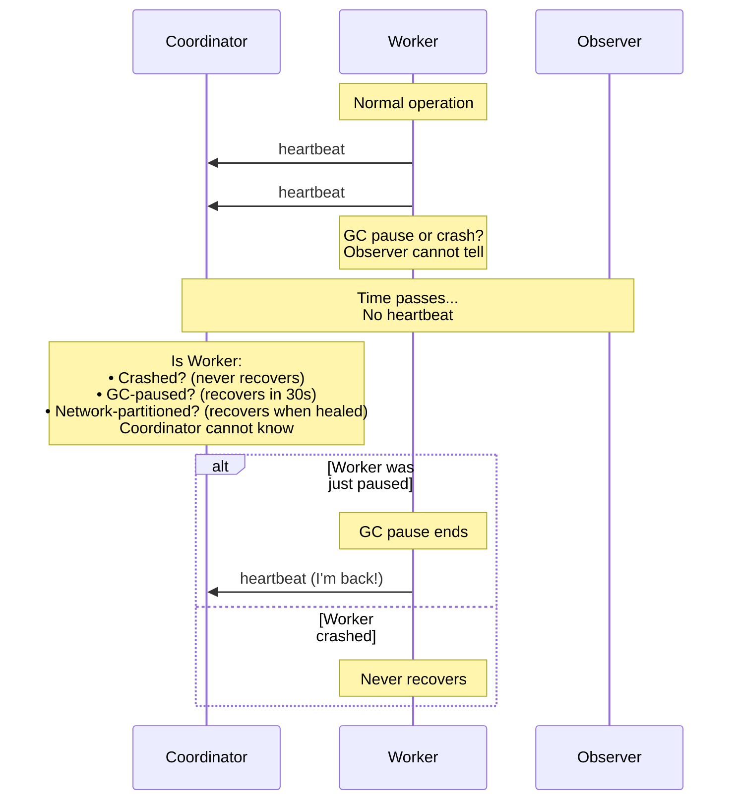

# Impossibility Results

## Overview

Before building a distributed system, you must understand what is mathematically impossible. The FLP impossibility result, published in 1985, is the foundational theorem that constrains all distributed systems design. It tells us that certain problems cannot be solved deterministically in asynchronous systems, no matter how clever the algorithm.

This isn't a limitation of engineering—it's a mathematical proof. Understanding it shapes how Gossip-rs makes design decisions about coordination, leases, and safety guarantees.

## The FLP Impossibility Theorem

**Formal statement (Fischer, Lynch, Paterson, JACM 1985):**

> No deterministic consensus protocol can guarantee termination in an asynchronous system where even a single process may fail by crashing.

Let's unpack each term:

### What is "Consensus"?

Consensus means getting multiple processes to agree on a single value. The requirements are:

1. **Agreement**: All non-faulty processes decide on the same value
2. **Validity**: The decided value must have been proposed by some process
3. **Termination**: All non-faulty processes eventually decide

Examples: electing a leader, committing a transaction, agreeing on the order of operations.

### What is "Asynchronous"?

An asynchronous system has no bounds on:
- Message delivery time (a message can take arbitrarily long)
- Processing time (a process can take arbitrarily long to compute)
- Clock drift (local clocks can diverge arbitrarily)

This is the default reality for distributed systems. Networks have variable latency. Processes experience garbage collection pauses, CPU contention, and I/O delays.

**The indistinguishability problem**: In an asynchronous system, a process that has crashed looks identical to a process that is just very slow. You cannot tell the difference. A 30-second GC pause is indistinguishable from a permanent crash until the paused process eventually responds.

### What Does FLP Prove?

FLP proves that there exist initial system states from which no deterministic algorithm can guarantee consensus termination if even one process may crash. The proof constructs a scenario where the algorithm can be forced into an infinite chain of states, never deciding.

This doesn't mean consensus is impossible in practice—it means you must make trade-offs.

## Practical Implications

All real distributed systems use **timeouts** to work around FLP. Timeouts introduce synchrony assumptions:

- "If I don't hear from a process within T seconds, I'll assume it's crashed"
- "If a message doesn't arrive within T seconds, I'll resend"

But timeouts are **heuristics**, not proofs. They can be wrong:
- Too short → false positives (declare a slow process dead, causing split-brain)
- Too long → false negatives (wait too long to recover from real failures)

The art of distributed systems is choosing good timeout values and building systems that remain safe even when timeouts fire incorrectly.

## How Gossip-rs Responds to FLP

Gossip-rs avoids the consensus problem entirely by using a different coordination model:

### 1. No Consensus Needed

The coordinator doesn't need agreement from workers. It makes **unilateral decisions**:
- "Worker A, you now own shard S. Here's fencing token 42."
- If Worker A disagrees or doesn't respond, the coordinator simply reassigns to Worker B with token 43.

This is possible because workers are **stateless** with respect to shard ownership. All authoritative state lives in the coordination backend (currently in-memory, with etcd or PostgreSQL as future options).

### 2. Leases Replace Consensus

Instead of achieving consensus on "who owns the shard", Gossip-rs uses **leases**:
- A lease is a time-bounded grant of ownership
- After expiry, the lease holder loses rights automatically, without explicit revocation
- The coordinator can reassign a shard after lease expiry, knowing the old owner can no longer mutate state

Leases require bounded time assumptions (weak synchrony), but they're much cheaper than consensus:
- No multi-round protocols
- No quorum requirements
- No leader election

See [03-leases-and-fencing.md](./03-leases-and-fencing.md) for details.

### 3. Fencing Tokens Prevent Stale Writes

Even if a zombie worker wakes up after its lease expired, **fencing tokens** prevent corruption:
- Every lease comes with a monotonically increasing token
- Every mutation includes the token
- The backend rejects writes from stale tokens

This gives us safety without consensus: even if two workers believe they own a shard (due to network partition or GC pause), at most one can successfully mutate state.

### 4. The Safety/Liveness Tradeoff

FLP tells us we must choose between safety and liveness in an asynchronous system:

- **Safety**: Bad things never happen (e.g., never corrupt data, never produce duplicate findings)
- **Liveness**: Good things eventually happen (e.g., scans eventually complete, progress is always made)

Gossip-rs picks **safety over liveness**:
- Scans may stall during network partitions or coordinator failures
- Workers may be unable to acquire leases during configuration issues
- But **findings are never duplicated**, **state is never corrupted**, and **scans never produce incorrect results**

This is the right tradeoff for a secret scanner: it's far better to stall temporarily than to miss secrets or report false positives.

## The Lesson for System Builders

FLP is not a reason to give up—it's a guide for making informed design decisions:

1. **Recognize when you need consensus** (e.g., leader election, ordering across datacenters) and when you don't (e.g., independent scanning workers)
2. **Use weak synchrony assumptions** (timeouts, leases) where acceptable
3. **Build safety mechanisms** that remain correct even when synchrony assumptions are violated (fencing tokens, idempotency)
4. **Be explicit about the safety/liveness tradeoff** in your system's design

Gossip-rs demonstrates that you can build a robust distributed system without consensus by carefully structuring coordination around leases, fencing, and unilateral decisions.

## Deep Dive: Formal Statement of FLP

For readers interested in the formal proof:

**Theorem (FLP85)**: Consider a distributed system with N processes communicating via asynchronous message passing, where:
- Up to 1 process may fail by crashing (stop executing)
- Processes are deterministic
- The network is reliable (messages are eventually delivered, but delivery time is unbounded)

Then: There is no deterministic algorithm that guarantees consensus (agreement, validity, termination) for all possible executions.

**Proof sketch**:
1. Define a **valency** for each system state: 0-valent (must decide 0), 1-valent (must decide 1), or bivalent (could decide either)
2. Show there exists an initial bivalent state (by contradiction: if all initial states were univalent, processes would have to decide without receiving messages, violating agreement)
3. Show that from any bivalent state, there's an execution that leads to another bivalent state (by constructing a scenario where a single message is delayed indefinitely, preventing the algorithm from distinguishing two cases)
4. Therefore: there exists an infinite execution that never reaches a univalent state (never decides)

The full proof is 15 pages of careful reasoning about state machines and execution schedules. See the original paper (Fischer, Lynch, Paterson, "Impossibility of Distributed Consensus with One Faulty Process", JACM 1985) for details.

## Further Reading

- **Fischer, Lynch, Paterson (1985)**: ["Impossibility of Distributed Consensus with One Faulty Process"](https://groups.csail.mit.edu/tds/papers/Lynch/jacm85.pdf), JACM
- **Lamport (1998)**: ["The Part-Time Parliament"](https://lamport.azurewebsites.net/pubs/lamport-paxos.pdf) (Paxos consensus algorithm)
- **Kleppmann (2017)**: *Designing Data-Intensive Applications*, Chapter 9 (excellent FLP explanation)
- **Attiya & Welch (2004)**: *Distributed Computing: Fundamentals, Simulations, and Advanced Topics* (rigorous textbook)

---

**Next**: [02-consistency-models.md](./02-consistency-models.md) explores the spectrum of consistency guarantees and where each Gossip-rs component falls.
