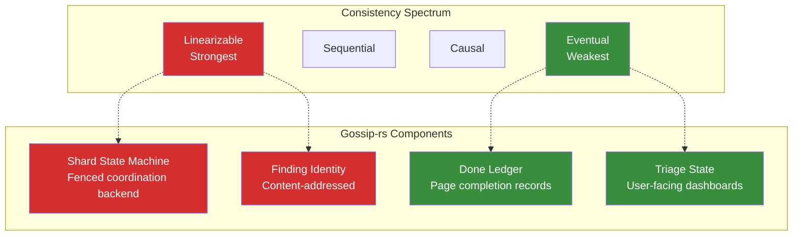

# Consistency Models

## Overview

When multiple processes read and write shared data, what guarantees do we provide about the order and visibility of operations? This question defines the **consistency model** of a distributed system.

Consistency models range from **linearizability** (strongest, most expensive) to **eventual consistency** (weakest, cheapest). There is no universally "best" model—the right choice depends on the subsystem's requirements.

Gossip-rs uses different consistency models for different components:
- **Linearizable** coordination for shard state (safety-critical)
- **Deterministic/linearizable** finding identity (content-addressed)
- **Eventually consistent** done ledger (idempotency handles staleness)
- **Eventually consistent** triage state (user-facing, tolerates delays)

This chapter explains each model, why it matters, and where it applies in Gossip-rs.

## The Consistency Spectrum

### 1. Linearizability (Strongest)

**Definition (Herlihy & Wing, TOPLAS 1990):**

> A system is linearizable if every operation appears to take effect instantaneously at some point between its invocation and completion, and operations are consistent with real-time ordering.

**Intuition**: Operations behave as if they execute on a single machine with no concurrency. There's a total order that respects causality and real-time.

**Formal properties**:
- **Real-time ordering**: If operation A completes before operation B begins (in wall-clock time), then A appears before B in the total order
- **Single-copy consistency**: Reads always return the value of the most recent completed write
- **Composability**: Linearizable subsystems compose into a linearizable system

**Example**: You write `x=1`, then read `x`. You will always see `1`, never a stale value.

**Cost**: Requires coordination (often consensus) to establish the total order. High latency for cross-datacenter writes.

**Where Gossip-rs uses it**:
- **Shard state machine**: The coordination backend provides linearizable operations via fencing tokens. The in-memory reference backend is the primary implementation; an etcd backend (`gossip-coordination-etcd` crate) provides full protocol coverage with codec, keyspace, config, simulation, and behavioral conformance modules plus CAS-backed implementations of all lifecycle and terminal operations. When Worker A reads shard state, it sees the effects of all prior writes that completed before the read began.
- **Finding identity**: Content-addressed identity is deterministic—same inputs always produce the same `FindingId`. This is effectively linearizable because there's no ambiguity: any two processes computing the identity of the same data will get identical results.

### 2. Sequential Consistency

**Definition (Lamport, 1979):**

> A system is sequentially consistent if operations appear to execute in some total order, and each process's operations appear in program order.

**Difference from linearizability**: No requirement to respect real-time ordering across processes.

**Example**: Process A writes `x=1`, then `y=2`. Process B reads `y=2`, then `x`. If the system is sequentially consistent (but not linearizable), B might read `x=0` (stale), as long as the total order `x=1 → y=2 → read(y)=2 → read(x)=0` doesn't violate program order for A or B individually.

Linearizability would forbid this: if `read(y)=2` saw the write `y=2`, then real-time ordering requires `x=1` to have completed before `y=2`, so `read(x)` must return `1`.

**Where Gossip-rs uses it**: Gossip-rs doesn't explicitly use sequential consistency, but it's a useful conceptual stepping stone between linearizability and weaker models.

### 3. Causal Consistency

**Definition**: If event A causally precedes event B (A happened-before B), then all processes observe A before B. Concurrent events (neither happened-before the other) may be observed in any order.

**Lamport's happened-before relation (→)**:
- If A and B occur in the same process and A occurs before B in program order, then A → B
- If A is a send event and B is the corresponding receive, then A → B
- If A → B and B → C, then A → C (transitivity)

**Example**: User posts a comment, then likes it. All readers must see the comment before the like (causal order). But two comments posted concurrently by different users can appear in any order to different readers.

**Cost**: Cheaper than linearizability (no global coordination), but requires tracking causality (e.g., vector clocks).

**Where Gossip-rs uses it**: Not explicitly, but the done-ledger's conflict resolution implicitly respects causality: a worker that writes a page completion record includes its cursor position, establishing a causal order (page N completed before page N+1 started).

### 4. Eventual Consistency

**Definition (Vogels, CACM 2009):**

> If no new updates are made to a replica, eventually all replicas converge to the same state.

**Key property**: **Liveness, not safety**. The system guarantees convergence eventually, but makes no promises about intermediate states. Readers may see stale data.

**Example**: DNS, distributed caches, shopping cart totals (Amazon's Dynamo paper). You might briefly see an outdated product price, but if prices stop changing, all users eventually see the same value.

**Cost**: Very cheap. No coordination required. Scales horizontally.

**Where Gossip-rs uses it**:
- **Done ledger**: Workers write page completion records without coordination. Different workers may temporarily see different views of which pages are complete. But Gossip-rs uses idempotency to handle duplicates: if two workers both scan page 17, the finding deduplication layer ensures each finding is recorded only once.
- **Triage state**: User-facing dashboards query the triage database (PostgreSQL). This state is updated asynchronously as findings are processed. Staleness is acceptable—users don't need real-time updates on secret counts.

## CAP Theorem

**Brewer's CAP Conjecture (2000), formalized by Gilbert & Lynch (2002):**

> In a distributed system experiencing a network partition, you must choose between Consistency and Availability.

**Definitions**:
- **Consistency**: Every read receives the most recent write or an error (linearizability)
- **Availability**: Every request receives a (non-error) response, without guarantee that it's the most recent write
- **Partition Tolerance**: The system continues operating despite arbitrary network partitions

**The choice**:
- **CP (Consistency + Partition Tolerance)**: During partition, reject writes to the minority partition to avoid split-brain. Examples: HBase, MongoDB (single-primary), etcd.
- **AP (Availability + Partition Tolerance)**: During partition, allow writes to all partitions, risking conflicts. Examples: Cassandra, DynamoDB, Riak.

**Why "choose 2 out of 3" is misleading**: Partitions are rare but inevitable. The real question is: when a partition occurs, do you preserve consistency (CP) or availability (AP)?

### Gossip-rs and CAP

Gossip-rs uses **different strategies for different components**:

| Component | CAP Choice | Reasoning |
|-----------|------------|-----------|
| Shard coordination | **CP** | Consistency is critical. During partition, shards become unavailable rather than risk split-brain. Fencing tokens enforce single-writer semantics. |
| Finding writes | **AP** + idempotency | Workers write findings independently. If network partitions, workers continue writing to their local done-ledger. Reconciliation happens later via content-addressed identity. |
| Done ledger | **AP** + eventual consistency | Page completion records are written without coordination. Staleness is tolerable because idempotency handles duplicate scans. |
| Triage queries | **AP** | Reads are eventually consistent. Users tolerate stale dashboards. |

The key insight: **Gossip-rs achieves both consistency and availability by separating concerns**. Coordination is CP (safe, but may stall). Finding writes are AP (always available, reconciled via idempotency).

## Consistency in Gossip-rs Components

### Why These Choices?

**1. Shard State Machine: Linearizable**

Safety-critical. If two workers believe they own the same shard, data corruption or duplicate findings result. Linearizability ensures:
- Workers see lease assignments in real-time order
- Fencing tokens are monotonically increasing
- Backend rejects stale writes

**2. Finding Identity: Deterministic (effectively linearizable)**

Content-addressed identity means there's no ambiguity. Two workers scanning the same secret will compute identical `FindingId`. No coordination needed—determinism provides linearizability for free.

**3. Done Ledger: Eventually Consistent**

Page completion tracking is not safety-critical:
- If a worker re-scans a completed page (due to staleness), idempotency ensures findings aren't duplicated
- If two workers mark the same page as done, convergence happens naturally (both records represent the same fact)

Eventual consistency enables horizontal scalability: workers write done-records independently, without blocking on coordination.

**4. Triage State: Eventually Consistent**

User-facing dashboards don't need real-time updates. Staleness is acceptable:
- A 10-second delay in secret count is fine for human operators
- Expensive consistency (locking, coordination) would slow down queries without user benefit

## The Cost of Consistency

Higher consistency guarantees come with trade-offs:

| Model | Latency | Throughput | Partition Behavior |
|-------|---------|------------|---------------------|
| Linearizable | High (coordination required) | Low (serialization bottleneck) | Stalls during partition (CP) |
| Sequential | Medium | Medium | Stalls during partition (CP) |
| Causal | Low (partial order) | High | May allow some stale reads |
| Eventual | Very low | Very high | Always available (AP) |

**Gossip-rs optimization**: Use the weakest model that preserves safety for each component. Don't pay for linearizability where eventual consistency suffices.

## Verification and Testing

How do you verify that your system provides the claimed consistency model?

**1. Jepsen tests** (jepsen.io): Fault injection framework that simulates network partitions, clock skew, process crashes. Analyzes operation histories to detect consistency violations (e.g., stale reads that violate linearizability).

**2. Model checking** (TLA+): Formally specify the consistency model and exhaustively explore all possible execution interleavings. Gossip-rs's coordination protocol could be model-checked in TLA+ to prove linearizability.

**3. Linearizability checkers**: Tools like Porcupine (Go) or Knossos (Clojure) take an operation history (timestamps, invocations, responses) and check if a linearizable total order exists.

**Future work**: Gossip-rs should add Jepsen-style integration tests for the coordination layer to verify fencing token semantics under partition.

## Further Reading

- **Herlihy & Wing (1990)**: ["Linearizability: A Correctness Condition for Concurrent Objects"](https://cs.brown.edu/~mph/HerlihyW90/p463-herlihy.pdf), TOPLAS
- **Lamport (1979)**: ["How to Make a Multiprocessor Computer That Correctly Executes Multiprocess Programs"](https://lamport.azurewebsites.net/pubs/multi.pdf), IEEE Transactions on Computers
- **Vogels (2009)**: ["Eventually Consistent"](https://queue.acm.org/detail.cfm?id=1466448), ACM Queue
- **Gilbert & Lynch (2002)**: ["Brewer's Conjecture and the Feasibility of Consistent, Available, Partition-Tolerant Web Services"](https://users.ece.cmu.edu/~adrian/731-sp04/readings/GL-cap.pdf), SIGACT News
- **Kleppmann (2017)**: *Designing Data-Intensive Applications*, Chapter 9 (excellent CAP/consistency discussion)
- **Bailis & Ghodsi (2013)**: ["Eventual Consistency Today: Limitations, Extensions, and Beyond"](https://queue.acm.org/detail.cfm?id=2462076), ACM Queue

---

**Next**: [03-leases-and-fencing.md](./03-leases-and-fencing.md) explains how Gossip-rs uses leases and fencing tokens to prevent stale writes without consensus.
