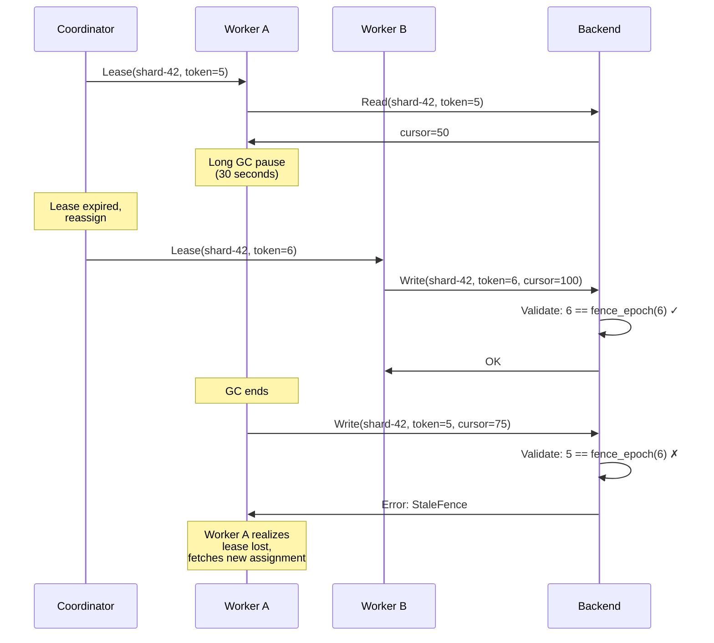

# Leases and Fencing

## Overview

Distributed coordination faces a fundamental challenge: how do you prevent a slow or partitioned process from making stale writes? The **zombie worker problem** occurs when a worker holding a lock gets delayed (GC pause, network partition, CPU starvation), the lock expires, another worker acquires it, and the first worker wakes up still thinking it owns the lock.

Gossip-rs solves this with two mechanisms:
1. **Leases**: Time-bounded ownership grants that expire automatically
2. **Fencing tokens**: Monotonically increasing tokens that prevent stale writes even if a zombie worker attempts them

Together, these provide **safety without consensus**: even if two workers believe they own a shard, at most one can successfully mutate state.

## The Zombie Worker Problem

Consider a naive locking protocol:

```
Worker A: acquire(shard-42) → success
Worker A: [long GC pause: 30 seconds]
Coordinator: lease timeout, reassign to Worker B
Worker B: acquire(shard-42) → success
Worker B: write(shard-42, cursor=100)
Worker A: [GC ends, wakes up]
Worker A: write(shard-42, cursor=50)  ← STALE WRITE! Corruption!
```

Worker A's stale write has corrupted shard-42's state. The cursor moved backward, causing re-enumeration and duplicate findings.

**Why explicit revocation doesn't help**: You can't reliably revoke a lock from a process that's crashed, slow, or partitioned. The revocation message might never arrive, or arrive after the damage is done.

**The insight**: Instead of trying to notify the old owner, make stale writes *fail at the storage layer*.

## Leases: Time-Bounded Ownership

**Definition (Gray & Cheriton, SOSP 1989):**

> A lease is a time-bounded grant of ownership. After expiry, the lease holder loses rights automatically, without explicit revocation.

**Key properties**:
- **Finite duration**: Leases have a TTL (time-to-live). After expiry, the grant is void.
- **Automatic revocation**: The lease holder loses rights even if it never acknowledges revocation.
- **Renewal**: Active lease holders renew before expiry to maintain ownership.

**Contrast with locks**:
- Locks require explicit release. If the holder crashes, the lock may be stuck indefinitely.
- Leases expire automatically. If the holder crashes, the coordinator can reassign after TTL.

### Lease Protocol in Gossip-rs

1. **Acquisition**: Worker requests shard S from coordinator
2. **Grant**: Coordinator responds with `Lease(shard=S, token=42, expires_at=T)`
3. **Renewal**: Worker renews periodically (e.g., every TTL/3) to maintain ownership
4. **Expiry**: If worker fails to renew before T, coordinator reassigns to another worker

**Coordinator-side invariant**: Never grant a lease for shard S with expiry T2 until all previous leases have expired (time > T1). This ensures no overlap.

**Worker-side invariant**: Never perform shard operations after local clock passes expiry time. This is best-effort (clocks drift), which is why we need fencing tokens.

### The Clock Skew Problem

Leases assume synchronized clocks. But clocks drift:
- NTP can keep clocks within ~100ms on a LAN, but may diverge more on WAN or during network issues
- A worker's clock might run fast (thinks lease expired early) or slow (thinks lease still valid after expiry)

**Mitigation 1: Conservative TTLs**. Choose TTL >> expected clock skew. If TTL = 30s and clock skew < 1s, the safety margin is large.

**Mitigation 2: Fencing tokens** (next section). Even if a worker's clock is wrong, stale writes will be rejected.

## Fencing Tokens: Ordering Writes

**Definition (Kleppmann, 2016; formalized by Hochstein, 2025):**

> A fencing token is a monotonically increasing integer issued with each lease. Storage validates: token ≥ last-seen-token for this resource. Writes with stale tokens are rejected.

**How it works**:

1. Coordinator maintains a counter per shard (starts at 0)
2. When granting a lease, increment counter and include token in response
3. Worker includes token in every mutation request
4. Backend validates token before applying write:
   ```rust
   // Gossip-rs uses strict equality, not >=
   if lease.fence() != record.fence_epoch {
       return Err(StaleFence { presented: lease.fence(), current: record.fence_epoch });
   }
   // Epoch is NOT updated here -- it only advances on acquire_and_restore
   ```

**Property**: Even if two workers A and B both believe they own shard S (due to clock skew or partition), at most one can write. The one with the matching epoch succeeds; the other gets `StaleFence` error.

### Zombie Worker Sequence with Fencing



**Key insight**: The fencing check happens at the storage layer, not at the coordinator. This prevents race conditions where a worker acquires a lease, the message is delayed, and a stale write arrives first.

## The Three-Step Validation Pipeline

Every lease-gated shard mutation in Gossip-rs B2 follows a three-step validation pipeline (defined in `validation.rs`):

1. **`check_op_idempotency`** — replay detection. Checked **first** so that replays succeed even after the lease expires or the shard reaches a terminal state. This ordering is critical: a worker that successfully completed an operation but failed to receive the response must be able to retry and get the cached result.

2. **`validate_lease`** — tenant isolation, terminal status, fence epoch, lease expiry, and owner identity. Five checks in a fixed order (see below).

3. **Operation-specific validation** — e.g., `validate_cursor_update_pooled` for checkpoint/complete, or split coverage validation for split operations.

Note that shard lookup is handled by the caller before these steps: if the shard is not found, `CoordError::ShardNotFound { shard }` is returned directly.

## The 5-Check Lease Validation

The `validate_lease` function performs 5 checks in a fixed order, each returning a specific error variant with its full payload:

### 1. Tenant Isolation
```rust
if record.tenant != tenant {
    return Err(TenantMismatch { expected: tenant });
}
```
Multi-tenant systems must validate tenant boundaries first. Only the caller's `expected` tenant is exposed in the error — the actual tenant is deliberately omitted to prevent cross-tenant enumeration.

### 2. Terminal Status
```rust
if record.status.is_terminal() {
    return Err(ShardTerminal { shard: ShardKey::new(record.run, record.shard), status: record.status });
}
```
Reject mutations to shards in a terminal state (Done, Split, or Parked). Once a shard reaches a terminal state, no further writes are permitted.

### 3. Fencing Epoch Validation
```rust
// Gossip-rs B2: strict epoch equality
if lease.fence() != record.fence_epoch {
    return Err(StaleFence { presented: lease.fence(), current: record.fence_epoch });
}
// Epoch is NOT updated here -- it only advances on acquire_and_restore
```
Gossip-rs uses strict equality rather than a `>=` or `<` comparison because the coordinator is the sole authority over epoch assignment. If a worker presents a fence epoch that differs from the shard's current epoch -- whether higher or lower -- it indicates a zombie worker or a stale request. Any mismatch is invalid, not just "less than". This eliminates an entire class of subtle bugs where a worker might accidentally advance the epoch through a write path.

### 4. Lease Expiry
```rust
// Check for no lease holder — treat as stale fence.
let Some(deadline) = record.lease_deadline() else {
    return Err(StaleFence { presented: lease.fence(), current: record.fence_epoch });
};
if now >= deadline {
    return Err(LeaseExpired { deadline, now });
}
```
Even if the fence epoch matches, the lease must still be active. An expired lease or missing holder means the worker's grant has lapsed and the coordinator may reassign the shard at any moment. Note that a missing holder returns `StaleFence` (not `LeaseExpired`) since it indicates an inconsistent state rather than simple expiry.

### 5. Owner Divergence
```rust
if record.lease_owner() != Some(lease.owner()) {
    return Err(StaleFence { presented: lease.fence(), current: record.fence_epoch });
}
```
Final confirmation that the requesting worker is the current holder. This catches the edge case where a different worker has been assigned the shard but happens to share the same fence epoch (e.g., after a rapid reassign cycle). Owner divergence returns `StaleFence` rather than a distinct `OwnerMismatch` variant -- the coordinator treats all post-epoch validation failures as stale-fence conditions, keeping the error space compact.

**Why this order?**
- **Idempotency first**: `check_op_idempotency` runs before `validate_lease` so that replays succeed even after the lease expires or the shard becomes terminal. A worker that successfully completed an operation but crashed before receiving the response can safely retry.
- **Fail-fast on cheap checks**: Within `validate_lease`, tenant isolation and terminal status are simple field comparisons that short-circuit before more expensive validation.
- **Composability**: Each check is independent. Adding a new operation type only requires defining its operation-specific preconditions downstream; the three-step pipeline is reusable.
- **Clear error semantics**: `TenantMismatch { expected }` vs `ShardTerminal { shard, status }` vs `StaleFence { presented, current }` vs `LeaseExpired { deadline, now }` provide actionable diagnostics. Owner divergence reuses `StaleFence` because the corrective action (re-acquire) is identical.
- **Defense in depth**: Multiple layers of validation reduce the risk of bugs.

## Formal Safety Property

**Theorem (Single-Writer Invariant):**

> At any point in time, at most one worker can successfully mutate shard S.

**Proof sketch**:

1. Coordinator grants leases with strictly increasing tokens: T1 < T2 < T3 < ...
2. When the coordinator grants a lease, it sets `shard.fence_epoch` to the new token. Epoch advances **only** at acquire time — writes validate but never modify the epoch.
3. Backend accepts writes only if `lease.fence() == record.fence_epoch` (strict equality).
4. Suppose workers A and B both believe they own shard S:
   - A acquired with token TA → coordinator set `shard.fence_epoch = TA`
   - A writes (checkpoint/complete) → validation checks `TA == TA` → succeeds. Epoch remains TA.
   - Coordinator grants B → sets `shard.fence_epoch = TB` where TB > TA.
5. A's next write fails: `TA != TB` → `StaleFence`.
6. B's write succeeds: `TB == TB`.

**In either case, at most one worker's writes succeed after any acquire.** ∎

This property holds even in the presence of:
- Network partitions (A and B can't communicate)
- Clock skew (A and B's clocks disagree on current time)
- GC pauses (A pauses for arbitrarily long)

The only requirement is that the coordinator issues strictly increasing tokens, which is trivially achieved with a counter.

## Handling Fencing Failures

What happens when a worker receives a `StaleFence` error?

1. **Immediate stop**: Worker ceases all operations on that shard. Do not retry—it will fail again.
2. **Invalidate local state**: Mark lease as revoked in memory. Discard any cached shard state.
3. **Fetch new assignment**: Request a new shard from the coordinator. The coordinator may reassign the same shard (with a new epoch) or assign a different shard.
4. **Restart from last known good state**: New worker reads shard state from backend, which includes the cursor position from the most recent successful write. Resume from there.

**Critically**: A `StaleFence` error is not a bug—it's normal during lease reassignments. Workers must handle it gracefully and not treat it as an unexpected failure.

## Lease Renewal Strategy

Workers must renew leases before expiry. But how often?

**Typical strategy**: Renew at 1/3 of TTL. If TTL = 30s, renew every 10s.

**Why 1/3?**
- Allows 2 retries before expiry (at T=10s and T=20s)
- Tolerates 1 lost renewal message
- Provides safety margin for network delays

**Exponential backoff on failure**: If renewal fails, back off exponentially (with jitter) to avoid thundering herd. Example:
```
Attempt 1: retry after 1s
Attempt 2: retry after 2s
Attempt 3: retry after 4s
... max 30s
```

**Jitter**: Add randomness (e.g., retry after 1s + rand(0..500ms)) to prevent synchronized retries from many workers.

## When Leases Are Insufficient

Leases solve the zombie worker problem, but they don't solve all coordination problems:

**Leases do NOT provide**:
- **Consensus**: If you need multiple processes to agree on a value, use Paxos/Raft/consensus.
- **Distributed transactions**: If you need atomic updates across multiple resources, use 2PC/3PC or saga patterns.
- **Causal ordering**: If you need to preserve happened-before relationships across processes, use vector clocks or CRDTs.

**Leases DO provide**:
- **Exclusive access**: One process owns a resource at a time
- **Automatic expiry**: No need to track which processes are alive
- **Stale write prevention**: Fencing tokens ensure safety

Gossip-rs uses leases because its coordination needs are simple: partition scanning work across workers, ensure no two workers scan the same shard concurrently. This is a perfect fit for leases.

## Implementation Considerations

### 1. Backend Requirements
The backend must support:
- **Atomic compare-and-swap**: To check and update fencing tokens in a single operation
- **Persistent storage**: Tokens must survive backend restarts
- **Low latency**: Every mutation requires a token check; slow backends degrade throughput

Gossip-rs provides two coordination backends. The `InMemoryCoordinator` is the reference implementation used for development and simulation testing. The `gossip-coordination-etcd` crate provides the `EtcdCoordinator` production backend, which implements `CoordinationBackend`, `RunManagement`, and `ShardClaiming` directly against etcd using atomic CAS transactions (`Txn`) for token validation. The crate also exposes `AsyncEtcdCoordinator` (async core) and `SimEtcdCoordinator` (deterministic test backend). Additional production backends (e.g., PostgreSQL with `SELECT FOR UPDATE` + token check) can be added without changing coordination logic.

### 2. Coordinator Scalability
The coordinator is a potential bottleneck: all lease grants go through it. Mitigations:
- **Batching**: Grant multiple leases in a single RPC
- **Caching**: Workers cache lease metadata (shard boundaries, tenant ID) to reduce repeated fetches
- **Horizontal scaling**: Shard the coordinator by tenant ID or shard ID. Each coordinator instance handles a subset of leases.

### 3. Observability
Track metrics:
- **Lease renewal failures**: High failure rate indicates network issues or coordinator overload
- **StaleFence errors**: High error rate indicates too-short TTLs or clock skew
- **Lease churn**: High reassignment rate indicates workers crashing or leases expiring unnecessarily

## References and Further Reading

- **Gray & Cheriton (1989)**: ["Leases: An Efficient Fault-Tolerant Mechanism for Distributed File Cache Consistency"](https://web.stanford.edu/class/cs240/readings/89-leases.pdf), SOSP
- **Kleppmann (2016)**: ["How to do distributed locking"](https://martin.kleppmann.com/2016/02/08/how-to-do-distributed-locking.html), blog post (introduces fencing tokens)
- **Hochstein (2025)**: ["Fencing Tokens: The Ideal Distributed Lock Pattern"](https://lorin.hochstein.org/assets/pdf/fencing-tokens-ideal-pattern.pdf), formal verification of fencing correctness
- **Chandra & Toueg (1996)**: ["Unreliable Failure Detectors for Reliable Distributed Systems"](https://www.cs.utexas.edu/~lorenzo/corsi/cs380d/papers/p225-chandra.pdf), JACM (theoretical foundation for failure detection)
- **Kleppmann (2017)**: *Designing Data-Intensive Applications*, Chapter 8 (distributed locks, leases, fencing)

---

**Next**: [04-idempotency.md](./04-idempotency.md) explains how Gossip-rs ensures exactly-once semantics for operations, even when retries and network failures cause duplicates.
