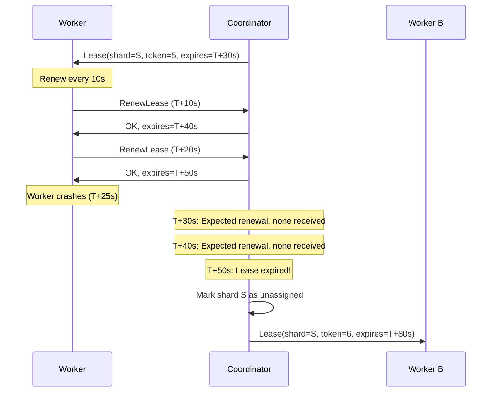
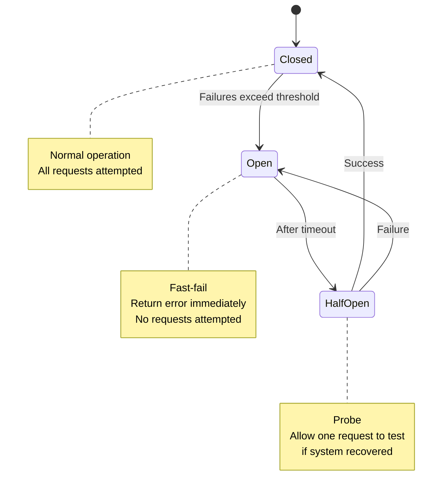

# Failure Detection

## Overview

Distributed systems must detect when processes fail so they can recover—reassign work, fail over to replicas, trigger alerts. But in an asynchronous system, **you cannot definitively tell if a process has crashed or is just slow** (the FLP problem from [01-impossibility-results.md](./01-impossibility-results.md)).

Failure detectors use heuristics (timeouts, heartbeats) to make best-guess decisions. The challenge is balancing:
- **Accuracy**: Minimize false positives (declaring a live process dead)
- **Timeliness**: Minimize detection latency (time from crash to detection)

Gossip-rs uses **lease expiry** as its primary failure detector: if a worker fails to renew its lease, the coordinator reassigns the shard. Additionally, **error classification** (`Retryable`/`Permanent`) and **shard parking** protect against cascade failures when external systems (like GitHub, GitLab) go down, implementing the spirit of the circuit breaker pattern without a dedicated `CircuitBreaker` type.

This chapter explains failure detection theory, Gossip-rs's practical implementation, and techniques like exponential backoff and circuit breakers that make failure handling robust.

## The Fundamental Problem

In an asynchronous system, there are three possibilities when you don't hear from a process:

1. **Crashed**: Process terminated and will never respond
2. **Slow**: Process is alive but delayed (GC pause, CPU contention, network latency)
3. **Partitioned**: Process is alive and responsive, but a network partition blocks communication

From an observer's perspective, **these are indistinguishable**. A timeout is just a guess: "I haven't heard from P in T seconds, so I'll assume it's dead."

**The accuracy/timeliness tradeoff**:
- **Short timeout**: Detect failures quickly, but risk false positives (declare slow processes dead)
- **Long timeout**: Fewer false positives, but slow recovery from real failures

**Example**: Timeout = 5 seconds
- If a process GC-pauses for 6 seconds, you'll falsely declare it dead, potentially reassigning its work and causing duplicate operations
- If a process crashes, you'll wait 5 seconds before recovering

There's no perfect timeout value—it's a system-specific tuning decision.

## Heartbeat-Based Detection

**Classic approach**: Processes send periodic "I'm alive" messages (heartbeats). If N consecutive heartbeats are missed, the process is suspected to have failed.

**Protocol**:
1. Process P sends heartbeat every T seconds to monitor M
2. M maintains a timer for each monitored process
3. If M doesn't receive a heartbeat from P for N × T seconds, M suspects P has failed

**Tuning parameters**:
- **Heartbeat interval (T)**: Shorter = faster detection, but higher network overhead
- **Threshold (N)**: Higher = fewer false positives, but slower detection

**Example**: T = 1s, N = 5. If P misses 5 heartbeats (5 seconds of silence), M declares P dead.

**Challenges**:
- **Network overhead**: In a 1000-node cluster with T = 1s, that's 1000 heartbeat messages/second
- **Clock skew**: If P's clock runs slow, it might think it's sending heartbeats on time, but M's clock disagrees
- **Bursty failures**: If the network partition isolates 100 nodes simultaneously, the monitor receives 100 × N heartbeats in a burst when the partition heals, overwhelming it

## Accrual Failure Detectors

**Improvement (Hayashibara et al., SRDS 2004)**: Instead of a binary alive/dead decision, output a **continuous suspicion level (φ)** representing the probability that the process has failed.

**Key insight**: Use historical data to model expected heartbeat arrival times. If a heartbeat is late, gradually increase φ based on how late it is (not just a hard threshold).

**Phi (φ) accrual**: Measure the time since the last heartbeat (Δt), compare to the expected inter-arrival time distribution (learned from history), compute:
```
φ(Δt) = -log₁₀(P(Δt > threshold))
```

**Interpretation**:
- φ = 1: 90% confidence the process has failed
- φ = 2: 99% confidence
- φ = 3: 99.9% confidence

**Advantages**:
- **Adaptive**: Automatically adjusts to varying network latency and GC pause patterns
- **Application-specific thresholds**: Different subsystems can use different φ thresholds (e.g., φ > 2 for work reassignment, φ > 3 for alerting)
- **Smoother behavior**: Avoids flip-flopping between alive/dead states

**Cassandra uses this**: Nodes compute φ for each peer and use it to decide when to route requests elsewhere.

**Gossip-rs doesn't use accrual detection** (leases are simpler), but it's useful to understand the state-of-the-art.

## Lease-Based Liveness in Gossip-rs

Gossip-rs uses **lease expiry as the failure detector**. No separate heartbeat protocol is needed—lease renewal *is* the liveness signal.

**How it works**:

1. **Worker acquires lease**: Coordinator grants `Lease(shard=S, token=T, expires_at=E)`
2. **Worker renews periodically**: Every `TTL / 3` seconds, worker sends `RenewLease(shard=S, token=T)`
3. **Coordinator updates expiry**: On successful renewal, coordinator extends expiry: `expires_at = now + TTL`
4. **Lease expires**: If worker fails to renew before `E`, coordinator marks shard as unassigned
5. **Reassignment**: Coordinator assigns shard to another worker (with incremented fencing token)

**Failure detection timeline**:



**Key property**: The coordinator doesn't have to distinguish "Worker crashed" from "Worker is slow". It just waits for lease expiry. If the worker comes back (was only slow), it will discover its lease expired (via `StaleFence` error) and request a new assignment.

**Why this is simpler than heartbeats**:
- No separate heartbeat messages (renewal is the heartbeat)
- No tuning N × T parameters (just choose TTL)
- Failure detection is built into the coordination protocol (not a separate subsystem)

## Exponential Backoff for Retries

When a request fails (timeout, connection error), retrying immediately risks:
- **Thundering herd**: 1000 workers all retry at once, overwhelming the coordinator
- **Wasted work**: If the coordinator is overloaded, retries just add more load

**Exponential backoff** spaces out retries:

```rust
let mut delay = initial_delay;  // e.g., 1 second
for attempt in 0..max_attempts {
    match send_request() {
        Ok(response) => return Ok(response),
        Err(_) => {
            sleep(delay);
            delay = min(delay * 2, max_delay);  // e.g., 1s → 2s → 4s → 8s → 16s
        }
    }
}
Err(MaxRetriesExceeded)
```

**Jitter**: Add randomness to prevent synchronized retries:
```rust
let jittered_delay = delay + random(0..delay / 2);
```

**Example**: If 1000 workers all timeout at T=0 and retry with exponential backoff + jitter:
- Without jitter: All retry at T=1s, T=2s, T=4s (synchronized waves)
- With jitter: Retries spread over T=1s..1.5s, T=2s..3s, T=4s..6s (smooth distribution)

**AWS recommendation**: Use exponential backoff with jitter for all retries to cloud services. See ["Exponential Backoff and Jitter"](https://aws.amazon.com/blogs/architecture/exponential-backoff-and-jitter/) for details.

## Circuit Breakers

**Problem**: If an external system (e.g., GitHub API) goes down, workers will repeatedly retry, wasting resources and delaying failure detection.

**Circuit breaker pattern (Nygard, Release It! 2007/2018)**: Wrap remote calls in a state machine that "opens" (fast-fails) after repeated failures, preventing cascade failures.

**States**:



**Protocol**:
1. **Closed (normal)**: All requests are attempted. Track failures.
2. **Failure threshold exceeded**: If N failures occur within time window, transition to **Open**.
3. **Open (fast-fail)**: All requests fail immediately (return error without attempting). After timeout (e.g., 30s), transition to **Half-Open**.
4. **Half-Open (probe)**: Allow one request. If it succeeds, transition to **Closed**. If it fails, return to **Open** (with longer timeout).

**Gossip-rs's approach**: Gossip-rs does not have an explicit `CircuitBreaker` type. Instead, the circuit breaker *pattern* is distributed across two layers:

1. **Error classification at the connector boundary.** Each connector operation returns an `ErrorClass` — either `Retryable` (transient: timeouts, HTTP 429/503) or `Permanent` (credentials, permissions, deleted resource). The orchestration layer uses this classification to decide whether to retry or escalate:

```rust
// From gossip-contracts connector::api — binary retry posture
pub enum ErrorClass {
    Retryable,  // transient; same request may succeed on retry
    Permanent,  // won't succeed until something external changes
}
```

2. **Shard parking in the coordination layer.** When errors accumulate beyond a threshold, the coordinator *parks* the shard — halting work on it rather than continuing to hammer a failing source. `ParkReason` captures why:

```rust
// From gossip-coordination record.rs — coordination-level halt categories
pub enum ParkReason {
    PermissionDenied,  // likely needs credential rotation
    NotFound,          // target no longer exists
    Poisoned,          // internally inconsistent state
    TooManyErrors,     // accumulated transient failures; may auto-retry later
    Other,
}
```

This is functionally equivalent to a circuit breaker's "open" state: the shard stops making requests until conditions change. `TooManyErrors` corresponds to the threshold-exceeded transition, while `PermissionDenied` and `NotFound` correspond to permanent failures that skip straight to "open."

**What's missing**: There is no `HalfOpen` probe state — a parked shard requires an explicit unpark (an out-of-band admin operation that increments the fence epoch). A formal circuit breaker with automatic half-open probing is a design-time pattern described in the connector boundary documentation, not yet an implemented type.

## False Positives and Mitigation

**False positive**: Declaring a live process dead.

**Consequences in Gossip-rs**:
- Worker's lease is revoked while it's still active
- Shard is reassigned to another worker
- Original worker gets `StaleFence` error, stops work

**Why this is safe**: Fencing tokens prevent corruption. The original worker's writes are rejected, so no data loss. The worst-case impact is:
- Wasted work (original worker scanned part of the shard before being stopped)
- Slight delay (new worker resumes from last known cursor)

**Mitigation**:
1. **Choose conservative TTLs**: If typical GC pause is 2s, use TTL = 30s (15× safety margin)
2. **Monitor false positive rate**: Track `lease_revoked_while_active` metric. High rate indicates TTL is too short.
3. **Adaptive TTLs**: In future, coordinator could adjust TTL based on observed worker latency (e.g., if 99th percentile renewal latency is 5s, set TTL = 30s)

## Failure Detection in Other Boundaries

**B3 Shard Algebra**: Coverage verification detects gaps in scanning (missing pages). This is a form of failure detection: if a worker scanned pages 1-10 and 15-20, pages 11-14 are missing (likely due to worker crash).

**B4 Connector**: Monotonic cursor validation detects backward enumeration (e.g., if cursor goes from 100 to 50, the connector state was corrupted or rolled back).

**B5 Persistence**: Done ledger compaction detects incomplete writes (e.g., if a page record exists but no findings for that page, the write was partial due to crash).

## Testing Failure Detection

**Chaos engineering**: Use tools like [Chaos Monkey](https://netflix.github.io/chaosmonkey/) (randomly terminate processes) or [Toxiproxy](https://github.com/Shopify/toxiproxy) (inject network latency, packet loss) to simulate failures and verify detection.

**Example test**:
1. Start 10 workers, each scanning a shard
2. After 30s, kill 3 workers (simulate crash)
3. Verify coordinator detects failure within TTL (e.g., 30s)
4. Verify shards are reassigned to other workers
5. Verify no findings are lost (idempotency handles duplicates)

**Jepsen tests**: Distributed test framework that simulates partitions, crashes, clock skew. Analyzes whether the system correctly detects failures and recovers without data loss.

## The Cost of Failure Detection

**Network overhead**: Lease renewals add RPC load. If 10K workers renew every 10s, that's 1K RPCs/second to the coordinator.

**Latency**: Failure detection adds delay. With TTL = 30s, recovery takes 30s + reassignment time.

**Complexity**: Failure detection logic must handle edge cases (clock skew, retries, duplicate renewals).

**Gossip-rs trade-off**: Prioritize safety over speed. A 30s detection latency is acceptable for a secret scanner (secrets aren't changing second-by-second), but might be unacceptable for a real-time trading system.

## References and Further Reading

- **Hayashibara et al. (2004)**: ["The φ Accrual Failure Detector"](https://www.computer.org/csdl/proceedings-article/srds/2004/22390066/12OmNx7W1Hs), SRDS
- **Chandra & Toueg (1996)**: ["Unreliable Failure Detectors for Reliable Distributed Systems"](https://www.cs.utexas.edu/~lorenzo/corsi/cs380d/papers/p225-chandra.pdf), JACM (theoretical foundation)
- **Nygard (2007/2018)**: *Release It!* (Chapter 5: Circuit Breakers)
- **AWS Architecture Blog**: ["Exponential Backoff and Jitter"](https://aws.amazon.com/blogs/architecture/exponential-backoff-and-jitter/)
- **Kleppmann (2017)**: *Designing Data-Intensive Applications*, Chapter 8 (failure detection, timeouts)

---

**Next**: [06-exactly-once-semantics.md](./06-exactly-once-semantics.md) explains how all five boundaries compose to achieve exactly-once semantics for findings, despite at-least-once delivery and retries.
