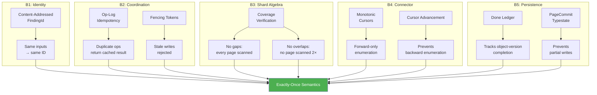

# Exactly-Once Semantics

## Overview

The holy grail of distributed systems is **exactly-once semantics**: process each input exactly once, even in the presence of failures, retries, and network partitions. But networks are unreliable—messages can be lost, duplicated, or reordered. How can we achieve exactly-once when delivery itself is at-least-once at best?

**The answer**: We can't achieve exactly-once *delivery*, but we can achieve exactly-once *semantics*:

> **At-least-once delivery + idempotent processing = exactly-once semantics**

Gossip-rs demonstrates this principle end-to-end. Each of its five boundaries contributes a piece of the exactly-once guarantee:

- **B1 (Identity)**: Content-addressed IDs make duplicate detection deterministic
- **B2 (Coordination)**: Op-log idempotency prevents duplicate state mutations
- **B3 (Shard Algebra)**: Coverage verification ensures no gaps or overlaps
- **B4 (Connector)**: Monotonic cursors prevent backward re-enumeration
- **B5 (Persistence)**: Done ledger tracks completion status with typestate safety

This chapter explains the myth of exactly-once delivery, the practical solution Gossip-rs uses, and how all boundaries compose to provide end-to-end exactly-once semantics for secret scanning.

## The Myth of Exactly-Once Delivery

**Claim**: "Our message queue guarantees exactly-once delivery."

**Reality**: No network protocol can guarantee exactly-once delivery in the presence of failures.

**Why not?**

Consider a sender S and receiver R:

1. S sends message M to R
2. R receives M, processes it, sends acknowledgment A
3. A is lost in the network
4. S times out, assumes M was lost, resends M
5. R receives M again (duplicate)

Even if the sender and receiver use TCP (reliable, ordered delivery), the acknowledgment can be lost. The sender can't distinguish "message lost" from "acknowledgment lost".

**The two-generals problem**: Two generals must coordinate an attack. They communicate via messengers who may be captured. No protocol can guarantee agreement, because the last message's acknowledgment might be lost. This is mathematically proven to be impossible.

**Practical consequence**: All distributed systems use **at-least-once delivery** (retry until acknowledged) or **at-most-once delivery** (send once, never retry). Exactly-once delivery is a myth.

## The Practical Solution: Exactly-Once Semantics

Instead of achieving exactly-once delivery (impossible), achieve **exactly-once semantics**:

> **Definition**: A system provides exactly-once semantics if, from the perspective of an external observer, each input is processed once, even if duplicates occur internally.

**How**: Make operations **idempotent** so that duplicates are harmless. See [04-idempotency.md](./04-idempotency.md) for details.

**Example (Stripe)**: When a user clicks "Pay $100", the browser sends a request with an idempotency key. If the request times out, the browser retries with the same key. The server sees the duplicate, returns the cached result, and the user is charged exactly once—even though the request was delivered twice.

**Reference**: Akidau et al., ["The Dataflow Model"](https://research.google/pubs/pub43864/) (VLDB 2015). Google's streaming systems use windowing + idempotent writes to achieve exactly-once semantics despite at-least-once message delivery.

## Exactly-Once in Gossip-rs: The Five Boundaries

Gossip-rs achieves exactly-once semantics through the composition of five boundaries. No single boundary is sufficient—they work together to ensure that every secret is scanned exactly once and every finding is recorded exactly once, even during failures.



Let's examine each boundary's contribution.

## B1: Identity (Content-Addressed Deduplication)

**Problem**: Two workers scan the same secret. Without deduplication, we record two findings (over-counting).

**Solution**: Use content-addressed `FindingId`:

```rust
FindingId = BLAKE3::derive_key("gossip/finding/v1", tenant_id || stable_item_id || rule_fingerprint || secret_hash)
```

The `FindingId` uses BLAKE3 **derive-key mode** with the domain tag `"gossip/finding/v1"` for domain separation. It is derived from exactly four inputs: the tenant, the version-stable item identifier (e.g., a repo or bucket), the detection rule fingerprint, and the tenant-keyed secret hash. Position information (byte offset, byte length) is not part of `FindingId`---it belongs to `OccurrenceId`, which ties a finding to a specific location within a specific object version:

```rust
OccurrenceId = BLAKE3::derive_key("gossip/occurrence/v1", finding_id || object_version_id || byte_offset || byte_length)
```

This separation keeps `FindingId` stable across versions: the same secret detected by the same rule in the same item always produces the same `FindingId`.

**Property**: Deterministic identity. Two workers scanning the same secret will compute the exact same `FindingId`.

**Deduplication**:
```rust
if store.contains(finding_id) {
    return Ok(Duplicate);  // Already recorded, skip
}
store.insert(finding_id, finding_data);
```

**Why this achieves exactly-once**: Duplicate findings are detected in O(1) with zero false positives. The identity layer ensures that even if two workers scan the same item (due to lease reassignment or retry), the finding is recorded exactly once.

**Contrast with probabilistic deduplication**: Bloom filters have false positives. MinHash has false positives. Content-addressed identity is perfect—no guessing.

## B2: Coordination (Op-Log Idempotency + Fencing)

**Problem**: Network timeout causes a worker to retry `Checkpoint(cursor=100)`. Without idempotency, the operation is applied twice, potentially corrupting state.

**Solution**: Op-log idempotency (see [04-idempotency.md](./04-idempotency.md)):

```rust
match op_log.get(op_id) {
    None => execute_and_store(operation),
    Some(record) if record.payload_hash == payload_hash => {
        return Ok(record.result.clone());  // Duplicate, return cached
    }
    Some(_) => return Err(OpIdConflict { op_id, expected_hash, actual_hash }),  // Same OpId, different payload
}
```

**Property**: Retrying an operation with the same OpId is harmless. The second request returns the cached result without re-executing.

**Fencing tokens** ensure that stale writes are rejected, even if a zombie worker wakes up after its lease expired:

```rust
if lease.fence() != record.fence_epoch {
    return Err(StaleFence { presented: lease.fence(), current: record.fence_epoch });
}
```

**Why this achieves exactly-once**: State mutations are applied at most once per unique OpId. Even if the network duplicates a request, the backend processes it once and returns the same result to all duplicates.

## B3: Shard Algebra (Coverage Verification)

**Problem**: A worker crashes after scanning pages 1-10. A new worker is assigned, scans pages 1-20. Without coverage tracking, pages 1-10 are scanned twice (duplicate findings) and we don't know if any pages were missed.

**Solution**: Coverage verification (see Phase 3 spec):

1. **Record page ranges**: Each worker records which pages it scanned: `[(1, 10), (15, 20)]`
2. **Detect gaps**: If pages 11-14 are missing, coverage is incomplete (liveness violation)
3. **Detect overlaps**: If two workers both scanned page 17, overlaps are detected

**Property**:
- **No gaps**: Every page in the shard is scanned at least once
- **No overlaps** (with idempotency): If overlaps occur, content-addressed identity deduplicates findings

**Why this achieves exactly-once**: Combined with finding deduplication, coverage verification ensures that every item is scanned (no missed secrets) and duplicate scans are harmless (no over-counting).

## B4: Connector (Monotonic Cursors)

**Problem**: A worker scans page 17 (cursor=170), writes findings, then crashes. The shard state shows cursor=160 (stale). A new worker resumes from cursor=160, rescans pages 16-20 (re-enumeration).

**Solution**: Monotonic cursor validation — the coordination layer compares the `last_key` byte slices of the old and new cursors:

```rust
// validation.rs — the actual comparison is on last_key byte slices,
// not the cursor struct directly.
if let Some(old_key) = old_last_key
    && new_last_key < old_key
{
    return Err(CoordError::CursorRegression {
        old_key: Some(old_key.len()),
        new_key: Some(new_last_key.len()),
    });
}
```

Note that the error carries byte **lengths** (not raw key data) — this is a deliberate redaction policy to avoid leaking user data through error messages.

**Property**: Cursors always move forward. The coordination layer rejects checkpoints whose `last_key` regresses behind the previously recorded `last_key`.

**Cursor checkpoint discipline** ensures that scan progress is well-defined:
- Each batch of items is bounded by a cursor checkpoint after all items are processed
- If a worker crashes mid-batch, the cursor has not advanced
- Resume point is the last checkpointed cursor (not mid-batch)

**Why this achieves exactly-once**: Forward-only cursor movement prevents re-enumeration. Checkpoint boundaries ensure that partial reads don't corrupt state—either a batch is fully scanned or not scanned at all.

## B5: Persistence (Done Ledger + Typestate)

**Problem**: A worker writes findings for a set of objects, crashes before committing the "done" records. The findings are persisted, but the done ledger doesn't know those objects are complete. A retry might re-scan them.

**Solution**: The done ledger tracks **object-version-level** completion, not page-level completion. Each row is keyed by `DoneLedgerKey = (TenantId, PolicyHash, OvidHash)`:

```rust
// From gossip-contracts persistence::done_ledger — composite dedup key
struct DoneLedgerKey {
    tenant_id: TenantId,      // tenant isolation
    policy_hash: PolicyHash,  // re-scan under changed policy is not suppressed
    ovid_hash: OvidHash,      // exact object-version identity
}
```

The status forms a **join-semilattice** — once an object reaches a scanned state, no failure can downgrade it:

```rust
// DoneLedgerStatus ranks: FailedRetryable(1) < FailedPermanent(2) < Skipped(3)
//                         < ScannedClean(10) < ScannedWithFindings(11)
// Merge rule: max(self.rank(), other.rank())
```

This lattice provides three critical properties: **idempotence** (merging a value with itself is a no-op), **commutativity** (`a.merge(b) == b.merge(a)`), and **monotonicity** (scanned status can never be downgraded by a concurrent failure write).

**Typestate protocol** ensures commit ordering via `PageCommit<S>`, which encodes three mandatory durability stages as type-level states. A page commit is scoped to `PageCommitScope(TenantId, RunId, ShardId, FenceEpoch, committed_items, checkpoint_cursor)`:

```rust
// From gossip-contracts persistence::page_commit — compile-time enforcement
// of the three-stage commit ordering:
//
// PageCommit<AwaitingFindings>
//     .record_findings(receipt)   → PageCommit<FindingsDurable>
//     .record_done_ledger(receipt) → PageCommit<ItemDurable>
//     .record_checkpoint(receipt)  → PageCommit<CheckpointDurable>
//
// Skipping or reordering stages is a compile error — the transition methods
// are only available on the correct typestate.
```

Each stage also offers a `wait_*` variant that accepts a `CommitHandle`, waits for the backend receipt, and validates it matches the page scope before transitioning.

**Why this achieves exactly-once**: The done ledger provides a durable, object-version-granularity record of what has been scanned. If a worker crashes mid-page, the cursor has not been checkpointed (stage 3 never completed), signaling to the next worker that it must rescan those items. Combined with finding deduplication and the lattice merge rule, this ensures that findings are recorded exactly once — even if the same object-version is processed by multiple workers or retried after a crash.

## The End-to-End Argument

**The end-to-end argument (Saltzer, Reed & Clark, 1984)**: You can't achieve a system-level property (like exactly-once semantics) by guaranteeing it at a single layer. You must design the entire system to cooperate. As Saltzer, Reed, and Clark argued in "End-to-End Arguments in System Design" (ACM TOCS 2(4):277-288), functions placed at low levels of a system can only be redundant or of incomplete value if they require knowledge of the application at the endpoints.

**Example**: TCP provides reliable, ordered delivery. But that's not enough for exactly-once semantics:
- TCP prevents packet loss/reordering within a connection
- But if the connection fails mid-transaction, the application must retry
- The retry might duplicate the transaction (if the server processed it but the response was lost)

**Gossip-rs's end-to-end design**:
- B1 ensures findings are deduplicated (even if scanned multiple times)
- B2 ensures state mutations are idempotent (even if retried)
- B3 ensures every page is scanned (no gaps)
- B4 ensures no backward enumeration (no re-scanning old data)
- B5 ensures durability (done records survive crashes)

**None of these alone is sufficient**. For example:
- Without B1 (identity), even if B3 prevents overlaps, a crash+retry would cause duplicate findings
- Without B2 (idempotency), even if B1 deduplicates findings, cursor updates could be applied twice (corruption)
- Without B3 (coverage), even if B1/B2 handle retries, gaps could occur (missed secrets)

**All five boundaries compose** to provide exactly-once semantics end-to-end.

## Verification: How Do We Know It Works?

**1. Formal invariants**: Write down the desired property as a formal statement:

> **Invariant**: For any secret S in the source system, there exists exactly one `FindingId` in the finding store, regardless of failures, retries, or partitions.

**2. Model checking (TLA+)**: Specify the system as a state machine, define the invariant, exhaustively check all possible executions. Example:
```tla
INVARIANT UniqueFindings ==
  \A s \in Secrets:
    Cardinality({ f \in Findings : f.content = s.content }) = 1
```

**3. Property-based testing**: Generate random failure scenarios (crashes, retries, partitions), verify invariant holds. Example (using Proptest):
```rust
proptest! {
    #[test]
    fn test_exactly_once(
        ops in vec(arbitrary_operation(), 1..100),
        failures in vec(arbitrary_failure(), 0..10),
    ) {
        let system = run_with_failures(ops, failures);
        assert_eq!(system.finding_count(), expected_count);
    }
}
```

**4. Chaos engineering**: Inject real failures (kill -9 workers, drop network packets, pause processes), verify no duplicate findings or missed secrets. Tools: Jepsen, Chaos Monkey, Toxiproxy.

**5. Observability**: Track metrics in production:
- `findings_written{status=duplicate}`: Should be >0 (deduplication is working)
- `pages_rescanned`: Should be low (retries are rare)
- `coverage_gaps`: Should be 0 (all pages scanned)

## When Exactly-Once Isn't Enough

Exactly-once semantics ensures correctness, but doesn't address:

**1. Ordering**: If finding A is scanned before finding B, does the dashboard show A before B? Exactly-once doesn't guarantee order. Solution: use sequence numbers or timestamps.

**2. Freshness**: If a secret is added at T=0 and scanned at T=100, the finding is stale. Exactly-once doesn't guarantee low latency. Solution: use real-time streaming or frequent polling.

**3. Completeness**: If a repository is deleted before scanning completes, some secrets are never scanned. Exactly-once doesn't guarantee liveness. Solution: use progress tracking and alerting.

**Gossip-rs's scope**: Exactly-once semantics for findings in the source system at the time of scanning. It does not guarantee real-time updates or handle deletions/renames during scanning (that's a future phase).

## Comparison: Exactly-Once in Other Systems

| System | Technique | Trade-offs |
|--------|-----------|------------|
| **Kafka** | Idempotent producers + transactional consumers | Requires consumer to checkpoint offsets atomically with processing |
| **Google Dataflow** | Windowing + idempotent sinks | Requires deterministic windowing and sink to handle duplicates |
| **AWS Lambda** | At-least-once delivery + idempotent handlers | Developer must implement idempotency manually |
| **Flink** | Checkpointing + transactional sinks | Adds latency (checkpoint overhead), requires sink to support transactions |
| **Gossip-rs** | Content-addressed identity + op-log + coverage | No central coordinator, horizontal scalability, low latency |

**Gossip-rs's advantage**: Exactly-once semantics emerge from composable boundaries, without requiring a central transaction coordinator or global checkpoints.

## Future Enhancements

**1. Causal ordering**: Track which findings depend on which (e.g., finding B references finding A). Use vector clocks to preserve causal order in the dashboard.

**2. Incremental scanning**: Track source system changes (git commits, API events), only rescan modified files. Exactly-once ensures that even if incremental scans overlap with full scans, findings are not duplicated.

**3. Multi-datacenter replication**: Replicate findings across datacenters for disaster recovery. Exactly-once ensures that even if both datacenters scan the same repository, findings are deduplicated globally.

## References and Further Reading

- **Akidau et al. (2015)**: ["The Dataflow Model"](https://research.google/pubs/pub43864/), VLDB (windowing, exactly-once in streaming)
- **Kleppmann (2017)**: *Designing Data-Intensive Applications*, Chapter 11 (stream processing, exactly-once semantics)
- **Lamport (1998)**: ["The Part-Time Parliament"](https://lamport.azurewebsites.net/pubs/lamport-paxos.pdf), ACM TOCS 16(2):133-169 (Paxos, consensus, replicated state machines)
- **Saltzer, Reed & Clark (1984)**: ["End-to-End Arguments in System Design"](https://web.mit.edu/Saltzer/www/publications/endtoend/endtoend.pdf), ACM TOCS 2(4):277-288
- **Kreps (2013)**: ["The Log: What every software engineer should know about real-time data's unifying abstraction"](https://engineering.linkedin.com/distributed-systems/log-what-every-software-engineer-should-know-about-real-time-datas-unifying) (LinkedIn's Kafka, log-centric architecture)
- **Gray (1981)**: ["The Transaction Concept: Virtues and Limitations"](https://jimgray.azurewebsites.net/papers/theTransactionConcept.pdf) (VLDB, foundational transaction semantics)
- **Two-Generals Problem**: [Wikipedia](https://en.wikipedia.org/wiki/Two_Generals%27_Problem) (impossibility of exactly-once delivery)

## Summary

Exactly-once semantics is the composition of five boundaries:

1. **B1 (Identity)**: Content-addressed IDs ensure perfect deduplication
2. **B2 (Coordination)**: Op-log idempotency + fencing prevent duplicate/stale mutations
3. **B3 (Shard Algebra)**: Coverage verification ensures no gaps or overlaps
4. **B4 (Connector)**: Monotonic cursors prevent re-enumeration
5. **B5 (Persistence)**: Done ledger (object-version-level lattice) + typestate ensure durable completion tracking

**The end-to-end argument**: No single boundary achieves exactly-once. It emerges from their composition.

**Testing**: Use formal methods (TLA+), property-based testing (Proptest), and chaos engineering (Jepsen) to verify correctness.

**Production**: Track observability metrics (`findings_written{status=duplicate}`, `pages_rescanned`, `coverage_gaps`) to validate exactly-once semantics in the wild.

---

**This concludes the Distributed Systems Theory chapter.** You now understand the theoretical foundations (FLP, consistency models, leases, fencing, idempotency, failure detection, exactly-once) that underpin Gossip-rs's design. Next, you'll apply these concepts to implement Boundaries 2-5.

**Further reading**:
- [Gossip-rs Architecture Overview](../../02-architecture/architecture-overview.md)
- [Boundary 2: Coordination](../../04-boundaries/02-coordination.md)
- [Boundary 2: Shard Algebra (Chapters 7-9)](../04-boundary-2-coordination/07-why-splits-exist.md)
- [Boundary 4: Connector](../../04-boundaries/04-connector.md)
- [Boundary 5: Persistence](../../04-boundaries/05-persistence.md)
