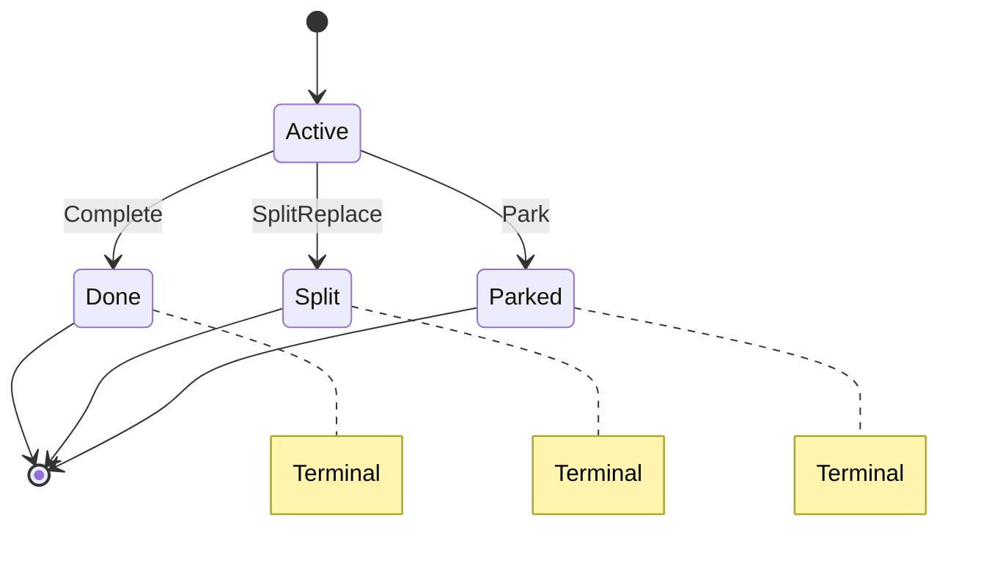
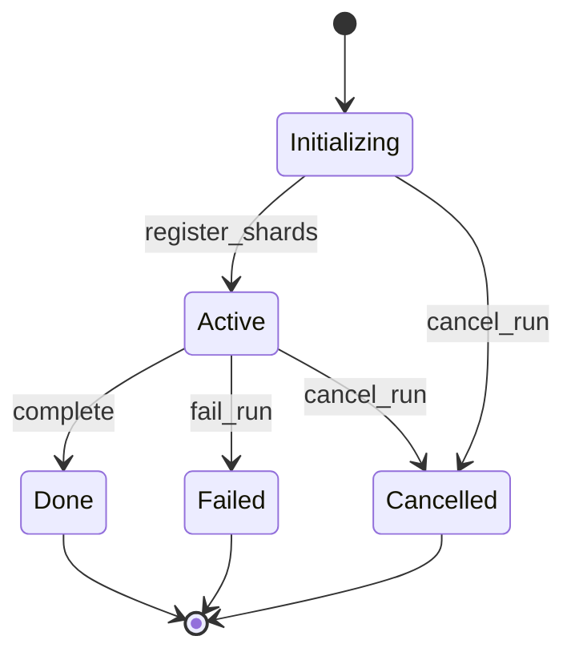

# Two Workers, One Shard -- The Coordination Problem

*It is 3:14 AM. A secret scanner processes shard 7 of a GitHub Enterprise
repository containing 180,000 commits. Worker A has scanned commits
`a0000`..`f3a21` when the Kubernetes scheduler preempts its pod for a
higher-priority job. The coordinator's lease expires. Worker B picks up the
shard and begins scanning from the last checkpoint at `f3a21`. But Worker A's
process has not actually terminated -- its container is draining, and a
background thread flushes its in-memory batch: 47 findings for commits
`e1000`..`f3a21`, the same range Worker B just started re-scanning. The
findings table now contains duplicates. Worse, Worker A's final checkpoint
writes cursor position `f1000` -- behind Worker B's current position `f4b00`
-- regressing the shard's progress by 3,000 commits. The next worker to
acquire this shard will re-scan from `f1000`, producing yet more duplicates.*

*This is the coordination problem.*

---

## Why Coordination Matters

A distributed secret scanner divides work into **shards** -- contiguous ranges
of a data source (repository commits, file trees, API pagination keys). Multiple
workers process shards in parallel. The coordination layer answers three
questions:

1. **Who owns this shard right now?** (Exclusive access)
2. **How far has scanning progressed?** (Cursor position)
3. **Is the shard finished, broken, or still going?** (Lifecycle state)

Getting any of these wrong produces the failure in the opening scenario:
duplicate findings, corrupted cursors, or silently dropped coverage.

The coordination protocol in Gossip-rs is not an afterthought bolted onto a
scanning engine. It is a first-class subsystem with its own type hierarchy,
invariant assertions, and state machine. This chapter introduces its core
data types: `ShardStatus`, `ShardRecord`, `ParkReason`, and the invariant
framework that makes them safe.

---

## ShardStatus -- The Four-State Lifecycle

Every shard is in exactly one of four states. The transitions form a simple
state machine where `Active` is the only non-terminal state:



Here is the definition from `record.rs`:

```rust
#[derive(Clone, Copy, Debug, PartialEq, Eq, Hash)]
#[repr(u8)]
pub enum ShardStatus {
    /// Shard is active and may be acquired by a worker.
    Active = 0,

    /// Shard completed successfully -- all items in its range were scanned.
    Done = 1,

    /// Shard was replaced by children via SplitReplace.
    /// The children collectively cover the parent's key range.
    Split = 2,

    /// Shard halted due to a repeated or permanent error.
    /// Includes a `ParkReason` in the ShardRecord.
    Parked = 3,
}
```

Several things to notice:

**`#[repr(u8)]` with explicit discriminants.** The `u8` values are persisted to
durable storage. The codebase enforces this with compile-time assertions:

```rust
const _: () = assert!(ShardStatus::Active as u8 == 0);
const _: () = assert!(ShardStatus::Done as u8 == 1);
const _: () = assert!(ShardStatus::Split as u8 == 2);
const _: () = assert!(ShardStatus::Parked as u8 == 3);
const _: () = assert!(core::mem::size_of::<ShardStatus>() == 1);
```

If someone accidentally reorders the variants, the build fails. This is a
pattern you will see throughout the coordination layer -- every persisted
enum has companion compile-time assertions guarding its discriminant layout.

**Terminal irreversibility.** The `is_terminal()` method makes the design
intent explicit:

```rust
impl ShardStatus {
    #[inline]
    #[must_use]
    pub const fn is_terminal(self) -> bool {
        matches!(self, Self::Done | Self::Split | Self::Parked)
    }
}
```

**Forward-compatible parsing.** Both `ShardStatus` and `ParkReason` provide
`from_u8(v: u8) -> Option<Self>` methods for deserializing persisted
discriminants. These return `None` for unrecognized values rather than
panicking, enabling forward compatibility -- a newer version of the coordinator
can write a new discriminant that an older reader gracefully ignores:

```rust
impl ShardStatus {
    pub const fn from_u8(v: u8) -> Option<Self> {
        match v {
            0 => Some(Self::Active),
            1 => Some(Self::Done),
            2 => Some(Self::Split),
            3 => Some(Self::Parked),
            _ => None,
        }
    }
}
```

`ParkReason::from_u8` follows the same pattern, mapping 0-4 to its five
variants and returning `None` for any value >= 5. Both enums also provide
`as_u8(self) -> u8` for the reverse direction.

Once a shard reaches `Done`, `Split`, or `Parked`, no protocol operation may
change its status. This is a **safety invariant**, not a convention. The
coordinator enforces it at runtime via `assert_transition_legal()`, which we
will examine shortly.

Why is terminal irreversibility so important? Because it eliminates an entire
class of concurrency bugs. If a shard could transition from `Done` back to
`Active`, a late-arriving message from a terminated worker could resurrect a
completed shard, causing duplicate processing. Terminal states are a
coordination fence: once you cross it, there is no going back within the
protocol.

> **Unparking.** The one exception is the administrative `Parked -> Active`
> transition (unpark), which is explicitly out-of-band: it increments the fence
> epoch and clears the park reason. This is not a protocol transition -- it is
> an operator intervention that creates a new ownership era.

---

## ShardRecord -- The Coordinator's Authoritative State

The `ShardRecord` is the complete coordination state for a single shard. Every
state transition -- acquire, checkpoint, complete, park, split -- is a mutation
of this struct. The coordinator persists it to durable storage after every
transition.

Here is the full struct definition from `record.rs`:

```rust
#[derive(Debug)]
pub struct ShardRecord {
    // -- Identity --
    pub tenant: TenantId,
    pub run: RunId,
    pub shard: ShardId,

    // -- Lifecycle --
    pub status: ShardStatus,
    /// Set when `status == Parked`, `None` otherwise.
    pub park_reason: Option<ParkReason>,

    // -- Coverage and progress (arena-pooled) --
    pub spec: PooledShardSpec,
    pub cursor: PooledCursor,
    pub cursor_semantics: CursorSemantics,

    // -- Lease / ownership --
    /// The current lease holder, or `None` if unleased.
    pub lease: Option<LeaseHolder>,
    /// Monotonically increasing fence epoch. Incremented on every
    /// ownership transfer to fence zombie workers.
    pub fence_epoch: FenceEpoch,

    // -- Lineage --
    /// Parent shard ID, if this shard was created by a split.
    /// `None` for root shards.
    pub parent: Option<ShardId>,
    /// Shards created by this shard via split operations.
    pub spawned: PooledSpawned,

    // -- Idempotency --
    /// Bounded operation log for idempotent replay.
    pub op_log: RingBuffer<OpLogEntry, { ShardRecord::OP_LOG_CAP }>,
}
```

Let us walk through each field group.

### Identity (`tenant`, `run`, `shard`)

Every shard belongs to exactly one tenant and one run. The `TenantId` provides
cross-tenant isolation -- the first check in every validation path ensures the
caller's tenant matches the record's tenant (we will see this in Chapter 2 when
we examine `validate_lease()`). The `RunId` scopes the shard to a specific scan
invocation. The `ShardId` is the shard's unique identifier within the run.

### Lifecycle (`status`, `park_reason`)

The `status` field is the `ShardStatus` enum we just examined. The
`park_reason` field is structurally coupled to it: it is `Some` if and only if
`status == Parked`. This coupling is enforced at runtime by INV-1 (see
invariants below). The type system alone cannot express "this `Option` is `Some`
iff that enum is a particular variant," so the invariant checker fills the gap.

### Coverage and Progress (`spec`, `cursor`, `cursor_semantics`)

The `PooledShardSpec` and `PooledCursor` define what this shard covers and how far
scanning has progressed. These are **arena-pooled** wrappers: instead of storing
variable-length byte fields as `Box<[u8]>` heap allocations, they hold `ByteSlot`
handles into a shared `ByteSlab` arena owned by the coordinator. This design
eliminates per-field `malloc`/`free` calls on the hot checkpoint and acquire paths.

> **Crate boundary:** The contract types that `PooledShardSpec` and `PooledCursor`
> wrap -- `ShardSpec`, `ShardSpecRef`, and `CursorUpdate` -- are defined in the
> `gossip_contracts` crate (`gossip_contracts::coordination::shard_spec` and
> `gossip_contracts::coordination::cursor` respectively). See `record.rs:42-46`
> for the imports. The contracts crate defines the public API shapes; the
> coordination crate stores them in slab-backed pooled representations.

The `CursorSemantics` field indicates whether the cursor represents the last
*completed* item or the last *dispatched* item -- this distinction matters for
exactly-once processing guarantees. We will explore cursors in depth in Chapter 4.

> **Why arena pooling?** Each shard stores 3-5 variable-length byte fields (key
> range endpoints, metadata, cursor last-key, resume token). Without pooling,
> every checkpoint would trigger multiple heap allocations. The `ByteSlab`
> pre-allocates a contiguous buffer at coordinator startup and carves out regions
> via bump-pointer + free-list, turning N heap allocations per shard into N slab
> operations. Accessors return borrowed slices from the slab:
> `fn key_range_start<'a>(&self, slab: &'a ByteSlab) -> &'a [u8]`.

### Lease / Ownership (`lease`, `fence_epoch`)

The `lease` field is an `Option<LeaseHolder>` -- either someone holds this shard
or nobody does. The `fence_epoch` is a monotonically increasing counter that
increments on every ownership transfer. Together, these two fields implement the
fencing protocol that prevents zombie workers. We will examine the full lease
and fencing machinery in Chapter 2.

### Lineage (`parent`, `spawned`)

When a shard is too large, it can be split into children. The `parent` field
records which shard spawned this one (or `None` for root shards). The `spawned`
field is a `PooledSpawned` -- a slab-backed collection that records which
children this shard has produced, storing `ShardId` entries in the coordinator's
`ByteSlab` arena rather than a heap-allocated `Vec`. A `ShardId` encodes
whether it is derived (created by a split) using bit 63 of its underlying
`u64`, and INV-7 and INV-8 enforce consistency between this encoding and the
lineage fields.

### Idempotency (`op_log`)

The op-log is a bounded ring buffer of the last 16 operations performed on this
shard. When a worker retries an operation (network timeout, process restart), the
coordinator looks up the `OpId` in the log and returns the cached result instead
of re-executing. This follows the Stripe idempotency key pattern: every
mutating RPC carries a unique `OpId` and a deterministic `payload_hash`. The
deduplication logic works as follows:

- **Same `(OpId, payload_hash)`**: idempotent replay -- return the cached
  `OpResult` without re-executing.
- **Same `OpId`, different `payload_hash`**: conflict -- reject as
  `OpIdConflict`. The caller reused an idempotency key with different content.
- **`OpId` not found**: new operation -- execute normally, record the entry.

The ring buffer has a capacity of exactly 16 entries (`OP_LOG_CAP`). When full,
the oldest entry is evicted via O(1) overwrite. What happens when a retried
operation's `OpId` has already been evicted? The coordinator treats it as a new
operation. This is safe for three reasons:

1. **Staleness guarantee**: eviction means the `OpId` is at least 16 operations
   old -- well beyond any reasonable retry window.
2. **Convergent transitions**: shard operations converge to the same terminal
   state, so re-executing produces the same result or is rejected by status
   guards.
3. **Primary zombie fence**: `FenceEpoch` (not the op-log) is the primary
   defense against stale workers. The op-log is a secondary defense for
   in-lease retries only.

The lookup is a reverse linear scan -- retries involve the most recent
operations, so searching from newest to oldest finds them sooner:

```rust
pub fn op_log_lookup(&self, op: OpId) -> Option<&OpLogEntry> {
    debug_assert!(self.op_log.len() <= Self::OP_LOG_CAP);
    self.op_log.iter().rev().find(|e| e.op_id() == op)
}
```

This pattern draws from Gray & Cheriton's lease-based caching (SOSP 1989) and
the Stripe idempotency key model, adapted for a bounded in-memory window rather
than a persistent key-value store.

### Visibility: `pub` with Invariant Enforcement

Notice that every field is `pub`, not `pub(crate)` or private. The coordinator
backend directly mutates fields during state transitions. Safety is not enforced
by getter/setter encapsulation -- it is enforced by `assert_invariants()` after
every transition. This is a deliberate "Tiger-style" design choice: allow direct
field access for performance and simplicity, and catch violations immediately
via panicking invariant checks. The invariant checker provides stronger
guarantees than accessor methods could, because it validates *all* inter-field
relationships simultaneously rather than guarding one field at a time.

---

## The Ten Structural Invariants

After every state transition, before persisting, the coordinator calls
`assert_invariants()`. This function checks 10 properties that must hold for
the record to be valid. If any check fails, the coordinator panics -- the
operation is not persisted, and crash-recovery returns the shard to its
pre-operation state.

Note that `assert_invariants` takes a `&ByteSlab` parameter because the lineage
invariants (INV-6 through INV-10) need to access slab-backed `PooledSpawned`
entries:

```rust
pub fn assert_invariants(&self, slab: &ByteSlab) {
    self.assert_lifecycle_invariants();
    self.assert_lineage_invariants(slab);
}
```

The invariants are split into two groups: lifecycle (INV-1 through INV-5) and
lineage (INV-6 through INV-10).

### Lifecycle Invariants

```rust
/// INV-1 through INV-5: status, park_reason, lease, fence, op-log cap.
fn assert_lifecycle_invariants(&self) {
    // INV-1: park_reason consistency.
    match self.status {
        ShardStatus::Parked => {
            assert!(
                self.park_reason.is_some(),
                "Parked shard {:?} must have park_reason",
                self.shard,
            );
        }
        _ => {
            assert!(
                self.park_reason.is_none(),
                "Non-parked shard {:?} (status: {:?}) must not have park_reason",
                self.shard,
                self.status,
            );
        }
    }

    // INV-2: (structural -- `Option<LeaseHolder>` makes paired-ness implicit)

    // INV-3: Terminal shards must not hold a lease.
    if self.status.is_terminal() {
        assert!(
            self.lease.is_none(),
            "Terminal shard {:?} (status: {:?}) must not have a lease",
            self.shard,
            self.status,
        );
    }

    // INV-4: Fence epoch minimum.
    assert!(
        self.fence_epoch >= FenceEpoch::INITIAL,
        "Shard {:?}: fence_epoch must be >= INITIAL (1)",
        self.shard,
    );

    // INV-5: Op-log bounded -- defense-in-depth: RingBuffer enforces capacity
    // structurally, but this assertion catches corruption before persistence.
    assert!(
        self.op_log.len() <= Self::OP_LOG_CAP,
        "Shard {:?}: op_log length {} exceeds cap {}",
        self.shard,
        self.op_log.len(),
        Self::OP_LOG_CAP,
    );
}
```

Let us examine each:

**INV-1: Park reason consistency.** `park_reason.is_some()` if and only if
`status == Parked`. A parked shard without a reason is incoherent -- operators
cannot decide whether to retry, investigate, or escalate. A non-parked shard
with a reason is a data corruption signal.

**INV-2: Lease holder paired-ness.** This invariant is *structural* -- enforced
by the type system rather than runtime checks. The `lease` field is
`Option<LeaseHolder>`, where `LeaseHolder` bundles `owner: WorkerId` and
`deadline: LogicalTime` into a single value. There is no way to have an owner
without a deadline or vice versa. This eliminates the class of bugs where one
half of a lease is updated but the other is not.

**INV-3: Terminal shards have no lease.** When a shard reaches `Done`, `Split`,
or `Parked`, its lease is released. A terminal shard holding a lease means a
transition failed to clean up properly -- a bug in the coordinator logic.

**INV-4: Fence epoch minimum.** The fence epoch must be at least
`FenceEpoch::INITIAL` (value 1). `FenceEpoch::ZERO` is reserved as a sentinel
meaning "no epoch assigned." A zero epoch in a constructed record means the
constructor forgot to initialize it.

**INV-5: Op-log bounded.** The op-log must never exceed `OP_LOG_CAP` (16)
entries. The `RingBuffer` enforces this structurally, but the assertion provides
defense-in-depth: if the ring buffer implementation has a bug, the invariant
checker catches it before corrupt data reaches storage.

### Lineage Invariants

```rust
/// INV-6 through INV-10: split/spawned, parent/derived (biconditional),
/// op-log uniqueness, spawned cap.
fn assert_lineage_invariants(&self, slab: &ByteSlab) {
    // INV-6: Split implies spawned is non-empty.
    if self.status == ShardStatus::Split {
        assert!(
            !self.spawned.is_empty(),
            "Split shard {:?} must have spawned children",
            self.shard,
        );
    }

    // INV-7: parent.is_some() iff shard.is_derived().
    if self.parent.is_some() {
        assert!(
            self.shard.is_derived(),
            "Shard {:?} claims parentage but is not derived (bit 63 not set)",
            self.shard,
        );
    }
    if self.shard.is_derived() {
        assert!(
            self.parent.is_some(),
            "Shard {:?}: derived (bit 63 set) but has no parent",
            self.shard,
        );
    }

    // INV-8: All spawned entries must be derived.
    for (i, spawned_id) in self.spawned.iter(slab).enumerate() {
        assert!(
            spawned_id.is_derived(),
            "Shard {:?}: spawned[{i}] ({:?}) is not derived (bit 63 not set)",
            self.shard,
            spawned_id,
        );
    }

    // INV-9: Op-log entries have unique OpId values.
    for i in 0..self.op_log.len() {
        let a = self.op_log.get(i).unwrap();
        for j in (i + 1)..self.op_log.len() {
            let b = self.op_log.get(j).unwrap();
            assert!(
                a.op_id() != b.op_id(),
                "Shard {:?}: duplicate OpId {:?} in op_log at indices {i} and {j}",
                self.shard,
                a.op_id(),
            );
        }
    }

    // INV-10: Spawned count bounded.
    assert!(
        self.spawned.len() <= MAX_SPAWNED_PER_SHARD,
        "Shard {:?}: spawned count {} exceeds cap {}",
        self.shard,
        self.spawned.len(),
        MAX_SPAWNED_PER_SHARD,
    );
}
```

**INV-6: Split implies children.** If a shard's status is `Split`, its
`spawned` collection must be non-empty. A split without children means coverage was
lost -- the parent's key range is no longer being processed by anyone.

**INV-7: Parent/derived biconditional.** The `ShardId` type encodes whether a
shard was created by a split: bit 63 of the underlying `u64` is set for derived
(split-child) shards. INV-7 enforces that this encoding is consistent with the
`parent` field. If a shard claims to have a parent, its ID must have bit 63 set.
If its ID has bit 63 set, it must have a parent. This is a biconditional -- both
directions are checked.

**INV-8: Spawned entries are derived.** Every entry in the `spawned` collection
must be a derived shard (bit 63 set). Root shards cannot appear as children of a
split. Note the `slab` parameter passed to `self.spawned.iter(slab)` --
`PooledSpawned` stores its `ShardId` entries in the coordinator's `ByteSlab`,
so iteration requires the slab reference to read the data.

**INV-9: Op-log uniqueness.** No two entries in the op-log may share the same
`OpId`. This is an O(n^2) check where n <= 16, so at most 120 comparisons --
negligible compared to the cost of persisting the record.

**INV-10: Spawned count bounded.** The `spawned` collection must not exceed
`MAX_SPAWNED_PER_SHARD` (1024). This prevents a pathological split cascade from
producing an unbounded number of children.

### The Non-Panicking Counterpart

In addition to `assert_invariants()`, the `ShardRecord` provides
`validate_invariants(&self, slab: &ByteSlab) -> Result<(), String>` -- the same
10 checks, but returning `Err(message)` instead of panicking. This exists for
contexts where panicking is not possible or not desired (e.g., `panic=abort`
builds, testing frameworks that need to inspect the error). Both functions check
the identical set of invariants; the panicking version is used in production
code paths, and the non-panicking version is available for diagnostic tooling.

### Invariant Summary Table

| INV | Property | Type | What It Prevents |
|-----|----------|------|------------------|
| 1 | `park_reason` iff `Parked` | Runtime | Incoherent park metadata |
| 2 | Lease holder paired-ness | Structural | Half-updated lease state |
| 3 | Terminal => no lease | Runtime | Zombie leases on dead shards |
| 4 | `fence_epoch >= INITIAL` | Runtime | Uninitialized fence sentinels |
| 5 | `op_log.len() <= 16` | Defense-in-depth | Ring buffer corruption |
| 6 | `Split` => spawned non-empty | Runtime | Coverage loss on split |
| 7 | `parent` iff `is_derived()` | Runtime | Lineage/ID inconsistency |
| 8 | All spawned are derived | Runtime | Root shards as split children |
| 9 | Unique OpIds in op-log | Runtime | Idempotency key collision |
| 10 | `spawned.len() <= 1024` | Runtime | Unbounded split cascades |

---

## `assert_transition_legal()` -- The State Machine Guard

Before any status change, the coordinator calls `assert_transition_legal()` to
verify that the transition is valid:

```rust
pub fn assert_transition_legal(&self, new_status: ShardStatus) {
    assert!(
        !self.status.is_terminal() || self.status == new_status,
        "Shard {:?}: illegal transition from terminal {:?} to {:?}",
        self.shard,
        self.status,
        new_status,
    );
}
```

The logic is compact: if the current status is terminal, the only allowed
"transition" is to the same status (a no-op). If the current status is not
terminal (i.e., `Active`), any target is allowed. This means:

- `Active -> Done`: legal
- `Active -> Split`: legal
- `Active -> Parked`: legal
- `Done -> Done`: legal (no-op)
- `Done -> Active`: **panic**
- `Parked -> Done`: **panic**
- `Split -> Active`: **panic**

The elegance of this check is that it does not enumerate the valid transitions.
It states the invariant directly: *terminal states are absorbing*. Any new
status added in the future automatically obeys this rule.

---

## Crash-to-Prevent-Corruption Philosophy

You may have noticed that every invariant violation results in a `panic!`. This
is not a failure of error handling -- it is the *intended* recovery strategy.

The reasoning works as follows:

1. The coordinator performs a state transition (e.g., checkpoint, complete).
2. Before persisting, it calls `assert_invariants()`.
3. If any invariant is violated, the coordinator panics.
4. Because the panic happens *before* persistence, the operation is not written
   to durable storage.
5. On crash-recovery (process restart), the coordinator reads the last
   persisted state, which is the pre-operation state -- valid by induction.

This is the classic crash-recovery pattern: the process is a stateless function
from durable state to durable state. If any intermediate computation produces an
invalid state, crashing is safe because the durable state is untouched.

The alternative -- returning `Err` and continuing -- would leave the
coordinator's in-memory state inconsistent. Subsequent operations on the corrupt
record could produce cascading errors or, worse, silently persist corrupt data.
Panicking is the conservative choice: it sacrifices availability (the
coordinator process dies) to preserve safety (no corrupt data reaches storage).

As the doc comment states:

> Panicking is the intentional recovery strategy. An invariant violation means
> the coordinator's in-memory state is inconsistent with its design contract --
> continuing would risk persisting corrupt data.

**Operational guidance:** Invariant panics should be treated as critical bugs.
The shard's durable state is safe (the failing operation was not persisted), but
the root cause must be investigated.

---

## RunRecord and RunStatus -- The Scan-Level Container

While `ShardRecord` tracks individual shards, `RunRecord` tracks the scan as a
whole. A "run" is a single scan invocation that groups a set of shards covering
a data source.

```rust
pub enum RunStatus {
    Initializing = 0,
    Active = 1,
    Done = 2,
    Failed = 3,
    Cancelled = 4,
}
```

The run lifecycle is:



A run starts in `Initializing` -- it exists but has no shards yet. Once shards
are registered via `register_shards`, it transitions to `Active`. From `Active`,
the run can reach one of three terminal states: `Done` (all shards completed),
`Failed` (unrecoverable error), or `Cancelled` (operator intervention). Like
shard statuses, run terminal states are irreversible.

The `RunRecord` itself mirrors the `ShardRecord` pattern:

```rust
pub struct RunRecord {
    pub tenant: TenantId,
    pub run: RunId,
    pub config: RunConfig,
    pub status: RunStatus,
    pub created_at: LogicalTime,
    pub completed_at: Option<LogicalTime>,
    pub root_shards: Vec<ShardId>,
    pub op_log: RingBuffer<RunOpLogEntry, { RunRecord::OP_LOG_CAP }>,
}
```

It carries its own idempotency op-log (capped at 8 entries), its own invariant
assertions, and the same `pub` visibility model. The run is the
administrative container; the shard is where the real coordination complexity
lives.

---

## ParkReason -- Why a Shard Stopped

When a shard transitions to `Parked`, it must carry a reason. The five variants
capture coordination-level categories:

```rust
#[derive(Clone, Copy, Debug, PartialEq, Eq, Hash)]
#[repr(u8)]
pub enum ParkReason {
    /// The connector lacks permission to access the scan target.
    PermissionDenied = 0,

    /// The scan target no longer exists (deleted repo, removed file).
    NotFound = 1,

    /// The shard's state or data is internally inconsistent.
    Poisoned = 2,

    /// Too many transient errors accumulated during processing.
    TooManyErrors = 3,

    /// Catch-all for reasons not covered by other variants.
    Other = 4,
}
```

These are not detailed error descriptions -- they are *coordination decisions*
that affect what happens next:

| Variant | Operational Meaning | Auto-Retry? |
|---------|---------------------|-------------|
| `PermissionDenied` | Credential rotation or access grant needed | No -- requires external action |
| `NotFound` | Target deleted; verify existence before unpark | No -- likely permanent |
| `Poisoned` | Internal inconsistency; manual investigation required | No -- manual fix needed |
| `TooManyErrors` | Transient failures accumulated; may self-heal | Yes -- suitable for time-delayed retry |
| `Other` | Catch-all; additional context logged separately | Depends on context |

The distinction between `PermissionDenied` and `TooManyErrors` is operationally
significant. A shard parked with `TooManyErrors` might be automatically retried
after a cooldown period -- the errors were transient (API rate limits, temporary
network issues) and may have resolved. A shard parked with `PermissionDenied`
should not be retried until someone verifies that the access grant has been
restored.

Like `ShardStatus`, `ParkReason` uses `#[repr(u8)]` with compile-time
discriminant assertions to ensure persistence stability.

---

## Putting It Together: Construction and the Invariant Call Chain

To see how all these pieces interact, look at how a root shard record is
constructed. The primary constructor `new_active_with_cursor` accepts borrowed
views (`ShardSpecRef<'_>` and `CursorUpdate<'_>`) and copies their bytes into
the coordinator's slab:

```rust
pub fn new_active_with_cursor(
    tenant: TenantId,
    run: RunId,
    shard: ShardId,
    spec: ShardSpecRef<'_>,
    initial_cursor: CursorUpdate<'_>,
    cursor_semantics: CursorSemantics,
    slab: &mut ByteSlab,
) -> Result<Self, SlabFull> {
    let pooled_spec = PooledShardSpec::from_spec_ref(spec, slab)?;
    let pooled_cursor = match PooledCursor::from_update(&initial_cursor, slab) {
        Ok(cursor) => cursor,
        Err(err) => {
            pooled_spec.deallocate(slab);
            return Err(err);
        }
    };
    let record = Self {
        tenant,
        run,
        shard,
        status: ShardStatus::Active,
        park_reason: None,
        spec: pooled_spec,
        cursor: pooled_cursor,
        cursor_semantics,
        lease: None,
        fence_epoch: FenceEpoch::INITIAL,
        parent: None,
        spawned: PooledSpawned::new(),
        op_log: RingBuffer::new(),
    };
    record.assert_invariants(slab);
    Ok(record)
}
```

The constructor allocates the spec's byte fields into the slab, sets the initial
state, and then immediately calls `assert_invariants(slab)`. If the slab is
full, it returns `SlabFull` before any state is created. If the initial state is
somehow invalid (a programming error), the coordinator panics before the record
can be used. Note the rollback on cursor allocation failure -- if the cursor's
slab allocation fails after the spec was already allocated, the spec is
deallocated before returning the error (strong exception guarantee). This
pattern -- *allocate, construct, assert, return* -- appears in every constructor
and every state transition method.

For split children, the pattern is the same but with lineage fields populated:

```rust
pub fn new_split_child(
    tenant: TenantId,
    run: RunId,
    shard: ShardId,
    spec: ShardSpecRef<'_>,
    cursor: CursorUpdate<'_>,
    cursor_semantics: CursorSemantics,
    parent: ShardId,
    slab: &mut ByteSlab,
) -> Result<Self, SlabFull> {
    let pooled_spec = PooledShardSpec::from_spec_ref(spec, slab)?;
    let pooled_cursor = match PooledCursor::from_update(&cursor, slab) {
        Ok(c) => c,
        Err(e) => {
            pooled_spec.deallocate(slab);
            return Err(e);
        }
    };
    let record = Self {
        tenant,
        run,
        shard,
        status: ShardStatus::Active,
        park_reason: None,
        spec: pooled_spec,
        cursor: pooled_cursor,
        cursor_semantics,
        lease: None,
        fence_epoch: FenceEpoch::INITIAL,
        parent: Some(parent),
        spawned: PooledSpawned::new(),
        op_log: RingBuffer::new(),
    };
    record.assert_invariants(slab);
    Ok(record)
}
```

Notice that `parent` is `Some(parent)` and `shard` must satisfy
`shard.is_derived()` (bit 63 set) -- otherwise INV-7 fires and the constructor
panics.

---

## ShardSnapshotView -- The Worker's View

Not every consumer of shard state needs the full `ShardRecord`. Workers need to
know what to scan and where to resume, but they should not see coordination
internals like the op-log, fence epoch, or tenant identity. The
`ShardSnapshotView<'a>` type provides this filtered, borrowed view:

> **Crate location:** `ShardSnapshotView` is defined in `error.rs`
> (`crate::error::ShardSnapshotView`), not in `record.rs`. The `record.rs`
> module doc header references it as `crate::error::ShardSnapshotView`. It lives
> in `error.rs` because it is part of the acquire result / error boundary types,
> not the authoritative coordinator record.

```rust
#[derive(Clone, Copy, Debug, PartialEq, Eq)]
pub struct ShardSnapshotView<'a> {
    status: ShardStatus,
    spec: ShardSpecRef<'a>,
    cursor: CursorUpdate<'a>,
    cursor_semantics: CursorSemantics,
    parent: Option<ShardId>,
    spawned: &'a [ShardId],
}
```

The snapshot is entirely allocation-free. Instead of materializing owned
`ShardSpec` and `Cursor` values from the slab (which would require heap
allocations), `ShardSnapshotView` borrows slices directly from the coordinator's
`AcquireScratch` buffer -- a pre-allocated, reusable scratch space. The `'a`
lifetime ties the snapshot to that scratch buffer, ensuring it is consumed before
the buffer is reused.

The `spec` field is a `ShardSpecRef<'a>` -- a borrowed view of the key range
and metadata. The `cursor` field is a `CursorUpdate<'a>` with borrowed
`Option<&'a [u8]>` fields for `last_key` and `token`, avoiding any per-acquire
heap allocation. The `spawned` field borrows a `&'a [ShardId]` slice rather than
owning a collection.

What is excluded from the snapshot is as important as what is included. The
snapshot does not contain `tenant`, `run`, or `shard` (the worker already knows
its own identity from the acquire call). It does not contain `lease`,
`fence_epoch`, or `op_log` (the worker receives lease information from the
`Lease` return value, and the op-log is coordinator-internal). It does not
contain `park_reason` (parked shards are not acquired, so workers never see
them). This minimality is intentional: the snapshot is the information boundary
between the coordinator and the worker. Anything the worker does not need to
know stays on the coordinator side.

---

## Supporting Modules: Events, Run Errors, and Session

The coordination crate contains several supporting modules not covered in detail
in this chapter but worth noting for orientation:

### `events.rs` -- State Transition Events

The `events.rs` module (`crates/gossip-coordination/src/events.rs`) defines the
event vocabulary for coordination operations. Events are **pure data** -- the
coordination layer never acts on them. Side effects (metrics, notifications,
dashboards) are the caller's responsibility.

Each event is a `StateTransitionEvent` envelope carrying `(TenantId, RunId,
LogicalTime, EventKind)`. The `EventKind` enum has variants for every shard
operation (`ShardAcquired`, `ShardCheckpointed`, `ShardCompleted`,
`ShardParked`, `ShardSplit`, `ShardResidualCreated`, `ShardUnparked`,
`ShardLeaseRenewed`) and run lifecycle events (`RunCreated`, `RunActivated`,
`RunCompleted`, `RunFailed`, `RunCancelled`).

Events are collected via `EventCollector`, a reusable accumulator with optional
max-capacity bounds. The core `CoordinationBackend` trait does **not** take an
`EventCollector` -- events are an optional extension via planned `_with_events`
companion methods.

A security note: the `ShardCheckpointed` variant contains `RedactedKey`, which
wraps key bytes with a `Debug` impl that shows byte length instead of contents
(e.g., `Some(<15 bytes>)`). `EventKind` intentionally does not derive
`Serialize` to prevent accidental key material leakage.

### `run_errors.rs` -- Run-Level Error Types

The `run_errors.rs` module (`crates/gossip-coordination/src/run_errors.rs`)
defines per-operation error types for run-level operations: `CreateRunError`,
`RegisterShardsError`, `GetRunError`, `RunTransitionError`, and `UnparkError`.
These follow the same conventions as shard-level errors (`#[non_exhaustive]`,
custom `Debug` for hash redaction, no `actual` field in `TenantMismatch`) but
differ in composition: shard-level errors share a `CoordError` base, while
run-level errors are per-operation with shared `From<RunOpIdConflict>` impls.

### `session.rs` -- Worker Session Wrapper

The `session.rs` module provides `WorkerSession`, an ergonomic wrapper covered
in [Chapter 4, Section 4.12](./04-acquiring-and-scanning.md#412-workersession----ergonomic-session-wrapper).

---

## What Comes Next

We now have the vocabulary to describe shard state. But we have not yet
addressed the fundamental question from the opening scenario: how does the
coordinator prevent two workers from mutating the same shard simultaneously?

The answer involves two mechanisms that work in tandem:

- **Leases**: time-bounded exclusive access tokens
- **Fence epochs**: monotonically increasing counters that invalidate stale leases

In [Chapter 2: "The Zombie Worker"](./02-leases-and-fencing.md), we will see
how a GC pause can create a zombie worker, and how the `validate_lease()`
function's 5-check validation chain catches it before any state corruption
occurs. We will also see why the checks are ordered the way they are -- and why
getting that order wrong could leak information across tenants.

Later, in Chapter 4, we will see how cursors enforce monotonic progress and how
the `CursorSemantics` field determines the exactly-once processing guarantee.

---

## Key Takeaways

1. **Four states, one non-terminal.** `Active` is the only state from which
   transitions originate. `Done`, `Split`, and `Parked` are absorbing states
   within the protocol.

2. **Invariants over encapsulation.** Fields are `pub` with runtime
   invariant checking, not private with accessor methods. This is the
   "Tiger-style" pattern: direct field access with panicking post-condition
   checks provides stronger overall guarantees through comprehensive runtime
   assertions than accessor methods alone.

3. **Crash-to-prevent-corruption.** Invariant violations trigger panics *before*
   persistence. The durable state is always the last valid state.

4. **Lineage is encoded in the ID.** Bit 63 of `ShardId` marks derived shards.
   The invariant checker enforces consistency between this bit and the `parent`
   field.

5. **Idempotency is built in.** The op-log is not an afterthought -- it is a
   first-class field of `ShardRecord` with its own invariants (uniqueness,
   bounded capacity).

---

## References

- Gray, C. and Cheriton, D. "Leases: An Efficient Fault-Tolerant Mechanism for
  Distributed File Cache Consistency." *Proceedings of the Twelfth ACM Symposium
  on Operating Systems Principles (SOSP)*, 1989.
- Stripe. "Idempotent Requests." *Stripe API Documentation*.
  https://stripe.com/docs/api/idempotent_requests
