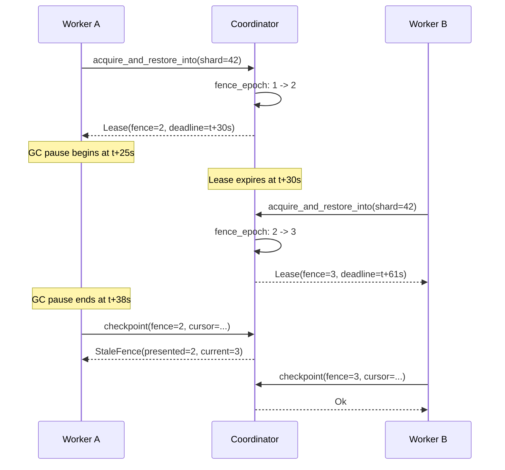

# The Zombie Worker -- Leases and Fencing

*Worker A acquires shard 42 with a 30-second lease. It begins scanning a large
repository, processing commits one page at a time. At second 25, the JVM
running Worker A triggers a full garbage collection pause. The worker thread
freezes. The GC completes at second 38 -- eight seconds after the lease expired.
Worker A's code resumes from exactly where it paused. It has no idea that time
passed. It calls `checkpoint()` to save its progress. Meanwhile, Worker B
acquired shard 42 at second 31 and has been scanning for seven seconds. If
Worker A's checkpoint succeeds, it will overwrite Worker B's cursor position
with a stale value, regressing the shard's progress.*

*The question is: how does Worker A know its lease expired, when the very
mechanism that caused the expiry (the GC pause) also prevented it from
observing the passage of time?*

*The answer: it does not need to know. The coordinator knows.*

---

## The Zombie Problem

A "zombie worker" is a process that holds an expired lease but continues
operating as if it still has exclusive access. Zombies arise from any situation
where a worker's execution is suspended while time continues advancing:

- **GC pauses** (Java, Go, .NET) -- the runtime stops all application threads
- **Network partitions** -- the worker is alive but cannot reach the coordinator
- **Process scheduling** -- the OS deprioritizes the worker's threads
- **Page faults** -- swapping pauses the process for disk I/O

The dangerous property of all these scenarios is that the worker cannot
distinguish "I was paused for 10 seconds" from "no time passed." When execution
resumes, the worker's local state (including its cached lease) appears valid
from its own perspective.

Leases alone do not solve this problem. If validation were purely client-side
("check if my lease has expired before sending a request"), a zombie could pass
its own check -- it does not know it was paused. This is why the fencing
protocol is *coordinator-side*: the coordinator rejects stale operations
regardless of what the worker believes about its own lease.

---

## LeaseHolder -- The Coordinator-Side Record

When a worker acquires a shard, the coordinator records who owns it and when the
lease expires. This is the `LeaseHolder` type from `lease.rs`:

```rust
#[derive(Clone, Copy, Debug, PartialEq, Eq)]
pub struct LeaseHolder {
    owner: WorkerId,
    deadline: LogicalTime,
}

impl LeaseHolder {
    #[must_use]
    pub fn new(owner: WorkerId, deadline: LogicalTime) -> Self {
        assert!(
            deadline > LogicalTime::ZERO,
            "LeaseHolder deadline must be non-zero"
        );
        Self { owner, deadline }
    }

    #[inline]
    #[must_use]
    pub fn owner(&self) -> WorkerId {
        self.owner
    }

    #[inline]
    #[must_use]
    pub fn deadline(&self) -> LogicalTime {
        self.deadline
    }
}
```

The critical design decision is that `LeaseHolder` bundles `owner` and
`deadline` into a single value stored as `Option<LeaseHolder>` in the
`ShardRecord`. This makes the "both-present-or-both-absent" invariant
structurally impossible to violate -- there is no way to set an owner without a
deadline or a deadline without an owner. This is INV-2 from the previous
chapter, enforced by the type system rather than runtime assertions.

Compare this with the alternative: two separate fields `owner: Option<WorkerId>`
and `deadline: Option<LogicalTime>`. Now every code path that sets one must
remember to set the other. Every code path that clears one must clear the other.
A single missed update produces a record where one is `Some` and the other is
`None` -- a state that has no valid interpretation but silently corrupts
subsequent logic.

The `Option<LeaseHolder>` approach eliminates this entire class of bugs. The
shard is either leased (one `LeaseHolder` with both fields) or unleased
(`None`). There is no third state.

---

## Lease -- The Worker-Side Capability Token

When the coordinator grants a lease, it returns a `Lease` to the worker. The
worker presents this token on every subsequent mutation (checkpoint, complete,
park, split). The coordinator validates the token against the shard record's
current state.

Here is the full struct and constructor from `lease.rs`:

```rust
#[must_use = "discarding a Lease wastes the shard's availability window until expiry"]
#[derive(Clone, Copy, Debug, PartialEq, Eq)]
pub struct Lease {
    tenant: TenantId,
    run: RunId,
    shard: ShardId,
    owner: WorkerId,
    fence: FenceEpoch,
    deadline: LogicalTime,
}

impl Lease {
    pub fn new(
        tenant: TenantId,
        run: RunId,
        shard: ShardId,
        owner: WorkerId,
        fence: FenceEpoch,
        deadline: LogicalTime,
    ) -> Self {
        assert!(
            fence >= FenceEpoch::INITIAL,
            "Lease fence epoch must be >= INITIAL (1), got {fence:?}",
        );
        assert!(
            deadline > LogicalTime::ZERO,
            "Lease deadline must be > ZERO, got {deadline:?}",
        );
        Self {
            tenant,
            run,
            shard,
            owner,
            fence,
            deadline,
        }
    }
}
```

Several design decisions are worth noting:

### `pub` Constructor with Structural Constraints

The constructor is `pub` -- it can be called from outside the crate. However,
workers cannot *forge* useful leases in practice: the coordinator validates the
embedded `FenceEpoch` against the shard record's current epoch on every
mutation, so a lease constructed with an incorrect epoch is immediately rejected.
The public accessors (`tenant()`, `run()`, `shard()`, `owner()`, `fence()`,
`deadline()`) are read-only.

The security model relies on the fencing protocol rather than visibility
restrictions. Even if a caller constructs a `Lease` with an arbitrary
`FenceEpoch`, the coordinator's `validate_lease()` check rejects any mutation
where the presented epoch does not match the record's current epoch. The only
way to obtain a *valid* lease is through the coordinator's
`acquire_and_restore_into` path, which increments the fence epoch and records
the new lease holder.

### `#[must_use]` Annotation

The `#[must_use]` annotation on the struct means the compiler warns if a caller
discards a `Lease` without using it. The message explains why:

> "discarding a Lease wastes the shard's availability window until expiry"

If a worker acquires a shard, receives a lease, and then drops it without doing
any work, the shard sits idle until the lease expires and another worker can
claim it. The `#[must_use]` annotation turns this operational mistake into a
compiler warning.

### Constructor Assertions

The constructor asserts two preconditions:

1. `fence >= FenceEpoch::INITIAL` -- A zero fence epoch is a sentinel meaning
   "not initialized." A lease with epoch 0 would bypass fencing checks.
2. `deadline > LogicalTime::ZERO` -- A zero deadline would make the lease
   instantly expired, which is never a valid state.

These are not protocol errors (the coordinator should never produce such
values) -- they are developer safety nets. If the coordinator's acquire logic
has a bug, the `Lease` constructor catches it immediately rather than allowing
a corrupt token to propagate through the system.

### Lease Renewal

The `Lease` type also supports deadline extension via `set_deadline()`:

```rust
pub fn set_deadline(&mut self, deadline: LogicalTime) {
    assert!(
        deadline > LogicalTime::ZERO,
        "Lease deadline must be > ZERO, got {deadline:?}",
    );
    assert!(
        deadline >= self.deadline,
        "set_deadline: new deadline {deadline:?} must be >= current {:?}",
        self.deadline,
    );
    self.deadline = deadline;
}
```

Notice that `set_deadline` is also `pub` -- but workers cannot *usefully*
extend their own deadlines because the coordinator validates the embedded
`FenceEpoch` and owner on every mutation. The fence epoch is **not** changed.
This is the key distinction between *renewal* and *re-acquisition*:

| Operation | Fence Epoch | Deadline | Meaning |
|-----------|-------------|----------|---------|
| Renewal | Unchanged | Extended | Same owner, more time |
| Re-acquisition | Incremented | New | New owner (or same owner, new era) |

Renewal is a lightweight operation: the same worker continues with the same
fence epoch, just with more time. Re-acquisition creates a new ownership era
that invalidates all previous leases for this shard.

Note the `>=` (greater-or-equal) check on the deadline: equal deadlines are
allowed as a harmless no-op when a same-tick duplicate renewal occurs. This is
a robustness choice -- rejecting same-tick renewals would create spurious
failures under high-frequency renewal patterns.

---

## FenceEpoch -- The Primary Defense Against Zombies

The `FenceEpoch` is a monotonically increasing `u64` counter stored on both the
shard record (coordinator-side) and the lease (worker-side). Every time a shard
is acquired via `acquire_and_restore_into`, the coordinator increments the epoch:

```rust
pub fn advance_fence(&mut self) -> FenceEpoch {
    self.fence_epoch = self.fence_epoch.increment();
    self.fence_epoch
}
```

The `increment()` method on `FenceEpoch`:

```rust
pub fn increment(&self) -> Self {
    Self(
        self.0
            .checked_add(1)
            .expect("FenceEpoch overflow at u64::MAX"),
    )
}
```

This is the primary zombie defense. Here is how it works in the zombie scenario
from the opening:

```
Timeline:
  t=0   Worker A acquires shard 42, fence_epoch=1 -> 2
  t=25  Worker A enters GC pause (frozen, holding lease with fence=2)
  t=30  Lease expires (deadline reached)
  t=31  Worker B acquires shard 42, fence_epoch=2 -> 3
  t=38  Worker A resumes, calls checkpoint with fence=2
  t=38  Coordinator rejects: presented fence (2) != current fence (3)
```

Worker A's lease carries `fence=2`, but the record now has `fence_epoch=3`. The
mismatch is detected instantly -- no timing ambiguity, no clock comparison. The
fence epoch is an integer comparison, not a time comparison.

This is why `FenceEpoch` is the **primary** defense and the lease deadline is
**secondary**. The deadline determines *when* a shard becomes available for
re-acquisition. The fence epoch determines *whether* a mutation is accepted.
Even if clocks are skewed or the deadline check has an off-by-one error, the
fence epoch still catches zombies.

The two constants define the epoch space:

- `FenceEpoch::ZERO` (value 0): Sentinel, never appears in a live shard or
  lease. Used to indicate "no epoch assigned."
- `FenceEpoch::INITIAL` (value 1): The first valid epoch. Every new shard
  starts at `INITIAL`.

---

## Which Operations Are Lease-Gated?

Not every operation on a shard requires a lease. The `OpKind` enum defines the
full vocabulary of shard mutations:

```rust
pub enum OpKind {
    Checkpoint    = 0,  // Advance cursor         -- lease required
    Complete      = 1,  // Active -> Done          -- lease required
    Park          = 2,  // Active -> Parked        -- lease required
    SplitReplace  = 3,  // Active -> Split         -- lease required
    SplitResidual = 4,  // Shrink range + residual -- lease required
    Unpark        = 5,  // Parked -> Active (admin) -- NO lease required
}
```

Five of the six variants are **lease-gated**: the calling worker must present a
valid `Lease` that passes the 5-check validation chain. The exception is
`Unpark`, which is an administrative operation. The coordinator may unpark a
shard without the worker that originally parked it being involved. Unparking
increments the fence epoch and clears the park reason -- it creates a new
ownership era, just like an acquisition.

Each `OpKind` participates in the idempotency op-log. When a mutation is
executed, the coordinator records an `OpLogEntry` containing the `OpId`,
`OpKind`, the `OpResult` (Completed, Error, or Superseded), a deterministic
`payload_hash`, and the `executed_at` logical time. On retry, the coordinator
matches the `OpId` and `payload_hash` to return the cached result.

The `OpResult` enum captures three possible outcomes:

- **`Completed`**: The operation succeeded and the shard record was mutated.
- **`Error`**: The operation failed validation; the shard record was not changed.
  On retry, the same failure is returned without re-validating.
- **`Superseded`**: The operation was valid when submitted but has been overtaken
  by a later mutation (e.g., a checkpoint whose cursor was already advanced past
  by a subsequent checkpoint). The shard's state is consistent, but this specific
  mutation had no visible effect.

---

## `validate_lease()` -- The 5-Check Validation Chain

Every lease-gated mutation (checkpoint, complete, park, split) calls
`validate_lease()` before modifying any state. This function implements five
checks in a specific priority order. The ordering is not arbitrary -- it is
designed to prevent information leakage across security boundaries.

Here is the complete implementation from `validation.rs`:

```rust
pub fn validate_lease(
    now: LogicalTime,
    tenant: TenantId,
    lease: &Lease,
    record: &ShardRecord,
) -> Result<(), CoordError> {
    // Precondition: time must be positive.
    assert!(
        now > LogicalTime::ZERO,
        "validate_lease: now must be > ZERO"
    );

    // 1. Tenant isolation (no `actual` field -- prevents cross-tenant enumeration).
    if record.tenant != tenant {
        return Err(CoordError::TenantMismatch { expected: tenant });
    }

    // 2. Terminal status.
    if record.status.is_terminal() {
        return Err(CoordError::ShardTerminal {
            shard: ShardKey::new(record.run, record.shard),
            status: record.status,
        });
    }

    // 3. Fence epoch.
    if lease.fence() != record.fence_epoch {
        return Err(CoordError::StaleFence {
            presented: lease.fence(),
            current: record.fence_epoch,
        });
    }

    // 4. Lease expiry.
    let Some(deadline) = record.lease_deadline() else {
        return Err(CoordError::StaleFence {
            presented: lease.fence(),
            current: record.fence_epoch,
        });
    };
    if now >= deadline {
        return Err(CoordError::LeaseExpired { deadline, now });
    }

    // 5. Owner divergence.
    if record.lease_owner() != Some(lease.owner()) {
        return Err(CoordError::StaleFence {
            presented: lease.fence(),
            current: record.fence_epoch,
        });
    }

    Ok(())
}
```

Let us examine each check in detail.

### Check 1: Tenant Isolation (Security-First)

```rust
if record.tenant != tenant {
    return Err(CoordError::TenantMismatch { expected: tenant });
}
```

This check is first because it is a **security boundary**. In a multi-tenant
system, a request from Tenant A must never learn anything about Tenant B's
shards. If the tenant check were performed after, say, the terminal status
check, an attacker could probe whether a shard exists and what state it is in
by observing which error they receive.

Consider what happens if checks 1 and 2 were swapped:

- Request from Tenant A for Tenant B's shard (which is `Done`): returns
  `ShardTerminal` -- leaks that the shard exists and is terminal.
- Request from Tenant A for Tenant B's shard (which is `Active`): returns
  `TenantMismatch` -- reveals that the shard is not terminal.

By checking tenant first, Tenant A always gets `TenantMismatch` regardless of
the shard's actual state. No information leaks.

Notice also that the error is `TenantMismatch { expected: tenant }` -- it
includes the *expected* tenant (the caller's own tenant) but not the *actual*
tenant (the record's tenant). Including the actual tenant would leak it to the
caller.

### Check 2: Terminal Status (Fast Rejection)

```rust
if record.status.is_terminal() {
    return Err(CoordError::ShardTerminal {
        shard: ShardKey::new(record.run, record.shard),
        status: record.status,
    });
}
```

Terminal shards reject all mutations. This is a fast path: if the shard is
`Done`, `Split`, or `Parked`, there is no point checking the lease -- the
answer is always "no."

### Check 3: Fence Epoch (Zombie Fencing)

```rust
if lease.fence() != record.fence_epoch {
    return Err(CoordError::StaleFence {
        presented: lease.fence(),
        current: record.fence_epoch,
    });
}
```

This is the primary zombie defense. If the worker's fence epoch does not match
the record's current epoch, the worker is using a stale lease -- either from a
previous acquisition or from before an administrative unpark. The error includes
both the presented and current epochs for diagnostic purposes.

Note: this is an *equality* check, not a less-than check. The fence epoch must
match exactly. If the presented epoch is somehow *higher* than the current epoch,
something is seriously wrong (a forged lease or a state corruption bug). The
equality check catches both stale and impossible epochs.

### Check 4: Lease Expiry (Time-Based)

```rust
let Some(deadline) = record.lease_deadline() else {
    return Err(CoordError::StaleFence {
        presented: lease.fence(),
        current: record.fence_epoch,
    });
};
if now >= deadline {
    return Err(CoordError::LeaseExpired { deadline, now });
}
```

This check has two parts. First, if the fence epoch matched but the record has
no lease holder, something is inconsistent -- the function returns `StaleFence`
to force re-acquisition. Second, if the current time is at or past the
deadline, the lease is expired.

The lease uses a **half-open interval**: `now < deadline` means active. At
`now == deadline`, the lease is expired. This is the safe direction -- in
ambiguous cases, the lease is treated as expired rather than valid. As Gray and
Cheriton describe in the original leases paper, the lease holder's clock must
be faster than the coordinator's clock for safety; the half-open interval
ensures that at the boundary, the coordinator's judgment prevails (Gray &
Cheriton, "Leases," SOSP 1989).

### Check 5: Owner Divergence (Defense-in-Depth)

```rust
if record.lease_owner() != Some(lease.owner()) {
    return Err(CoordError::StaleFence {
        presented: lease.fence(),
        current: record.fence_epoch,
    });
}
```

If checks 3 and 4 passed, the fence epoch matches and the lease is not expired.
Under normal operation, this guarantees the caller is the current owner. But a
bug in lease handoff or state reconstruction could leave the fence epoch correct
while the recorded owner differs. This fifth check catches that class of logic
error.

The error is `StaleFence` rather than a distinct "OwnerMismatch" variant. This
is intentional: from the caller's perspective, the recovery action is the same
-- re-acquire the shard. There is no point distinguishing the specific failure
mode in the error type.

### The Complete Check Priority

The five checks form a strict priority ordering:

```
TenantMismatch > ShardTerminal > StaleFence > LeaseExpired > OwnerDivergence
```

This ordering is verified exhaustively in the test suite using a table-driven
test that covers all 11 multi-condition combinations (every pair, triple, and
quad of conditions). The test confirms that when multiple conditions are true
simultaneously, the highest-priority error is always returned.

---

## The Validation Composition Pattern

A lease-gated mutation does not call `validate_lease()` in isolation. The
typical composition chain is:

1. **`check_op_idempotency()`** -- Is this a retry? If yes, return the cached
   result immediately (even if the lease has since expired or the shard has
   become terminal).
2. **`validate_lease()`** -- The 5-check chain described above.
3. **Operation-specific validation** -- e.g., `validate_cursor_update()` for
   checkpoints (monotonicity, bounds checking).

Step 1 comes first so that idempotent replays succeed even after the lease
expires. Consider: a worker sends a checkpoint, the coordinator processes it and
persists it, but the response is lost due to a network error. The worker
retries. By the time the retry arrives, the lease may have expired or a new
worker may have acquired the shard. Without the idempotency check first, the
retry would fail with `LeaseExpired` or `StaleFence`, and the worker would
think its checkpoint was lost -- even though it was successfully persisted.

By checking the op-log first, the retry sees the cached result and returns
success, which is the correct behavior.

---

## The Half-Open Lease Interval

The lease interval deserves special attention because getting the boundary wrong
has security implications. The `is_leased_at` method on `ShardRecord`:

```rust
pub fn is_leased_at(&self, now: LogicalTime) -> bool {
    match &self.lease {
        Some(holder) => now < holder.deadline(),
        None => false,
    }
}
```

And the corresponding check in `validate_lease()`:

```rust
if now >= deadline {
    return Err(CoordError::LeaseExpired { deadline, now });
}
```

The interval is `[acquire_time, deadline)` -- inclusive on the left, exclusive on
the right. At `now == deadline`, the lease is expired.

Why exclusive? Because the alternative (inclusive: `now <= deadline`) creates a
window where both the old and new owner could act simultaneously. If the
coordinator considers the lease valid at `now == deadline`, and a new worker
acquires the shard at `now == deadline + 1`, there is a single tick where
both workers have valid leases. The half-open interval eliminates this overlap.

The property tests in the codebase verify this boundary behavior exhaustively:

```rust
#[test]
fn is_leased_at_boundary_property(
    deadline_raw in 1u64..u64::MAX,
    now_raw in 0u64..u64::MAX,
) {
    let mut r = active_record();
    r.lease = Some(LeaseHolder::new(
        WorkerId::from_raw(99),
        LogicalTime::from_raw(deadline_raw),
    ));
    prop_assert_eq!(
        r.is_leased_at(LogicalTime::from_raw(now_raw)),
        now_raw < deadline_raw,
    );
}
```

This property test generates thousands of random `(now, deadline)` pairs and
verifies that `is_leased_at` always matches the strict less-than comparison.

---

## Lease Renewal vs. Re-Acquisition

The coordination protocol distinguishes two ways to extend a worker's access:

### Renewal

The worker calls `renew()` while its lease is still valid. The coordinator:

1. Validates the lease (5-check chain).
2. Extends the deadline on both the `LeaseHolder` (coordinator-side) and the
   `Lease` (worker-side).
3. Does **not** increment the fence epoch.

Renewal is lightweight. The worker keeps its existing fence epoch, and no
other worker's state is affected. The `set_deadline()` method enforces
monotonicity -- the new deadline must be at or past the current one:

```rust
assert!(
    deadline >= self.deadline,
    "set_deadline: new deadline {deadline:?} must be >= current {:?}",
    self.deadline,
);
```

### Re-Acquisition

The shard's lease has expired (or the shard was never leased). A worker calls
`acquire_and_restore_into()`. The coordinator:

1. Verifies the shard is active and unleased (or lease-expired).
2. **Increments the fence epoch** via `advance_fence()`.
3. Creates a new `LeaseHolder` and a new `Lease` with the bumped epoch.

Re-acquisition is the ownership boundary. Every previous lease for this shard
(from any worker, including the re-acquiring worker itself) is invalidated by
the fence epoch bump. This is what makes zombie fencing work: even if the same
worker re-acquires the shard it previously held, its old lease (with the old
fence epoch) is rejected.



The diagram shows the critical property: Worker A's checkpoint is rejected
purely on the fence epoch comparison. No timing analysis, no clock
synchronization, no "did I pause?" self-inspection.

---

## Why Both Leases and Fences?

You might wonder: if the fence epoch is sufficient to detect zombies, why do we
need leases at all? And conversely, if leases provide time-bounded exclusivity,
why are fence epochs necessary?

The answer is that they solve *different* problems:

**Leases without fences** fail under process pauses. This is the core argument
in Kleppmann's "How to do distributed locking" (2016). The failure mode is:

1. Worker A checks its lease: valid (10 seconds remaining).
2. Worker A enters a GC pause lasting 15 seconds.
3. The lease expires. Worker B acquires the shard.
4. Worker A resumes. It believes its lease is valid (it checked 15 seconds ago
   and saw 10 seconds remaining). It proceeds with the mutation.
5. Both Worker A and Worker B now mutate the shard concurrently.

The fundamental issue is that checking a lease and using it are two separate
steps, and anything can happen between them. The lease check gives the worker
a *permission to proceed*, but that permission can expire while the worker is
not looking. No amount of client-side lease checking can close this gap.

**Fences without leases** have no automatic recovery. If a worker crashes, its
shard is locked forever -- no other worker can acquire it because there is no
deadline after which the lock expires. An operator must manually release the
shard. In a system processing thousands of shards across hundreds of workers,
manual intervention for every crash is operationally unacceptable.

**Together**, leases and fences provide complementary guarantees:

| Mechanism | What It Provides | Where Enforced |
|-----------|-----------------|----------------|
| Lease deadline | Automatic shard recovery after worker failure | Coordinator (for re-acquisition eligibility) |
| Fence epoch | Zombie detection and rejection | Coordinator (on every mutation) |
| Both together | Safe, self-healing distributed coordination | Coordinator |

The lease is the *availability* mechanism: it ensures that crashed or stalled
workers eventually release their shards. The fence is the *safety* mechanism: it
ensures that stale workers cannot corrupt shard state. You need both.

This two-layer defense also provides resilience against implementation bugs. If
the lease deadline check has an off-by-one error, the fence epoch still catches
zombies. If the fence epoch comparison has a bug (perhaps accepting stale-but-close
epochs), the lease expiry provides a second barrier. Defense-in-depth is not just
for firewalls -- it is a useful architectural principle for coordination
protocols.

---

## LogicalTime: Why Not Wall-Clock Time?

You may have noticed that all time-related fields use `LogicalTime` rather than
`SystemTime` or `Instant`. This is a deliberate architectural decision. The
coordination protocol never calls `SystemTime::now()` internally -- time is
always passed in as a parameter.

This design choice enables **deterministic simulation testing**. When time is an
input, tests can:

- Control the passage of time explicitly (advance 1 tick, advance 1000 ticks).
- Test lease expiration without waiting for real clock time.
- Reproduce race conditions deterministically by replaying the same sequence of
  timestamps.
- Fast-forward time to test long-running scenarios in milliseconds.

The `LogicalTime` type is a transparent wrapper around `u64` with a `ZERO`
sentinel (value 0, never valid in timestamps) and no inherent relationship to
wall-clock time. The coordinator's caller is responsible for mapping real time
to logical time -- typically by reading a monotonic clock at the start of each
operation and passing the value through.

This separation also means the protocol is correct regardless of clock behavior.
Clock skew, NTP adjustments, and daylight saving transitions have no effect on
the coordination protocol. The only requirement is that the logical time values
passed to the coordinator are monotonically non-decreasing within a single
thread of execution.

---

## What Comes Next

We now understand how the coordinator prevents two workers from mutating the
same shard. But there is still the question of *progress*: when a worker
checkpoints its position, how does the coordinator verify that the cursor moved
forward? What prevents a stale checkpoint (from a network retry) from regressing
the cursor?

In Chapter 4, we will examine the cursor system: the `CursorUpdate` type, the
`CursorSemantics` distinction between `Completed` and `Dispatched`, and the
`validate_cursor_update_pooled()` function that enforces monotonicity and bounds
checking. We will see how the three-layer validation chain
(idempotency -> lease -> cursor) works together to ensure that every
checkpoint either advances the shard's progress or is safely rejected.

---

## Key Takeaways

1. **`LeaseHolder` bundles owner + deadline.** `Option<LeaseHolder>` makes the
   "both-present-or-both-absent" invariant structural. There is no invalid
   partial state.

2. **Workers cannot forge valid leases.** Even though the `Lease` constructor is
   `pub`, the fencing protocol ensures that only leases obtained through the
   coordinator's acquire path are accepted. A self-constructed lease with the
   wrong fence epoch is rejected on every mutation.

3. **Fence epochs are the primary zombie defense.** Every acquisition bumps the
   epoch. Mutations carrying a stale epoch are rejected by integer comparison --
   no timing analysis needed.

4. **Check order matters for security.** `validate_lease()` checks tenant
   first to prevent information leakage. A tenant mismatch error never reveals
   the shard's actual state.

5. **Half-open lease interval.** `now < deadline` = active. `now >= deadline` =
   expired. The boundary case always falls on the expired side, eliminating
   overlap windows.

6. **Renewal extends; re-acquisition replaces.** Renewal keeps the fence epoch
   and extends the deadline. Re-acquisition bumps the fence epoch, invalidating
   all previous leases.

---

## References

- Kleppmann, M. "How to do distributed locking." *martin.kleppmann.com*, 2016.
  https://martin.kleppmann.com/2016/02/08/how-to-do-distributed-locking.html
- Gray, C. and Cheriton, D. "Leases: An Efficient Fault-Tolerant Mechanism for
  Distributed File Cache Consistency." *Proceedings of the Twelfth ACM Symposium
  on Operating Systems Principles (SOSP)*, 1989.
