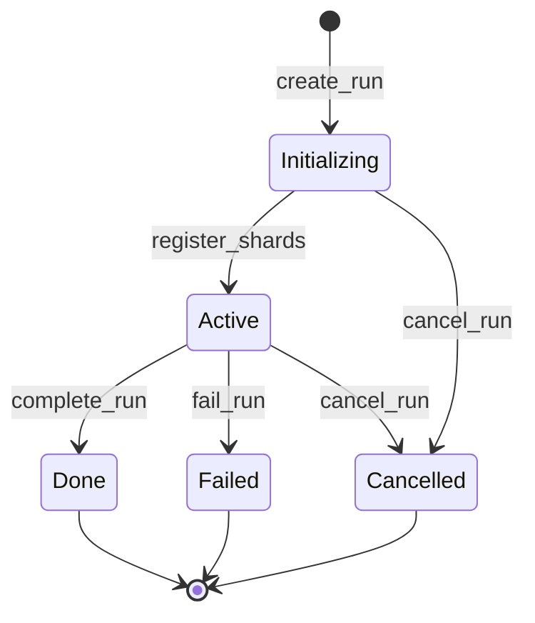
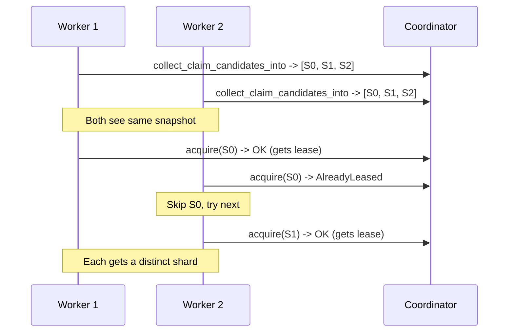
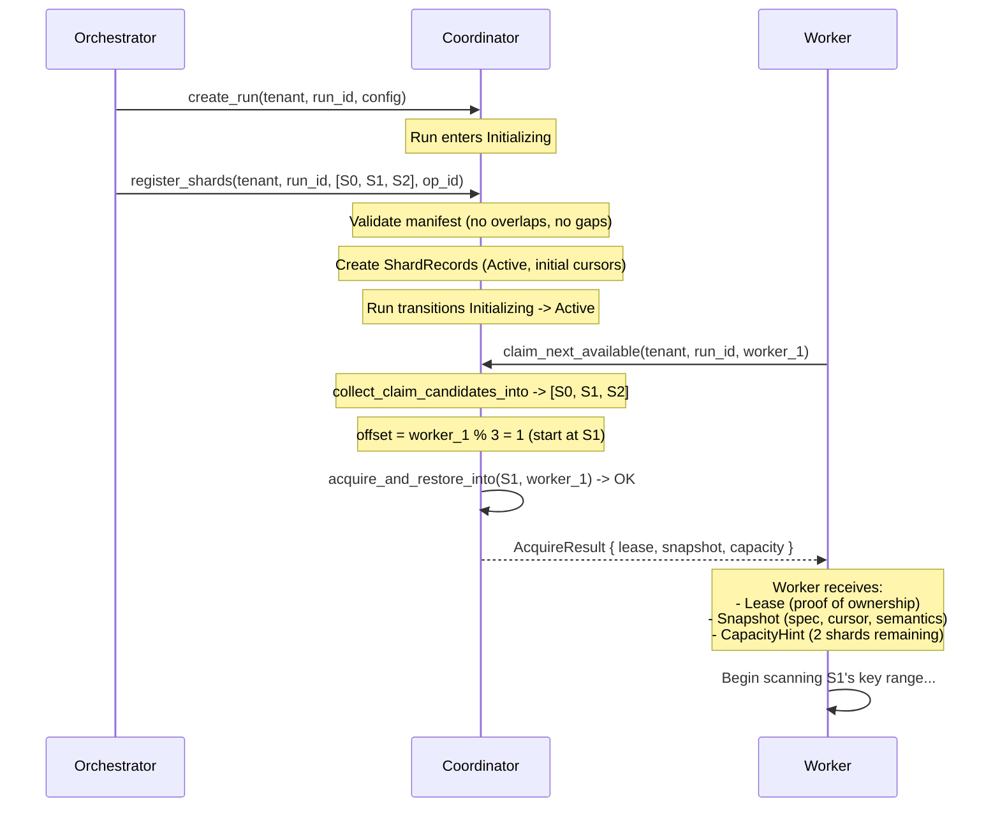

# Chapter 3: Starting a Scan -- Runs, Manifests, and Claiming

*The customer's GitHub organization has 2,400 repositories. Two workers spin
up, each receiving a range of repositories to scan. But nobody checked whether
those ranges overlap. Worker A scans repos 1-1200, Worker B scans repos
1100-2400. A hundred repositories are scanned twice -- burning API quota,
doubling compute cost, and producing duplicate findings. Meanwhile, a different
bug leaves repos 2401-2500 unassigned entirely. Those repositories belong to a
recently acquired subsidiary. They contain hardcoded AWS keys that nobody will
discover until an attacker does. Without a manifest that the coordinator can
validate, there is no guarantee the shards cover the whole keyspace. Gaps mean
missed secrets. Overlaps mean wasted work. Both are silent failures.*

---

## 3.1 Why Runs Exist

A **run** is a single scan invocation -- it groups a set of shards that
collectively cover a target data source. The coordinator tracks the run's
lifecycle, validates the shard manifest at registration time, and provides
progress aggregation. Without runs, shards would be free-floating work items
with no structural relationship to each other, and the coordinator could never
answer the question "is the scan complete?"

Runs serve three purposes:

1. **Manifest validation** -- ensuring the shard key ranges collectively cover
   the target without gaps or overlaps.
2. **Progress aggregation** -- tracking how many shards are Active, Done,
   Parked, or Split, and deciding when the run can transition to a terminal
   state.
3. **Configuration scoping** -- a run carries a `RunConfig` that determines
   cursor semantics and lease duration for all its shards.

## 3.2 RunStatus -- the Full Lifecycle

A run's lifecycle is simpler than a shard's. The state machine has five states
and a clear progression:

```rust
#[derive(Clone, Copy, Debug, PartialEq, Eq, Hash)]
#[repr(u8)]
pub enum RunStatus {
    Initializing = 0,
    Active = 1,
    Done = 2,
    Failed = 3,
    Cancelled = 4,
}
```

The transitions follow a strict pattern:



The key insight is **two-phase creation**: `create_run` puts the run in
`Initializing`, and `register_shards` transitions it to `Active`. This
separation exists so that the coordinator can validate the shard manifest
before the run becomes visible to workers. If manifest validation fails, the
run never activates -- it can be cancelled cleanly.

```rust
impl RunStatus {
    pub const fn is_terminal(self) -> bool {
        matches!(self, Self::Done | Self::Failed | Self::Cancelled)
    }
}
```

Terminal states (Done, Failed, Cancelled) are irreversible within the
coordination protocol. Once a run reaches a terminal state, no further
transitions are permitted.

## 3.3 RunConfig -- Cursor Semantics and Lease Duration

Every run carries an immutable configuration:

```rust
#[derive(Clone, Copy, Debug, PartialEq, Eq)]
pub struct RunConfig {
    pub cursor_semantics: CursorSemantics,
    pub lease_duration: NonZeroU64,
    pub max_shard_retries: Option<u32>,
}
```

The `try_new` constructor validates inputs at construction time:

```rust
impl RunConfig {
    pub fn try_new(
        cursor_semantics: CursorSemantics,
        lease_duration: u64,
        max_shard_retries: Option<u32>,
    ) -> Result<Self, RunConfigError> {
        let lease_duration =
            NonZeroU64::new(lease_duration).ok_or(RunConfigError::ZeroLeaseDuration)?;
        Ok(Self {
            cursor_semantics,
            lease_duration,
            max_shard_retries,
        })
    }
}
```

Three things to notice:

1. **`NonZeroU64` for lease duration** -- the type system makes a zero-duration
   lease unrepresentable. No runtime check needed.
2. **`CursorSemantics`** is a per-run choice (Completed vs Dispatched). We will
   cover this in detail in [Chapter 4](04-acquiring-and-scanning.md).
3. **`max_shard_retries`** is optional -- `None` means unlimited retries. This
   is a policy knob, not a coordination invariant.

## 3.4 RunRecord -- the Coordinator's Authoritative State

The `RunRecord` is the coordinator's full state for a run:

```rust
#[derive(Clone, Debug, PartialEq, Eq)]
pub struct RunRecord {
    pub tenant: TenantId,
    pub run: RunId,
    pub config: RunConfig,
    pub status: RunStatus,
    pub created_at: LogicalTime,
    pub completed_at: Option<LogicalTime>,
    pub root_shards: Vec<ShardId>,
    pub op_log: RingBuffer<RunOpLogEntry, { RunRecord::OP_LOG_CAP }>,
}
```

The record maintains 11 structural invariants checked by `assert_invariants`
after every state transition:

1. Active implies non-empty `root_shards`.
2. `completed_at.is_some()` iff status is terminal.
3. `created_at > LogicalTime::ZERO`.
4. Initializing implies empty `root_shards`.
5. `completed_at >= created_at` when `Some`.
6. Op-log length bounded (`<= OP_LOG_CAP`, which is 8).
7. No duplicate `OpId` values in the op-log.
8. Config valid (`lease_duration > 0`).
9. No duplicate `ShardId` values in `root_shards`.
10. Op-log timestamps non-decreasing.
11. Kind-result consistency in op-log entries.

These invariants are checked with a crash-to-prevent-corruption philosophy:
if any invariant fails, the coordinator panics *before persisting*, so
crash-recovery restores the last valid state. The invariant check is
deliberately O(n^2) for uniqueness checks (INV-7, INV-9), but n is small
enough (cap 8 for op-log, bounded by `MAX_INITIAL_SHARDS` for root shards)
that the quadratic scan is cheaper than a HashSet allocation.

The run op-log (`OP_LOG_CAP = 8`) is smaller than the shard op-log (cap 16)
because run-level operations are less frequent: `register_shards` once, then
at most one terminal transition (complete, fail, or cancel). Eight entries
provide headroom for retries without wasting memory.

## 3.5 RunProgress and Terminal Evaluation

The coordinator aggregates shard status counts into a `RunProgress` struct:

```rust
#[derive(Clone, Debug, Default, PartialEq, Eq)]
pub struct RunProgress {
    pub total: u32,
    pub active: u32,
    pub done: u32,
    pub split: u32,
    pub parked: u32,
    pub leased: u32,  // subset of active
    /// Lexicographic minimum cursor.last_key among Active shards
    /// with non-initial cursors. Tracks in-flight progress only.
    pub watermark: Option<FixedBuf<MAX_KEY_SIZE>>,
}
```

The `watermark` field tracks the lexicographic minimum `cursor.last_key` among
Active shards whose cursor has advanced past the initial position. Terminal
shards are deliberately excluded -- this tracks in-flight progress only.
The watermark is stored in a `FixedBuf<MAX_KEY_SIZE>`, a fixed-capacity inline
buffer that avoids heap allocation. Note that the watermark is **not monotonic**:
splits, unparks, and new shard activations can introduce Active shards with
earlier cursor positions, causing the watermark to decrease.

The `evaluate_run_terminal` function uses these counts to decide whether a
run should transition to a terminal state:

```rust
pub fn evaluate_run_terminal(progress: &RunProgress) -> RunTerminalEvaluation {
    if progress.active > 0 {
        RunTerminalEvaluation::StillActive
    } else if progress.parked > 0 {
        RunTerminalEvaluation::HasFailures
    } else {
        RunTerminalEvaluation::AllDone
    }
}
```

The logic is simple: if any shard is still Active, the run cannot terminate.
If all shards are settled but some are Parked, the run has partial failures.
Otherwise, everything completed successfully.

This evaluation is intentionally **external** to `RunRecord`. The coordinator
calls it but decides independently whether and when to auto-transition. This
separation gives the orchestrator flexibility: it might choose to wait for
a human operator to review Parked shards before marking the run as Failed,
or it might auto-complete as soon as all shards are Done.

## 3.6 register_shards -- Manifest Validation and the Initializing-to-Active Transition

The `register_shards` operation is where the coordinator verifies that the
proposed shards form a valid manifest. This is the critical safety check that
prevents the failure scenario from the opening: overlapping or missing key
ranges.

### 3.6.1 InitialShardInput

Each shard in the manifest is described by an `InitialShardInput` -- a borrowed
view that avoids heap allocation at the registration boundary:

```rust
#[derive(Clone, Copy, Debug, PartialEq, Eq)]
pub struct InitialShardInput<'a> {
    pub(crate) shard: ShardId,
    pub(crate) spec: ShardSpecRef<'a>,
    pub(crate) cursor: CursorUpdate<'a>,
}
```

The `spec` is a `ShardSpecRef<'a>` (borrowed key range and metadata) and the
`cursor` is a `CursorUpdate<'a>` (borrowed last-key and token slices). Both
are call-scoped views -- the coordinator copies their bytes into slab-owned
storage during registration.

The `cursor` field supports resuming a previously failed run -- you can
re-register shards with non-initial cursors to pick up where a prior attempt
left off. For fresh scans, all cursors are `CursorUpdate::initial()`.

### 3.6.2 Manifest Validation

The `validate_manifest` function performs eight checks in a deliberate order:

```
1. SEC-3:  count <= MAX_INITIAL_SHARDS (10,000)   -- FIRST, before allocation
2.         Non-empty manifest
3.         No duplicate ShardIds
4.         No unbounded ranges (production requires finite bounds)
5.         Spec validity: start < end for bounded ranges
6.         No overlapping key ranges (sorted scan)
7.         Cursor key size <= MAX_KEY_SIZE (4 KiB)
8.         Cursor bounds for non-initial cursors
```

The ordering is significant. Check 1 runs *before any heap allocation* --
a malicious caller sending 10 million shards is rejected before the
coordinator allocates a single vector. This is defense-in-depth against
resource exhaustion (the constant is `MAX_INITIAL_SHARDS = 10_000`).

Overlap detection (check 6) uses a sorted scan:

```rust
// Ranges are sorted by key_range_start. Two adjacent ranges [a_start, a_end)
// and [b_start, b_end) overlap iff a_end > b_start.
for window in sorted.windows(2) {
    let (a, b) = (window[0], window[1]);
    let a_end = a.spec.key_range_end();
    let b_start = b.spec.key_range_start();
    let overlaps = a_end.is_empty() || b_start.is_empty() || a_end > b_start;
    if overlaps {
        return Err(ManifestValidationError::OverlappingRanges {
            shard_a: a.shard,
            shard_b: b.shard,
        });
    }
}
```

Note that **gaps are allowed**. The manifest does not need to be a contiguous
partition of the keyspace. This is a deliberate design choice: some data
sources have sparse key distributions where requiring contiguous coverage
would force creation of many empty "filler" shards.

### 3.6.3 The Transition

On successful validation, `register_shards` creates `ShardRecord` entries
for each shard and transitions the run from `Initializing` to `Active`. The
operation is idempotent via `OpId` -- replaying `register_shards` with the
same `OpId` and payload returns the cached shard IDs without creating
duplicates.

The `RunManagement` trait defines the signature:

```rust
fn register_shards(
    &mut self,
    now: LogicalTime,
    tenant: TenantId,
    run: RunId,
    shards: &[InitialShardInput<'_>],
    op_id: OpId,
) -> Result<IdempotentOutcome<Vec<ShardId>>, RegisterShardsError>;
```

There is also a convenience method `create_run_with_shards` that combines
both phases into a single call. However, the default implementation is **not
atomic** -- production backends should override it with a transactional
implementation.

## 3.7 ShardFilter -- Querying Shards by State

The coordinator needs to query shards by their current state -- "which shards
are available for claiming?" or "which shards are parked?" -- without loading
every shard record. `ShardFilter` provides this:

```rust
#[derive(Clone, Debug, Default, PartialEq, Eq)]
pub struct ShardFilter {
    pub status: Option<ShardStatus>,
    pub is_leased: Option<bool>,
    pub root_only: bool,
}
```

Named constructors compose the common patterns:

```rust
impl ShardFilter {
    /// No constraints -- matches every shard.
    pub fn all() -> Self { Self::default() }

    /// Active shards (both leased and unleased).
    pub fn active() -> Self {
        Self { status: Some(ShardStatus::Active), ..Self::default() }
    }

    /// Active AND unleased -- shards ready for a worker to acquire.
    pub fn available() -> Self {
        Self {
            status: Some(ShardStatus::Active),
            is_leased: Some(false),
            ..Self::default()
        }
    }

    /// Parked shards -- candidates for unpark.
    pub fn parked() -> Self {
        Self { status: Some(ShardStatus::Parked), ..Self::default() }
    }
}
```

The critical detail: `is_leased` is evaluated at the `now` timestamp passed
to `list_shards`. A lease whose deadline has passed is treated as unleased.
This means a shard whose worker crashed appears as "available" once the lease
clock expires -- no manual intervention needed.

`ShardFilter` also provides a `matches_record` method that pre-filters on
`ShardRecord` fields *before* constructing a `ShardSummary`. Since
`ShardSummary::from_record` copies slab-backed byte fields into
`SummaryBytes<MAX_KEY_SIZE>` fixed-capacity inline buffers (not heap
allocations), the optimization primarily avoids the byte-copy work for
filtered-out shards. When filtering 10,000 shards with a selective filter,
this skips thousands of unnecessary buffer copies.

## 3.8 ShardClaiming and claim_next_available

Now we reach the core question: how does a worker get assigned a shard? The
answer is the `ShardClaiming` trait and its default implementation.

### 3.8.1 The Trait

```rust
pub trait ShardClaiming: CoordinationBackend + RunManagement {
    fn claim_next_available<'a>(
        &mut self,
        now: LogicalTime,
        tenant: TenantId,
        run: RunId,
        worker: WorkerId,
        out: &'a mut AcquireScratch,
    ) -> Result<AcquireResultView<'a>, ClaimError>;
}
```

`ShardClaiming` bridges two base traits: `CoordinationBackend` (which
operates on individual shards by `ShardKey`) and `RunManagement` (which
can list shards for a run). Neither provides a "give me the next shard to
work on" operation. `ShardClaiming` composes both into that higher-level
primitive.

Backends must implement `ShardClaiming` explicitly. Implementations that
want the shared scan-then-acquire behavior can delegate to
`default_claim_next_available` while reusing a caller-owned candidate
buffer (`Vec<ShardId>`):

```rust
impl ShardClaiming for MyBackend {
    fn claim_next_available<'a>(
        &mut self,
        now: LogicalTime,
        tenant: TenantId,
        run: RunId,
        worker: WorkerId,
        out: &'a mut AcquireScratch,
    ) -> Result<AcquireResultView<'a>, ClaimError> {
        let mut candidates = std::mem::take(&mut self.claim_candidates_scratch);
        let result = default_claim_next_available(
            self, now, tenant, run, worker, out, &mut candidates,
        );
        self.claim_candidates_scratch = candidates;
        result
    }
}
```

### 3.8.2 The Default Claim Algorithm

The `default_claim_next_available` function is the heart of shard assignment.
Here is the complete implementation:

```rust
pub fn default_claim_next_available<'a, B: CoordinationBackend + RunManagement>(
    backend: &mut B,
    now: LogicalTime,
    tenant: TenantId,
    run: RunId,
    worker: WorkerId,
    out: &'a mut AcquireScratch,
    candidates: &mut Vec<ShardId>,
) -> Result<AcquireResultView<'a>, ClaimError> {
    let scan_deadline = backend
        .collect_claim_candidates_into(now, tenant, run, candidates)
        .map_err(ClaimError::from)?;

    if candidates.is_empty() {
        return Err(ClaimError::NoneAvailable {
            earliest_deadline: scan_deadline,
        });
    }

    let len = candidates.len();
    let offset = worker.as_raw() as usize % len;
    let mut inconsistency_count = 0usize;
    let mut earliest_deadline: Option<LogicalTime> = scan_deadline;
    let mut i = 0usize;
    let acquired = loop {
        if i == len {
            break None;
        }
        let shard_id = candidates[(offset + i) % len];
        let key = ShardKey::new(run, shard_id);
        match backend.acquire_and_restore_into(now, tenant, key, worker, out) {
            Ok(result) => {
                let snapshot = result.snapshot;
                break Some((
                    result.lease,
                    snapshot.status(),
                    snapshot.cursor_semantics(),
                    snapshot.parent(),
                    result.capacity,
                ));
            }
            Err(AcquireError::AlreadyLeased { lease_deadline, .. }) => {
                earliest_deadline = Some(match earliest_deadline {
                    Some(prev) => core::cmp::min(prev, lease_deadline),
                    None => lease_deadline,
                });
                i += 1;
                continue;
            }
            Err(AcquireError::ShardTerminal { .. }) => {
                i += 1;
                continue;
            }
            Err(AcquireError::ShardNotFound { .. }) => {
                debug_assert!(
                    false,
                    "claim_next_available: collect_claim_candidates_into returned shard \
                     {key:?} but acquire_and_restore_into reports ShardNotFound"
                );
                inconsistency_count += 1;
                i += 1;
                continue;
            }
            Err(AcquireError::TenantMismatch { expected }) => {
                return Err(ClaimError::TenantMismatch { expected });
            }
            Err(AcquireError::BackendError { message }) => {
                return Err(ClaimError::BackendError { message });
            }
        }
    };

    // ... reconstruct AcquireResultView from `out` if acquired ...

    assert!(
        inconsistency_count < len,
        "all {} candidates returned ShardNotFound -- backend index vs shard \
         map inconsistency",
        len,
    );

    Err(ClaimError::NoneAvailable { earliest_deadline })
}
```

Let us walk through this step by step.

#### Step 1: Collect claim candidates

```rust
let scan_deadline = backend
    .collect_claim_candidates_into(now, tenant, run, candidates)
    .map_err(ClaimError::from)?;
```

`collect_claim_candidates_into` fills the caller-owned `candidates` buffer
with the `ShardId`s of Active, unleased shards (at the given `now`
timestamp). The returned `scan_deadline` is the earliest lease deadline
observed during the scan -- this piggybacks deadline discovery onto the
candidate collection, avoiding a second pass.

#### Step 2: Handle the empty case

If no candidates were found, the function returns immediately with the
`scan_deadline` so the caller can schedule a retry:

```rust
if candidates.is_empty() {
    return Err(ClaimError::NoneAvailable {
        earliest_deadline: scan_deadline,
    });
}
```

This `earliest_deadline` is crucial for the caller. Instead of
busy-spinning ("are there shards yet? are there shards yet?"), the caller
can sleep until approximately this time, when the soonest lease expires and
a shard might become available.

#### Step 3: Offset-based round-robin

```rust
let len = candidates.len();
let offset = worker.as_raw() as usize % len;
```

Different workers begin iteration at different positions in the candidate
list. This is deterministic (no RNG) and spreads contention: if workers 1, 2,
and 3 all call `claim_next_available` at the same time, they start trying
different shards instead of all racing for the first one.

For a given candidate list length, the same worker always starts at the same
position. This is not a fairness guarantee -- it is a contention-reduction
heuristic.

#### Step 4: Try acquire on each candidate

```rust
for i in 0..len {
    let shard_id = candidates[(offset + i) % len];
    let key = ShardKey::new(run, shard_id);
    match backend.acquire_and_restore_into(now, tenant, key, worker, out) {
        Ok(result) => return Ok(result),
```

On success, we immediately return the `AcquireResult` (containing the lease,
shard snapshot, and a capacity hint).

#### Step 5: Handle race conditions

Each candidate might fail for different reasons:

- **`AlreadyLeased`** -- Another worker claimed it between our
  `collect_claim_candidates_into` snapshot and our `acquire_and_restore_into`
  call. Track the deadline and move on.
- **`ShardTerminal`** -- The shard became Done, Split, or Parked between
  candidate collection and acquire. Skip it.
- **`ShardNotFound`** -- The candidate list said it exists but acquire says it
  does not. This is a backend inconsistency (possibly from a concurrent split).
  Track it and continue, but `debug_assert` to catch it in tests.
- **`TenantMismatch`** -- This is not a race; it is a logic bug. Fail
  immediately because retrying other candidates would hit the same mismatch.
- **`BackendError`** -- A transient infrastructure error from the coordination
  backend. Fail immediately because retrying other candidates is unlikely to
  succeed if the backend itself is unhealthy.

#### Step 6: Post-loop safety check

```rust
assert!(
    inconsistency_count < candidates.len(),
    "all {} candidates returned ShardNotFound -- backend index vs shard \
     map inconsistency",
    candidates.len(),
);
```

If *every single candidate* returned `ShardNotFound`, something is
fundamentally wrong with the backend's data -- the shard index disagrees with
the shard map. This is data corruption, and the coordinator panics rather than
silently returning "no shards available."

#### Step 7: Final NoneAvailable

If all candidates were lost to races (or became terminal), we return
`NoneAvailable` with the `earliest_deadline` observed from `AlreadyLeased`
errors.

### 3.8.3 ClaimError

The `ClaimError` enum is intentionally coarser than `AcquireError`:

```rust
#[derive(Clone, Debug, PartialEq, Eq)]
#[non_exhaustive]
pub enum ClaimError {
    NoneAvailable { earliest_deadline: Option<LogicalTime> },
    RunNotFound,
    TenantMismatch { expected: TenantId },
    Throttled { retry_after: LogicalTime },
    BackendError { message: String },
}
```

Transient race conditions (`AlreadyLeased`, `ShardTerminal`, `ShardNotFound`)
are absorbed by the retry loop and surface as `NoneAvailable` only when
*every* candidate has been exhausted. This keeps callers from needing to
distinguish "no shards exist" from "all shards were grabbed by other workers"
-- both mean "try again later."

The `Throttled` variant is for claim cooldown, covered in section 3.10.

The `BackendError` variant surfaces transient infrastructure errors from the
coordination backend (e.g., network timeout, storage unavailability). The
caller may retry after a backoff. This variant propagates from both
`GetRunError::BackendError` (via the `From<GetRunError>` impl on the
candidate-collection path) and `AcquireError::BackendError` (when a
per-shard acquire attempt hits an infrastructure failure).

### 3.8.4 Complexity Analysis

The default claim algorithm has the following complexity characteristics:

- **Best case**: O(1) -- the first candidate is available and acquired.
- **Worst case**: O(S) where S is the number of available shards -- every
  candidate was claimed by a concurrent worker, requiring a full scan.
- **`collect_claim_candidates_into` call**: O(S) in the in-memory backend
  (linear scan over the run's shard map collecting unleased Active shards).

The `&mut B` bound on `backend` means exactly one claim attempt is in flight
per backend instance at a time. Concurrent claiming requires separate backend
instances (one per worker thread/task). This is a deliberate design choice:
it eliminates internal concurrency control within the claim algorithm while
pushing concurrency management to the caller.

The round-robin offset is deterministic and stable for a given worker and
candidate list length. This means workers that claim repeatedly tend to
start at the same position, which interacts well with lease expiry patterns:
if a worker always starts at offset K, it naturally gravitates toward the
same shards across multiple claim cycles, reducing contention with workers
at other offsets.

## 3.9 TOCTOU Safety -- Why the Gap Between List and Acquire is Safe

There is an intentional TOCTOU (Time-Of-Check-Time-Of-Use) gap between
`collect_claim_candidates_into` and `acquire_and_restore_into`. Between
taking the snapshot and attempting acquisition, other workers may have
claimed the same shards.

This is safe because the **fencing protocol in `acquire_and_restore_into`
guarantees at-most-one winner per shard**. Workers that lose the race simply
advance to the next candidate. The worst case for a single worker is O(S)
failed acquire attempts where S is the number of available shards, since each
candidate is tried at most once.



The design choice to use a two-step list-then-acquire pattern (rather than an
atomic "claim next" primitive) keeps the `CoordinationBackend` trait minimal.
There is no claim-specific method in the backend -- claiming is composed from
existing building blocks. This matters because the trait must be implementable
across very different storage backends (in-memory, FoundationDB, PostgreSQL),
and each has different atomic primitive capabilities.

The alternative design -- an atomic "claim next" primitive in the backend --
would require every backend to implement a combined filter-and-acquire
operation. This is straightforward for SQL backends (`SELECT ... FOR UPDATE
SKIP LOCKED`) but awkward for key-value stores like FoundationDB, where
secondary indexes and atomic read-modify-write over multiple keys require
careful transaction design. By splitting the operation into list + acquire,
the trait stays minimal and implementable across diverse storage systems.

Reference: FoundationDB simulation (Zhou et al., SIGMOD 2021) -- deterministic
testing validates that this TOCTOU gap never violates safety properties even
under adversarial scheduling.

## 3.10 Claim Cooldown -- Per-Worker Rate Limiting

Without rate limiting, a single fast worker could flood the coordinator with
claim requests -- acquiring a shard, completing it instantly (or failing),
and immediately claiming another. In a system with many shards and few
workers, this is fine. But with many workers competing for few shards, it
creates a thundering herd.

The `InMemoryCoordinator` supports an optional per-worker claim cooldown:

```rust
ClaimError::Throttled { retry_after: LogicalTime },
```

Key properties of the cooldown mechanism:

1. **Per-worker, not per-run** -- a successful claim in run A puts the worker
   in cooldown for run B too. This prevents a single worker from flooding
   the coordinator across multiple runs.
2. **Only successful claims trigger cooldown** -- failed claims (NoneAvailable,
   RunNotFound) do not start the cooldown timer. A worker that could not get
   a shard should not be penalized.
3. **Cooldown fires before the run lookup** -- `Throttled` takes priority over
   `RunNotFound` or `NoneAvailable`. The rate limit is an unconditional gate.
4. **Disabled with zero interval** -- setting `cooldown_interval = 0`
   disables the mechanism entirely. The default implementation in the
   `ShardClaiming` trait never returns `Throttled`.

This design means backends that need custom claim behavior (per-worker
cooldown, SQL `SKIP LOCKED`, locality-aware selection) override
`claim_next_available` and may delegate to `default_claim_next_available`
internally as a building block.

The cooldown is also enforced consistently across error cases:

- A `Throttled` error takes priority over `RunNotFound` -- the rate limit is
  checked before the run lookup. This means a throttled worker targeting a
  nonexistent run gets `Throttled`, not `RunNotFound`.
- A `Throttled` error takes priority over `NoneAvailable` -- the rate limit
  fires before the candidate scan. A throttled worker in a fully-leased run
  gets `Throttled`, not `NoneAvailable`.
- Cooldown is **not** enforced on direct `acquire_and_restore_into` calls. The
  cooldown gates the high-level claiming facade; direct acquire targets a
  known shard and is not subject to rate limiting. This separation means
  administrative tools can bypass the cooldown for manual shard assignment.

## 3.11 CoordinationFacade -- the Super-Trait

The orchestrator and scheduler layers need the full coordination surface:
shard lifecycle, run management, and shard claiming. Rather than writing out
three separate trait bounds everywhere, the codebase provides a unified
super-trait:

```rust
pub trait CoordinationFacade: CoordinationBackend + RunManagement + ShardClaiming {}

// Blanket impl: the three component traits compose automatically.
impl<T: CoordinationBackend + RunManagement + ShardClaiming> CoordinationFacade for T {}
```

The trait hierarchy is:

```
CoordinationFacade
  +-- CoordinationBackend  (traits.rs: shard lifecycle)
  +-- RunManagement        (run.rs: run lifecycle + admin)
  +-- ShardClaiming        (facade.rs: shard assignment)
```

A typical lifecycle using the facade looks like:

```rust
fn run_orchestrator<B: CoordinationFacade>(backend: &mut B) {
    // Phase 1: Setup -- create run and register its shard manifest.
    backend.create_run(now, tenant, run_id, config)?;
    backend.register_shards(now, tenant, run_id, shards, op_id)?;

    // Phase 2: Processing -- each worker claims, processes, and completes.
    let result = backend.claim_next_available(now, tenant, run_id, worker)?;
    backend.checkpoint(now, tenant, &result.lease, cursor, op_id)?;
    backend.complete(now, tenant, &result.lease, final_cursor, op_id)?;

    // Phase 3: Finalization -- once all shards are Done.
    backend.complete_run(now, tenant, run_id, op_id)?;
}
```

One subtlety: `CoordinationFacade` is technically object-safe, but `dyn
CoordinationFacade` loses access to `claim_next_available` because it carries
a `where Self: Sized` bound (excluded from the vtable). Since claiming is the
primary value of the facade, prefer `B: CoordinationFacade` as a generic bound
over `dyn CoordinationFacade`.

## 3.12 Putting It Together -- The First Five Minutes of a Scan

Here is what happens when a scan starts, step by step:



The orchestrator creates the run and registers shards. Workers independently
call `claim_next_available` to pull work. The coordinator mediates all access
through the fencing protocol, and the manifest validation at registration time
ensures that the shards collectively make sense.

## 3.13 Summary

This chapter covered the mechanisms that get a scan started:

- **RunRecord and RunStatus** track the lifecycle of a scan invocation through
  two-phase creation (Initializing -> Active).
- **RunConfig** provides immutable per-run settings with type-level guarantees
  (NonZeroU64 for lease duration).
- **register_shards** validates the shard manifest (8 checks, resource
  exhaustion guard first) and creates ShardRecord entries.
- **ShardFilter** enables efficient queries over shard state.
- **claim_next_available** uses a list-then-acquire pattern with offset-based
  round-robin to assign shards to workers.
- **TOCTOU safety** is guaranteed by the fencing protocol in
  `acquire_and_restore_into`, not by atomicity of the claim operation.
- **Claim cooldown** prevents claim flooding via per-worker rate limiting.
- **CoordinationFacade** unifies the three component traits into a single
  bound.

Next, in [Chapter 4](04-acquiring-and-scanning.md), we will look at what
happens after a worker claims a shard: the `acquire_and_restore_into` operation in
detail, the cursor system for tracking progress, and the checkpoint protocol
that prevents crash-induced data loss.

---

**References**

- Zhou et al., "FoundationDB: A Distributed Unbundled Transactional Key Value
  Store," SIGMOD 2021 -- deterministic simulation methodology used to validate
  TOCTOU safety.
- Chang et al., "Bigtable: A Distributed Storage System for Structured Data,"
  OSDI 2006 -- range-sharded keyspace design.
- Corbett et al., "Spanner: Google's Globally-Distributed Database," OSDI
  2012 -- half-open key-range splits.
