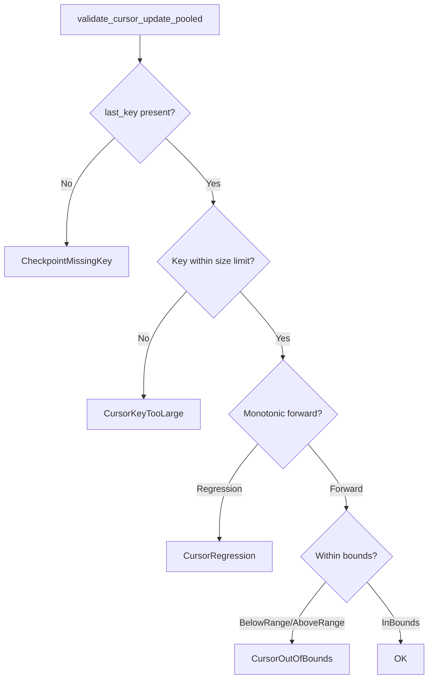
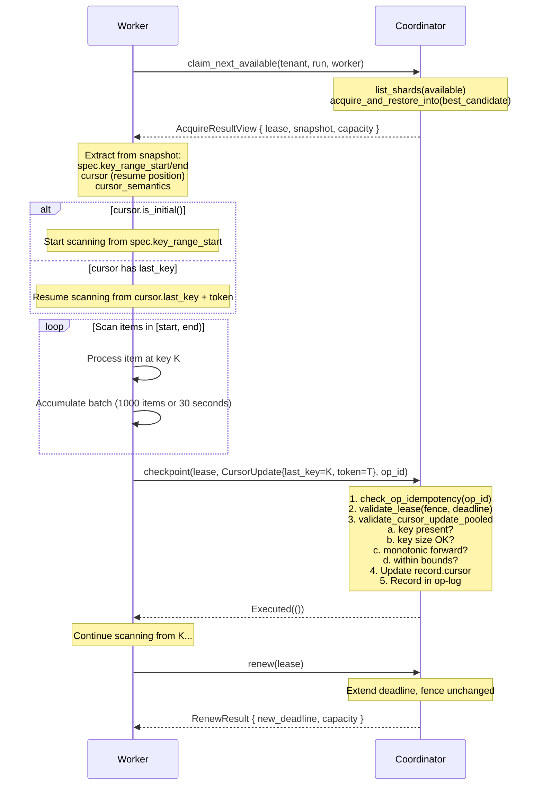

# Chapter 4: Acquiring and Scanning -- The Worker's First Steps

*Worker 7 is scanning a 4 TB S3 bucket, processing objects
lexicographically. After three hours, it has checkpointed progress up to key
`photos/2024/03/15/IMG_8847.jpg`. Then the container is killed by an OOM
event. No checkpoint was persisted for the last 200,000 objects it processed
after that key. When Worker 7 restarts and re-acquires the shard, it resumes
from the last checkpoint -- `photos/2024/03/15/IMG_8847.jpg`. Those 200,000
objects? Scanned again from scratch. The three hours of work between the last
checkpoint and the crash is simply gone. Without checkpointing, every crash
means starting from zero. With infrequent checkpointing, every crash means
losing everything since the last save. The checkpoint protocol turns a
catastrophic restart into a bounded setback.*

---

## 4.1 The Acquire Operation

After `claim_next_available` selects a shard (covered in [Chapter 3](03-starting-a-scan.md)), the actual acquisition happens inside
`acquire_and_restore_into`. This is the operation that grants a worker exclusive,
time-limited access to a shard and provides everything it needs to start (or
resume) scanning.

### 4.1.1 The Trait Signature

From `traits.rs`, the `CoordinationBackend` trait defines:

```rust
/// Acquire a shard for processing and restore its last checkpoint.
///
/// This is the entry point for a worker to start or resume scanning
/// a shard. If the shard is currently unleased (or its lease has
/// expired), the backend grants a new lease to the requesting worker.
///
/// ## Behavior
///
/// 1. Look up the shard record by `(tenant, key)`.
/// 2. Verify tenant isolation: `record.tenant == tenant`.
/// 3. Verify shard is Active (not terminal).
/// 4. If currently leased and lease is live at `now`: reject with
///    `AlreadyLeased`.
/// 5. Increment `fence_epoch` (ownership transfer).
/// 6. Set `lease_owner = worker`, `lease_deadline = now + lease_duration`.
///    `lease_duration` is a backend configuration parameter, not a
///    per-call argument.
/// 7. Return `AcquireResultView`: the lease, shard snapshot view, and a
///    `CapacityHint` reflecting post-acquisition shard availability.
fn acquire_and_restore_into<'a>(
    &mut self,
    now: LogicalTime,
    tenant: TenantId,
    key: ShardKey,
    worker: WorkerId,
    out: &'a mut AcquireScratch,
) -> Result<AcquireResultView<'a>, AcquireError>;
```

The seven steps form a precise protocol. Let us examine each.

### 4.1.2 The Seven Steps

**Step 1: Lookup.** The backend finds the `ShardRecord` by `(tenant, key)`.
The `ShardKey` combines `RunId` and `ShardId` into a single lookup key.

**Step 2: Tenant isolation.** `record.tenant == tenant` must hold. This is
checked *before* any other property is revealed. If the tenant does not match,
the error reports only the `expected` tenant -- never the actual tenant stored
on the record. This prevents cross-tenant enumeration.

**Step 3: Active status.** Terminal shards (Done, Split, Parked) cannot be
acquired. The worker receives `ShardTerminal` if it attempts to acquire a
completed shard.

**Step 4: Lease check.** If the shard currently has a live lease (`now <
deadline`), the acquire is rejected with `AlreadyLeased`. The worker must
wait for the lease to expire or try a different shard. Crucially, expired
leases are *not* a barrier -- if `now >= deadline`, the old lease is
considered dead and the shard is available for re-acquisition.

**Step 5: Increment fence_epoch.** This is the ownership transfer. The fence
epoch is a monotonically increasing counter that bumps on every acquisition.
Any worker holding a lease with a stale epoch is a "zombie" -- its mutations
will be rejected by the fencing protocol. This step is what makes the entire
coordination system safe under partial failures.

**Step 6: Set the new lease.** The backend records the new `lease_owner` and
`lease_deadline = now + lease_duration`. The lease duration comes from the
backend's configuration (which in turn comes from `RunConfig`), not from the
worker. Workers cannot request longer leases.

**Step 7: Return the AcquireResultView.** The worker receives three things:

```rust
#[derive(Clone, Copy, Debug, PartialEq, Eq)]
pub struct AcquireResultView<'a> {
    pub lease: Lease,
    pub snapshot: ShardSnapshotView<'a>,
    pub capacity: CapacityHint,
}
```

- The **Lease** is the worker's proof of ownership -- it carries the fencing
  token and must be presented on every subsequent mutation.
- The **ShardSnapshotView** tells the worker what to scan and where to resume.
  It borrows from caller-owned `AcquireScratch` storage to keep the acquire
  path allocation-free.
- The **CapacityHint** is advisory metadata about how many shards remain
  available (useful for backoff decisions).

Note the `out: &'a mut AcquireScratch` parameter: callers provide a reusable
scratch buffer that the coordinator fills with the snapshot's variable-length
byte data (spec keys, cursor keys, metadata). The returned
`AcquireResultView<'a>` borrows from this scratch, so it remains valid only
until the scratch is reused or dropped. This design keeps the acquire hot path
allocation-free.

### 4.1.3 Non-Idempotency

Unlike checkpoint and complete, `acquire_and_restore_into` is **not idempotent via
OpId**. Each successful call increments the fence epoch, producing a new and
distinct lease. A worker that calls acquire twice gets two different leases --
the first is immediately invalidated by the second's epoch bump.

This is intentional. Workers that need to resume after a transient failure
simply call acquire again. The new lease supersedes the old one, and the
fencing protocol ensures the zombie from the first lease cannot interfere.

## 4.2 ShardSnapshotView -- What the Worker Gets Back

The `ShardSnapshotView` is a borrowed, allocation-free view of the shard state
at acquisition time. It contains everything the worker needs to start scanning:

```rust
#[derive(Clone, Copy, Debug, PartialEq, Eq)]
pub struct ShardSnapshotView<'a> {
    status: ShardStatus,
    spec: ShardSpecRef<'a>,
    cursor: CursorUpdate<'a>,
    cursor_semantics: CursorSemantics,
    parent: Option<ShardId>,
    spawned: &'a [ShardId],
}
```

Notice what is **included**:
- `status` -- the shard's lifecycle state (always Active at acquisition time).
- `spec` -- a borrowed `ShardSpecRef<'a>` for the key range (`[start, end)`)
  and connector-opaque metadata.
- `cursor` -- a borrowed `CursorUpdate<'a>` progress marker (where to resume).
- `cursor_semantics` -- Completed vs Dispatched mode.
- `parent` -- if this shard was created by a split, who is the parent.
- `spawned` -- a borrowed slice of any child shards created via split.

Notice what is **excluded**:
- `tenant` -- the worker already knows its own tenant.
- `run`, `shard` -- the worker already knows the shard identity from the
  acquire call.
- `fence_epoch` -- the worker gets this from the `Lease`.
- `lease` details -- the worker gets these from the `Lease`.
- `op_log` -- internal to the coordinator; the worker has no business seeing
  other workers' operation history.
- `park_reason` -- only relevant for Parked shards, which are never acquired.

This separation follows the principle of least privilege: the worker receives
exactly the information it needs to scan, and nothing more. All byte data in
the snapshot borrows from the `AcquireScratch` buffer, so the snapshot is
`Copy` and allocation-free. The `ShardRecord` itself (the coordinator's
authoritative state) has `pub` fields for internal mutation, but the
`ShardSnapshotView` exposes only public accessor methods.

## 4.3 CursorUpdate -- the Two-Layer Progress Marker

The cursor is the most important data structure for crash recovery. It answers
"where are we in the scan?" with two layers of information:

```rust
#[derive(Clone, Copy, Debug, PartialEq, Eq)]
pub struct CursorUpdate<'a> {
    /// The key of the last fully-processed item (lex-ordered).
    /// `None` = no items processed yet.
    last_key: Option<&'a [u8]>,

    /// Connector-opaque resume token.
    /// `None` = start from the beginning of the shard's key range.
    token: Option<&'a [u8]>,
}
```

> **Borrowed views, not owned types.** `CursorUpdate<'a>` uses borrowed
> `Option<&'a [u8]>` fields rather than `Box<[u8]>`. This is an intentional
> allocation-free design: the contract type borrows from caller-owned storage
> (e.g., `AcquireScratch` on the acquire path, or stack-allocated byte slices
> on the checkpoint path). Inside the coordinator, cursors are stored as
> `PooledCursor`, which replaces borrowed slices with `ByteSlot` handles into
> the coordinator's shared `ByteSlab` arena. Validation uses
> `validate_cursor_update_pooled()`, which borrows key bytes directly from the
> slab, avoiding per-call materialization. See Chapter 1 and Appendix F for details.

```
+------------------------------------------------------+
| last_key: Option<&'a [u8]>                           |
|   -> coordinator-visible, lex-comparable             |
|   -> represents the last item key fully processed    |
+------------------------------------------------------+
| token: Option<&'a [u8]>                              |
|   -> connector-opaque resume state                   |
|   -> pagination cursor, continuation token, etc.     |
+------------------------------------------------------+
```

### 4.3.1 Why Two Layers?

**`last_key`** is the coordinator-visible layer. The coordinator uses it for:
- **Monotonicity enforcement** -- ensuring the cursor never goes backward.
- **Bounds checking** -- ensuring the cursor stays within the shard's key range.
- **Progress observability** -- dashboards can show how far each shard has
  progressed through its key range.

**`token`** is the connector-opaque layer. The coordinator stores it verbatim
and returns it on acquisition, but **never inspects it**. This is where
connectors store their internal pagination state: a GitHub API cursor, an
Elasticsearch scroll ID, an Azure AD continuation token.

The two layers are independent. A connector might update `token` on every API
page (to resume at the right pagination offset) while only updating `last_key`
when it has fully processed a batch (to record durable progress). Or a
connector might not use tokens at all, setting `token = None` and relying
solely on `last_key` for resumption.

### 4.3.2 Size Limits

```rust
/// Maximum size of a cursor `last_key` in bytes (4 KiB).
pub const MAX_KEY_SIZE: usize = 4_096;

/// Maximum size of a cursor `token` in bytes (16 KiB).
pub const MAX_TOKEN_SIZE: usize = 16_384;
```

`MAX_KEY_SIZE` (4 KiB) is sized to the row-key ceiling of DynamoDB and
Bigtable. Keys larger than this are almost certainly a serialization bug.

`MAX_TOKEN_SIZE` (16 KiB) accommodates the largest observed connector tokens:
GitHub API tokens (~50 bytes), Elasticsearch scroll IDs (2-10 KB), and Azure
AD JWTs (~15 KB). The 16 KiB ceiling provides minimal margin over the worst
case.

### 4.3.3 Constructors and Encapsulation

CursorUpdate fields are private. Constructors enforce invariants:

```rust
impl<'a> CursorUpdate<'a> {
    /// Initial cursor: no progress, no resume token.
    pub fn initial() -> Self {
        Self { last_key: None, token: None }
    }

    /// Cursor with a last_key and no resume token.
    /// Panics if last_key is empty.
    pub fn new(last_key: &'a [u8]) -> Self {
        assert!(!last_key.is_empty(), "last_key must not be empty when present");
        Self { last_key: Some(last_key), token: None }
    }

    /// Cursor from both layers. Empty token normalized to None.
    /// Panics if last_key is empty.
    pub fn with_token(last_key: &'a [u8], token: &'a [u8]) -> Self {
        assert!(!last_key.is_empty(), "last_key must not be empty when present");
        Self {
            last_key: Some(last_key),
            token: if token.is_empty() { None } else { Some(token) },
        }
    }
}
```

The invariant that a present `last_key` must be non-empty is enforced at
construction time. An empty key (`[]`) is indistinguishable from "no key" in
the lexicographic keyspace and would break comparison logic.

There are also fallible constructors (`try_new`, `try_with_token`)
that return `CursorInputError` instead of panicking, suitable for validating
external input. The fallible constructors also enforce size limits
(`MAX_KEY_SIZE` and `MAX_TOKEN_SIZE`), while the panicking constructors do not
-- use `try_*` when accepting untrusted input.

Reference: Bacon et al., "Spanner: Becoming a SQL System" (2017) -- query
restart protocol with opaque restart tokens and ordered resume keys.

## 4.4 check_cursor_advance() -- the Monotonicity Guard

When a worker checkpoints, the coordinator must verify that the cursor has not
gone backward. The `check_cursor_advance` function implements this check as a
pure, side-effect-free comparison:

```rust
pub fn check_cursor_advance(old: CursorUpdate<'_>, new: CursorUpdate<'_>) -> CursorAdvance {
    debug_assert!(old.last_key().is_none_or(|k| !k.is_empty()));
    debug_assert!(new.last_key().is_none_or(|k| !k.is_empty()));

    match (old.last_key(), new.last_key()) {
        // No progress -> first progress: always valid.
        (None, Some(_)) => CursorAdvance::Forward,

        // No progress -> no progress: valid (no-op).
        (None, None) => CursorAdvance::Forward,

        // Had progress -> lost progress: regression.
        (Some(_), None) => CursorAdvance::ResetToNone,

        // Both present: lexicographic comparison.
        (Some(old_key), Some(new_key)) => {
            if new_key >= old_key {
                CursorAdvance::Forward
            } else {
                CursorAdvance::Regression
            }
        }
    }
}
```

Note that `CursorUpdate<'a>` is `Copy` (it only holds borrowed slices), so the
function takes it **by value** rather than by reference. This is both ergonomic
and efficient -- copying two `Option<&[u8]>` is cheaper than an indirection
through a reference.

The result is a three-variant enum:

```rust
pub enum CursorAdvance {
    Forward,      // OK: new >= old (includes equal/idempotent)
    Regression,   // REJECT: new < old
    ResetToNone,  // REJECT: had progress, now None
}
```

### 4.4.1 The Six-Case Truth Table

| old.last_key | new.last_key | Result | Explanation |
|:-------------|:-------------|:-------|:------------|
| `None` | `None` | Forward | No-op checkpoint (valid but useless) |
| `None` | `Some(k)` | Forward | First progress -- scan started |
| `Some(a)` | `Some(b)` where `b >= a` | Forward | Normal forward progress |
| `Some(a)` | `Some(a)` | Forward | Idempotent retry -- same position |
| `Some(a)` | `Some(b)` where `b < a` | Regression | Cursor went backward |
| `Some(_)` | `None` | ResetToNone | Progress erased |

The comparison is **lexicographic byte ordering** -- the natural ordering for
range-sharded keyspaces. This is the same ordering used by Bigtable, Spanner,
CockroachDB, and FoundationDB for their key range comparisons.

### 4.4.2 Why This is a Free Function

The cursor does not know whether it is "old" or "new." The directionality is
a property of the checkpoint operation, not the cursor itself. A free function
makes the comparison direction explicit at the call site:

```rust
// Clear: old is the record's cursor, new is the checkpoint cursor
check_cursor_advance(record_cursor, new_cursor)
```

If this were a method on `CursorUpdate`, the call site would be `old.advance_check(new)` or `new.advance_check(old)`, and it would be
easy to swap the arguments accidentally.

## 4.5 check_cursor_bounds() -- Range Enforcement

The cursor must stay within its shard's key range. A worker reporting progress
on key `"zzzzz"` when its shard only covers `[a, m)` is either buggy or
malicious. The coordinator rejects such checkpoints:

```rust
pub fn check_cursor_bounds(cursor: CursorUpdate<'_>, spec: ShardSpecRef<'_>) -> CursorBoundsCheck {
    let Some(last_key) = cursor.last_key() else {
        return CursorBoundsCheck::NoKey;
    };

    let start = spec.key_range_start();
    if !start.is_empty() && last_key < start {
        return CursorBoundsCheck::BelowRange;
    }

    let end = spec.key_range_end();
    if !end.is_empty() && last_key >= end {
        return CursorBoundsCheck::AboveRange;
    }

    CursorBoundsCheck::InBounds
}
```

The result enum:

```rust
pub enum CursorBoundsCheck {
    NoKey,       // Cursor has no last_key (initial state) -- nothing to check
    InBounds,    // last_key in [start, end) -- OK
    BelowRange,  // last_key < start -- REJECT
    AboveRange,  // last_key >= end -- REJECT
}
```

The range is half-open: `[start, end)`. The start is inclusive, the end is
exclusive. This is the universal convention in range-sharded systems:

- Bigtable: `[startRow, endRow)` (Chang et al., OSDI 2006)
- Spanner: half-open key-range splits (Corbett et al., OSDI 2012)
- CockroachDB: `[StartKey, EndKey)` ranges
- FoundationDB: `[begin, end)` byte strings (Zhou et al., SIGMOD 2021)

The half-open convention means that adjacent shards can share a boundary key
without ambiguity: shard A covers `[a, m)` and shard B covers `[m, z)`. Key
`m` belongs unambiguously to shard B. There is no overlap and no gap.

## 4.6 validate_cursor_update_pooled() -- the Combined Validation

The coordinator does not call `check_cursor_advance` and
`check_cursor_bounds` separately for each checkpoint. Instead, it uses a
combined validation function that checks all four preconditions in a single
pass:

```rust
pub fn validate_cursor_update_pooled(
    new_cursor: &CursorUpdate<'_>,
    old_last_key: Option<&[u8]>,
    spec_start: &[u8],
    spec_end: &[u8],
) -> Result<(), CoordError> {
    // 1. Key presence.
    let Some(new_last_key) = new_cursor.last_key() else {
        return Err(CoordError::CheckpointMissingKey);
    };

    // 2. Key size limit.
    if new_last_key.len() > MAX_KEY_SIZE {
        return Err(CoordError::CursorKeyTooLarge {
            size: new_last_key.len(),
            max: MAX_KEY_SIZE,
        });
    }

    // 2b. Token size limit.
    if let Some(token) = new_cursor.token()
        && token.len() > MAX_TOKEN_SIZE
    {
        return Err(CoordError::CursorTokenTooLarge {
            size: token.len(),
            max: MAX_TOKEN_SIZE,
        });
    }

    // 3. Monotonicity.
    if let Some(old_key) = old_last_key
        && new_last_key < old_key
    {
        return Err(CoordError::CursorRegression {
            old_key: Some(old_key.len()),
            new_key: Some(new_last_key.len()),
        });
    }

    // 4. Bounds checking against [start, end).
    if (!spec_start.is_empty() && new_last_key < spec_start)
        || (!spec_end.is_empty() && new_last_key >= spec_end)
    {
        return Err(CoordError::CursorOutOfBounds(
            CursorOutOfBoundsDetail {
                last_key: new_last_key.len(),
                spec_start: spec_start.len(),
                spec_end: spec_end.len(),
            },
        ));
    }

    Ok(())
}
```

This function takes **borrowed slices** directly rather than owned `&CursorUpdate`
and `&ShardSpec`. The `old_last_key` is `Option<&[u8]>` borrowed from the
slab-backed `PooledCursor`, and `spec_start`/`spec_end` are `&[u8]` slices
borrowed from the slab-backed `PooledShardSpec`. This avoids materializing
heap-allocated types on every checkpoint -- critical on the hot path.

Note also that error fields for key data store **byte lengths** (`usize`), not
the raw key bytes. For example, `CursorRegression` carries
`old_key: Option<usize>` and `new_key: Option<usize>`. This is consistent
with the security-conscious redaction policy: raw key bytes could contain user
data, so only lengths are exposed in error payloads.

The four checks execute in this order:

1. **Key presence** -- a checkpoint without a `last_key` means no data has
   been processed; there is nothing to checkpoint.
2. **Key size limit** -- `last_key` must not exceed `MAX_KEY_SIZE` (4 KiB).
   This is a defense-in-depth check against oversized keys that could bloat
   slab storage. Token size (`MAX_TOKEN_SIZE`, 16 KiB) is also checked as a
   sub-step (step 2b).
3. **Monotonicity** -- the new key must not regress below the old key
   (lexicographic byte comparison).
4. **Bounds** -- the new key must fall within `[spec.start, spec.end)`. The
   check handles unbounded ranges: empty `spec_start` means the start is
   unbounded (no lower check), and empty `spec_end` means the end is unbounded
   (no upper check). When both bounds are present, the key must satisfy
   `key >= spec_start && key < spec_end` (half-open interval). This prevents
   a worker from reporting progress on keys outside its assigned range, which
   would indicate either a bug or a malicious actor.

The ordering matters: check 1 enables checks 3 and 4 to safely use
`new_last_key` without worry.



This function is a composition point in the validation pipeline. On the
checkpoint and complete paths, the full pipeline is:

1. `check_op_idempotency` -- replay detection (first, so replays succeed even
   after lease expiry).
2. `validate_lease` -- tenant, terminal, fence, expiry checks.
3. `validate_cursor_update_pooled` -- key presence, key size, monotonicity, bounds.

The ordering is critical: idempotency is checked *before* lease validation so
that a successful replay is never blocked by an expired lease or terminal
shard status. A worker that checkpointed successfully but whose lease expired
before receiving the response can safely retry -- the replay will succeed
even though the lease is now invalid.

## 4.7 The Checkpoint Operation

With the cursor validation machinery in place, we can understand the full
checkpoint operation. From `traits.rs`:

```rust
/// Checkpoint: advance the cursor within the shard's key range.
///
/// Records progress without changing shard status. The worker
/// calls this periodically to persist scan progress so that
/// a crash-recovery resumes from the last checkpoint, not from
/// the beginning.
///
/// ## Behavior
///
/// 1. Check idempotency via `op_id`.
/// 2. Validate lease (tenant, fence epoch, not expired at `now`).
/// 3. Validate `new_cursor.last_key.is_some()`.
/// 4. Validate cursor monotonicity: `new >= old` (lexicographic).
/// 5. Validate cursor bounds: `last_key in [spec.start, spec.end)`.
/// 6. Update `cursor = new_cursor`.
/// 7. Record in op-log.
///
/// ## Idempotency
///
/// Idempotent via `op_id`:
/// - Same `(op_id, hash_checkpoint_payload(new_cursor))` -> `Replayed(())`
/// - Same `op_id`, different hash -> `OpIdConflict`
/// - New `op_id` -> execute, record in op-log, `Executed(())`
fn checkpoint(
    &mut self,
    now: LogicalTime,
    tenant: TenantId,
    lease: &Lease,
    new_cursor: &CursorUpdate<'_>,
    op_id: OpId,
) -> Result<IdempotentOutcome<()>, CheckpointError>;
```

`new_cursor` is a borrowed `CursorUpdate<'_>` rather than an owned type.
Implementations copy bytes into backend-owned storage (the slab) so the
caller's borrow is only needed for the duration of the call.

### 4.7.1 The Payload Hash

Each checkpoint carries an `OpId` and a payload hash. The hash is computed
from the cursor's canonical byte encoding via `hash_checkpoint_payload`. Two
checkpoints with the same cursor produce the same hash, enabling idempotent
replay. Two checkpoints with different cursors produce different hashes,
detecting conflicting mutations under the same `OpId`.

The hash function uses domain-separated BLAKE3 with the
`CanonicalBytes` trait for deterministic encoding:

```rust
impl CanonicalBytes for CursorUpdate<'_> {
    fn write_canonical(&self, h: &mut Hasher) {
        match self.last_key() {
            None => 0u8.write_canonical(h),
            Some(key) => {
                1u8.write_canonical(h);
                key.write_canonical(h);
            }
        }
        match self.token() {
            None => 0u8.write_canonical(h),
            Some(tok) => {
                1u8.write_canonical(h);
                tok.write_canonical(h);
            }
        }
    }
}
```

Both optional fields use a presence byte (0 for `None`, 1 for `Some`)
followed by a length-prefixed payload. This encoding is unambiguous: it
distinguishes `None` from `Some([])`, and the length prefix handles
variable-width payloads.

### 4.7.2 Checkpoint Frequency

The coordinator does not mandate a checkpoint frequency -- that is a worker
policy decision. But the tradeoff is straightforward:

- **Frequent checkpoints** -- less work lost on crash, but more coordinator
  traffic and higher latency per scan cycle.
- **Infrequent checkpoints** -- less coordinator overhead, but more work
  re-scanned after a crash.

A reasonable default might be every 1,000 items or every 30 seconds,
whichever comes first. The exact choice depends on the cost of re-scanning
(cheap for idempotent scans, expensive for rate-limited APIs) versus the
cost of coordinator RPCs.

### 4.7.3 Idempotency at Work

Consider this sequence:

1. Worker sends `checkpoint(cursor_A, op_id=42)`.
2. Coordinator processes it, records op-log entry, responds `Executed(())`.
3. Response is lost due to network partition.
4. Worker retries: `checkpoint(cursor_A, op_id=42)`.
5. Coordinator finds op_id=42 in the op-log with the same payload hash.
6. Returns `Replayed(())` without re-executing.

The worker does not need to distinguish `Executed` from `Replayed` for
correctness -- the result is the same either way. The distinction exists for
observability: metrics can track retry rates, and logging can flag unexpected
replay storms.

## 4.8 CursorSemantics -- Completed vs Dispatched

From `shard_spec.rs`:

```rust
#[derive(Clone, Copy, Debug, PartialEq, Eq, Hash)]
#[repr(u8)]
pub enum CursorSemantics {
    /// Cursor advances only after work prior to the cursor is fully
    /// scanned and authoritative progress is committed.
    Completed = 0,

    /// Cursor advances after work prior to the cursor is durably
    /// dispatched to a separate work log. The work log is responsible
    /// for its own delivery guarantees.
    Dispatched = 1,
}
```

This is a per-run configuration choice that affects the strength of the
progress guarantee:

### 4.8.1 Completed Semantics

Under `Completed` semantics, the cursor only advances after all work up to
that point is **fully processed and results are durable**. If the worker
crashes after a checkpoint, no work is lost -- everything up to the
checkpointed key has been committed.

This is the strongest guarantee. It is appropriate when:
- The cost of re-scanning is high (rate-limited APIs, expensive computation).
- Exactly-once processing is required by the downstream consumer.
- The scan produces side effects that are not idempotent.

### 4.8.2 Dispatched Semantics

Under `Dispatched` semantics, the cursor advances after work is durably
**dispatched** (e.g., written to a Kafka topic or a durable work queue) but
not necessarily fully processed. The dispatch target provides its own
exactly-once or at-least-once guarantee.

This is a weaker but higher-throughput guarantee. It is appropriate when:
- The dispatch target has its own deduplication (Kafka with exactly-once).
- Throughput matters more than per-item latency.
- The pipeline architecture separates "discovery" from "processing."

### 4.8.3 What Stays the Same

The coordinator enforces the same invariants under both semantics:
- Cursor monotonicity: `new.last_key >= old.last_key`.
- Cursor bounds: `last_key` within `[spec.start, spec.end)`.

The difference is purely in **what the worker promises the cursor position
represents**. The coordinator cannot verify the promise -- it trusts the
worker to advance the cursor only when the semantics are satisfied. This is a
contract, not an enforcement mechanism.

## 4.9 The Complete Sequence -- From Acquire to First Checkpoint

Here is the full sequence of events when a worker acquires a shard and
performs its first checkpoint:



Key observations:

1. The worker reads the snapshot to decide where to start. If the cursor is
   initial, it starts from the beginning. If the cursor has a `last_key`
   (from a prior worker that crashed or a restarted run), it resumes from
   that position.

2. The `token` in the cursor is connector-specific. A GitHub connector might
   store an API pagination cursor here. An S3 connector might store a
   `ListObjectsV2` continuation token.

3. Between checkpoints, the worker should call `renew` periodically to extend
   its lease. If it does not, the lease expires and the coordinator may
   reassign the shard to another worker -- losing all progress since the last
   checkpoint.

4. The fencing protocol protects against a scenario where Worker A's lease
   expires, Worker B acquires the shard (bumping the fence epoch), and Worker A
   belatedly tries to checkpoint. Worker A's checkpoint will be rejected with
   `StaleFence` because its lease carries the old epoch.

## 4.10 The Validation Stack

It is worth seeing all three validation functions together to understand how
they compose. On the checkpoint path:

```
check_op_idempotency(record, op_id, payload_hash)
  -> Ok(None)        : new operation, continue
  -> Ok(Some(entry)) : replay, return cached result immediately
  -> Err(OpIdConflict): reject

validate_lease(now, tenant, lease, record)
  -> 1. Tenant isolation
  -> 2. Terminal status
  -> 3. Fence epoch
  -> 4. Lease expiry
  -> 5. Owner divergence

validate_cursor_update_pooled(new_cursor, old_last_key, spec_start, spec_end)
  -> 1. Key presence
  -> 2. Key size limit
  -> 3. Monotonicity
  -> 4. Bounds
```

The `validate_lease` check ordering is documented as a priority hierarchy:

| Priority | Check | Rationale |
|:---------|:------|:----------|
| 1 | Tenant isolation | Security-first; never reveal cross-tenant info |
| 2 | Terminal status | Fast rejection of dead shards |
| 3 | Fence epoch | Zombie fencing |
| 4 | Lease expiry | Time-based rejection |
| 5 | Owner divergence | Identity mismatch when epochs agree |

This ordering ensures that a tenant-mismatch error never reveals whether the
shard is terminal, has a stale fence, or has an expired lease. The error
message exposes only the `expected` tenant -- the caller's own identity.

## 4.11 CapacityHint -- Advisory Backoff Metadata

The `CapacityHint` piggybacked on acquire and renew results helps workers
make informed retry decisions:

```rust
#[derive(Clone, Copy, Debug, PartialEq, Eq)]
#[must_use = "capacity hint should inform backoff/retry decisions"]
pub struct CapacityHint {
    /// Number of active, unleased shards in the run.
    pub available_count: u32,
    /// Earliest lease deadline among all active leased shards.
    pub earliest_deadline: Option<LogicalTime>,
}
```

> **Source:** Defined in `error.rs:1236-1247`. The `#[must_use]` attribute
> ensures callers do not silently discard the hint.

When `available_count` is zero and `earliest_deadline` is `Some(t)`, the
worker knows that no shards are available now but one might become available
at time `t`. It can sleep until `t` instead of polling. When
`earliest_deadline` is `None`, there are no active leases at all -- either
all shards are terminal or the run has no shards, and retrying is unlikely to
help.

`CapacityHint` provides a `ZERO` sentinel constant (defined at `error.rs:1254`)
returned when capacity cannot be determined (e.g., the run has no registered
shards yet). `ZERO` has `available_count: 0` and `earliest_deadline: None`. The
`is_saturated()` method returns `true` when `available_count == 0`, signaling
that the caller should back off.

The hint is a point-in-time snapshot that may be stale by the time the caller
reads it. Workers must not rely on it for safety-critical decisions. It
is purely a performance optimization to reduce unnecessary coordinator
traffic.

Reference: Cho et al., "Breakwater: Overload Control with Credit
Piggybacking," OSDI 2020 -- credit piggybacking pattern.

## 4.12 WorkerSession -- Ergonomic Session Wrapper

The `WorkerSession` type (`crates/gossip-coordination/src/session.rs`) provides
an ergonomic wrapper that captures the coordination backend, tenant, worker, and
active lease into a single handle. Most `CoordinationBackend` methods require
`(now, tenant, lease, ...)` parameters; `WorkerSession` threads them
automatically, eliminating repetitive boilerplate and preventing tenant/lease
mismatches across operations on the same shard.

```text
WorkerSession::new(backend, now, tenant, key, worker)
         │
         ▼
  ┌──── Active Session ◄──┐
  │          │            │
  │    renew / checkpoint │
  │          │            │
  │          ▼            │
  │   split_residual ─────┘  (session stays active, snapshot narrowed)
  │
  ┌───────┼───────────┐
  ▼       ▼           ▼
complete   park    split_replace
(Done)   (Parked)    (Split)
  └───────┴───────────┘
    session consumed ──► cannot be used again
```

Key design properties:

- **Generic over backend** (`&'b mut B`) -- monomorphized per-backend, no trait
  object overhead on the hot path. The exclusive `&mut` borrow enforces at most
  one session per backend reference at compile time.
- **Move semantics for terminal ops** -- `complete`, `park`, and `split_replace`
  consume `self`, making it a compile-time error to use the session afterward.
- **Borrow semantics for non-terminal ops** -- `split_residual` takes `&mut self`
  because the parent shard stays Active with a narrowed key range. The session
  refreshes its internal snapshot on executed (not replayed) split_residual.
- **Snapshot staleness** -- the session caches the acquisition snapshot in
  `AcquireScratch`. Checkpoints do not update it (the worker already knows the
  cursor it wrote). Only `split_residual` refreshes the spec bounds.
- **No automatic lease renewal** -- the worker must call `session.renew(now)`
  before the deadline expires.
- **`#[must_use]`** -- dropping a session without calling a terminal operation
  wastes the lease until expiry.

The session also exposes a `capacity()` method returning the `CapacityHint` from
the last acquire or renew. Workers can use `from_acquire_result` to construct a
session from a claim-based `AcquireResultView` without re-acquiring.

> **Source:** `crates/gossip-coordination/src/session.rs`

## 4.13 Summary

This chapter traced the worker's path from shard acquisition to the first
checkpoint:

- **`acquire_and_restore_into`** performs a seven-step protocol: lookup, tenant
  check, status check, lease check, fence bump, lease grant, and result
  construction. It is intentionally non-idempotent -- each successful call
  produces a new, distinct lease. The result borrows from caller-owned
  `AcquireScratch` storage to keep the path allocation-free.

- **`ShardSnapshotView`** gives the worker exactly what it needs to scan (spec,
  cursor, semantics, lineage) and nothing it does not need (tenant, fence,
  op-log). All byte data borrows from `AcquireScratch`.

- **`CursorUpdate`** is a two-layer borrowed progress marker:
  `last_key` (coordinator-visible, lex-comparable, `Option<&[u8]>`) and
  `token` (connector-opaque resume state, `Option<&[u8]>`).
  Size limits prevent resource exhaustion.

- **`check_cursor_advance`** enforces monotonicity with a six-case truth
  table. The comparison is lexicographic byte ordering, the universal
  convention in range-sharded systems.

- **`check_cursor_bounds`** enforces the `[start, end)` half-open interval
  convention. `BelowRange` and `AboveRange` are safety violations.

- **`validate_cursor_update_pooled`** composes four checks (key presence,
  key size, monotonicity, bounds) in a deliberate order, forming the cursor
  validation step of the checkpoint pipeline. It operates on borrowed slices
  to avoid materializing owned types on the hot path.

- **Checkpoint** is idempotent via `OpId` and payload hash. The hash uses
  domain-separated BLAKE3 with `CanonicalBytes` encoding.

- **`CursorSemantics`** (Completed vs Dispatched) controls what the cursor
  position *means*, not how it is enforced. The coordinator applies the same
  monotonicity and bounds checks under both modes.

In [Chapter 3](03-starting-a-scan.md) we saw how the scan gets set up. In
this chapter we saw how the worker starts doing actual work. The next chapters
will cover what happens during extended scanning: lease renewal, split
operations, and the various ways a shard can reach a terminal state.

---

**References**

- Bacon et al., "Spanner: Becoming a SQL System," SIGMOD 2017 -- query restart
  protocol with opaque restart tokens and ordered resume keys. The two-layer
  cursor design directly follows this architecture.
- Chang et al., "Bigtable: A Distributed Storage System for Structured Data,"
  OSDI 2006 -- half-open `[startRow, endRow)` convention.
- Corbett et al., "Spanner: Google's Globally-Distributed Database," OSDI
  2012 -- half-open key-range splits.
- Zhou et al., "FoundationDB: A Distributed Unbundled Transactional Key Value
  Store," SIGMOD 2021 -- `[begin, end)` byte string ranges, deterministic
  simulation.
- Kleppmann, "How to do distributed locking," 2016 -- fencing token protocol
  used in the validation stack.
- Gray and Cheriton, "Leases: An Efficient Fault-Tolerant Mechanism for
  Distributed File Cache Consistency," SOSP 1989 -- lease expiry semantics.
