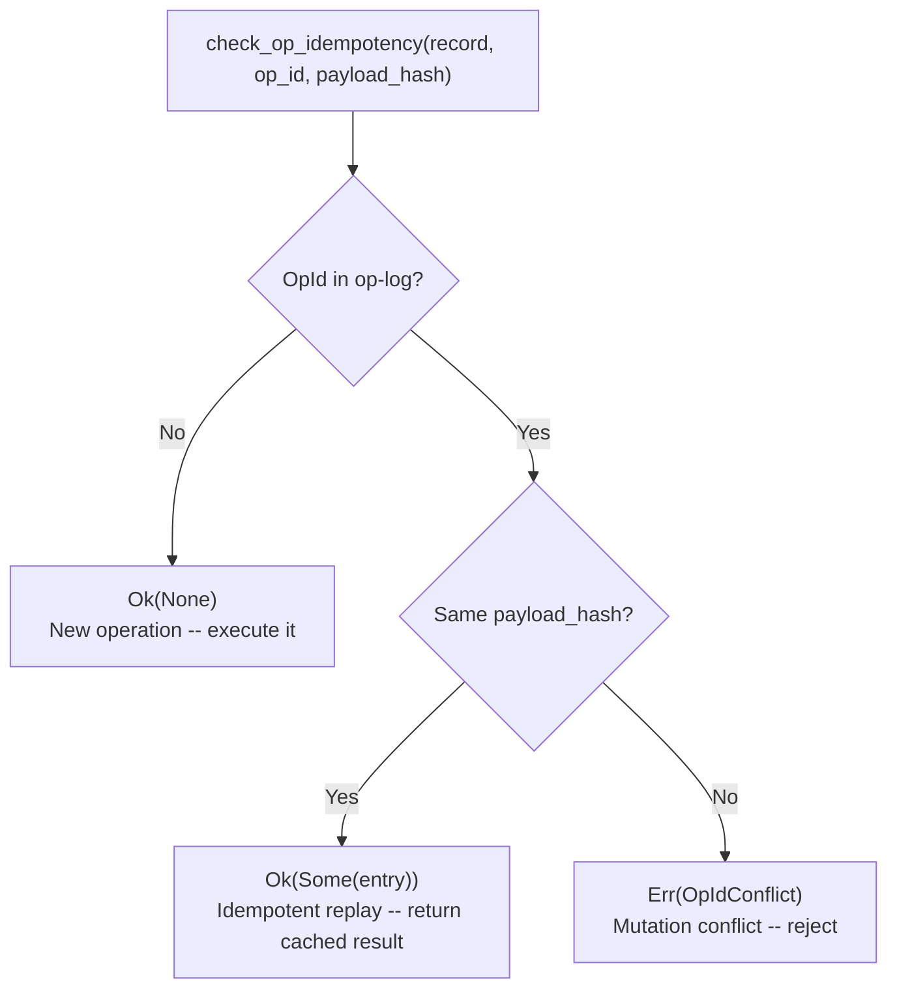
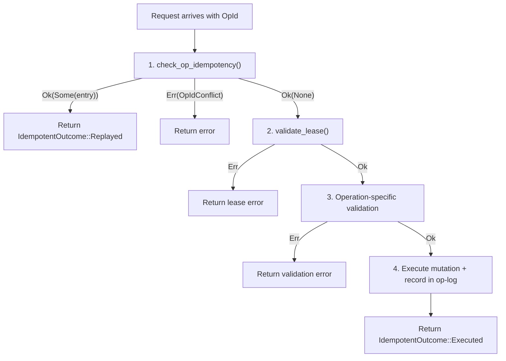
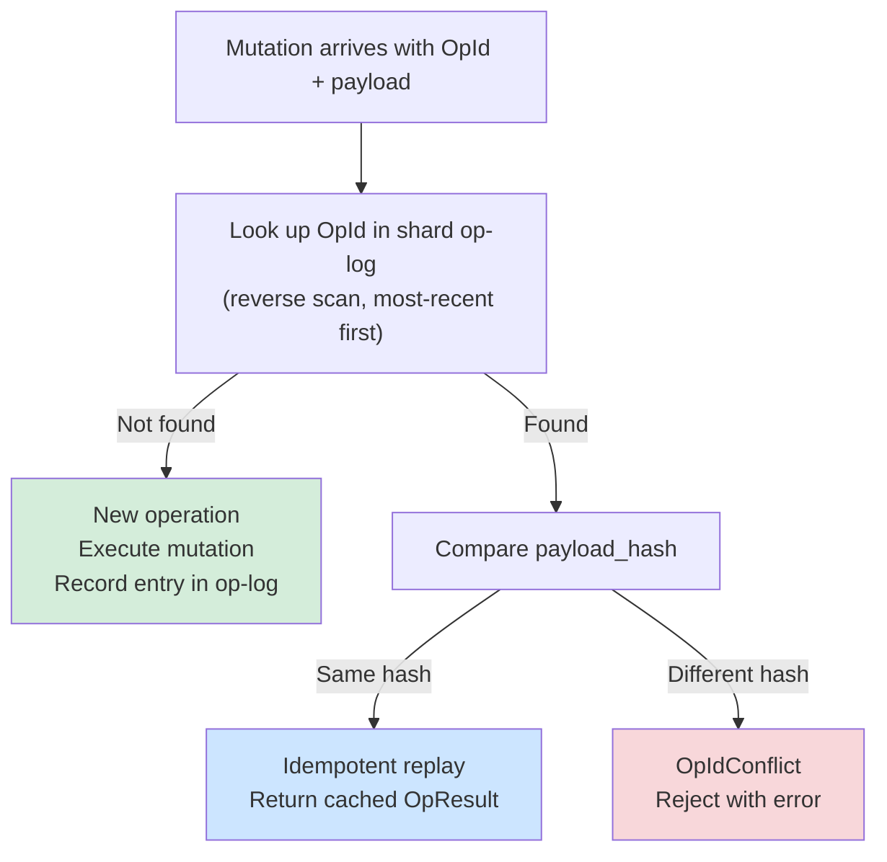

# Chapter 5: Safe Retries -- Idempotency and the Op-Log

*Worker A sends a checkpoint request. The network hiccups -- the response never arrives. Worker A waits for the timeout, then retries. But something subtle has changed: a bug in the retry logic constructs the cursor with slightly different parameters. The coordinator dutifully executes this "new" checkpoint. Now the shard's cursor has silently skipped forward past records that were never scanned. No error. No alarm. Just missing data, discovered weeks later during an audit.*

*Without idempotency, retries are indistinguishable from new operations. The coordinator cannot tell "I already did this" from "this is a fresh request." Every network failure becomes a potential data corruption event.*

---

## Why Retries Are Dangerous

Distributed systems guarantee exactly one thing about network calls: they might fail. Timeouts, packet drops, load balancer resets, TCP RST storms -- the list is long and the failures are frequent. The standard response is to retry. But retries introduce a fundamental ambiguity:

**Did the original request succeed or not?**

If it succeeded and the response was lost, retrying means executing the operation twice. For some operations (reading a value) that is harmless. For mutations (advancing a cursor, completing a shard, splitting a range), double execution can corrupt state.

The coordination protocol solves this with three mechanisms working together:

1. **OpId** -- a unique identifier for each operation attempt
2. **Payload hashing** -- a deterministic fingerprint of the operation parameters
3. **The op-log** -- a bounded ring buffer of recent operation results

Together, these allow the coordinator to distinguish three cases:
- This is a brand-new operation (execute it)
- This is a retry of an operation I already executed (return the cached result)
- This claims to be a retry, but the parameters are different (reject it)

## OpId: The Deduplication Key

Every mutating operation in the coordination protocol carries an `OpId` -- a 64-bit unique operation identifier. The `OpId` is generated by the worker before sending the request:

```rust
// From identity types
pub struct OpId(u64);
```

### Why CSPRNG Is Required

`OpId` values **must** be generated via a cryptographically secure pseudo-random number generator (CSPRNG), such as `rand::rngs::OsRng`, or through a coordinated counter with unique per-worker prefixes.

The reason is subtle but important: in a distributed system, multiple workers operate independently. If two workers use a simple counter starting from zero, Worker A's `OpId(7)` and Worker B's `OpId(7)` would collide. Even with random-but-weak generators, the birthday paradox makes accidental collisions likely across thousands of workers over millions of operations.

When an `OpId` collision occurs, the coordinator sees it as a retry with a different payload and rejects it with `OpIdConflict`. This is indistinguishable from a legitimate bug -- there is no way to tell "accidental collision from weak RNG" apart from "actual payload corruption." The operation fails with no path to recovery except generating a new `OpId` and retrying.

From the error module documentation:

> `OpId` values MUST be generated via a cryptographically secure PRNG (e.g., `rand::rngs::OsRng`) or a coordinated counter to prevent accidental collisions.

**Reference**: Stripe idempotency key pattern (Brandur Leach, 2017); IETF Draft: Idempotency-Key HTTP Header Field.

## OpLogEntry: The Fingerprint Record

Each executed operation is recorded in an `OpLogEntry`, stored in the shard record's op-log ring buffer:

```rust
// From lease.rs
#[derive(Clone, Copy, Debug, PartialEq, Eq)]
pub struct OpLogEntry {
    op_id: OpId,
    kind: OpKind,
    result: OpResult,
    payload_hash: u64,
    executed_at: LogicalTime,
}
```

Walk through each field:

### `op_id: OpId`

The deduplication key. When a new request arrives, the coordinator scans the op-log for a matching `OpId`. If found, the coordinator knows this is a retry (or a conflict) rather than a new operation.

### `kind: OpKind`

The type of operation that was executed. We will cover this in detail in the next section, but briefly: `Checkpoint`, `Complete`, `Park`, `SplitReplace`, `SplitResidual`, or `Unpark`.

### `result: OpResult`

The cached outcome. Three variants:

```rust
// From lease.rs
#[derive(Clone, Copy, Debug, PartialEq, Eq, Hash)]
#[repr(u8)]
pub enum OpResult {
    /// The operation executed successfully and the shard record was mutated.
    Completed = 0,

    /// The operation failed validation -- the shard record was **not** mutated.
    Error = 1,

    /// The operation was valid but was overtaken by a later mutation
    /// that makes it redundant.
    Superseded = 2,
}
```

`Completed` is the common case. `Error` is cached so that identical retries of a failing operation get the same error without re-validation.

`Superseded` handles a subtle case: imagine a checkpoint to position `f`, followed by a checkpoint to position `m`. If the first checkpoint is retried *after* the second succeeded, the coordinator could re-execute it and regress the cursor. Instead, it records the first as `Superseded` -- it was valid at the time, but a later operation made it redundant. The full doc comment explains:

> The operation was valid at the time of submission but was overtaken by
> a later mutation that makes it redundant. Example: a checkpoint whose
> cursor position was already advanced past by a subsequent checkpoint or
> complete. The shard's state is consistent but the specific mutation
> this entry records had no visible effect.

The three variants use `#[repr(u8)]` with persisted discriminants (Completed=0,
Error=1, Superseded=2), guarded by compile-time assertions like the other
persisted enums.

### `payload_hash: u64`

A deterministic fingerprint of the operation parameters, computed via domain-separated BLAKE3 (covered in detail below). This is the field that distinguishes "same operation, retried" from "different operation, accidentally using the same OpId."

The constructor enforces that `payload_hash` is never zero:

```rust
assert!(
    payload_hash != 0,
    "OpLogEntry payload_hash must be non-zero (indicates hashing failure)",
);
```

Zero is reserved as a sentinel indicating that the caller failed to compute a hash. This would break conflict detection entirely -- two operations with "hash = 0" would look identical regardless of their actual parameters.

### `executed_at: LogicalTime`

The logical timestamp at which the operation was executed. Used for observability and ordering diagnostics. Must be positive (greater than `LogicalTime::ZERO`).

### Construction Visibility

The constructor is `pub` -- the coordinator is the primary producer, but the
public visibility allows tests and snapshot consumers to construct entries:

```rust
pub fn new(
    op_id: OpId,
    kind: OpKind,
    result: OpResult,
    payload_hash: u64,
    executed_at: LogicalTime,
) -> Self { ... }
```

Workers receive entries indirectly through the `IdempotentOutcome` wrapper (covered in Chapter 6). They never construct or modify op-log entries directly.

## OpKind: The Operation Vocabulary

Every operation in the op-log carries an `OpKind` discriminant:

```rust
// From lease.rs
#[derive(Clone, Copy, Debug, PartialEq, Eq, Hash)]
#[repr(u8)]
pub enum OpKind {
    /// Save scan progress without changing shard status.
    Checkpoint = 0,

    /// Mark the shard as fully processed (Active -> Done).
    Complete = 1,

    /// Suspend the shard due to an error (Active -> Parked).
    Park = 2,

    /// Replace the parent shard with N children (Active -> Split).
    SplitReplace = 3,

    /// Shrink current shard and create a residual (parent stays Active).
    SplitResidual = 4,

    /// Administrative: resume a parked shard (Parked -> Active).
    Unpark = 5,
}
```

The relationship between each `OpKind`, the resulting status change, and whether a lease is required:

| OpKind          | Status change               | Lease required? |
|-----------------|-----------------------------|-----------------|
| `Checkpoint`    | none (cursor advances)      | yes             |
| `Complete`      | Active -> Done              | yes             |
| `Park`          | Active -> Parked            | yes             |
| `SplitReplace`  | Active -> Split             | yes             |
| `SplitResidual` | none (parent stays Active)  | yes             |
| `Unpark`        | Parked -> Active (admin)    | no              |

Note that `Unpark` is the only operation that does not require a lease. It is an administrative escape hatch -- the coordinator may unpark a shard without the worker that originally parked it. Unparking bumps the fence epoch, ensuring any zombie worker from a prior lease cannot interfere.

### Discriminant Stability

The `#[repr(u8)]` discriminant values are persisted in the op-log. The codebase enforces stability with compile-time assertions:

```rust
const _: () = assert!(OpKind::Checkpoint as u8 == 0);
const _: () = assert!(OpKind::Complete as u8 == 1);
const _: () = assert!(OpKind::Park as u8 == 2);
const _: () = assert!(OpKind::SplitReplace as u8 == 3);
const _: () = assert!(OpKind::SplitResidual as u8 == 4);
const _: () = assert!(OpKind::Unpark as u8 == 5);
const _: () = assert!(core::mem::size_of::<OpKind>() == 1);
```

If someone were to reorder the variants or add a new one in the middle, these assertions would fire at compile time, preventing silent data corruption in persisted op-logs.

## The 16-Entry Ring Buffer

The op-log is not an unbounded log. It is a fixed-size ring buffer with 16 entries:

```rust
// From record.rs
impl ShardRecord {
    /// Maximum number of retained op-log entries.
    ///
    /// 16 is enough to cover several rounds of retries. The op-log is
    /// a short-term idempotency window, not a permanent audit log.
    pub const OP_LOG_CAP: usize = 16;
}
```

The shard record stores the ring buffer directly:

```rust
pub op_log: RingBuffer<OpLogEntry, { ShardRecord::OP_LOG_CAP }>,
```

### Push with FIFO Eviction

When a new operation is recorded and the buffer is full, the oldest entry is evicted:

```rust
// From record.rs
pub fn op_log_push(&mut self, entry: OpLogEntry) {
    assert!(
        !self.op_log.iter().any(|e| e.op_id() == entry.op_id()),
        "Shard {:?}: attempt to push duplicate OpId {:?}",
        self.shard,
        entry.op_id(),
    );
    self.op_log.push_back_overwrite(entry);
    // Defense-in-depth: RingBuffer enforces capacity structurally, but
    // this assertion catches corruption before persistence.
    assert!(self.op_log.len() <= Self::OP_LOG_CAP);
}
```

Key points about this implementation:

1. **Duplicate rejection**: Before pushing, the method asserts that the `OpId` is not already in the log. Callers must check `op_log_lookup` first for idempotent replay. This is a programming error guard, not a protocol check.

2. **O(1) eviction**: `push_back_overwrite` is a ring buffer operation -- the oldest entry is silently overwritten. No shifting, no reallocation.

3. **Defense-in-depth**: The post-push assertion `self.op_log.len() <= Self::OP_LOG_CAP` is structurally guaranteed by the `RingBuffer` type, but the explicit check catches hypothetical corruption before the record is persisted.

### Why 16 Is Enough

The number 16 is chosen to cover several retry rounds of a single RPC. In practice:

- A typical retry policy attempts 3-5 retries per operation
- Between retries, the worker might execute 1-2 other operations (e.g., a checkpoint followed by a renewal)
- 16 entries cover approximately 3-4 complete retry cycles of interleaved operations

This is deliberately not a permanent record. The op-log is a short-term idempotency window.

### What Happens After Eviction

When an entry is evicted from the ring buffer, the coordinator can no longer detect that `OpId` as a retry. The evicted operation is treated as a new operation.

This is safe for three reasons, documented in the codebase:

1. **The cap covers several retry rounds** -- by the time an entry is evicted, the retry storm for that operation has long since resolved.

2. **Callers must generate unique, non-recycled `OpId` values** -- a properly generated CSPRNG `OpId` will never accidentally match an evicted entry.

3. **The fence epoch is the primary defense** -- the op-log is a *secondary* defense for in-lease retries. If a worker from a prior lease attempts to replay an evicted operation, the fence epoch check will reject it before the op-log is even consulted.

### Lookup with Reverse Scan

The lookup function scans the ring buffer in reverse order:

```rust
// From record.rs
pub fn op_log_lookup(&self, op: OpId) -> Option<&OpLogEntry> {
    debug_assert!(self.op_log.len() <= Self::OP_LOG_CAP);
    self.op_log.iter().rev().find(|e| e.op_id() == op)
}
```

Reverse iteration is an optimization: retries involve the most recent operations, so scanning from newest to oldest finds matches sooner. For a 16-entry buffer, this is at most 16 comparisons -- negligible cost, but the optimization reflects the design intent.

## check_op_idempotency(): The Decision Function

The core idempotency check is a pure function in `validation.rs`:

```rust
// From validation.rs
pub fn check_op_idempotency(
    record: &ShardRecord,
    op_id: OpId,
    payload_hash: u64,
) -> Result<Option<&OpLogEntry>, CoordError> {
    // Precondition: payload hash must be non-zero.
    assert!(
        payload_hash != 0,
        "check_op_idempotency: payload_hash must be non-zero"
    );

    let Some(entry) = record.op_log_lookup(op_id) else {
        return Ok(None);
    };

    if entry.payload_hash() == payload_hash {
        Ok(Some(entry))
    } else {
        Err(CoordError::OpIdConflict {
            op_id,
            expected_hash: entry.payload_hash(),
            actual_hash: payload_hash,
        })
    }
}
```

Three possible outcomes:



### Outcome 1: `Ok(None)` -- New Operation

The `OpId` was not found in the op-log. Either this is genuinely a new operation, or a very old retry whose entry was evicted. In either case, the coordinator executes the operation normally.

### Outcome 2: `Ok(Some(entry))` -- Idempotent Replay

The `OpId` was found and the `payload_hash` matches. This is a retry of an operation that already executed. The coordinator returns the cached `OpResult` without re-executing. The caller wraps this in `IdempotentOutcome::Replayed`.

### Outcome 3: `Err(OpIdConflict)` -- Mutation Conflict

The `OpId` was found but the `payload_hash` differs. This means the same `OpId` was used for two semantically different operations. This is always a client bug -- either the worker's retry logic mutated parameters between attempts, or two workers accidentally generated the same `OpId` (see the CSPRNG discussion above).

The error includes both hash values for diagnostics, but they are **redacted** in `Debug` and `Display` output to prevent oracle attacks on the payload hashing scheme:

```rust
Self::OpIdConflict { op_id, .. } => f
    .debug_struct("OpIdConflict")
    .field("op_id", op_id)
    .field("expected_hash", &"<redacted>")
    .field("actual_hash", &"<redacted>")
    .finish(),
```

## Payload Hashing: Domain-Separated BLAKE3

The `payload_hash` field is not a generic hash of "whatever bytes happen to be around." It is computed via **domain-separated BLAKE3**, where each operation type has its own tag that prevents cross-operation hash collisions.

### The Core Helper

```rust
// From split_execution.rs
pub fn op_payload_hash(
    op_tag: &[u8],
    write_fields: impl FnOnce(&mut Hasher),
) -> u64 {
    let mut h = OP_PAYLOAD_HASHER.clone();
    h.update(op_tag);
    write_fields(&mut h);
    finalize_64(&h)
}
```

The `OP_PAYLOAD_HASHER` is a cached BLAKE3 hasher initialized with the domain string `"OP_PAYLOAD_V1"`. Cloning it is cheap -- BLAKE3 hashers are designed for this pattern. The `op_tag` is a second domain-separation layer specific to each operation type.

### Per-Operation Hash Functions

Each operation type has a dedicated hash function:

**Checkpoint** -- hashes the new cursor:

```rust
pub fn hash_checkpoint_payload(new_cursor: &impl CanonicalBytes) -> u64 {
    op_payload_hash(b"checkpoint", |h| {
        new_cursor.write_canonical(h);
    })
}
```

**Complete** -- hashes the final cursor with a different domain tag:

```rust
pub fn hash_complete_payload(final_cursor: &impl CanonicalBytes) -> u64 {
    op_payload_hash(b"complete", |h| {
        final_cursor.write_canonical(h);
    })
}
```

**Park** -- hashes the `ParkReason`:

```rust
pub fn hash_park_payload(reason: ParkReason) -> u64 {
    op_payload_hash(b"park", |h| {
        reason.write_canonical(h);
    })
}
```

**Split-replace** -- hashes the full plan (child count + all child specs and cursors):

```rust
pub fn hash_split_replace_payload(plan: &SplitReplacePlan) -> u64 {
    op_payload_hash(b"split_replace", |h| {
        plan.write_canonical(h);
    })
}
```

**Split-residual** -- hashes both the parent's new spec and the residual spec:

```rust
pub fn hash_split_residual_payload(plan: &SplitResidualPlan) -> u64 {
    op_payload_hash(b"split_residual", |h| {
        plan.write_canonical(h);
    })
}
```

### Why Domain Separation Matters

Consider what happens without the `op_tag`:

- A checkpoint to cursor position `X` produces `hash(X)`
- A complete with final cursor position `X` also produces `hash(X)`

If a worker checkpoints with `OpId(42)` and then tries to complete with the same `OpId(42)` and the same cursor, the coordinator would see matching hashes and treat the complete as a replay of the checkpoint. The complete would never execute.

With domain tags, the checkpoint produces `hash("checkpoint" || X)` and the complete produces `hash("complete" || X)`. These are guaranteed to differ even for identical cursor values. The codebase enforces this with a property test:

```rust
// From split_execution.rs tests
#[test]
fn checkpoint_and_complete_hashes_differ(
    k in proptest::collection::vec(any::<u8>(), 1..64),
) {
    let c = CursorUpdate::with_last_key(&k);
    prop_assert_ne!(
        hash_checkpoint_payload(&c),
        hash_complete_payload(&c)
    );
}
```

This test generates random cursor values and asserts that checkpoint and complete hashes are always different -- for any cursor, across any number of random inputs. It is a property that holds universally, not just for a few test cases.

## Validation Composition Order

When a lease-gated mutation arrives (e.g., checkpoint, complete, park), the coordinator validates in a specific order:



**Idempotency is checked FIRST**, before lease validation. This ordering is critical.

Consider this scenario:
1. Worker A holds lease with fence epoch 5
2. Worker A sends a checkpoint with `OpId(100)`
3. The checkpoint succeeds and is recorded in the op-log
4. Worker A's lease expires
5. Worker B acquires the shard (fence epoch bumps to 6)
6. Worker A's response was lost, so Worker A retries with `OpId(100)`

If lease validation came first, the retry would fail with `StaleFence` (epoch 5 < current epoch 6). Worker A would think the checkpoint never happened and might take corrective action based on that false assumption.

With idempotency first, the coordinator finds `OpId(100)` in the op-log, verifies the payload hash matches, and returns the cached `Completed` result. Worker A learns that its checkpoint succeeded, even though its lease has since expired. This is the correct behavior.

The validation module documents this explicitly:

> Step 1 is checked first on every idempotent path so that a successful replay is never blocked by an expired lease or terminal status.

## CanonicalBytes: Deterministic Encoding for Hashing

The payload hash functions rely on `write_canonical()` calls to feed structured data into the BLAKE3 hasher. This uses the `CanonicalBytes` trait:

```rust
// From canonical.rs
pub trait CanonicalBytes {
    /// Write this value's canonical byte representation into `hasher`.
    fn write_canonical(&self, hasher: &mut Hasher);
}
```

The trait has three invariants:

1. **Collision-freedom**: For any two distinct values `a != b` of the same type, `a.write_canonical(h)` and `b.write_canonical(h)` must produce different byte sequences. Variable-length fields are length-prefixed; multi-field types use unambiguous framing.

2. **Determinism**: Output must be identical across platforms, byte orders, and Rust versions. Fixed-endian encoding (little-endian by convention).

3. **No allocation**: Implementations feed directly into the hasher. No intermediate `Vec<u8>` or `String` allocation.

Types that participate in payload hashing implement `CanonicalBytes`:

- `CursorUpdate` -- encodes its optional `last_key` with length prefix
- `ParkReason` -- encodes as its `u8` discriminant
- `ShardSpec` -- encodes key range start and end with length prefixes
- `SplitReplacePlan` -- length-prefixed child count, then each child's spec and cursor
- `SplitResidualPlan` -- parent new spec, then residual spec

The length-prefix requirement prevents a class of collision where concatenating fields produces ambiguous boundaries. For example, without length prefixes, `("ab", "cd")` and `("a", "bcd")` would produce the same byte stream `abcd`. With length prefixes, they produce `2ab2cd` and `1a3bcd` -- unambiguously different.

## Putting It All Together: A Checkpoint Retry

Let us trace a complete checkpoint flow to see how all these pieces interact.

**Step 1**: Worker generates `OpId` and computes payload hash.

```
op_id = OpId::from_csprng()       // e.g., OpId(0x7A3F...)
cursor = CursorUpdate::with_last_key(b"customer/42")
hash = hash_checkpoint_payload(&cursor)  // BLAKE3("OP_PAYLOAD_V1" || "checkpoint" || cursor_bytes)
```

**Step 2**: Worker sends checkpoint request to coordinator.

**Step 3**: Coordinator receives request and runs `check_op_idempotency`:

```
record.op_log_lookup(OpId(0x7A3F...)) -> None
// New operation. Proceed.
```

**Step 4**: Coordinator runs `validate_lease` -- tenant, terminal, fence, expiry, owner checks pass.

**Step 5**: Coordinator runs `validate_cursor_update_pooled` -- key present, monotonic, in bounds (borrows slab bytes directly).

**Step 6**: Coordinator applies the checkpoint:
- `record.cursor.update(&cursor, &mut self.slab)?`
- Pushes `OpLogEntry { op_id: 0x7A3F, kind: Checkpoint, result: Completed, payload_hash: hash, executed_at: now }` to the op-log.

**Step 7**: Response is sent but lost in transit.

**Step 8**: Worker retries with the same `OpId(0x7A3F...)` and the same cursor.

**Step 9**: Coordinator runs `check_op_idempotency`:

```
record.op_log_lookup(OpId(0x7A3F...)) -> Some(entry)
entry.payload_hash() == hash  -> true
// Idempotent replay. Return Ok(Some(entry)).
```

**Step 10**: Coordinator returns `IdempotentOutcome::Replayed(())`. The checkpoint was not re-executed, but the worker gets the same successful result.

**Alternate Step 8**: Worker retries with the same `OpId(0x7A3F...)` but a *different* cursor (bug in retry logic).

**Alternate Step 9**: Coordinator runs `check_op_idempotency`:

```
record.op_log_lookup(OpId(0x7A3F...)) -> Some(entry)
entry.payload_hash() != new_hash  -> true
// Conflict. Return Err(OpIdConflict).
```

The coordinator catches the mutation conflict and rejects the request. No silent data corruption.

## The Replay Detection Flow: A Visual Summary

The module-level documentation in `lease.rs` summarizes the complete replay detection flow:



The flow is the same for every operation type: checkpoint, complete, park, split-replace, and split-residual. Only the payload hash function differs. This uniformity is a deliberate design choice -- it means the idempotency mechanism can be tested once and relied upon everywhere.

## Security Considerations

### Hash Redaction in Error Messages

When an `OpIdConflict` error occurs, the `expected_hash` and `actual_hash` values are present in the error struct for internal diagnostics. But they are **redacted** in all external-facing representations:

```rust
// Debug output
OpIdConflict { op_id: OpId(42), expected_hash: "<redacted>", actual_hash: "<redacted>" }

// Display output
op-id conflict: OpId(42) reused with different payload
```

This prevents oracle attacks where an attacker could submit operations with crafted payloads and observe the hash values in error responses, gradually learning the hashing scheme or deriving collisions.

### OpId as Non-Secret Identifier

While `OpId` values must be unique and unpredictable (CSPRNG), they are not secret. They appear in error messages, logs, and diagnostics. The security property is **collision resistance**, not confidentiality. An attacker who learns an `OpId` cannot use it to replay operations -- the coordinator requires a valid lease (with fence epoch and deadline checks) for all lease-gated operations.

## Design Trade-offs

### Why Not an Unbounded Log?

An unbounded op-log would guarantee that every retry is caught, no matter how old. But it would also grow without limit, consuming memory proportional to the shard's lifetime. For a long-running scan with millions of checkpoints, this is untenable.

The 16-entry ring buffer is a deliberate trade-off: it covers the retry window for in-flight operations (which is all that matters for correctness) while using constant memory. The fence epoch provides the outer defense layer, catching zombie workers from prior leases regardless of op-log eviction.

The specific number 16 was chosen because:
- A typical retry policy sends 3-5 retries per failed operation
- Workers interleave operations (checkpoint, then renew, then checkpoint)
- 16 entries cover roughly 3-4 full retry cycles of interleaved operations
- Powers of two align well with the `RingBuffer` implementation, which requires `N > 0` and power-of-two capacity for O(1) index wrapping

### Why u64 Hashes Instead of Full BLAKE3 Output?

BLAKE3 produces 256-bit output. The payload hash is truncated to 64 bits via `finalize_64()`. This means there is a theoretical collision probability of ~1 in 2^64 for two different payloads to produce the same hash under the same domain tag.

For the coordination protocol, this is acceptable: a collision would cause the coordinator to treat a mutation conflict as a valid replay (or vice versa). The probability is negligible for operational workloads, and the consequence (a single missed conflict detection) is bounded to one shard and one operation.

The benefit is a halving of the `OpLogEntry` size (8 bytes vs 32 bytes for the hash field), which matters when 16 entries are stored inline in every shard record. With `OP_LOG_CAP = 16`, that is 16 * 24 bytes saved per shard record -- significant when the coordinator manages thousands of shards.

### Why Not Hash the OpKind Too?

The `OpKind` is stored separately in the `OpLogEntry` but is not part of the `payload_hash`. This is because the domain separation tags (`b"checkpoint"`, `b"complete"`, etc.) already encode the operation type into the hash. The `kind` field in the entry is for observability and diagnostics, not for deduplication.

### Why Idempotency Check Before Lease Validation?

This ordering choice deserves emphasis because it is counterintuitive. Most RPC systems validate authorization (lease) before checking for duplicates (idempotency). The coordination protocol reverses this order, and the reason is fundamental:

A replay represents an operation that **already succeeded**. The caller is asking "did my operation work?" If we check the lease first and the lease has expired (because the response was lost and time has passed), we would tell the caller "your lease is expired" -- which is technically true but operationally misleading. The caller would conclude that their operation failed and might take corrective action (e.g., re-acquiring the shard, re-scanning from the last checkpoint), wasting work that was already completed.

By checking idempotency first, we give the caller the correct answer: "your operation succeeded." The expired lease is irrelevant -- the operation is already done.

This is the same reasoning used by Stripe's idempotency key implementation: the idempotency check happens before authentication and rate limiting, because a replay should always return the cached result regardless of the caller's current authorization state.

---

**Next**: [Chapter 6: Finishing the Job -- Complete, Park, and Run Completion](06-completing-the-scan.md) covers how shards reach their terminal states and how the coordinator determines when an entire run is finished.

**Previous**: [Chapter 4: Acquiring and Scanning](04-acquiring-and-scanning.md) explained how the coordinator enforces forward progress within a shard's key range.

**Cross-references**:
- The fence epoch (Chapter 3) is the primary zombie defense; the op-log is secondary
- The `Lease` type (Chapter 3) is validated in step 2 of the composition order
- `CanonicalBytes` encodings for `CursorUpdate` and `ShardSpec` are defined in Chapter 4's coverage of the cursor and shard spec types
