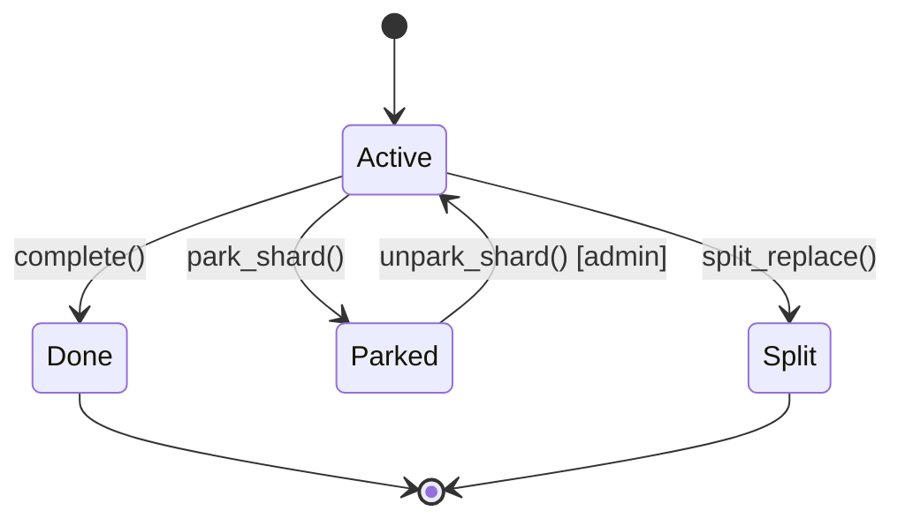
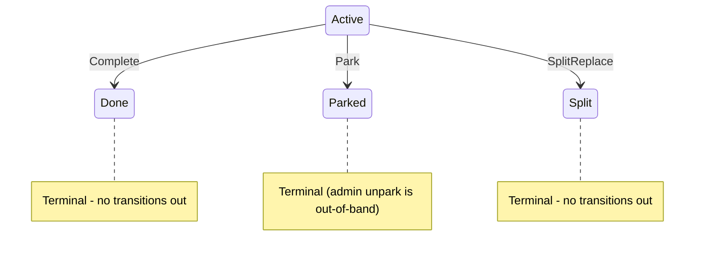
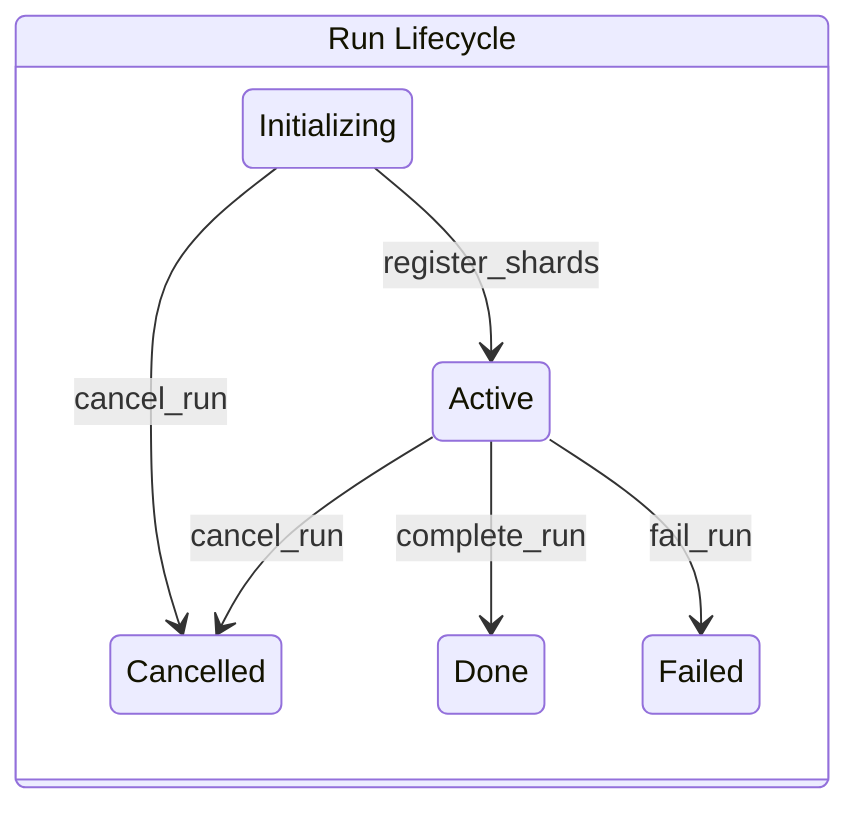

# Chapter 6: Finishing the Job -- Complete, Park, and Run Completion

*A worker is scanning a private GitHub repository when the access token expires. The API returns 403 Forbidden. The worker retries -- 403 again. And again. The shard stays Active, the lease keeps getting renewed, and the worker burns CPU on requests that will never succeed. Meanwhile, the 5,000 other shards in the run have finished. But the run cannot be marked complete because this one shard is stuck in an infinite retry loop. Without a mechanism to say "this shard is broken, move on," a single broken credential blocks the entire scan.*

*The coordination protocol needs two terminal operations: one for success ("I finished scanning my range") and one for failure ("I cannot continue, here is why"). And it needs a way to determine when the entire run -- all shards collectively -- has reached a final state.*

---

## The Two Ways a Shard Ends

Every shard eventually reaches one of three terminal states:

1. **Done** -- the worker scanned the entire key range successfully
2. **Parked** -- the worker encountered an error it cannot recover from
3. **Split** -- the shard was subdivided into children (covered in a separate chapter)

This chapter covers the first two: the `complete()` and `park_shard()` operations. Both are terminal transitions from `Active`, both release the lease, and both are idempotent via the op-log.



## complete(): Marking a Shard as Done

The `complete` method on the `CoordinationBackend` trait signals that a worker has finished scanning its assigned key range:

```rust
// From traits.rs
fn complete(
    &mut self,
    now: LogicalTime,
    tenant: TenantId,
    lease: &Lease,
    final_cursor: &CursorUpdate<'_>,
    op_id: OpId,
) -> Result<IdempotentOutcome<()>, CompleteError>;
```

The `final_cursor` records the worker's last position. It must satisfy the same constraints as a checkpoint cursor: monotonicity (cannot regress behind the current cursor) and bounds (must fall within the shard's `[spec.start, spec.end)` range).

### Behavior Step by Step

The coordinator processes a complete request through the following stages:

**1. Idempotency check (first)**

```
check_op_idempotency(record, op_id, hash_complete_payload(&final_cursor))
```

If the `OpId` is found with a matching payload hash, the coordinator returns `IdempotentOutcome::Replayed(())` immediately. This succeeds even if the lease has expired or the shard is already `Done` -- replays must never be blocked by post-execution state changes.

Note the hash function: `hash_complete_payload` uses the domain tag `b"complete"`, which is different from `hash_checkpoint_payload`'s tag `b"checkpoint"`. Even if `final_cursor` is identical to a previously checkpointed cursor, the hash values will differ, preventing cross-operation confusion.

**2. Validate lease**

```
validate_lease(now, tenant, lease, record)
```

The five-check cascade from Chapter 3: tenant isolation, terminal status, fence epoch, lease expiry, owner identity. If the shard is already terminal (e.g., previously completed by another worker who took over after lease expiry), this rejects with `ShardTerminal`.

**3. Apply cursor constraints**

```
validate_cursor_update_pooled(&final_cursor, record.cursor..., record.spec..., slab)
```

The final cursor must have a `last_key` (proving the worker processed at least some data), must not regress behind the current cursor, and must fall within the shard's key range. These are the same checks applied to checkpoints (Chapter 4). The `_pooled` variant borrows key bytes directly from the slab, avoiding per-call materialization of owned values.

**4. Apply state transition**

```
record.status = ShardStatus::Done
record.cursor.update(&final_cursor, &mut self.slab)?
record.lease = None  // release the lease
```

The status changes to `Done` (terminal). The cursor is updated to the final position. The lease is released -- no worker owns this shard anymore, and no worker can acquire it (terminal shards reject acquisition).

**5. Record in op-log**

```
record.op_log_push(OpLogEntry::new(
    op_id,
    OpKind::Complete,
    OpResult::Completed,
    hash_complete_payload(&final_cursor),
    now,
))
```

**6. Return**

```
Ok(IdempotentOutcome::Executed(()))
```

### Terminal Irreversibility

Once a shard reaches `Done`, no further mutations are accepted. The `assert_transition_legal` method enforces this:

```rust
// From record.rs
pub fn assert_transition_legal(&self, new_status: ShardStatus) {
    assert!(
        !self.status.is_terminal() || self.status == new_status,
        "Shard {:?}: illegal transition from terminal {:?} to {:?}",
        self.shard,
        self.status,
        new_status,
    );
}
```

A terminal shard can only "transition" to its own status (a no-op). Any other transition panics. This is a crash-to-prevent-corruption design: if something tries to mutate a `Done` shard, the coordinator panics before persisting, and crash-recovery restores the last valid state.

## park_shard(): Halting on Error

When a worker encounters an error it cannot recover from, it parks the shard:

```rust
// From traits.rs
fn park_shard(
    &mut self,
    now: LogicalTime,
    tenant: TenantId,
    lease: &Lease,
    reason: ParkReason,
    op_id: OpId,
) -> Result<IdempotentOutcome<()>, ParkError>;
```

### Behavior Step by Step

**1. Idempotency check (first)**

```
check_op_idempotency(record, op_id, hash_park_payload(reason))
```

Replay detection, same as complete. The domain tag is `b"park"`, and the payload is the `ParkReason` discriminant.

**2. Validate lease**

```
validate_lease(now, tenant, lease, record)
```

Same five-check cascade.

**3. Apply state transition**

```
record.status = ShardStatus::Parked
record.park_reason = Some(reason)
record.lease = None  // release the lease
```

No cursor update -- parking preserves the cursor at its current position. When (if) the shard is unparked later, scanning resumes from where it left off.

**4. Record in op-log**

```
record.op_log_push(OpLogEntry::new(
    op_id,
    OpKind::Park,
    OpResult::Completed,
    hash_park_payload(reason),
    now,
))
```

**5. Return**

```
Ok(IdempotentOutcome::Executed(()))
```

### No Cursor Validation

Unlike `complete`, `park_shard` does not validate the cursor. There is no `final_cursor` parameter. The worker is saying "I cannot continue" -- it would be unreasonable to require it to provide a valid final position in the range it failed to process.

## ParkReason: The Error Taxonomy

The `ParkReason` enum captures *why* a shard was parked. These are coordination-level categories, not detailed error descriptions:

```rust
// From record.rs
#[derive(Clone, Copy, Debug, PartialEq, Eq, Hash)]
#[repr(u8)]
pub enum ParkReason {
    /// The connector lacks permission to access the scan target.
    /// Likely requires credential rotation or access grant before unpark.
    PermissionDenied = 0,

    /// The scan target no longer exists (deleted repo, removed file).
    /// May be permanent; unpark only after confirming target exists.
    NotFound = 1,

    /// The shard's state or data is internally inconsistent.
    /// Requires manual investigation before unpark.
    Poisoned = 2,

    /// Too many transient errors accumulated during processing.
    /// May resolve on its own; suitable for time-delayed auto-retry.
    TooManyErrors = 3,

    /// Catch-all for reasons not covered by other variants.
    /// Coordination backend should log additional context separately.
    Other = 4,
}
```

Each variant carries operational implications:

| Variant           | Root Cause                    | Recovery Path                       | Auto-retry? |
|-------------------|-------------------------------|-------------------------------------|-------------|
| `PermissionDenied`| Expired or insufficient creds | Rotate credentials, then unpark     | No          |
| `NotFound`        | Target deleted or moved       | Verify target exists, then unpark   | No          |
| `Poisoned`        | Internal inconsistency        | Manual investigation required       | No          |
| `TooManyErrors`   | Transient failures accumulated| Wait for conditions to improve      | Yes         |
| `Other`           | Uncategorized                 | Check logs for context              | Maybe       |

The distinction between `PermissionDenied` and `TooManyErrors` is operationally significant. A 403 Forbidden is not going to resolve itself -- retrying without credential rotation wastes resources. But a burst of 500 Internal Server errors from an overloaded upstream might resolve after a cooldown. The `TooManyErrors` variant is the only one where automated time-delayed unpark is appropriate.

### Invariant: park_reason Consistency

The shard record enforces a strict biconditional:

- `status == Parked` implies `park_reason.is_some()`
- `status != Parked` implies `park_reason.is_none()`

This is checked by `assert_invariants()` (INV-1) and will panic if violated:

```rust
// From record.rs, assert_lifecycle_invariants
match self.status {
    ShardStatus::Parked => {
        assert!(
            self.park_reason.is_some(),
            "Parked shard {:?} must have park_reason",
            self.shard,
        );
    }
    _ => {
        assert!(
            self.park_reason.is_none(),
            "Non-parked shard {:?} (status: {:?}) must not have park_reason",
            self.shard,
            self.status,
        );
    }
}
```

A `Parked` shard without a reason would leave operators with no diagnostic information. An `Active` shard with a reason would suggest it was parked when it was not. Both are bugs, and both are caught before persistence.

## Unpark: The Admin Escape Hatch

Parking is terminal within the coordination protocol -- no protocol operation changes a `Parked` shard's status. But there is an **administrative** operation to resume a parked shard:

```rust
// From the RunManagement trait in run.rs
fn unpark_shard(
    &mut self,
    now: LogicalTime,
    tenant: TenantId,
    key: ShardKey,
    op_id: OpId,
) -> Result<IdempotentOutcome<()>, UnparkError>;
```

Key differences from protocol operations:

1. **Not lease-gated**: Unpark does not require a `Lease`. The coordinator may unpark a shard without the worker that originally parked it. This is intentional -- the original worker may have crashed, and the admin needs to recover the shard.

2. **Bumps fence epoch**: Unparking increments the fence epoch, fencing any zombie worker that might still hold a reference to the old shard state.

3. **Clears park state**: Sets `status = Active`, `park_reason = None`.

4. **Preserves cursor**: The cursor stays at whatever position it was at when the shard was parked. Scanning resumes from there.

5. **Lives in `RunManagement`**: Unpark is on the `RunManagement` trait, not the `CoordinationBackend` trait. This reflects a different authorization model -- it is an admin/scheduler operation, not a worker operation.

6. **Idempotent via shard op-log**: Unlike other run-level operations that use the run op-log, unpark stores its idempotency entries in the shard's op-log. This is because unpark targets a specific shard, and the run op-log would need a keying scheme to distinguish `unpark(shard_A)` from `unpark(shard_B)`.

The `OpKind::Unpark` variant reflects this in the status change table:

```
Unpark: Parked -> Active (admin), no lease required
```

## Terminal State Transitions: Only from Active

The coordination protocol enforces a strict rule: **all status transitions originate from `Active`**.



`Done`, `Split`, and `Parked` cannot transition to any other state within the protocol. The `assert_transition_legal` method on `ShardRecord` enforces this at runtime:

```rust
pub fn assert_transition_legal(&self, new_status: ShardStatus) {
    assert!(
        !self.status.is_terminal() || self.status == new_status,
        "Shard {:?}: illegal transition from terminal {:?} to {:?}",
        self.shard,
        self.status,
        new_status,
    );
}
```

This assertion is called before every status mutation. If something attempts to transition a `Done` shard to `Active`, the coordinator panics -- crash-to-prevent-corruption.

The admin unpark is explicitly outside this rule. It modifies the record's status directly (from `Parked` to `Active`) with its own validation, and bumps the fence epoch to invalidate any stale references.

### Why Terminal Shards Release Their Lease

When a shard becomes `Done`, `Parked`, or `Split`, the lease is set to `None`. This is enforced by invariant INV-3:

```rust
// INV-3: Terminal shards must not hold a lease.
if self.status.is_terminal() {
    assert!(
        self.lease.is_none(),
        "Terminal shard {:?} (status: {:?}) must not have a lease",
        self.shard,
        self.status,
    );
}
```

The reasoning: a lease grants exclusive mutation rights. A terminal shard accepts no mutations. Holding a lease on a terminal shard would prevent that lease slot from being reclaimed while providing no value.

## Run Terminal Evaluation

Individual shards reaching terminal states is not enough. The coordinator needs to determine when the **entire run** -- the collection of all shards -- has finished. This is the job of `evaluate_run_terminal`.

### RunProgress: Counting Shard States

First, the coordinator computes a progress snapshot:

```rust
// From run.rs
pub struct RunProgress {
    pub total: u32,
    pub active: u32,
    pub done: u32,
    pub split: u32,
    pub parked: u32,
    /// Subset of `active`: shards currently held by a worker lease.
    pub leased: u32,
    /// Lexicographic minimum cursor.last_key among Active shards
    /// with non-initial cursors. Tracks in-flight progress only.
    pub watermark: Option<FixedBuf<MAX_KEY_SIZE>>,
}
```

This counts how many shards are in each state. The `total` field is the sum of all states. The `leased` field is a subset of `active` -- it tells the coordinator how many active shards are currently being worked on. The `watermark` tracks the lexicographic minimum `cursor.last_key` among Active shards with non-initial cursors, stored in a `FixedBuf<MAX_KEY_SIZE>` to avoid heap allocation. Note that the watermark is **not monotonic**: splits, unparks, and new shard activations can introduce Active shards with earlier cursor positions.

### RunTerminalEvaluation: The Three Outcomes

```rust
// From run.rs
pub enum RunTerminalEvaluation {
    /// At least one shard is still Active -- the run cannot terminate yet.
    StillActive,
    /// All shards settled with zero parked -- clean completion.
    AllDone,
    /// All shards settled but some are parked -- partial failure.
    HasFailures,
}
```

### The Evaluation Function

```rust
// From run.rs
pub fn evaluate_run_terminal(progress: &RunProgress) -> RunTerminalEvaluation {
    assert!(
        progress.total > 0,
        "evaluate_run_terminal called with zero-total progress"
    );
    if progress.active > 0 {
        RunTerminalEvaluation::StillActive
    } else if progress.parked > 0 {
        RunTerminalEvaluation::HasFailures
    } else {
        RunTerminalEvaluation::AllDone
    }
}
```

The logic is simple and intentionally so:

1. **Any shard still Active?** The run is not done. Wait.
2. **All shards settled, but some Parked?** The run has failures. The coordinator can transition to `Failed` (or the admin can unpark the stuck shards and try again).
3. **All shards Done or Split (none Parked)?** Clean completion. The coordinator can transition to `Done`.

Note that `Split` shards do not count as failures -- they were successfully subdivided and their children took over. The children may themselves be `Done`, `Parked`, or still `Active`, and they are included in the `total` count.

This function is a **pure function** that takes a progress snapshot and returns an evaluation. It is deliberately external to `RunRecord` -- the coordinator decides when and whether to auto-transition. The evaluation is advisory; the transition itself happens through explicit `complete_run`, `fail_run`, or `cancel_run` calls.

### The RunManagement Trait: Terminal Transitions

The `RunManagement` trait provides three methods for transitioning a run to terminal state:

**complete_run** -- marks the run as Done:

```rust
fn complete_run(
    &mut self,
    now: LogicalTime,
    tenant: TenantId,
    run: RunId,
    op_id: OpId,
) -> Result<IdempotentOutcome<()>, RunTransitionError>;
```

Precondition: the run must be `Active`. Idempotent via `op_id`. This is called when the coordinator determines (via `evaluate_run_terminal` returning `AllDone`) that all shards have completed successfully.

**fail_run** -- marks the run as Failed:

```rust
fn fail_run(
    &mut self,
    now: LogicalTime,
    tenant: TenantId,
    run: RunId,
    op_id: OpId,
) -> Result<IdempotentOutcome<()>, RunTransitionError>;
```

Precondition: the run must be `Active` (not `Initializing`). This is called when parked shards indicate unrecoverable failures. Note that `Initializing` runs cannot fail -- use `cancel_run` instead.

**cancel_run** -- marks the run as Cancelled:

```rust
fn cancel_run(
    &mut self,
    now: LogicalTime,
    tenant: TenantId,
    run: RunId,
    op_id: OpId,
) -> Result<IdempotentOutcome<()>, RunTransitionError>;
```

Accepts both `Initializing` and `Active` runs. This is the broadest transition -- it works in any non-terminal state.



All three are idempotent via `op_id`, using the run-level op-log (separate from the per-shard op-log).

### The Two-Level Op-Log Architecture

It is worth pausing to note that the system has two separate op-logs:

1. **Shard op-log**: 16-entry ring buffer per shard, stores `OpLogEntry` with `OpKind` variants (Checkpoint, Complete, Park, SplitReplace, SplitResidual, Unpark). Used by `CoordinationBackend` trait methods.

2. **Run op-log**: 8-entry ring buffer per run, stores `RunOpLogEntry` with `RunOpKind` variants (RegisterShards, CompleteRun, FailRun, CancelRun). Used by `RunManagement` trait methods.

The two logs serve the same purpose (idempotent replay) but at different granularities. Shard operations are high-frequency (many checkpoints per second across all workers), while run operations are low-frequency (a few transitions across the run's lifetime).

The `unpark_shard` method is the one exception that crosses this boundary: it is a `RunManagement` method but stores its idempotency in the *shard* op-log. This is because unpark targets a specific shard (identified by `ShardKey`), and the run op-log has no shard-level keying.

## IdempotentOutcome: Executed vs. Replayed

Every idempotent operation returns its result wrapped in `IdempotentOutcome`:

```rust
// From error.rs
#[derive(Clone, Debug, PartialEq, Eq)]
#[non_exhaustive]
pub enum IdempotentOutcome<T> {
    /// The operation was executed for the first time.
    Executed(T),
    /// The operation was a retry -- result replayed from op-log.
    Replayed(T),
}
```

The inner value `T` is the same regardless of which variant wraps it. For `complete`, `park_shard`, and the run transition methods, `T` is `()` -- there is no meaningful return data beyond "it worked." For split operations, `T` carries the newly created shard IDs.

### Why Distinguish Executed from Replayed?

Most callers do not need to distinguish -- the `into_inner()` method extracts the value regardless:

```rust
impl<T> IdempotentOutcome<T> {
    pub fn into_inner(self) -> T {
        match self {
            Self::Executed(v) | Self::Replayed(v) => v,
        }
    }
}
```

The distinction exists for **observability**:

- **Metrics**: Track retry rates. If `is_replay()` is true for 50% of requests, the system has a retry storm that should be investigated.
- **Logging**: Flag unexpected replays. A `Replayed` result for an operation the caller does not remember sending might indicate a duplicate delivery bug in the transport layer.

```rust
impl<T> IdempotentOutcome<T> {
    pub fn is_replay(&self) -> bool {
        matches!(self, Self::Replayed(_))
    }

    pub fn is_executed(&self) -> bool {
        matches!(self, Self::Executed(_))
    }

    pub fn map<U>(self, f: impl FnOnce(T) -> U) -> IdempotentOutcome<U> {
        match self {
            Self::Executed(v) => IdempotentOutcome::Executed(f(v)),
            Self::Replayed(v) => IdempotentOutcome::Replayed(f(v)),
        }
    }
}
```

The `map` method preserves the `Executed`/`Replayed` distinction while transforming the inner value -- useful when the coordinator needs to post-process the result (e.g., converting shard IDs to a different format) without losing the execution-path metadata.

## End-to-End: A Shard's Complete Lifecycle

Let us trace a shard from creation through completion, touching every concept from this chapter and the previous ones.

**1. Run creation and shard registration**

The scheduler creates a run and registers shard S1 with key range `[a, z)`. S1 starts as `Active` with `Cursor::initial()` and `FenceEpoch::INITIAL`.

**2. Worker A acquires S1**

`acquire_and_restore_into` bumps the fence epoch to 2, grants a lease with a 30-tick deadline, and returns a snapshot of S1's state (including the initial cursor).

**3. Worker A scans and checkpoints**

Worker A processes keys `a` through `f`, then calls `checkpoint` with `OpId(101)` and `Cursor::with_last_key(b"f")`. The coordinator validates the cursor (monotonic, in bounds), updates the record, and pushes an op-log entry.

**4. Worker A encounters a 403**

The API returns 403 Forbidden on key `g`. Worker A decides this is not transient.

**5. Worker A parks the shard**

Worker A calls `park_shard` with `OpId(102)` and `ParkReason::PermissionDenied`. The coordinator:
- Checks idempotency (`OpId(102)` not in log -- new operation)
- Validates the lease (valid)
- Sets `status = Parked`, `park_reason = Some(PermissionDenied)`
- Releases the lease
- Records `OpKind::Park` in the op-log

**6. Admin investigates**

An operator sees the parked shard in the dashboard, rotates the credential, and calls `unpark_shard` with `OpId(201)`. The coordinator:
- Bumps the fence epoch to 3 (invalidating Worker A's old lease reference)
- Sets `status = Active`, `park_reason = None`
- Records `OpKind::Unpark` in the shard op-log

**7. Worker B acquires S1**

Worker B calls `acquire_and_restore_into`. The fence epoch bumps to 4. Worker B gets a snapshot showing `cursor = Cursor::with_last_key(b"f")` -- scanning resumes from where Worker A left off, not from the beginning.

**8. Worker B scans to completion**

Worker B processes keys `f` through `y`, then calls `complete` with `OpId(301)` and `Cursor::with_last_key(b"y")`. The coordinator:
- Checks idempotency (`OpId(301)` not in log -- new operation)
- Validates the lease (valid)
- Validates the cursor (`y` > `f`, `y` in `[a, z)`)
- Sets `status = Done`, `cursor = Cursor::with_last_key(b"y")`
- Releases the lease
- Records `OpKind::Complete` in the op-log

**9. The response is lost**

Worker B retries with the same `OpId(301)` and the same cursor. The coordinator:
- Checks idempotency -- finds `OpId(301)` with matching payload hash
- Returns `IdempotentOutcome::Replayed(())`

Worker B receives confirmation that the completion succeeded.

**10. Run evaluation**

The scheduler calls `get_run_progress`, which returns:

```
RunProgress { total: 1, active: 0, done: 1, split: 0, parked: 0, leased: 0 }
```

```
evaluate_run_terminal(&progress) -> AllDone
```

The scheduler calls `complete_run` with its own `OpId`. The run transitions to `Done`. The scan is finished.

## The Distinction Between complete and checkpoint

At first glance, `complete` and `checkpoint` look similar: both advance the cursor and both are idempotent. The critical differences are:

| Property           | `checkpoint`                          | `complete`                            |
|--------------------|---------------------------------------|---------------------------------------|
| Status change      | None (stays Active)                   | Active -> Done (terminal)             |
| Lease after call   | Retained                              | Released                              |
| Further mutations  | Allowed                               | Rejected (terminal)                   |
| Purpose            | Persist intermediate progress         | Signal "I am finished"                |
| Cursor requirement | Must advance forward                  | Must advance forward                  |
| Domain tag         | `b"checkpoint"`                       | `b"complete"`                         |

The domain tag difference is crucial. A worker that checkpoints at position `y` and then completes at position `y` uses two different `OpId` values. Even if both cursors are identical byte-for-byte, the payload hashes will differ because of the domain tags, and the coordinator correctly treats them as distinct operations.

A common question: why require a `final_cursor` at all? Could the worker just say "I am done" without specifying where? The cursor serves two purposes:

1. **Audit trail**: The final cursor position proves how far the worker scanned. If the cursor is at position `y` but the range goes to `z`, an auditor knows keys in `[y, z)` might not have been fully processed.

2. **Consistency**: By applying the same monotonicity and bounds checks, the coordinator catches a class of bugs where the worker claims to be "done" but has not actually advanced past its last checkpoint. A completion with a cursor that regresses behind the current position is rejected, forcing the worker to either checkpoint forward or investigate the discrepancy.

## Design Discussion: Why Parking Is Not Automatic

The coordination protocol does not automatically park shards after N failures. The worker explicitly decides to park and chooses the reason. This is a deliberate design choice:

**The worker has context that the coordinator does not.** A 403 Forbidden is very different from a 500 Internal Server Error, but to the coordinator both are "the operation failed." The worker can distinguish between:
- A permanent credential issue (park with `PermissionDenied`)
- A transient server overload (retry a few more times, then park with `TooManyErrors`)
- A deleted repository (park with `NotFound`)
- A corrupt shard state (park with `Poisoned`)

Automatic parking would either be too aggressive (parking after the first error) or too lenient (retrying indefinitely before parking). By leaving the decision to the worker, the protocol allows flexible retry policies without hardcoding them into the coordination layer.

The `max_shard_retries` field in `RunConfig` provides a hint, but enforcement is the worker's responsibility, not the coordinator's.

## Error Types: Precision by Operation

The coordination protocol uses per-operation error types rather than a single mega-enum. `CompleteError` and `ParkError` accept different subsets of `CoordError` variants:

| `CoordError` variant   | `CompleteError` | `ParkError` |
|------------------------|:--------------:|:-----------:|
| `ShardNotFound`        | yes            | yes         |
| `TenantMismatch`       | yes            | yes         |
| `StaleFence`           | yes            | yes         |
| `LeaseExpired`         | yes            | yes         |
| `ShardTerminal`        | yes            | yes         |
| `OpIdConflict`         | yes            | yes         |
| `CursorRegression`     | yes            | --          |
| `CursorOutOfBounds`    | yes            | --          |
| `CursorKeyTooLarge`    | yes            | --          |
| `CursorTokenTooLarge`  | yes            | --          |
| `CheckpointMissingKey` | yes            | --          |
| `ResourceExhausted`    | yes            | --          |
| `SplitInvalid`         | --             | --          |
| `BackendError(InfraError)` | yes        | yes         |

`CompleteError` includes a `ResourceExhausted(SlabFull)` variant with a `From<SlabFull>` impl. This fires when the byte slab cannot satisfy an allocation request during cursor update (e.g., the new cursor key or token is larger than the previous one and needs a fresh slab slot). The error is recoverable -- the caller may retry after freeing slab space. `CheckpointError` has the same variant for the same reason.

`ParkError` excludes all cursor variants because parking does not advance the cursor. `CompleteError` includes them because the final cursor must satisfy monotonicity and bounds constraints. Neither includes `SplitInvalid` because neither is a split operation. Both carry a `BackendError(InfraError)` variant for infrastructure failures (e.g., network timeout, storage corruption); the `InfraError` enum classifies errors as `Transient` (retryable) or `Corruption` (permanent).

This precision means callers can match exhaustively on the error variants that are actually possible. A `ParkError` handler never needs to handle `CursorRegression` -- the type system guarantees it cannot occur.

The `From<CoordError>` impls enforce this at compile time. Adding a new `CoordError` variant triggers a compile error in every `From` impl, forcing a conscious decision about which operation error types should accept it.

## Summary: The Complete Termination Picture

The coordination protocol's termination model works at two levels:

**Shard level**: Each shard independently reaches a terminal state through worker-initiated operations (`complete`, `park_shard`, `split_replace`). Terminal shards release their leases and reject all future mutations. The admin `unpark_shard` operation is the only way to reverse a `Parked` state.

**Run level**: The coordinator evaluates the collective state of all shards via `evaluate_run_terminal`. When all shards have settled (no `Active` remaining), the evaluation determines whether the run succeeded (`AllDone`) or has failures (`HasFailures`). The coordinator then explicitly transitions the run via `complete_run`, `fail_run`, or `cancel_run`.

Both levels use idempotent operations with `OpId`-based replay detection. Both enforce terminal irreversibility (once `Done`, always `Done`). Both use crash-to-prevent-corruption invariant checking -- any violation panics before persistence.

The key insight is that these two levels are deliberately decoupled. A shard does not know or care about the run's state. A run does not directly trigger shard transitions. The coordinator is the bridge, using `RunProgress` snapshots to make run-level decisions based on the aggregate state of individual shards. This separation allows each level to be tested, reasoned about, and potentially replaced independently.

---

**Next**: The split operations chapter covers `split_replace` and `split_residual` -- the third terminal transition and the non-terminal range reduction.

**Previous**: [Chapter 5: Safe Retries -- Idempotency and the Op-Log](05-idempotency-and-op-log.md) explained the op-log, payload hashing, and the `check_op_idempotency` decision function.

**Cross-references**:
- Idempotency check ordering (Chapter 5) explains why replay detection runs before lease validation
- Fence epoch mechanics (Chapter 3) explain how `unpark_shard` invalidates zombie workers
- Cursor monotonicity (Chapter 4) defines the constraints that `complete`'s `final_cursor` must satisfy
- The `CanonicalBytes` trait (Chapter 5) explains how `ParkReason` is encoded for payload hashing
