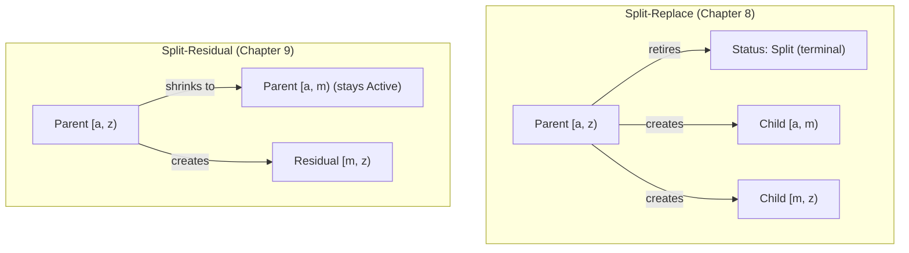

# Chapter 7: "The Unbounded Shard" -- Why Splits Exist and How Ranges Work

*A worker acquires a shard containing 1 million items. The lease window is 30 seconds. The worker begins scanning, but the scan takes over 5 minutes. The lease expires. Another worker acquires the same shard and begins scanning from the last checkpoint. It too runs out of time. And the next worker. And the next. The shard is too large for any single lease window to complete. Every acquisition ends in expiry. Every expiry resets the cycle. Progress is technically being made -- the cursor inches forward -- but the shard will not finish for hours or days, long after the run should have completed. The shard has become a bottleneck, not because any individual worker is slow, but because the unit of work is larger than the unit of time the system grants to process it.*

---

## 1. The Split Motivation

Range-sharded coordination systems face a universal problem: the distribution of work across shards is not uniform, and it changes over time. A shard that started with a manageable key range can grow to contain far more items than anticipated. When this happens, the system needs a mechanism to subdivide that shard into smaller pieces that workers can process within their lease windows.

Gossip-rs provides two split strategies:

- **Split-replace** (Chapter 8): The parent shard retires permanently. Two or more children replace it, collectively covering the parent's entire key range. This is the "even subdivision" strategy -- used when you want to partition a range into roughly equal pieces.

- **Split-residual** (Chapter 9): The parent shard stays active but shrinks its range. A single residual shard is created to cover what was carved off. This is the "surgical prefix offloading" strategy -- used when a worker has already scanned most of a shard and wants to hand off just the remaining tail.

Both strategies must maintain a foundational invariant: **the union of all active shards must cover the entire keyspace without gaps or overlaps.** A gap means items are invisible to every worker. An overlap means items are scanned twice. Either is a correctness failure.

Before we can understand split mechanics, we need to understand how shards describe their key ranges.

### When Splits Are Needed

Splits are triggered by two conditions, and in practice they often co-occur:

1. **Size imbalance**: A shard contains too many items to process in a single lease window. This is the opening scenario -- the scan takes longer than the lease allows, creating a perpetual timeout cycle.

2. **Distribution skew**: Some shards are much larger than others, causing workers to bottleneck on a few "hot" shards while others finish quickly. Splitting the large shards restores balance across the worker pool.

The coordinator does not decide *when* to split -- that decision is made by the worker or an external heuristic based on scan rate, item count, or elapsed time. The coordinator provides the *mechanism*: the ability to subdivide a shard's range while maintaining the invariant that the keyspace remains fully covered.

---

## 2. ShardSpec -- The Range Descriptor

Every shard carries a `ShardSpec` that answers the question: *what portion of the keyspace does this shard cover?*

Here is the complete struct from `shard_spec.rs`:

```rust
/// Shard specification with coordinator-visible key range bounds.
#[derive(Clone, Debug, PartialEq, Eq)]
pub struct ShardSpec {
    /// Inclusive lower bound of the key range.
    ///
    /// Empty (`[]`) means "start of keyspace."
    key_range_start: Box<[u8]>,

    /// Exclusive upper bound of the key range.
    ///
    /// Empty (`[]`) means "end of keyspace" (unbounded).
    key_range_end: Box<[u8]>,

    /// Connector-opaque metadata.
    ///
    /// Carries information the worker needs but the coordinator doesn't
    /// interpret: repository identifiers, authentication scopes, bucket
    /// names, connector-specific configuration, etc.
    metadata: Box<[u8]>,
}
```

Three fields. Two define a range. One carries opaque payload. Let us examine each.

### 2.1 Half-Open Interval `[start, end)`

The key range uses a **half-open interval** in lexicographic byte order:

```text
+-----------------------------------------------------+
|  start (inclusive)          end (exclusive)           |
|  |--------------------------|                        |
|  <-- this shard covers -->                           |
|                                                      |
|  Items with key k are in this shard iff:             |
|    start <= k < end    (lexicographic byte order)    |
+-----------------------------------------------------+
```

A key `k` belongs to this shard if and only if `start <= k < end` under lexicographic comparison of raw bytes.

**Empty start** (`[]`): The shard begins at the very start of the keyspace. An empty byte slice is lexicographically less than any non-empty byte slice.

**Empty end** (`[]`): The shard extends to the end of the keyspace. There is no upper bound.

A `ShardSpec` where both start and end are empty covers the entire keyspace -- this is the "unbounded" shard, created by `ShardSpec::unbounded()`.

### 2.2 Why Half-Open Intervals?

This convention is not arbitrary. It is the universal standard in range-sharded distributed systems:

| System | Range Notation | Reference |
|--------|----------------|-----------|
| **Bigtable** | `[startRow, endRow)` -- tablets as contiguous row ranges | Chang et al., OSDI 2006 |
| **Spanner** | Half-open key-range splits | Corbett et al., OSDI 2012 |
| **CockroachDB** | `[StartKey, EndKey)` ranges | CockroachDB documentation |
| **FoundationDB** | `[begin, end)` byte strings | Zhou et al., SIGMOD 2021 |

Half-open intervals have a critical algebraic property that makes them ideal for range partitioning: **adjacent ranges share a boundary without ambiguity.** If shard A covers `[a, m)` and shard B covers `[m, z)`, then every key falls into exactly one shard. The boundary key `m` is included in B (the next range) and excluded from A (the preceding range). There is no gap and no overlap.

With closed intervals `[a, m]` and `[m, z]`, the key `m` would belong to both shards. With open intervals `(a, m)` and `(m, z)`, the key `m` would belong to neither. Half-open intervals are the only convention that makes contiguous partitioning work without special-casing boundaries.

### 2.3 Size Limits

```rust
/// Maximum size of a shard-spec key (start or end) in bytes (4 KiB).
pub const MAX_KEY_SIZE: usize = 4_096;

/// Maximum size of shard-spec opaque metadata in bytes (16 KiB).
pub const MAX_METADATA_SIZE: usize = 16_384;
```

Keys are bounded at 4 KiB. This matches the cursor module's `MAX_KEY_SIZE` -- both operate in the same lexicographic keyspace. The bound prevents a single malformed key from consuming unbounded memory in the coordinator.

Metadata is bounded at 16 KiB. This carries connector-specific information: repository identifiers, authentication scopes, bucket names. Observed metadata sizes range from 200-500 bytes (TruffleHog connectors) to 2-4 KB (JWT tokens) to around 8 KB (configuration drift payloads). The 16 KiB ceiling provides 2x headroom over the worst observed case.

### 2.4 Opaque Metadata

The `metadata` field is the coordinator's "don't ask, don't tell" field. The coordinator stores it, includes it in canonical hashing for idempotency, and returns it to workers on acquisition. But it never interprets the bytes. This separation of concerns means the coordination protocol is connector-agnostic -- the same split mechanics work whether you are scanning Git repositories, S3 buckets, or Kafka topics.

### 2.5 Encapsulation and Borrowed Views

Notice that all three fields are private. The `ShardSpec` (owned) and `ShardSpecRef<'a>` (borrowed) types both provide constructors that enforce the well-formed range invariant at construction time. The borrowed `ShardSpecRef<'a>` is the zero-allocation counterpart used on hot paths where callers already hold byte slices (e.g., from slab-backed storage):

```rust
pub fn with_range_and_metadata(
    start: impl AsRef<[u8]>,
    end: impl AsRef<[u8]>,
    metadata: impl AsRef<[u8]>,
) -> Self {
    let start = start.as_ref();
    let end = end.as_ref();
    let metadata = metadata.as_ref();
    assert!(
        start.len() <= MAX_KEY_SIZE,
        "ShardSpec: key too large ({} bytes, max {MAX_KEY_SIZE})",
        start.len(),
    );
    assert!(
        end.len() <= MAX_KEY_SIZE,
        "ShardSpec: key too large ({} bytes, max {MAX_KEY_SIZE})",
        end.len(),
    );
    assert!(
        metadata.len() <= MAX_METADATA_SIZE,
        "ShardSpec: metadata too large ({} bytes, max {MAX_METADATA_SIZE})",
        metadata.len(),
    );
    if !start.is_empty() && !end.is_empty() {
        assert!(
            start < end,
            "ShardSpec: start must be strictly less than end \
             (start: {} bytes, end: {} bytes)",
            start.len(),
            end.len(),
        );
    }
    Self {
        key_range_start: start.into(),
        key_range_end: end.into(),
        metadata: metadata.into(),
    }
}
```

> **Note:** The code above shows the *owned* `ShardSpec::with_range_and_metadata` constructor, which accepts `impl AsRef<[u8]>` parameters and stores the result as `Box<[u8]>`. The borrowed `ShardSpecRef::with_range_and_metadata` takes `&'a [u8]` slices directly and returns a zero-copy view with no heap allocation. Both enforce the same invariants.

The `impl AsRef<[u8]>` parameters accept `Vec<u8>`, `&[u8]`, `[u8; N]`, and other byte-like types without requiring callers to convert explicitly. The invariant check `start < end` only fires when both bounds are non-empty. An empty start or empty end represents an unbounded edge, which is always valid -- a range from "the beginning" to some point, or from some point to "the end", is inherently well-formed.

There is also a fallible constructor `try_with_range_and_metadata` that returns `Result<Self, ShardSpecInputError>` instead of panicking, used in code paths where construction failure is expected (user input validation, fuzzing):

```rust
pub fn try_with_range_and_metadata(
    start: impl AsRef<[u8]>,
    end: impl AsRef<[u8]>,
    metadata: impl AsRef<[u8]>,
) -> Result<Self, ShardSpecInputError> {
    let start = start.as_ref();
    let end = end.as_ref();
    let metadata = metadata.as_ref();
    if start.len() > MAX_KEY_SIZE {
        return Err(ShardSpecInputError::KeyTooLarge {
            size: start.len(),
            max: MAX_KEY_SIZE,
        });
    }
    if end.len() > MAX_KEY_SIZE {
        return Err(ShardSpecInputError::KeyTooLarge {
            size: end.len(),
            max: MAX_KEY_SIZE,
        });
    }
    if metadata.len() > MAX_METADATA_SIZE {
        return Err(ShardSpecInputError::MetadataTooLarge {
            size: metadata.len(),
            max: MAX_METADATA_SIZE,
        });
    }
    if !start.is_empty() && !end.is_empty() && start >= end {
        return Err(ShardSpecInputError::InvertedRange {
            start_len: start.len(),
            end_len: end.len(),
        });
    }
    Ok(Self {
        key_range_start: start.into(),
        key_range_end: end.into(),
        metadata: metadata.into(),
    })
}
```

The error type `ShardSpecInputError` has three variants -- `InvertedRange`, `KeyTooLarge`, and `MetadataTooLarge` -- each carrying the specific measurements that caused the failure. This makes the error actionable: the caller knows exactly what to fix.

### 2.6 Canonical Hashing

`ShardSpec` implements `CanonicalBytes`, which provides deterministic serialization for hashing:

```rust
impl CanonicalBytes for ShardSpec {
    fn write_canonical(&self, h: &mut Hasher) {
        self.key_range_start.as_ref().write_canonical(h);
        self.key_range_end.as_ref().write_canonical(h);
        self.metadata.as_ref().write_canonical(h);
    }
}
```

All three fields participate in the canonical hash: `key_range_start`, `key_range_end`, and `metadata`. Each uses a 4-byte little-endian length prefix followed by the raw bytes. This means two `ShardSpec` values with the same range but different metadata produce different hashes -- important for idempotency, since the metadata is part of the shard's identity.

---

## 3. `contains_key()` -- Range Membership

The fundamental query on a `ShardSpec` is: does a given key belong to this shard?

```rust
pub fn contains_key(&self, key: &[u8]) -> bool {
    let above_start = self.is_start_unbounded() || key >= self.key_range_start.as_ref();

    let below_end = self.is_end_unbounded() || key < self.key_range_end.as_ref();

    above_start && below_end
}
```

Two checks, combined with AND:

1. **Above start**: If the start is unbounded (empty), the key is always above the start. Otherwise, the key must be `>=` the start (inclusive lower bound).

2. **Below end**: If the end is unbounded (empty), the key is always below the end. Otherwise, the key must be `<` the end (exclusive upper bound).

The implementation handles the four edge cases naturally:

| Start | End | Meaning | `contains_key` behavior |
|-------|-----|---------|------------------------|
| Empty | Empty | Entire keyspace | Always true |
| Empty | `m` | `[_, m)` | Only checks `key < m` |
| `a` | Empty | `[a, _)` | Only checks `key >= a` |
| `a` | `m` | `[a, m)` | Checks both bounds |

An empty key `[]` is at the very start of the keyspace -- lexicographically less than any non-empty key. This means `ShardSpec::unbounded().contains_key(&[])` returns `true`, and `ShardSpec::with_range(b"a".to_vec(), b"z".to_vec()).contains_key(&[])` returns `false` (the empty key is less than `"a"`).

This function is used in two critical paths during split operations:

1. **Cursor bounds validation**: When a residual split shrinks a parent's range, the coordinator checks `new_parent_spec.contains_key(cursor.last_key)` to ensure the cursor is not stranded outside the new range (Chapter 9).

2. **Coverage property tests**: Property-based tests verify the fundamental split invariant: for any key `k`, if `parent.contains_key(k)` is true, then exactly one child's `contains_key(k)` is true. The `contains_key` implementation is the oracle for these tests.

---

## 4. CursorSemantics

Before examining splits, we need one more type from `shard_spec.rs`. `CursorSemantics` is a per-run configuration that determines the strength of the progress guarantee:

```rust
/// Determines when cursor advancement counts as committed progress.
#[derive(Clone, Copy, Debug, PartialEq, Eq, Hash)]
#[repr(u8)]
pub enum CursorSemantics {
    /// Cursor advances only after work prior to the cursor is fully
    /// scanned and authoritative progress is committed.
    Completed = 0,

    /// Cursor advances after work prior to the cursor is durably
    /// dispatched to a separate work log. The work log is responsible
    /// for its own delivery guarantees.
    Dispatched = 1,
}
```

**`Completed`** is the strongest guarantee. The cursor only advances after all work up to that point is fully processed and results are durable. If the worker crashes after a checkpoint, no work is lost -- everything before the checkpoint was already committed.

**`Dispatched`** trades guarantee strength for throughput. The cursor advances after work is durably *dispatched* (e.g., enqueued to a separate processing pipeline) but not necessarily fully processed. This requires the dispatch target to provide its own exactly-once semantics.

The coordinator enforces cursor monotonicity and bounds checking identically under both semantics. The difference is in what the cursor position *means* -- a commitment about what has been fully processed versus what has been handed off.

The `u8` discriminants are persisted, so they carry a stability invariant enforced at compile time:

```rust
const _: () = assert!(CursorSemantics::Completed as u8 == 0);
const _: () = assert!(CursorSemantics::Dispatched as u8 == 1);
```

---

## 5. DerivedShardKind

When a split creates new shards, those shards need IDs. But the IDs cannot be externally assigned (there is no central ID allocator for split children). Instead, they are deterministically *derived* from the split context. The `DerivedShardKind` enum distinguishes the two roles a derived shard can play:

```rust
/// Distinguishes child shards from residual shards in ID derivation.
#[derive(Clone, Copy, Debug, PartialEq, Eq, Hash)]
#[repr(u8)]
pub enum DerivedShardKind {
    Child = 0,
    Residual = 1,
}
```

**Child**: Created by `split_replace`. The parent retires and children collectively replace its range.

**Residual**: Created by `split_residual`. The parent stays active with a smaller range; the residual covers the carved-off portion.

This enum participates in the hash derivation, ensuring that a child and a residual derived from the same parent, operation, and index produce different IDs.

---

## 6. `derive_split_shard_id()` -- Deterministic ID Derivation

Here is the complete implementation from `split_execution.rs`:

```rust
/// Deterministically derive a child/residual shard ID from the split context.
///
/// Uses domain-separated BLAKE3 (`SPLIT_ID_V1`) with five inputs:
/// `(run, parent, op, kind, index)`. The output has bit 63 set to mark
/// it as a derived ID -- distinguishing it from externally-assigned root
/// shard IDs.
pub fn derive_split_shard_id(
    run: RunId,
    parent: ShardId,
    op: OpId,
    kind: DerivedShardKind,
    index: u32,
) -> ShardId {
    let mut h = SPLIT_ID_HASHER.clone();
    run.write_canonical(&mut h);
    parent.write_canonical(&mut h);
    op.write_canonical(&mut h);
    kind.write_canonical(&mut h);
    index.write_canonical(&mut h);

    let id = finalize_64(&h) | (1u64 << 63);
    let result = ShardId::from_raw(id);
    assert!(result.is_derived(), "derived shard ID must have bit 63 set");
    assert!(result.as_raw() != 0, "derived shard ID must be non-zero");
    result
}
```

Let us walk through each part.

### 6.1 Domain-Separated BLAKE3

The function starts by cloning the cached `SPLIT_ID_HASHER`, which is a BLAKE3 hasher initialized in derive-key mode with the domain string `"gossip/coord/v1/split-id"`:

```rust
pub static SPLIT_ID_HASHER: LazyLock<Hasher> =
    LazyLock::new(|| Hasher::new_derive_key(domain::SPLIT_ID_V1));
```

BLAKE3's derive-key mode produces a context-dependent key schedule. Two hashers with different domain tags are cryptographically independent hash functions. This means even if the op-payload hashing (which uses domain `"gossip/coord/v1/op-payload"`) happens to receive the same byte sequence, it will produce a completely different output.

Cloning a pre-initialized hasher is cheaper than calling `Hasher::new_derive_key` from scratch -- the key-schedule setup is already done.

### 6.2 Five Inputs

The function feeds five values into the hasher using `CanonicalBytes` encoding (which provides length-prefixed, deterministic serialization):

1. **`run`** (`RunId`): Which scan run this split belongs to.
2. **`parent`** (`ShardId`): Which shard is being split.
3. **`op`** (`OpId`): Which operation triggered the split. Unique per operation invocation.
4. **`kind`** (`DerivedShardKind`): Whether this is a `Child` (split-replace) or `Residual` (split-residual).
5. **`index`** (`u32`): The position of this child within the split. For split-replace, this is `spawned.len() + i` where `i` is the child's sorted position. For split-residual, this is `spawned.len()`.

All five inputs contribute to the hash. Change any one, and the derived ID changes.

### 6.3 Bit 63 -- The Derived Flag

```rust
let id = finalize_64(&h) | (1u64 << 63);
```

The 64-bit BLAKE3 output has its most significant bit forcibly set. This creates a clean partition in the ID space:

- **Root shards** (externally assigned by the connector or registration API) have bit 63 clear.
- **Derived shards** (created by splits) have bit 63 set.

You can always tell whether a shard ID was split-derived just by inspecting bit 63. This is useful for debugging, auditing, and lineage tracking.

### 6.4 Collision Bound Analysis

With bit 63 forced to 1, the derived ID has 63 effective bits of entropy. The birthday collision bound -- the number of derived IDs before a 50% collision probability -- is approximately 2^31.5, or roughly 3 billion values.

Is this safe? Consider the bounds:

- `MAX_SPAWNED_PER_SHARD` is 1024 (the maximum children + residuals a single parent can produce).
- A run might have thousands of shards, each splitting a few times.
- Even with millions of derived IDs per run, we are far below the 2^31.5 birthday bound.

The coordinator also performs a defense-in-depth collision check at insertion time (returning `DerivedIdCollision` if the derived ID already exists in the shard map). But under normal operation, this check never fires.

### 6.5 Caller Responsibility: The Index Parameter

The `index` parameter must be `parent.spawned.len()` at call time (for residuals) or `parent.spawned.len() + i` (for children). Callers must not hardcode 0. The index ensures that successive splits of the same parent produce different IDs even with the same `OpId`.

This invariant is tested by property-based tests that verify distinct inputs always produce distinct outputs:

```rust
#[test]
fn derive_split_shard_id_collision_free(
    run_a in any::<u64>(), parent_a in any::<u64>(), op_a in any::<u64>(),
    kind_a in 0u8..2, index_a in any::<u32>(),
    run_b in any::<u64>(), parent_b in any::<u64>(), op_b in any::<u64>(),
    kind_b in 0u8..2, index_b in any::<u32>(),
) {
    let tuple_a = (run_a, parent_a, op_a, kind_a, index_a);
    let tuple_b = (run_b, parent_b, op_b, kind_b, index_b);
    prop_assume!(tuple_a != tuple_b);
    // ... derive both IDs, assert they differ
}
```

A companion test verifies determinism -- same inputs always produce the same output:

```rust
#[test]
fn derive_split_shard_id_derived_and_pure(
    run in any::<u64>(), parent in any::<u64>(), op in any::<u64>(),
    kind in 0u8..2, index in any::<u32>(),
) {
    let k = DerivedShardKind::from_u8(kind).unwrap();
    let a = derive_split_shard_id(RunId::from_raw(run), ShardId::from_raw(parent),
        OpId::from_raw(op), k, index);
    let b = derive_split_shard_id(RunId::from_raw(run), ShardId::from_raw(parent),
        OpId::from_raw(op), k, index);
    prop_assert!(a.is_derived());
    prop_assert_eq!(a, b);
}
```

Determinism is essential for idempotent replay: when a split is replayed, the coordinator must produce the same child IDs to return in the `Replayed` response.

---

## 7. Split Constants and Their Relationship

Two constants from `gossip-contracts/src/coordination/limits.rs` bound the
fan-out of split operations. These live in the `gossip-contracts` crate (not
the `gossip-coordination` crate) because they are part of the shared contract
that both planning and execution code depend on:

```rust
/// Maximum number of children in a single SplitReplace operation.
pub const MAX_SPLIT_CHILDREN: usize = 256;

/// Maximum total spawned shards per parent shard.
pub const MAX_SPAWNED_PER_SHARD: usize = 1024;
```

**`MAX_SPLIT_CHILDREN = 256`**: A single split-replace operation can produce at most 256 children. This prevents a single coordinator operation from creating an unbounded number of shards (resource exhaustion guard).

**`MAX_SPAWNED_PER_SHARD = 1024`**: A parent shard can accumulate at most 1024 spawned children across its entire lifetime. A parent that does four split-residual operations (creating 4 residuals) and then a split-replace into 8 children has 12 spawned entries total.

The relationship between these constants is enforced at compile time:

```rust
const _: () = assert!(MAX_SPLIT_CHILDREN <= MAX_SPAWNED_PER_SHARD);
const _: () = assert!(MAX_SPLIT_CHILDREN >= 2);
const _: () = assert!(MAX_SPAWNED_PER_SHARD > 0);
const _: () = assert!(MAX_SPAWNED_PER_SHARD <= u32::MAX as usize);
```

The first assertion is the key invariant: a single split operation can never exceed the total spawned capacity. The last assertion ensures the spawned count fits in a `u32`, which is the type of the `index` parameter in `derive_split_shard_id`.

The `ShardRecord` provides a convenience method `can_spawn(additional)` (defined
at `record.rs:953-955`) for checking the spawn limit before attempting a split:

```rust
pub fn can_spawn(&self, additional: usize) -> bool {
    self.spawned.len().saturating_add(additional) <= MAX_SPAWNED_PER_SHARD
}
```

This is used in split precondition validation to reject plans that would exceed
the capacity before performing any mutations.

---

## 8. The `SplitValidationError` Taxonomy

Before examining the validation logic (Chapters 8 and 9), it helps to see the complete error space. The coordinator rejects invalid splits with precise, structured errors:

> **Crate boundary:** `SplitValidationError` is defined in the `gossip_contracts`
> crate (`gossip_contracts::coordination::shard_spec::SplitValidationError`), not
> in the `gossip-coordination` crate. The coordination crate imports it via
> `use gossip_contracts::coordination::shard_spec::SplitValidationError;`
> (see `error.rs:83-85`). This placement reflects the design principle that
> split-plan validation is part of the contract layer (shared between backends),
> while the coordination crate wraps it as `CoordError::SplitInvalid(SplitValidationError)`.

```rust
#[derive(Clone, Debug, PartialEq, Eq)]
#[non_exhaustive]
pub enum SplitValidationError {
    /// No children were provided (need at least 2).
    NoChildren,

    /// A single child is not a split.
    SingleChild,

    /// First child's start doesn't match parent's start.
    StartMismatch {
        /// Length of the parent's start key in bytes.
        parent_start: usize,
        /// Length of the first child's start key in bytes.
        first_child_start: usize,
    },

    /// Last child's end doesn't match parent's end.
    EndMismatch {
        /// Length of the parent's end key in bytes.
        parent_end: usize,
        /// Length of the last child's end key in bytes.
        last_child_end: usize,
    },

    /// Boundary mismatch (gap or overlap) between adjacent children.
    BoundaryMismatch {
        child_index: usize,
        next_child_index: usize,
        /// Length of child_index's end key in bytes.
        child_end: usize,
        /// Length of next_child_index's start key in bytes.
        next_child_start: usize,
    },

    /// Child has inverted key range (start >= end).
    InvertedChild {
        child_index: usize,
    },

    /// A non-last child has an unbounded end, causing overlap.
    OverlappingChild {
        child_index: usize,
        next_child_index: usize,
    },

    /// Parent's cursor falls outside the proposed new parent spec.
    ParentCursorOutOfBounds {
        /// Length of the parent's cursor last_key in bytes.
        cursor: usize,
        /// Length of the proposed new parent start key in bytes.
        new_parent_start: usize,
        /// Length of the proposed new parent end key in bytes.
        new_parent_end: usize,
    },

    /// Split would exceed the parent's spawn capacity.
    SpawnLimitExceeded {
        current: usize,
        additional: usize,
        max: usize,
    },

    /// Split would exceed a shard count limit (per-tenant or global).
    ShardLimitExceeded {
        current: usize,
        additional: usize,
        max: usize,
        scope: ShardLimitScope,
    },

    /// A derived shard ID collided with an existing shard.
    DerivedIdCollision {
        derived_id: ShardId,
    },

    /// A child spec exceeds size limits (MAX_KEY_SIZE or MAX_METADATA_SIZE).
    InvalidChildSpec { child_index: usize },
}
```

Twelve variants. Each carries the specific data needed to diagnose the failure. The `#[non_exhaustive]` attribute allows future variants to be added without breaking match exhaustiveness in downstream code.

A critical design choice: the error fields for key data store **byte lengths** (`usize`), not the raw key bytes themselves. For example, `StartMismatch` carries `parent_start: usize` and `first_child_start: usize` -- the lengths of the mismatched keys, not copies of the key data. This is consistent with the security-conscious redaction policy used throughout the coordination error types: raw key bytes could contain user data (file paths, repository identifiers), so only lengths are exposed in error payloads.

The error indices (`child_index`, `next_child_index`) refer to the **coordinator's internal start-sorted order**, not the caller's original input order. The validation function sorts children by `key_range_start` internally before checking contiguity, and the error indices reflect positions in that sorted sequence. If a caller submits children `[C, A, B]` and the validator sorts them to `[A, B, C]`, the indices point into the sorted array positions.

Note the `ShardLimitScope` type used by `ShardLimitExceeded`:

```rust
#[derive(Clone, Copy, Debug, PartialEq, Eq)]
pub enum ShardLimitScope {
    /// Per-tenant shard count limit.
    PerTenant,
    /// Global (all tenants) shard count limit.
    Global,
}
```

This distinguishes between per-tenant limits (one tenant cannot flood the coordinator with shards) and global limits (the coordinator has an absolute ceiling regardless of tenant). Both are anti-resource-exhaustion guards that prevent split-flooding attacks.

---

## 9. Two Strategies: A Preview

With the foundational types in place, we can preview the two split strategies at a high level.



### Split-Replace

The parent enters the terminal `Split` status. Its lease is released. Two or more children are created, each covering a contiguous sub-range. The children are `Active` and available for acquisition. The parent's `spawned` list records all child IDs for lineage tracking.

**Use case**: The shard has not been substantially processed yet (or you want a clean subdivision regardless of progress). The workers that acquire the children will start from wherever the plan's initial cursors position them.

### Split-Residual

The parent stays `Active` and keeps its lease. Its range shrinks (the parent keeps the left/lower portion, which it has been partially scanning). A single residual shard is created for the right/upper portion, starting with an initial cursor.

**Use case**: A worker has scanned 80% of a shard. The remaining 20% contains keys in a different region that would benefit from a separate worker. The current worker continues processing its (now smaller) range while the residual is picked up by another worker.

The key difference is **liveness**: split-replace halts work on the parent; split-residual lets work continue uninterrupted.

---

## 10. Payload Hashing for Idempotency

Both split operations (replace and residual) are fingerprinted for op-log idempotency. The coordinator stores a hash of the operation's payload alongside the `OpId` in the op-log. On replay, the hash is recomputed and compared. This catches "same OpId, different payload" conflicts -- a safety net against clients that accidentally reuse an operation identifier with different parameters.

The hashing uses a second domain-separated BLAKE3 hasher (`OP_PAYLOAD_V1`) distinct from the `SPLIT_ID_V1` hasher used for ID derivation:

```rust
pub fn hash_split_replace_payload(plan: &SplitReplacePlan) -> u64 {
    op_payload_hash(b"split_replace", |h| {
        plan.write_canonical(h);
    })
}

pub fn hash_split_residual_payload(plan: &SplitResidualPlan) -> u64 {
    op_payload_hash(b"split_residual", |h| {
        plan.write_canonical(h);
    })
}
```

The `b"split_replace"` and `b"split_residual"` tags act as a secondary domain separation within the payload hashing domain. Even if the canonical bytes of a replace plan and a residual plan happened to be identical (which is structurally impossible, but the defense is defense-in-depth), the different tags would produce different hashes.

---

## 11. Looking Ahead

Chapter 8 dives into the `SplitReplacePlan`, the `validate_split_coverage` algorithm (a rigorous 8-step proof that children form a valid partition), and the remove-mutate-restore atomicity pattern in the in-memory backend.

Chapter 9 covers `SplitResidualPlan`, the `validate_residual_split` role-assignment check, the secondary replay detection mechanism (`find_replayed_residual`), and the cursor-bounds interaction that prevents a range shrink from stranding the parent's cursor.

Both chapters build directly on the types and concepts introduced here: `ShardSpec`, half-open intervals, `derive_split_shard_id`, and the validation error taxonomy.
