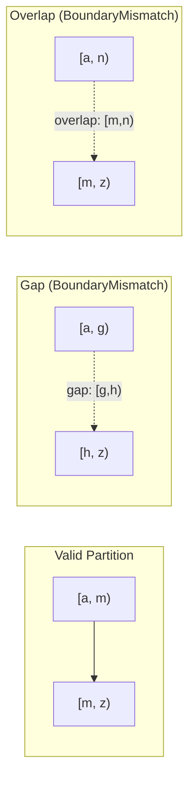
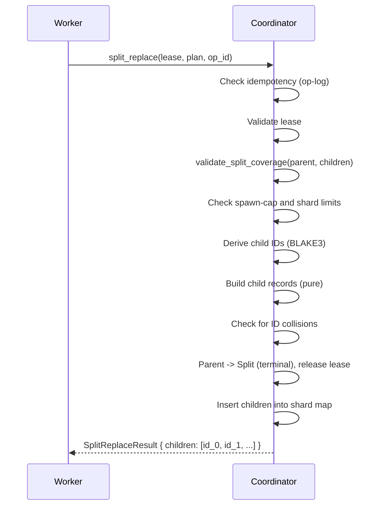

# Chapter 8: "Split-Replace" -- Parent Retirement with Coverage Proof

*A worker splits its shard into three children. The coordinator creates them and retires the parent. Later, another worker acquires one of the children and begins scanning. It processes every key in its range and marks the child as done. But there is a gap. The first child covers `[a, g)`. The second covers `[h, p)`. The third covers `[p, z)`. Between `g` and `h` -- one byte of keyspace -- items exist that no shard covers. They will never be scanned. The scan completes "successfully," but the results are silently incomplete. A coverage gap in a split is a data loss event that the system cannot detect after the fact.*

---

## 1. The Split-Replace Plan

A split-replace operation retires a parent shard and replaces it with two or more children. The plan is expressed as a `SplitReplacePlan<'a>`, which carries the specification for each child using borrowed views to avoid heap allocation on the split hot path.

> **Crate boundary:** `SplitReplaceChild`, `SplitReplacePlan`, and
> `SplitResidualPlan` are defined in the `gossip-contracts` crate
> (`gossip_contracts::coordination::split`), not in `gossip-coordination`.
> The coordination crate imports them for execution. This placement reflects
> the design principle that split *planning* is part of the shared contract
> layer, while split *execution* (ID derivation, payload hashing, record
> mutation) lives in `gossip-coordination::split_execution`.

### SplitReplaceChild

Each child in the plan carries two things: what range it covers and where scanning should begin.

```rust
/// A single child in a SplitReplacePlan.
///
/// Pairs a key sub-range (ShardSpecRef) with an initial cursor position
/// (CursorUpdate) that tells the new shard where to begin scanning.
#[derive(Clone, Copy, Debug, PartialEq, Eq)]
pub struct SplitReplaceChild<'a> {
    spec: ShardSpecRef<'a>,
    cursor: CursorUpdate<'a>,
}
```

Both fields are borrowed views: `ShardSpecRef<'a>` is a zero-copy reference to key range bytes, and `CursorUpdate<'a>` borrows cursor key/token data. This design is consistent with the project's tiered allocation policy -- split planning is on the HOT path and should avoid intermediate heap allocation. The `Copy` derive confirms these are lightweight borrows, not owned data.

The cursor is a significant design choice. When splitting a partially-scanned shard, the caller can position children at the parent's last checkpoint position (if it falls within the child's range) or at `CursorUpdate::initial()` (to scan from the beginning). This means a split does not necessarily discard progress -- the planner can transfer scan state into the appropriate child.

### SplitReplacePlan

The plan wraps a validated collection of children:

```rust
/// Plan for a split-replace operation: parent is replaced by >= 2 children
/// that collectively cover the parent's key range.
///
/// Backed by InlineVec with capacity MAX_SPLIT_CHILDREN (256).
/// Plans up to that limit remain stack-allocated; exceeding the limit is
/// rejected before allocation occurs.
#[derive(Clone, Debug, PartialEq, Eq)]
pub struct SplitReplacePlan<'a> {
    children: InlineVec<SplitReplaceChild<'a>, MAX_SPLIT_CHILDREN>,
}
```

The `InlineVec<SplitReplaceChild<'a>, MAX_SPLIT_CHILDREN>` is a stack-first collection: plans with up to 256 children stay entirely on the stack with no heap allocation. This is a deliberate choice aligned with the allocation policy -- split planning sits on the hot path, and `InlineVec` avoids the `Vec` heap allocation that would otherwise occur on every split operation.

The constructor enforces the cardinality bounds and accepts any iterator:

```rust
impl<'a> SplitReplacePlan<'a> {
    pub fn try_new(
        children: impl IntoIterator<Item = SplitReplaceChild<'a>>,
    ) -> Result<Self, SplitReplacePlanError> {
        let mut collected = InlineVec::new();
        for child in children {
            if collected.len() == MAX_SPLIT_CHILDREN {
                return Err(SplitReplacePlanError::TooManyChildren {
                    count: MAX_SPLIT_CHILDREN + 1,
                });
            }
            collected.push(child);
        }
        if collected.len() < 2 {
            return Err(SplitReplacePlanError::TooFewChildren {
                count: collected.len(),
            });
        }
        Ok(Self { children: collected })
    }
}
```

The `impl IntoIterator<Item = SplitReplaceChild<'a>>` parameter accepts `Vec`, slices, arrays, and other iterators without requiring a specific collection type. The limit check occurs during iteration -- if the 257th child arrives, the function returns `TooManyChildren` immediately without consuming the rest of the iterator.

A split that produces one child is not a split -- it is a no-op (or a range-replacement, which is a different operation). A split that produces more than 256 children would create an unbounded burst of coordinator state. The constructor prevents both.

The error type provides specific diagnostics:

```rust
pub enum SplitReplacePlanError {
    /// Fewer than 2 children -- not a split.
    TooFewChildren { count: usize },
    /// More than MAX_SPLIT_CHILDREN children.
    TooManyChildren { count: usize },
}
```

Note that `SplitReplacePlan` does **not** validate coverage at construction time. Coverage validation requires the parent's `ShardSpec`, which is not available until the coordinator executes the operation. The plan is a *proposal*; the coordinator validates the proposal against the parent's actual state. This separation of construction from validation is deliberate -- it allows the plan to be built, serialized, transmitted, and stored without requiring the parent's state at every point in the pipeline.

The plan is fingerprinted for op-log idempotency via `CanonicalBytes`:

```rust
impl CanonicalBytes for SplitReplacePlan<'_> {
    /// Length-prefixed encoding: `len || child[0] || child[1] || ...`.
    fn write_canonical(&self, h: &mut Hasher) {
        u32::try_from(self.children.len())
            .expect("child count exceeds u32")
            .write_canonical(h);
        for child in &self.children {
            child.write_canonical(h);
        }
    }
}
```

The length prefix ensures plans with different child counts produce distinct byte sequences, even if the concatenated child bytes happen to collide.

---

## 2. `validate_split_coverage_bounds()` -- The Coverage Proof

This is the heart of split-replace safety. The function proves that a proposed set of children exactly partitions the parent's key range: no gaps, no overlaps, every child well-formed.

Here is the complete implementation from `shard_spec.rs` (the `_bounds` variant that operates on raw slices):

```rust
pub fn validate_split_coverage_bounds(
    parent_start: &[u8],
    parent_end: &[u8],
    children: &[ShardSpecRef<'_>],
) -> Result<(), SplitValidationError> {
    // Step 1: At least 2 children.
    if children.is_empty() {
        return Err(SplitValidationError::NoChildren);
    }
    if children.len() == 1 {
        return Err(SplitValidationError::SingleChild);
    }

    // Step 2: Sort by key_range_start, preserving original indices.
    let mut indexed: Vec<(usize, ShardSpecRef<'_>)> =
        children.iter().copied().enumerate().collect();
    indexed.sort_by(|a, b| a.1.key_range_start().cmp(b.1.key_range_start()));

    // Step 3: First child start == parent start.
    if indexed[0].1.key_range_start() != parent_start {
        return Err(SplitValidationError::StartMismatch {
            parent_start: parent_start.len(),
            first_child_start: indexed[0].1.key_range_start().len(),
        });
    }

    // Step 4: Last child end == parent end.
    let last = indexed[indexed.len() - 1];
    if last.1.key_range_end() != parent_end {
        return Err(SplitValidationError::EndMismatch {
            parent_end: parent_end.len(),
            last_child_end: last.1.key_range_end().len(),
        });
    }

    // Step 5: Each child's end == next child's start (contiguity).
    // Step 6: No non-last child with unbounded end.
    for i in 0..indexed.len() - 1 {
        if indexed[i].1.key_range_end() != indexed[i + 1].1.key_range_start() {
            return Err(SplitValidationError::BoundaryMismatch {
                child_index: indexed[i].0,
                next_child_index: indexed[i + 1].0,
                child_end: indexed[i].1.key_range_end().len(),
                next_child_start: indexed[i + 1].1.key_range_start().len(),
            });
        }
        if indexed[i].1.key_range_end().is_empty() {
            return Err(SplitValidationError::OverlappingChild {
                child_index: indexed[i].0,
                next_child_index: indexed[i + 1].0,
            });
        }
    }

    // Step 7: Each child individually well-formed.
    for &(orig_idx, child) in &indexed {
        if !child.key_range_start().is_empty()
            && !child.key_range_end().is_empty()
            && child.key_range_start() >= child.key_range_end()
        {
            return Err(SplitValidationError::InvertedChild {
                child_index: orig_idx,
            });
        }
    }

    // Step 8: Per-spec size limits (defense-in-depth).
    for &(orig_idx, child) in &indexed {
        if ShardSpec::validate_ref(child).is_err() {
            return Err(SplitValidationError::InvalidChildSpec {
                child_index: orig_idx,
            });
        }
    }

    Ok(())
}
```

Let us walk through each step of this algorithm.

### Step 1: Minimum Child Count

```rust
if children.is_empty() {
    return Err(SplitValidationError::NoChildren);
}
if children.len() == 1 {
    return Err(SplitValidationError::SingleChild);
}
```

A split that produces zero children loses the entire range. A split that produces one child is not subdividing anything. Both are rejected immediately.

### Step 2: Sort by Start Key

```rust
let mut indexed: Vec<(usize, ShardSpecRef<'_>)> =
    children.iter().copied().enumerate().collect();
indexed.sort_by(|a, b| a.1.key_range_start().cmp(b.1.key_range_start()));
```

Children are paired with their original indices, then sorted by `key_range_start`. This is a robustness choice: the function validates the *set* of children, not an ordered sequence. Callers need not provide children in any particular order.

The original indices are preserved so that error messages can point back to the caller's input array. If the caller submits `[child_2, child_0, child_1]` and `child_0` has a problem, the error will say `child_index: 1` (its position in the caller's array), not `child_index: 0` (its position after sorting).

### Step 3: First Child Matches Parent Start

```rust
if indexed[0].1.key_range_start() != parent_start {
    return Err(SplitValidationError::StartMismatch { ... });
}
```

The first child (after sorting) must begin exactly where the parent begins. If the first child starts at `b` but the parent starts at `a`, the range `[a, b)` is uncovered.

### Step 4: Last Child Matches Parent End

```rust
if last.1.key_range_end() != parent_end {
    return Err(SplitValidationError::EndMismatch { ... });
}
```

The last child (after sorting) must end exactly where the parent ends. If the parent ends at `z` but the last child ends at `y`, the range `[y, z)` is uncovered.

### Step 5: Contiguity -- No Gaps or Overlaps

```rust
for i in 0..indexed.len() - 1 {
    if indexed[i].1.key_range_end() != indexed[i + 1].1.key_range_start() {
        return Err(SplitValidationError::BoundaryMismatch { ... });
    }
```

This is the core of the coverage proof. For every adjacent pair of children (in sorted order), the end of one must equal the start of the next. This is where the half-open interval convention pays off: `child[i].end == child[i+1].start` guarantees that every key at the boundary falls into exactly one child.

A gap (`child[i].end < child[i+1].start`) would leave keys uncovered. An overlap (`child[i].end > child[i+1].start`) would duplicate coverage. The equality check rejects both.



### Step 6: No Interior Unbounded Ends

```rust
    if indexed[i].1.key_range_end().is_empty() {
        return Err(SplitValidationError::OverlappingChild { ... });
    }
}
```

An empty `key_range_end` means "extends to end of keyspace." Only the last child is allowed to have this. If a non-last child has an unbounded end, it covers the same keys as all subsequent children -- a massive overlap.

This check catches a subtle case: two fully-unbounded children `[[], [])` and `[[], [])` pass the equality check in Step 5 (both ends are empty, both starts are empty), but they cover the exact same keyspace. The unbounded-end check catches this.

### Step 7: Individual Well-Formedness

```rust
for &(orig_idx, child) in &indexed {
    if !child.key_range_start().is_empty()
        && !child.key_range_end().is_empty()
        && child.key_range_start() >= child.key_range_end()
    {
        return Err(SplitValidationError::InvertedChild { ... });
    }
}
```

Each child must be individually well-formed: if both bounds are non-empty, start must be strictly less than end. A degenerate child like `[m, m)` contains no keys and would create a "hole" in the partition even if contiguity checks pass.

### Step 8: Per-Spec Size Limits

```rust
for &(orig_idx, child) in &indexed {
    if ShardSpec::validate_ref(child).is_err() {
        return Err(SplitValidationError::InvalidChildSpec {
            child_index: orig_idx,
        });
    }
}
```

Each child spec is validated against `MAX_KEY_SIZE` and `MAX_METADATA_SIZE` limits. `ShardSpecRef` is intentionally unvalidated at construction time (it is a borrowed view), so this step catches oversized fields before they reach downstream code that would panic.

### The Sorting Decision

A design question arises: why does the validator sort children by start key instead of requiring the caller to submit them in order?

The answer is robustness. In a distributed system, the split plan may be constructed by a worker, serialized, transmitted over a network, and deserialized by the coordinator. At any point in this pipeline, the ordering might be lost or scrambled. By sorting internally, the validator is order-independent -- it validates the *set* of children, not an ordered sequence. The caller's intent is "these ranges should cover the parent" regardless of the order they happen to arrive in.

The cost is a sort of N elements (where N <= 256), which is trivially cheap compared to the network round-trip that delivered the plan.

### The Proof

If `validate_split_coverage` returns `Ok(())`, the following properties hold:

1. There are at least 2 children.
2. The children are contiguous and gap-free.
3. The first child begins where the parent begins.
4. The last child ends where the parent ends.
5. No child has an inverted range.
6. No interior child claims to extend to the end of the keyspace.
7. No child spec exceeds size limits.

Together, these properties prove that `parent.range == union(children.ranges)` and that no two children overlap. The coverage proof is complete.

This proof is verified by property-based tests that generate random valid splits and check the membership invariant:

```rust
#[test]
fn split_coverage_roundtrip(
    (parent, children) in arb_valid_n_way_split(),
    key in proptest::collection::vec(any::<u8>(), 0..64),
) {
    let refs: Vec<&ShardSpec> = children.iter().collect();
    prop_assert!(validate_split_coverage(&parent, &refs).is_ok());
    let parent_has = parent.contains_key(&key);
    let child_count = children.iter().filter(|c| c.contains_key(&key)).count();
    if parent_has {
        prop_assert_eq!(child_count, 1,
            "key in parent but in {} children", child_count);
    } else {
        prop_assert_eq!(child_count, 0,
            "key outside parent but in {} children", child_count);
    }
}
```

For any random key: if the parent contains it, exactly one child contains it. If the parent does not contain it, no child contains it. This is the coverage invariant expressed as a testable property.

---

## 3. The `split_replace` Operation

With the plan type and validation function in hand, we can examine how the coordinator executes a split-replace. Here is the trait signature:

```rust
fn split_replace(
    &mut self,
    now: LogicalTime,
    tenant: TenantId,
    lease: &Lease,
    plan: SplitReplacePlan<'_>,
    op_id: OpId,
) -> Result<IdempotentOutcome<SplitReplaceResult>, SplitReplaceError>;
```

Note the lifetime parameter on `SplitReplacePlan<'_>` -- the plan borrows its child specs and cursors rather than owning them, consistent with the zero-allocation hot-path policy.

And the result type:

```rust
/// Result of a successful `split_replace` operation.
///
/// Contains the deterministically-derived child shard IDs, ordered by
/// `key_range_start` for reproducibility.
#[derive(Clone, Debug, PartialEq, Eq)]
pub struct SplitReplaceResult {
    pub children: InlineVec<ShardId, MAX_SPLIT_CHILDREN>,
}
```

The children field uses `InlineVec<ShardId, MAX_SPLIT_CHILDREN>` rather than `Vec<ShardId>`, keeping the result stack-allocated for typical split fan-outs.

The in-memory implementation executes in three phases. Let us trace through the complete execution.

### Phase 1: Validate

```rust
fn split_replace(&mut self, now, tenant, lease, plan, op_id) -> ... {
    let key = lease.shard_key();

    let mut parent = self
        .shard_remove(&tenant, &key)
        .ok_or(SplitReplaceError::ShardNotFound { shard: key })?;

    let result = (|| {
        // Idempotency check.
        let payload_hash = hash_split_replace_payload(&plan);
        if check_op_idempotency(&parent, op_id, payload_hash)?.is_some() {
            let children = split_replace_replay_child_ids(&parent, &plan, op_id);
            return Ok(IdempotentOutcome::Replayed(SplitReplaceResult { children }));
        }

        // Lease validation.
        validate_lease(now, tenant, lease, &parent)?;

        // Coverage validation + spawn-cap check.
        let sorted = split_replace_validate_preconditions(parent, &plan, &coordinator.slab)?;

        // Shard count limit guard (temporarily_removed=1 for parent).
        coordinator
            .check_shard_limits(tenant, sorted.len(), 1)
            .map_err(SplitReplaceError::SplitInvalid)?;
        // ...
```

The idempotency check comes first. If this `op_id` was already executed with the same plan (same payload hash), the operation returns `Replayed` with the same child IDs, without any mutation. If the `op_id` was used with a different plan, it returns `OpIdConflict`.

Only after the idempotency check passes does the coordinator validate the lease (correct tenant, correct fence epoch, not expired) and the split coverage (children partition the parent's range).

### Phase 2: Build + Insert Children

```rust
                // Phase 2: Build + insert children (may allocate into slab).
                let child_ids = split_replace_insert_children(
                    coordinator,
                    parent,
                    &plan,
                    &sorted,
                    tenant,
                    op_id,
                )?;
```

This phase derives child IDs, constructs child records, **and inserts them into the shard map** -- all within `split_replace_insert_children`. The function loops over the sorted children and for each one:

1. **Derives the child ID** deterministically: `derive_split_shard_id(run, parent_shard, op_id, Child, index)`. The `index` starts at `parent.spawned.len()` -- the current count of previously spawned shards -- so IDs are unique even if the parent was split before (via prior residual operations).

2. **Checks for ID collision** against the existing shard map. If the derived ID already exists, all previously inserted children are rolled back via `split_replace_rollback_inserted_children`.

3. **Builds the child record** via `ShardRecord::new_split_child`, which allocates pooled spec fields into the slab. On allocation failure, previously inserted children are again rolled back.

4. **Inserts the child** into the shard map immediately.

This all-or-nothing loop means the function returns `Result<SplitChildIds, SplitReplaceError>` -- either all children are built and inserted, or none are.

### Phase 3: Apply Parent + Index

```rust
                // Phase 3: Apply parent mutation + index updates.
                if let Err(e) = split_replace_apply_parent(
                    parent,
                    child_ids.as_slice(),
                    op_id,
                    payload_hash,
                    now,
                    &mut coordinator.slab,
                ) {
                    split_replace_rollback_inserted_children(
                        coordinator,
                        tenant,
                        parent.run,
                        child_ids.as_slice(),
                    );
                    return Err(e);
                }

                for &child_id in &child_ids {
                    coordinator.index_shard(tenant, parent.run, child_id);
                }

                Ok(IdempotentOutcome::Executed(SplitReplaceResult {
                    children: child_ids,
                }))
            },
        )

```

Note that the `with_removed_parent` pattern (described in the previous section) wraps this entire closure, handling parent removal/restoration automatically.

The parent transition is handled by `split_replace_apply_parent`:

```rust
fn split_replace_apply_parent(
    parent: &mut ShardRecord,
    child_ids: &[ShardId],
    op_id: OpId,
    payload_hash: u64,
    now: LogicalTime,
    slab: &mut ByteSlab,
) -> Result<(), SplitReplaceError> {
    parent.assert_transition_legal(ShardStatus::Split);
    let (spawned_slot, spawned_len) = parent.spawned.allocate_appended_slot(child_ids, slab)?;
    parent.spawned.install_slot(spawned_slot, spawned_len, slab);
    parent.status = ShardStatus::Split;
    parent.lease = None;
    parent.op_log_push(OpLogEntry::new(
        op_id,
        OpKind::SplitReplace,
        OpResult::Completed,
        payload_hash,
        now,
    ));
    parent.assert_invariants(slab);
    Ok(())
}
```

The parent transitions to `ShardStatus::Split` (terminal). Its lease is released -- no worker owns a terminal shard. Child IDs are recorded in `spawned` via a two-phase slab allocation (`allocate_appended_slot` / `install_slot`) for lineage tracking. The op-log entry is recorded with the payload hash for idempotency.



---

## 4. The Remove-Mutate-Restore Pattern

A subtle but important implementation detail in the in-memory backend is the **remove-mutate-restore** pattern. The coordinator uses `self.with_removed_parent(...)` to temporarily remove the parent from the map, pass it to a closure for mutation, and unconditionally restore it afterward:

```rust
// Remove parent from the map, run the closure, then always restore it.
self.with_removed_parent(tenant, &key, |coordinator, parent| {
    // ... all mutation logic inside the closure ...
})
```

Why remove the parent from the map, mutate it separately, and then put it back?

The answer is Rust's borrow checker. The coordinator needs to simultaneously:
- Mutate the parent record (`&mut parent`)
- Insert children into the shard map (`&mut self.shards`)

If the parent were still inside `self.shards`, you would need `&mut self` for both operations, which Rust's aliasing rules forbid. By removing the parent first, `parent` becomes an independent value that can be mutated while `self.shards` is also mutated.

The parent is **always** restored, whether the operation succeeds or fails. `with_removed_parent` handles this unconditionally. The only case where the parent is not restored is if `assert_invariants` panics inside the closure -- but a panic indicates a logic bug that should crash the process (this is the Tiger-style "crash to prevent corruption" philosophy).

This pattern appears in both `split_replace` and `split_residual` (Chapter 9).

---

## 5. Idempotency: The Terminal Advantage

After `split_replace` completes, the parent enters the terminal `Split` status. No further operations can execute on a terminal shard -- checkpoint, complete, park, and further splits all require `Active` status. This means no further op-log entries can be pushed after the split.

This has a critical consequence for idempotency: **the split_replace op-log entry is never evicted.** The op-log is a bounded FIFO (16 entries). Entries are evicted when new operations push old ones out. But since no new operations can occur on a terminal shard, the split entry stays in the op-log forever.

This means idempotent replays of split_replace always work through the op-log path. The coordinator does not need a secondary replay detection mechanism (contrast with split_residual in Chapter 9, where the parent stays active and subsequent operations can evict the split entry).

On replay, the coordinator recomputes child IDs from the plan:

```rust
fn split_replace_replay_child_ids(
    parent: &ShardRecord,
    plan: &SplitReplacePlan<'_>,
    op_id: OpId,
) -> InlineVec<ShardId, MAX_SPLIT_CHILDREN> {
    let sorted = split_replace_sort_children(plan);
    let n = sorted.len();
    let base_index = parent.spawned.len()
        .checked_sub(n)
        .expect("split_replace replay: parent.spawned.len() < child count");
    sorted
        .iter()
        .enumerate()
        .map(|(i, _)| {
            derive_split_shard_id(
                parent.run,
                parent.shard,
                op_id,
                DerivedShardKind::Child,
                (base_index + i) as u32,
            )
        })
        .collect()
}
```

Since the parent is terminal, `spawned` is frozen -- the children were the last N entries appended. The base index is `spawned.len() - N`, and re-deriving the IDs with `derive_split_shard_id` produces the same values deterministically.

---

## 6. Worked Example: Three-Way Split of an Unbounded Shard

Let us trace a concrete split from start to finish.

**Setup**: A parent shard covers the entire keyspace (`ShardSpec::unbounded()`, i.e., `[[], [])`). It has been acquired by Worker-7 and has a valid lease. The worker decides to split it into three children:

```
Parent:  [[], [])         -- entire keyspace
Child 0: [[], "m")        -- beginning to "m"
Child 1: ["m", "t")       -- "m" to "t"
Child 2: ["t", [])         -- "t" to end
```

**Step 1: Build the plan.**

```rust
let c0 = SplitReplaceChild::new(
    ShardSpecRef::with_range(b"", b"m"),
    CursorUpdate::initial(),
);
let c1 = SplitReplaceChild::new(
    ShardSpecRef::with_range(b"m", b"t"),
    CursorUpdate::initial(),
);
let c2 = SplitReplaceChild::new(
    ShardSpecRef::with_range(b"t", b""),
    CursorUpdate::initial(),
);
let plan = SplitReplacePlan::try_new([c0, c1, c2]).unwrap();
```

**Step 2: Validate coverage.**

The validator sorts by start key (already in order here), then checks:

| Check | Result |
|-------|--------|
| At least 2 children? | 3 children. Pass. |
| First child start == parent start? | `[] == []`. Pass. |
| Last child end == parent end? | `[] == []`. Pass. |
| Child 0 end == Child 1 start? | `"m" == "m"`. Pass. |
| Child 1 end == Child 2 start? | `"t" == "t"`. Pass. |
| No non-last child with unbounded end? | Child 0 end = `"m"` (bounded), Child 1 end = `"t"` (bounded). Pass. |
| Each child well-formed? | `[] < "m"` (unbounded start), `"m" < "t"`, `"t" > []` (unbounded end). All pass. |

Coverage is valid.

**Step 3: Derive child IDs.**

Assuming `parent.spawned.len() == 0` (no prior splits):

```
child_0_id = derive_split_shard_id(run, parent, op, Child, 0) | bit63
child_1_id = derive_split_shard_id(run, parent, op, Child, 1) | bit63
child_2_id = derive_split_shard_id(run, parent, op, Child, 2) | bit63
```

All three IDs have bit 63 set. All three are distinct (different indices).

**Step 4: Apply.**

```
Parent: status = Split, lease = None, spawned = [child_0_id, child_1_id, child_2_id]
Child 0: status = Active, spec = [[], "m"), cursor = initial, parent = parent_id
Child 1: status = Active, spec = ["m", "t"), cursor = initial, parent = parent_id
Child 2: status = Active, spec = ["t", []), cursor = initial, parent = parent_id
```

Three new Active shards are available for workers to acquire. The parent is permanently retired.

---

## 7. Error Cases in Practice

Understanding the error variants helps build intuition for what can go wrong.

**`StartMismatch`**: The caller proposes children `["b", "m")` and `["m", "z")` for a parent covering `["a", "z")`. The first child starts at `"b"`, not `"a"`. Range `["a", "b")` would be lost.

**`BoundaryMismatch`**: Children `["a", "g")` and `["h", "z")` leave a gap at `["g", "h")`. Or children `["a", "n")` and `["m", "z")` overlap at `["m", "n")`.

**`OverlappingChild`**: The first of two children has `key_range_end = []` (unbounded). This child claims to cover everything from its start to the end of the keyspace, overlapping with all subsequent children.

**`InvertedChild`**: A child with `start = "m"` and `end = "a"` has an inverted range. Or a degenerate child with `start = end = "m"` contains no keys.

**`SpawnLimitExceeded`**: The parent has already spawned 1020 children/residuals from prior operations. Adding 5 more would exceed `MAX_SPAWNED_PER_SHARD = 1024`.

**`DerivedIdCollision`**: Astronomically unlikely with BLAKE3 and domain separation, but handled gracefully. If a derived child ID happens to match an existing shard in the map, the operation returns an error rather than silently overwriting.

**`InvalidChildSpec`**: A child spec has a key exceeding `MAX_KEY_SIZE` (4 KiB) or metadata exceeding `MAX_METADATA_SIZE` (16 KiB). Caught during validation before the spec reaches slab storage.

---

## 8. Payload Hashing for Idempotency

Every split-replace operation is fingerprinted for the op-log via `hash_split_replace_payload`:

```rust
pub fn hash_split_replace_payload(plan: &SplitReplacePlan) -> u64 {
    op_payload_hash(b"split_replace", |h| {
        plan.write_canonical(h);
    })
}
```

The `op_payload_hash` helper uses a second domain-separated BLAKE3 hasher (`OP_PAYLOAD_V1`, domain string `"gossip/coord/v1/op-payload"`) and prepends the operation-specific tag `b"split_replace"`. This tag acts as a second domain-separation layer -- even if two different operation types happen to produce identical field bytes, the different tags guarantee distinct hashes.

The resulting 64-bit hash is stored alongside the `OpId` in the op-log entry. On replay, the coordinator recomputes the hash from the submitted plan and compares. A match means the plan is identical (within the hash's collision bounds). A mismatch means the same `OpId` was submitted with a different plan -- a conflict that returns `OpIdConflict`.

This two-layer structure (op_id + payload_hash) provides the Stripe-pattern idempotency guarantee: same request yields same result, different request under same key is rejected.

---

## 9. The State Machine Transition

It is worth zooming in on what `ShardStatus::Split` means in the context of the shard state machine (introduced in Chapter 2).

```text
           +----------+
           |  Active  |
           +--+--+--+-+
              |  |  |
   Complete   |  |  |  Park
     +--------+  |  +--------+
     v           |           v
+--------+  SplitReplace  +--------+
|  Done  |       |        | Parked |
+--------+       v        +--------+
            +--------+
            | Split  |
            +--------+
```

`Split` is one of three terminal states. Once a shard enters `Split`, the following operations are permanently rejected:

- `acquire_and_restore_into` -- returns `ShardTerminal`
- `checkpoint` -- returns `ShardTerminal` (after idempotency check)
- `complete` -- returns `ShardTerminal` (after idempotency check)
- `park_shard` -- returns `ShardTerminal` (after idempotency check)
- `split_replace` -- returns `ShardTerminal` (after idempotency check)
- `split_residual` -- returns `ShardTerminal` (after idempotency check)

The only operations that succeed on a `Split` shard are idempotent replays of the original split (detected via the op-log) and read-only queries like `get_shard` or `list_shards`. The shard record persists indefinitely for lineage tracking -- the `spawned` list links parent to children, enabling audit trails and progress monitoring.

---

## 10. Summary

Split-replace is the coordinator's mechanism for evenly subdividing a shard that has grown too large. The operation has three critical safety properties:

1. **Coverage completeness**: `validate_split_coverage` proves that children partition the parent's range with no gaps or overlaps.

2. **Deterministic ID derivation**: `derive_split_shard_id` produces the same child IDs given the same inputs, enabling idempotent replay.

3. **Terminal irreversibility**: The parent enters `Split` status permanently, freezing its op-log and ensuring the split entry is never evicted.

The next chapter examines split-residual -- a fundamentally different strategy where the parent stays alive, which introduces new challenges for idempotency and cursor consistency.
