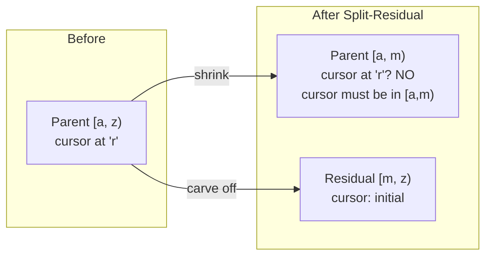
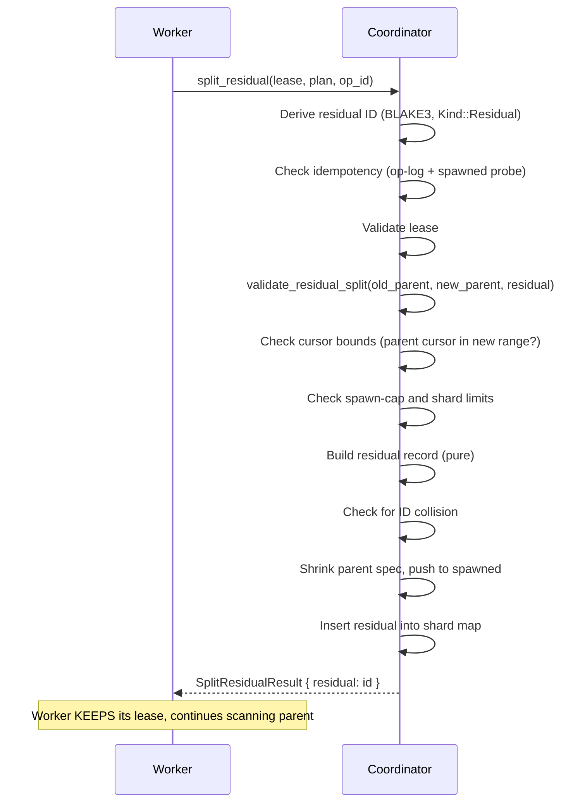
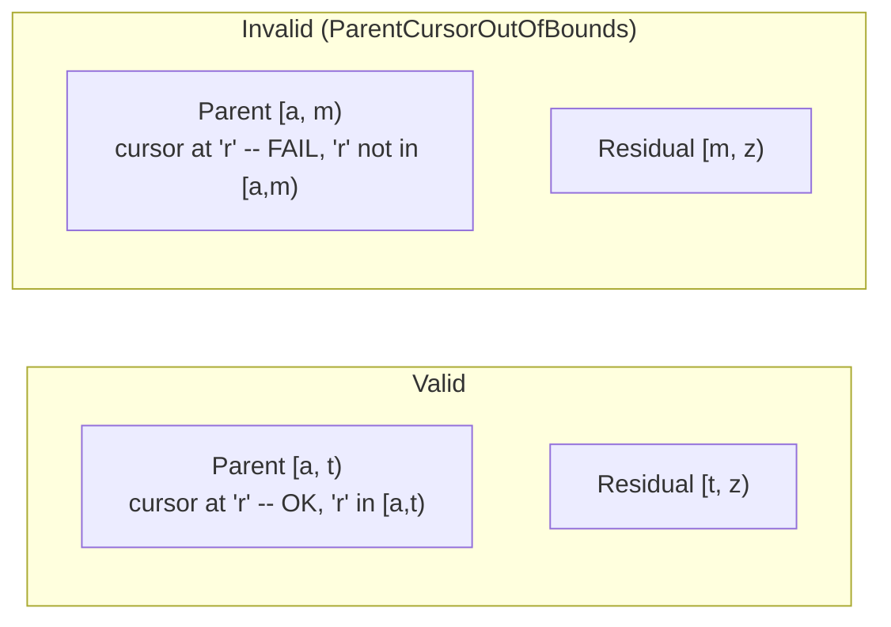

# Chapter 9: "Split-Residual" -- Surgical Prefix Offloading

*A worker has been scanning a large shard for several minutes. Its cursor is at key `"repo/org-a/settings"`, about 80% through the range. The remaining 20% contains keys in a completely different region -- repositories in a separate geographic zone that happen to fall into the same lexicographic range. The worker knows it will not finish before its lease expires. It could let the lease expire and hope the next worker picks up where it left off. But there is a better option: surgically split off the unprocessed tail into a separate shard, shrink the current shard to just the portion already scanned, and continue processing. The current worker keeps its lease and finishes its (now smaller) range. A different worker acquires the residual and begins scanning the tail independently. No progress is lost. No lease is wasted.*

---

## 1. Split-Replace vs. Split-Residual

Before diving into the mechanics, it helps to see the two strategies side by side:

| Aspect | Split-Replace (Ch. 8) | Split-Residual (Ch. 9) |
|--------|----------------------|----------------------|
| **Parent status after split** | `Split` (terminal) | Stays `Active` |
| **Children created** | 2 or more, cover full range | 1 residual shard |
| **Parent lease** | Released | **Retained** |
| **Parent range** | Unchanged (frozen) | Shrinks to left/lower portion |
| **Idempotency** | Op-log entry never evicted | Op-log entry may be evicted; secondary detection via `spawned` |
| **Use case** | Even subdivision | Prefix offloading mid-scan |

The fundamental difference is **liveness**. Split-replace halts all work on the parent -- it retires and children start fresh. Split-residual lets the current worker continue without interruption. This makes it the right choice when significant progress has already been made on the parent shard.



---

## 2. The `SplitResidualPlan`

The plan for a residual split describes two things: how the parent's range shrinks, and what the residual covers. Like `SplitReplacePlan`, the residual plan uses borrowed views (`ShardSpecRef<'a>`) rather than owned `ShardSpec` values, avoiding heap allocation on the split hot path.

```rust
/// Plan for a split-residual operation: parent shrinks its key range and
/// a new residual shard covers the remainder.
///
/// The parent keeps `parent_new_spec` (typically the prefix it has already
/// partially scanned) and continues processing. The residual shard gets
/// `residual_spec` (the unprocessed suffix) and starts from
/// `Cursor::initial()` (enforced by the coordinator, not by this type).
#[derive(Clone, Debug, PartialEq, Eq)]
pub struct SplitResidualPlan<'a> {
    parent_new_spec: ShardSpecRef<'a>,
    residual_spec: ShardSpecRef<'a>,
}
```

Two fields, both `ShardSpecRef<'a>` -- borrowed, zero-copy views into key range byte slices. `parent_new_spec` is what the parent becomes after the split -- a smaller range covering the left (lower keys, already partially scanned). `residual_spec` is what gets carved off -- the right (higher keys, unprocessed).

Note the asymmetry with `SplitReplacePlan`: a replace plan carries N children (each with a `ShardSpecRef` and `CursorUpdate`), while a residual plan carries exactly two specs. There is no cursor for the residual -- the residual always starts at `Cursor::initial()`, enforced by the coordinator at execution time. And there is no cursor for the new parent spec -- the parent keeps its existing cursor (which must remain within the new range).

The constructor enforces a basic sanity check:

```rust
impl<'a> SplitResidualPlan<'a> {
    pub fn try_new(
        parent_new_spec: ShardSpecRef<'a>,
        residual_spec: ShardSpecRef<'a>,
    ) -> Result<Self, SplitResidualPlanError> {
        if parent_new_spec == residual_spec {
            return Err(SplitResidualPlanError::IdenticalSpecs);
        }
        Ok(Self {
            parent_new_spec,
            residual_spec,
        })
    }

    pub fn parent_new_spec(&self) -> ShardSpecRef<'a> {
        self.parent_new_spec
    }

    pub fn residual_spec(&self) -> ShardSpecRef<'a> {
        self.residual_spec
    }
}
```

If both specs are identical, the split is nonsensical -- you are not actually subdividing anything. The constructor rejects this. All other validation (coverage, role assignment, cursor bounds) happens at execution time when the coordinator has access to the parent's actual state.

The plan is fingerprinted for op-log idempotency:

```rust
impl CanonicalBytes for SplitResidualPlan<'_> {
    fn write_canonical(&self, h: &mut Hasher) {
        self.parent_new_spec.write_canonical(h);
        self.residual_spec.write_canonical(h);
    }
}
```

---

## 3. `validate_residual_split()` -- Role Assignment and Coverage

The residual split validation has an extra layer beyond the coverage check: it enforces **role assignment**. The parent must keep the left portion, and the residual must cover the right. This prevents callers from accidentally swapping the two arguments.

The function is generic, accepting any type that implements `IntoShardSpecRef<'a>` -- this includes `&ShardSpec`, `ShardSpecRef<'a>`, and other borrowed representations. This flexibility allows the coordinator to validate without materializing owned `ShardSpec` values from slab-backed storage:

```rust
pub fn validate_residual_split<'a, O, N, R>(
    old_parent: O,
    new_parent: N,
    residual: R,
) -> Result<(), SplitValidationError>
where
    O: IntoShardSpecRef<'a>,
    N: IntoShardSpecRef<'a>,
    R: IntoShardSpecRef<'a>,
{
    let old_parent = old_parent.into_spec_ref();
    let new_parent = new_parent.into_spec_ref();
    let residual = residual.into_spec_ref();
    validate_residual_split_bounds(
        old_parent.key_range_start(),
        old_parent.key_range_end(),
        new_parent,
        residual,
    )
}
```

There is also a `validate_residual_split_bounds` variant that takes raw `&[u8]` slices for the old parent's bounds, used by the coordinator's split precondition checks to avoid materializing a temporary `ShardSpec` from pooled slab storage.

The function performs three checks:

### Check 1: New Parent Start == Old Parent Start

```rust
if new_parent.key_range_start() != old_parent_start {
    return Err(SplitValidationError::StartMismatch {
        parent_start: old_parent_start.len(),
        first_child_start: new_parent.key_range_start().len(),
    });
}
```

The parent must keep the left portion. Its start boundary must not change -- it still begins where it always began. If `new_parent` starts at a different key, the caller may have swapped the parent and residual arguments.

### Check 2: Residual End == Old Parent End

```rust
if residual.key_range_end() != old_parent_end {
    return Err(SplitValidationError::EndMismatch {
        parent_end: old_parent_end.len(),
        last_child_end: residual.key_range_end().len(),
    });
}
```

The residual must cover the right portion, extending to where the parent originally ended. This ensures no tail is lost.

### Check 3: Delegate to `validate_split_coverage_bounds`

```rust
validate_split_coverage_bounds(old_parent_start, old_parent_end, &[new_parent, residual])
```

After the role-assignment checks pass, the function delegates to the same `validate_split_coverage_bounds` used by split-replace (Chapter 8). This verifies that `new_parent` and `residual` together form a valid two-way partition of the old parent's range: contiguous, no gaps, no overlaps.

### Why the Role-Assignment Check Matters

Consider a caller who accidentally swaps the arguments:

```rust
// Intended: parent keeps [a, m), residual gets [m, z)
// Actual (swapped): new_parent = [m, z), residual = [a, m)
validate_residual_split(&old_parent, &new_parent_wrong, &residual_wrong)
```

Without the role-assignment check, `validate_split_coverage` alone would accept this -- the two specs partition the range correctly. But the semantics would be wrong: the "parent" would get the right portion (which it has not scanned), and the "residual" would get the left portion (which the parent has been scanning). The cursor would be stranded outside the parent's new range.

The role-assignment check catches this: `new_parent.start != old_parent.start` triggers `StartMismatch`.

---

## 4. The `split_residual` Operation

Here is the trait signature:

```rust
fn split_residual(
    &mut self,
    now: LogicalTime,
    tenant: TenantId,
    lease: &Lease,
    plan: SplitResidualPlan<'_>,
    op_id: OpId,
) -> Result<IdempotentOutcome<SplitResidualResult>, SplitResidualError>;
```

And the result type:

```rust
/// Result of a successful `split_residual` operation.
#[derive(Clone, Debug, PartialEq, Eq)]
pub struct SplitResidualResult {
    pub residual: ShardId,
}
```

A single derived shard ID, not a vector -- there is always exactly one residual.

Let us trace through the in-memory implementation:

### Phase 1: Validate

```rust
fn split_residual(&mut self, now, tenant, lease, plan, op_id) -> ... {
    let key = lease.shard_key();

    let mut parent = self
        .shard_remove(&tenant, &key)
        .ok_or(SplitResidualError::ShardNotFound { shard: key })?;

    let result = (|| {
        let payload_hash = hash_split_residual_payload(&plan);

        // Derive residual ID early (index = spawned.len() before push).
        let residual_id = derive_split_shard_id(
            parent.run,
            parent.shard,
            op_id,
            DerivedShardKind::Residual,
            parent.spawned.len() as u32,
        );

        // Two-tier replay detection.
        if let Some(replay) = split_residual_check_replay(&parent, op_id, payload_hash)? {
            return Ok(replay);
        }

        // Validate preconditions.
        split_residual_validate_preconditions(now, tenant, lease, &parent, &plan)?;

        // Shard count limit guard.
        self.check_shard_limits(tenant, 1, 1)?;
```

The residual ID is derived early using `DerivedShardKind::Residual` and `index = parent.spawned.len()`. This index is the next available slot in the parent's spawn list.

The replay detection is more complex than split-replace (see Section 5 below).

The precondition validation includes five checks in order:

```rust
fn split_residual_validate_preconditions(
    now: LogicalTime,
    tenant: TenantId,
    lease: &Lease,
    parent: &ShardRecord,
    plan: &SplitResidualPlan,
    slab: &ByteSlab,
) -> Result<(), SplitResidualError> {
    // 1. Lease validity.
    validate_lease(now, tenant, lease, parent)?;
    // 2. Coverage: new_parent + residual partition old_parent.
    validate_residual_split(&parent.spec, plan.parent_new_spec(), plan.residual_spec())?;
    // 3. Cursor bounds: parent's cursor must remain in the shrunk range.
    split_residual_validate_cursor_bounds(parent, plan, slab)?;
    // 4. Spawn-cap.
    if !parent.can_spawn(1) {
        return Err(SplitResidualError::SplitInvalid(
            SplitValidationError::SpawnLimitExceeded { ... },
        ));
    }
    Ok(())
}
```

### Phase 2: Build (Pure)

```rust
        let mut residual_record = split_residual_build_record(
            parent, &plan, tenant, residual_id, &mut coordinator.slab,
        )?;
```

The residual record is built without map side effects (but allocates into the slab):

```rust
fn split_residual_build_record(
    parent: &ShardRecord,
    plan: &SplitResidualPlan<'_>,
    tenant: TenantId,
    residual_id: ShardId,
    slab: &mut ByteSlab,
) -> Result<ShardRecord, SplitResidualError> {
    assert!(residual_id.is_derived(), "residual must be derived");
    ShardRecord::new_split_child(
        tenant,
        parent.run,
        residual_id,
        plan.residual_spec(),
        CursorUpdate::initial(),
        parent.cursor_semantics,
        parent.shard,
        slab,
    )
    .map_err(SplitResidualError::from)
}
```

The residual always starts with `CursorUpdate::initial()` -- no work has been done in the residual's key range. It inherits `cursor_semantics` from the parent and records the parent's ID for lineage. The function returns `Result` because `new_split_child` allocates pooled spec fields into the slab, which can fail with `SlabFull`.

### Phase 3: Apply

```rust
        // Collision check.
        let residual_key = ShardKey::new(parent.run, residual_id);
        if self.shard_contains(&tenant, &residual_key) {
            return Err(SplitResidualError::SplitInvalid(
                SplitValidationError::DerivedIdCollision { derived_id: residual_id },
            ));
        }

        // Update parent.
        split_residual_apply_parent(
            &mut parent,
            plan.parent_new_spec().clone(),
            residual_id,
            op_id,
            payload_hash,
            now,
        );

        // Insert residual.
        self.shard_insert(tenant, residual_key, residual_record);
        self.index_shard(tenant, parent.run, residual_id);

        Ok(IdempotentOutcome::Executed(SplitResidualResult { residual: residual_id }))
    })();

    // Always restore parent.
    let run = parent.run;
    self.shard_insert(tenant, key, parent);
    self.debug_assert_run_shards_consistent(tenant, run);
    result
}
```

The parent mutation is the critical difference from split-replace:

```rust
fn split_residual_apply_parent(
    parent: &mut ShardRecord,
    new_spec: ShardSpecRef<'_>,
    residual_id: ShardId,
    op_id: OpId,
    payload_hash: u64,
    now: LogicalTime,
    slab: &mut ByteSlab,
) -> Result<(), SplitResidualError> {
    assert!(residual_id.is_derived(), "residual must be derived");

    let (spawned_slot, spawned_len) = parent
        .spawned
        .allocate_appended_slot(core::slice::from_ref(&residual_id), slab)?;
    if let Err(err) = parent.spec.update_from_ref(new_spec, slab) {
        slab.deallocate(spawned_slot);
        return Err(SplitResidualError::from(err));
    }
    parent.spawned.install_slot(spawned_slot, spawned_len, slab);
    parent.op_log_push(OpLogEntry::new(
        op_id,
        OpKind::SplitResidual,
        OpResult::Completed,
        payload_hash,
        now,
    ));
    parent.assert_invariants(slab);
    Ok(())
}
```

Three things happen to the parent:

1. **`parent.spec.update_from_ref(new_spec, slab)`** -- The parent's range shrinks. It now covers only the left portion. Uses slab-backed two-phase update rather than direct assignment.
2. **`parent.spawned.allocate_appended_slot` / `install_slot`** -- The residual is recorded in the parent's spawn list via slab-backed two-phase allocation.
3. **Op-log entry** -- Recorded for idempotency.

Three things do **not** happen:

1. **No status change** -- The parent stays `Active`. It does not enter a terminal state.
2. **No lease release** -- The parent keeps its lease. The current worker continues processing.
3. **No cursor change** -- The parent's cursor remains where it was. (But see Section 6 for the constraint this imposes.)



---

## 5. Secondary Replay Detection: `find_replayed_residual`

This is where split-residual diverges most significantly from split-replace.

After split-replace, the parent enters terminal `Split` status. No further operations can push op-log entries, so the split-replace entry stays forever. Replay detection is straightforward.

After split-residual, the parent stays `Active`. The worker continues scanning, checkpointing, and eventually completing or splitting again. Each of these operations pushes an op-log entry. The op-log is a bounded 16-entry FIFO. After 16 more operations, the split-residual entry is evicted.

If a client replays the split-residual operation after the op-log entry has been evicted, the primary idempotency check (`check_op_idempotency`) finds nothing. Without a secondary mechanism, the coordinator would treat the replay as a fresh operation and try to create a duplicate residual.

The solution is a two-tier replay detection system:

```rust
fn split_residual_check_replay(
    parent: &ShardRecord,
    op_id: OpId,
    payload_hash: u64,
    slab: &ByteSlab,
) -> Result<Option<IdempotentOutcome<SplitResidualResult>>, SplitResidualError> {
    // Tier 1: Op-log check (primary).
    if check_op_idempotency(parent, op_id, payload_hash)?.is_some() {
        let replayed = find_replayed_residual(parent, op_id, slab).expect(
            "op-log hit for split_residual implies residual exists in parent.spawned"
        );
        return Ok(Some(IdempotentOutcome::Replayed(SplitResidualResult {
            residual: replayed,
        })));
    }

    // Tier 2: Spawned probe (defense-in-depth).
    if let Some(existing) = find_replayed_residual(parent, op_id, slab) {
        return Ok(Some(IdempotentOutcome::Replayed(SplitResidualResult {
            residual: existing,
        })));
    }

    Ok(None)
}
```

**Tier 1 (op-log)**: If the op-log entry still exists, it provides the strongest guarantee -- it can verify both the `op_id` and the `payload_hash`. A hash mismatch (same `op_id`, different plan) returns `OpIdConflict`. A match returns `Replayed`.

**Tier 2 (spawned probe)**: If the op-log entry was evicted, fall back to searching `parent.spawned` for a residual derived from this `op_id`. The `spawned` vec is permanent (never evicted, bounded by `MAX_SPAWNED_PER_SHARD`).

The order matters: the op-log check comes first so that `OpIdConflict` is not masked by the spawned probe.

### `find_replayed_residual` -- The Brute-Force Search

```rust
fn find_replayed_residual(parent: &ShardRecord, op_id: OpId, slab: &ByteSlab) -> Option<ShardId> {
    assert!(
        parent.spawned.len() <= MAX_SPAWNED_PER_SHARD,
        "spawned count {} exceeds bound {}",
        parent.spawned.len(),
        MAX_SPAWNED_PER_SHARD,
    );
    for (idx, spawned) in parent.spawned.iter(slab).enumerate() {
        let candidate = derive_split_shard_id(
            parent.run,
            parent.shard,
            op_id,
            DerivedShardKind::Residual,
            idx as u32,
        );
        if spawned == candidate {
            return Some(candidate);
        }
    }
    None
}
```

The problem: when the op-log entry is gone, we do not know the original creation index of the residual. The `spawned` vec may have grown since the first execution (more residuals or a split-replace happened later).

The solution: iterate `parent.spawned` via `iter(slab)`, and for each index re-derive the BLAKE3-based ID using `derive_split_shard_id(run, parent, op_id, Residual, idx)` and compare directly against the spawned entry.

**Complexity**: O(S) where S = `spawned.len()`. Each iteration performs one BLAKE3 hash (constant time) and one equality comparison. At `MAX_SPAWNED_PER_SHARD = 1024`, worst case is 1024 hashes plus 1024 comparisons -- trivially fast and zero heap allocation.

### A Limitation of the Spawned Probe

The spawned-probe tier cannot verify the payload hash after op-log eviction. If a client replays `op_id = X` with a *different* plan after the op-log entry is evicted, the spawned probe returns `Replayed` (matching the original residual) instead of `OpIdConflict`.

This is acceptable for three reasons documented in the source code:

1. Eviction requires 16+ intervening operations, meaning the original execution is far in the past.
2. OpIds are CSPRNG-generated, so accidental reuse is astronomically unlikely.
3. This is a reference implementation -- production backends with durable op-logs do not have this window.

---

## 6. Cursor-Bounds Interaction

When a residual split shrinks the parent's range, the parent's existing cursor must still be valid within the new (smaller) range. If the cursor falls outside the new range, the parent would violate cursor-bounds invariants -- it would be "stuck" at a key that no longer belongs to it.

```rust
fn split_residual_validate_cursor_bounds(
    parent: &ShardRecord,
    plan: &SplitResidualPlan,
    slab: &ByteSlab,
) -> Result<(), SplitResidualError> {
    if let Some(k) = parent.cursor.last_key(slab)
        && !plan.parent_new_spec().contains_key(k)
    {
        return Err(SplitResidualError::SplitInvalid(
            SplitValidationError::ParentCursorOutOfBounds {
                cursor: k.len(),
                new_parent_start: plan.parent_new_spec()
                    .key_range_start().len(),
                new_parent_end: plan.parent_new_spec()
                    .key_range_end().len(),
            },
        ));
    }
    Ok(())
}
```

The check uses `plan.parent_new_spec().contains_key(k)` -- the same `contains_key` from Chapter 7. If the cursor's last processed key is outside the proposed new parent range, the split is rejected with `ParentCursorOutOfBounds`. Note that the error carries byte **lengths**, not raw key data -- consistent with the redaction policy.

This means the split point must be chosen carefully. If the worker's cursor is at `"r"` and the parent covers `["a", "z")`, you cannot split at `"m"` (shrinking the parent to `["a", "m")`) because `"r"` is not in `["a", "m")`. You could:

- Split at `"s"` (shrinking the parent to `["a", "s")`, which contains `"r"`).
- Split at `"z"` (but that makes the residual empty -- not useful).
- Use split-replace instead (which retires the parent, so cursor bounds do not matter).

This interaction is fundamental: **the split point must be beyond the cursor position.** Since cursors advance monotonically through the keyspace (left to right, lower to higher), the parent keeps the left portion (already scanned) and the residual gets the right portion (not yet scanned). The cursor is always in the left portion by design.



### The Initial Cursor Case

If the parent's cursor is `Cursor::initial()` (no `last_key`), the bounds check is trivially satisfied -- `cursor.last_key()` returns `None`, so the `if let Some(k) = ...` pattern does not match. This means a brand-new shard (never checkpointed) can be residual-split at any point.

---

## 7. Why `split_residual` Takes `&mut self`

The trait signature for `split_residual` uses `&mut self`:

```rust
fn split_residual(
    &mut self,
    now: LogicalTime,
    tenant: TenantId,
    lease: &Lease,
    plan: SplitResidualPlan<'_>,
    op_id: OpId,
) -> Result<IdempotentOutcome<SplitResidualResult>, SplitResidualError>;
```

This is the same as all other coordination operations, but the semantic implication is different. In split-replace, the parent is "consumed" -- it enters a terminal state and can never be operated on again. In split-residual, the parent **stays Active** after the operation. The `&mut self` borrows the coordinator for the duration of the operation, but the parent remains a living, mutable entity afterward.

This has consequences for the coordinator's state:

- After split-replace: the parent's op-log is frozen (terminal), the lease is gone, no further mutations. The coordinator's workload for this shard drops to zero.
- After split-residual: the parent is still active, still leased, still processing. The coordinator continues to handle checkpoints, renewals, and potentially further splits on this same parent.

A single parent can undergo multiple residual splits over its lifetime. Each time, the parent's range shrinks, a residual is created, and the parent's `spawned` list grows. This is bounded by `MAX_SPAWNED_PER_SHARD = 1024`.

Consider a concrete sequence: a parent covers `[a, z)`. The worker does a residual split at `"m"` (parent keeps `[a, m)`, residual gets `[m, z)`). Later, the worker does another residual split at `"g"` (parent shrinks to `[a, g)`, new residual gets `[g, m)`). The parent's `spawned` list now has two entries. Each residual was derived with a different index (`spawned.len()` at the time), so the IDs are distinct.

This progressive shrinking pattern is the intended use case: a worker gradually carves off unprocessed tails as it discovers that different regions of its keyspace would benefit from parallel processing.

---

## 8. Worked Example: Offloading a Tail

**Setup**: Parent shard covers `["a", "z")`. Worker has scanned up to `"r"` (cursor at `"r"`). Worker decides to offload the range `["s", "z")` as a residual.

**Step 1: Build the plan.**

```rust
let plan = SplitResidualPlan::try_new(
    ShardSpecRef::with_range(b"a", b"s"),  // parent keeps [a, s)
    ShardSpecRef::with_range(b"s", b"z"),  // residual gets [s, z)
).unwrap();
```

**Step 2: Validate role assignment.**

- `new_parent.start == old_parent.start`? `"a" == "a"`. Pass.
- `residual.end == old_parent.end`? `"z" == "z"`. Pass.
- `validate_split_coverage(old_parent, [new_parent, residual])`? `[a,s)` + `[s,z)` = `[a,z)`. Pass.

**Step 3: Validate cursor bounds.**

- `cursor.last_key() = Some("r")`.
- `new_parent_spec.contains_key("r")`? Is `"r" >= "a"` and `"r" < "s"`? Yes. Pass.

**Step 4: Derive residual ID.**

```
residual_id = derive_split_shard_id(run, parent, op, Residual, spawned.len())
```

With bit 63 set.

**Step 5: Apply.**

```
Parent: spec = ["a", "s"), spawned += [residual_id], lease KEPT, status = Active
Residual: spec = ["s", "z"), cursor = initial, status = Active, parent = parent_id
```

The worker that triggered the split continues processing `["a", "s")` from cursor `"r"`. Another worker can acquire the residual `["s", "z")` and begin scanning from the beginning of that range.

**What if the split point were "m" instead of "s"?**

The cursor bounds check would fail: `"r"` is not in `["a", "m")`. The operation returns `ParentCursorOutOfBounds`. The worker must choose a split point beyond its current cursor position.

**What about idempotent replay?**

If the worker retries the same split (same `op_id`, same plan), two outcomes are possible:

1. **Op-log entry still present** (fewer than 16 operations since the split): The payload hash matches, and the coordinator returns `Replayed(SplitResidualResult { residual: same_id })`.

2. **Op-log entry evicted** (16+ operations since the split): The spawned probe kicks in. `find_replayed_residual` iterates indices `0..spawned.len()`, derives `derive_split_shard_id(run, parent, op_id, Residual, idx)` for each, and finds the matching ID in the spawned set. Returns `Replayed` with the original residual ID.

Either way, no duplicate residual is created.

---

## 9. Comparison: Execution Flow

To cement the differences, here are the two split strategies in parallel:


---

## 10. Summary

Split-residual is the coordination protocol's mechanism for surgical, mid-scan range offloading. Its key properties:

1. **Non-terminal**: The parent stays `Active` and keeps its lease. Work continues uninterrupted.

2. **Role enforcement**: `validate_residual_split` ensures the parent keeps the left (already scanned) portion and the residual gets the right (unscanned) portion. Swapped arguments are caught early.

3. **Cursor-bounds safety**: The parent's cursor must fall within its new (shrunk) range. This prevents a range shrink from stranding the cursor outside the parent's boundaries.

4. **Two-tier idempotency**: Since the op-log entry can be evicted by subsequent operations, `find_replayed_residual` provides a secondary replay detection path via the permanent `spawned` list.

5. **Bounded accumulation**: A parent can undergo at most `MAX_SPAWNED_PER_SHARD = 1024` spawns across its lifetime, bounding the memory and search cost of the spawned probe.

Together with split-replace (Chapter 8), these two strategies give the coordinator a complete toolkit for managing shard sizes. Split-replace for clean subdivision. Split-residual for preserving progress. Both anchored in the `ShardSpec` half-open interval convention (Chapter 7) that makes gap-free, overlap-free range partitioning provable.

---

## 11. Property-Based Verification

The residual split is verified by property-based tests that mirror the split-replace coverage tests:

```rust
#[test]
fn residual_split_roundtrip(
    start in proptest::collection::vec(any::<u8>(), 1..16),
    mid_suffix in proptest::collection::vec(any::<u8>(), 1..8),
    end_suffix in proptest::collection::vec(any::<u8>(), 1..8),
    key in proptest::collection::vec(any::<u8>(), 0..64),
) {
    let mut mid = start.clone();
    mid.extend_from_slice(&mid_suffix);
    let mut end = mid.clone();
    end.extend_from_slice(&end_suffix);

    let old_parent = ShardSpec::with_range(start.clone(), end.clone());
    let new_parent = ShardSpec::with_range(start, mid.clone());
    let residual = ShardSpec::with_range(mid, end);

    prop_assert!(validate_residual_split(&old_parent, &new_parent, &residual).is_ok());

    let in_old = old_parent.contains_key(&key);
    let in_new = new_parent.contains_key(&key);
    let in_res = residual.contains_key(&key);
    prop_assert_eq!(in_old, in_new || in_res);
    prop_assert!(!(in_new && in_res), "key in both new_parent and residual");
}
```

Three properties are checked for every random key:

1. **Coverage**: If the key was in the old parent, it must be in exactly one of the new parent or residual.
2. **Disjointness**: A key cannot be in both the new parent and the residual.
3. **No leakage**: If the key was not in the old parent, it is not in either piece.

These tests generate random split points by suffix accumulation (each boundary is built by appending random bytes to the previous one, guaranteeing `start < mid < end`). This exercises the full range of byte orderings without relying on ASCII-friendly test values.

The test also validates that `validate_residual_split` accepts the generated split, closing the loop: the property test both generates valid splits and verifies their coverage property.

There is also a negative test verifying that swapped roles are rejected:

```rust
#[test]
fn residual_split_swapped_roles_rejected() {
    let old_parent = ShardSpec::with_range(b"a".to_vec(), b"z".to_vec());
    // Swap: new_parent gets upper range, residual gets lower.
    let new_parent = ShardSpec::with_range(b"m".to_vec(), b"z".to_vec());
    let residual = ShardSpec::with_range(b"a".to_vec(), b"m".to_vec());
    let result = validate_residual_split(&old_parent, &new_parent, &residual);
    assert!(
        matches!(result, Err(SplitValidationError::StartMismatch { .. })),
        "swapped residual split should be rejected: {result:?}"
    );
}
```

This test confirms that the role-assignment check from Section 3 catches the most dangerous mistake: accidentally giving the parent the unprocessed upper range and the residual the already-scanned lower range. Without this guard, the parent's cursor would be stranded outside its new range, and the residual would contain keys that have already been processed.
