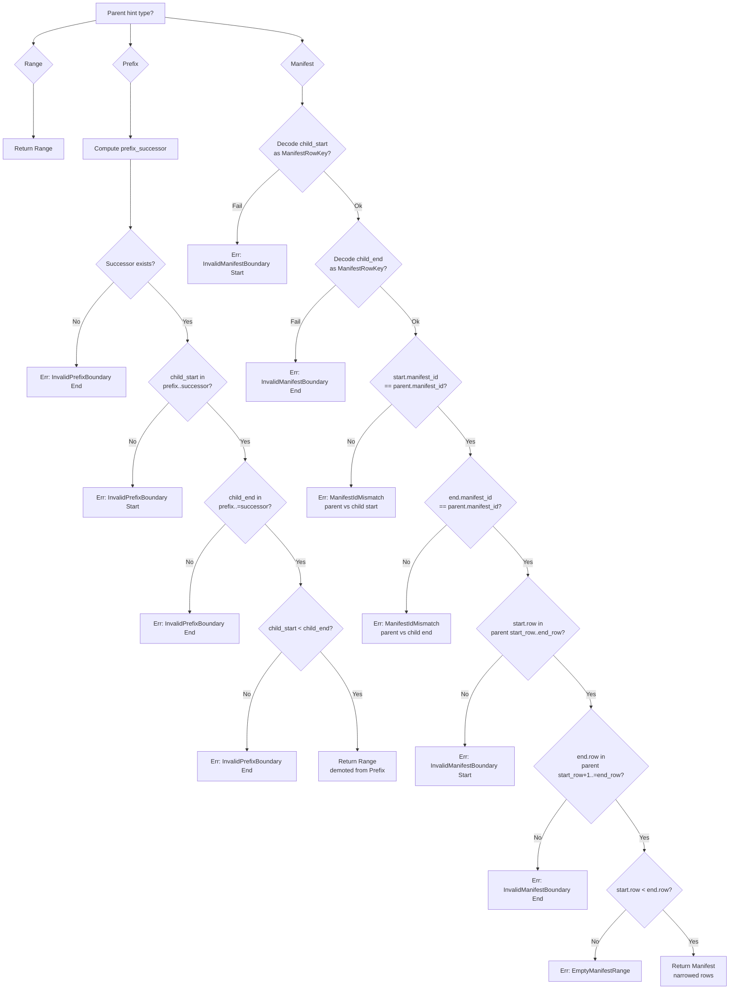

# "The Inherited Lie" -- Hint Propagation Through Splits

*A manifest shard covering rows 0-1000 in manifest 7 splits at row 500. The coordinator executes the split and produces two children: `[row_0, row_500)` and `[row_500, row_1000)`. The first child inherits the parent's hint metadata unchanged: `Manifest { manifest_id: 7, start_row: 0, end_row: 1000 }`. When a worker acquires the first child, it reads the hint and scans rows 0 through 999. But rows 500 through 999 belong to the sibling shard. The worker produces 500 duplicate items. The deduplication layer catches most of them, but 3 findings are written twice because their occurrence timestamps differ by 14 microseconds -- just enough to produce distinct content hashes. The scan reports 1003 findings for a 500-row shard. Nobody notices. The second child scans its own 500 rows independently, and the final result set contains 3 ghost duplicates that no single shard produced alone.*

---

## 1. Why Hints Must Transform on Split

The failure above illustrates a category error: a child shard inherits the parent's hint verbatim, but the parent's hint describes the parent's range, not the child's. The coordination protocol's `SplitReplacePlan` (covered in [B2 Chapter 8](../04-boundary-2-coordination/08-split-replace.md)) validates coverage -- it proves that the children's key ranges exactly partition the parent's range. But coverage validation operates on raw byte boundaries, not on the typed metadata that tells connectors what to scan. A child shard with correct byte boundaries but incorrect hint metadata passes every structural check and silently enumerates the wrong items.

Hint propagation closes this gap. When a shard splits, the propagation function inspects the parent's hint type and the child's key boundaries, then derives a new hint that accurately describes the child's narrowed domain. The rules are variant-specific: Range hints pass through unchanged, Prefix hints demote to Range because a split boundary inside a prefix range is not representable as a single child prefix, and Manifest hints narrow the row interval to match the child's actual boundaries. This chapter walks through the propagation function, its boundary validation logic, and every error condition it guards against.

## 2. The Propagation Function

Here is the definition of `propagate_hint_on_split` from `hint.rs`:

```rust
/// Derive a child hint from `parent_hint` and child key-range boundaries.
///
/// Propagation rules:
/// - `Range` stays `Range` unconditionally — no child-boundary validation is
///   performed because Range hints carry no structural information to validate
///   against.  Callers must validate child range ordering independently.
/// - `Prefix` validates child bounds and demotes to `Range` because arbitrary
///   split boundaries inside one prefix shard are not representable as a single
///   child prefix. Connectors should treat `[child_start, child_end)` as a
///   sub-range of the original prefix scan; the parent-prefix context is
///   recoverable from shard lineage (`ShardSnapshot::parent`) rather than from
///   the child hint itself.
/// - `Manifest` validates row-key boundaries and returns a narrowed
///   `Manifest` hint.
///
/// `child_start` and `child_end` follow the same half-open interval contract as
/// [`ShardSpec`]: child range is `[child_start, child_end)`.
#[must_use = "returns a Result that must be checked for boundary validation errors"]
pub fn propagate_hint_on_split(
    parent_hint: &ShardHint<'_>,
    child_start: &[u8],
    child_end: &[u8],
) -> Result<ShardHint<'static>, HintPropagationError> {
    match parent_hint {
        ShardHint::Range => Ok(ShardHint::Range),
        ShardHint::Prefix { prefix } => {
            validate_prefix_child_bounds(prefix, child_start, child_end)?;
            Ok(ShardHint::Range)
        }
        ShardHint::Manifest {
            manifest_id,
            start_row,
            end_row,
        } => {
            let start = decode_manifest_row_key(child_start).ok_or(
                HintPropagationError::InvalidManifestBoundary {
                    boundary: SplitBoundary::Start,
                },
            )?;
            let end = decode_manifest_row_key(child_end).ok_or(
                HintPropagationError::InvalidManifestBoundary {
                    boundary: SplitBoundary::End,
                },
            )?;

            if start.manifest_id() != *manifest_id {
                return Err(HintPropagationError::ManifestIdMismatch {
                    parent: *manifest_id,
                    child: start.manifest_id(),
                });
            }
            if end.manifest_id() != *manifest_id {
                return Err(HintPropagationError::ManifestIdMismatch {
                    parent: *manifest_id,
                    child: end.manifest_id(),
                });
            }

            if start.row() < *start_row || start.row() >= *end_row {
                return Err(HintPropagationError::InvalidManifestBoundary {
                    boundary: SplitBoundary::Start,
                });
            }
            if end.row() <= *start_row || end.row() > *end_row {
                return Err(HintPropagationError::InvalidManifestBoundary {
                    boundary: SplitBoundary::End,
                });
            }
            if start.row() >= end.row() {
                return Err(HintPropagationError::EmptyManifestRange {
                    start_row: start.row(),
                    end_row: end.row(),
                });
            }

            Ok(ShardHint::Manifest {
                manifest_id: *manifest_id,
                start_row: start.row(),
                end_row: end.row(),
            })
        }
    }
}
```

The function takes a borrowed parent hint and the child's raw key-range boundaries. It returns an owned `ShardHint<'static>` -- the child hint has no borrowed data because all three result variants either carry no data (Range), carry no data (demoted-from-Prefix Range), or carry only `u64` values (narrowed Manifest). The `'static` lifetime reflects this: the child hint is self-contained and can be stored, moved, or encoded without lifetime constraints.

The signature also reveals an important scope boundary. The function does not take the parent's full `ShardMetadata` envelope -- only the `ShardHint`. The `connector_extra` portion of the parent's metadata is not propagated. This is intentional: connector-private bytes are domain-specific and the hint module has no way to know how to narrow them. Child shards receive fresh connector_extra bytes when the connector registers them after the split. The hint module is responsible only for the coordination-visible typed hint.

### 2.1 Rule 1: Range Stays Range

```rust
ShardHint::Range => Ok(ShardHint::Range),
```

Range hints carry no structural information beyond "this is a generic byte-range shard." There is nothing to validate, nothing to narrow, and nothing that could be wrong in the hint itself. The child inherits Range unconditionally. No boundary check is performed because a Range hint makes no claims about the relationship between key boundaries and scan behavior -- it is the absence of a typed claim.

Callers are responsible for validating child range ordering independently -- this is handled by the coverage validation in `validate_split_coverage` (described in [B2 Chapter 8](../04-boundary-2-coordination/08-split-replace.md)), not by hint propagation. The separation is clean: coverage validation checks byte-level structural properties (ordering, contiguity, completeness), while hint propagation checks semantic properties (does the hint match the range?).

### 2.2 Rule 2: Prefix Demotes to Range

```rust
ShardHint::Prefix { prefix } => {
    validate_prefix_child_bounds(prefix, child_start, child_end)?;
    Ok(ShardHint::Range)
}
```

When a prefix shard splits, the children cannot carry a Prefix hint because the split boundary falls inside the prefix range. Consider a prefix shard covering all keys starting with `"src/"`. If the split point is `"src/m"`, the first child covers `["src/", "src/m")` and the second covers `["src/m", "src0")`. Neither child's range is expressible as a single prefix scan -- they are sub-ranges of the original prefix domain. The hint demotes to Range.

The parent-prefix context is not lost. The doc comment explains that the parent prefix is recoverable from shard lineage (`ShardSnapshot::parent`) rather than from the child hint. This means a connector that needs to know the original prefix can walk the shard's ancestry chain. But the child hint itself says only "I am a range shard" -- it does not claim to be a prefix shard, because it is not one.

Before demotion, `validate_prefix_child_bounds` verifies that the child boundaries actually fall within the parent's prefix range. This prevents propagation from succeeding for a child whose boundaries have drifted outside the parent prefix, which would indicate a coverage validation bug upstream. The validation is defense-in-depth: coverage validation should already guarantee containment, but hint propagation checks it independently to avoid silently producing a demoted Range hint for a child that has no relationship to the parent prefix.

### 2.3 Rule 3: Manifest Narrows

The Manifest case is the most complex. It performs five sequential checks:

1. **Decode child boundaries as `ManifestRowKey`**. Both `child_start` and `child_end` must decode as valid 16-byte fixed-width manifest row keys. If either fails, `InvalidManifestBoundary` is returned.

2. **Manifest ID must match**. Both decoded keys must share the parent's `manifest_id`. A child boundary pointing at a different manifest indicates a data corruption or a bug in split planning.

3. **Start row must be within parent's `[start_row, end_row)` interval**. The check is `start.row() < *start_row || start.row() >= *end_row` -- the child's start row must be at least the parent's start row and strictly less than the parent's end row.

4. **End row must be within parent's `(start_row, end_row]` interval**. The check is `end.row() <= *start_row || end.row() > *end_row` -- the child's end row must be strictly greater than the parent's start row and at most the parent's end row. Note the asymmetry: the start check uses `>=` for the upper bound (half-open interval start), while the end check uses `>` for the upper bound (the child's end may equal the parent's end, since both are exclusive).

5. **Non-empty range**. `start.row() >= end.row()` rejects degenerate or inverted child ranges.

On success, the function returns a `Manifest` hint with `manifest_id` unchanged and `start_row`/`end_row` narrowed to the child's actual row boundaries. The child hint is a strict sub-interval of the parent hint -- it covers fewer rows, but every row it claims is within the parent's original range. This is the key property that prevents the opening failure scenario: the child's hint says "I cover rows 0-499" (not 0-999), so the worker scans exactly the right rows.

The check order matters. Decode is checked first because all subsequent checks require valid `ManifestRowKey` values. Manifest ID is checked next because row-bounds checks are meaningless if the keys refer to different manifests. Row bounds are checked third. Non-emptiness is checked last because it requires both start and end rows to be individually valid. Each check returns immediately on failure, so the first error encountered is the one reported.

## 3. Prefix Boundary Validation

Here is `validate_prefix_child_bounds` from `hint.rs`:

```rust
fn validate_prefix_child_bounds(
    prefix: &[u8],
    child_start: &[u8],
    child_end: &[u8],
) -> Result<(), HintPropagationError> {
    let mut successor_buf = KeyBuf::new();
    let successor = prefix_successor(prefix, &mut successor_buf).ok_or(
        HintPropagationError::InvalidPrefixBoundary {
            boundary: SplitBoundary::End,
        },
    )?;

    if child_start < prefix || child_start >= successor {
        return Err(HintPropagationError::InvalidPrefixBoundary {
            boundary: SplitBoundary::Start,
        });
    }
    if child_end <= prefix || child_end > successor {
        return Err(HintPropagationError::InvalidPrefixBoundary {
            boundary: SplitBoundary::End,
        });
    }
    if child_start >= child_end {
        return Err(HintPropagationError::InvalidPrefixBoundary {
            boundary: SplitBoundary::End,
        });
    }

    Ok(())
}
```

Recall from Chapter 2 that `prefix_successor` computes the exclusive upper bound for a prefix range. For prefix `"src/"`, the successor is `"src0"` (the byte `0x2F` incremented to `0x30`). The validation enforces three conditions:

**Condition 1: `prefix <= child_start < successor`**. The child's start key must be at or after the prefix and strictly before the successor. A child starting before the prefix would extend below the parent's range; a child starting at or above the successor would be entirely outside the parent's range.

**Condition 2: `prefix < child_end <= successor`**. The child's end key must be strictly after the prefix (a zero-length child starting at the prefix is not useful) and at or before the successor. A child ending beyond the successor would extend above the parent's range.

**Condition 3: `child_start < child_end`**. The child range must be non-empty.

The successor computation uses a local `KeyBuf` on the stack. When `prefix_successor` returns `None` (empty prefix, all-`0xFF`, or exceeds capacity), the error is reported as `InvalidPrefixBoundary { boundary: SplitBoundary::End }` because the successor is the end bound and cannot be formed. The doc comment notes this path is unreachable through the typed prefix helpers, which reject these cases earlier.

## 4. The `SplitBoundary` Enum

Here is the definition from `hint.rs`:

```rust
/// Split boundary selector for hint-propagation errors.
#[derive(Clone, Copy, Debug, PartialEq, Eq)]
pub enum SplitBoundary {
    /// Child start key.
    Start,
    /// Child end key.
    End,
}
```

This two-variant enum appears in error payloads to indicate which boundary -- the child's start or the child's end -- failed validation. It allows callers to produce targeted diagnostics ("the child's start boundary is outside the parent prefix range") without inspecting the raw key bytes. The `Display` implementation maps `Start` to the string `"start"` and `End` to `"end"`, which is interpolated directly into the error messages of `HintPropagationError`'s display implementation.

The enum is `Copy` and carries no data beyond its discriminant. It serves purely as a diagnostic tag -- the actual failing key bytes are not included in the error. This is a deliberate trade-off: including the key bytes would require allocating a `Vec<u8>` in the error (since the error must be `'static`), which conflicts with the module's zero-allocation-on-error discipline. Callers that need the actual key bytes can inspect them before calling `propagate_hint_on_split`.

## 5. The `HintPropagationError` Enum

Here is the definition from `hint.rs`:

```rust
#[derive(Clone, Copy, Debug, PartialEq, Eq)]
#[non_exhaustive]
pub enum HintPropagationError {
    /// Prefix child boundary falls outside the parent prefix range.
    InvalidPrefixBoundary {
        /// Which boundary failed validation.
        boundary: SplitBoundary,
    },
    /// Manifest child boundary is malformed or out of parent bounds.
    ///
    /// This variant covers both key-decode failures (bytes not decodable as
    /// [`ManifestRowKey`]) and decoded-key out-of-bounds conditions (row falls
    /// outside the parent's `[start_row, end_row)` interval).  Splitting into
    /// separate variants is a future option if downstream callers need to
    /// distinguish the two failure modes.
    InvalidManifestBoundary {
        /// Which boundary failed validation.
        boundary: SplitBoundary,
    },
    /// Manifest child boundary uses a different manifest ID than the parent.
    ManifestIdMismatch {
        /// Parent manifest ID.
        parent: u64,
        /// Child boundary manifest ID.
        child: u64,
    },
    /// Manifest child rows are inverted or degenerate (`start_row >= end_row`).
    EmptyManifestRange {
        /// Child start row.
        start_row: u64,
        /// Child end row.
        end_row: u64,
    },
}
```

Four variants cover four distinct failure categories:

**`InvalidPrefixBoundary`** fires when a child boundary falls outside the parent prefix's `[prefix, prefix_successor)` range. The `boundary` field says which side failed -- Start or End. This catches split plans that produce children extending beyond the parent's domain.

**`InvalidManifestBoundary`** fires for two reasons: the raw child boundary bytes do not decode as a valid `ManifestRowKey` (wrong length, not 16 bytes), or the decoded row falls outside the parent's `[start_row, end_row)` interval. The doc comment acknowledges that collapsing these two failure modes into one variant is a design trade-off -- they could be separated if downstream callers need to distinguish key-format errors from bounds errors.

**`ManifestIdMismatch`** fires when a child boundary decodes successfully but refers to a different manifest than the parent. The `parent` and `child` fields carry the specific IDs for diagnostics. This catches a particularly subtle bug: a split plan that accidentally uses boundary keys from a different manifest would produce children that scan rows from the wrong data source entirely.

**`EmptyManifestRange`** fires when the child's decoded start row is greater than or equal to its end row. The `start_row` and `end_row` fields carry the child's decoded values. A zero-row shard is useless -- it would be acquired, produce no items, and complete, wasting a coordination cycle. The `#[non_exhaustive]` attribute on the enum allows future variants to be added (for example, if a new hint type requires a new propagation error category) without breaking callers' `match` arms.

## 6. Propagation Decision Tree

The following flowchart shows the complete decision logic for `propagate_hint_on_split`:



## 7. Before and After: Split Hint State by Variant

The following diagrams show the hint state before and after a split for each variant.

### Range Split

```text
BEFORE (parent):
  ShardHint::Range
  key range: [0x10, 0x90)

  Split point: 0x50

AFTER (two children):
  Child 1: ShardHint::Range     key range: [0x10, 0x50)
  Child 2: ShardHint::Range     key range: [0x50, 0x90)

  Propagation: passthrough. No validation, no transformation.
```

Range hints carry no structural information, so propagation is trivial. Both children inherit Range unconditionally. This is the most common case for connectors that do not use prefix or manifest hints -- every split of a Range shard produces Range children without touching the propagation logic beyond a single pattern match.

### Prefix Split

```text
BEFORE (parent):
  ShardHint::Prefix { prefix: "src/" }
  key range: ["src/", "src0")

  Split point: "src/m"

AFTER (two children):
  Child 1: ShardHint::Range     key range: ["src/", "src/m")
  Child 2: ShardHint::Range     key range: ["src/m", "src0")

  Propagation: DEMOTION. Prefix -> Range.
  Parent prefix context recoverable from shard lineage.
```

Neither child can carry a Prefix hint because neither covers the full prefix range. The demotion is deliberate: it prevents a child from claiming "I am a prefix shard for `src/`" when it only covers a subset of that prefix's keyspace. A connector that needs the original prefix inspects the shard's ancestry.

### Manifest Split

```text
BEFORE (parent):
  ShardHint::Manifest { manifest_id: 7, start_row: 0, end_row: 1000 }
  key range: [encode(7, 0), encode(7, 1000))

  Split point: encode(7, 500)

AFTER (two children):
  Child 1: ShardHint::Manifest { manifest_id: 7, start_row: 0, end_row: 500 }
           key range: [encode(7, 0), encode(7, 500))

  Child 2: ShardHint::Manifest { manifest_id: 7, start_row: 500, end_row: 1000 }
           key range: [encode(7, 500), encode(7, 1000))

  Propagation: NARROWING. Manifest rows adjusted to child boundaries.
```

This is the case from the opening failure scenario -- but done correctly. Each child's Manifest hint now describes exactly the rows it covers. The first child says "I cover rows 0-499 in manifest 7." The second says "I cover rows 500-999 in manifest 7." A worker that acquires either child and reads the hint will scan precisely the right rows. No duplicates, no gaps, no ghost findings.

Note that the `encode(7, N)` notation represents `ManifestRowKey::new(7, N).encode_into(buf)`, which produces the 16-byte big-endian encoding described in Chapter 1. The key range boundaries and the hint row interval express the same information in different forms: the boundaries are raw bytes for the coordinator's keyspace ordering, and the hint row interval is typed data for the connector's enumeration logic.

## 8. Interaction with Coverage Validation

Hint propagation and coverage validation are complementary checks that operate at different levels of abstraction.

Coverage validation (described in [B2 Chapter 8](../04-boundary-2-coordination/08-split-replace.md)) proves that children's key ranges partition the parent's key range: no gaps, no overlaps, every child well-formed. It operates on raw byte boundaries and knows nothing about hints.

Hint propagation proves that each child's typed metadata correctly describes the narrowed domain implied by its key boundaries. It operates on the semantic content of hints and knows nothing about sibling coverage.

Together, these two checks provide a complete split safety guarantee:

| Check | Level | Proves |
|-------|-------|--------|
| `validate_split_coverage` | Byte boundaries | No gaps, no overlaps, contiguous partition |
| `propagate_hint_on_split` | Typed metadata | Each child's hint matches its actual range |

A split that passes coverage validation but fails hint propagation has structurally correct byte ranges but semantically incorrect metadata -- exactly the failure from this chapter's opening scenario. A split that passes hint propagation but fails coverage validation has correct per-child metadata but a gap or overlap between siblings -- the failure from [B2 Chapter 8](../04-boundary-2-coordination/08-split-replace.md)'s opening scenario. Both checks must succeed for a split to be safe.

The two checks are also independent in their inputs. Coverage validation takes the parent `ShardSpec` and the children `ShardSpec` values -- raw byte ranges. Hint propagation takes the parent `ShardHint` and the child boundaries -- typed semantic data. Neither function calls the other. Neither function has a dependency on the other's output. The split executor runs both checks and requires both to succeed before committing the split to the shard map.

## 9. Why Prefix Demotes Instead of Narrowing

A natural question arises: why does Prefix demote to Range instead of producing a narrowed Prefix for the child? The answer lies in what a Prefix hint promises. A `ShardHint::Prefix { prefix: "src/" }` says "this shard covers every key that starts with `src/`." That is a complete-coverage claim. A child covering `["src/", "src/m")` does not cover every key starting with `src/` -- it covers only those where the next byte is less than `m`. There is no single prefix that expresses this constraint. The child would need a Prefix hint like "every key starting with `src/` where the fifth byte is less than `m`" -- which is not a prefix at all, it is a range predicate.

Demoting to Range is the honest representation. The child is a range shard whose boundaries happen to fall within a prefix domain. The prefix origin is preserved in the shard lineage graph, not in the hint, maintaining the invariant that every hint accurately describes its shard's domain.

Recall from Chapter 2 that `prefix_successor` produces the minimal exclusive upper bound for a prefix scan. The parent shard's end key is `prefix_successor("src/")` = `"src0"`. After splitting, neither child's end key equals the prefix successor, so neither child is a prefix shard. Only the original unsplit parent -- or a hypothetical future re-merged shard -- could carry the Prefix hint.

## 10. Edge Cases in Manifest Propagation

Several boundary conditions in the manifest propagation path deserve attention.

### Child End at Parent End

A child whose end row equals the parent's end row is valid. The check `end.row() > *end_row` rejects only rows strictly beyond the parent's end. This allows the common case where one child covers `[parent_start, split_point)` and the other covers `[split_point, parent_end)` -- the second child's end row is the parent's end row.

### Child Start at Parent Start

Similarly, a child whose start row equals the parent's start row is valid. The check `start.row() < *start_row` rejects only rows strictly below the parent's start. The first child in a two-way split always starts at the parent's start row.

### Single-Row Children

A child covering a single row (e.g., `start_row: 500, end_row: 501`) passes all checks: `start.row() >= parent_start_row`, `start.row() < parent_end_row`, `end.row() > parent_start_row`, `end.row() <= parent_end_row`, and `start.row() < end.row()`. Single-row shards are valid, though unusual -- they typically arise when a manifest shard is split to isolate a problematic row.

### Mixed Manifest IDs

The manifest ID check is performed on both boundaries independently. This catches a subtle error where the start boundary belongs to manifest 7 but the end boundary belongs to manifest 8 -- which would mean the child spans two different manifests. Both checks must pass:

```rust
if start.manifest_id() != *manifest_id {
    return Err(HintPropagationError::ManifestIdMismatch {
        parent: *manifest_id,
        child: start.manifest_id(),
    });
}
if end.manifest_id() != *manifest_id {
    return Err(HintPropagationError::ManifestIdMismatch {
        parent: *manifest_id,
        child: end.manifest_id(),
    });
}
```

The error payload distinguishes the offending child manifest ID from the expected parent manifest ID, making the mismatch immediately diagnosable.

### Non-ManifestRowKey Boundaries

When the child boundaries are not valid 16-byte `ManifestRowKey` encodings (wrong length, arbitrary bytes), `decode_manifest_row_key` returns `None` and propagation fails with `InvalidManifestBoundary`. Recall from Chapter 1 that `decode_manifest_row_key` checks only that the input is exactly `ManifestRowKey::ENCODED_LEN` (16) bytes -- any other length returns `None`. This guards against a split plan that uses arbitrary byte keys as boundaries for a manifest shard -- which would happen if the split planner used `byte_midpoint` (from Chapter 2) on manifest row key bytes without understanding their structure.

The `byte_midpoint` function operates on raw bytes and knows nothing about `ManifestRowKey` structure. It could produce a 17-byte midpoint for two 16-byte inputs (by appending a `0x00` byte in the successor fallback path), or it could produce a value that is valid bytes but decodes to a different manifest_id. Hint propagation catches both cases: the first fails at the decode step (wrong length), and the second fails at the manifest ID check.

## 11. Summary

Hint propagation transforms a parent's typed metadata into child hints that accurately describe each child's narrowed domain. Three rules govern the transformation: Range passes through unchanged because it carries no structural information. Prefix demotes to Range because arbitrary sub-ranges of a prefix domain are not expressible as a single prefix. Manifest narrows the row interval by decoding child boundaries as `ManifestRowKey` values and validating them against the parent's row range.

Four error variants -- `InvalidPrefixBoundary`, `InvalidManifestBoundary`, `ManifestIdMismatch`, and `EmptyManifestRange` -- cover every boundary violation that could produce a child with semantically incorrect metadata. Together with the coverage validation from [B2 Chapter 8](../04-boundary-2-coordination/08-split-replace.md), hint propagation ensures that a split is both structurally complete (no gaps, no overlaps) and semantically correct (every child's hint describes exactly what it covers).

Hint propagation handles a single split. At startup, a connector may need to register hundreds of shards at once. Chapter 5 introduces the `PreallocShardBuilder` that stages bulk registrations while maintaining the allocation discipline and validation guarantees established in this chapter and Chapter 3.
