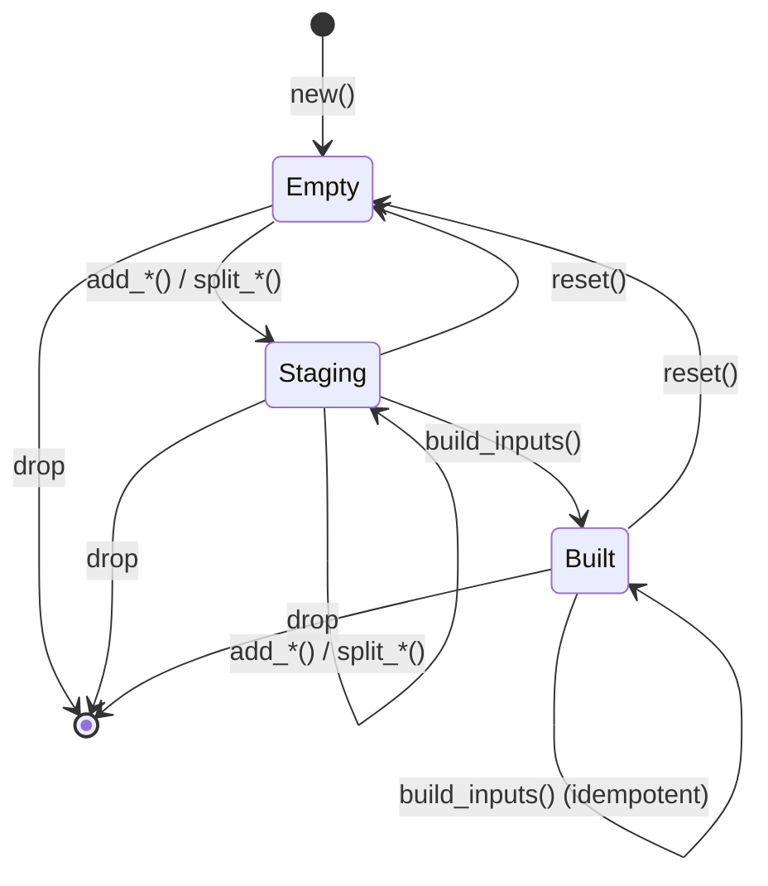

# "The Partial Registration" -- The PreallocShardBuilder

*A connector registers 500 shards at startup. The builder stages each shard spec into a borrowed arena, allocating key-range bytes and metadata for every entry. Shard 499 triggers a slab-full error -- the arena's byte budget is exhausted. The first 498 shards are partially committed to the coordinator's shard map, but the connector cannot tell which were registered and which were not. The run starts with a fragmented manifest missing two shards. Items in the key ranges `[0x7A00, 0x7A80)` and `[0x7A80, 0x7B00)` are never scanned. The scan completes, reporting 100% coverage, but it silently misses 1,200 items containing three leaked API keys. The dashboard shows green. The security team discovers the gap four days later during a manual audit.*

*This failure has a single root cause: the registration path lacks transactional staging. Without a builder that validates the complete manifest before committing any shard to the coordinator, partial registration is indistinguishable from successful registration.*

---

The `PreallocShardBuilder` exists to prevent this exact scenario. It provides a two-phase workflow: stage all shards into a bounded local buffer, validate the complete manifest, and only then hand the validated inputs to the coordinator for atomic registration. If any shard fails validation or exceeds capacity, the coordinator's state is never touched. The builder is the gatekeeper between connector-provided shard specifications and the coordination protocol's `register_shards` operation.

This chapter walks through the builder's design from `builder.rs` in the `gossip-frontier` crate. The builder is the startup-time entry point for all shard registration -- every shard that enters the coordination protocol passes through it.

The design follows a pattern common in database systems: batch staging with deferred validation. Individual writes are buffered locally, validated for per-item correctness, and only committed as a group once cross-item constraints (uniqueness, ordering, coverage) are verified. The builder applies this pattern to shard manifests, where the cross-item constraint is that ranges must not overlap and cursors must fall within their shard's key range.

## 1. Module Overview

The module-level documentation in `builder.rs` establishes the two-phase contract and the capacity hierarchy that governs it:

```rust
//! Startup-preallocated shard builder with borrowed-first add paths.
//!
//! The builder borrows a caller-provided [`ShardArena`] and tracks entries in a
//! bounded [`InlineVec`], exposing allocation-silent add operations after
//! startup preallocation. Arena slot/byte sizing is the caller's responsibility;
//! the builder only validates logical entry limits.
//!
//! # Two-phase workflow
//!
//! 1. **Stage** -- `add_*` and `split_*` methods validate individual shard
//!    specs and append them to the entry buffer, allocating arena-backed storage
//!    for each spec's key range and metadata.
//! 2. **Finalize** -- [`PreallocShardBuilder::build_inputs`] materializes
//!    [`InitialShardInput`] rows and re-checks manifest-level invariants
//!    (uniqueness, bounded ranges, overlap, cursor bounds) before handoff
//!    to run registration.
//!
//! Error reporting is intentionally split by phase:
//! - add-time errors isolate entry-limit violations, arena capacity failures,
//!   and rejection of invalid external handles passed to
//!   [`PreallocShardBuilder::add_spec_handle`].
//! - build-time errors surface manifest-shape violations and defensively report
//!   invalid staged handles if they are observed.
```

The phase split is deliberate. Add-time validation catches per-entry errors immediately: inverted ranges, empty prefixes, slab exhaustion. Build-time validation catches manifest-level errors that span multiple entries: overlapping ranges, cursor-out-of-bounds, and duplicate shard IDs. A single entry in isolation can appear valid while the combination of entries violates manifest constraints. Deferring manifest validation to `build_inputs` keeps add operations cheap (one entry at a time) while still catching cross-entry violations before any coordinator state is modified.

## 2. The Builder Struct

The core struct borrows a caller-provided arena and tracks staged entries in a stack-allocated inline buffer:

```rust
/// Startup-preallocated shard builder backed by a borrowed arena.
///
/// - Specs are stored in a caller-provided [`ShardArena`] via mutable borrow.
/// - Entries are tracked in an [`InlineVec`] that never spills because
///   `entry_limit <= CAP`.
/// - Public add paths accept borrowed/spec-handle inputs only.
/// - Dropping the builder clears the borrowed arena; use a dedicated arena
///   when specs must outlive builder teardown.
///
/// `CAP` controls the inline entry buffer size. Each entry includes a
/// [`CursorUpdate`] (two optional borrowed slices), so per-entry stack size
/// is target-dependent and larger than a small POD record. A compile-time
/// assertion rejects `CAP > 1024` to keep stack growth bounded.
///
/// The builder does not own cursor key bytes in staged entries:
/// [`CursorUpdate`] payloads are borrowed for lifetime `'a`. This keeps
/// startup registration allocation-light, but callers must ensure borrowed
/// cursor data outlives the [`InitialShardInput`] slice produced by
/// [`Self::build_inputs`].
pub struct PreallocShardBuilder<'a, const CAP: usize> {
    arena: &'a mut ShardArena,
    scratch: ShardSpecScratch,
    entries: InlineVec<BuilderEntry<'a>, CAP>,
    entry_limit: usize,
    next_shard_raw: u64,
}
```

Each field serves a distinct role in the builder's operation:

**`arena: &'a mut ShardArena`** -- The borrowed arena where shard spec bytes (key ranges and metadata) are stored. The builder does not own the arena; it borrows it mutably for the duration of staging. Arena slot and byte capacity are the caller's responsibility -- the builder validates logical entry limits but does not resize the arena. On drop, the builder clears the arena to release all slab-backed storage.

**`scratch: ShardSpecScratch`** -- A reusable encode/decode buffer for key encoding and metadata framing. The hint module's `range_shard_into`, `prefix_shard_into`, and `manifest_shard_into` helpers use this scratch space to encode shard specs without per-call allocation. Resetting the builder also resets the scratch buffer.

**`entries: InlineVec<BuilderEntry<'a>, CAP>`** -- The staged entry buffer. `InlineVec` (from `gossip-stdx`) is a stack-first small collection that never spills to the heap when the element count stays within `CAP`. Since `entry_limit <= CAP` is enforced at construction, the inline buffer is always sufficient. Each `BuilderEntry` holds a `ShardId`, a `ShardSpecHandle` (an index into the arena), and a `CursorUpdate` (borrowed key slices).

**`entry_limit: usize`** -- The logical cap on how many entries the builder accepts. This is the caller-chosen cardinality for the initial manifest. All `add_*` and `split_*` methods check this before staging.

**`next_shard_raw: u64`** -- A monotonic counter for sequential shard ID assignment. Each successful `push_entry` call consumes one ID and advances the counter. Failed adds do not consume IDs. The counter starts at 0 and resets on `reset()`.

The internal entry struct is private:

```rust
/// A staged shard registration: shard ID, arena-backed spec, and borrowed cursor.
#[derive(Clone, Copy, Debug, PartialEq, Eq)]
struct BuilderEntry<'a> {
    shard: ShardId,
    spec_handle: ShardSpecHandle,
    cursor: CursorUpdate<'a>,
}
```

The `BuilderEntry` is `Copy` because all three fields are small value types: `ShardId` is a `u64` wrapper, `ShardSpecHandle` is an arena index, and `CursorUpdate` holds two `Option<&'a [u8]>` slices (borrowed, not owned). The entry does not own any heap memory -- the spec bytes live in the arena, and the cursor bytes are borrowed from the caller. This keeps the `InlineVec<BuilderEntry, CAP>` stack-friendly even at `CAP = 1024`.

The separation of storage (`ShardArena`) from tracking (`InlineVec<BuilderEntry>`) is deliberate. The arena is a slab allocator optimized for fixed-size spec storage. The entry buffer is a flat array optimized for sequential iteration. Neither data structure is ideal for the other's role. Combining them would force a choice between slab allocation (wasteful for small index-like entries) and flat-array storage (unsuitable for variable-length spec bytes). The two-structure design gives each component the allocator it needs.

## 3. The Capacity Hierarchy

Three limits constrain how many entries the builder accepts. The documentation describes them from innermost to outermost:

```text
                    +--------------------------------------------+
                    |         MAX_INITIAL_SHARDS (10,000)         |
                    |   +------------------------------------+   |
                    |   |       CAP (const generic, <= 1024) |   |
                    |   |   +----------------------------+   |   |
                    |   |   |    entry_limit (caller)    |   |   |
                    |   |   +----------------------------+   |   |
                    |   +------------------------------------+   |
                    +--------------------------------------------+

                    entry_limit  <=  CAP  <=  1024
                    entry_limit  <=  MAX_INITIAL_SHARDS (10,000)
```

The constructor enforces all three constraints:

```rust
    pub fn new(
        arena: &'a mut ShardArena,
        entry_limit: usize,
    ) -> Result<Self, PreallocShardBuilderError> {
        const {
            assert!(
                CAP <= 1024,
                "PreallocShardBuilder: CAP > 1024 risks excessive stack usage"
            )
        };

        if entry_limit == 0 {
            return Err(PreallocShardBuilderError::EntryLimitZero);
        }
        if entry_limit > CAP {
            return Err(PreallocShardBuilderError::CapMismatch {
                entry_limit,
                cap: CAP,
            });
        }
        if entry_limit > MAX_INITIAL_SHARDS {
            return Err(PreallocShardBuilderError::EntryLimitExceedsManifestMax {
                entry_limit,
                max: MAX_INITIAL_SHARDS,
            });
        }

        Ok(Self {
            arena,
            scratch: ShardSpecScratch::new(),
            entries: InlineVec::new(),
            entry_limit,
            next_shard_raw: 0,
        })
    }
```

The `const { assert!(...) }` block is a compile-time check: any attempt to instantiate `PreallocShardBuilder<_, 2048>` fails at compile time, not at runtime. This prevents a caller from accidentally placing a megabyte-scale inline buffer on the stack. The runtime checks catch logical misconfigurations: zero entries (useless), `entry_limit > CAP` (the `InlineVec` would overflow), and `entry_limit > MAX_INITIAL_SHARDS` (the coordination protocol rejects manifests larger than 10,000 shards).

Bulk split helpers enforce a fourth constraint: `MAX_SPLIT_CHILDREN` (256) as a per-call fan-out cap. A single `split_range_by_boundaries` or `split_manifest_by_rows` call cannot produce more than 256 children, regardless of remaining entry budget.

The capacity hierarchy serves defense-in-depth. Even if a caller passes a reasonable `entry_limit`, the compile-time `CAP` ceiling prevents accidental stack explosion. Even if `CAP` is within bounds, the `MAX_INITIAL_SHARDS` ceiling prevents the coordination protocol from being overwhelmed with a manifest larger than the system can manage. Each layer catches a different class of misconfiguration.

Why is the `CAP` ceiling 1024 and not, say, 4096? Each `BuilderEntry` contains a `CursorUpdate` with two `Option<&[u8]>` slices. On a 64-bit target, each entry is approximately 48-64 bytes depending on alignment. At `CAP = 1024`, the inline buffer consumes roughly 48-64 KB of stack space. At `CAP = 4096`, that grows to 192-256 KB -- large enough to cause stack overflows in deeply-nested call chains or on platforms with small default stack sizes. The 1024 ceiling keeps stack usage within a conservative bound while still accommodating manifests with hundreds of shards.

## 4. Add Methods

The builder provides typed add methods for each shard kind. Each method validates the entry, allocates arena storage, and stages the result.

### Range Shards

```rust
    pub fn add_range(
        &mut self,
        start: &[u8],
        end: &[u8],
        connector_extra: &[u8],
    ) -> Result<ShardId, PreallocShardBuilderError> {
        self.add_range_with_cursor(start, end, connector_extra, CursorUpdate::initial())
    }
```

The no-cursor variant delegates to the cursor variant with `CursorUpdate::initial()`. This pattern repeats for all three shard kinds.

### Prefix Shards

```rust
    pub fn add_prefix(
        &mut self,
        prefix: &[u8],
        connector_extra: &[u8],
    ) -> Result<ShardId, PreallocShardBuilderError> {
        self.add_prefix_with_cursor(prefix, connector_extra, CursorUpdate::initial())
    }
```

### Manifest Shards

```rust
    pub fn add_manifest(
        &mut self,
        manifest_id: u64,
        start_row: u64,
        end_row: u64,
        connector_extra: &[u8],
    ) -> Result<ShardId, PreallocShardBuilderError> {
        self.add_manifest_with_cursor(
            manifest_id,
            start_row,
            end_row,
            connector_extra,
            CursorUpdate::initial(),
        )
    }
```

### The Cursor Pattern

Each shard kind has a `*_with_cursor` variant that accepts an explicit `CursorUpdate`. Here is the range variant:

```rust
    /// Add a range shard with an explicit borrowed cursor update.
    ///
    /// Cursor/key consistency is validated at [`Self::build_inputs`] time by
    /// [`validate_manifest`], not during this append step.
    ///
    /// # Errors
    ///
    /// - [`PreallocShardBuilderError::CapacityExceeded`] if `entry_limit`
    ///   would be exceeded.
    /// - [`PreallocShardBuilderError::RangeInvalid`] for invalid bounds or
    ///   metadata sizing.
    /// - [`PreallocShardBuilderError::SlabFull`] if arena storage is exhausted.
    pub fn add_range_with_cursor(
        &mut self,
        start: &[u8],
        end: &[u8],
        connector_extra: &[u8],
        cursor: CursorUpdate<'a>,
    ) -> Result<ShardId, PreallocShardBuilderError> {
        self.ensure_entry_capacity(1)?;
        let handle = range_shard_into(self.arena, start, end, connector_extra, &mut self.scratch)
            .map_err(|err| match err {
            ShardIntoError::Build(err) => PreallocShardBuilderError::RangeInvalid(err),
            ShardIntoError::SlabFull(err) => PreallocShardBuilderError::SlabFull(err),
        })?;
        Ok(self.push_entry(handle, cursor))
    }
```

The cursor is stored as-is at add time. Cursor/key consistency -- verifying that the cursor's `last_key` falls within the shard's `[start, end)` range -- is deferred to `build_inputs`. This deferred validation is the same phase-split principle from the module overview: per-entry validation at add time, cross-entry and cursor-range validation at build time.

The execution order within `add_range_with_cursor` is significant:

1. `ensure_entry_capacity(1)` -- check the logical limit before touching the arena.
2. `range_shard_into(...)` -- encode and allocate in the arena. This validates key bounds (start < end, neither exceeds `MAX_KEY_SIZE`) and metadata sizing, then allocates a slab slot for the spec bytes.
3. `push_entry(handle, cursor)` -- assign a shard ID and append to the entry buffer.

If step 1 fails, no arena bytes are consumed. If step 2 fails (invalid range or slab full), no entry is staged and no shard ID is consumed. The ordering ensures that failures at any step leave the builder state unchanged -- the atomicity guarantee for single adds.

The `connector_extra` parameter in every add method carries opaque bytes from the connector into the shard's metadata envelope (Chapter 3). The builder does not interpret these bytes; it passes them through the hint module's encoding layer, which wraps them in the `ShardMetadata` frame alongside the `ShardHint` tag. This allows connectors to attach source-specific routing information (bucket names, partition keys, file system mount points) to individual shards without the builder needing to understand the connector's schema.

## 5. Zero-Copy Paths

Two add methods bypass the encode-into-arena path for pre-existing specs.

**`add_spec_ref`** validates a borrowed spec and copies its bytes into the arena:

```rust
    /// Validate and add a borrowed spec with an initial cursor, copying
    /// bytes into the arena.
    ///
    /// The entry is staged with [`CursorUpdate::initial`]; there is no
    /// `_with_cursor` variant for borrowed-spec inputs.
    ///
    /// # Errors
    ///
    /// - [`PreallocShardBuilderError::CapacityExceeded`] if `entry_limit`
    ///   would be exceeded.
    /// - [`PreallocShardBuilderError::SpecInvalid`] if `spec` fails
    ///   [`ShardSpec::validate_ref`].
    /// - [`PreallocShardBuilderError::SlabFull`] if arena storage is exhausted.
    pub fn add_spec_ref(
        &mut self,
        spec: ShardSpecRef<'a>,
    ) -> Result<ShardId, PreallocShardBuilderError> {
        self.ensure_entry_capacity(1)?;
        ShardSpec::validate_ref(spec).map_err(PreallocShardBuilderError::SpecInvalid)?;
        let handle = self
            .arena
            .alloc_spec(spec)
            .map_err(PreallocShardBuilderError::SlabFull)?;
        Ok(self.push_entry(handle, CursorUpdate::initial()))
    }
```

**`add_spec_handle`** is the true zero-copy path. It accepts a handle that already references a live spec in the borrowed arena:

```rust
    /// Add an existing arena-backed spec handle with an initial cursor.
    ///
    /// This is a zero-copy path: no spec bytes are re-allocated. The handle
    /// must reference a live spec in the borrowed arena. Handles from a
    /// different [`ShardArena`] instance or stale generation are rejected by
    /// [`ShardArena::try_view_spec`].
    ///
    /// On success, lifecycle ownership moves to the staged entry: [`Self::reset`]
    /// frees tracked handles and [`Drop`] clears the entire arena.
    ///
    /// # Errors
    ///
    /// - [`PreallocShardBuilderError::CapacityExceeded`] if `entry_limit`
    ///   would be exceeded.
    /// - [`PreallocShardBuilderError::InvalidSpecHandle`] for stale/foreign
    ///   handles, including handles invalidated by [`Self::reset`].
    pub fn add_spec_handle(
        &mut self,
        spec_handle: ShardSpecHandle,
    ) -> Result<ShardId, PreallocShardBuilderError> {
        self.ensure_entry_capacity(1)?;
        if self.arena.try_view_spec(&spec_handle).is_none() {
            return Err(PreallocShardBuilderError::InvalidSpecHandle);
        }
        Ok(self.push_entry(spec_handle, CursorUpdate::initial()))
    }
```

The liveness check via `try_view_spec` catches three failure modes: handles from a different `ShardArena` instance, handles from a previous generation (after `reset`), and handles that have been explicitly freed. Stale-handle rejection prevents a class of use-after-free bugs at the logical level -- the arena's generation counter acts as a lightweight validity token.

The distinction between `add_spec_ref` and `add_spec_handle` reflects two different ownership scenarios. `add_spec_ref` is for specs that exist as borrowed byte slices -- perhaps read from a configuration file or received over a network. The bytes must be copied into the arena for the builder to hold them past the borrow's lifetime. `add_spec_handle` is for specs that are already in the arena -- perhaps allocated by a previous builder phase or by the connector's own initialization code. No copy is needed; the handle is simply tracked.

Both methods stage entries with `CursorUpdate::initial()`. There are no `*_with_cursor` variants for spec-ref and spec-handle inputs. This is a deliberate API simplification: pre-existing specs typically come from cold paths (configuration, migration) where cursor state is not yet established. Callers that need explicit cursors should use the typed add methods (`add_range_with_cursor`, `add_prefix_with_cursor`, `add_manifest_with_cursor`) which accept cursor parameters.

## 6. Sequential ID Assignment

Shard IDs are assigned monotonically starting from 0:

```rust
    /// Allocate the next sequential shard ID (monotonically increasing from 0).
    ///
    /// IDs advance only when an entry is actually appended via
    /// [`Self::push_entry`]. Failed add calls that append nothing do not consume
    /// IDs. Split helpers may still consume IDs for already appended children
    /// before returning [`PreallocShardBuilderError::SlabFull`].
    ///
    /// # Panics
    ///
    /// Panics on `u64` overflow, which cannot happen for any `entry_limit`
    /// within `MAX_INITIAL_SHARDS`.
    fn next_shard_id(&mut self) -> ShardId {
        let shard = ShardId::from_raw(self.next_shard_raw);
        self.next_shard_raw = self
            .next_shard_raw
            .checked_add(1)
            .expect("PreallocShardBuilder: shard-id overflow");
        shard
    }
```

The panic guard on `u64` overflow is a defense-in-depth assertion. Since `entry_limit <= MAX_INITIAL_SHARDS` (10,000) and `MAX_INITIAL_SHARDS` is far below `u64::MAX`, overflow is structurally impossible. The `checked_add` + `expect` makes this impossible condition self-documenting rather than silently wrapping.

The `push_entry` method couples ID assignment with entry staging:

```rust
    /// Append a validated entry. Caller must have already called
    /// `ensure_entry_capacity` to guarantee room.
    fn push_entry(&mut self, spec_handle: ShardSpecHandle, cursor: CursorUpdate<'a>) -> ShardId {
        debug_assert!(
            self.entries.len() < self.entry_limit,
            "push_entry: capacity invariant violated"
        );
        let shard = self.next_shard_id();
        self.entries.push(BuilderEntry {
            shard,
            spec_handle,
            cursor,
        });
        shard
    }
```

The `debug_assert!` is a contract check: every caller of `push_entry` must have passed the capacity check first. In release builds this compiles to nothing; in debug builds it catches internal logic errors where a code path bypasses the capacity gate.

The ID assignment scheme is simple by design. Unlike the coordination protocol's `derive_split_shard_id` (which uses BLAKE3 hashing for domain-separated child IDs during splits), the builder assigns raw sequential integers starting from 0. This is appropriate because the builder operates at registration time, before any distributed coordination has occurred. There is no risk of ID collision with shards from other runs or other tenants -- the coordination protocol's `register_shards` operation assigns globally unique identifiers when it accepts the builder's output. The builder's sequential IDs serve as local identifiers within the staging buffer, not as durable global identifiers.

## 7. Reset and Drop Semantics

The builder supports reuse through explicit reset:

```rust
    /// Reset all builder state for reuse.
    ///
    /// Frees arena-backed specs for all tracked entries, clears the entry
    /// buffer, and restarts shard IDs at 0.
    ///
    /// This invalidates any handles staged in this builder (including handles
    /// accepted through [`Self::add_spec_handle`]) and any
    /// [`InitialShardInput`] slices built from earlier state.
    pub fn reset(&mut self) {
        let old = std::mem::replace(&mut self.entries, InlineVec::new());
        for entry in old.as_slice() {
            self.arena.free_spec(entry.spec_handle);
        }
        self.scratch = ShardSpecScratch::new();
        self.next_shard_raw = 0;
    }
```

Reset frees each tracked handle individually, preserving the arena for reuse. The `std::mem::replace` swap drains the old entry buffer without leaving the builder in a partially-cleared state.

Drop takes a coarser approach:

```rust
/// Clears the borrowed arena on drop to release all slab-backed specs.
///
/// This ensures arena resources are reclaimed even if the builder is
/// dropped without an explicit [`PreallocShardBuilder::reset`] call.
/// Any [`ShardSpecHandle`] values obtained from the arena become invalid.
impl<'a, const CAP: usize> Drop for PreallocShardBuilder<'a, CAP> {
    fn drop(&mut self) {
        self.arena.clear();
    }
}
```

Drop clears the entire arena rather than freeing individual handles. This is correct because the builder borrows the arena exclusively -- no external code holds live handles into it. The asymmetry between `reset` (per-handle free, allows reuse) and `drop` (bulk clear, final cleanup) reflects the lifecycle: `reset` anticipates continued use; `drop` anticipates the end.



## 8. The Error Taxonomy

The builder's error type categorizes failures by phase:

```rust
/// Error for [`PreallocShardBuilder`] construction and add/build operations.
#[derive(Clone, Debug, PartialEq, Eq)]
pub enum PreallocShardBuilderError {
    // -- Configuration (returned from `new`) --
    /// `entry_limit` was zero.
    EntryLimitZero,
    /// `entry_limit` exceeded const generic `CAP`.
    CapMismatch { entry_limit: usize, cap: usize },
    /// `entry_limit` exceeded [`MAX_INITIAL_SHARDS`].
    EntryLimitExceedsManifestMax { entry_limit: usize, max: usize },

    // -- Add/build --
    /// Requested append would exceed configured entry budget.
    CapacityExceeded {
        limit: usize,
        current: usize,
        additional: usize,
    },
    /// Bulk split fan-out exceeds [`MAX_SPLIT_CHILDREN`].
    FanOutExceeded { limit: usize, requested: usize },
    /// Arena handle table or byte slab could not allocate another spec.
    SlabFull(SlabFull),
    /// Range constructor rejected bounds or metadata sizing.
    RangeInvalid(ShardSpecInputError),
    /// Prefix constructor rejected prefix semantics or derived range.
    PrefixInvalid(PrefixShardError),
    /// Manifest constructor rejected row bounds or metadata sizing.
    ManifestCtorInvalid(ShardSpecInputError),
    /// Borrowed spec input failed [`ShardSpec`] validation.
    SpecInvalid(ShardSpecInputError),
    /// Handle was stale, foreign, or otherwise not live in this arena.
    InvalidSpecHandle,
    /// Staged entries failed manifest-level checks at build time.
    ManifestInvalid(ManifestValidationError),
}
```

The 12 variants fall into four categories:

**Configuration errors** (returned from `new`): `EntryLimitZero`, `CapMismatch`, `EntryLimitExceedsManifestMax`. These indicate a programming error in the caller's setup code. A correctly configured builder never produces these at runtime.

**Add-time errors**: `CapacityExceeded`, `SlabFull`, `RangeInvalid`, `PrefixInvalid`, `ManifestCtorInvalid`, `SpecInvalid`, `InvalidSpecHandle`. These indicate per-entry failures: the entry budget is exhausted, the arena is full, the shard spec is malformed, or a handle is stale. A failed add leaves the builder state unchanged (the entry is not staged, and no shard ID is consumed).

**Build-time errors**: `ManifestInvalid`. This indicates a cross-entry violation detected by `validate_manifest`: overlapping ranges, cursor out of bounds, duplicate shard IDs, or an empty manifest. Build-time errors surface only when `build_inputs` is called.

**Bulk split errors**: `FanOutExceeded`. This indicates that a single split call would produce more than `MAX_SPLIT_CHILDREN` (256) children. It is checked before any entries are staged, so the builder state is unchanged on failure.

The error type wraps inner errors (`SlabFull`, `ShardSpecInputError`, `PrefixShardError`, `ManifestValidationError`) rather than flattening them. This preserves diagnostic detail: a caller receiving `PrefixInvalid(PrefixShardError::NoSuccessor)` knows both *what failed* (prefix add) and *why* (the prefix was all `0xFF` bytes and has no lexicographic successor, as discussed in Chapter 2).

The `CapacityExceeded` variant carries three fields: `limit`, `current`, and `additional`. This enables precise diagnostics. A log message can report "entry capacity exceeded: 498 existing + 3 new > 500 limit" rather than the opaque "capacity exceeded." The `FanOutExceeded` variant similarly carries `limit` and `requested`, enabling "split fan-out exceeded: 257 children requested > 256 limit." These structured error payloads follow the same design philosophy as the `InvariantViolation` enum in the B2 simulation harness (described in [Chapter 12](../04-boundary-2-coordination/12-proving-correctness.md)) -- every error carries enough context to diagnose the failure without additional logging or debugging.

The `Display` implementation formats each variant into a human-readable message:

```rust
impl fmt::Display for PreallocShardBuilderError {
    fn fmt(&self, f: &mut fmt::Formatter<'_>) -> fmt::Result {
        match self {
            Self::EntryLimitZero => write!(f, "entry_limit must be > 0"),
            Self::CapMismatch { entry_limit, cap } => {
                write!(f, "entry_limit ({entry_limit}) exceeds builder CAP ({cap})")
            }
            Self::EntryLimitExceedsManifestMax { entry_limit, max } => write!(
                f,
                "entry_limit ({entry_limit}) exceeds MAX_INITIAL_SHARDS ({max})"
            ),
            Self::CapacityExceeded {
                limit,
                current,
                additional,
            } => write!(
                f,
                "entry capacity exceeded: {current} existing + {additional} new > {limit} limit"
            ),
            Self::FanOutExceeded { limit, requested } => write!(
                f,
                "split fan-out exceeded: {requested} children requested > {limit} limit"
            ),
            Self::SlabFull(err) => write!(f, "{err}"),
            Self::RangeInvalid(err) => write!(f, "{err}"),
            Self::PrefixInvalid(err) => write!(f, "{err}"),
            Self::ManifestCtorInvalid(err) => write!(f, "{err}"),
            Self::SpecInvalid(err) => write!(f, "{err}"),
            Self::InvalidSpecHandle => write!(f, "invalid, stale, or foreign shard-spec handle"),
            Self::ManifestInvalid(err) => write!(f, "{err}"),
        }
    }
}
```

The wrapper variants (`SlabFull`, `RangeInvalid`, `PrefixInvalid`, `ManifestCtorInvalid`, `SpecInvalid`, `ManifestInvalid`) delegate to their inner error's `Display` implementation. The `Error::source()` implementation chains to the inner error for all wrapper variants and returns `None` for leaf variants. This follows the standard Rust error-chain convention, allowing callers to traverse the error cause chain for logging or reporting.

## 9. The Borrowed-Arena Pattern

The builder's decision to borrow (rather than own) the arena is a fundamental design choice that deserves examination. An owned-arena design would create the arena internally, hide it behind the builder's API, and drop it when the builder is dropped. This would be simpler for callers -- no need to manage arena lifetime separately.

The borrowed-arena design was chosen for three reasons:

**Arena sizing is the caller's decision.** Different connectors produce different numbers of shards with different spec sizes. A filesystem connector scanning a directory tree might produce 50 shards with 200-byte specs. A manifest connector scanning a database might produce 500 shards with 48-byte specs. The arena's slot count and byte budget depend on the connector's data model, not on the builder's internal logic. By requiring the caller to provide a sized arena, the builder avoids hard-coding sizing assumptions.

**Arena reuse across retries.** If the first registration attempt fails (perhaps the coordinator is temporarily unavailable), the caller can `reset()` the builder and retry without reallocating the arena. The arena's slab storage is reused, avoiding repeated allocation/deallocation cycles. An owned-arena design would either need to preserve the arena across reset (requiring the builder to track arena state) or reallocate on every retry.

**Testability.** Tests can create arenas with deliberately constrained capacity to exercise slab-full error paths. `ShardArena::with_capacity(1, 4_096)` creates an arena with one slot and 4,096 bytes -- enough for a single spec. The second `add_range` call triggers `SlabFull`. An owned-arena design would need a separate configuration mechanism to enable this kind of capacity-constrained testing.

## 10. Summary

The `PreallocShardBuilder` enforces a two-phase registration workflow: stage entries into a bounded inline buffer backed by a borrowed arena, then validate the complete manifest before handing inputs to the coordinator. The capacity hierarchy (entry_limit, CAP, MAX_INITIAL_SHARDS) prevents both stack overflow and manifest bloat. Sequential ID assignment from 0 ensures deterministic shard identity. The error taxonomy separates configuration, add-time, build-time, and bulk-split failures so callers can handle each category appropriately.

The builder's design -- borrowed arena, two-phase validation, phase-separated errors -- reflects a broader principle: registration is too important to leave to ad-hoc per-shard calls. A single corrupt entry in a 500-shard manifest can produce a silent coverage gap that persists for the entire scan. The builder makes it structurally impossible for a partial or malformed manifest to reach the coordinator.

Chapter 6 covers the bulk split helpers and manifest validation that complete the builder's API.
