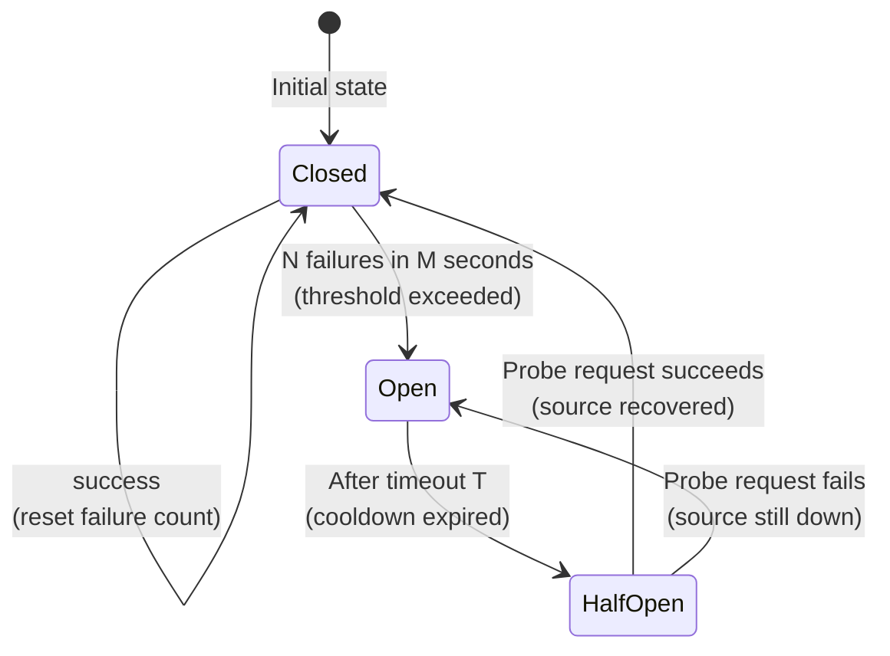

# "Tripping the Wire" -- Circuit Breaker Design

*Two hundred workers are scanning shards from a GitHub Enterprise instance at `ghe.corp.example.com`. At 14:32:07 UTC, the instance begins returning HTTP 503 on every API call -- an infrastructure failure that will last fifteen minutes. Worker 1 receives a 503, classifies it as `ErrorClass::Retryable`, and retries after 2 seconds. Worker 2 does the same. Worker 3, 4, 5, through 200 -- all of them enter independent exponential backoff loops, each creating a new connection attempt every cycle. Within sixty seconds, the cluster is generating 12,000 connection attempts per minute against an already-struggling server. At 14:47:00, the GitHub instance partially recovers. The surge of 200 simultaneous reconnection attempts overwhelms its connection pool. The instance crashes again. The operations team manually rate-limits traffic at 15:14:00 and brings the instance back at 15:51:00. A fifteen-minute outage has become a three-hour outage, caused not by the original failure but by the recovery traffic from the system that was trying to help.*

---

## Why a Circuit Breaker Exists

The failure above is a positive feedback loop: retries intended to recover from the outage are the mechanism that extends it. Each worker acts rationally in isolation -- it sees a transient error and retries -- but the aggregate effect of 200 independent retry loops is a thundering herd that prevents recovery. The pattern has a name in reliability engineering: **cascading failure**. One component's degradation propagates through shared resources (worker threads, connection pools, the source's capacity) until the entire system stalls.

The circuit breaker eliminates this feedback loop by converting a slow failure (30-second timeout, then retry, then another timeout) into a fast failure (immediate rejection, no network call). The concept was first articulated by Michael Nygard in *Release It!* (2007, 2nd ed. 2018): when a source is down, stop calling it. Instead of letting hundreds of workers block on timeouts, the circuit breaker trips open after a small number of consecutive failures and begins rejecting requests immediately. Workers that receive the rejection park their shards and move on to productive work -- scanning S3 shards, GitLab shards, or any other healthy source.

**The circuit breaker described in this chapter is a design specification, not yet implemented in Rust code.** The building blocks exist in the connector contract layer, and the state machine is specified in `diagrams/09-circuit-breaker.md`. This chapter describes the target design for a future circuit breaker implementation, shows the real types that will serve as its input signals, and traces how circuit-broken shards surface to the coordination layer.

---

## The Cascade Failure Problem

Without a circuit breaker, a single degraded source drags down the entire scanner. Suppose GitHub starts returning 503 errors. Worker 1 sends a request, waits 30 seconds for a timeout, retries. Worker 2 does the same. Workers 3 through 200 all pile on. Within seconds, every worker in the pool is blocked waiting on GitHub. No worker is available to process S3 shards, GitLab shards, or any other source. The system's effective throughput drops to zero even though GitHub is the only source that is down.

This is the cascading failure pattern: one component's failure propagates to consume all shared resources (worker threads). The circuit breaker eliminates this failure mode by converting a slow failure into a fast failure. After a threshold number of errors, every subsequent request to the failing source gets an immediate rejection -- no network call, no 30-second timeout. Those workers park their shards and move on to productive work.

The contrast is quantifiable. Without a circuit breaker, a 30-second timeout on a source with 200 workers means 200 x 30 = 6,000 worker-seconds burned per retry cycle. With a circuit breaker, the first 3-5 workers burn the timeout; every subsequent worker gets a microsecond rejection. The system recovers in seconds, not hours.

The positive feedback loop has a second, subtler effect. When the source partially recovers and begins accepting some connections, the thundering herd of 200 simultaneous retry attempts creates a load spike that exceeds the source's post-recovery capacity. The source fails again. This recovery-then-crash cycle can repeat indefinitely, extending a brief outage into a hours-long incident. The circuit breaker breaks this cycle by ensuring that recovery probing uses exactly one request, not 200.

---

## The Three-State Machine

The circuit breaker has exactly three states. The state machine is small by design -- the value is in the transitions, not the states.



**Closed** is the normal operating state. All requests flow through to the external source. The breaker tracks failures in a sliding time window (typically 10 seconds). Every success resets the failure count. When the failure count exceeds a threshold (typically 3-5 failures within the window), the breaker trips to Open.

**Open** is the fail-fast state. No requests reach the external source. Every incoming request is rejected immediately with a `CircuitBreakerOpen` error. This gives the source time to recover without being hammered by retry traffic. The breaker stays Open for a configurable cooldown period (typically 30-60 seconds).

**HalfOpen** is the probe state. After the cooldown expires, the breaker allows exactly one request through as a probe. If the probe succeeds, the source has recovered and the breaker closes. If the probe fails, the source is still down and the breaker reopens for another cooldown period. The HalfOpen state is the mechanism that prevents permanent circuit lockout -- without it, a circuit that trips open would never reclose, and shards from that source would remain parked forever.

The probe strategy is conservative by design: exactly one request passes through, not a percentage of traffic. This matters because the purpose of the probe is to answer a binary question -- "is the source alive?" -- not to gradually ramp up load. Gradual ramp-up is a separate concern (connection-pool warm-up, rate-limiter refill) that lives in the connector implementation, not in the circuit breaker.

The three states correspond to three distinct behaviors:

| State | Caller Experience | Source Load | Thread Impact |
|:------|:------------------|:------------|:--------------|
| Closed | Normal latency, normal errors | Full traffic | Workers block on I/O normally |
| Open | Immediate rejection | Zero traffic | Workers freed instantly |
| HalfOpen | One probe in-flight, others rejected | Single request | One worker probes, others freed |

---

## Design Parameters

The design specification in `diagrams/09-circuit-breaker.md` defines four runtime-configurable parameters. These are not protocol constants -- they are tunable per deployment, and the future `CircuitConfig` type will expose them.

- **Failure threshold**: 3-5 failures within the sliding window. This is the trip count. Setting it too low causes false trips on transient blips; setting it too high delays detection of genuine outages.
- **Sliding window**: 10 seconds. Failures outside the window do not count toward the threshold. This prevents a single error 5 minutes ago from contributing to a trip today.
- **Cooldown timeout (T)**: 30-60 seconds. How long the circuit stays Open before transitioning to HalfOpen. Shorter timeouts detect recovery faster but risk overwhelming a partially recovered source.
- **Probe count in HalfOpen**: exactly 1. Only one request passes through as a probe. If the probe succeeds, the circuit closes. If it fails, the circuit reopens.

Each parameter involves a trade-off. The failure threshold balances sensitivity against noise tolerance: a threshold of 1 would trip on every transient blip, while a threshold of 50 would allow a genuinely failing source to consume workers for an extended period before the circuit trips. The sliding window prevents ancient errors from contributing to a current trip -- a single timeout 10 minutes ago is not evidence that the source is down right now. The cooldown timeout trades recovery detection speed against source protection: a 5-second cooldown detects recovery quickly but sends probe traffic frequently, while a 300-second cooldown gives the source maximum recovery time but delays reopening.

These parameters are interconnected. A low failure threshold with a short sliding window creates an aggressive breaker that trips quickly but may also trip on brief network hiccups. A high threshold with a long window creates a tolerant breaker that allows many failures before tripping. The design specification in `diagrams/09-circuit-breaker.md` recommends the moderate defaults above (3-5 failures, 10-second window, 30-60-second cooldown) as a starting point for production deployment.

---

## Building Blocks: ErrorClass

The `ErrorClass` from Chapter 3 is the input signal to the circuit breaker. Every connector error carries a binary classification: is this failure transient (worth retrying) or permanent (will not resolve on its own)?

Here is the definition from `api.rs`:

```rust
/// Binary retry posture for connector operation failures.
///
/// Orchestration layers use this to decide whether to re-attempt an operation
/// or to escalate (park the shard, trigger a circuit breaker transition, etc.).
/// The classification is set by the connector at error-construction time and is
/// immutable thereafter.
#[derive(Clone, Copy, Debug, PartialEq, Eq)]
#[non_exhaustive]
pub enum ErrorClass {
    /// Transient or capacity-related failure. The same request may succeed on
    /// retry without any change to inputs or configuration. Typical causes:
    /// network timeouts, HTTP 429/503, temporary service unavailability.
    Retryable,
    /// The same request will not succeed until something external changes --
    /// credentials, permissions, resource existence, or connector configuration.
    /// Typical causes: HTTP 401/403/404, malformed resource identifiers.
    Permanent,
}

impl ErrorClass {
    /// Returns `true` when the classification is [`Retryable`](Self::Retryable).
    #[inline]
    #[must_use]
    pub const fn is_retryable(self) -> bool {
        matches!(self, Self::Retryable)
    }
}
```

- **`Retryable`** -- The same request may succeed on retry. HTTP 429 (rate limited), 503 (service unavailable), network timeouts, connection resets. These are the errors the circuit breaker counts toward its failure threshold. A burst of `Retryable` errors in the sliding window is the trip signal.
- **`Permanent`** -- The request will never succeed without an external change: credential rotation, permission grant, resource recreation. Permanent errors do not trip the circuit breaker -- they result in immediate shard parking. A 404 on a deleted repository does not mean the GitHub API is down; it means that specific resource is gone.

The `#[non_exhaustive]` attribute is a forward-compatibility guard. If a future version introduces a third classification (e.g., `Degraded` for partial failures), existing match arms will not silently ignore it.

The `Display` implementation for `ErrorClass` produces the lowercase string `"retryable"` or `"permanent"`. This value is used as a prefix in the error types' own `Display` output:

Here is the definition from `api.rs`:

```rust
impl fmt::Display for ErrorClass {
    fn fmt(&self, f: &mut fmt::Formatter<'_>) -> fmt::Result {
        match self {
            Self::Retryable => f.write_str("retryable"),
            Self::Permanent => f.write_str("permanent"),
        }
    }
}
```

When an `EnumerateError` or `ReadError` is displayed, the output takes the form `"retryable: <message>"` or `"permanent: <message> (retry_after_ms=5000)"`. This structured prefix makes log lines parseable without deserialization -- an operator searching logs for `"permanent:"` finds all non-retryable failures, while `"retryable:"` surfaces all transient issues. The message portion undergoes control-character sanitization (replacing C0/C1 control characters with U+FFFD) to prevent log injection from malicious or malformed connector output.

---

## Building Blocks: Retry Backoff Hints

Both error types carry an optional `retry_after_ms` field that connectors populate from source-provided backoff signals. The `define_connector_error!` macro in `api.rs` generates structurally identical error types for enumeration and read operations. Each generated type has three private fields: `class: ErrorClass`, `message: String`, and `retry_after_ms: Option<u64>`.

Here is the `retry_after_ms` accessor as generated by the macro, from `api.rs`:

```rust
/// Returns the optional connector-provided retry hint in milliseconds.
///
/// Advisory only: the runtime may impose stricter or global backoff
/// policies. A value of `0` is passed through without normalization.
#[inline]
#[must_use]
pub fn retry_after_ms(&self) -> Option<u64> {
    self.retry_after_ms
}
```

And the `rate_limited` constructor that populates it:

```rust
/// Construct a retryable error with a connector-supplied backoff hint.
///
/// Typical source: an HTTP `Retry-After` header or equivalent API signal.
/// The `retry_after_ms` value is stored as-is (including `0`) with no
/// clamping or normalization -- that is the runtime's responsibility.
#[must_use]
pub fn rate_limited(message: impl Into<String>, retry_after_ms: u64) -> Self {
    Self {
        class: ErrorClass::Retryable,
        message: message.into(),
        retry_after_ms: Some(retry_after_ms),
    }
}
```

The `retry_after_ms` field is explicitly documented as advisory. The connector says "the source suggested waiting 5000 milliseconds before retrying." The circuit breaker is free to ignore this if the failure threshold is already exceeded -- once the circuit is open, no amount of backoff advice changes the outcome. The value matters during the Closed state, where the runtime uses it to space out retries before the circuit trips.

The distinction between `retryable()` (no hint) and `rate_limited()` (with hint) matters for circuit breaker state transitions. A rate-limited error carries a source-originated backoff signal (e.g., `Retry-After: 30` from an HTTP 429 response). A retryable error without a hint (e.g., a TCP connection reset) provides no guidance. In both cases, the error increments the failure counter. The hint influences retry timing during Closed, not the trip decision itself.

The `retryable()` constructor creates the no-hint variant:

Here is the definition from `api.rs`:

```rust
/// Construct a retryable error without a backoff hint.
///
/// Use for transient failures where the connector has no opinion on
/// when to retry (e.g., a generic network timeout).
#[must_use]
pub fn retryable(message: impl Into<String>) -> Self {
    Self {
        class: ErrorClass::Retryable,
        message: message.into(),
        retry_after_ms: None,
    }
}
```

The third constructor, `permanent()`, creates errors that bypass the circuit breaker entirely:

Here is the definition from `api.rs`:

```rust
/// Construct a permanent error.
///
/// Use when the failure will persist until something external changes
/// (credentials, permissions, resource existence). The runtime should
/// not retry blindly; typical follow-up is to park the shard or skip
/// the item with a diagnostic reason.
#[must_use]
pub fn permanent(message: impl Into<String>) -> Self {
    Self {
        class: ErrorClass::Permanent,
        message: message.into(),
        retry_after_ms: None,
    }
}
```

The three constructors enforce a consistent invariant: `retry_after_ms` is `Some` only for rate-limited errors. A permanent error never carries a retry hint (retrying is pointless). A retryable error without a hint carries `None` (the runtime decides the backoff). Only `rate_limited()` populates the field. The fields are private, so no external code can break this invariant.

---

## Building Blocks: ParkReason

When the circuit breaker trips, the worker parks the shard so it can be retried later when the source recovers. The `ParkReason` enum in the coordination layer captures why a shard was parked.

Here is the definition from `record.rs`:

```rust
/// Reason a shard was parked.
///
/// These are coordination-level categories, not detailed error descriptions.
/// The coordination backend may store additional diagnostic context alongside
/// the record; this enum captures only what affects coordination decisions
/// (e.g., whether auto-retry is sensible).
///
/// ## Invariants
///
/// **Safety (discriminant stability)**: The `u8` discriminant values are
/// persisted. Existing values MUST NOT be reused or reordered.
#[derive(Clone, Copy, Debug, PartialEq, Eq, Hash)]
#[repr(u8)]
pub enum ParkReason {
    /// The connector lacks permission to access the scan target.
    /// Likely requires credential rotation or access grant before unpark.
    PermissionDenied = 0,

    /// The scan target no longer exists (deleted repo, removed file).
    /// May be permanent; unpark only after confirming target exists.
    NotFound = 1,

    /// The shard's state or data is internally inconsistent.
    /// Requires manual investigation before unpark.
    Poisoned = 2,

    /// Too many transient errors accumulated during processing.
    /// May resolve on its own; suitable for time-delayed auto-retry.
    TooManyErrors = 3,

    /// Catch-all for reasons not covered by other variants.
    /// Coordination backend should log additional context separately.
    Other = 4,
}
```

The circuit breaker's connection to coordination lives in `ParkReason::TooManyErrors`. When the circuit trips open and a worker's request is rejected, the worker parks the shard with `TooManyErrors`. The doc comment on that variant is precise: "May resolve on its own; suitable for time-delayed auto-retry." This is the coordination layer's signal that the shard is not permanently broken -- it was parked because the source is temporarily unavailable, and a future retry is appropriate.

The other variants represent different failure modes that bypass the circuit breaker entirely:

- **`PermissionDenied`** -- Maps to `ErrorClass::Permanent`. The circuit breaker does not trip; the shard is parked immediately because retrying will not fix a credentials problem.
- **`NotFound`** -- Also permanent. A deleted repository will not reappear on retry.
- **`Poisoned`** -- Internal inconsistency requiring manual investigation. Not a source availability problem.
- **`Other`** -- Catch-all for unmodeled failure categories.

The `#[repr(u8)]` with explicit discriminants is a persistence contract. These values are stored in durable backends. Reordering or reusing discriminants would silently reinterpret historical park records. The compile-time assertions in the source (not shown here) pin each variant to its discriminant value, ensuring that refactoring the enum order does not shift the persisted encoding.

---

## The ErrorClass-to-ParkReason Bridge

The circuit breaker connects two boundaries: B4 Connector (where errors originate) and B2 Coordination (where shards are parked). The mapping between them is not one-to-one. Multiple `ErrorClass` values and failure scenarios converge on the same `ParkReason` variants, and the circuit breaker acts as a mediator that determines which path to take.

The mapping follows three rules:

1. **`ErrorClass::Retryable` with threshold exceeded** maps to `ParkReason::TooManyErrors`. This is the circuit breaker's primary output: the source is temporarily unavailable, and the shard should be parked for later retry.
2. **`ErrorClass::Permanent`** bypasses the circuit breaker entirely and maps to `ParkReason::PermissionDenied`, `ParkReason::NotFound`, or `ParkReason::Other` depending on the error message and context. The circuit breaker does not count permanent errors toward its failure threshold because a 403 Forbidden on one repository does not indicate that the entire GitHub API is down.
3. **`ErrorClass::Retryable` below threshold** does not park the shard at all. The scan loop retries the operation, potentially with a backoff hint from `retry_after_ms()`. Only when the threshold is exceeded does parking occur.

This three-rule mapping is the semantic contract between the connector boundary and the coordination boundary. The circuit breaker is the enforcement point: it counts retryable errors, trips when the count exceeds the threshold, and translates the trip into a `TooManyErrors` park reason that the coordinator understands.

---

## Per-Connector Isolation

Each connector in the system maintains its own independent circuit breaker. This is the fault-isolation property that prevents a single source outage from affecting the entire system. GitHub being down does not affect S3 scanning. S3 rate-limiting does not affect GitLab.

This isolation is a direct consequence of the boundary architecture. Each connector is an independent implementation with its own configuration, its own rate limiter, and its own circuit breaker. There is no shared state between connectors that could allow a failure in one to propagate to another.

Consider a snapshot where GitHub is experiencing an outage while S3 and GitLab operate normally:

- **Worker 1** is processing an S3 shard. The S3 circuit breaker is Closed. The request flows through to the S3 API, which responds normally. Worker 1 is unaware that GitHub is down.
- **Worker 2** is processing a GitLab shard. The GitLab circuit breaker is Closed. Same story.
- **Worker 3** attempts to process a GitHub shard. The GitHub circuit breaker is Open (tripped by earlier failures). Worker 3 receives an immediate rejection. It parks the shard with `ParkReason::TooManyErrors`, releases the lease, and is free to claim a shard from a healthy source.

The critical moment is Worker 3's experience: no network call, no 30-second timeout. The open circuit rejects the request in microseconds. Worker 3 is immediately freed to do productive work on a different source's shard. The GitHub API receives zero traffic while the circuit is open, giving it maximum opportunity to recover without retry pressure.

The boundary architecture enforces this isolation structurally. Each connector is instantiated independently, holds its own internal state (connection pool, rate limiter, authentication tokens), and communicates with the orchestration layer through the same API methods (`enumerate_page`, `open`, and their error types). The circuit breaker sits inside the connector boundary, not outside it. There is no global "circuit breaker registry" that connectors share. A GitHub connector has a GitHub circuit breaker. An S3 connector has an S3 circuit breaker. The two never interact.

This design means that adding a new connector automatically gets fault isolation for free. A future Jira connector, for instance, inherits the per-connector circuit breaker pattern without any changes to the GitHub or S3 connectors. The isolation is a property of the architecture, not of the individual connectors.

---

## The Shard Parking Flow

When a circuit breaker trips, the system does not discard the work. It parks the shard so that it can be retried later. The decision flow traces a complete path from a connector call through circuit breaker evaluation to either successful processing or shard parking:

```text
  Worker calls connector.enumerate()
           |
           v
  +---------------------------+
  | Circuit breaker state?    |
  +---------------------------+
     |           |          |
  Closed      Open      HalfOpen
     |           |       (probe fails)
     v           |          |
  Call source    |          |
     |           v          v
  Success?   Reject immediately
     |        (CircuitBreakerOpen)
     |              |
     v              v
  Return page   Park shard
                (ParkReason::TooManyErrors)
                    |
                    v
                Release lease
                    |
                    v
                Claim next available shard
```

Regardless of how the circuit breaker determined the source is unavailable -- threshold exceeded, open-state rejection, or failed probe -- the worker's response is the same: park the shard and move on. All rejection paths converge on the same parking flow.

The parking flow integrates the circuit breaker (B4 Connector) with the coordination protocol (B2 Coordination). When a worker parks a shard:

1. The coordinator transitions the shard to the `Parked` terminal state via `park_shard(ParkReason::TooManyErrors)`. This is a normal shard state transition through the B2 coordination backend, subject to the same fencing token validation as any other mutation.
2. The lease is released, freeing the shard from this worker's ownership.
3. The worker moves on to the next available shard, which may belong to a completely different source. The worker thread is never blocked -- it is always doing productive work or quickly discovering that it cannot.

This is the fundamental throughput guarantee: if a source API is healthy, enumeration of its shards eventually completes. The circuit breaker is the mechanism that ensures unhealthy sources do not prevent healthy ones from making progress. Workers are a shared resource, and the circuit breaker prevents any single source from monopolizing them.

---

## The Current State

Until the full circuit breaker is implemented, individual connectors and scan drivers handle transient errors at their own discretion. The design specification in `diagrams/09-circuit-breaker.md` defines the target three-state machine (Closed, Open, HalfOpen) with configurable thresholds and cooldown periods. The connector contract types described above (`ErrorClass`, `retry_after_ms`, `ParkReason`) provide all the input signals the future circuit breaker will need.

---

## Reference: Design Lineage

The circuit breaker pattern originates from electrical engineering (where a literal circuit breaker prevents overcurrent from destroying wiring) and was adapted to software systems by Michael Nygard in *Release It!* (Pragmatic Bookshelf, 2007; 2nd edition 2018). Nygard's formulation -- a three-state machine (Closed, Open, HalfOpen) with configurable thresholds and timeout -- is the canonical version implemented across virtually every production system that interacts with external services. The design specification in `diagrams/09-circuit-breaker.md` follows this formulation directly.

The specific adaptation for Gossip-rs adds per-connector isolation (each data source gets its own breaker) and integration with the coordination layer via `ParkReason::TooManyErrors`. These are not novelties -- they are natural consequences of the boundary architecture where connectors are independent units with no shared mutable state between them.

---

## Summary

The circuit breaker is a design specification for fault isolation in the B4 Connector boundary. The three-state machine (Closed, Open, HalfOpen) converts slow failures into fast failures, preventing cascading outages when external sources go down. The building blocks already exist as real code: `ErrorClass` provides the binary retry classification that drives trip decisions, `retry_after_ms()` carries advisory backoff hints from the source, and `ParkReason::TooManyErrors` surfaces circuit-broken shards to the coordination layer. Per-connector isolation ensures that a GitHub outage does not affect S3 or GitLab scanning. The design specification in `diagrams/09-circuit-breaker.md` defines the configurable parameters (failure threshold, sliding window, cooldown timeout, probe count) that the future implementation will expose.

Chapter 6 introduces the in-memory deterministic connector -- a test double that operates entirely without circuit breakers, enabling isolated testing of enumeration logic.
