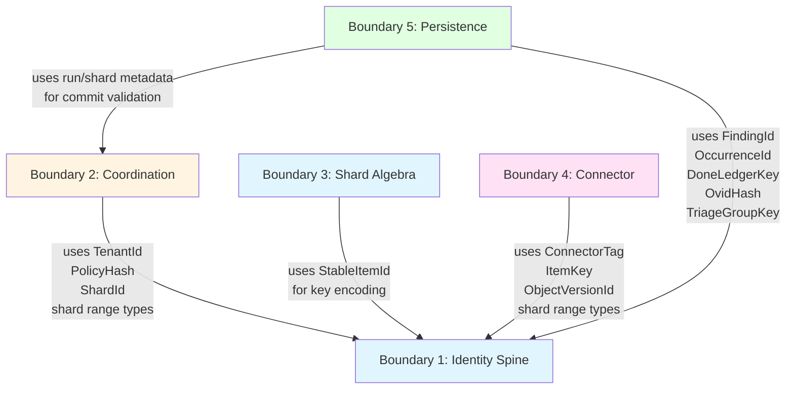

# Boundary Dependency Graph

The Gossip-rs architecture is built on five boundaries arranged in a strict acyclic dependency graph. This chapter visualizes the complete dependency structure and explains why the acyclic rule is fundamental to the system's maintainability.

## The Acyclic Dependency Rule

**Core Principle**: Dependencies flow strictly downward. No circular dependencies between boundaries.

This means:
- A boundary can depend on boundaries "below" it in the hierarchy
- A boundary cannot depend on boundaries "above" it
- Boundaries at the same level cannot depend on each other

The rule ensures:
- Independent testing (test lower boundaries without higher ones)
- Clear ownership (each boundary has unambiguous responsibility)
- Compilation ordering (topological sort determines build order)
- Deadlock prevention (no circular initialization dependencies)

## The Complete Dependency Graph



## Type-Level Edge Annotations

Each dependency edge represents specific type usage:

### Boundary 2 (Coordination) → Boundary 1 (Identity)
- **TenantId**: Every shard, run, and lease is scoped to a tenant
- **PolicyHash**: Run manifest includes policy identity for determinism
- **ShardId**: Primary key for shard records in coordination backend
- **Shard range types**: Used in split operations to calculate new shard boundaries (via `gossip-contracts`, not `gossip-frontier`)

### Boundary 3 (Shard Algebra) → Boundary 1 (Identity)
- **StableItemId**: Used as the basis for key encoding in shard range calculations
- Enables deterministic mapping of items to shards

### Boundary 4 (Connector) → Boundary 1 (Identity)
- **ConnectorTag**: Identifies the source system (GitHub, S3, etc.)
- **ItemKey**: Connector-specific identity for resources
- **ObjectVersionId**: Version tracking for mutable sources
- **Shard range types**: Connectors use shard-range types from `gossip-contracts` for cursor construction

### Boundary 5 (Persistence) → Boundary 1 (Identity)
- **FindingId**: Primary key for findings in the findings sink
- **OccurrenceId**: Primary key for occurrence records
- **DoneLedgerKey**: Key for done-ledger entries (domain tag `"gossip/persistence/v1/done-key"`)
- **OvidHash**: Object version identity hash (domain tag registered as `"gossip/persistence/v1/ovid"`)
- **TriageGroupKey**: Grouping key for triage aggregation (domain tag registered as `"gossip/persistence/v1/triage-group"`)

### Boundary 5 (Persistence) → Boundary 2 (Coordination)
- **Run metadata**: Commit validation checks run state
- **Shard metadata**: Commit validation checks shard lease ownership
- Enables the 5-check validation preamble

## Crate Structure

The workspace contains 18 crates. The dependency graph maps directly to crate structure:

```
crates/
├── gossip-contracts/               (Boundaries 1, 4, 5 contracts)
│   ├── identity/                   (B1: Identity Spine)
│   ├── coordination/               (B2: Coordination contract types — ShardSpec, Cursor, Split, Manifest)
│   ├── connector/                  (B4: Connector traits and types — fully implemented)
│   └── persistence/                (B5: Persistence contracts — done-ledger, findings, commit protocol)
├── gossip-coordination/            (B2: Coordination runtime — InMemoryCoordinator, facade, sim/)
│   └── sim/                        (Deterministic simulation harness)
├── gossip-coordination-etcd/       (B2: etcd-backed coordination backend)
├── gossip-frontier/                (B3: Shard Algebra — key encoding, hints, builder)
├── gossip-connectors/              (B4: Connector implementations — filesystem, git, in-memory)
├── gossip-persistence-inmemory/    (B5: Reference in-memory persistence backends)
├── gossip-done-ledger-postgres/    (B5: PostgreSQL done-ledger backend)
├── gossip-findings-postgres/       (B5: PostgreSQL findings-sink backend)
├── gossip-pg-common/               (Shared PostgreSQL utilities)
├── gossip-stdx/                    (Shared data structures: RingBuffer, InlineVec, ByteSlab, etc.)
├── scanner-engine/                 (Detection engine: YARA rules, regex, content scanning)
├── scanner-git/                    (Git scanning pipeline: pack decoding, commit walking, blob analysis)
├── scanner-scheduler/              (Scheduler and parallel scan runtime)
├── gossip-scanner-runtime/         (Runtime orchestration: CLI wiring, coordination sink, event sink)
├── gossip-orchestrator/            (High-level orchestration for multi-source scan coordination)
├── gossip-worker/                  (Worker binary entry point)
├── scanner-rs-cli/                 (Standalone scanner CLI binary)
└── scanner-engine-integration-tests/ (Integration tests for scanner-engine)
```

**Why gossip-contracts bundles boundary contracts**: All boundary contracts define pure, stateless interfaces with no I/O. Bundling them into a single crate simplifies dependency management while maintaining conceptual separation through modules. The `sim/` module (deterministic simulation harness) lives in `gossip-coordination`, not `gossip-contracts`, because simulation testing exercises the coordination runtime.

## Why Acyclic Matters

### 1. Independent Testing
Lower boundaries can be tested without any knowledge of higher boundaries:
- Test Identity Spine without importing Coordination
- Test Shard Algebra without importing Persistence
- Test Connectors without importing Coordination

This reduces test complexity and makes test failures easier to diagnose.

### 2. Clear Ownership
The dependency direction makes ownership unambiguous:
- Identity Spine owns type definitions → other boundaries use them
- Coordination owns run/shard state → Persistence validates against it
- No shared ownership, no "who's in charge?" questions

### 3. Compilation Ordering
Cargo can build crates in topological order:
1. **Tier 0**: `gossip-stdx` (no workspace dependencies)
2. **Tier 1**: `gossip-contracts`, `gossip-pg-common` (depend on `gossip-stdx` or external only)
3. **Tier 2**: `gossip-coordination`, `gossip-coordination-etcd`, `gossip-frontier`, `scanner-engine`, `scanner-scheduler`, `gossip-persistence-inmemory` (depend on tier 0-1 crates)
4. **Tier 3**: `scanner-git`, `gossip-done-ledger-postgres`, `gossip-findings-postgres` (depend on tier 1-2 crates)
5. **Tier 4**: `gossip-connectors` (depends on tier 1-2 crates)
6. **Tier 5**: `gossip-scanner-runtime` (depends on connectors, coordination, scheduler, scanner-git)
7. **Tier 6**: `gossip-worker`, `scanner-rs-cli` (depend on `gossip-scanner-runtime`)
8. **Test-only**: `scanner-engine-integration-tests` (depends on scanner-engine, scanner-git, scanner-scheduler)

Parallel compilation within each tier maximizes build speed.

### 4. Deadlock Prevention
Initialization has a clear order:
1. Initialize Identity Spine (pure types, no state)
2. Initialize Coordination backend
3. Initialize Connectors
4. Initialize Persistence backend

No circular initialization → no deadlock risk.

## Inter-Crate Dependency Map

The actual `Cargo.toml` dependencies between workspace crates:

```
gossip-stdx              → (none — leaf crate)
gossip-contracts         → gossip-stdx
gossip-pg-common         → (external deps only — leaf workspace crate)
gossip-coordination      → gossip-contracts, gossip-stdx
gossip-coordination-etcd → gossip-coordination, gossip-contracts, gossip-stdx
gossip-frontier          → gossip-contracts, gossip-stdx
gossip-persistence-inmemory → gossip-contracts
scanner-engine           → gossip-stdx
scanner-scheduler        → scanner-engine, gossip-stdx
                           (dev: gossip-connectors, gossip-contracts, gossip-stdx[stdx-proptest],
                            scanner-engine[test-support])
scanner-git              → scanner-engine, scanner-scheduler, gossip-stdx
gossip-connectors        → gossip-contracts, gossip-stdx,
                           scanner-engine, scanner-git, scanner-scheduler
gossip-done-ledger-postgres → gossip-contracts, gossip-pg-common
gossip-findings-postgres → gossip-contracts, gossip-pg-common
gossip-scanner-runtime   → gossip-contracts, gossip-connectors, gossip-coordination,
                           gossip-frontier, gossip-orchestrator, gossip-stdx,
                           scanner-engine, scanner-scheduler, scanner-git
gossip-orchestrator      → gossip-coordination, gossip-frontier
gossip-worker            → gossip-scanner-runtime, gossip-contracts,
                           gossip-coordination-etcd, gossip-done-ledger-postgres,
                           gossip-findings-postgres
scanner-rs-cli           → gossip-scanner-runtime
scanner-engine-integration-tests → gossip-stdx, scanner-engine, scanner-git, scanner-scheduler
```

## Dependency Violations to Avoid

### Anti-Pattern: Coordination depends on Persistence
```rust
// WRONG: Coordination imports from Persistence
use gossip_scanner_runtime::commit_sink::CommitSink;

impl Coordinator {
    fn commit(&self, sink: &dyn CommitSink) {
        // Coordination should not know about Persistence internals
    }
}
```

**Why it's wrong**: Creates a cycle (Persistence already depends on Coordination for validation). Breaks independent testing.

**Correct approach**: Persistence calls Coordination, not the other way around.

### Anti-Pattern: Connector depends on Coordination
```rust
// WRONG: Connector imports from Coordination
use gossip_coordination::WorkerSession;

impl Connector {
    fn enumerate(&self, session: &WorkerSession) {
        // Connector should not know about worker sessions
    }
}
```

**Why it's wrong**: Connectors should be usable in non-distributed contexts (single-machine scans, testing). Coordination dependency prevents this.

**Correct approach**: Connector returns data, caller (which has Coordination context) decides what to do with it.

## Visualizing the Hierarchy

The boundaries form a clear hierarchy:

```
        ┌─────────────────────┐
        │  Boundary 5:        │  ← Top layer: Orchestrates persistence
        │  Persistence        │     Depends on: B1, B2
        └─────────────────────┘
                 │
        ┌────────┴────────┐
        │                 │
┌───────▼──────┐   ┌──────▼──────┐
│  Boundary 2: │   │ Boundary 4: │  ← Middle layer: Coordination & I/O
│ Coordination │   │  Connector  │     B2 depends on: B1
└──────────────┘   └─────────────┘     B4 depends on: B1
        │                 │
        └────────┬────────┘
                 │
        ┌────────▼────────┐
        │  Boundary 1:    │  ← Foundation layer: Pure contracts
        │ Identity Spine  │     Depends on: nothing
        └─────────────────┘
                 │
        ┌────────▼────────┐
        │  Boundary 3:    │  ← Foundation layer: Pure algebra
        │ Shard Algebra   │     Depends on: B1 only
        └─────────────────┘
```

## Practical Implications

### For New Features
Before adding a new boundary or dependency:
1. Draw the updated dependency graph
2. Verify it remains acyclic
3. If it would create a cycle, re-think the design

### For Refactoring
When moving functionality between boundaries:
1. Check all dependencies of the code being moved
2. Ensure target boundary can depend on those
3. If not, extract the functionality to a lower boundary

### For Code Review
Reviewers should check:
- New imports: do they respect the dependency graph?
- New traits: do they create hidden dependencies?
- New crates: where do they fit in the hierarchy?

## Summary

The acyclic boundary dependency graph is a load-bearing architectural constraint. It:
- Makes testing simpler (test boundaries in isolation)
- Makes ownership clearer (unambiguous responsibility)
- Makes compilation faster (parallel builds per tier)
- Makes initialization safer (no deadlock risk)

Every design decision in Gossip-rs is evaluated against this constraint. When in doubt, err on the side of fewer dependencies, not more.

**Next**: [Data Flow End-to-End](./02-data-flow-end-to-end.md) traces a complete scan through all five boundaries.
