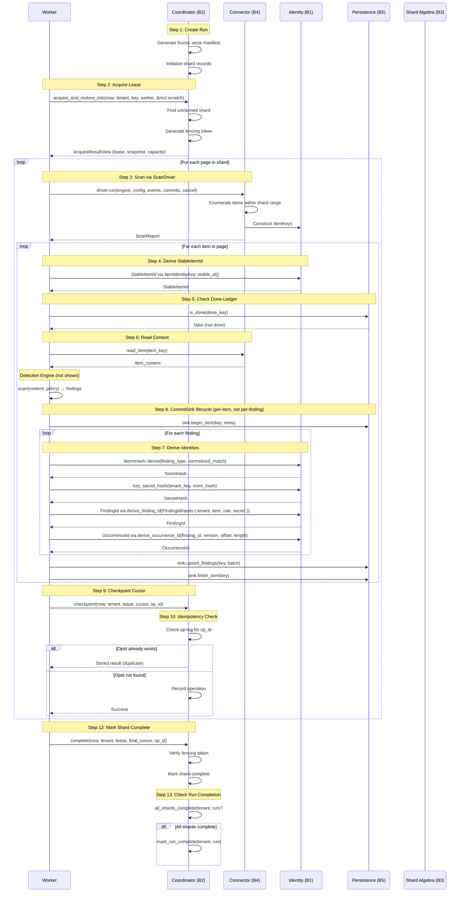

# Data Flow End-to-End

This chapter traces a complete scan from run creation to completion, showing how data flows through all five boundaries. Each step is annotated with the boundary that owns it and the guarantees it provides.

## The Complete Flow

### Step 0: Entry Point — Binary Crates

Before the boundary-mediated data flow begins, a binary crate parses CLI arguments and hands control to `gossip-scanner-runtime`:

- **`scanner-rs-cli`** — The standalone scanner CLI binary for end-user local scanning. Its `main()` calls `gossip_scanner_runtime::cli::parse_args()` to parse arguments and `gossip_scanner_runtime::cli::run(config)` to execute the scan. Process-exit policy (exit codes, error chain printing) is handled in the binary; all typed errors originate from the runtime. This is the entry point most users interact with directly.
- **`gossip-worker`** — The distributed worker binary for multi-machine deployments.

Both binaries are thin wrappers that delegate immediately to `gossip-scanner-runtime`. The runtime wires connectors, event sinks, and coordination backends together, then triggers the flow described below.

### Step 1: Coordinator Creates Run (Boundary 2)

```rust
// Coordinator (B2) creates a run with a manifest
let manifest = RunManifest {
    run_id: RunId::from_raw(1),
    tenant_id: tenant,
    policy_hash: policy_hash,  // From B1
    connector_tag: ConnectorTag::GitHub,  // From B1
    initial_shards: vec![
        ShardRange::full(),  // From B3
    ],
    created_at: LogicalTime::now(),
};

coordinator.create_run(now, tenant, run_id, config)?;
```

**Boundary 2 responsibilities**:
- Generate unique RunId
- Validate tenant ID
- Store manifest in coordination backend
- Initialize shard records (one per initial shard range)

**Guarantees**:
- Run is durably persisted (if using persistent backend)
- Shards are available for leasing
- Policy hash is recorded for audit

### Step 2: Worker Claims Shard (Boundary 2)

```rust
// Worker requests a shard lease from coordinator (B2)
let mut scratch = AcquireScratch::default();
let result = coordinator.acquire_and_restore_into(
    now,
    tenant,
    key,
    worker,
    &mut scratch,
)?;

// Result (AcquireResultView) contains:
// - Lease (ShardKey, FenceEpoch, WorkerId)
// - Shard snapshot (spec, cursor, status)
// - CapacityHint (available shard count)
```

**Boundary 2 responsibilities**:
- Find an unclaimed shard
- Generate a fencing token (monotonically increasing)
- Set lease expiry time
- Record worker ownership

**Guarantees**:
- No two workers can hold a lease on the same shard simultaneously
- Fencing token enables idempotency checks
- Lease expiry prevents stuck shards

### Step 3: Worker Scans Items (Boundary 4)

```rust
// Worker uses ScanDriver (B4) to scan items
// The ScanSourceFactory selects the right driver for the assignment
let factory = select_factory(assignment.connector_kind);
let driver = factory.driver_for_assignment(&assignment)?;

// Driver runs the full scan in one call:
// - Enumerates items within shard range (from B3)
// - Opens and reads content via connector methods
// - Feeds content to scanner engine for detection
// - Commits findings through CommitSink protocol
let report = driver.run(engine, config, events, commits, cancel)?;
```

**Boundary 4 responsibilities**:
- Query source within shard range
- Construct ItemKey for each resource (from B1)
- Open and read item content
- Handle rate limits, retries

**Guarantees**:
- Items are scanned within shard range bounds
- ScanDriver handles cursor progression internally
- Error classification determines retry vs park decisions

### Step 4: Derive StableItemId (Boundary 1)

```rust
// For each item, derive StableItemId (B1)
// StableItemId is TENANT-INDEPENDENT — derived from connector tag + locator only.
let item_identity = ItemIdentityKey::new(connector_tag, &item_locator);
let stable_id = item_identity.stable_id();
```

**Boundary 1 responsibilities**:
- Derive content-addressed identity via `ItemIdentityKey::stable_id()`
- Uses BLAKE3 derive-key mode with `"gossip/item-id/v1"` domain tag
- Ensure cross-run stability

**Guarantees**:
- Same item → same StableItemId across runs
- **Tenant-independent**: Different tenants scanning the same item get the same StableItemId (tenant isolation happens at the SecretHash layer via `key_secret_hash`)
- Deterministic (no randomness)

### Step 5: Check Done-Ledger (Boundary 5)

```rust
// Pseudocode — DoneLedgerKey is planned; the current interface is CommitSink.
// Check if item was already scanned in a previous run (B5)
let done_key = DoneLedgerKey::new(
    tenant,
    stable_id,
    object_version_id,  // From B1, may be None
);

if done_ledger.is_done(done_key)? {
    // Skip this item (already scanned)
    continue;
}
```

**Boundary 5 responsibilities**:
- Query done-ledger for existence
- Handle optional object versioning
- Return quickly for cache hits

**Guarantees**:
- Exactly-once semantics (won't re-scan done items)
- Version-aware (new version of same item → re-scan)
- Idempotent (safe to check multiple times)

### Step 6: Read Content and Detect (Boundary 4 + Detection Engine)

```rust
// Read item content (B4)
let content = connector.read_item(item_key)?;

// Run detection engine (not shown: separate boundary)
let findings = detection_engine.scan(content, policy)?;

// For each finding, derive NormHash (B1)
for finding in findings {
    let norm_hash = NormHash::derive(NormHashInputs {
        finding_type: finding.rule_type,
        normalized_match: finding.normalized_value,
    });

    // Store for next step
    finding_data.push((finding, norm_hash));
}
```

**Boundary 4 responsibilities** (read):
- Fetch item content from source
- Handle large files (streaming)
- Return content with metadata

**Boundary 1 responsibilities** (NormHash):
- Normalize match value (case-folding, whitespace removal)
- Derive content-addressed hash
- Domain-separate from other hash types

**Guarantees**:
- Content is read exactly once per item
- NormHash is deterministic and portable
- Same secret → same NormHash across runs and tenants

### Step 7: Derive SecretHash, FindingId, OccurrenceId (Boundary 1)

```rust
// For each finding, derive secret hash (B1)
// key_secret_hash uses BLAKE3 keyed mode with domain "gossip/secret-hash/v1"
let secret_hash = key_secret_hash(&tenant_secret_key, &norm_hash);

// Derive FindingId (B1)
let finding_id = derive_finding_id(&FindingIdInputs {
    tenant: tenant,
    item: stable_id,
    rule: rule_fingerprint,
    secret: secret_hash,
});

// Derive OccurrenceId (B1)
let occurrence_id = derive_occurrence_id(&OccurrenceIdInputs {
    finding: finding_id,
    version: object_version_id,
    byte_offset: finding.start as u64,
    byte_length: (finding.end - finding.start) as u64,
});
```

**Boundary 1 responsibilities**:
- Derive SecretHash using tenant key (prevents cross-tenant correlation)
- Derive FindingId (groups occurrences of same secret)
- Derive OccurrenceId (globally unique occurrence identity)

**Guarantees**:
- SecretHash is tenant-isolated (different key → different hash)
- FindingId is stable across runs (same secret → same ID)
- OccurrenceId is globally unique (no collisions)

### Step 8: Record Findings via CommitSink (Boundary 5)

```rust
// For each item in the page, use the CommitSink lifecycle (B5)
for item in page.items {
    // 1. Open item transaction
    commit_sink.begin_item(&item.key, &item.meta)?;

    // 2. Scan and upsert findings
    let findings = engine.scan(&item.content)?;
    if !findings.is_empty() {
        let batch = FindingsBatch { findings };
        commit_sink.upsert_findings(&item.key, &batch)?;
    }

    // 3. Close item transaction (marks item as done)
    commit_sink.finish_item(&item.key)?;
}
```

**Boundary 5 responsibilities**:
- Execute `begin_item` → `upsert_findings` → `finish_item` per item
- In distributed mode, derive identity chains and record progress
- In CLI mode, `NoOpCommitSink` discards all calls

**Guarantees**:
- Per-item atomicity via the three-method lifecycle
- Memory-safe (no double-free, no leaks)
- Empty batches are valid (item scanned, no findings)

### Step 9: Checkpoint Cursor (Boundary 2)

```rust
// After processing items, advance the cursor via the coordinator (B2)
coordinator.checkpoint(
    now,
    tenant,
    &lease,
    cursor_update,
    op_id,
)?;

// Checkpoint includes:
// 1. Idempotency check (OpId in op-log)
// 2. Cursor advance (monotonic)
// 3. Lease validation (5-check preamble)
```

**Boundary 2 responsibilities** (cursor advance):
- Check idempotency: if OpId matches, return stored result
- Update shard record with new cursor
- Validate fencing token (reject if stale)

**Guarantees**:
- Atomic commit (all or nothing)
- Idempotent (retrying with same OpId is safe)
- Cursor monotonicity (always advances forward)

### Step 10: Idempotency Check (Boundary 2)

```rust
// Coordinator checks if this cursor advance was already committed
let op_id = OpId::from_fencing_token(session.fencing_token);

if let Some(stored_result) = coordinator.get_committed_op(tenant, run_id, shard_id, op_id)? {
    // Already committed! Return stored result.
    return Ok(stored_result);
}

// Not committed yet, proceed with checkpoint
coordinator.checkpoint(
    now,
    tenant,
    &session.lease,
    next_cursor,
    op_id,
)?;
```

**Boundary 2 responsibilities**:
- Check op-log for duplicate OpId
- If found, return stored result (no duplicate work)
- If not found, record the operation

**Guarantees**:
- Exactly-once cursor advance (no double-advance)
- Idempotent (worker can retry safely)
- Fencing token prevents split-brain (old worker cannot advance cursor)

### Step 11: Repeat for Next Page

```rust
// Get next page cursor from commit result
let cursor = commit_result.next_cursor;

if cursor.is_none() {
    // Last page reached!
    break;
}

// Loop back to Step 3: enumerate next page
```

**Loop invariant**:
- Cursor always advances (monotonicity)
- No item is scanned twice (done-ledger)
- No findings are lost (atomic commit)

### Step 12: Mark Shard Complete (Boundary 2)

```rust
// Worker marks shard as complete (B2)
coordinator.complete(
    now,
    tenant,
    &session.lease,
    final_cursor,
    op_id,
)?;
```

**Boundary 2 responsibilities**:
- Verify fencing token (prevent stale completion)
- Mark shard as complete in coordination backend
- Check if all shards are complete → mark run complete

**Guarantees**:
- Shard cannot be re-claimed (completed is terminal state)
- Run completion is triggered automatically
- Audit trail: shard completion time recorded

### Step 13: Mark Run Complete (Boundary 2)

```rust
// Coordinator checks if all shards are complete
if coordinator.all_shards_complete(tenant, run_id)? {
    coordinator.mark_run_complete(tenant, run_id, LogicalTime::now())?;
}
```

**Boundary 2 responsibilities**:
- Check completion condition (all shards complete)
- Mark run as complete
- Record completion timestamp

**Guarantees**:
- Run completion is idempotent (safe to call multiple times)
- Audit trail: run completion time recorded
- No new shards can be created for completed run

## Full Sequence Diagram



## Data Flow Summary

| Step | Boundary | Input | Output | Guarantee |
|------|----------|-------|--------|-----------|
| 1 | B2 | RunManifest | RunId, ShardRecords | Durable manifest |
| 2 | B2 | WorkerId, RunId | AcquireResultView, FenceEpoch | Exclusive lease |
| 3 | B4 | ShardRange, Assignment | ScanReport | Scanned items within shard |
| 4 | B1 | ItemKey, Connector | StableItemId | Cross-run stability (tenant-independent) |
| 5 | B5 | ItemKey | CommitSink begin/finish | Exactly-once |
| 6 | B4+B1 | ItemKey | Content, NormHash | Deterministic hash |
| 7 | B1 | NormHash, Tenant key | SecretHash, FindingId, OccurrenceId | Tenant isolation |
| 8 | B5 | FindingsBatch | CommitSink upsert_findings | Per-item persistence |
| 9 | B2 | Lease, Cursor, OpId | Checkpoint result | Idempotent cursor advance |
| 10 | B2 | OpId, Cursor | Success or duplicate | Idempotent |
| 11 | - | next_cursor | Loop | Cursor monotonicity |
| 12 | B2 | ShardId, Token | Shard complete | Fenced completion |
| 13 | B2 | RunId | Run complete | All shards done |

## Key Observations

### Cross-Boundary Coordination
- B1 provides types (TenantId, PolicyHash, StableItemId) used by all other boundaries
- B3 provides shard ranges used by B2 (coordination) and B4 (enumeration)
- B5 depends on B2 for validation (5-check preamble)

### Idempotency Layers
- B2: cursor advance is idempotent (op-log)
- B5: done-ledger prevents re-scanning items
- B4: connector retries are safe (stateless reads)

### Atomicity Boundaries
- Commit is atomic: findings + done-ledger + cursor advance (all or nothing)
- Lease acquisition is atomic: fencing token generation + shard record update
- Run completion is atomic: check all shards + mark complete

### Failure Recovery
- Worker crash: lease expires → new worker claims shard → resumes from last committed cursor
- Coordinator crash: rebuild state from persistent backend
- Source outage: circuit breaker parks shard → retry when healthy

## Summary

The end-to-end flow demonstrates how five boundaries compose into a complete distributed system:
1. **Identity (B1)** provides content-addressed types used everywhere
2. **Coordination (B2)** orchestrates work distribution and progress tracking
3. **Shard Algebra (B3)** enables range-based work splitting
4. **Connector (B4)** bridges to external systems
5. **Persistence (B5)** ensures findings are durable and exactly-once

Each boundary maintains its invariants while composing with others to deliver system-level guarantees: exactly-once processing, tenant isolation, deterministic identities, and fault tolerance.

### Scanning Pipeline Crates

Beyond the five boundary crates, the scanning pipeline is implemented across several additional crates:

- **`scanner-engine`**: The standalone detection engine — YARA rules, regex matching, content scanning. Produces raw findings from byte content.
- **`gossip-scan-driver`**: Defines the `ScanDriver`, `ScanSourceFactory`, and `CommitSink` traits that bridge connectors to the detection engine.
- **`scanner-git`**: Git-specific scanning pipeline — pack file decoding, commit walking, blob analysis, diff-based history scanning.
- **`scanner-scheduler`**: Orchestrates parallel scanning — thread pools, work scheduling, archive extraction, pipeline coordination.
- **`gossip-scanner-runtime`**: Runtime orchestration — wires CLI arguments to connectors, manages coordination sinks and event sinks.
- **`gossip-worker`**: The distributed worker binary entry point.
- **`scanner-rs-cli`**: Standalone scanner CLI binary for local scanning — the primary end-user entry point. Delegates to `gossip_scanner_runtime::cli` for argument parsing and execution, handling only process-exit policy (exit codes, error chain printing to stderr) itself.

In the data flow above, the "Detection Engine (not shown)" in Step 6 corresponds to `scanner-engine`. The `gossip-connectors` crate (Step 3) now includes a `git.rs` connector and a `scan_driver.rs` bridge that integrates the scanning pipeline with the connector boundary.

**Next**: [Failure Modes and Recovery](./03-failure-modes-and-recovery.md) explores how the system handles failures at each boundary.
