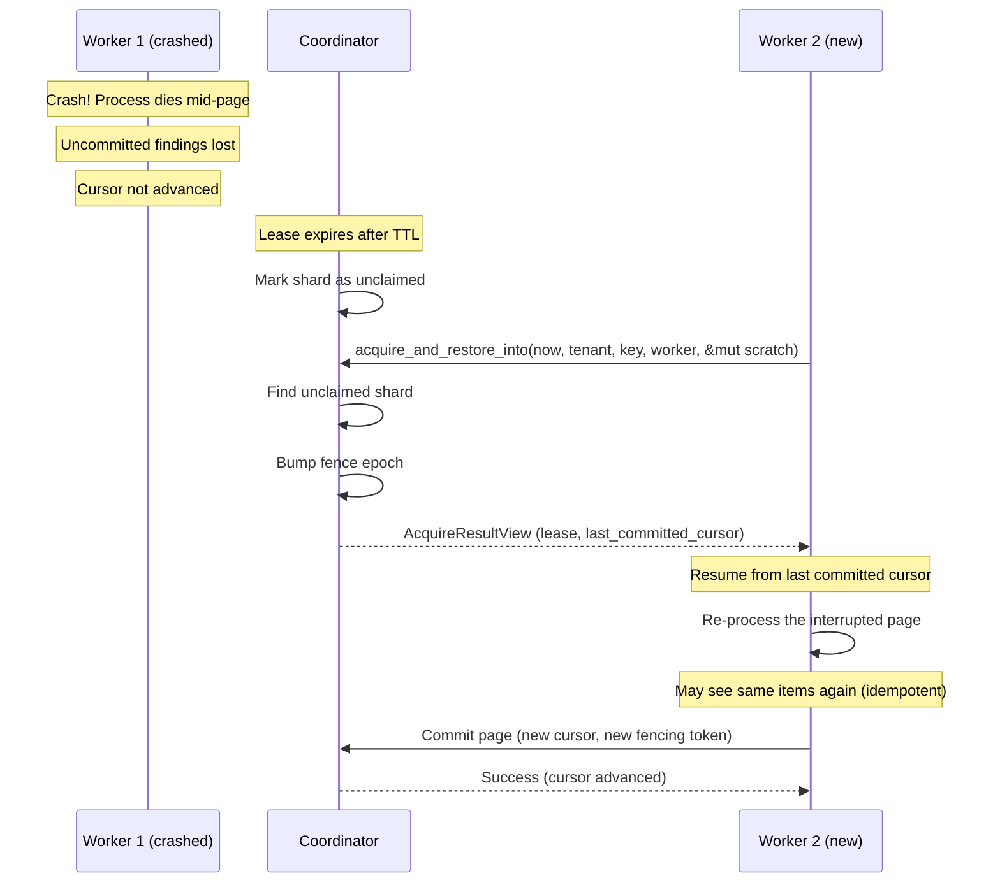
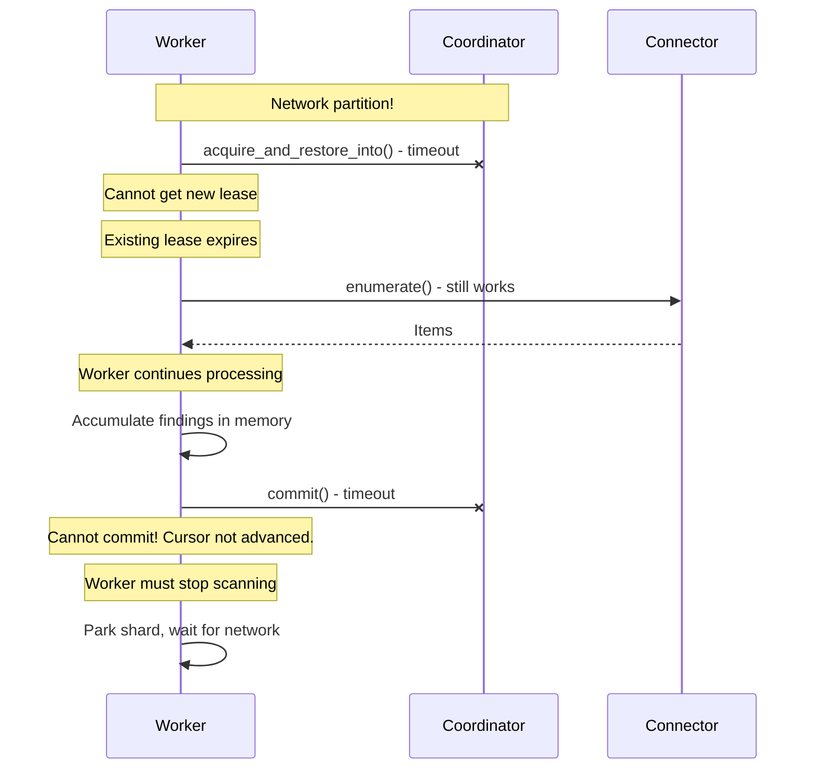
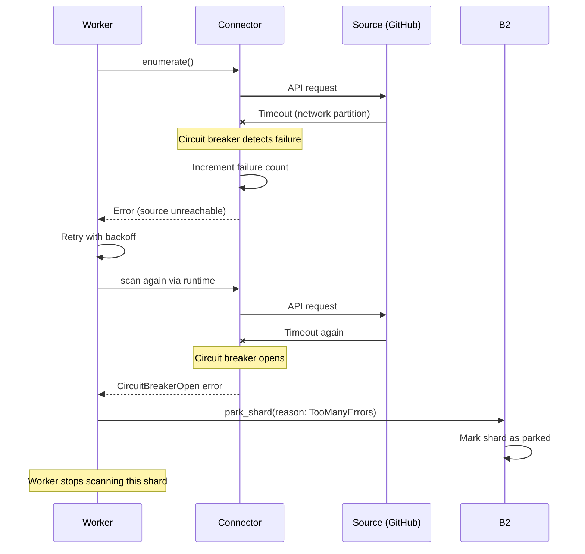
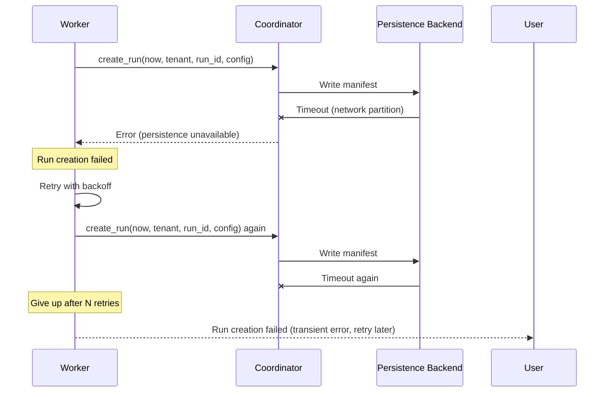
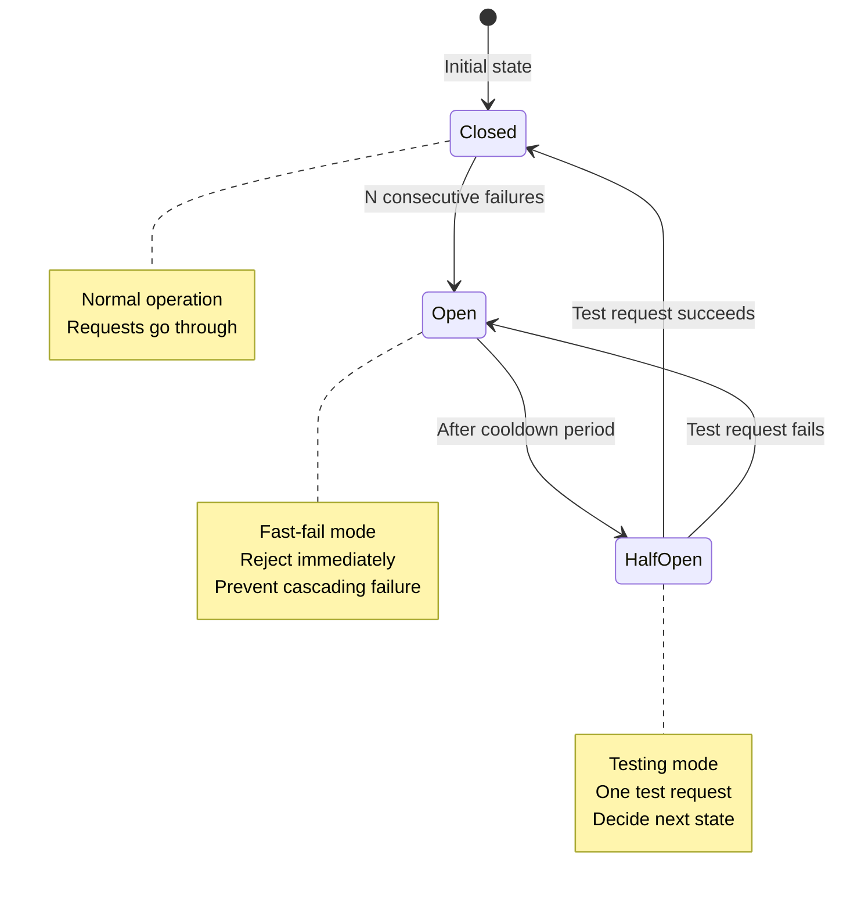
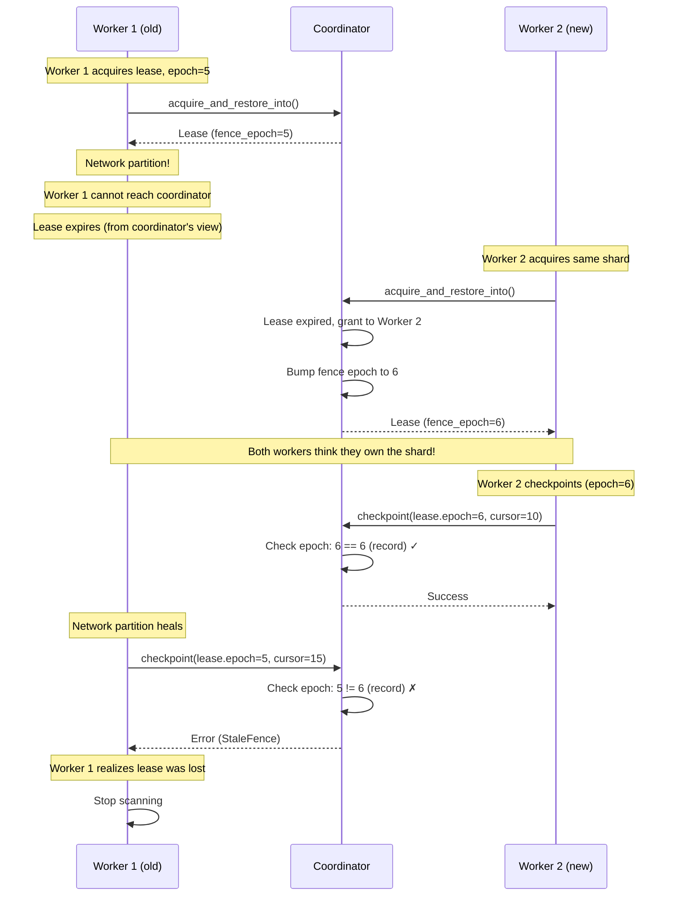

# Failure Modes and Recovery

Distributed systems fail in countless ways. This chapter catalogs the primary failure modes in Gossip-rs and explains the recovery mechanisms at each boundary.

## Failure Mode 1: Worker Crash Mid-Page

### Scenario
A worker is processing a page of items when the process crashes (OOM, kernel kill, hardware failure).

### What Happens

**Lost Data**:
- In-memory uncommitted findings are lost (pending `CommitSink` item transaction is abandoned)
- Current page's done-ledger entries not written
- Cursor not advanced

**Preserved Data**:
- Last committed cursor (in coordination backend)
- All findings from previously committed pages
- Done-ledger entries from previous pages
- Worker's lease record (still exists, not expired yet)

### Recovery Path



**Step-by-step**:
1. Worker 1 crashes mid-page
2. Coordinator detects lease expiry (TTL exceeded)
3. Coordinator marks shard as unclaimed
4. Worker 2 acquires shard lease
5. Worker 2 gets last committed cursor (before crash)
6. Worker 2 re-processes page starting from that cursor
7. Worker 2 commits findings (atomic: findings + cursor advance)

**What about the lost findings?**
- The items that were scanned but not committed will be re-scanned
- Detection will re-run on those items
- Same findings will be re-discovered
- This is acceptable: findings are idempotent (same FindingId)

**Guarantee**: No data loss. At most one page of work is repeated.

### Why This Works

- **Cursor atomicity**: Cursor advances atomically with findings commit. Either both happen or neither.
- **Lease TTL**: Prevents indefinite blocking. Coordinator reclaims stale leases.
- **Fencing token**: New worker gets a new token. If old worker revives, its commits will be rejected (stale token).

## Failure Mode 2: Coordinator Crash

### Scenario
The coordinator process crashes or becomes unreachable.

### Impact Depends on Backend

#### Scenario A: InMemoryCoordinator (Development/Testing)

**Lost Data**:
- All run manifests
- All shard records
- All lease assignments
- All op-log entries

**Recovery**:
- None. The run must restart from scratch.
- This is acceptable for dev/test environments.

#### Scenario B: Persistent Coordination Backend (Production)

**Lost Data**:
- In-memory caches (if any)
- In-flight RPC state

**Preserved Data**:
- All run manifests (in DB)
- All shard records (in DB)
- All lease assignments (in DB)
- All op-log entries (in DB)

**Recovery**:
```rust
// On coordinator restart
let coordinator = Coordinator::new(persistent_backend);

// Rebuild in-memory state from backend
let runs = coordinator.list_active_runs()?;
for run in runs {
    // Check for expired leases
    let expired = coordinator.find_expired_leases(run.id, LogicalTime::now())?;
    for shard_id in expired {
        coordinator.release_lease(run.id, shard_id)?;
    }
}

// Coordinator is now operational
// Workers can resume acquiring leases
```

**Step-by-step**:
1. Coordinator restarts
2. Connects to persistent backend (DB)
3. Loads all active runs
4. Finds expired leases (workers may have crashed during coordinator downtime)
5. Releases expired leases → shards become available
6. Workers can now acquire leases and continue

**Guarantee**: No data loss if using persistent backend. Brief unavailability during coordinator restart.

### Why This Works

- **Persistent backend**: All state is durable. Coordinator is stateless (except for caches).
- **Lease TTL**: Expired leases are automatically released on restart.
- **Idempotent operations**: Workers can retry lease acquisition safely.

## Failure Mode 3: Network Partition

### Scenario A: Worker Cannot Reach Coordinator



**Recovery**:
1. Network partition heals
2. Worker's lease has expired (TTL exceeded during partition)
3. Worker detects lease expiry on next commit attempt
4. Worker stops scanning
5. Worker re-acquires lease (gets new fencing token)
6. Worker resumes from last committed cursor

**Guarantee**: No duplicate commits. Fencing token prevents split-brain.

### Scenario B: Worker Cannot Reach Source



**Recovery**:
1. Network partition heals
2. Circuit breaker transitions to half-open state (after cooldown)
3. Next worker attempts to enumerate → triggers test request
4. Test request succeeds → circuit breaker closes
5. Worker resumes scanning

**Guarantee**: Isolated failure. Other connectors/shards unaffected.

### Scenario C: Coordinator Cannot Reach Persistence



**Recovery**:
1. Network partition heals
2. User/scheduler retries run creation
3. Persistence backend is reachable → run created successfully

**Guarantee**: No partial state. Run creation is atomic (all or nothing).

## Failure Mode 4: Source Outage

### Scenario
The source system (GitHub, S3, etc.) is down or rate-limiting aggressively.

### What Happens



**Step-by-step**:
1. Connector makes API request → fails
2. Circuit breaker increments failure count
3. After N failures → circuit breaker opens
4. Subsequent requests fail fast (no actual API call)
5. Worker parks shard with `ParkReason::TooManyErrors`
6. Other connectors are unaffected (independent circuit breakers)

**After cooldown period**:
1. Circuit breaker transitions to half-open
2. Next worker attempts enumeration
3. Circuit breaker allows one test request
4. If test succeeds → circuit breaker closes → scanning resumes
5. If test fails → circuit breaker re-opens → cooldown resets

### Recovery Path

```rust
// Worker detects circuit breaker open (design-stage pseudocode)
match driver.run(engine, config, events, commits, cancel) {
    Err(err) if err.is_circuit_breaker_open() => {
        // Park the shard
        coordinator.park_shard(
            tenant,
            run_id,
            shard_id,
            ParkReason::TooManyErrors,
        )?;

        // Release lease
        coordinator.release_lease(tenant, run_id, shard_id)?;

        // Worker moves to next shard or waits
    }
    // ... other cases
}
```

**Guarantee**: Source outage does not cascade. Circuit breaker contains the failure. Other connectors continue working.

## Failure Mode 5: Data Corruption

### Scenario
Persistent storage returns corrupted data (bit flip, disk error, Byzantine behavior).

### Detection

**Boundary 1 (Identity)**: All IDs include domain separation and deterministic derivation. Corruption → derivation mismatch.

```rust
// On read from storage
let stored_finding_id = FindingId::from_bytes(row.finding_id_bytes);

// Re-derive from inputs
let expected_finding_id = derive_finding_id(&FindingIdInputs {
    tenant: row.tenant_id,
    item: row.stable_item_id,
    rule: row.rule_fingerprint,
    secret: row.secret_hash,
});

if stored_finding_id != expected_finding_id {
    return Err(CorruptionError::FindingIdMismatch);
}
```

**Boundary 2 (Coordination)**: Fencing uses a `FenceEpoch` that is bumped only during `acquire_and_restore_into`. On every subsequent operation (checkpoint, complete, park, split), the coordinator compares the lease's fence epoch against the shard record's fence epoch. If they do not match, the operation is rejected as stale. This is an equality check, not a sequential increment -- there is no "expected_token + 1" logic during cursor advance.

```rust
// On checkpoint (or any mutation after acquire)
// The lease carries the FenceEpoch assigned at acquire time.
// The shard record stores the current FenceEpoch.
if lease.fence_epoch != shard_record.fence_epoch {
    return Err(CheckpointError::StaleFence {
        lease_epoch: lease.fence_epoch,
        record_epoch: shard_record.fence_epoch,
    });
}
```

**Boundary 5 (Persistence)**: Page commits include checksums (future: HMAC). Corruption → checksum mismatch.

### Recovery

**For identity corruption**: Re-derive from source of truth (detection engine output). Discard corrupted record.

**For coordination corruption**: Reset run. Mark as failed. Admin intervention required.

**For persistence corruption**: Re-scan affected shards. Done-ledger prevents duplicate findings.

**Guarantee**: Corruption is detected, not silently propagated. System fails safe.

## Failure Mode 6: Split-Brain (Prevented by Fencing)

### Scenario (Without Fencing Tokens)
Two workers hold leases on the same shard simultaneously due to clock skew or network partition.

### Why Fencing Prevents This



**Guarantee**: Fencing token prevents split-brain. Only the worker with the latest token can commit.

## Summary of Guarantees

| Failure Mode | Detection | Recovery | Data Loss | Downtime |
|--------------|-----------|----------|-----------|----------|
| Worker crash | Lease expiry | New worker resumes from last cursor | None (at most 1 page re-processed) | Lease TTL |
| Coordinator crash (persistent backend) | Health check | Restart, rebuild from DB | None | Restart time |
| Coordinator crash (in-memory) | Health check | Restart run from scratch | All run state | N/A (restart run) |
| Network partition (worker ↔ coordinator) | Commit timeout | Lease expires, re-acquire | None | Partition duration |
| Network partition (worker ↔ source) | Circuit breaker | Park shard, retry after cooldown | None | Cooldown period |
| Source outage | Circuit breaker | Park shard, retry when healthy | None | Outage duration |
| Data corruption | Derivation mismatch, checksum | Re-scan or discard | Corrupted records only | Re-scan time |
| Split-brain | Fencing token mismatch | Reject stale worker | None (prevented) | None (prevented) |

## Recovery Principles

### 1. Fail Fast
- Circuit breakers prevent cascading failures
- Fencing tokens reject stale operations immediately
- Timeouts prevent indefinite blocking

### 2. Fail Safe
- Corruption is detected, not propagated
- Split-brain is prevented, not recovered from
- Invalid states are rejected at the boundary

### 3. Fail Visibly
- Park reasons explain why a shard stopped
- Error enums include context (expected vs actual)
- Audit trail records all state transitions

### 4. Recover Automatically
- Lease expiry → automatic reassignment
- Circuit breaker cooldown → automatic retry
- Idempotent operations → safe to retry

### 5. Minimize Blast Radius
- Source outage affects only that connector
- Worker crash affects only its assigned shards
- Coordination crash (persistent) affects only in-flight operations

## Testing Failure Recovery

### Unit Tests
```rust
#[test]
fn worker_crash_recovery() {
    let mut coordinator = InMemoryCoordinator::new();
    let run_id = create_test_run(&mut coordinator);

    // Worker 1 acquires lease
    let mut scratch = AcquireScratch::default();
    let result1 = coordinator.acquire_and_restore_into(time(0), tenant, key, worker1, &mut scratch).unwrap();
    let lease1 = result1.lease;

    // Simulate crash: time advances past lease TTL
    // Worker 2 acquires same shard (fence epoch bumped)
    let result2 = coordinator.acquire_and_restore_into(
        time(LEASE_TTL + 1), tenant, key, worker2, &mut scratch,
    ).unwrap();
    let lease2 = result2.lease;
    assert!(lease2.fence_epoch > lease1.fence_epoch); // New epoch

    // Worker 1 tries to checkpoint (should fail — stale fence)
    let result = coordinator.checkpoint(
        time(LEASE_TTL + 2),
        tenant,
        &lease1,       // Stale lease with old fence epoch
        cursor(10),
        op_id,
    );
    assert!(result.is_err()); // StaleFence: lease epoch != record epoch
}
```

### Integration Tests
```rust
#[tokio::test]
async fn network_partition_recovery() {
    // Setup: worker + coordinator + connector
    let (worker, coordinator, connector) = setup_integration_test();

    // Start scanning
    worker.start_scan(run_id).await;

    // Inject network partition (coordinator unreachable)
    coordinator.set_unreachable(true);

    // Worker should detect partition on next commit
    tokio::time::sleep(Duration::from_secs(1)).await;
    assert!(worker.is_parked().await);

    // Heal partition
    coordinator.set_unreachable(false);

    // Worker should resume
    tokio::time::sleep(Duration::from_secs(1)).await;
    assert!(worker.is_scanning().await);
}
```

### Deterministic Simulation Tests (Future)
- Run entire system in single-threaded simulator
- Control scheduling order, inject failures at specific points
- Verify recovery invariants: no data loss, no split-brain, no corruption

## Operational Playbook

### Symptom: Shards are parked
**Check**: `ParkReason` in shard records.
- `TooManyErrors`: Check source system health. Wait for cooldown, retry.
- `PermissionDenied`: Check credentials and access configuration for the source.
- `NotFound`: Verify the source resource still exists.
- `Poisoned`: Shard encountered an unrecoverable state; investigate logs for the root cause.

### Symptom: Run is not completing
**Check**: Shard states. Are any shards stuck?
- Stuck in `InProgress`: Check worker health. Worker may have crashed (lease expired).
- Stuck in `Parked`: See above.
- All shards `Complete`: Check run state. Should be `Complete`. If not, possible coordinator bug.

### Symptom: Duplicate findings
**Check**: Done-ledger. Are items being re-scanned?
- If yes: Check cursor monotonicity. Cursor should always advance.
- If no: Check FindingId derivation. Same secret should produce same FindingId.

### Symptom: FindingId mismatch errors
**Check**: Persistent storage. Possible corruption.
- Run integrity check on storage backend.
- Re-scan affected shards if corruption confirmed.

## Summary

Gossip-rs is designed to handle failures at every layer:
- **Worker failures**: Lease expiry + cursor atomicity ensure no data loss
- **Coordinator failures**: Persistent backend enables restart without data loss
- **Network partitions**: Fencing tokens prevent split-brain, circuit breakers contain source failures
- **Source outages**: Circuit breakers prevent cascading failures, park shards for retry
- **Data corruption**: Content-addressed identities enable detection, re-scanning enables recovery

The system prioritizes **safety** (no split-brain, no corruption propagation) over **liveness** (brief unavailability during recovery is acceptable).

**Next**: [Tenant Isolation](./04-tenant-isolation.md) explores the three layers of tenant isolation.
