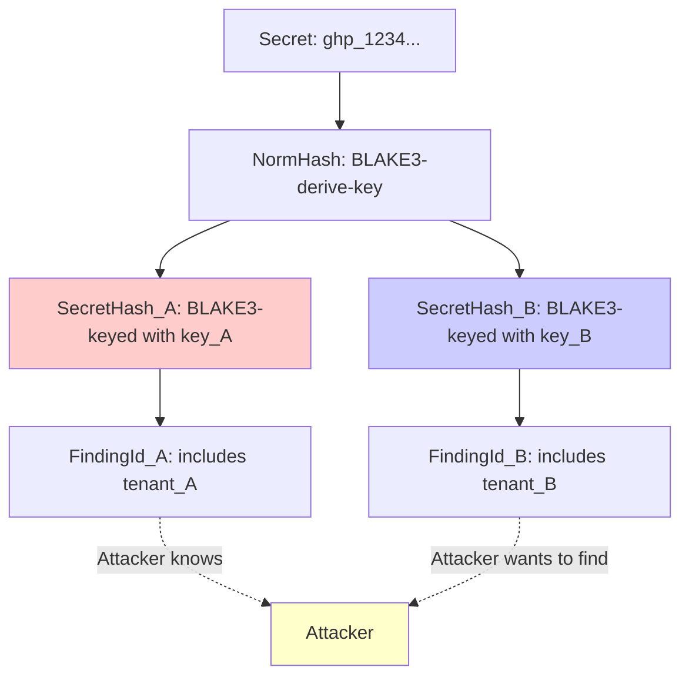
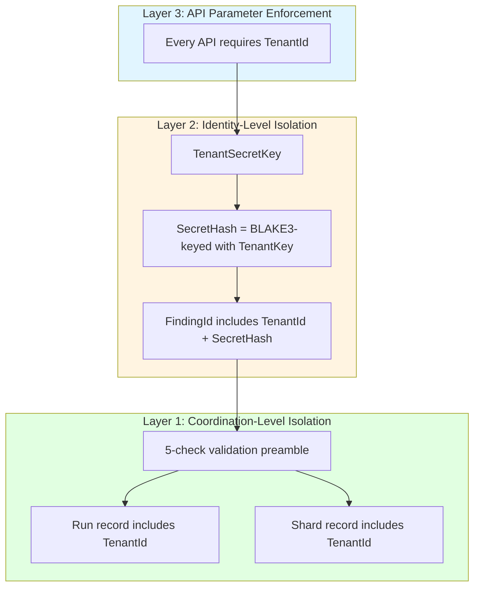

# Tenant Isolation

Gossip-rs is designed as a multi-tenant system where multiple organizations (tenants) share the same infrastructure but must remain cryptographically isolated. This chapter explains the three layers of tenant isolation and analyzes their security properties.

## The Threat Model

### What We Protect Against

1. **Cross-tenant data leakage**: Tenant A must not see Tenant B's findings, even if they scan the same secrets.
2. **Cross-tenant correlation**: Given FindingId from Tenant A, attacker must not be able to determine if Tenant B has the same secret.
3. **Cross-tenant impersonation**: Tenant A must not be able to create findings that appear to belong to Tenant B.
4. **Operational isolation**: Tenant A's load/failures must not affect Tenant B's scans.

### What We Do NOT Protect Against

1. **Side-channel attacks**: Timing attacks, memory access patterns (out of scope for now).
2. **Insider threats with DB access**: Admin with direct database access can read all data (encryption-at-rest is future work).
3. **Compiler/hardware vulnerabilities**: We assume the Rust compiler and hardware are trustworthy.

## Layer 1: Coordination-Level Isolation (Boundary 2)

Every shard, run, and lease is scoped to a `TenantId`. The coordination layer enforces tenant isolation through the **5-check validation preamble**.

### The 5-Check Validation Preamble

Before any mutation operation, the coordinator runs `validate_lease` from `crates/gossip-coordination/src/validation.rs`:

```rust
// From crates/gossip-coordination/src/validation.rs
pub fn validate_lease(
    now: LogicalTime,
    tenant: TenantId,
    lease: &Lease,
    record: &ShardRecord,
) -> Result<(), CoordError> {
    // 1. Tenant isolation — prevents cross-tenant data leakage.
    if record.tenant != tenant {
        return Err(CoordError::TenantMismatch { expected: tenant });
    }

    // 2. Terminal status — reject mutations to Done/Split/Parked shards.
    if record.status.is_terminal() {
        return Err(CoordError::ShardTerminal {
            shard: ShardKey::new(record.run, record.shard),
            status: record.status,
        });
    }

    // 3. Fence epoch — strict equality, not >= comparison.
    if lease.fence() != record.fence_epoch {
        return Err(CoordError::StaleFence {
            presented: lease.fence(),
            current: record.fence_epoch,
        });
    }

    // 4. Lease expiry — missing holder returns StaleFence.
    let Some(deadline) = record.lease_deadline() else {
        return Err(CoordError::StaleFence {
            presented: lease.fence(),
            current: record.fence_epoch,
        });
    };
    if now >= deadline {
        return Err(CoordError::LeaseExpired { deadline, now });
    }

    // 5. Owner divergence — also returns StaleFence.
    if record.lease_owner() != Some(lease.owner()) {
        return Err(CoordError::StaleFence {
            presented: lease.fence(),
            current: record.fence_epoch,
        });
    }

    Ok(())
}
```

### What This Prevents

**Attack**: Worker for Tenant A tries to mutate Tenant B's shard.

```rust
// Attacker's attempt
let tenant_a = TenantId::from_bytes(/* Tenant A */);
let tenant_b = TenantId::from_bytes(/* Tenant B */);

// Attacker knows Tenant B's run_id and shard_id (e.g., from logs)
let victim_run = RunId::from_raw(/* Tenant B's run */);
let victim_shard = ShardId::from_raw(/* Tenant B's shard */);

// Attacker tries to checkpoint Tenant B's shard
coordinator.checkpoint(
    now,              // LogicalTime
    tenant_a,         // Attacker's tenant
    &victim_lease,    // Lease for Tenant B's shard
    new_cursor,
    op_id,
)?;

// Result: CheckpointError (tenant mismatch)
// The 5-check preamble fails: shard's tenant (B) != supplied tenant (A)
```

**Guarantee**: A worker cannot mutate another tenant's coordination state, even if it knows the RunId/ShardId.

### API Design: TenantId is Always Required

Every public API in the coordination layer requires `TenantId` as the first parameter:

```rust
// From crates/gossip-coordination/src/facade.rs
pub trait CoordinationFacade: CoordinationBackend + RunManagement + ShardClaiming {}

// Blanket impl: the three component traits compose automatically.
impl<T: CoordinationBackend + RunManagement + ShardClaiming> CoordinationFacade for T {}
```

`CoordinationFacade` is a **marker super-trait with zero methods of its own**. It unifies three component traits under a single bound:

- **`CoordinationBackend`** (in `traits.rs`): shard lifecycle operations — `acquire_and_restore_into`, `renew`, `checkpoint`, `complete`, `park_shard`, `split_replace`, `split_residual`
- **`RunManagement`**: run creation, completion, terminal transitions
- **`ShardClaiming`**: `claim_next_available` (list-then-acquire retry loop)

The actual methods live on `CoordinationBackend`, not on `CoordinationFacade`. Example signatures from `CoordinationBackend`:

```rust
// From crates/gossip-coordination/src/traits.rs
fn acquire_and_restore_into<'a>(
    &mut self, now: LogicalTime, tenant: TenantId, key: ShardKey,
    worker: WorkerId, out: &'a mut AcquireScratch,
) -> Result<AcquireResultView<'a>, AcquireError>;

fn checkpoint(
    &mut self, now: LogicalTime, tenant: TenantId, lease: &Lease,
    new_cursor: &CursorUpdate<'_>, op_id: OpId,
) -> Result<IdempotentOutcome<()>, CheckpointError>;
```

Notice that `TenantId` appears as the second parameter (after `now: LogicalTime`) in every method -- this is the tenant-first design in action. Omitting `TenantId` is a **compile error**. The blanket impl means any type implementing all three component traits automatically implements `CoordinationFacade`. This prevents accidental cross-tenant operations.

## Layer 2: Identity-Level Isolation (Boundary 1)

Even if two tenants scan the same secret, their `FindingId`s must be different. This is achieved through **keyed identity derivation**.

### The TenantSecretKey

Each tenant has a unique 32-byte secret key used for identity derivation:

```rust
#[derive(Clone, Copy)]
pub struct TenantSecretKey([u8; 32]);

impl TenantSecretKey {
    // No Ord, no Hash, no CanonicalBytes
    // Redacted Debug: prints "TenantSecretKey([redacted])"
    // Constant-time equality using subtle crate
}
```

### SecretHash Derivation (Keyed)

The `SecretHash` is derived using the tenant's secret key:

```rust
// From crates/gossip-contracts/src/identity/finding.rs:352
pub fn key_secret_hash(key: &TenantSecretKey, norm: &NormHash) -> SecretHash {
    let mut h = Hasher::new_keyed(key.as_bytes());
    // Domain tag fed as *data* inside the keyed hasher (not derive-key context),
    // because BLAKE3 doesn't support keyed + derive-key simultaneously.
    h.update(domain::SECRET_HASH_V1.as_bytes());  // "gossip/secret-hash/v1"
    h.update(norm.as_bytes());
    SecretHash::from_bytes_internal(finalize_32(&h))
}
```

**Key insight**: BLAKE3's keyed mode uses the tenant key as input to the compression function. Different key → mathematically independent hash function.

### FindingId Derivation (Includes Tenant)

The `FindingId` includes all four fields from `FindingIdInputs`:

```rust
// From crates/gossip-contracts/src/identity/finding.rs:255-269, 386
pub struct FindingIdInputs {
    pub tenant: TenantId,
    pub item: StableItemId,
    pub rule: RuleFingerprint,
    pub secret: SecretHash,  // Already keyed by tenant
}

pub fn derive_finding_id(inputs: &FindingIdInputs) -> FindingId {
    // Uses cached derive-key hasher with domain "gossip/finding/v1"
    FindingId::from_bytes(derive_from_cached(&FINDING_HASHER, inputs))
}
```

### Cross-Tenant Correlation Attack Analysis

**Setup**:
- Secret: `ghp_1234567890abcdef` (GitHub PAT)
- Tenant A: `TenantId([0xAA; 32])`, `TenantSecretKey([0x11; 32])`
- Tenant B: `TenantId([0xBB; 32])`, `TenantSecretKey([0x22; 32])`

**Attacker's goal**: Given `FindingId` from Tenant A, determine if Tenant B has the same secret.

**Attack attempt**:



**Why the attack fails**:

1. **Attacker has**: `FindingId_A` (32 bytes)
2. **Attacker wants**: To know if `FindingId_B` corresponds to the same secret
3. **Problem**: `FindingId_A` is derived from `SecretHash_A`, which is derived from `key_A`
4. **Cannot reverse**: BLAKE3 is a cryptographic hash (preimage resistance). Cannot extract `NormHash` from `SecretHash_A`
5. **Cannot correlate**: Even if attacker guesses `NormHash`, cannot compute `SecretHash_B` without `key_B`
6. **Cannot brute-force**: `key_B` is 32 bytes (256 bits). 2^256 possible keys. Infeasible to brute-force.

**Conclusion**: Cross-tenant correlation is computationally infeasible, assuming:
- BLAKE3's keyed mode is secure (keyed hash is a PRF)
- Tenant secret keys are generated with sufficient entropy
- Tenant secret keys are not leaked

### Same-Tenant Correlation (Intentional)

Within the same tenant, correlation IS possible (and desired):

```rust
// Same secret, same tenant, same item, same rule → same FindingId
let finding1 = derive_finding_id(&FindingIdInputs {
    tenant: tenant_a,
    item: item_id,
    rule: rule_fingerprint,
    secret: secret_hash_a,
});

let finding2 = derive_finding_id(&FindingIdInputs {
    tenant: tenant_a,
    item: item_id,
    rule: rule_fingerprint,
    secret: secret_hash_a,  // Same inputs
});

assert_eq!(finding1, finding2);
// Both occurrences are grouped under the same FindingId
```

This enables **triage grouping**: all occurrences of the same secret are grouped together for remediation.

## Layer 3: API Parameter Enforcement

Every public API across all boundaries requires `TenantId` as a parameter. Omitting it is a compile error.

### Examples

**Boundary 2 (Coordination)**:
```rust
coordinator.acquire_and_restore_into(now, tenant, key, worker, &mut scratch)?;
coordinator.checkpoint(now, tenant, &lease, &new_cursor, op_id)?;
coordinator.complete(now, tenant, &lease, &final_cursor, op_id)?;
```

**Boundary 4 (Connector)**:
```rust
// Pseudocode — illustrates the tenant isolation principle.
// Concrete connectors provide four inherent methods:
//   Planning: caps(), choose_split_point(...)
//   Read:     open(item_ref, budgets), read_range(...)
// Tenant scoping is enforced by the caller (coordinator / scan driver),
// which binds each connector invocation to a tenant's shard assignment.
let caps = connector.caps();
let reader = connector.open(&item_ref, budgets)?;
```

**Boundary 5 (Persistence)**:
```rust
// Pseudocode — these planned persistence APIs are not yet implemented.
// The current production interface is CommitSink (begin_item / upsert_findings / finish_item).
commit_sink.begin_item(tenant, &item_key, &item_meta)?;
commit_sink.upsert_findings(tenant, &item_key, &findings_batch)?;
commit_sink.finish_item(tenant, &item_key)?;
```

### Why This Matters

**Without compile-time enforcement**:
```rust
// Hypothetical: TenantId is optional (BAD DESIGN)
coordinator.create_run(now, run_id, config)?;  // Oops, forgot tenant!
// Result: Run created in "default" tenant or global namespace
// Silent multi-tenancy violation
```

**With compile-time enforcement**:
```rust
// Actual: TenantId is required
coordinator.create_run(now, tenant, run_id, config)?;
// TenantId is a mandatory parameter — cannot be omitted
```

**Guarantee**: Accidental cross-tenant operations are impossible. The type system enforces tenant isolation.

## The TenantSecretKey Design

### Trait Omissions (Deliberate Security Boundaries)

```rust
impl TenantSecretKey {
    // ✅ Allowed: Construction, cloning, constant-time equality
    pub fn from_bytes(bytes: [u8; 32]) -> Self;
    pub fn clone(&self) -> Self;

    // ❌ NOT allowed: Ordering, hashing, serialization
    // NO Ord - prevents use as BTreeMap key (would leak ordering)
    // NO Hash - prevents use as HashMap key (would leak via collisions)
    // NO CanonicalBytes - prevents accidental wire transmission
}

impl PartialEq for TenantSecretKey {
    fn eq(&self, other: &Self) -> bool {
        use subtle::ConstantTimeEq;
        self.0.ct_eq(&other.0).into()
    }
}

impl Debug for TenantSecretKey {
    fn fmt(&self, f: &mut Formatter<'_>) -> fmt::Result {
        f.write_str("TenantSecretKey([redacted])")
    }
}
```

### Why No Ord?

```rust
// If TenantSecretKey implemented Ord:
let mut secrets = BTreeSet::new();
secrets.insert(key_a);
secrets.insert(key_b);
secrets.insert(key_c);

// BTreeSet leaks ordering through insertion performance:
// Inserting key_d takes different time depending on where it falls in tree
// Attacker can measure insertion time → infer ordering → leak key bits

// Solution: No Ord trait → cannot use as BTreeMap/BTreeSet key
```

### Why No Hash?

```rust
// If TenantSecretKey implemented Hash:
let mut secrets = HashMap::new();
secrets.insert(key_a, tenant_a);
secrets.insert(key_b, tenant_b);

// HashMap leaks hash values through collision patterns:
// If hash(key_a) == hash(key_d) mod TABLE_SIZE, collision occurs
// Attacker can measure lookup time → infer hash collisions → leak key bits

// Solution: No Hash trait → cannot use as HashMap key
```

### Why No CanonicalBytes?

```rust
// If TenantSecretKey implemented CanonicalBytes:
let mut hasher = blake3::Hasher::new();
key.write_canonical(&mut hasher);  // Oops, accidentally mixed secret key into hash!

// Solution: No CanonicalBytes trait → cannot accidentally feed key into derivation
// Explicit conversion required: key.expose_secret() (future API)
```

### Why Constant-Time Equality?

```rust
// Naive equality (BAD):
impl PartialEq for TenantSecretKey {
    fn eq(&self, other: &Self) -> bool {
        self.0 == other.0  // Short-circuits on first non-matching byte!
    }
}

// Attacker can measure time to detect first differing byte:
// key_a = [0x00, 0x00, 0x00, ...]
// key_b = [0x00, 0x00, 0x01, ...]
// key_a == key_b takes longer than key_a == key_c (if key_c[0] != 0x00)
// → Leaks key bytes

// Constant-time equality (GOOD):
impl ConstantTimeEq for TenantSecretKey {
    fn ct_eq(&self, other: &Self) -> Choice {
        self.0.ct_eq(&other.0)  // Always examines all 32 bytes
    }
}
// Time is constant regardless of where bytes differ → no leak
```

## Isolation Layers Visualized



## Testing Tenant Isolation

### Unit Test: Cross-Tenant Correlation

```rust
#[test]
fn different_tenants_different_finding_ids() {
    let tenant_a = TenantId([0xAA; 32]);
    let tenant_b = TenantId([0xBB; 32]);
    let key_a = TenantSecretKey([0x11; 32]);
    let key_b = TenantSecretKey([0x22; 32]);

    // Same normalized secret (NormHash comes from the scan engine)
    let norm_hash = NormHash::from_digest([0x01; 32]);

    // Different secret hashes (different tenant keys)
    let secret_hash_a = key_secret_hash(&key_a, &norm_hash);
    let secret_hash_b = key_secret_hash(&key_b, &norm_hash);
    assert_ne!(secret_hash_a, secret_hash_b);

    // Different finding IDs
    let item = StableItemId([0xCC; 32]);
    let rule = RuleFingerprint([0xDD; 32]);
    let finding_id_a = derive_finding_id(&FindingIdInputs {
        tenant: tenant_a,
        item,
        rule,
        secret: secret_hash_a,
    });
    let finding_id_b = derive_finding_id(&FindingIdInputs {
        tenant: tenant_b,
        item,
        rule,
        secret: secret_hash_b,
    });
    assert_ne!(finding_id_a, finding_id_b);
}
```

### Integration Test: Cross-Tenant Mutation

```rust
#[test]
fn cannot_mutate_other_tenant_shard() {
    let mut coordinator = InMemoryCoordinator::new();
    let tenant_a = TenantId([0xAA; 32]);
    let tenant_b = TenantId([0xBB; 32]);

    // Tenant A acquires a shard
    let mut scratch = AcquireScratch::default();
    let result_a = coordinator.acquire_and_restore_into(
        time(0), tenant_a, shard_key, worker_a, &mut scratch,
    )?;
    let lease_a = result_a.lease;

    // Tenant B tries to checkpoint Tenant A's shard
    let result = coordinator.checkpoint(
        time(1),
        tenant_b,           // Wrong tenant!
        &lease_a,           // Tenant A's lease
        cursor(10),
        op_id,
    );

    assert!(result.is_err()); // Tenant mismatch prevents cross-tenant mutation
}
```

## Operational Considerations

### Key Management

**Where tenant keys are stored**:
- Secrets manager (AWS Secrets Manager, HashiCorp Vault, etc.)
- Encrypted at rest
- Access audited

**Key rotation**:
- Generate new tenant key
- Re-derive all FindingIds using new key (background job)
- Update key in secrets manager
- Deprecate old key after re-derivation complete

**Key compromise**:
- If tenant key is leaked, attacker can correlate that tenant's findings
- Attacker cannot correlate across tenants (other keys still secure)
- Blast radius: one tenant, not the entire system

### Performance Impact

**Tenant isolation adds**:
- One BLAKE3-keyed hash per finding (SecretHash derivation)
- One TenantId comparison per coordination operation (5-check validation)
- Zero overhead for API parameter checks (compile-time)

**Measured overhead**: ~1% (dominated by I/O, not CPU).

## Summary

Gossip-rs achieves tenant isolation through three complementary layers:

1. **Coordination layer (B2)**: 5-check validation preamble prevents cross-tenant mutations. TenantId is always verified.
2. **Identity layer (B1)**: Keyed identity derivation prevents cross-tenant correlation. Same secret → different FindingId for different tenants.
3. **API layer (all boundaries)**: TenantId is a required parameter everywhere. Compile-time enforcement prevents accidental omission.

The `TenantSecretKey` design uses Rust's trait system to enforce security properties:
- No Ord → prevents ordering leaks
- No Hash → prevents collision leaks
- No CanonicalBytes → prevents accidental transmission
- ConstantTimeEq → prevents timing leaks
- Redacted Debug → prevents log leaks

**Guarantee**: Cross-tenant correlation is computationally infeasible, assuming BLAKE3's keyed mode is secure and tenant keys are not leaked.

**Next**: [Deterministic Simulation Testing](./05-deterministic-simulation-testing.md) explains how the architecture enables rigorous failure testing.
