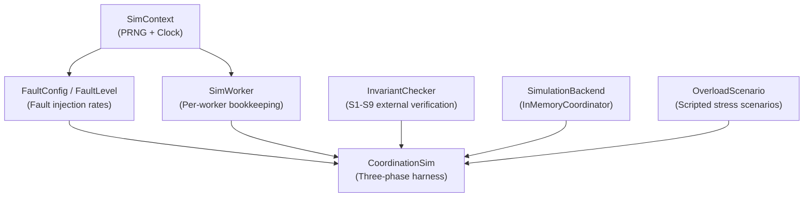
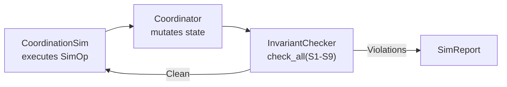
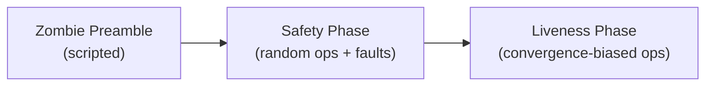

# Deterministic Simulation Testing

Deterministic Simulation Testing (DST) is a technique for finding concurrency bugs in distributed systems by running the entire system in a single process with controlled scheduling. This chapter explains the DST infrastructure implemented in Gossip-rs and how it verifies coordination protocol correctness.

## The Vision

Run the entire Gossip-rs distributed system -- coordinator, multiple workers, connectors, persistence -- in a single process. Control the scheduling of every operation. Inject failures at specific points. Verify that invariants hold under all execution orderings.

**Goal**: Find bugs that only manifest under rare interleavings, before they happen in production.

## The FoundationDB Precedent

FoundationDB pioneered DST in production database systems. Key findings:

- **3 weeks of DST** found bugs that would have taken **years** to find with traditional testing
- Bugs found: race conditions, deadlocks, data corruption under specific failure sequences
- **Determinism** is critical: same seed produces the same execution produces a reproducible bug

**Reference**: *Testing Distributed Systems w/ Deterministic Simulation* (Zhou et al., SIGMOD 2021)

### How FoundationDB Does It

1. **Eliminate non-determinism**: All I/O (network, disk, time) goes through a simulator
2. **Single-threaded event loop**: No real concurrency, just interleaved execution
3. **Deterministic PRNG**: All randomness comes from a seeded generator
4. **Event scheduling**: Priority queue of events (timer expirations, I/O completions, actor wakeups)
5. **Failure injection**: Simulator can crash actors, partition networks, corrupt disks at any event

**Result**: Run millions of tests overnight, each exploring a different execution path.

## Other Examples

### TigerBeetle VOPR (2025)

TigerBeetle's *Viewstamped Replication Made VORACIOUS* simulator:
- Single-threaded deterministic execution
- Fault injection: crashes, Byzantine faults, bit flips, clock skew
- Invariant checking: bank transfers must balance, no negative accounts
- Discovered bugs in consensus protocol that manifested only under specific crash sequences

**Reference**: *A Descent Into the Vortex* (TigerBeetle Blog, 2025)

### WarpStream DST (2025)

WarpStream (Kafka-compatible streaming platform) uses DST to test:
- Leader election races
- Partition reassignment during crashes
- Exactly-once semantics under message reordering
- Discovered deadlock in partition handoff that required 5 specific events in sequence

**Key insight**: Distributed systems have **exponentially many** execution orderings. Random testing explores approximately 0.0001% of the space. DST with controlled scheduling explores the *interesting* orderings (near failures, lease expirations, split operations).

## How Gossip-rs Enables DST

Gossip-rs was designed from day one with DST in mind. Five architectural decisions make DST feasible:

### 1. LogicalTime: No Hidden Clock Calls

All coordination functions take time as an explicit input parameter rather than reading the system clock:

```rust
// From crates/gossip-coordination/src/traits.rs
// All coordination operations accept LogicalTime -- the caller controls time.
fn acquire_and_restore_into<'a>(
    &mut self,
    now: LogicalTime,      // Caller provides time
    tenant: TenantId,
    key: ShardKey,
    worker: WorkerId,
    out: &'a mut AcquireScratch,
) -> Result<AcquireResultView<'a>, AcquireError>;

fn checkpoint(
    &mut self,
    now: LogicalTime,      // Caller provides time
    tenant: TenantId,
    lease: &Lease,
    new_cursor: &CursorUpdate<'_>,
    op_id: OpId,
) -> Result<IdempotentOutcome<()>, CheckpointError>;
```

**Why this matters**: If functions called `SystemTime::now()` internally, the simulator could not control time. By passing `LogicalTime` as a parameter, the simulation harness decides when time advances:

```rust
// From crates/gossip-coordination/src/sim/mod.rs -- SimContext
pub struct SimContext {
    rng: ChaCha8Rng,
    clock: LogicalTime,
    seed: u64,
}

impl SimContext {
    pub fn advance(&mut self, ticks: u64) {
        self.clock = self
            .clock
            .checked_add(ticks)
            .expect("SimContext::advance: LogicalTime overflow");
    }
}
```

### 2. Synchronous Traits: No Hidden Async Scheduling

The coordination backend uses synchronous traits:

```rust
// CoordinationFacade methods are synchronous, not async.
// The test harness controls execution order explicitly.
fn acquire_and_restore_into<'a>(&mut self, ...) -> Result<AcquireResultView<'a>, AcquireError>;
// NOT: async fn acquire_and_restore_into(&mut self, ...) -> ...;
```

**Why this matters**: `async` functions surrender control to the Tokio scheduler. The simulator cannot control when an `async` function resumes after `.await`. By using synchronous traits, the test harness drives execution order explicitly -- worker 1's operation runs to completion before worker 2's begins.

### 3. In-Memory Backends: No External Dependencies

```rust
// From crates/gossip-coordination/src/sim/backend.rs
// InMemoryCoordinator stores all state in HashMap -- no network, no disk.
// The SimulationBackend trait combines mutation + observation.
pub trait SimulationBackend: CoordinationFacade + SimIntrospection {}
impl<T: CoordinationFacade + SimIntrospection> SimulationBackend for T {}
```

**Why this matters**: Real databases have non-deterministic performance (disk seeks, network latency, query optimizer). In-memory backends are fast and deterministic. The `SimulationBackend` trait combines the production mutation contract (`CoordinationFacade`) with read-only observation (`SimIntrospection`) for invariant checking, without polluting production code with test-only methods.

### 4. Content-Addressed Identity: Deterministic by Design

Identity types in Gossip-rs are content-addressed -- same inputs always produce the same identity. No `Uuid::new_v4()`, no timestamps, no randomness in identity generation.

**Why this matters**: If identity used random UUIDs, each test run would produce different IDs and outputs could not be compared. Content-addressed identity is a pure function: same inputs always produce same outputs.

### 5. Seeded PRNG: ChaCha8Rng (RFC 8439)

The simulation uses `ChaCha8Rng` rather than `StdRng`:

```rust
// From crates/gossip-coordination/src/sim/mod.rs
pub struct SimContext {
    rng: ChaCha8Rng,    // Algorithm-specified (RFC 8439)
    clock: LogicalTime,
    seed: u64,
}
```

**Why this matters**: `StdRng` is explicitly non-portable -- it can change algorithms between Rust releases. `ChaCha8Rng` is algorithm-specified by RFC 8439, guaranteeing that the same seed produces the same random sequence on any platform, any Rust version. `Cargo.lock` provides sufficient pinning for the remaining dependency.

## Simulator Architecture

The simulation infrastructure lives in `crates/gossip-coordination/src/sim/` and is organized into five layers (the source module `mod.rs` combines `SimContext` and `FaultConfig` into a single layer; here they are presented separately for pedagogical clarity):



### Layer 1: SimContext -- PRNG and Logical Clock

`SimContext` is the foundation (shown in the "How Gossip-rs Enables DST" section above). It owns a single `ChaCha8Rng` seeded from a `u64` and a monotonic `LogicalTime` clock with `advance()` and `advance_to()` methods.

**PRNG ordering discipline**: The PRNG is a single sequential stream. Every call to `rng().random()` or `rng().random_range()` consumes state and advances the stream position. Any change to the order or number of `rng` calls changes all subsequent random decisions for a given seed. When adding new randomized logic, the codebase convention is to *append* calls rather than inserting them between existing ones.

**Clock monotonicity**: Both `advance` and `advance_to` enforce forward-only movement with panics. This prevents immortal leases (a lease that never expires because time went backward) and time-travel bugs.

### Layer 2: FaultConfig and FaultLevel

Fault injection rates are expressed as integer parts-per-million (PPM) rather than floating-point probabilities. This eliminates IEEE 754 rounding variance across platforms:

```rust
// From crates/gossip-coordination/src/sim/mod.rs
const PPM_MAX: u32 = 1_000_000;

pub enum FaultLevel {
    SunnyDay = 1,      // No faults
    Stormy = 2,        // Moderate faults
    Radioactive = 3,   // Aggressive faults
}

pub struct FaultConfig {
    lease_expiry_ppm: u32,
    pause_ppm: u32,
    pause_range: core::ops::RangeInclusive<u64>,
    time_jump_ppm: u32,
    time_jump_range: core::ops::RangeInclusive<u64>,
}

impl FaultConfig {
    pub fn for_level(level: FaultLevel) -> Self {
        match level {
            FaultLevel::SunnyDay => Self {
                lease_expiry_ppm: 0,
                pause_ppm: 0,
                pause_range: 0..=0,
                time_jump_ppm: 0,
                time_jump_range: 0..=0,
            },
            FaultLevel::Stormy => Self {
                lease_expiry_ppm: 100_000, // 10%
                pause_ppm: 50_000,         // 5%
                pause_range: 1..=5,
                time_jump_ppm: 100_000,    // 10%
                time_jump_range: 50..=200,
            },
            FaultLevel::Radioactive => Self {
                lease_expiry_ppm: 200_000, // 20%
                pause_ppm: 100_000,        // 10%
                pause_range: 1..=10,
                time_jump_ppm: 200_000,    // 20%
                time_jump_range: 100..=500,
            },
        }
    }
}
```

The three levels form a monotonic hierarchy -- each level injects faults at least as aggressively as the one below it. This is enforced by a property test (`prop_fault_rates_monotonic_across_levels`) that draws 1,000 samples per level per fault type and asserts `SunnyDay == 0`, `Stormy > 0`, and `Radioactive >= Stormy`.

The `should_inject` helper uses uniform sampling over `[0, 1_000_000)`: it draws `rng.random_range(0u32..PPM_MAX)` and returns `true` when the draw is below the configured PPM rate. `ppm = 0` never fires; `ppm = 1_000_000` always fires.

### Layer 3: SimWorker -- Per-Worker Bookkeeping

Each `SimWorker` tracks its own shard acquisitions, op-ID generation, pause state, and cursor progress:

```rust
// From crates/gossip-coordination/src/sim/worker.rs
const OP_ID_PARTITION: u64 = 1_000_000;

pub struct SimWorker {
    id: WorkerId,
    held_shards: BTreeMap<(u64, u64), (ShardKey, Lease)>,
    next_op: u64,
    op_ceiling: u64,
    paused: bool,
    last_cursors: BTreeMap<(RunId, ShardId), Vec<u8>>,
}
```

**Partitioned op-ID generation**: Each worker generates op-IDs in a dedicated partition: worker N uses `[N * 1_000_000, (N+1) * 1_000_000)`. This guarantees cross-worker uniqueness without coordination. The constructor panics on overflow; `next_op_id()` panics if the partition is exhausted (more than 1M ops per worker).

**Local view vs. ground truth**: `SimWorker` tracks what the worker *believes* it holds. This view can diverge from the coordinator's ground truth (e.g., after a lease expires without the worker noticing). The divergence is intentional -- it creates the interesting fault scenarios that the simulation is designed to stress-test. The `InvariantChecker` always validates against coordinator state, never against worker bookkeeping.

**Deterministic iteration**: `held_shards` uses `BTreeMap<(u64, u64), _>` keyed by raw `(run, shard)` values, providing deterministic iteration order without requiring `Ord` on `ShardKey` (which is intentionally opaque).

### Layer 4: InvariantChecker -- S1 through S9

The `InvariantChecker` is a stateful external observer that verifies nine safety properties against coordinator ground truth at every simulation step. Following the FoundationDB simulation principle, it never trusts the system's own validation for correctness verification.



The checker maintains per-shard history across calls in `BTreeMap`s:

```rust
// From crates/gossip-coordination/src/sim/invariants.rs
pub struct InvariantChecker {
    prev_epochs: BTreeMap<HistoryKey, FenceEpoch>,
    prev_terminal: BTreeMap<HistoryKey, ShardStatus>,
    prev_cursors: BTreeMap<HistoryKey, Option<Box<[u8]>>>,
    active_holders: HashMap<ShardKey, Vec<WorkerId>>,
    // Reusable scratch buffers for allocation-free hot path...
}
```

`check_all` performs a **single pass** over all shard records from the coordinator, checking S2--S9 inline. S1 requires a post-pass duplicate check because mutual exclusion is a cross-record property:

#### S1: Mutual Exclusion

At most one worker holds a non-expired lease per shard at any given time. Active lease holders are accumulated into a `HashMap<ShardKey, Vec<WorkerId>>` during the pass, then scanned for duplicates afterward:

```rust
// From crates/gossip-coordination/src/sim/invariants.rs
fn accumulate_active_holder(&mut self, key: ShardKey, record: &ShardRecord, now: LogicalTime) {
    if let Some(holder) = record.lease()
        && holder.deadline() >= now
    {
        self.active_holders
            .entry(key)
            .or_default()
            .push(holder.owner());
    }
}

fn check_mutual_exclusion(&self, violations: &mut Vec<InvariantViolation>) {
    for (key, holders) in &self.active_holders {
        if holders.len() > 1 {
            violations.push(InvariantViolation::MutualExclusion {
                key: *key,
                workers: [holders[0], holders[1]],
            });
        }
    }
}
```

Note the intentional off-by-one: the checker uses `>=` (not `>`) when comparing deadline to current time, accepting false positives at boundary ticks over false negatives. A false positive is harmless; a false negative would undermine the safety guarantee.

#### S2: Fence Monotonicity

`fence_epoch` never decreases for a given `(RunId, ShardId)`. A decrease would allow a zombie worker to operate on a shard it no longer owns. The checker stores the last-seen epoch in `prev_epochs` and reports `FenceMonotonicity` when the current epoch is less than the previous one.

#### S3: Terminal Irreversibility

Terminal states (`Done`, `Split`, `Parked`) never revert, except `Parked` to `Active` (unpark) which requires a fence bump. The checker validates that the unpark fence-bump requirement is met -- without the bump, a worker that acquired during the parked state could operate with a stale fence. Two sub-violations are reported: `TerminalIrreversibility` for illegal reversions, and `UnparkWithoutFenceBump` for `Parked` to `Active` transitions where `fence_epoch` did not increase.

#### S4: Record Invariant

`ShardRecord::validate_invariants()` returns `Ok` for every record. This delegates to the record's own non-panicking validation (e.g., `Parked` without `park_reason`, terminal shard with active lease, fence epoch below `INITIAL`).

#### S5: Cursor Monotonicity

`cursor.last_key()` never decreases per shard. Cursor progress must be monotonic because it represents committed scan progress; regression would cause duplicate processing. The checker compares raw `Option<&[u8]>` slices (not `Cursor` objects) for allocation efficiency, and only updates the history when the value actually changed. Two regression cases are detected: `last_key` decreased lexicographically, or was reset from `Some` to `None`.

#### S6: Cursor Bounds

Non-initial cursors must remain within the shard's `[start, end)` spec range. A cursor reporting progress outside its assigned key range indicates a routing or validation bug.

#### S7: Split Coverage

When a shard has `Split` status, its spawned children must exist in the coordinator and reference the parent:

```rust
// From crates/gossip-coordination/src/sim/invariants.rs
fn check_split_coverage(
    &mut self,
    record: &ShardRecord,
    tenant: TenantId,
    coordinator: &impl SimIntrospection,
    violations: &mut Vec<InvariantViolation>,
) {
    if record.status != ShardStatus::Split { return; }
    if record.spawned.is_empty() {
        violations.push(InvariantViolation::SplitCoverage {
            run: record.run, shard: record.shard,
            detail: SplitCoverageDetail::EmptySpawned,
        });
        return;
    }
    // Check each child exists and points back to parent...
}
```

Three sub-cases are reported: (a) the split shard has an empty `spawned` list, (b) a referenced child shard does not exist, (c) a child shard's `parent` field does not reference this parent.

#### S8: Run-Terminal Irreversibility

Terminal run states (`Done`, `Failed`, `Cancelled`) never revert to a non-terminal state. This mirrors S3 at the run level: once a run reaches a terminal state, it must stay there. The checker stores the last-seen run status and reports `RunTerminalIrreversibility` when a reversion is detected.

#### S9: Claim Cooldown

The same worker cannot successfully claim a shard twice within fewer ticks than the configured cooldown period. This prevents rapid re-acquisition churn. The checker tracks per-worker claim timestamps and reports a violation when the gap between successive successful claims is below the cooldown threshold.

**History pruning**: After each pass, permanently terminal shards (`Done`, `Split`) have their `prev_epochs` and `prev_cursors` entries pruned to bound memory growth in long-running simulations. `prev_terminal` is retained so S3 can still detect illegal reversions. `Parked` shards are never pruned because unpark can revert them to `Active`.

### Layer 5: Overload Scenarios -- Scripted Stress Validation

The `overload` module defines scripted overload scenarios used by `CoordinationSim::run_overload` for targeted stress validation. Each `OverloadScenario` specifies an `OverloadKind` (e.g., more workers than shards, burst acquisitions, rapid split cascades) and produces an `OverloadReport` with observations. Unlike the random-op-driven safety/liveness phases, overload scenarios are deterministic scripts that drive the coordinator into specific high-contention states to verify graceful degradation and correctness under pressure.

### Layer 6: CoordinationSim -- The Harness

`CoordinationSim` is the top-level driver that orchestrates everything. It maintains two parallel views of the world:

```rust
// From crates/gossip-coordination/src/sim/harness.rs
pub struct CoordinationSim<B: SimulationBackend = InMemoryCoordinator> {
    context: SimContext,
    coordinator: B,
    workers: BTreeMap<WorkerId, SimWorker>,
    fault_config: FaultConfig,
    checker: InvariantChecker,
    shard_keys: Vec<ShardKey>,
    active_shard_keys: Vec<ShardKey>,
    tenant: TenantId,
    ops_executed: usize,
    stale_leases: Vec<(WorkerId, ShardKey, Lease)>,
    last_checkpoint_ops: CheckpointOpMap,
    run_shard_ids: BTreeMap<RunId, Vec<ShardId>>,
    admin_next_op: u64,
}
```

**Two views**: The `coordinator` holds the ground truth; `workers` holds each worker's local belief. The views can diverge (e.g., after a lease expires without the worker noticing), which creates the interesting fault scenarios.

**Three-phase execution**: Every `run()` call proceeds through three stages:



```rust
// From crates/gossip-coordination/src/sim/harness.rs
pub fn run(mut self, safety_ops: usize, liveness_ops: usize) -> SimReport {
    let mut all_violations = Vec::new();
    let mut event_counts = BTreeMap::new();

    // Advance clock off ZERO before any coordinator op.
    let initial_ticks = self.context.rng().random_range(1u64..=10);
    self.context.advance(initial_ticks);

    // Phase 1: Inject one deterministic zombie sequence.
    self.inject_zombie_scenario(&mut all_violations, &mut event_counts);

    // Phase 2: Safety phase -- random ops with fault injection.
    for i in 0..safety_ops {
        let suppress_faults = i < WARMUP_OPS;
        let op = self.generate_random_op(suppress_faults);
        let (event, violations) = self.step(op);
        *event_counts.entry(event.kind()).or_insert(0) += 1;
        all_violations.extend(violations);
    }

    // Phase 3: Liveness phase -- biased toward acquire + complete.
    for _ in 0..liveness_ops {
        let op = self.generate_liveness_op();
        let (event, violations) = self.step(op);
        *event_counts.entry(event.kind()).or_insert(0) += 1;
        all_violations.extend(violations);
    }

    let converged = self.check_convergence();
    // ...build SimReport
}
```

**Phase 1 -- Zombie Preamble**: A scripted acquire-expire-reacquire-checkpoint sequence that deterministically exercises the bookkeeping-cleanup path. This ensures the stale-fence rejection path is always tested regardless of seed.

**Phase 2 -- Safety Phase**: Weighted random operations with fault injection. The first `WARMUP_OPS` (5 operations) suppress faults to let workers establish leases before time-jumps expire them. After warmup, full fault injection is active.

**Phase 3 -- Liveness Phase**: Operations biased toward acquire + complete (60% combined) to drive shards to terminal states, verifying that the system converges within a bounded op budget.

**Every step checks all invariants**:

```rust
// From crates/gossip-coordination/src/sim/harness.rs
pub fn step(&mut self, op: SimOp) -> (SimEvent, Vec<InvariantViolation>) {
    let event = self.execute_op(&op);
    self.ops_executed += 1;
    let violations = self
        .checker
        .check_all(&self.coordinator, self.tenant, self.context.now());
    (event, violations)
}
```

## SimOp and Weighted Random Generation

The `SimOp` enum represents every possible action in the simulation:

```rust
// From crates/gossip-coordination/src/sim/harness.rs
pub enum SimOp {
    Acquire { worker: WorkerId, key: ShardKey },
    Renew { worker: WorkerId, key: ShardKey },
    Checkpoint { worker: WorkerId, key: ShardKey },
    Complete { worker: WorkerId, key: ShardKey },
    Park { worker: WorkerId, key: ShardKey },
    SplitReplace { worker: WorkerId, key: ShardKey },
    SplitResidual { worker: WorkerId, key: ShardKey },
    ReplayCheckpoint { worker: WorkerId, key: ShardKey },
    ConflictCheckpoint { worker: WorkerId, key: ShardKey },
    ZombieCheckpoint,
    ClaimNext { worker: WorkerId },
    AdvanceTime { ticks: u64 },
    PauseWorker { worker: WorkerId },
    ResumeWorker { worker: WorkerId },
    SessionLifecycle { worker: WorkerId, key: ShardKey },
    Unpark { key: ShardKey },
    /// Apply a terminal transition (complete/fail/cancel) to a run.
    /// Admin operation — no worker or lease required.
    TerminateRun { run: RunId, kind: RunTerminalKind },
}
```

Operations fall into four categories:

1. **Coordinator ops** (`Acquire`, `Renew`, `Checkpoint`, `Complete`, `Park`, `SplitReplace`, `SplitResidual`, `ClaimNext`, `SessionLifecycle`): invoke real coordinator methods through the `SimulationBackend` trait.
2. **Admin ops** (`Unpark`, `TerminateRun`): invoke run-management methods that operate outside the worker-lease model (no worker/lease required).
3. **Idempotency/conflict ops** (`ReplayCheckpoint`, `ConflictCheckpoint`, `ZombieCheckpoint`): exercise edge cases in the coordinator's op-log and fencing protocol.
4. **Environmental ops** (`AdvanceTime`, `PauseWorker`, `ResumeWorker`): manipulate simulation state without touching the coordinator.

The harness selects operations via weighted random rolls. If generation fails (no suitable target exists), it retries up to `MAX_OP_RETRIES` (10) times, then falls back to `AdvanceTime` which is always valid.

**Forward-only cursors**: The harness tracks per-worker cursor progress and only generates cursors that advance. Without this, random cursors would frequently regress, flooding the run with expected `CursorRegression` rejections that mask real bugs.

**Stale lease tracking**: When worker B acquires a shard previously held by worker A, the harness saves A's superseded lease (capped at 64 entries). These feed `ZombieCheckpoint`, which exercises the coordinator's fence-based `StaleFence` rejection path directly.

**Active shard set**: The harness maintains `active_shard_keys` as a subset of all shard keys, excluding terminal shards. This prevents op generation from selecting shards that would always be rejected.

## Fault Injection

Fault injection in the simulation is driven by the `FaultConfig` described above. The three fault levels provide increasing pressure:

| Level | Lease Expiry | Worker Pause | Time Jump |
|-------|-------------|-------------|-----------|
| **SunnyDay** | 0% | 0% | 0% |
| **Stormy** | 10% (100K PPM) | 5% (50K PPM) | 10% (100K PPM), 50-200 ticks |
| **Radioactive** | 20% (200K PPM) | 10% (100K PPM) | 20% (200K PPM), 100-500 ticks |

The simulation also includes a `FaultInjectingIntrospector` that operates at the *observation layer*. It wraps a real `SimIntrospection` backend and injects synthetic shard records into the iteration stream to test scenarios the in-memory backend cannot structurally produce (e.g., two workers holding leases on the same shard simultaneously):

```rust
// From crates/gossip-coordination/src/sim/fault_injector.rs
pub struct FaultInjectingIntrospector<B: SimIntrospection> {
    inner: B,
    synthetic_records: Vec<(TenantId, ShardKey, ShardRecord)>,
}

impl<B: SimIntrospection> SimIntrospection for FaultInjectingIntrospector<B> {
    fn shards(&self) -> Self::ShardIter<'_> {
        let real = self.inner.shards();
        let synthetic = self.synthetic_records.iter()
            .map(|(tenant, key, record)| ((*tenant, *key), record));
        Box::new(real.chain(synthetic))
    }

    fn shard_lookup(&self, tenant: &TenantId, key: &ShardKey) -> Option<&ShardRecord> {
        // Delegates to real backend only -- synthetic records invisible to lookups.
        self.inner.shard_lookup(tenant, key)
    }
}
```

This asymmetry is intentional: synthetic records appear in full scans but not point lookups, modeling real-world distributed-system bugs where a full scan reveals inconsistencies that targeted reads miss (e.g., stale replicas visible in range scans but masked by read-repair on point lookups).

## What DST Finds

### Race Condition: Double Lease (S1)

**Bug**: Two workers acquire leases on the same shard simultaneously.

The checker accumulates active lease holders per shard during its pass. If two workers hold non-expired leases on the same `ShardKey`, an `InvariantViolation::MutualExclusion` is reported with both worker IDs:

```rust
// From crates/gossip-coordination/src/sim/invariants.rs
MutualExclusion {
    key: ShardKey,
    workers: [WorkerId; 2],
}
```

**DST finds this**: The invariant checker runs after every single operation. A double-lease that exists for even one step will be caught.

### Lease Expiry Edge Case (S2, Fencing)

**Bug**: Worker commits after its lease expires because the coordinator failed to enforce fencing.

**Setup**: The simulation's `AdvanceTime` op can jump the clock past a lease's deadline. The `ZombieCheckpoint` op then attempts to checkpoint using the expired lease.

**Expected behavior**: Coordinator returns `StaleFence` rejection.

**DST finds this**: S2 (fence monotonicity) catches any case where a stale worker's fence epoch is accepted by the coordinator.

### Split Operation Ordering (S7)

**Bug**: Split operation creates children that do not properly cover the parent's range, or children do not reference their parent.

**Setup**: `SplitReplace` and `SplitResidual` ops create child shards. The invariant checker verifies referential integrity after every split.

**Expected behavior**: Every child shard listed in the parent's `spawned` vec exists in the coordinator and has its `parent` field set to the parent shard ID.

**DST finds this**: S7 (split coverage) immediately detects missing children, wrong parent references, or empty `spawned` lists.

### Cursor Monotonicity Violation (S5)

**Bug**: Cursor goes backward due to a commit retry using a stale cached value.

The simulation's forward-only cursor generation prevents the *harness* from producing regressions. But if the *coordinator* has a bug that causes it to accept a regressing cursor, S5 will catch it:

```rust
// S5 detects regression: last_key decreased or reset from Some to None
CursorMonotonicity {
    run: RunId,
    shard: ShardId,
    prev: Option<Box<[u8]>>,
    current: Option<Box<[u8]>>,
}
```

## Mega Sim Tests

The mega simulation test suite exercises the coordination subsystem across a wide range of PRNG seeds. It lives in `crates/gossip-coordination/src/sim/mega_sim_tests.rs`.

### Thread-Parallel Seed Sweep

The primary CI gate (`mega_sim_10k_steps`) divides seeds across `available_parallelism()` OS threads with static chunking using `std::thread::scope`. Each seed runs 4 workers contending over 15 shards through 10K safety ops followed by 2K liveness ops. Failures are collected with reproduction commands. Environment variables control the sweep:

| Variable | Effect | Default |
|----------|--------|---------|
| `GOSSIP_SIM_SEEDS` | Number of seeds to sweep | 100 |
| `GOSSIP_SIM_SEED` | Single seed for reproduction | -- |
| `GOSSIP_SIM_FAULT` | Fault level: `sunny`, `stormy`, `radioactive` | `stormy` |

### Coverage Assertion

The aggregate across all seeds must contain five core event kinds: `AcquireOk`, `CheckpointOk`, `CompleteOk`, `Rejected`, `TimeAdvanced`. A missing kind indicates a harness regression that silently suppresses an entire category of coordinator interaction.

### Stress Tests

Beyond the standard sweep, stress tests push to larger configurations:

- **`stress_200_shards_stormy`**: 8 workers, 200 shards under Stormy faults. Exercises invariant checker pruning (many shards reach terminal states) and worker contention (25 shards per worker on average).
- **`stress_split_cascade`**: 4 workers, 20 shards under Radioactive faults. Designed to trigger multi-level split cascades. Verifies that dynamically growing shard sets do not violate S1--S9.

### Proptest Integration

The proptest seed sweeper (`proptest_mega_sim`) delegates seed generation to proptest for automatic shrinking and `.proptest-regressions` file persistence. It runs the same configuration as the hand-rolled sweep (4 workers, 15 shards, 10K+2K ops, Stormy) across 100 proptest cases. When a seed fails, proptest minimizes it to the smallest reproducing value and records it to disk for automatic replay.

### Convergence Property Tests

Convergence (bounded liveness) is tested separately with proptest. The Alpern-Schneider decomposition (1985) states that every correctness property is the intersection of a safety property and a liveness property. The mega sweep covers safety; convergence tests cover liveness. SunnyDay convergence runs 200 proptest cases with 50 safety + 2000 liveness ops. Stormy convergence runs 200 cases with 500 safety + 15000 liveness ops. Radioactive is omitted from convergence testing because its aggressive fault pressure makes bounded convergence unreliable within practical op budgets.

### Behavioral Tests and Deterministic Replay

The behavioral test suite (`sim_behavioral_tests.rs`) pins behavioral properties rather than exact counts. A legitimate harness change that reorders PRNG calls will shift counts but must not break any behavioral assertion. The `deterministic_replay_cross_config` test runs each seed+config twice and asserts field-identical `SimReport`s (`event_counts`, `ops_executed`, `end_time`, `converged`), validating the determinism contract. A compile-time exhaustiveness guard (a `const` match block on `SimEventKind`) ensures that adding a variant without updating the test causes a compilation error.

### Multi-Tenant Isolation

The multi-tenant test runs two tenants against a shared `InMemoryCoordinator` to verify:
1. Cross-tenant rejection (tenant B cannot acquire tenant A's shards)
2. Independent shard lifecycles
3. Checker history isolation (fence epoch history keyed by `(TenantId, RunId, ShardId)`)

## Current Implementation Status

The simulation infrastructure is fully implemented and exercised in CI:

| Component | Status | Source |
|-----------|--------|--------|
| `SimContext` (PRNG + clock) | Complete | `sim/mod.rs` |
| `FaultConfig` / `FaultLevel` (3 levels) | Complete | `sim/mod.rs` |
| `SimWorker` (partitioned op-IDs, bookkeeping) | Complete | `sim/worker.rs` |
| `InvariantChecker` (S1-S9) | Complete | `sim/invariants.rs` |
| `CoordinationSim` (3-phase harness) | Complete | `sim/harness.rs` |
| `SimulationBackend` trait | Complete | `sim/backend.rs` |
| `FaultInjectingIntrospector` | Complete | `sim/fault_injector.rs` |
| Mega sim sweep (100+ seeds) | Complete | `sim/mega_sim_tests.rs` |
| Proptest convergence (200 cases) | Complete | `sim/mega_sim_tests.rs` |
| Behavioral regression suite | Complete | `sim/sim_behavioral_tests.rs` |
| Deterministic replay validation | Complete | `sim/sim_behavioral_tests.rs` |
| Multi-tenant isolation test | Complete | `sim/mega_sim_tests.rs` |
| Stress tests (200 shards, split cascades) | Complete | `sim/mega_sim_tests.rs` |

**Operations covered**: Acquire, Renew, Checkpoint, Complete, Park, SplitReplace, SplitResidual, ReplayCheckpoint, ConflictCheckpoint, ZombieCheckpoint, ClaimNext, SessionLifecycle, AdvanceTime, PauseWorker, ResumeWorker, Unpark, TerminateRun.

**Running the tests**:

```bash
# Standard test suite (unit + behavioral + deterministic replay)
cargo test -p gossip-coordination sim

# Full mega sweep (100 seeds, Stormy faults -- ~minutes)
cargo test -p gossip-coordination mega_sim -- --ignored --nocapture

# Single-seed reproduction
GOSSIP_SIM_SEED=42 cargo test -p gossip-coordination mega_sim -- --ignored --nocapture

# Stress tests
cargo test -p gossip-coordination stress_ -- --ignored --nocapture
```

## Benefits and Limitations

### Benefits

**Reproducibility**: Same seed produces the same execution, always. No "works on my machine" issues. Failing seeds are captured in proptest regression files for automatic replay.

**Coverage**: Explore execution orderings that are rare in production but critical for correctness. The mega sweep runs 100+ seeds by default, each exploring a completely different operation sequence, fault pattern, and timing profile.

**Speed**: Run thousands of scenarios overnight. Each test completes in milliseconds (no real network or disk). The thread-parallel sweep saturates available cores.

**Confidence**: Nine invariant checks prove correctness properties, not just "it didn't crash". Safety (S1-S9) and liveness (convergence) are verified independently.

### Limitations

**Only tests what is simulated**: If the simulator does not model a failure mode, it will not find bugs in that mode. The current harness covers lease expiry, worker pauses, time jumps, stale fences, and split cascades but not Byzantine coordinator behavior or disk corruption.

**Requires disciplined architecture**: DST only works if the system is designed for it (synchronous traits, LogicalTime, in-memory backends). Retrofitting DST onto an existing system is very hard.

**Simulator bugs**: The simulator itself can have bugs. Invariant checks must be trustworthy. The `FaultInjectingIntrospector` exists specifically to validate the checker against states the real backend cannot produce.

**PRNG sensitivity**: Any change to the order or number of `rng` calls changes all downstream random decisions for a given seed. This means seemingly unrelated code changes can alter the execution paths explored by existing seeds.

## Summary

Deterministic Simulation Testing is the gold standard for testing distributed systems. Gossip-rs has a fully implemented DST infrastructure built on five architectural decisions:

1. **LogicalTime**: No hidden clock calls -- the simulation harness controls time
2. **Synchronous traits**: No hidden async scheduling -- the harness controls execution order
3. **In-memory backends**: No external dependencies -- deterministic performance
4. **Content-addressed identity**: Deterministic by design -- no randomness in identity
5. **ChaCha8Rng (RFC 8439)**: Portable, algorithm-specified PRNG -- same seed produces same results everywhere

The simulation verifies nine safety properties (S1-S9) after every single operation across hundreds of seeds, three fault levels, and configurations ranging from 3 shards to 200 shards. Convergence (bounded liveness) is verified independently with proptest. The result is high confidence in distributed correctness before the first production deployment.

**Next**: [Appendix A: Rust Patterns Used](../09-appendices/A-rust-patterns-used.md) catalogs the Rust patterns used throughout Gossip-rs.
