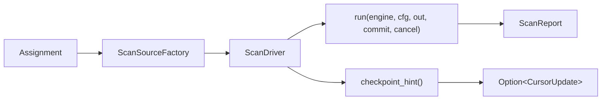
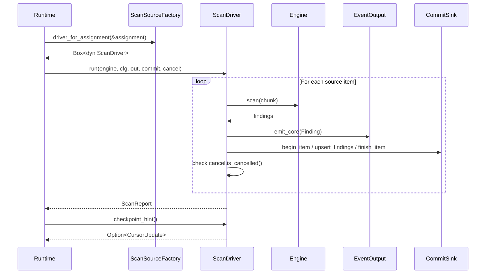

# "One Seam to Rule Them All" -- The Execution Boundary

*A team ships two scanner entrypoints: a CLI tool for local developer use and a distributed worker for production fleets. The CLI calls the filesystem scanner directly, building an engine inline and writing findings to stdout. The distributed worker does the same thing, but through a coordinator-backed pipeline with identity derivation, durable commit tracking, and checkpoint persistence. Six months pass. A subtle rule-loading change in the CLI path goes unnoticed in the distributed path. The CLI now anchors on `SECRET` with a 64-byte radius; the distributed worker still uses the old 32-byte radius. Shard `fs-0xa3` scans `/etc/config/secrets.yaml` at cursor position `0x0000` and emits zero findings. The same file scanned by the CLI emits three. An operator notices the discrepancy at 2 AM during an incident. The two code paths have diverged silently. Without a shared execution boundary, every runtime must independently re-implement engine construction, driver dispatch, and cancellation -- and every divergence is a correctness bug hiding in plain sight.*

---

The `gossip-scan-driver` crate exists to prevent this class of divergence. At 483 lines, it is one of the smallest crates in the system, and that is deliberate. It defines exactly one execution seam: the contract that every source-specific backend implements and every runtime consumes. CLI mode, distributed mode, and future runtimes all flow through this single boundary. There is no second path.

The crate-level documentation from `lib.rs` captures the pipeline in ASCII:

```rust
//! Unified scan-driver boundary for source-specific execution backends.
//!
//! This crate is the integration seam between scan orchestration (CLI,
//! distributed runtime, coordination layer) and source-specific backends
//! (filesystem, git, in-memory). It defines the shared vocabulary — types,
//! traits, and config — without containing any implementation logic. Concrete
//! driver implementations live in downstream crates, primarily
//! `gossip-connectors`; runtime crates consume these interfaces and bridge them
//! to coordination.
//!
//! # Execution flow
//!
//! ```text
//! Assignment ─► ScanSourceFactory::driver_for_assignment()
//!                        │
//!                        ▼
//!               Box<dyn ScanDriver>
//!                        │
//!          ┌─────────────┼───────────────────┐
//!          │             run()                │
//!          │  Engine + Config + EventOutput   │
//!          │  + CommitSink + CancellationToken│
//!          │             │                    │
//!          │             ▼                    │
//!          │        ScanReport                │
//!          └─────────────────────────────────-┘
//! ```
//!
//! # Why a separate crate?
//!
//! `gossip-contracts` defines coordination-layer data (shards, cursors,
//! identities). Scan-driver concerns — engines, event sinks, finding batches,
//! cancellation — are orthogonal. Splitting them keeps `gossip-contracts` a
//! lightweight leaf crate and avoids pulling scanner dependencies into the
//! coordination graph.
//!
//! # Consumers
//!
//! | Crate | Role |
//! |-------|------|
//! | `gossip-connectors` | Implements [`ScanDriver`] for FS, Git, and in-memory sources |
//! | `gossip-scanner-runtime` | Builds [`Assignment`]s, calls [`ScanSourceFactory`], and bridges [`ScanReport`] to the coordination layer via `distributed.rs` |
```

This chapter introduces the crate's purpose, its cooperative cancellation model, the execution configuration, and the pipeline that connects work descriptions to source-specific execution.

## 1. Why a Separate Interface Crate

The `gossip-scan-driver` crate sits between two layers. Below it are source-specific backends: a filesystem walker that enumerates directory trees, a git history scanner that iterates commits and blobs. Above it are runtime orchestrators: the CLI entrypoint that parses arguments and writes JSONL to stdout, the distributed worker that acquires shard leases from a coordinator and persists identity records. The crate itself contains no scanning logic. It defines the vocabulary types and trait contracts that let the layers above and below communicate without knowing about each other.

The key phrase in the crate documentation is "one-path execution seam." The crate enforces a structural invariant: there is exactly one way to go from a work assignment to a running scan. This invariant eliminates the divergence failure described in the opening scenario. When the runtime constructs an `Assignment` and hands it to a `ScanSourceFactory`, the factory returns a `ScanDriver`. The driver's `run` method takes an `Engine`, an `EventOutput`, a `CommitSink`, and a `CancellationToken`. Every runtime provides these dependencies through the same interface. There is no room for one runtime to skip the commit sink or use a different engine construction path without deliberately choosing to do so.

The dependency graph is intentionally narrow. From `Cargo.toml`:

```toml
[dependencies]
anyhow.workspace = true
gossip-contracts.workspace = true
scanner-engine.workspace = true
scanner-git.workspace = true
scanner-scheduler.workspace = true
```

The crate depends on `gossip-contracts` for coordination and identity types (recall from the B2 Coordination section that `ShardSpec` and `Cursor` define the range and resume position for a work unit). It depends on `scanner-engine` only for the `Engine` type reference (the engine is passed to `ScanDriver::run` as an `Arc`). It depends on `scanner-scheduler` for the `EventOutput` trait (the event output channel for streaming findings and diagnostics). Git-specific types (`GitEventOutput`, `GitScanMode`, `MergeDiffMode`) and the `GitExecutionConfig` struct live in `gossip-connectors`, not in the scan-driver crate -- git scanning is handled through a dedicated execution path (`execute_git_assignment`) rather than the `ScanDriver` trait. This dependency structure is intentional: the scan-driver crate defines the shared vocabulary that runtimes and backends both use, without pulling git-specific concerns into the interface boundary. Adding a new source kind (S3 object scanning, database table scanning) requires implementing the `ScanDriver` and `ScanSourceFactory` traits in a new crate. The scan-driver crate itself changes only if the new source requires new config fields or capabilities.

## 2. The Pipeline in Three Stages

The execution pipeline has three stages, each represented by a type or trait in the crate:



**Stage 1: Assignment.** A work unit described in source-agnostic terms. Contains a job ID, connector kind, shard specification, cursor position, and source-specific payload. The assignment describes *what* to scan without knowing *how*. We will examine this struct in detail in [Chapter 2](02-assignment-model.md).

**Stage 2: ScanSourceFactory.** A trait that maps an `Assignment` to a source-specific `ScanDriver`. The factory is the only point where the system needs to know which backend to use. Recall from the B2 Coordination section that shard specifications describe *what* range of work to scan; the factory translates that description into a driver that knows *how* to scan it. A filesystem factory reads the `AssignmentSource::Filesystem` payload and constructs a directory walker. A git factory reads `AssignmentSource::Git` and opens a repository.

**Stage 3: ScanDriver::run().** The driver executes the scan. It receives a shared scanner engine (rule matching, transform decoding), execution configuration (worker count, checkpoint frequency), an event output sink (for streaming findings), a commit sink (for durable persistence), and a cancellation token (for cooperative shutdown). The driver returns a `ScanReport` with aggregate counters. After `run` completes, the runtime may call `checkpoint_hint()` to retrieve the driver's final cursor position for coordinator persistence.

## 3. Cooperative Cancellation

Long-running scans must be interruptible. A distributed worker that loses its lease must stop scanning promptly -- continuing to process files that belong to a shard now assigned to another worker creates duplicate findings and wastes compute. A CLI user who presses Ctrl+C expects the process to exit, not hang while the filesystem walker finishes traversing a million-file directory tree.

The crate provides a `CancellationToken` for this purpose. From `lib.rs`:

```rust
/// Cooperative cancellation token for long-running scans.
///
/// Drivers are expected to check this token at source-specific scheduling
/// boundaries (for example between batch submissions).
#[derive(Clone, Debug, Default)]
pub struct CancellationToken {
    cancelled: Arc<AtomicBool>,
}

impl CancellationToken {
    /// Create a new token in the non-cancelled state.
    #[must_use]
    pub fn new() -> Self {
        Self::default()
    }

    /// Request cooperative cancellation.
    pub fn cancel(&self) {
        self.cancelled.store(true, Ordering::Release);
    }

    /// Returns true when cancellation has been requested.
    #[must_use]
    pub fn is_cancelled(&self) -> bool {
        self.cancelled.load(Ordering::Acquire)
    }
}
```

The token is an `Arc<AtomicBool>` wrapped in a struct. `Clone` is derived, so the runtime and driver share the same underlying atomic flag. The runtime holds one clone and the driver holds another. The runtime calls `cancel()` when it wants to stop the scan; the driver checks `is_cancelled()` at scheduling boundaries. Those boundaries are source-specific: a filesystem driver checks between file batches, a git driver checks between commits.

The memory ordering is Release/Acquire. The `cancel()` call uses `Ordering::Release` to ensure that any preceding writes by the cancelling thread (lease state updates, log entries) are visible to the driver thread when it observes the cancellation via `Ordering::Acquire`. This is the minimum ordering needed for a cooperative flag. Stronger orderings (SeqCst) would add unnecessary overhead on architectures with relaxed memory models (ARM, RISC-V) without any correctness benefit -- the cancellation is a one-directional signal, not a bidirectional synchronization point.

The token is cooperative, not preemptive. A driver that never checks the token will never stop. This is why the crate also defines `SourceCapabilities` (covered in [Chapter 3](03-driver-and-factory-traits.md)) with a `supports_cooperative_cancel` flag. The orchestration layer queries this flag before dispatching work and adapts its lifecycle management accordingly. A driver that declares `supports_cooperative_cancel: false` will not receive mid-scan cancellation signals; instead, the runtime waits for it to finish and handles the lease conflict at the coordinator level.

## 4. The Execution Configuration

The `ScanExecutionConfig` struct carries runtime knobs that are shared across all driver implementations. These are the parameters that the runtime sets based on user configuration and system capabilities, not the parameters that are source-specific. From `lib.rs`:

```rust
/// Runtime knobs shared across driver implementations.
#[derive(Clone, Copy, Debug, PartialEq, Eq)]
pub struct ScanExecutionConfig {
    pub workers: usize,
    pub checkpoint_every_items: u64,
    pub filesystem: FilesystemExecutionConfig,
}

impl Default for ScanExecutionConfig {
    fn default() -> Self {
        Self {
            workers: 1,
            checkpoint_every_items: 1_000,
            filesystem: FilesystemExecutionConfig::default(),
        }
    }
}
```

Let us examine each field:

**`workers: usize`.** The number of worker threads the driver may use for parallel scanning. The default is 1 (single-threaded), appropriate for testing and low-resource environments. In production, the runtime overrides this with the result of `std::thread::available_parallelism()` -- typically 4, 8, or 16 depending on the machine.

**`checkpoint_every_items: u64`.** The checkpoint frequency in items. After processing this many items, the orchestration layer can query `checkpoint_hint()` and persist a cursor update to the coordinator. The default is 1,000 items. For distributed workers, the runtime overrides this with the value from `ScanBudgets::max_items`, typically 256. This is the bridge between the scan driver boundary and the B2 coordination checkpoint mechanism: the driver processes items in batches of this size, and the coordinator records progress at each batch boundary.

**`filesystem: FilesystemExecutionConfig`.** Filesystem-specific knobs, nested because they only apply to filesystem drivers:

```rust
/// Filesystem-specific runtime knobs.
#[derive(Clone, Copy, Debug, PartialEq, Eq)]
pub struct FilesystemExecutionConfig {
    /// When true, archive expansion is disabled.
    pub skip_archives: bool,
    /// When true, binary-looking files are skipped.
    pub skip_binary: bool,
    /// When true, findings are forwarded through the commit sink bridge.
    pub emit_findings_to_commit_sink: bool,
}

impl Default for FilesystemExecutionConfig {
    fn default() -> Self {
        Self {
            skip_archives: false,
            skip_binary: true,
            emit_findings_to_commit_sink: false,
        }
    }
}
```

**`skip_archives: bool`.** When `false` (default), the driver expands archive files (ZIP, tar.gz) and scans their contents. Archives may contain configuration files with embedded secrets. When `true`, archives are skipped entirely.

**`skip_binary: bool`.** When `true` (default), files that appear to be binary (executables, images, compiled artifacts) are skipped. Binary files produce a high rate of false-positive matches. When `false`, binary files are scanned like any other file.

**`emit_findings_to_commit_sink: bool`.** When `false` (default), the driver does not call the `CommitSink` methods for findings. This is the CLI mode default: findings go only through the `EventOutput` channel. When `true`, the driver calls `begin_item`, `upsert_findings`, and `finish_item` for each scanned item, enabling the `DurableCommitSink` to derive identity records. The distributed runtime sets this to `true`.

The nesting of `FilesystemExecutionConfig` inside `ScanExecutionConfig` is a design choice that keeps the top-level struct focused on shared concerns (workers, checkpoints) while allowing source-specific concerns to live in their own namespace. Git-specific configuration (`GitExecutionConfig`) lives in `gossip-connectors` and is passed directly to the git scan entry point, rather than being embedded in the shared `ScanExecutionConfig`. This separation reflects the architectural decision to decouple git scanning from the `ScanDriver` trait: git scans use a dedicated execution path that receives git configuration directly.

## 5. The ScanReport

Every driver returns a `ScanReport` on completion. From `lib.rs`:

```rust
/// Generic run report from a driver.
#[derive(Clone, Copy, Debug, Default, PartialEq, Eq)]
pub struct ScanReport {
    /// Total items (files / blobs) processed.
    pub items_scanned: u64,
    /// Total payload bytes scanned.
    pub bytes_scanned: u64,
    /// Total chunk windows scanned across all items.
    pub chunks_scanned: u64,
    /// Findings emitted to the event stream.
    pub findings_emitted: u64,
    /// Non-fatal errors encountered during scanning.
    pub errors: u64,
    /// Items skipped because they were classified as binary by content probe.
    pub binary_skipped: u64,
    /// Items skipped pre-open because extension matched binary skip table.
    pub ext_skipped: u64,
    /// Items skipped pre-open because filename matched lock-file table.
    pub lock_skipped: u64,
    /// Items scanned via extracted text from known binary container formats.
    pub binary_extracted: u64,
    /// Findings dropped by engine caps during scan.
    pub dropped_findings: u64,
    /// Persistence batch emission failures observed by the driver.
    pub persist_emit_failures: u64,
    /// Whether persistence loss counters indicate an incomplete run.
    pub persist_incomplete: bool,
    /// Aggregate scan-loop time in nanoseconds.
    pub scan_ns: u64,
    /// Aggregate persistence emission time in nanoseconds.
    pub persist_ns: u64,
}
```

Fourteen fields. The report is `Copy` and `Default`, so the runtime can pass it by value without cloning. The counters span three categories:

**Core throughput counters.** `items_scanned`, `bytes_scanned`, `chunks_scanned`, and `findings_emitted` measure the volume of work the driver processed and the findings it produced.

**Skip and classification counters.** `binary_skipped`, `ext_skipped`, `lock_skipped`, and `binary_extracted` track items that were filtered out or handled specially by content classification. These counters help operators understand coverage gaps — a scan that skips 40% of items to binary filtering may need the `scan_binary` flag.

**Error and loss counters.** `errors` counts non-fatal scan errors (I/O failures, read errors), while `dropped_findings` tracks findings dropped by engine caps and `persist_emit_failures` tracks persistence batch failures. The `persist_incomplete` flag is a boolean summary: when `true`, the driver detected that some findings may not have been durably committed.

**Timing counters.** `scan_ns` and `persist_ns` record aggregate nanosecond timings for the scan loop and persistence emission respectively, allowing callers to compute throughput without relying on wall-clock measurement.

## 6. The CursorUpdate

When a driver completes (or is asked for a mid-scan checkpoint), it returns a `CursorUpdate`. From `lib.rs`:

```rust
/// Source-provided checkpoint hint in assignment keyspace order.
#[derive(Clone, Debug, PartialEq, Eq)]
pub struct CursorUpdate {
    pub cursor: Cursor,
    pub committed_items: u64,
}
```

**`cursor: Cursor`.** The new resume position. If the scan is interrupted and restarted with this cursor, the driver will skip items already processed. The `Cursor` type is defined in `gossip-contracts` and is opaque bytes from the driver's perspective; its semantics depend on the source kind.

**`committed_items: u64`.** The count of items committed up to this cursor position. The coordinator uses this to track scan progress and estimate completion time.

The `CursorUpdate` bridges the scan-driver boundary and the B2 coordination checkpoint protocol. When the distributed runtime completes a shard, it passes the `CursorUpdate` to `coordinator.complete_shard()`. The coordinator persists the cursor so that a future scan of the same shard can resume rather than re-scan from the beginning.

## 7. How the Pieces Connect

The following diagram shows the full data flow from a runtime's perspective, combining all the types and traits introduced in this chapter:



The runtime constructs an `Assignment`, obtains a driver from the factory, and calls `run`. During execution, the driver feeds source items to the engine, emits findings to the event output, persists finding records through the commit sink, and periodically checks the cancellation token. On completion, the runtime retrieves the report and an optional checkpoint hint.

This is the entire contract. Everything above this boundary (CLI argument parsing, distributed coordination, tracing initialization) is the runtime's concern. Everything below this boundary (filesystem traversal, git object iteration, diff computation) is the driver's concern. The scan-driver crate is the seam between them.

The runtime implementation in `gossip-scanner-runtime` shows the dispatch path:

```rust
fn execute_assignment_with_config(
    assignment: &Assignment,
    config: ScanExecutionConfig,
    engine_config: &RuntimeEngineConfig,
    git_cfg: &GitExecutionConfig,
    out: &dyn GitEventOutput,
    commit: &dyn CommitSink,
    cancel: &CancellationToken,
) -> Result<AssignmentOutcome, ScanRuntimeError> {
    let mut driver = driver_for_assignment(assignment)?;
    let report = driver
        .run(runtime_engine(engine_config)?, &config, out, commit, cancel)
        .map_err(ScanRuntimeError::Driver)?;

    Ok(AssignmentOutcome {
        report,
        checkpoint_hint: driver.checkpoint_hint(),
        debug_output: driver.debug_output(),
    })
}
```

Every scan -- filesystem or git, CLI or distributed -- passes through this single function. The `driver_for_assignment` call dispatches to the correct factory based on `ConnectorKind`. The `runtime_engine` call obtains a cached or freshly built engine. The `run` call executes the scan. The `checkpoint_hint` call retrieves the cursor. Git scans bypass the `ScanDriver` trait entirely and use a dedicated execution path (`execute_git_assignment`) that receives `GitExecutionConfig` and `GitEventOutput` directly, keeping git-specific concerns out of the shared driver interface. One function, one path, one seam.

## What's Next

[Chapter 2](02-assignment-model.md) examines the `Assignment` struct and its constituent types -- `ConnectorKind`, `AssignmentSource`, and how work units are described in source-agnostic terms that flow from the coordinator through the factory to the driver.
