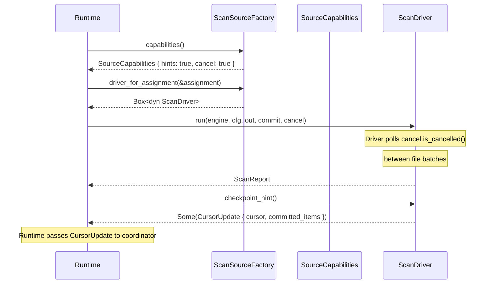

# The Contract -- ScanDriver and ScanSourceFactory Traits

*Worker 7 picks up shard `fs-0xc1`, constructs a `FilesystemScanDriver`, and calls `run()`. The scan processes 12,000 files and emits 47 findings. Midway through -- at file 6,400, a 900 KB JSON configuration blob -- the coordinator revokes the lease. Another worker has been assigned the same shard after a heartbeat timeout at second 30. The runtime calls `cancel.cancel()` on the `CancellationToken`. But the filesystem driver was written by a different team six months ago. Its `run()` method never checks `is_cancelled()`. It processes the remaining 5,600 files after the lease was revoked. The commit sink dutifully records findings for items that belong to a shard the worker no longer owns. Worker 15, the new lease holder, scans the same 12,000 files and records them again. Finding ID `0xf7a2...3c` at byte range `[42, 82)` in `/data/config/.env` now has two occurrence records with different `occurrence_id` values for the same byte range in the same file version. The deduplication layer downstream flags the conflict, but the operator sees 94 findings when there should be 47. The orchestration layer had no way to know that this particular driver ignores cancellation tokens. Without explicit capability declarations, the runtime cannot adapt its lifecycle management to each backend's actual behavior.*

---

The `ScanDriver` and `ScanSourceFactory` traits define the two sides of the execution seam. The factory translates assignments into drivers; the driver executes scans. The `SourceCapabilities` struct lets each backend declare what it actually supports, so the orchestration layer can make informed decisions rather than assuming all drivers are equal. This chapter examines each trait, the capability model, and the design rationale.

## 1. The ScanDriver Trait

The `ScanDriver` trait is the core contract. Every source-specific backend implements it. From `lib.rs`:

```rust
/// Source-specific execution backend.
pub trait ScanDriver: Send {
    fn run(
        &mut self,
        engine: Arc<scanner_engine::Engine>,
        cfg: &ScanExecutionConfig,
        out: &dyn EventOutput,
        commit: &dyn CommitSink,
        cancel: &CancellationToken,
    ) -> Result<ScanReport>;

    fn checkpoint_hint(&self) -> Option<CursorUpdate> {
        None
    }

    fn debug_output(&self) -> Option<String> {
        None
    }
}
```

The trait has three methods. `run` is the scan execution method. `checkpoint_hint` is a post-run query for cursor state. `debug_output` returns optional diagnostic information (used by the git driver to report pack-decode statistics). The trait requires `Send` (the driver may be moved to a worker thread) but not `Sync` (the driver is not shared across threads -- each scan runs on a single driver instance).

### 1.1 The `run` Method Signature

Let us examine each parameter in detail:

**`&mut self`.** The driver takes a mutable reference to itself. This allows the driver to accumulate state during the scan: the current cursor position, the running count of scanned items and bytes, error recovery metadata, internal buffer pools. The mutable reference also prevents the driver from being shared across threads -- `&mut` is an exclusive reference, so no other code can access the driver while `run` is executing. This exclusivity simplifies the driver's internal implementation: it does not need interior mutability or synchronization for its own state.

**`engine: Arc<scanner_engine::Engine>`.** The detection engine, shared via `Arc`. The engine is immutable after construction (it contains compiled regex patterns, transform configurations, anchor tables, and tuning parameters). Multiple drivers can share the same engine instance, and the runtime uses `OnceLock` to cache the default engine across scans (covered in [Section 14, Chapter 2](../14-scanner-runtime-and-worker/02-engine-construction.md)). The `Arc` wrapper means the driver holds a reference-counted handle, not an owned copy. When the driver drops, the reference count decrements; the engine is freed only when the last reference is dropped.

**`cfg: &ScanExecutionConfig`.** The execution configuration from [Chapter 1](01-the-execution-seam.md): worker count, checkpoint frequency, filesystem-specific knobs. Passed by shared reference because the driver reads but does not modify it. The driver uses `cfg.workers` to decide how many parallel scan threads to spawn, `cfg.checkpoint_every_items` to decide how frequently to yield progress updates, and `cfg.filesystem` to decide whether to skip archives, skip binary files, or emit findings to the commit sink.

**`out: &dyn EventOutput`.** The event output sink. Drivers emit findings, progress, summary, and diagnostic events through this trait object. The runtime provides different implementations depending on the context: `JsonlEventSink` for CLI JSONL output, `TextEventSink` for human-readable output, `CoordinationEventSink` for distributed mode, `NullEventOutput` for benchmarks where output overhead must be zero.

**`commit: &dyn CommitSink`.** The commit lifecycle sink, covered in detail in [Chapter 4](04-commit-lifecycle.md). Drivers call `begin_item`, `upsert_findings`, and `finish_item` for each scanned item. In CLI mode, this is a `NoOpCommitSink` that returns `Ok(())` for every call. In distributed mode, it is a `DurableCommitSink` that derives the full identity chain and persists records through the coordinator.

**`cancel: &CancellationToken`.** The cooperative cancellation token from [Chapter 1](01-the-execution-seam.md). Drivers that support cooperative cancellation check `cancel.is_cancelled()` at scheduling boundaries (between file batches, between git commits). Drivers that do not support it simply ignore the token -- the `is_cancelled()` call is a single atomic load, so even unused token checks add negligible overhead.

**Return: `Result<ScanReport>`.** On success, the aggregate scan counters (items scanned, bytes scanned, findings emitted). On failure, an `anyhow::Error` that the runtime wraps into `ScanRuntimeError::Driver`. The `anyhow::Error` type is used here rather than a structured error because driver failures are diverse and source-specific: filesystem I/O errors, git repository corruption, permission denied, disk full. The runtime does not need to dispatch on the driver error variant; it logs it, wraps it, and propagates it.

### 1.2 The `checkpoint_hint` Method

```rust
    fn checkpoint_hint(&self) -> Option<CursorUpdate> {
        None
    }
```

The default implementation returns `None`, meaning "this driver does not track cursor state." Drivers that track cursor state override this method to return the position where scanning stopped. The runtime calls this method after `run` completes to obtain the final cursor for coordinator persistence.

The method takes `&self` (not `&mut self`) because the checkpoint is a read of accumulated state, not a mutation. The `Option` return type means the orchestration layer must handle the case where no checkpoint is available -- either because the driver does not support cursors, or because the scan was interrupted before processing any items, or because the cursor is not meaningful for this source kind.

## 2. The ScanSourceFactory Trait

The factory is the bridge between assignments and drivers. From `lib.rs`:

```rust
/// Factory that maps assignments to source-specific drivers.
pub trait ScanSourceFactory: Send {
    fn driver_for_assignment(&self, assignment: &Assignment) -> Result<Box<dyn ScanDriver>>;

    fn capabilities(&self) -> SourceCapabilities;
}
```

Two methods, each serving a distinct purpose:

**`driver_for_assignment(&self, assignment: &Assignment) -> Result<Box<dyn ScanDriver>>`.** The factory inspects the assignment's `source` field to extract backend-specific parameters (filesystem root path, git repo root path), constructs the appropriate driver with those parameters, and returns it as a boxed trait object. The `Box<dyn ScanDriver>` return type means the factory decides the concrete type; the runtime only sees the trait interface. This is classical dependency inversion: the runtime depends on the trait, not on the concrete implementation.

The `Result` return allows the factory to reject malformed assignments. A filesystem factory receiving an `AssignmentSource::Git` payload is a programming error in the runtime. The factory returns an error rather than panicking, giving the runtime a chance to log the mismatch and fail gracefully.

**`capabilities(&self) -> SourceCapabilities`.** The factory declares its capabilities once, not per-assignment. This is intentional: capabilities are properties of the source family (filesystem, git), not of individual assignments. A filesystem driver either supports cooperative cancellation or it does not -- the answer does not depend on which directory is being scanned.

## 3. SourceCapabilities -- Declaring What the Driver Supports

The `SourceCapabilities` struct is a set of boolean flags that tell the orchestration layer what a driver actually implements. From `lib.rs`:

```rust
/// Coarse source capability flags.
///
/// These flags tell the orchestration layer what a driver supports so it can
/// adapt scheduling and lifecycle decisions accordingly.
#[derive(Clone, Copy, Debug, Default, PartialEq, Eq)]
pub struct SourceCapabilities {
    /// Whether the driver produces meaningful [`CursorUpdate`] values from
    /// [`ScanDriver::checkpoint_hint`].
    pub supports_checkpoint_hints: bool,
    /// Whether the driver checks the [`CancellationToken`] during execution
    /// (not just before starting) and can stop mid-scan cooperatively.
    ///
    /// Set this to `true` only if the driver's `run` method polls
    /// `cancel.is_cancelled()` at regular intervals during scanning.
    /// A pre-check before starting does not count as cooperative cancel.
    pub supports_cooperative_cancel: bool,
}
```

Two flags, each documented with precise semantics:

**`supports_checkpoint_hints: bool`.** When `true`, the driver's `checkpoint_hint()` method returns meaningful cursor positions that can be persisted by the coordinator for scan resumption. When `false`, the runtime skips the checkpoint and relies on the coordinator to re-issue the full shard on retry. A driver that returns `None` from `checkpoint_hint` but declares `supports_checkpoint_hints: true` is violating the contract -- the capability flag is a promise, not a description of current state.

**`supports_cooperative_cancel: bool`.** When `true`, the driver polls `cancel.is_cancelled()` at regular intervals during `run()`. The doc comment is explicit about the semantics: "A pre-check before starting does not count as cooperative cancel." A driver that checks `is_cancelled()` once at the top of `run()` and then processes all items without further checks is not cooperative -- it can only cancel before starting, not mid-scan. The flag must be `true` only when the driver checks at regular intervals (between file batches, between commits, every N items).

This distinction matters for lease management. If a driver supports cooperative cancel, the runtime can revoke a lease and expect the driver to stop within a bounded time (the interval between cancellation checks). If it does not, the runtime must wait for the driver to finish the entire scan before the lease can be safely reassigned. The runtime uses this information to set timeouts, manage lease renewals, and decide whether to signal cancellation at all.

The struct derives `Default`, which sets both flags to `false`. This is the conservative default: a new driver that does not override capabilities is assumed to support neither checkpoints nor cooperative cancellation. The orchestration layer treats such drivers as black boxes that must run to completion. This conservative default prevents the duplicate-alert scenario from the opening: the runtime knows that a driver with default capabilities ignores cancellation, so it does not attempt mid-scan lease revocation.

## 4. The ItemMeta Type

Drivers provide metadata for each item they scan. From `lib.rs`:

```rust
/// Per-item metadata passed to [`CommitSink::begin_item`].
///
/// Carries connector-provided identity and optional context that the sink may
/// use when persisting identity chains (for example a version ID from a
/// versioned object store).
#[derive(Clone, Debug, PartialEq, Eq)]
pub struct ItemMeta {
    pub stable_item_id: StableItemId,
    pub version: Option<VersionId>,
    pub size_hint: Option<u64>,
}
```

**`stable_item_id: StableItemId`.** The connector-assigned stable identity for the scanned item. This must be computed by the source connector and trusted by downstream persistence code; the runtime must not re-derive it from ad hoc tags or raw item keys. The `DurableCommitSink` (covered in [Section 14, Chapter 3](../14-scanner-runtime-and-worker/03-event-and-commit-sinks.md)) uses this identity when constructing the `ItemIdentityKey` for the identity chain.

**`version: Option<VersionId>`.** The connector-provided version identifier for this item. For filesystem scans, this is typically `None` -- regular files do not have intrinsic version identifiers. For git scans, it would be derived from the commit OID or the blob hash. The `DurableCommitSink` uses this version ID to compute the `ObjectVersionId` in the identity chain. When `None`, the sink falls back to deriving the version ID from the item key bytes -- a deterministic but less semantically meaningful fallback.

**`size_hint: Option<u64>`.** An optional size estimate for the item in bytes. This is a hint for progress tracking and budget accounting, not a guarantee. The commit sink includes it in the `Begin` progress record. The orchestration layer may use it to estimate completion time.

The struct derives `Clone`, `Debug`, `PartialEq`, and `Eq` but not `Default` -- the `stable_item_id` field has no meaningful default value, so callers must always provide it explicitly.

## 5. The Trait Interaction Pattern

The following diagram shows how the traits interact at runtime:



The runtime queries capabilities before (or at the same time as) constructing the driver. Based on the capability flags, the runtime makes three decisions:

1. **Cancellation strategy.** If `supports_cooperative_cancel` is `true`, the runtime registers a signal handler (or a lease-revocation callback) that calls `cancel.cancel()`. If `false`, the runtime does not signal cancellation and instead waits for the scan to complete naturally.

2. **Checkpoint handling.** If `supports_checkpoint_hints` is `true`, the runtime passes the `checkpoint_hint()` result to the coordinator after `run` completes. If `false`, the runtime skips the checkpoint call.

3. **Timeout policy.** If the driver does not support cooperative cancel, the runtime may need to enforce a hard timeout (process kill) as a last resort. Drivers that support cooperative cancel can be given softer timeouts (cancel signal, then wait for graceful stop).

## 6. Why Traits, Not Enums

An alternative design would use a single enum with one variant per source kind (e.g., `enum ScanDriverImpl { Filesystem(FsScanDriver), Git(GitScanDriver) }`), avoiding trait objects and dynamic dispatch entirely. The trait-based design was chosen for two reasons.

First, extensibility without modification. Adding a new source kind (e.g., S3 object scanning, Kafka topic scanning) requires implementing `ScanDriver` and `ScanSourceFactory` in a new crate. The scan-driver crate itself does not change. No new enum variant is added to a central definition. No match arms are updated in dispatch functions. With an enum, every new source kind would require modifying the `gossip-scan-driver` crate, the dispatch function, and every match expression that handles the enum. The trait approach follows the Open-Closed Principle: the interface is open for extension (new implementations) but closed for modification (the trait definition is stable).

Second, testability. Test harnesses can implement `ScanDriver` with arbitrary behavior: a driver that always fails after N items, a driver that takes 10 seconds to complete, a driver that emits exactly K findings with predetermined byte ranges and norm hashes. Trait objects make this trivial -- any struct that implements the two-method trait can serve as a test double. Enum variants with embedded behavior would require either test-only variants in the production enum (polluting the production type) or complex mocking infrastructure.

The cost of trait objects is dynamic dispatch: one indirect function call per method invocation. For `run()`, which is called once per assignment (not once per file or per byte), the cost is a single indirect jump -- negligible compared to the minutes of wall-clock time the scan takes. The hot path is inside the driver's implementation (the engine's regex matching, the filesystem I/O, the git object iteration), not at the trait boundary.

## What's Next

[Chapter 4](04-commit-lifecycle.md) examines the `CommitSink` protocol: the `begin_item` / `upsert_findings` / `finish_item` lifecycle, the `FindingRecord` and `FindingsBatch` types, the `NoOpCommitSink` used in CLI mode, and the two-channel architecture that separates telemetry from persistence.
