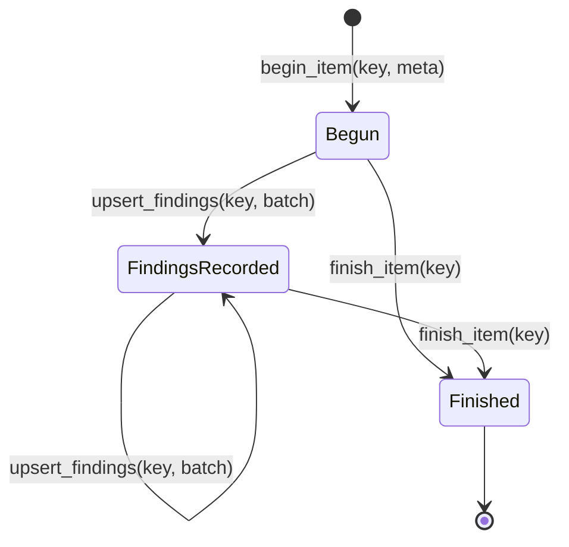
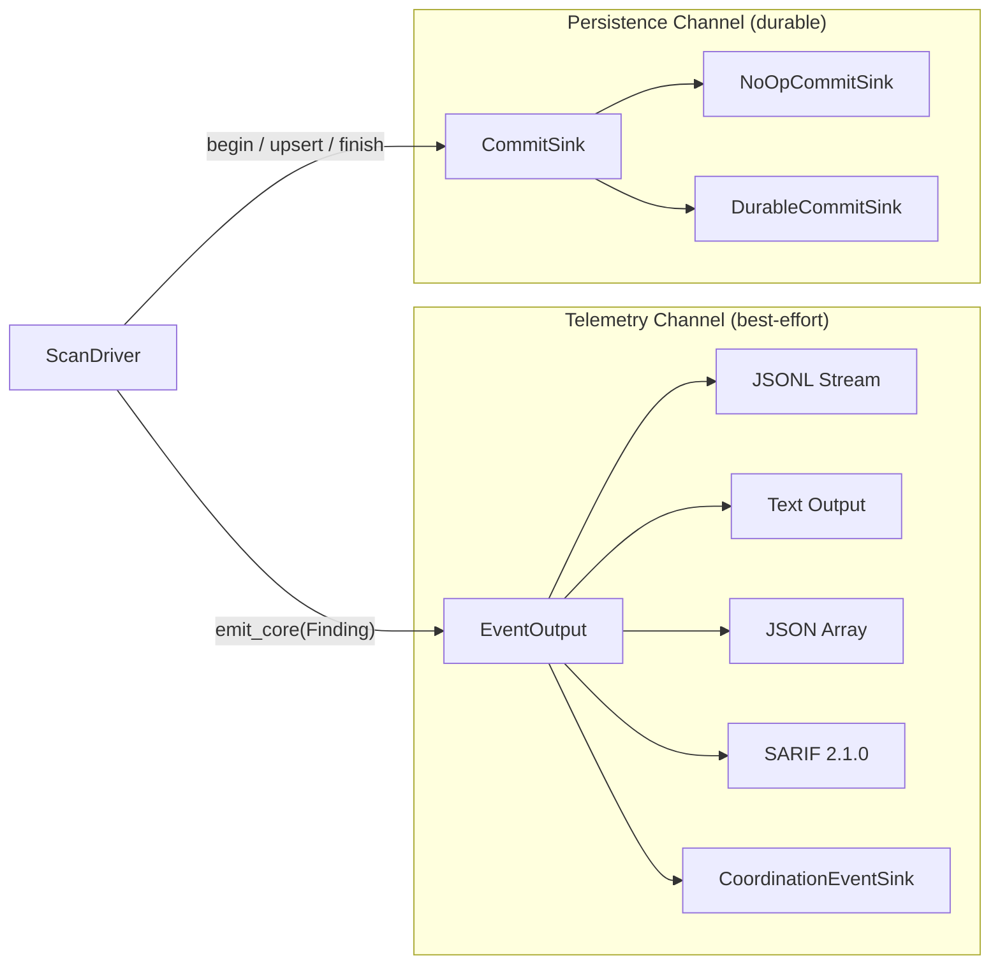

# The Commit Protocol -- Finding Persistence at the Driver Boundary

*Worker 4 scans shard `fs-0xd2` and discovers a leaked AWS access key in `/data/repos/acme/config/.env` at byte range `[42, 82)`. The engine produces a `FindingRecord` with `norm_hash = 0xa3f7...c1`, `rule_id = 9`, and `confidence_score = 8`. The driver emits a finding event through the `EventOutput` sink. The JSONL stream carries `{"path":"/data/repos/acme/config/.env","rule_name":"aws-access-key","start":42,"end":82,"source":"fs","confidence_score":8}`. The operator sees the line in the live feed. Good -- the finding is visible. But the downstream deduplication service queries the finding store for shard `fs-0xd2`. The store returns zero records. The event sink is a telemetry channel: it streams data in real time, but it does not persist identities. The finding was observed in the log stream but never committed to the identity graph. It cannot be deduplicated against previous scans. It cannot be linked to a key rotation event. It cannot be audited. Without the commit protocol to derive `norm_hash` to `secret_hash` to `finding_id` to `occurrence_id`, the finding exists as an ephemeral event that vanishes when the stream closes.*

---

The `CommitSink` trait is the persistence boundary. While `EventOutput` streams findings as telemetry, `CommitSink` records them durably with stable identities. The two channels serve different consumers with different requirements: events go to operators and monitoring systems that need real-time visibility; commits go to the finding store and the identity chain that need deterministic deduplication and audit trails. This chapter examines the commit protocol, the types that flow through it, and the no-op implementation used when persistence is not needed.

## 1. The CommitSink Trait

The trait defines a three-phase protocol for each scanned item. From `lib.rs`:

```rust
/// Per-item commit lifecycle sink.
pub trait CommitSink: Send + Sync {
    fn begin_item(&self, item_key: &ItemKey, meta: &ItemMeta) -> Result<()>;
    fn upsert_findings(&self, item_key: &ItemKey, batch: &FindingsBatch) -> Result<()>;
    fn finish_item(&self, item_key: &ItemKey) -> Result<()>;
}
```

Three methods, called in order for each item the driver processes:

**`begin_item(&self, item_key: &ItemKey, meta: &ItemMeta) -> Result<()>`.** Opens a commit transaction for one item. The `ItemKey` identifies the item -- for filesystem scans, this is the file path as bytes; for git scans, it is a blob identifier. The `ItemMeta` carries optional version and size metadata (covered in [Chapter 3](03-driver-and-factory-traits.md)). The implementation records that this item is now being processed and stores the metadata for use by subsequent `upsert_findings` calls.

**`upsert_findings(&self, item_key: &ItemKey, batch: &FindingsBatch) -> Result<()>`.** Records findings discovered in this item. The `FindingsBatch` contains zero or more `FindingRecord` values. The method is named "upsert" because the same item may be scanned multiple times across different shard ranges or retries; the implementation must handle repeated submissions for the same item key without creating conflicting duplicates. In practice, the identity chain derivation produces deterministic IDs, so repeated submissions produce the same records.

**`finish_item(&self, item_key: &ItemKey) -> Result<()>`.** Closes the commit transaction. The implementation records that this item has been fully processed and removes any in-flight metadata. Items that receive a `begin_item` but no `finish_item` are considered incomplete -- they may have been interrupted mid-scan by a cancellation or a crash.

The trait bound `Send + Sync` is required because drivers may call commit methods from multiple worker threads during parallel scanning. The `&self` receiver (not `&mut self`) requires implementations to use interior mutability (typically `Mutex` or atomic operations) for any shared state. This design allows a single commit sink instance to serve all worker threads without external synchronization by the caller.

## 2. The Protocol as a State Machine

Each item follows a strict lifecycle:



A driver calls `begin_item` once, then zero or more `upsert_findings` calls (one per finding batch -- an item with no findings calls `upsert_findings` zero times), then `finish_item` once. The protocol does not enforce this ordering at the trait level -- it is a contract that implementations assume callers honor.

The `DurableCommitSink` in the distributed runtime (covered in [Section 14, Chapter 3](../14-scanner-runtime-and-worker/03-event-and-commit-sinks.md)) enforces this protocol strictly: calling `upsert_findings` without a prior `begin_item` returns an error. The sink's `metadata_for_item` lookup fails when no metadata has been registered for the item key, preventing the runtime from fabricating stable identity or version metadata. A test in `commit_sink.rs` (`upsert_without_begin_item_is_rejected`) explicitly exercises this violation path and asserts that the call fails and no identity records are produced.

## 3. FindingRecord -- One Detection Match

The `FindingRecord` is the minimal data a driver provides for each finding. From `lib.rs`:

```rust
/// Finding record used by commit sinks.
#[derive(Clone, Copy, Debug, PartialEq, Eq)]
pub struct FindingRecord {
    pub rule_id: u32,
    pub start: u64,
    pub end: u64,
    pub norm_hash: [u8; 32],
    pub confidence_score: i8,
}
```

Let us examine each field:

**`rule_id: u32`.** The numeric identifier of the rule that matched. The scanner engine assigns sequential IDs to rules at construction time. Rule ID 0 is the first rule in the rule set, rule ID 1 is the second, and so on. The commit sink maps this numeric ID to a `RuleFingerprint` (a 32-byte value) for identity derivation. The mapping places the rule ID in the first 4 bytes of the fingerprint and zeros the remaining 28 bytes -- a deterministic, reversible transformation.

**`start: u64` and `end: u64`.** The byte range `[start, end)` within the item where the match was found. These offsets are item-relative: `start = 0` is the first byte of the scanned content, regardless of the file's position on disk or the blob's offset in the git pack file. The half-open interval convention (start inclusive, end exclusive) matches the range conventions used throughout the codebase, including the shard spec's key ranges from the B2 Coordination section.

**`norm_hash: [u8; 32]`.** The normalized hash of the detected secret value. This is the starting point of the identity chain described in the B1 Identity section. The engine computes this hash by normalizing the matched bytes (stripping leading/trailing whitespace, lowercasing where appropriate for the rule's normalization policy) and hashing the result with a cryptographic hash function. Two scans of the same secret in the same file will produce the same `norm_hash`, enabling stable deduplication across scan runs. The `norm_hash` is the foundation on which all subsequent identity values (`secret_hash`, `finding_id`, `occurrence_id`) are built.

**`confidence_score: i8`.** An additive confidence score from gate signals (Phase 1 range: 0–10). Does **not** participate in dedup — two findings at the same span with different scores still deduplicate normally. The commit sink persists this score so that downstream consumers can filter findings by confidence threshold: a security team might investigate only findings with `confidence_score >= 5`, while an audit trail retains all findings regardless of score.

The struct is `Copy` because it contains only fixed-size scalar fields: three integers and a 32-byte array. No heap allocations, no pointers, no lifetime parameters. Finding records can be passed by value through the commit protocol, stored in arrays, and copied between threads without cloning overhead. This is important for the hot path: a single item may produce dozens of finding records, and each one flows through the commit protocol.

## 4. FindingsBatch -- Multiple Findings Per Item

Findings are grouped into batches per item:

```rust
/// Batch of findings for one item.
#[derive(Clone, Debug, Default, PartialEq, Eq)]
pub struct FindingsBatch {
    pub findings: Vec<FindingRecord>,
}
```

A single `Vec` of finding records. The `Default` implementation creates an empty batch (an item with no findings). The batch is passed to `upsert_findings` by reference (`&FindingsBatch`), so the commit sink can iterate over findings without taking ownership.

The batch design serves two purposes. First, it amortizes the overhead of method calls and lock acquisitions. A file with 15 findings calls `upsert_findings` once with a batch of 15 records, not 15 times with one record each. The `DurableCommitSink` acquires its metadata lock once, retrieves the item metadata, and then derives all 15 identity records in a single pass. Second, the batch gives the commit sink a complete view of all findings for one item in one call, enabling potential batch optimizations in the persistence layer (bulk inserts, batched hash computations).

## 5. NoOpCommitSink -- The CLI Path

CLI mode does not need durable persistence. Findings are streamed through the event output and printed to stdout; there is no coordinator, no identity chain, no finding store. The crate provides a no-op implementation that satisfies the trait contract without performing any work:

```rust
/// No-op sink used by CLI mode.
#[derive(Clone, Copy, Debug, Default)]
pub struct NoOpCommitSink;

impl CommitSink for NoOpCommitSink {
    fn begin_item(&self, _item_key: &ItemKey, _meta: &ItemMeta) -> Result<()> {
        Ok(())
    }

    fn upsert_findings(&self, _item_key: &ItemKey, _batch: &FindingsBatch) -> Result<()> {
        Ok(())
    }

    fn finish_item(&self, _item_key: &ItemKey) -> Result<()> {
        Ok(())
    }
}
```

Every method returns `Ok(())`. The underscore-prefixed parameters document the interface without creating dead-code warnings. The struct is `Copy` and zero-sized (no fields, no data), so passing it as `&dyn CommitSink` adds no heap allocation beyond the vtable pointer. The `NoOpCommitSink` is a zero-cost abstraction in the literal sense: the compiler can inline the method bodies and eliminate the calls entirely when the concrete type is known at compile time.

The scanner runtime in `gossip-scanner-runtime/src/commit_sink.rs` re-exports this type under a more descriptive name:

```rust
pub use gossip_scan_driver::NoOpCommitSink as CliNoOpCommitSink;
```

The re-export as `CliNoOpCommitSink` makes the intent explicit at the call site: this is the commit sink for CLI mode. The name clarifies that the no-op behavior is deliberate, not an oversight.

## 6. The Two-Channel Architecture

The scan-driver boundary defines two parallel output channels that serve different consumers with different durability guarantees:



**The telemetry channel** (`EventOutput`) streams findings, progress updates, summary records, and diagnostics. It is fire-and-forget: events are emitted and not retried. If the output pipe is broken (the downstream consumer closes the connection), the write is silently discarded. If the coordinator's event recorder fails, the error is ignored (`let _ =`). Consumers include CLI formatters (JSONL, text, JSON, SARIF), monitoring dashboards, and coordination recorders that persist events as best-effort telemetry.

**The persistence channel** (`CommitSink`) records findings with durable identity. Each finding goes through the full identity chain derivation: `norm_hash` to `secret_hash` to `finding_id` to `occurrence_id`. The derived identities enable deduplication (same `finding_id` across scans means same finding), change tracking (different `occurrence_id` for different file versions), and audit trails (the complete chain from raw match to final identity is preserved). Consumers include the coordinator's finding store and downstream reporting services. Unlike the telemetry channel, errors in the persistence channel propagate to the caller -- a failure to persist an identity record is a failure of the scan, not a degradation of telemetry.

The two channels are intentionally independent. A failure in the event sink does not affect the commit sink, and vice versa. This independence is critical for distributed mode: if the event recorder fails (best-effort telemetry), findings are still persisted through the commit sink (durable commitment). Conversely, if the commit sink fails (the finding store is unreachable), the event stream still delivers real-time visibility to operators. The channels can fail independently because they serve independent consumers with independent reliability requirements.

## 7. The Complete Type Surface

The scan-driver crate defines exactly these types at its public boundary:

| Type | Kind | Size | Purpose |
|------|------|------|---------|
| `CancellationToken` | Struct | `Arc<AtomicBool>` | Cooperative shutdown signal |
| `ConnectorKind` | Enum | 1 byte | Source family tag |
| `AssignmentSource` | Enum | Heap (PathBuf/String) | Source-specific payload |
| `Assignment` | Struct | Heap (multiple Strings) | Complete work unit |
| `FilesystemExecutionConfig` | Struct | 3 bytes (3 bools) | FS-specific runtime knobs |
| `ScanExecutionConfig` | Struct | >60 bytes (contains `usize` + `u64` + nested config structs) | Shared runtime knobs |
| `GitDebugLevel` | Enum | 1 byte | Git diagnostic output verbosity |
| `GitExecutionConfig` | Struct | >40 bytes (u64 + enums + bools + Options) | Git-specific runtime knobs |
| `ScanReport` | Struct | 112 bytes (13 x u64 + 1 x bool + padding) | Post-scan aggregate counters |
| `CursorUpdate` | Struct | Heap (Cursor) + u64 | Checkpoint metadata |
| `SourceCapabilities` | Struct | 2 bytes (2 bools) | Backend capability flags |
| `ItemMeta` | Struct | ~17 bytes | Per-item metadata |
| `FindingRecord` | Struct | 53 bytes | One detection match |
| `FindingsBatch` | Struct | Heap (Vec) | Batch of findings for one item |
| `NoOpCommitSink` | Struct | 0 bytes (ZST) | CLI-mode no-op implementation |
| `CommitSink` | Trait | N/A | Per-item persistence lifecycle |
| `ScanDriver` | Trait | N/A | Source-specific execution backend |
| `ScanSourceFactory` | Trait | N/A | Assignment-to-driver translation |

532 lines. Three traits. Fifteen concrete types. This is the entire interface between runtime orchestration and source-specific scanning. Every type exists to prevent a specific failure mode: divergent runtimes (`ScanDriver` + `ScanSourceFactory` enforce one execution path), ambiguous work descriptions (`Assignment` + `ConnectorKind` make the source family explicit), unchecked cancellation (`CancellationToken` + `SourceCapabilities` declare cooperative behavior), silent finding loss (`CommitSink` + `FindingRecord` persist findings with stable identities), and untracked progress (`CursorUpdate` + `ScanReport` carry checkpoint and accounting data).

## What's Next

[Section 14](../14-scanner-runtime-and-worker/01-runtime-architecture.md) moves from the interface seam to the orchestration layer: how `gossip-scanner-runtime` wires configuration into assignments, constructs the scanner engine, selects event sinks, and dispatches scans through the driver boundary defined in this section.
