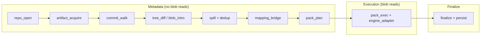

# The Eight-Stage Pipeline -- Git Scanning Architecture

*A scanner processes a monorepo with 4.2 million objects across 47 pack files. It resolves `refs/heads/main` to commit `a3f9e01`, loads the watermark `7bc4d82` from the previous run, and begins the incremental walk. Halfway through tree diffing at depth 14, a concurrent `git gc` rewrites `pack-abc123.pack`. The scanner's MIDX maps offset `0x1A3F00` to blob `e7d9112`, but that offset now points into a different object -- a tree node from an unrelated commit. Without detection, the scanner inflates garbage bytes, feeds them to the detection engine, and persists a finding against a blob that never contained a secret. The watermark advances past the real `e7d9112`, which is never scanned again. This is the concurrent maintenance problem.*

---

Git repositories are not databases. They are append-mostly object stores with content-addressed deduplication, delta compression, and no transactional guarantees for concurrent readers. A scanner that treats a Git repository as a simple file tree misses the fundamental challenge: the data it needs (blob content) is buried inside packfiles, compressed with zlib, and potentially encoded as delta chains that reference other objects at specific byte offsets within those packfiles. Any of these offsets can become invalid between the moment a scan plan is built and the moment bytes are read.

The `scanner-git` crate addresses this with an eight-stage pipeline that separates metadata planning from byte-level execution, validates artifact stability at two checkpoints, and enforces explicit limits at every stage.

## 1. The Module Map

The pipeline spans 107 source files organized by stage. From `lib.rs`, the re-exports are grouped by pipeline phase:

```rust
// ── Stage 1: Repo open & artifact acquisition ──────────────────────────
pub use artifact_acquire::{
    acquire_commit_graph, acquire_commit_graph_with_identities, acquire_midx, ArtifactAcquireError,
    ArtifactBuildLimits, MidxAcquireResult,
};
pub use repo_open::{
    repo_open, RefWatermarkStore, RepoArtifactFingerprint, RepoArtifactMmaps, RepoArtifactPaths,
    RepoJobState, StartSetRef, StartSetResolver,
};
// ... (additional re-exports: limits, midx, object_id, preflight, repo, start_set)

// ── Stage 2: Commit loading & graph construction ────────────────────────
pub use commit_graph_mem::CommitGraphMem;
pub use commit_walk::{
    introduced_by_plan, topo_order_positions, CommitGraph, CommitPlanIter, ParentScratch,
    PlannedCommit,
};
// ... (additional re-exports: commit_graph, commit_loader, commit_parse, identity_intern)

// ── Stage 3: Tree diff & candidate extraction ───────────────────────────
pub use tree_diff::{TreeDiffStats, TreeDiffWalker};
pub use tree_entry::{EntryKind, TreeEntry, TreeEntryIter};
// ... (additional re-exports: blob_introducer, object_store, path_policy, tree_candidate, unique_blob)

// ── Stage 4: Spill, dedup & mapping ─────────────────────────────────────
pub use spiller::{SpillStats, Spiller};
pub use spill_merge::{merge_all, RunMerger};
pub use mapping_bridge::{MappingBridge, MappingBridgeConfig, MappingStats};
// ... (additional re-exports: oid_index, seen_store, spill_chunk, spill_limits)

// ── Stage 5: Pack planning & execution ──────────────────────────────────
pub use pack_plan::{build_pack_plans, OidResolver, PackPlanConfig, PackPlanError, PackView};
pub use pack_exec::{
    execute_pack_plan, PackExecError, PackExecReport, PackObjectSink, SkipReason,
};
// ... (additional re-exports: pack_cache, pack_candidates, pack_decode, pack_delta, pack_idx, pack_io, pack_plan_model, pack_reader)

// ── Stage 6: Engine scanning ────────────────────────────────────────────
pub use engine_adapter::{
    scan_blob_chunked, EngineAdapter, EngineAdapterConfig, EngineAdapterError,
};
// ... (additional re-exports: events)

// ── Stage 7: Finalize & persist ─────────────────────────────────────────
pub use finalize::{
    build_finalize_ops, FinalizeInput, FinalizeOutcome, FinalizeOutput, FinalizeStats,
    WriteOp,
};
pub use persist::{persist_finalize_output, PersistenceStore};
// ... (additional re-exports: snapshot_plan, watermark_keys)
```

Each stage boundary is a re-export group. Callers depend on stable boundaries, not individual internal modules.

## 2. The Eight-Stage Pipeline

The pipeline overview from the crate documentation establishes the execution sequence:

```rust
//! Pipeline overview:
//! 1. `repo_open` resolves repo paths, detects object format, and loads start set state.
//! 2. `commit_walk` builds the commit plan.
//! 3. `tree_diff` extracts candidate blobs and paths.
//! 4. `spiller` dedupes and filters candidates against the seen store.
//! 5. `mapping_bridge` maps unique blobs to pack/loose candidates.
//! 6. `pack_plan` builds per-pack decode plans from pack candidates.
//! 7. `pack_exec` decodes blobs and streams bytes into `engine_adapter`.
//! 8. `finalize` builds persistence ops, and `persist` commits them atomically.
```



The division between metadata and execution stages is an invariant, not a convention:

```rust
//! # Invariants
//! - Metadata stages (repo open through pack planning) do not read blob payloads.
//! - Pack execution and engine adaptation read and scan blob bytes with explicit limits.
//! - File reads are bounded by explicit limits.
```

This separation means the scanner can build a complete decode plan -- knowing exactly which pack offsets to read and in what order -- before touching a single blob byte. Planning is cheap; decoding is expensive. If the plan reveals that all candidate blobs were already seen in a previous run, the scanner skips execution entirely.

## 3. Two Scan Modes

The scanner supports two fundamentally different approaches to discovering candidate blobs. The mode enum from `runner.rs`:

```rust
/// Git scan execution mode.
#[derive(Clone, Copy, Debug, Default, PartialEq, Eq)]
pub enum GitScanMode {
    /// Current diff-history pipeline (tree diff + spill + mapping + pack plan).
    DiffHistory,
    /// ODB-blob fast path (unique-blob walk + pack-order scan).
    #[default]
    OdbBlobFast,
}
```

**DiffHistory** walks commits in topological order, diffs each commit's tree against its parent tree(s), and extracts candidate blobs with full attribution context (which commit introduced each blob, under which path, with which change kind). This mode uses stages 3 through 7 in sequence: tree diff produces candidates, the spiller deduplicates them, the mapping bridge resolves them to pack offsets, and pack planning builds per-pack decode schedules.

**OdbBlobFast** takes a different approach. It walks the commit graph to discover every unique blob reachable from the start set, using seen-set bitmaps keyed by MIDX index to ensure each blob is visited exactly once. Instead of per-commit tree diffs, it traverses trees in topological commit order and emits each blob the first time it appears. This mode skips the spill/mapping pipeline in the common case and generates pack candidates directly from MIDX lookups. The trade-off: blob attribution context (commit, path, flags) is race-winner-based in parallel mode and not guaranteed deterministic across worker counts.

The dispatcher in `run_git_scan` selects between them:

```rust
    let mut output = match config.scan_mode {
        GitScanMode::OdbBlobFast => super::runner_odb_blob::run_odb_blob(
            &repo,
            std::sync::Arc::clone(&engine),
            seen_store,
            &cg_index,
            &plan,
            config,
            mk_commit_meta(),
        )?,
        GitScanMode::DiffHistory => super::runner_diff_history::run_diff_history(
            &repo,
            std::sync::Arc::clone(&engine),
            seen_store,
            &cg,
            &plan,
            config,
            mk_commit_meta(),
        )?,
    };
```

## 4. Why Git Needs Special Treatment

### 4.1 Packfiles and Delta Chains

Git stores most objects in packfiles -- binary files containing zlib-compressed objects, many of which are delta-encoded against other objects in the same pack. A blob at offset `0x1A3F00` might be an OFS_DELTA whose base lives at offset `0x0F2100`, which itself might be another delta. Resolving a single blob can require inflating and applying a chain of deltas 10, 20, or 64 levels deep.

The `PackPlanConfig` controls this traversal:

```rust
/// Config for pack planning.
///
/// `max_delta_depth` counts delta edges from a candidate to its base.
/// A depth of 0 disables base expansion entirely.
#[derive(Clone, Copy, Debug)]
pub struct PackPlanConfig {
    /// Maximum delta chain depth to traverse (0 disables base expansion).
    pub max_delta_depth: u8,
    /// Safety bound for header parsing.
    pub max_header_bytes: usize,
    /// Maximum number of unique offsets tracked during planning.
    pub max_worklist_entries: usize,
    /// Maximum REF base lookups during planning.
    pub max_base_lookups: usize,
}
```

### 4.2 The Multi-Pack Index (MIDX)

A monorepo with 47 pack files contains objects distributed across all of them. Without an index, finding which pack contains a given OID requires scanning every `.idx` file. The MIDX provides a unified lookup: given an OID, it returns the pack ID and byte offset in O(log N) time.

The scanner always builds the MIDX in memory from `.idx` files via k-way merge. It does not trust on-disk MIDX files that may have been built by a different Git version or may be stale.

### 4.3 Concurrent Maintenance

Git maintenance operations (`git gc`, `git repack`) can rewrite packfiles while a scan is in progress. The scanner detects this with artifact fingerprints:

```rust
/// Fingerprint for artifact change detection.
///
/// Uses hashes of pack/idx metadata (basename, size, mtime) to detect
/// changes without re-reading artifact files.
#[derive(Clone, Debug, PartialEq, Eq)]
pub struct RepoArtifactFingerprint {
    /// Hash of `(pack_basename, size, mtime)` for all pack files.
    pub packs_hash: [u8; 32],
    /// Hash of `(idx_basename, size, mtime)` for all idx files.
    pub idx_hash: [u8; 32],
}
```

The check happens twice: once immediately after MIDX acquisition (before expensive traversal), and once after mode execution (before persisting results). If the fingerprint changes, the scanner returns `ConcurrentMaintenance` and the caller retries:

```rust
    // Post-execution artifact stability check.
    if !repo.artifacts_unchanged()? {
        return Err(GitScanError::ConcurrentMaintenance);
    }
```

## 5. The Error Taxonomy

Errors are organized by pipeline stage. Early stages fail fast; later stages produce partial output before failing. From `runner.rs`:

```rust
/// Git scan error taxonomy.
#[derive(Debug, thiserror::Error)]
pub enum GitScanError {
    /// Repo open phase failed (bad metadata, missing refs, etc.).
    #[error("{0}")]
    RepoOpen(#[from] RepoOpenError),
    /// Commit plan construction failed.
    #[error("{0}")]
    CommitPlan(#[from] CommitPlanError),
    /// Tree diff walker encountered an error.
    #[error("{0}")]
    TreeDiff(#[from] TreeDiffError),
    /// Spill/dedupe pipeline error (I/O failure on spill files).
    #[error("{0}")]
    Spill(#[from] SpillError),
    /// MIDX parsing or validation error (corrupt header, missing packs).
    #[error("{0}")]
    Midx(#[from] MidxError),
    /// Pack plan construction error (out-of-range pack IDs, corrupt headers).
    #[error("{0}")]
    PackPlan(#[from] PackPlanError),
    /// Fatal pack execution error (decode failure that aborted a plan).
    #[error("{0}")]
    PackExec(#[from] PackExecError),
    /// Pack I/O error during loose object or cross-pack base resolution.
    #[error("{0}")]
    PackIo(#[from] PackIoError),
    /// Persistence store write failed.
    #[error("{0}")]
    Persist(#[from] PersistError),
    /// Underlying I/O error not covered by a more specific variant.
    #[error("{0}")]
    Io(#[from] io::Error),
    /// Resource limit exceeded (pack mmap counts or cumulative bytes).
    #[error("resource limit exceeded: {0}")]
    ResourceLimit(String),
    /// Scan mode not yet implemented.
    #[error("scan mode not implemented: {0}")]
    UnsupportedMode(GitScanMode),
    /// In-memory artifact construction failed (MIDX or commit-graph build).
    #[error("artifact acquisition failed: {0}")]
    ArtifactAcquire(#[from] ArtifactAcquireError),
    /// Pack files or indices changed during the scan — a concurrent `git gc`
    /// or `git repack` invalidated the planned offsets. Callers should retry.
    #[error("concurrent git maintenance detected; artifacts changed during scan")]
    ConcurrentMaintenance,
}
```

`ConcurrentMaintenance` is a special sentinel. It is not a bug in the scanner or corruption in the repository -- it means another process modified pack files while the scan was in flight. Callers treat it as a retriable condition.

## 6. Configuration and Limits

Every stage has explicit limits. The top-level configuration from `runner.rs`:

```rust
#[derive(Clone, Debug)]
pub struct GitScanConfig {
    /// Scan mode selection (diff-history vs ODB-blob fast path).
    pub scan_mode: GitScanMode,
    /// Stable repository identifier used to namespace persisted keys.
    pub repo_id: u64,
    /// Stable policy hash that identifies the scan configuration.
    pub policy_hash: [u8; 32],
    /// Start set selection (default branch, explicit refs, etc.).
    pub start_set: StartSetConfig,
    /// Merge diff strategy for merge commits.
    pub merge_diff_mode: MergeDiffMode,
    /// Repo-open limits (mmap sizes, ref caps, etc.).
    pub repo_open: RepoOpenLimits,
    /// Commit-walk limits (parents, batching).
    pub commit_walk: CommitWalkLimits,
    /// Tree-diff limits (depth, byte budgets, candidate caps).
    pub tree_diff: TreeDiffLimits,
    /// Spill/dedupe limits (chunk sizes, run caps, seen batching).
    pub spill: SpillLimits,
    /// Mapping bridge limits (arena sizes, candidate caps).
    pub mapping: MappingBridgeConfig,
    /// Pack planning configuration (cluster sizing, delta bounds).
    pub pack_plan: PackPlanConfig,
    /// Pack decode limits (inflate and object size caps).
    pub pack_decode: PackDecodeLimits,
    /// Pack IO limits (loose object caps, base resolution).
    pub pack_io: PackIoLimits,
    /// Engine adapter configuration (chunk sizes and overlap).
    pub engine_adapter: EngineAdapterConfig,
    /// Pack mmap limits during pack execution (count + total bytes).
    pub pack_mmap: PackMmapLimits,
    /// Pack cache size in bytes (must fit in `u32`).
    pub pack_cache_bytes: usize,
    /// Total pack-exec worker threads.
    pub pack_exec_workers: usize,
    /// Number of threads for parallel blob introduction (Stage 1).
    pub blob_intro_workers: usize,
    /// Pin worker threads to CPU cores (Linux only, no-op elsewhere).
    pub pin_threads: bool,
    /// Optional spill directory override. When `None`, a unique temp directory is used.
    pub spill_dir: Option<PathBuf>,
    /// Limits for in-memory artifact construction.
    pub artifact_build: ArtifactBuildLimits,
    /// When true, extract author/committer identity data and emit
    /// identity_dictionary + enriched commit_meta events.
    /// Default: false. Zero overhead when disabled.
    pub enrich_identities: bool,
}
```

Every numeric field has a documented default, a validation function, and a maximum that prevents resource exhaustion. The scanner rejects invalid configurations at construction time via `validate()` methods, not at runtime when work is already in progress.

## Summary / What's Next

This chapter established the eight-stage pipeline, the two scan modes, and the fundamental challenges of scanning Git repositories at scale. The pipeline separates metadata planning from byte-level execution, validates artifact stability at two checkpoints, and enforces explicit limits throughout.

[Chapter 2](02-repository-discovery.md) begins the pipeline journey at Stage 1: how `repo_open` discovers repository layouts, resolves start set refs, and loads watermarks for incremental scanning.
