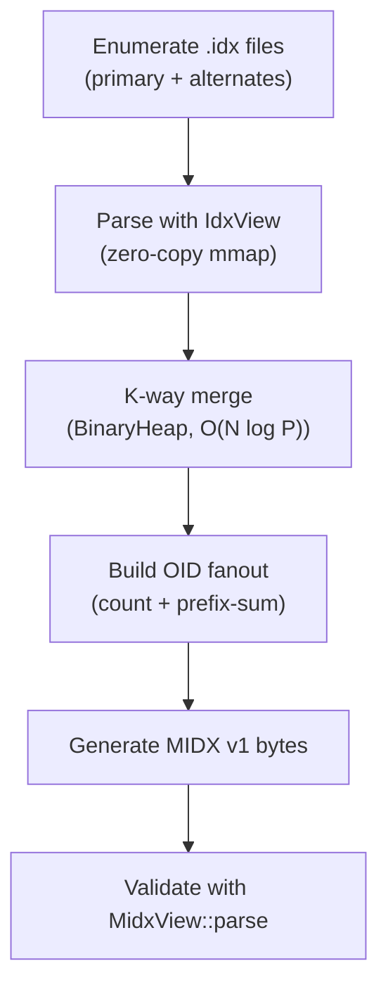

# Building the Map -- In-Memory Artifact Construction

*A repository contains 47 pack files with 4.2 million objects. The on-disk `multi-pack-index` was last rebuilt three days ago; since then, `git push` has added two new pack files containing 12,000 objects. The on-disk MIDX does not know about these packs. A scan that trusts the stale MIDX misses 12,000 objects -- including blob `f9a3e12` at offset `0x2E100` in `pack-new1.idx`, which contains a leaked API key committed 18 minutes ago. The commit-graph file is similarly stale: it does not include the 47 new commits on `feature/payments`. The scanner walks the commit graph, skips those 47 commits because they have no graph entries, and advances the watermark past them. The leak persists undetected. This is the stale artifact problem.*

---

Stage 2 of the pipeline constructs two critical data structures entirely in memory: the Multi-Pack Index (MIDX) and the commit graph. The decision to always build these in memory -- never trusting on-disk artifacts -- eliminates an entire class of staleness bugs. The cost is CPU time at scan start; the benefit is correctness.

## 1. The Artifact Acquisition Interface

The `artifact_acquire` module provides three public functions. From `artifact_acquire.rs`:

```rust
/// Acquires MIDX data by building it in memory.
pub fn acquire_midx(
    repo: &mut RepoJobState,
    limits: &ArtifactBuildLimits,
) -> Result<MidxAcquireResult, ArtifactAcquireError> {
    let midx_bytes = build_midx_bytes(&repo.paths, repo.object_format, &limits.midx)?;
    MidxView::parse(midx_bytes.as_slice(), repo.object_format)?;
    let pack_paths = resolve_pack_paths(repo, &midx_bytes)?;

    let packset_fingerprint = RepoArtifactFingerprint::from_pack_dirs(&repo.paths)?;
    repo.artifact_fingerprint = Some(packset_fingerprint);

    repo.mmaps.midx = Some(midx_bytes.clone());

    Ok(MidxAcquireResult {
        bytes: midx_bytes,
        built_in_memory: true,
        pack_paths,
    })
}
```

The function builds the MIDX, validates it by parsing it back, resolves pack paths from the MIDX pack names, and sets the artifact fingerprint. The fingerprint is captured after the MIDX build so that the first concurrent maintenance check has a valid baseline.

The `MidxAcquireResult` carries both the bytes and the resolved pack paths:

```rust
/// Output of MIDX acquisition.
pub struct MidxAcquireResult {
    /// The acquired MIDX bytes (built in-memory).
    pub bytes: BytesView,
    /// Whether the MIDX was built in-memory (vs. loaded from disk).
    pub built_in_memory: bool,
    /// Pack file paths in MIDX order.
    pub pack_paths: Vec<PathBuf>,
}
```

Pack paths are resolved in MIDX order so that `pack_id` values from MIDX lookups can directly index into this vector during pack execution.

## 2. Building the MIDX via K-Way Merge

The MIDX builder in `midx_build.rs` merges sorted OID streams from all `.idx` files:

```rust
//! # Algorithm
//! 1. Enumerate `.idx` files across pack directories in deterministic order
//! 2. Parse each with `IdxView` (zero-copy)
//! 3. K-way merge over pre-sorted OID streams (O(N log P) where P = pack count)
//! 4. Build OID fanout with count + prefix-sum (O(N + 256))
//! 5. Generate MIDX v1 format bytes
```



The determinism rules are explicit:

```rust
//! # Determinism Rules
//! - Pack directories: primary first, then alternates in `info/alternates` order
//! - Within each dir: sort `.idx` basenames lexicographically as bytes
//! - Duplicate OIDs: lowest `pack_id` wins (earliest pack in deterministic order)
```

Duplicate OIDs across packs are coalesced: the lowest `pack_id` (earliest pack in deterministic order) wins. This means the resulting object count may be lower than the sum of per-pack counts, and the same OID always resolves to the same pack regardless of which directory listing order the OS returns.

The build limits prevent runaway memory on large repositories:

```rust
/// Limits for in-memory artifact construction.
#[derive(Clone, Copy, Debug, Default)]
pub struct ArtifactBuildLimits {
    /// MIDX build limits.
    pub midx: MidxBuildLimits,
    /// Commit loading limits.
    pub commit_load: CommitLoadLimits,
}
```

```rust
#[derive(Debug)]
#[non_exhaustive]
pub enum MidxBuildError {
    Io(io::Error),
    NoPacksFound,
    TooManyPacks { count: usize, max: usize },
    ArtifactsTooLarge { size: u64, limit: u64 },
    IdxParseFailed { path: PathBuf, source: IdxError },
    ValidationFailed { source: MidxError },
    TooManyObjects { count: u64, max: u64 },
}
```

The `TooManyPacks` and `TooManyObjects` errors prevent the k-way merge from consuming unbounded memory. The `ArtifactsTooLarge` error fires when the projected MIDX byte size exceeds the configured limit.

## 3. Building the Commit Graph from BFS

The commit graph is built by loading commits via BFS from the start set tips. From `artifact_acquire.rs`:

```rust
pub fn acquire_commit_graph(
    repo: &RepoJobState,
    midx: &MidxView<'_>,
    pack_paths: &[PathBuf],
    limits: &ArtifactBuildLimits,
) -> Result<CommitGraphMem, ArtifactAcquireError> {
    let tips: Vec<OidBytes> = repo.start_set.iter().map(|r| r.tip).collect();

    if tips.is_empty() {
        if repo_has_reachable_refs(&repo.paths)? {
            return Err(ArtifactAcquireError::EmptyStartSetWithRefs);
        }

        return CommitGraphMem::build(vec![], repo.object_format)
            .map_err(ArtifactAcquireError::CommitGraphBuild);
    }

    let loose_dirs = collect_loose_dirs(&repo.paths);
    let shallow_boundary_roots =
        load_shallow_boundary_roots(&repo.paths, repo.object_format, &limits.commit_load)?;
    let commits = load_commits_from_tips(
        &tips,
        midx,
        pack_paths,
        &loose_dirs,
        &shallow_boundary_roots,
        repo.object_format,
        &limits.commit_load,
        None,
    )?;

    CommitGraphMem::build(commits, repo.object_format)
        .map_err(ArtifactAcquireError::CommitGraphBuild)
}
```

The empty start set check is a safety guard: if the start set resolves to zero tips but the repository has reachable refs (loose refs or packed-refs entries), something is wrong with the start set configuration. The scanner refuses to silently produce an empty scan:

```rust
    /// Start set resolved to zero tips while repository refs are present.
    EmptyStartSetWithRefs,
```

### 3.1 CommitGraphMem Layout

The in-memory commit graph uses Struct-of-Arrays (SoA) layout for cache-friendly access. From `commit_graph_mem.rs`:

```rust
/// In-memory commit graph built from loaded commits.
///
/// Parent edges use Compressed Sparse Row (CSR) encoding:
/// `parent_start[i]..parent_start[i+1]` indexes into the flat `parents`
/// array, avoiding one `Vec` allocation per commit.
#[derive(Debug)]
pub struct CommitGraphMem {
    format: ObjectFormat,
    num_commits: u32,

    // Per-commit data (SoA layout, indexed by Position)
    commit_oids: Vec<u8>,  // N * oid_len bytes
    root_trees: Vec<u8>,   // N * oid_len bytes
    timestamps: Vec<u64>,  // N entries
    generations: Vec<u32>, // N entries

    // Parent storage (CSR: parent_start[i]..parent_start[i+1] into parents)
    parent_start: Vec<u32>, // N+1 entries (prefix sums)
    parents: Vec<u32>,      // flattened parent positions

    // Lookup table
    oid_to_pos: HashMap<OidBytes, u32>,

    // Optional per-commit identity IDs (when enrichment is enabled)
    identity_ids: Option<Vec<CommitIdentityIds>>,

    /// Number of commits that could not be resolved by topological sort.
    unresolved_commits: u32,
}
```

```text
SoA Layout (N commits, OID length = 20):

commit_oids:  [20B][20B][20B]...[20B]    N * 20 bytes
root_trees:   [20B][20B][20B]...[20B]    N * 20 bytes
timestamps:   [8B] [8B] [8B] ...[8B]     N * 8 bytes
generations:  [4B] [4B] [4B] ...[4B]     N * 4 bytes
parent_start: [4B] [4B] [4B] ...[4B]     (N+1) * 4 bytes
parents:      [4B] [4B] [4B] ...          E * 4 bytes (total parent edges)
```

The SoA layout means that generation-ordered traversal (which touches `generations` and `parent_start` in a tight loop) reads from contiguous memory, maximizing cache line utilization. The CSR encoding avoids one `Vec<Position>` allocation per commit for parent storage.

### 3.2 Generation Numbers

Generation numbers are computed as `gen(commit) = 1 + max(gen(parent))` with roots having `gen = 1`. This matches Git's commit-graph generation semantics and enables efficient pruning during range walks:

```rust
//! # Generation Numbers
//! Computed as `gen(commit) = 1 + max(gen(parent))` with roots having gen=1.
//! Parents outside the loaded set are treated as generation 0 and are
//! not stored in the parent list.
```

The generation computation uses a single topological propagation pass in O(N + E) over in-set commit edges. If a cycle is detected (which should not happen in valid Git history), remaining commits are force-assigned generation 1 to keep the graph usable rather than failing the entire scan.

### 3.3 Deterministic Ordering

Commits in the graph are sorted by `(generation ASC, commit_oid ASC)`:

```rust
//! # Deterministic Ordering
//! Commits are sorted by `(generation ASC, commit_oid ASC)` to assign
//! deterministic positions.
```

This ensures stable traversal order: identical repository state always produces identical commit positions, which keeps the downstream pipeline deterministic.

## 4. Identity Enrichment

When `enrich_identities` is enabled, the commit graph builder also extracts and interns author/committer identity strings:

```rust
pub fn acquire_commit_graph_with_identities(
    repo: &RepoJobState,
    midx: &MidxView<'_>,
    pack_paths: &[PathBuf],
    limits: &ArtifactBuildLimits,
) -> Result<(CommitGraphMem, IdentityInterner), ArtifactAcquireError> {
    let tips: Vec<OidBytes> = repo.start_set.iter().map(|r| r.tip).collect();

    // ... empty start set handling ...

    let mut interner = IdentityInterner::with_capacity(4 * 1024 * 1024, 16_384);

    let (commits, identity_ids) = load_commits_with_identities(
        &tips,
        midx,
        pack_paths,
        &loose_dirs,
        &shallow_boundary_roots,
        repo.object_format,
        &limits.commit_load,
        &mut interner,
        None,
    )?;

    let graph = CommitGraphMem::build_with_identities(commits, identity_ids, repo.object_format)
        .map_err(ArtifactAcquireError::CommitGraphBuild)?;

    Ok((graph, interner))
}
```

The interner uses a 4 MiB arena and an initial estimate of 16,384 unique identity strings. Identity dictionary events are emitted before any `CommitMeta` events so consumers can resolve identity IDs.

## 5. The Error Taxonomy

Artifact acquisition errors are organized by cause:

```rust
#[derive(Debug)]
#[non_exhaustive]
pub enum ArtifactAcquireError {
    /// I/O error during artifact access.
    Io(io::Error),
    /// MIDX build failed.
    MidxBuild(MidxBuildError),
    /// MIDX parsing failed.
    MidxParse(MidxError),
    /// Commit loading failed during in-memory graph build.
    CommitLoad(CommitLoadError),
    /// In-memory commit graph construction failed.
    CommitGraphBuild(CommitPlanError),
    /// Repo open error (e.g., fingerprint computation).
    RepoOpen(RepoOpenError),
    /// Start set resolved to zero tips while repository refs are present.
    EmptyStartSetWithRefs,
    /// Concurrent maintenance detected.
    ConcurrentMaintenance,
}
```

The `EmptyStartSetWithRefs` variant deserves attention. It fires when the start set resolver returns zero tips but the repository has reachable refs. This prevents a scan from silently becoming a no-op on repositories that still advertise reachable refs -- a configuration error that would otherwise go undetected.

## 6. Why In-Memory Construction

The decision to always build artifacts in memory has three motivations:

**Freshness.** On-disk MIDX and commit-graph files may be arbitrarily stale. Git only rebuilds them during explicit maintenance operations (`git maintenance`, `git gc`). A repository that receives frequent pushes without maintenance has stale artifacts by default.

**Consistency.** Building both artifacts from the same pack/idx state at scan start guarantees they are consistent with each other. An on-disk MIDX built by one Git version and a commit-graph built by another may use different object counts or orderings.

**Simplicity.** The scanner does not need code paths for "on-disk artifact found" vs "on-disk artifact missing" vs "on-disk artifact stale." There is one path: build in memory. This eliminates a combinatorial explosion of validation checks.

The cost is acceptable for production workloads. Building a MIDX for 4.2 million objects via k-way merge takes milliseconds on modern hardware. Loading commits via BFS is bounded by the pack I/O required to inflate commit objects, which are small (typically under 1 KB each).

## 7. Post-Acquisition Stability Check

After `acquire_midx`, the runner performs an immediate stability check before proceeding to the expensive commit walk:

```rust
    let midx_result = acquire_midx(&mut repo, &config.artifact_build)?;
    // Fail fast if maintenance races with in-memory artifact build.
    if !repo.artifacts_unchanged()? {
        return Err(GitScanError::ConcurrentMaintenance);
    }
```

This catches the case where `git gc` started between `repo_open` (which captured the initial state) and `acquire_midx` (which enumerated pack files). Without this check, the scanner would build a MIDX from a partially-rewritten pack set and produce incorrect offset mappings.

## Summary / What's Next

Artifact construction builds the MIDX and commit graph entirely in memory, eliminating staleness bugs and simplifying the pipeline to a single code path. The MIDX provides O(log N) OID-to-offset lookups across all packs; the commit graph provides O(1) access to parent links, generation numbers, and root tree OIDs.

[Chapter 4](04-commit-planning.md) uses these artifacts to build the commit plan: the set of commits that tree diffing must process, computed as the half-open range `(watermark, tip]` for each ref in the start set.
