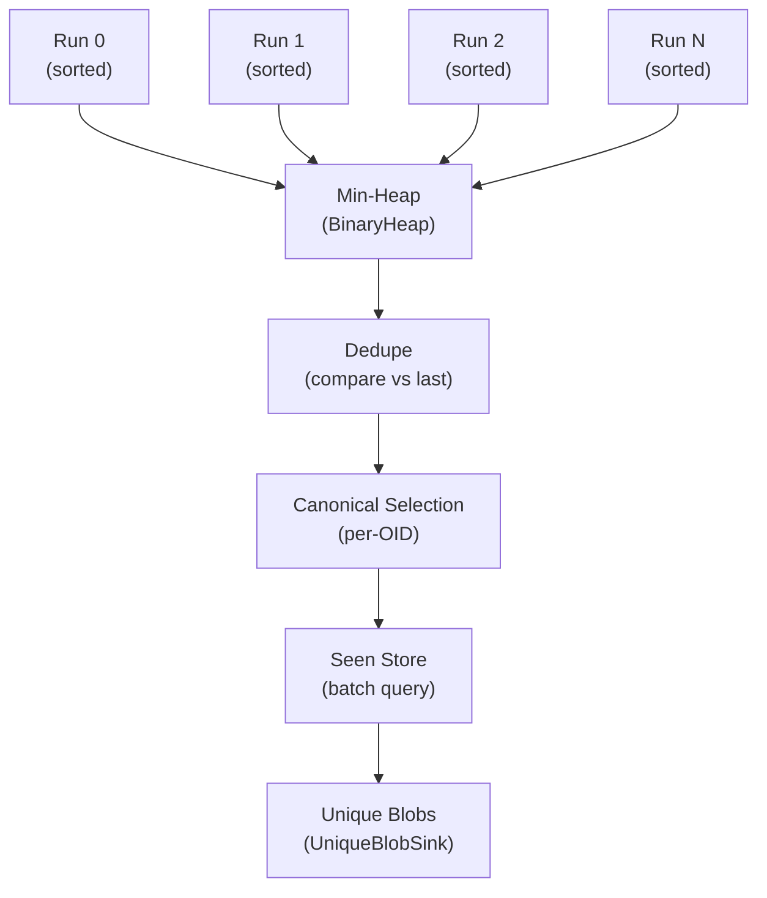

# Sorting Without Drowning -- External Spill and Dedup

*A monorepo scan walks 184,000 commits and produces 11.3 million candidate blobs across 47 refs. Each candidate carries a 20-byte OID, a path (average 68 bytes), a 4-byte commit ID, and context flags -- roughly 100 bytes per candidate, totaling 1.13 GB. The scanner runs in a container with a 2 GB memory limit shared with the detection engine. Loading all 11.3 million candidates into a single in-memory sort would consume more than half the available memory and risk OOM. Instead, the spiller fills a 64 MB chunk, sorts and deduplicates it, writes a sorted run file to disk (152 MB compressed), clears the chunk, and repeats. After 9 spill runs, a k-way merge reads all runs in sorted order, selects the canonical context for each OID, batches seen-store queries, and emits only the 2.1 million unique unseen blobs to the mapping bridge. Peak memory stays under 200 MB. This is the external sort pattern applied to Git candidate deduplication.*

---

Tree diffing and blob introduction produce candidates in commit order, not OID order. The same blob OID appears multiple times: once per commit that touches it, once per parent diff for merge commits, once per ref that includes the commit. Before pack planning, these duplicates must be collapsed to a single entry per unique OID, and each OID must be checked against the seen store to skip blobs scanned in previous runs. The spill pipeline handles this without unbounded memory.

## 1. The Spiller

The `Spiller` orchestrates chunk accumulation, disk spill, and merge. From `spiller.rs`:

```rust
/// Orchestrates spill runs and merge/dedupe.
///
/// The spiller is single-threaded and owns the temporary spill files. All run
/// files are deleted on drop, even if `finalize` fails.
#[derive(Debug)]
pub struct Spiller {
    limits: SpillLimits,
    oid_len: u8,
    spill_dir: PathBuf,
    runs: Vec<PathBuf>,
    spill_bytes: u64,
    chunk: CandidateChunk,
    candidates_received: u64,
}
```

Candidates are pushed one at a time. When the chunk is full, it spills to disk:

```rust
    pub fn push(
        &mut self,
        oid: OidBytes,
        path: &[u8],
        commit_id: u32,
        parent_idx: u8,
        change_kind: ChangeKind,
        ctx_flags: u16,
        cand_flags: u16,
    ) -> Result<(), SpillError> {
        match self.chunk.push(
            oid, path, commit_id, parent_idx, change_kind, ctx_flags, cand_flags,
        ) {
            Ok(()) => {
                perf_stats::sat_add_u64(&mut self.candidates_received, 1);
                Ok(())
            }
            Err(SpillError::ArenaOverflow) => {
                self.spill_chunk()?;
                self.chunk.push(
                    oid, path, commit_id, parent_idx, change_kind, ctx_flags, cand_flags,
                )?;
                perf_stats::sat_add_u64(&mut self.candidates_received, 1);
                Ok(())
            }
            Err(err) => Err(err),
        }
    }
```

The retry-after-spill pattern keeps the interface simple: callers push candidates without managing spill boundaries. The spiller detects overflow, flushes the chunk to disk, and retries the push.

## 2. SpillLimits -- Bounding Everything

Every resource is bounded. From `spill_limits.rs`:

```rust
#[derive(Clone, Copy, Debug)]
pub struct SpillLimits {
    /// Maximum total bytes for spill runs on disk.
    pub max_spill_bytes: u64,
    /// Maximum OIDs per seen-store batch query.
    pub seen_batch_max_oids: u32,
    /// Maximum bytes for the seen-store batch path arena.
    pub seen_batch_max_path_bytes: u32,
    /// Maximum candidates per in-memory chunk.
    pub max_chunk_candidates: u32,
    /// Maximum bytes for the chunk's path arena.
    pub max_chunk_path_bytes: u32,
    /// Maximum spill runs permitted.
    pub max_spill_runs: u16,
    /// Maximum path length allowed in spill records.
    pub max_path_len: u16,
}
```

The defaults are tuned for large repositories:

```rust
    pub const DEFAULT: Self = Self {
        max_spill_bytes: 64 * 1024 * 1024 * 1024, // 64 GB
        seen_batch_max_oids: 8_192,
        seen_batch_max_path_bytes: 512 * 1024, // 512 KB
        max_chunk_candidates: 1_048_576,
        max_chunk_path_bytes: 64 * 1024 * 1024, // 64 MB
        max_spill_runs: 128,
        max_path_len: 8 * 1024,
    };
```

The compile-time assertion enforces struct layout stability:

```rust
const _: () = SpillLimits::DEFAULT.validate();
const _: () = SpillLimits::RESTRICTIVE.validate();
const _: () = assert!(std::mem::size_of::<SpillLimits>() == 32);
```

## 3. Spilling to Disk

When the chunk fills, it is sorted, deduped, and written as a run file:

```rust
    pub fn spill_chunk(&mut self) -> Result<(), SpillError> {
        if self.chunk.is_empty() {
            return Ok(());
        }
        if self.runs.len() >= self.limits.max_spill_runs as usize {
            return Err(SpillError::SpillRunLimitExceeded {
                runs: self.runs.len(),
                max: self.limits.max_spill_runs as usize,
            });
        }

        self.chunk.sort_and_dedupe();
        let run_path = self
            .spill_dir
            .join(format!("spill-{}.run", self.runs.len()));
        let file = File::create(&run_path).map_err(SpillError::from)?;
        let writer = BufWriter::with_capacity(IO_BUFFER_SIZE, file);
        let header = RunHeader::new(self.oid_len, self.chunk.len() as u32)?;
        let mut run_writer = RunWriter::new(writer, header)?;

        for cand in self.chunk.iter_resolved() {
            run_writer.write_resolved(&cand)?;
        }
        let writer = run_writer.finish()?;
        let bytes = writer
            .into_inner()
            .map_err(|err| err.into_error())?
            .metadata()?
            .len();

        self.spill_bytes = self.spill_bytes.saturating_add(bytes);
        if self.spill_bytes > self.limits.max_spill_bytes {
            return Err(SpillError::SpillBytesExceeded {
                bytes: self.spill_bytes,
                max: self.limits.max_spill_bytes,
            });
        }

        self.runs.push(run_path);
        self.chunk.clear();
        Ok(())
    }
```

The I/O buffer is 256 KB (`IO_BUFFER_SIZE`), large enough to batch writes efficiently without excessive memory. Both the run count and total spill bytes are capped.

## 4. The SpillArena -- Mmapped Tree Bytes

For large tree payloads that exceed the cache, the `SpillArena` provides mmapped storage. From `spill_arena.rs`:

```rust
/// Append-only spill arena backed by a memory-mapped file.
#[derive(Debug)]
pub struct SpillArena {
    path: PathBuf,
    capacity: u64,
    cursor: u64,
    writer: MmapMut,
    reader: Arc<Mmap>,
}
```

The arena uses a dual-mapping strategy:

```rust
//! - **`writer` (`MmapMut`)** — used by the owning thread to append bytes.
//! - **`reader` (`Arc<Mmap>`)** — a read-only mapping shared with all
//!   `SpillSlice` handles.
```

The `SpillSlice` returned from `append` holds an `Arc` to the read mapping, so slices remain valid even after the arena is dropped:

```rust
#[derive(Clone, Debug)]
pub struct SpillSlice {
    reader: Arc<Mmap>,
    offset: u64,
    len: u64,
}

impl SpillSlice {
    pub fn as_slice(&self) -> &[u8] {
        let start = self.offset as usize;
        let end = start + self.len as usize;
        &self.reader[start..end]
    }
}
```

## 5. K-Way Merge

When finalize encounters on-disk runs, it merges them using a `RunMerger`. From `spill_merge.rs`:

```rust
/// K-way merge reader for spill runs.
pub struct RunMerger<R: Read> {
    cursors: Vec<RunCursor<R>>,
    heap: BinaryHeap<HeapItem>,
    last: Option<RunRecordKey>,
    current: Option<RunRecord>,
    pending_cursor: Option<usize>,
    oid_len: u8,
}
```

The merge uses a min-heap with reverse ordering:

```rust
impl Ord for HeapItem {
    fn cmp(&self, other: &Self) -> Ordering {
        // Reverse order for min-heap behavior.
        other
            .record
            .cmp(&self.record)
            .then_with(|| other.cursor.cmp(&self.cursor))
    }
}
```



Deduplication only compares against the last emitted record, which is sufficient because inputs are globally ordered. The cursor tie-breaker on `cursor` index ensures deterministic ordering across runs with identical records.

## 6. Canonical Context Selection

When multiple candidates share the same OID, the spiller selects a canonical context using a strict total order:

```rust
fn is_more_canonical(a_ctx: RunContext, a_path: &[u8], b_ctx: RunContext, b_path: &[u8]) -> bool {
    match a_ctx.commit_id.cmp(&b_ctx.commit_id) {
        Ordering::Less => return true,
        Ordering::Greater => return false,
        Ordering::Equal => {}
    }
    match a_path.cmp(b_path) {
        Ordering::Less => return true,
        Ordering::Greater => return false,
        Ordering::Equal => {}
    }
    match a_ctx.parent_idx.cmp(&b_ctx.parent_idx) {
        Ordering::Less => return true,
        Ordering::Greater => return false,
        Ordering::Equal => {}
    }
    match a_ctx.change_kind.as_u8().cmp(&b_ctx.change_kind.as_u8()) {
        Ordering::Less => return true,
        Ordering::Greater => return false,
        Ordering::Equal => {}
    }
    match a_ctx.ctx_flags.cmp(&b_ctx.ctx_flags) {
        Ordering::Less => return true,
        Ordering::Greater => return false,
        Ordering::Equal => {}
    }
    a_ctx.cand_flags < b_ctx.cand_flags
}
```

The ordering is: commit ID (lowest wins), path bytes, parent index, change kind, context flags, candidate flags. This produces the same canonical context regardless of the order in which candidates arrive, which is essential for deterministic output across scan modes and worker counts.

## 7. Seen-Store Batching

After canonical selection, each unique OID is checked against the seen store in bounded batches:

```rust
    fn flush_batch<S: SeenBlobStore + ?Sized, B: UniqueBlobSink>(
        &self,
        batch: &BatchBuffer,
        stats: &mut SpillStats,
        seen_store: &S,
        sink: &mut B,
    ) -> Result<(), SpillError> {
        if batch.is_empty() {
            return Ok(());
        }

        let seen_flags = seen_store.batch_check_seen(batch.oids())?;
        if seen_flags.len() != batch.len() {
            return Err(SpillError::SeenResponseMismatch {
                got: seen_flags.len(),
                expected: batch.len(),
            });
        }

        for (idx, blob) in batch.blobs().iter().enumerate() {
            if seen_flags[idx] {
                perf_stats::sat_add_u64(&mut stats.seen_blobs, 1);
            } else {
                sink.emit(blob, batch.paths())?;
                perf_stats::sat_add_u64(&mut stats.emitted_blobs, 1);
            }
        }

        Ok(())
    }
```

The batch buffer limits both OID count and path arena size:

```rust
struct BatchBuffer {
    oids: Vec<OidBytes>,
    blobs: Vec<UniqueBlob>,
    path_arena: ByteArena,
    max_oids: usize,
    max_path_bytes: u32,
}
```

Batching is necessary for seen stores backed by networked databases. A batch of 8,192 OIDs in a single round-trip is far more efficient than 8,192 individual queries.

## 8. Statistics

The spill pipeline produces comprehensive statistics:

```rust
#[derive(Debug, Clone, Default)]
pub struct SpillStats {
    /// Total candidates received.
    pub candidates_received: u64,
    /// Unique OIDs after global dedupe.
    pub unique_blobs: u64,
    /// Spill runs written to disk.
    pub spill_runs: usize,
    /// Total spill bytes written.
    pub spill_bytes: u64,
    /// OIDs filtered out as already seen.
    pub seen_blobs: u64,
    /// OIDs emitted to the sink.
    pub emitted_blobs: u64,
}
```

For the monorepo example: 11.3M candidates received, 2.4M unique blobs after dedupe, 9 spill runs totaling 1.37 GB on disk, 0.3M already-seen blobs filtered, 2.1M blobs emitted to the mapping bridge.

## 9. Cleanup and Safety

The spiller owns its temporary files and cleans them up on drop:

```rust
impl Drop for Spiller {
    fn drop(&mut self) {
        self.cleanup_runs();
    }
}
```

```rust
    fn cleanup_runs(&mut self) {
        for path in self.runs.drain(..) {
            let _ = fs::remove_file(path);
        }
    }
```

Best-effort cleanup via `Drop` ensures run files are removed even if `finalize` panics or returns an error.

## Summary / What's Next

The spill pipeline deduplicates millions of candidates without unbounded memory by sorting in-memory chunks, spilling sorted runs to disk, and merging them with a k-way heap. Canonical context selection and seen-store batching produce the minimal set of unique unseen blobs.

[Chapter 7](07-pack-planning-and-execution.md) takes these unique blobs and maps them to pack offsets, builds per-pack decode plans with delta dependency resolution, and executes the plans with zlib inflate and delta application.
